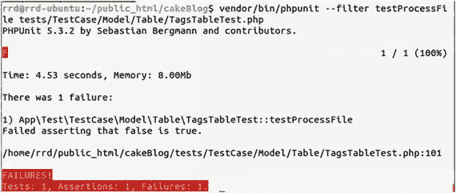
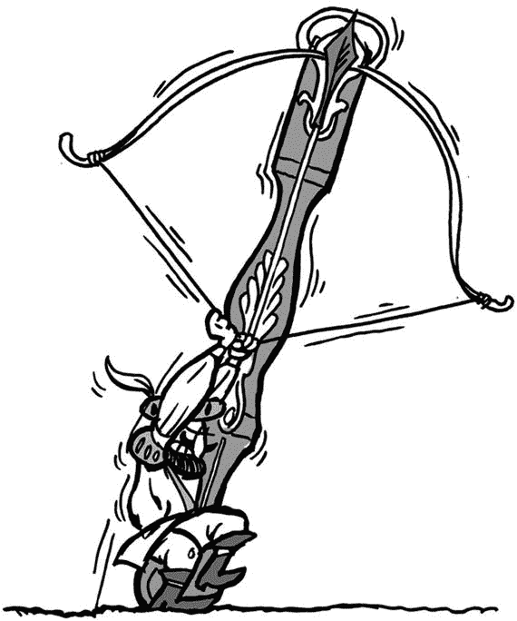

# 10. 模拟对象


小猪，小猪，让我进去

我们经常需要模拟组件、模型、对象，甚至核心 PHP 函数。你可以在任何测试函数中创建模拟对象，或者如果所有测试函数都需要模拟对象，可以在 `setUp()` 方法中创建。

模拟对象确保你的测试运行得更快，而不必实际拥有所有必需的对象。

## 模拟会话

`IntegrationTestCase` 类提供了一些辅助方法来模拟请求对象，包括会话、Cookie、标头等。

让我们来看一个会话变量的示例。其他方法的操作类似。

首先创建测试方法。修改 `/tests/TestCase/Controller/CategoriesControllerTest.php` 文件中的 `testIndex()` 方法。

```
1  public function testIndex()
2  {
3      $this->get('/categories');
4      $this->assertResponseNotContains('Category 2');
5
6      $this->session(['isAdmin' => true]);
7      $this->get('/categories');
8      $this->assertResponseContains('Category 2');
9  }
```

我们定义了两个断言。两者都调用 `/categories`，第一个没有定义会话变量，第二个定义了会话变量。因此，第一个不应包含 `Category 2`，而第二个应包含。值 `Category 2` 来自我们在第 9 章中创建的固定数据集。

更新 `/src/Controller/CategoriesController.php` 文件中的 `index()` 方法。

```
1  public function index()
2  {
3      if (!$this->request->session()->read('isAdmin')) {
4          $this->paginate['limit'] = 1;
5      }
6      $categories = $this->paginate($this->Categories);
7      $this->set(compact('categories'));
8      $this->set('_serialize', ['categories']);
9  }
```

如果你没有 `isAdmin` 会话变量，则将分类列表限制为 1。这个例子有点傻，但它向你展示了如何模拟会话变量。

## 模拟模型方法

有时，为了节省时间或简化操作，你可能想模拟模型方法。在测试驱动开发（TDD）中，即使在方法尚未编写时，模拟也能帮助你进行测试。模拟可以提供所需的返回值，这样当其他团队成员正在开发被模拟的方法时，你可以继续编写测试。让我们看几个如何使用模拟的示例。

在 `CategoriesTableTest.php` 文件中创建一个新的测试。

```
1  public function testDoSomething()
2  {
3      $this->assertTrue($this->Categories->doSomething());
4  }
```

让我们在 `/src/Model/Table/CategoriesTable.php` 文件中创建被测试的方法本身。

```
1  public function doSomething()
2  {
3      if ($this->slowFunction()) {
4          return true;
5      } else {
6          return false;
7      }
8  }
9
10  public function slowFunction ()
11  {
12      sleep(30);
13      return true;
14  }
```

同样，这是一个傻例子，但它说明了我们的意图。`doSomething()` 方法调用了另一个运行很慢的函数。如果我们运行测试，它会成功，但需要超过 30 秒才能完成。显然，我们不想多次运行它。在 `testDoSomething()` 中，我们想测试 `doSomething()`，而不是 `slowFunction()`。让我们模拟它。

或许我们也应该测试 `slowFunction()`，但那是另一个话题了。

```
1  public function testDoSomething ()
2  {
3      $model = $this->getMockForModel('Categories', ['slowFunction']);
4      $model->expects($this->once())
5          ->method('slowFunction')
6          ->will($this->returnValue(true));
7      $this->assertTrue($model->doSomething());
8  }
```

让我解释一下这里发生了什么。

我们将模拟直接放在 `test` 方法中，因为我们只在需要它；否则，我们可以将其放在 `setUp()` 方法中，使其对所有测试都可用。

然后，我们通过调用 `getMockForModel()` 方法来生成模拟对象。该方法的第一个参数是被模拟的表类的别名。第二个参数是要模拟的方法数组，在我们的例子中，只有 `slowFunction()` 方法。

然后，通过 `expects()` 调用，我们确保当模型首次调用 `$this->slowFunction()` 时，它应返回 `true`。之后，我们调用 `$model->doSomething()` 进行断言。它将调用被模拟的 `slowFunction()` 方法。

## expects 方法

`expects` 方法接受以下参数值：

- `once()` 如果方法恰好被调用一次，则测试通过。
- `never()` 如果方法曾被调用，则测试失败。
- `any()` 如果方法被调用零次或多次，则测试通过。
- `at($index)` 匹配第 `$index` 次调用。该索引值会在每次调用模拟方法时递增，而不仅仅是在调用指定方法时。
- `exactly($times)` 仅当方法被调用 `$times` 次时，测试通过。
- `atLeastOnce()` 如果方法被调用超过一次，则测试通过。


### 更复杂的模拟示例

模拟可以根据测试需求，像上一个示例那样简单，也可以更加复杂。请记住，过于复杂的模拟会降低测试的可读性，因此更好的做法是使用简单的模拟，并通过更多的测试方法来覆盖不同的场景。无论如何，下面是一个更复杂的模拟示例：

```
1  $model = $this->getMockForModel('Categories', ['hasPostsCount']);
2  $model->expects($this->any())
3      ->method('hasPostsCount')
4      ->with($this->logicalOr(5, 10, $this->anything()))
5      ->will(
6          $this->returnCallback(
7              function ($param) {
8                  if ($param == 5) {
9                      return [5, 10, 15];
10                  } elseif ($param == 10) {
11                      return [10, 20, 30];
12                  } else {
13                      return false;
14                  }
15              }
16          )
17      );
18  $model->expects($this->any())
19      ->method('hasPostsCount')
20      ->will($this->returnValue(null));
21  $this->assertEquals([5, 10, 15],$model->hasPostsCount(5));
22  $this->assertEquals([10, 20, 30], $model->hasPostsCount(10));
23  $this->assertEquals(false, $model->hasPostsCount(1));
```

我认为这个示例足够直观。如果 `model` 调用：

*   `hasPostsCount(5)`，将返回 `[5, 10, 15]`
*   `hasPostsCount(10)`，将返回 `[10, 20, 30]`
*   `hasPostsCount(任何其他值)`，将返回 `false`。

请记住：我们的 `Categories` 表类中实际上并没有 `hasPostsCount()` 方法。因此，通过模拟，我们甚至可以在编写方法之前就使用它们。

查看 PHPUnit 手册（`www.phpunit.de/manual/3.0/en/api.html`）以获取 `expects` 方法的完整列表。

### 模拟核心 PHP 函数

有时，虽然很少见，我们不得不模拟核心 PHP 函数，例如，测试文件上传、处理流、时间和日期等。因此，当代码依赖于测试环境中不具备的条件时，这项技术就很有用。

让我们看一个例子。在我们的博客应用中，我们希望构建一个 CSV 导入功能，用户可以通过该功能上传标签，因为手动创建大量标签会很无聊。

将以下代码行添加到 `/tests/TestCase/Model/Table/TagsTableTest.php` 文件的末尾。

```
1  public function testProcessFile()
2  {
3      $actual = $this->Tags->processFile('noFile');
4      $this->assertTrue($actual);
5  }
```

或许我们应该先创建 `processFile` 方法本身。将以下代码添加到 `/src/Model/Table/TagsTable.php` 文件中：

```
1  public function processFile($file)
2  {
3      if (is_uploaded_file($file)) {
4          //处理文件
5          return true;
6      }
7      return false;
8  }
```

该方法目前不对文件做任何处理，因为文件处理不是当前讨论的主题。唯一有趣的是我们调用了 PHP 核心函数 `is_uploaded_file`。

让我们运行测试。

```
vendor/bin/phpunit --filter testProcessFile tests/TestCase/Model/Table/TagsTableTest.php
```

不出所料。测试失败了，因为我们并没有上传任何内容（见图 10-1）。问题是，我们根本不想上传任何文件，因为我们要测试的是文件处理，而不是文件上传。因此，我们希望 `is_uploaded_file` 返回 `true`，尽管我们没有上传文件。



图 10-1. 核心 PHP 函数测试失败

PHP 命名空间允许我们专门为该命名空间重新声明或覆盖 PHP 核心函数，这样就不会污染代码的其他部分。

 以下解决方案只是一种变通方法。在单个文件中使用多个命名空间是一种不好的实践。

将以下代码行添加到 `TagsTableTest.php` 文件的开头：

```
1  <?php
2  namespace {
3      // 这允许我们配置“全局模拟”的行为
4      $mockIsUploadedFile = false;
5  }
```

在第 4 行，我们为全局命名空间创建了一个变量 `$mockIsUploadedFile`。我们使用这个变量来切换 PHP 核心函数 `is_uploaded_file` 和其对应的重新定义的命名空间变体。

```
7  namespace App\Model\Table {
8      function is_uploaded_file()
9      {
10          global $mockIsUploadedFile;
11          if ($mockIsUploadedFile === true) {
12              return true;
13          } else {
14              return call_user_func_array(
15                  '\is_uploaded_file',
16                  func_get_args()
17              );
18          }
19      }
20  }
```

在第 8 行，我们为 `\App\Model\Table` 命名空间重新声明了 `is_uploaded_file` 函数。如果 `$mockIsUploadedFile` 为 `true`，我们直接返回 `true` 作为模拟结果；否则，我们调用 PHP 的核心函数 `is_uploaded_file`。

在这个文件中，我们需要做的最后一件事是将原来的简单命名空间声明替换为花括号语法。

在第 22 行，我们有如下的简单声明：

```
22  namespace App\Test\TestCase\Model\Table;
```

这应改为花括号声明，如下所示：

```
22  namespace App\Test\TestCase\Model\Table {
```

这可能意味着我们需要在文件末尾添加一个闭合的花括号——并将此命名空间中的所有内容缩进一级。

此时，我们的测试应该能够成功运行并显示绿色条。

### 小结

本章介绍了模拟的概念。您学习了如何模拟会话、请求数据以及模型方法。还提供了一个模拟核心 PHP 函数的示例，并学习了何时使用它。

### 控制器测试 2



我感到有些紧张


