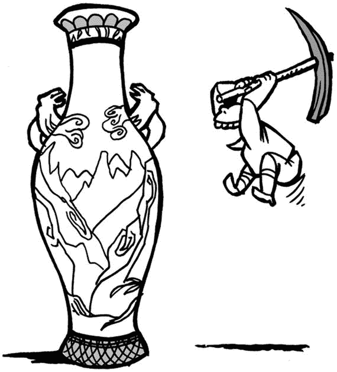
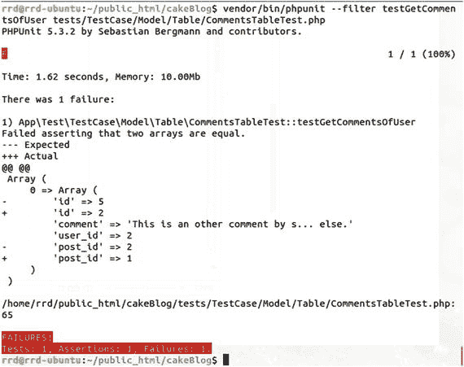

# 13. 从命令行进行测试



你需要合适的工具才能做好工作

运行测试可能很耗时，但这不需要任何用户交互。因此，测试是自动化的理想目标。CakePHP 有一个内置的测试 shell，我们在前面的章节中已经使用过。如前所述，在浏览器中进行测试很无聊、耗时，而且不是最佳选择。通过单元测试，你可以在不接触浏览器的情况下进行开发。这一点可以显著缩短开发时间。

### 调试消息

调试消息会写入控制台，因此你可以通过执行测试来查看它们。所以，如果你的代码中有 `debug($result);`，那么此调用的输出将显示在控制台中。

### 运行所有测试

在部署之前，你将运行所有测试，以检查一切是否正确。以下命令将运行你所有的测试：

```
$ cd ∼/public_html/cakeBlog
$ vendor/bin/phpunit
```

一个测试覆盖率良好的中型项目可能需要 30 分钟到 2 到 3 小时才能运行完毕。

### 运行测试套件

下一级是运行测试套件。当你正在开发某个功能并为此功能设置了测试套件时，就需要运行它。

如果你使用了 `TestSuite`，那么你将运行类似如下的命令：

```
$ cd ∼/public_html/cakeBlog
$ vendor/bin/phpunit tests/TestCase/AllModelTableTest.php
```

如果你在 `phpunit.xml.dist` 中定义了测试套件，则需要使用以下命令：

```
$ cd ∼/public_html/cakeBlog
$ vendor/bin/phpunit --testsuite ExcitingFeature
```

### 运行文件中的所有测试

当你想要运行一个测试文件中的所有测试时，例如，在你的 `UsersTableTest.php` 文件中，你应该运行以下命令：

```
$ cd ∼/public_html/cakeBlog
$ vendor/bin/phpunit tests/TestCase/Model/Table/UsersTableTest.php
```

当你只处理一个模型时，你会用到这个命令。你的模型是松散耦合的，因此你只想检查一个模型。

### 过滤测试用例

在开发过程中，大多数时候，你只会针对当前正在处理的内容运行一个测试。`--filter` 选项就用于此目的。

```
$ cd ∼/public_html/cakeBlog
$ vendor/bin/phpunit --filter testDoSomething tests/TestCase/Model/Table/CategoriesTableTest.php
```

### 理解失败测试的输出

PHPUnit 会显示断言中实际结果与预期结果之间的差异。

我们已经创建了 `/tests/Fixture/CommentsFixture.php`，所以现在是时候更改 `$records` 数组了。

```
1  public $records = [
2      [
3          'id' => 1,
4          'comment' => '这是我的第一条评论。',
5          'user_id' => 1,
6          'post_id' => 1
7      ],
8      [
9          'id' => 2,
10          'comment' => '这是其他人写的另一条评论。',
11          'user_id' => 2,
12          'post_id' => 1
13      ],
14      [
15          'id' => 3,
16          'comment' => '大声喊出 Gouranga，快乐起来',
17          'user_id' => 1,
18          'post_id' => 1
19      ],
20  ];
```

因此，我们有三个评论，它们都属于第一篇文章。评论 1 和 3 由用户 1 创建；评论 2 由用户 2 创建。

向 `/tests/TestCase/Model/Table/CommentsTableTest.php` 添加一个新的测试函数，如下所示：

```
1  public function testGetCommentsOfUser()
2  {
3      $actual = $this->Comments->getCommentsOfUser(2);
4      $expected = [
5          [
6              'id' => 5,
7              'comment' => '这是其他人写的另一条评论。',
8              'user_id' => 2,
9              'post_id' => 2
10          ]
11      ];
12      $this->assertEquals(
13          $expected,
14          $actual->hydrate(false)->toArray()
15      );
16  }
```

当我们调用 `getCommentsOfUser()` 方法时，我们期望得到前面的数组。

最后，在 `/src/Model/Table/CommentsTable.php` 中创建 `getCommentsOfUser()` 方法。

```
1  public function getCommentsOfUser($userId)
2  {
3      return $this->find()
4          ->where(['user_id' => $userId]);
5  }
```

现在是时候进行测试了。

```
$ cd ∼/public_html/cakeBlog
$ vendor/bin/phpunit --filter testGetCommentsOfUser tests/TestCase/Model/Table/CommentsTableTest.php
```

我们将得到以下输出，如图 13-1 所示：



图 13-1. 失败的测试

红色的字母 F 表示我们的测试失败了。

下一行显示测试的执行时间和使用的内存。

我们可以看到哪个测试文件的哪个方法失败了，以及一条描述失败原因的消息。

然后我们可以看到预期结果和实际结果之间的差异。减号 (-) 表示预期结果；加号 (+) 表示实际结果。

因此，该图显示我们期望一个只包含一个成员的数组，该成员是另一个数组。这是符合预期的。

预期的 id 是 5，但实际的 id 是 2。`comment` 和 `user_id` 在预期数组和实际数组中相等，但 `post_id` 再次不同。

然后下一行显示失败断言的行号。

最后，我们可以看到所运行测试的汇总报告。

### 中断测试

你可以随时通过按下 `Ctrl+C` 在控制台停止正在运行的测试。如果这样做，请不要忘记检查你的测试数据库，因为如果你在测试移除所有条目之前中断了测试的执行，数据库条目可能会残留下来。

### 总结

在本章中，你学习了如何使用 `debug` 提供的信息，如何一次性运行所有测试，以及如何过滤测试。提供了测试输出的概述，并且你学习了如何中断测试。

