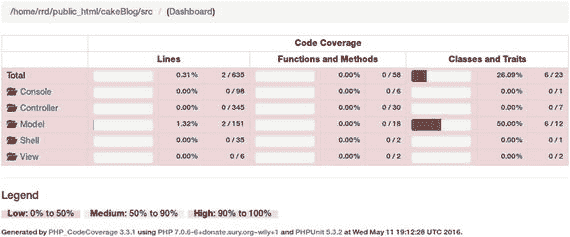
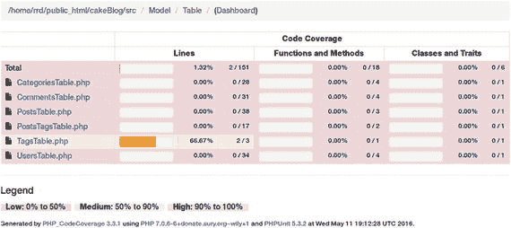
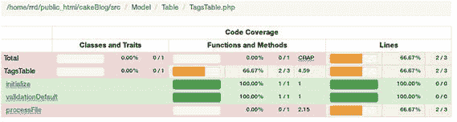
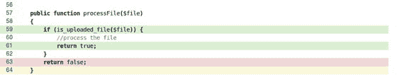

# 代码覆盖率

代码覆盖率有助于识别未经过测试覆盖的代码部分。理论上可以达到 100%的覆盖率，但大多数情况下，你会低于这个百分比。

生成代码覆盖率非常简单，就像小菜一碟。我们可以使用前一章所述相同的选项，为所有测试、测试套件或仅针对测试文件生成覆盖率。

```
$ cd ∼/public_html/cakeBlog
$ vendor/bin/phpunit --coverage-html webroot/coverage tests/TestCase/Model/Table/UsersTableTest.php
```

现在，打开浏览器并查看应用的`coverage/index.html`文件。在我的例子中，该文件位于`http://localhost/∼rrd/cakeBlog/coverage/index.html`（图 14-1）。



图 14-1. 代码覆盖率索引页面

你可以看到代码覆盖率的摘要信息。由于我们只针对一个模型文件生成了覆盖率，因此覆盖率非常低。你可以点击 Model 查看其详细内容。我们可以看到只有`TagsTable.php`有测试覆盖（图 14-2）。



图 14-2. 模型的代码覆盖率

点击此处可以深入查看。在页面顶部，我们可以看到有哪些方法，哪些方法被测试覆盖，以及有多少行代码被测试覆盖（图 14-3）。



图 14-3. Tags 模型的代码覆盖率

如果我们向下滚动，可以看到`processFile()`方法被部分覆盖（图 14-4）。



图 14-4. 方法级代码覆盖率

绿色线条表示已覆盖，红色线条表示未覆盖，白色线条表示不可执行。

## 测试夹具数据

创建测试夹具很乏味，而自动生成的测试夹具中充斥着无用的数据。我们需要一个既简单又智能的解决方案，能够使用真实数据维护表关系。

PHPMyAdmin（[`http://phpmyadmin.net`](http://phpmyadmin.net)）提供了一种导出表数据的方法。选择`PHP array`作为格式，选择`custom`作为类型。然后你可以定义要从现有记录中提取多少行数据。

虽然 PHPMyAdmin 是一个完整的 MySQL 管理工具，可以用来创建、编辑和删除数据库、表、字段和记录，但它不仅仅用于为测试夹具导出数据。如果你对它还不熟悉，现在正是熟悉它的时候。如果你已经习惯了终端操作，也可以学习使用 MySQL 控制台。

## 测试私有方法

我们已经看到了很多测试`public`方法的例子。测试`protected`方法与之相同。

如果我们尝试测试一个`private`方法，将会收到一个报错信息，提示该方法不存在。

让我们在`/src/Model/Table/PostsTable.php`中创建一个`private`方法：

```
1  private function getPostsInCategory($categoryId)
2  {
3      return $this->find()
4          ->where(['category_id' => $categoryId]);
5  }
```

再次说明，虽然这是一个关于`private`方法的简单示例，但它足以用来演示如何测试`private`方法。

为了能够进行测试，`Private`方法应该通过反射类进行实例化。将以下代码粘贴到`/tests/TestCase/Model/Table/PostsTableTest.php`中：

```
1  public function testGetPostsInCategory()
2  {
3      $class = new ReflectionClass($this->Posts);
4      $method = $class->getMethod('getPostsInCategory');
5      $method->setAccessible(true);
6      $actual = $method->invoke($this->Posts, 1);
7      $expected = 1;
8      $this->assertEquals($expected, $actual->toArray()[0]->id);
9  }
```

为了让其工作，我们需要在文件的开头包含`ReflectionClass`。

```
1  use ReflectionClass;
```

许多开发者说你不应该测试`private`方法。这里我不深入讨论他们的论点细节，由你自己决定是否测试它们。

## 测试视图

通常，我们不像测试模型和控制器那样测试视图。HTML 容易发生变更，而且大部分内容无法进行测试。如果你想检查视图中的数据，最好的方法是依赖`assertContains`方法。Selenium（[`http://seleniumhq.org/`](http://seleniumhq.org/)）是一个用于测试视图的工具。

## 测试组件

如果你在`/src/Controller/Component/YourComponent.php`创建了自己的组件，那么应该将其测试文件放在`/tests/TestCase/Controller/Component/YourComponentTest.php`中。

在你的测试类的`setUp()`方法中，你应该模拟（Mock）Cake 的`Controller`类并注册你的组件。

一个示例`setUp()`方法如下：

```
1  public function setUp()
2  {
3      parent::setUp();
4      $request = new Request();
5      $response = new Response();
6      $this->controller = $this->getMock(
7          'Cake\Controller\Controller',
8          null,
9          [$request, $response]
10      );
11      $registry = new ComponentRegistry($this->controller);
12      $this->component = new YourComponent($registry);
13  }
```

在`tearDown()`方法中，我们应该解除由`setup()`创建的类变量。

```
1  public function tearDown()
2  {
3      parent::tearDown();
4      unset($this->component, $this->controller);
5  }
```

假设`YourComponent`处理分页逻辑。它有一个`textToNumber()`方法，该方法根据文本参数将分页的显示数量设置为不同的数值。例如，如果调用了`textToNumber('long')`，分页的显示数量将被设置为 100。在这种情况下，我们的测试方法将如下所示：

```
1  public function testTextToNumberLong()
2  {
3      $this->component->textToNumber('long');
4      $this->assertEquals(100, $this->controller->paginate['limit']);
5  }
```

我们调用了组件的`textToNumber()`方法，然后通过断言检查了控制器的分页显示数量值。

## 测试帮助器

假设我们有一个帮助器，它根据自千禧年以来经过的天数创建一个日期字符串。将以下代码粘贴到`/src/View/Helper/EasyDateHelper.php`中：

```
1  namespace App\View\Helper;

3  use Cake\View\Helper;

5  class EasyDateHelper extends Helper
6  {
7      public function add($days)
8      {
9          return 'D: ' . date('Y-m-d', mktime(0, 0, 0, 1, $days, 2000));
10      }
11  }
```

对应的测试文件应该是`/tests/TestCase/View/Helper/EasyDateHelperTest.php`。它与模型测试非常相似，区别在于我们需要在`setUp()`方法中调用帮助器的构造函数。

```php
namespace App\Test\TestCase\View\Helper;

use App\View\Helper\EasyDateHelper;
use Cake\TestSuite\TestCase;
use Cake\View\View;

class EasyDateHelperTest extends TestCase
{
    public $helper = null;

    public function setUp()
    {
        parent::setUp();
        $View = new View();
        $this->helper = new EasyDateHelper($View);
    }

    public function testAdd()
    {
        $this->assertEquals('D: 2000-01-15', $this->helper->add(15));
        $this->assertEquals('D: 2000-04-09', $this->helper->add(100));
        $this->assertEquals('D: 2002-09-26', $this->helper->add(1000));
    }
}
```

当你测试一个使用了其他帮助器的`Helper`时，请确保模拟（Mock）`View`类的`loadHelpers`方法。

## 测试插件

如果你在`/src/plugins`目录下有一个名为Pizza的插件，你应该将所有的测试放在`/src/plugins/Pizza/tests`文件夹中，并使用与`/tests`目录下相同的子文件夹结构。

```php
namespace Pizza\Test\TestCase\Model\Table;

use Pizza\Model\Table\PizzaSlicesTable;
use Cake\TestSuite\TestCase;

class PizzaSlicesTableTest extends TestCase
{
    public $fixtures = ['plugin.pizza.pizza_slices'];

    public function testTaste()
    {
        // 测试比萨片的口感
    }
}
```