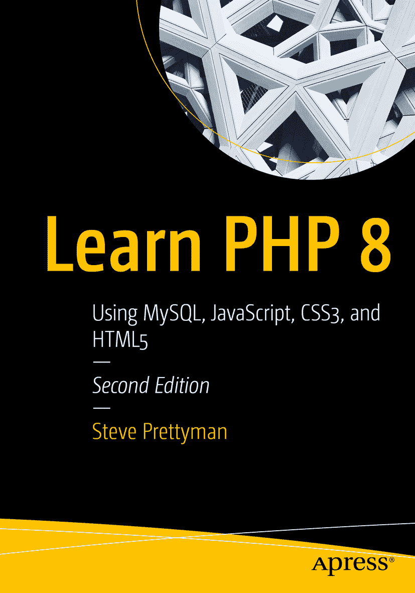

ISBN 978-1-4842-6239-9 电子书 ISBN 978-1-4842-6240-5 [`doi.org/10.1007/978-1-4842-6240-5`](https://doi.org/10.1007/978-1-4842-6240-5) © Steve Prettyman 2020 本作品受版权保护。出版商保留所有权利，涉及整体或部分材料，特别是翻译权、重印权、插图复用权、朗诵权、广播权、缩微胶片复制权或任何其他物理形式的复制权，以及信息存储与检索的传输权、电子改编权、计算机软件使用权，或目前已知或今后开发的任何类似或不同的方法。即使没有明确声明，在本出版物中使用通用描述性名称、注册商标、商标、服务标志等，也不意味着此类名称免于相关保护法律和法规的约束，因此可自由使用。出版商、作者和编辑假定本书中的建议和信息在出版之日是真实准确的。出版商、作者或编辑均不对本文所含材料或可能存在的任何错误或疏漏提供明示或暗示的担保。出版商对已出版地图和机构归属中的管辖权主张保持中立。本书通过全球图书贸易由 Apress Media, LLC 发行，地址：1 New York Plaza, New York, NY 10004, U.S.A.，电话：1-800-SPRINGER，传真：(201) 348-4505，电子邮件：orders-ny@springer-sbm.com，或访问 www.springeronline.com。Apress Media, LLC 是一家加利福尼亚有限责任公司，其唯一成员（所有者）是 Springer Science + Business Media Finance Inc (SSBM Finance Inc)。SSBM Finance Inc 是一家特拉华州公司。

*本版献给全球所有重要工作者，感谢他们帮助使世界免受疾病（流行病）和其他自然灾害的影响。你们的奉献让世界变得更美好。你们支持佛罗里达州基韦斯特（美国）的座右铭——“一个人类大家庭”。*

## 引言

《学习 PHP 8：使用 MySQL、JavaScript、CSS3 和 HTML5》旨在作为初学者和中级编程书籍使用。本书的目标不是涵盖 PHP 编程语言当前版本中的高级技术。读者需要具备一些通用编程概念的知识，但假设没有实际的编程经验或教育背景。

本书中的所有代码示例均兼容 PHP 8。大多数示例也兼容 PHP 7。书中使用了 PHP 中最新（截至出版日期）可用的方法（函数），为读者提供最前沿的编码技术。这些示例使用了 PHP 语言提供的核心方法。PHP 包含许多其他方法来完成类似任务。读者可以且应当研究其他提高安全性、性能及其他技术的方法。本书的目标是促使读者始终考虑使用最安全、最高效的程序开发方法。本书中的代码提供了一些使用这些技术的示例。用户应记住，*没有程序是 100%安全的*。程序员只能尽力使应用尽可能安全。这需要开发团队、网络人员、安全管理员、数据中心人员等共同努力，以提供最安全的环境。

### 不同之处

目前市场上有不少 PHP 书籍。本书与它们有何不同？

-   本书采用“做中学”的概念，向读者展示如何使用条件语句、循环、数组和方法开发应用程序。书中通过编码示例介绍并演示了超过 70 个 PHP 方法（函数）。

-   在本书的早期章节中，读者就已接触到面向对象（OO）编程技术。许多其他书籍仅在最后几章简要介绍（甚至根本不介绍）面向对象编程。

-   使用面向对象的 set 方法来验证和过滤用户输入。许多其他书籍仅仅展示一个接受数据并存储的`set`方法。

-   本书的一个主要目标是说服读者尽可能安全、高效地创建所有程序。书中演示了最新的密码加密技术（`password_hash`）。

-   引入了`try`和`catch`方法来捕获异常和某些错误。最新版本的 PHP 已采用这种方法来处理异常和错误。

-   在早期章节中介绍了多层程序设计。这使读者能够发现每一层应包含的逻辑和编码。许多 PHP 书籍甚至不涉及此主题。

-   本书中的大部分示例用于开发一个主要应用程序（ABC Canine Shelter Reservation System）。随着书籍的推进，应用程序从零开始，分阶段构建，向读者展示应用程序开发应分阶段进行。只有每个阶段完成并测试后，才能开始下一阶段。这种方法与多层设计相辅相成。此外，还提供额外的编程练习和一个学期项目，以增强对开发的理解。

-   介绍了用户日志、变更日志和错误日志的创建。这使得读者能够理解如何提供备份和恢复能力，以便在发生安全漏洞或异常时保持应用程序正常运行。

-   数据对象和数据层的引入向读者展示了创建一个能够在不需重大重写的情况下更改数据存储技术和数据存储位置的应用程序的重要性。书中提供了 XML、JSON 和 MySQL 的示例。

-   全书展示了 PHP、HTML5、CSS3 和 JavaScript 之间的自然关系。这种关系是 PHP 的主要优势之一。

-   全书提供了网络链接，引导用户获取额外资源，以帮助理解材料或深入探究主题。链接位置的更新将在本书的网站上提供。

### 给教师的特别说明

本书内容的设计为教学风格和方法提供了灵活性。每所学院和大学对编程概念的初步教育方法各不相同。本书提供了三种不同类型的编程练习，允许教师根据自身环境选择最合适的内容。每章均设有“动手实践”练习，让学生通过修改现有示例来产生预期结果，从而获得实践经验。这些练习在学生尝试编写章节末尾的编程练习之前，为他们建立了一定的信心。此外，还提供了一个学期项目，用于构建一个与书中所示算法和编程技术类型相同的应用程序。

### 代码示例、图片和链接

我们已尽一切努力捕捉代码（和语法）中的任何错误。如果您在本书中发现任何问题，请告知我们。请将所有更正发送至 Steve Prettyman（`steve_prettyman@hotmail.com`）。

所有代码示例、图片和链接均可通过本书产品页面上的 **下载源代码** 链接获取，该页面位于 [`www.apress.com/9781484262399`](http://www.apress.com/9781484262399) 以及以下位置。由于出版格式要求，从本书复制代码可能导致错误。

### 章节概览