# 1. PHP 8 简介

> *PHP 是一种流行的通用脚本语言，特别适用于 Web 开发。PHP 快速、灵活且务实，从你的博客到世界上最流行的网站，一切皆可驱动。*
>
> — [`www.php.net`](http://www.php.net)

## 章节目标/学生学习成果

完成本章学习后，学生将能够：

- 理解 `LAMP`、`WAMP` 和 `MAMP` 之间的区别
- 成功安装某个版本的 `LAMP`、`WAMP` 或 `MAMP`
- 通过互联网搜索排查问题
- 解释编程语言与脚本语言的区别
- 创建一个无错误的简单 PHP 程序


### PHP 7、PHP 7.4+、PHP 8 与 PHP.NET

如今，`PHP`（超文本预处理器）是用于 Web 应用程序开发的最流行的语言之一。该语言经过不断演进，允许程序员使用`过程式`和`面向对象`的编程技术快速开发结构良好、无错误的程序。它提供了使用许多预存代码库的能力，这些代码库要么随基础安装自带，要么可以在 PHP 环境中安装。这为你提供了多种完成特定任务的方式。它比许多其他语言提供了更多的灵活性。能够轻松地将额外的代码库添加到环境中，是其广受欢迎的众多驱动力之一。

- `过程式语言` — 一种过程式编程语言包含可以从程序主流程中调用的函数/方法。程序流程跳转到该函数/方法，执行模块内的代码，然后返回到程序主流程中的下一条语句。有些过程式语言包含一个主函数/方法，当程序执行时，它会被自动调用。

- `面向对象语言` — 一种面向对象语言使用类和对象。类类似于蓝图。一个类描述了一个对象可以包含的内容，包括属性/变量和函数/方法。对象是类的一个实例（就像根据蓝图建造的建筑物）。面向对象语言提供了多态性、封装性和继承性。对象通过将所有相关的函数/方法和属性/变量包含在对象自身内部而自然地被封装起来。多态性允许在面向对象的对象中使用重复的方法/函数名称。然而，“签名”必须不同。“签名”是传递给方法/函数的变量类型（数字和字符）以及从方法/函数传出的信息类型的组合。例如，可以创建多个`add`方法——一个只接受整数（整数），一个只接受浮点数（带小数点的数字），还有一个接受组合类型。程序将根据传递给方法/函数的内容来决定调用哪个方法/函数。面向对象编程中的继承性允许一个对象从另一个对象继承属性/变量和函数/方法。该对象也可以覆盖那些继承来的项。这类似于孩子从父母那里继承特征。面向对象语言也可以是事件驱动的。事件驱动程序会“休眠”，直到某个事件发生。这类似于 ATM 机程序等待用户插入 ATM 卡或走到机器前。

PHP 是一种`开源`语言。因此，该语言的每个版本都是在使用它的人——即程序员自身——的输入下创建的。这使得该语言能够随着时间推移不断演进，并朝着用户驱动的方向发展。自 1995 年由拉斯马斯·勒德尔夫首次发布为个人主页工具（PHP）以来，其各个版本已在互联网上发布，并配有论坛，让用户能够提出建议，甚至提供代码更改和补充。如今，[`www.php.net`](http://www.php.net) 是 PHP 的官方网站。

- `开源语言` — 一种开源编程语言由相关利益方组成的社区开发。社区接受来自同行程序员的输入，以获取建议的升级和更正。社区中的一些成员共同提出提案并对语言进行更改。开源语言是“免费”的。非开源语言（例如微软 C#）由一家公司或主要组织创建和更新。非开源语言通常不是“免费”的。

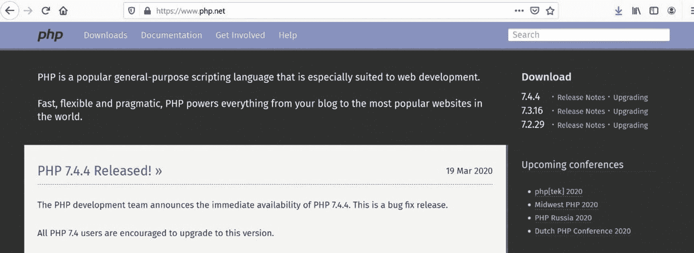

图 1-1

PHP.NET（2020 年 3 月 28 日）

[`www.php.net`](http://www.php.net) 主页提供了该语言每个最新版本的信息。它还提供了关于未来版本、这些版本计划的功能以及计划发布日期等信息。此外，还可以找到其他相关的 PHP 信息，包括主要 PHP 会议的链接和信息。

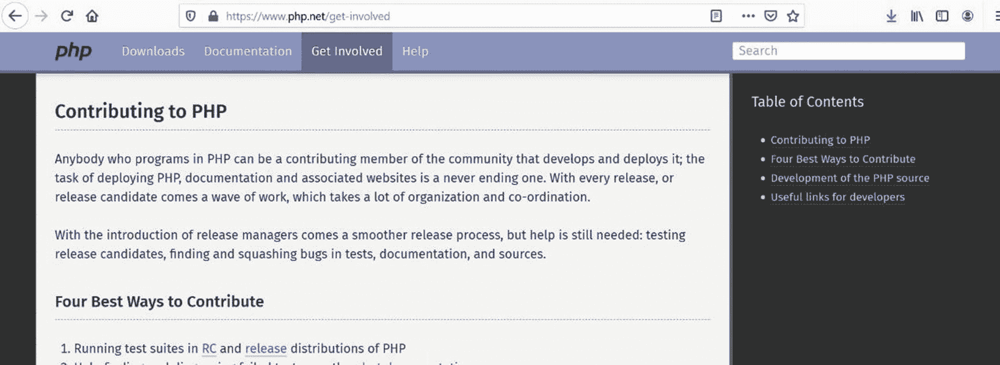

图 1-2

参与进来（2020 年 3 月 28 日）

如前所述，该网站为用户提供了帮助语言未来发展的能力。用户可以参与测试测试版并报告错误或程序缺陷。访问者还可以查看与未来可能版本开发相关的文档。这是在重大公告向公众发布之前发现未来增强功能或安全修复的好方法。

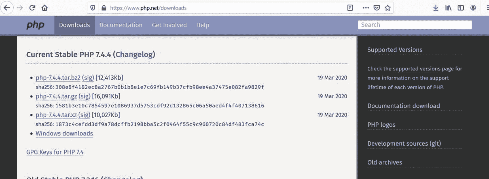

图 1-3

下载页面（2020 年 3 月 28 日）

正如你可能猜到的，下载页面允许轻松获取该语言的最新版本。但是，你会注意到，只提供了语言本身。更常见且推荐的做法是，初学者使用`WAMP`（Windows、Apache、MySQL/MariaDB、PHP）、`LAMP`（Linux、Apache、MySQL/MariaDB、PHP）或`MAMP`（Mac、Apache、MySQL/MariaDB、PHP）集成软件包进行初始安装。这些软件包（我们将在后面介绍）允许同时轻松安装多个产品。否则，你必须运行许多单独的安装程序。

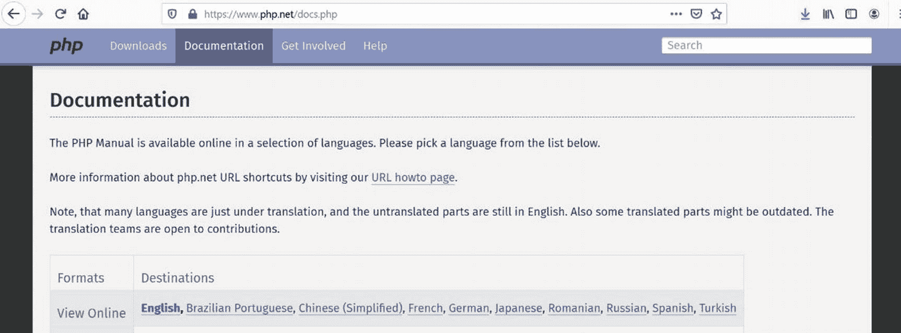

图 1-4

文档页面（2020 年 3 月 28 日）

- `WAMP/LAMP/MAMP` — 开源（免费）组合，包括适用于特定操作系统（Windows、Linux 和 Mac）的 Apache Web 服务器、MySQL/MariaDB 和 PHP。这些软件包是开源的。该软件组合用于创建动态网站和 Web 应用程序。

PHP 网站中比较重要的页面之一是文档页面。该页面允许用户搜索语言本身的描述和功能。你也可以下载完整的文档。然而，由于这是一个“实时”网站，可能会有变化，最好直接从网站访问以获取最新的信息。

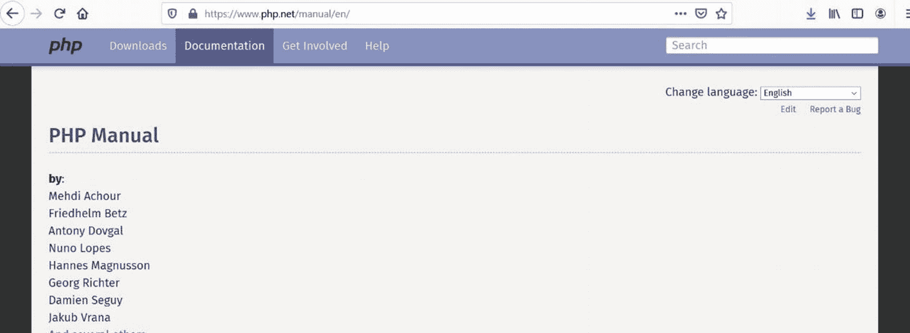

图 1-5

手册（2020 年 3 月 28 日）

你可以像使用教科书一样使用手册，从一开始点击每个链接。手册每个部分提供的有限解释可能会让初学者想要放弃编程，转而对其网络之类可怕的东西感兴趣！不过，对于有经验的程序员来说，手册确实是一个很好的指南，因为该语言的语法与其他语言（如 Python、JavaScript、Perl 和 Java）相似。

在网站的任何页面上，用户都可以输入一个术语、一个表达式，甚至一个函数名称来查找更多信息。当信息输入到搜索框中时，网页会在框下方为用户提供一个或多个选项供其选择。

一旦用户选择了一个选项（例如图 1-7 中所示的 `echo`），搜索结果会向用户提供所请求项的一般描述、函数的任何输入或输出（参数）以及示例代码。


示例代码通过注释（以`//`和图 1-8 中的金色表示）在代码内部解释了函数的使用方法。注释不是可执行代码。可执行代码通过颜色编码来高亮显示字符串（红色）、变量（蓝色）、关键字（绿色）以及 PHP 的开闭标签（蓝色）。颜色编码有助于使代码更易读，也有助于在创建程序时更容易发现语法错误。许多 PHP 编辑器都提供类似的配色方案。

#### PHP 版本：PHP 7+、PHP 7.4+ 和 PHP 8+

随着 PHP 7 环境的发布，实现了巨大的改进，包括重大的安全升级和显著的性能提升。

> *PHP 7 基于 PHPNG 项目（PHP Next-Gen），该项目由 Zend 领导，旨在加速 PHP 应用程序。从 PHP 7 获得的性能提升是巨大的！在真实世界的应用中，性能提升幅度在 25%到 70%之间，而这一切仅仅是通过升级 PHP 实现的，无需更改一行代码！*
> 
> —[`www.zend.com`](http://www.zend.com)

PHP 7 还用一个可以在程序内部处理的异常取代了以前会导致程序崩溃的致命错误。PHP 7 增加了许多额外特性，包括为类和函数增加类型声明，以及一个太空船操作符。

除了错误修复和安全增强之外，PHP 7.4 引入了`spread`操作符，它在合并数组方面提供了比`array_merge`好得多的性能。PHP 7.4 中可用的函数和类的预加载功能极大地提高了在重度使用系统上的 PHP 性能。任何预加载项都已经常驻在 Web 服务器中，可以立即执行。只要服务器在运行，它们就会一直常驻。引入了箭头函数以提供更易用的匿名函数。类属性中的类型声明也得到了改进和扩展。字符串和数字连接的优先级顺序已经调整，以减少错误情况。

```
在 PHP 7.5 之前，
如果从左到右求值，这条语句会产生一个非数值错误。
在 PHP 7.5 之后，右侧的两个值（$num1
和 $num2）会先被相加，然后结果数字和字符串会
被连接起来，生成
"Hello 3"
```

随着 5G 网速的普及以及我们的 ISP 提供商承诺的实时结果，PHP 必须再次提高速度和性能。虽然 PHP 7 和 PHP 7.4 大大改进了相对于之前版本的执行时间，但像 Facebook 这样的大型系统的 PHP 开发者要求更高的效率。在 PHP 8 之前，这些开发者必须在按原始设计编译 PHP 7 和使用 Facebook 的`HHVM`（`Hip Hop Virtual Machine`）之间做出选择，后者将 PHP 代码转换为 C++代码，然后可以执行以获得更好的性能。

随着 PHP 8 的引入，代码使用 JIT（`just-in-time`）编译器进行编译。这种技术在其他语言（如 Java）中已经使用了多年。使用 JIT 编译的代码首先会被转换成操作码。当操作码被执行时，它会转变为可执行的机器级代码。这一改变，结合 PHP 7.4 中引入的预加载类和函数，极大地提高了代码的效率和速度。以至于一些开发者现在可能开始考虑将 PHP 用于不仅仅是 Web 应用程序！游戏开发者可能最终会将 PHP 视为一个合法的开发平台！

此外，PHP 8 引入了联合类型和静态返回类型。它建立在 PHP 7.4 引入的弱引用之上，并允许与对象建立弱映射关系，使它们能够保留在内存中而不会被服务器的垃圾回收器销毁。`str_contains`函数（终于）允许我们更有效地在字符串中搜索内容。内部函数错误现在与用户自定义函数错误的行为方式相同。你可能在旧版 PHP 代码中见过的`@`运算符已被移除。要停止显示错误，你必须在你的服务器中设置此功能。

如果你正在从旧版 PHP 迁移到 PHP 8，请查阅在线手册附录中的迁移说明：

*   [`http://php.net/manual/`](http://php.net/manual/)

本书示例中使用的代码与 PHP 8 兼容。大多数示例也与 PHP 7 和 PHP 7.4 兼容。

##### 动手练习

1.  访问[`www.php.net`](http://www.php.net)。搜索关于`print`和`printf`函数的信息。这些函数有何相似之处？又有何不同？

2.  如何“加入团队”并帮助创建下一个版本的 PHP？提示：访问[`www.php.net`](http://www.php.net)并搜索答案。

3.  [`www.php.net`](http://www.php.net)网站对于初学 PHP 的程序员在哪些方面有用？

4.  PHP 是用什么语言创建的？提示：答案就在[`www.php.net`](http://www.php.net)网站的某个地方。

5.  访问[`www.php.net`](http://www.php.net)。搜索 PHP 8 的改进和变更列表。列出这些改进和变更。你认为其中哪些会影响初学者程序员？自 PHP 8 初始发布以来发生了哪些变化？

#### PHP，JavaScript，CSS，HTML 和 Apache Web 服务器

PHP 是一种脚本语言。**脚本语言**不同于实际的编程语言。**编程语言**（如 Java）由程序员用类似英语的语法编写。程序会被编译，这意味着它从英语语法转换为机器（可执行）代码（0 和 1）。然后，这段代码在兼容的操作系统和硬件上执行（运行）。首次访问代码时，脚本语言会逐行解释命令。它们不会在初始执行之前预编译代码。

你可能会怀疑这是否会导致代码比编译后的代码慢。答案是否定的。在 PHP 8 中，代码首先被转换成操作码，操作码可以快速转换为高效的机器级（可执行）代码。可选地，可执行代码可以保留在计算机或服务器的内存中，以供其他执行使用。如果程序员更改了这段代码，新版本可以替换内存中的旧版本。尽管这可能需要在生效前重启 Web 服务器。

**JavaScript**也是一种脚本语言。你可能知道，JavaScript 代码可以通过查看源代码在**Web 浏览器**中看到，如图 1-9 所示。图 1-9 中显示的**源代码**来自[`www.yahoo.com`](http://www.yahoo.com)，它显示了包括**HTML**、**CSS**和 JavaScript 在内的几种语言的组合。JavaScript 代码位于**script 标签**`(<script type="text/JavaScript">`和`</script>)`之间。然而，当我们查看[`www.php.net`](http://www.php.net)的源代码（在图 1-10 中）时，我们看不到任何 PHP 脚本代码。其中存在一些指向 PHP 文件的链接，但没有显示实际的 PHP 代码。为什么？

JavaScript 代码被下载到用户的计算机上。它在浏览器内被解释和执行。PHP 代码驻留在**Web 服务器**上。该代码也被解释和执行，但这是在 Web 服务器内部进行的，而不是由浏览器执行。执行 PHP 代码的结果被返回给浏览器，而不是返回实际代码本身。PHP 返回浏览器可以解释的语句，例如 JavaScript、HTML 和 CSS 代码。

注意

你可能会注意到使用 PHP 的其他格式（例如`<%`，`<%=`，`%>`或`<script language="php">`）；在 PHP 7 中，这些样式不再有效。它们实际上在之前已被弃用，但仍然可用。


您可能猜测这段代码会显示`Hello`。虽然这是正确的，但问题在于，产生这个结果经历了哪些处理过程？

如果这段代码被放置在网络服务器上的一个文件（例如`index.php`）中，我们将使用网页浏览器，通过在 URL（地址）框中输入其名称和位置（例如[`www.servera.com/index.php`](http://www.servera.com/index.php)）来请求这个文件。输入的地址指示浏览器向网络服务器（`mysita.com`）发送一个 HTTP `Get`请求，以返回该网页（`index.php`）。接收到请求的网络服务器会确定必须首先解释和执行 PHP 代码。它通过查看所请求文件的扩展名（`.php`）来做出这个判断。文件中的任何 PHP 代码（标签之间的代码）随后被发送到 PHP 处理器进行解释和执行。代码执行的结果返回给网络服务器，网络服务器再将其（以及任何其他 HTML 和/或 JavaScript 代码）发送回浏览器。在这个例子中，`Hello`将被返回并由浏览器显示。如果我们随后查看源代码，如前所述，我们只会看到实际的单词`Hello`。我们不会看到任何 HTML 或 PHP。为什么？因为我们没有向浏览器发送任何 HTML。

您可能想知道是否可以使用此过程发送实际的 HTML（和/或 JavaScript）代码来创建动态网页。答案是肯定的。PHP 的`print`或`echo`函数将返回置于双引号`""`之间的任何 HTML（或 JavaScript、CSS）代码。浏览器将解释网络服务器返回的任何代码。

*   **Print 函数** — `print`函数实际上不是一个函数，而是一个语言结构。函数要求传递时字符串用引号括起来。语言结构不要求字符串周围有引号。不过，仍然建议使用引号。`print`会将传递给它的任何内容转发到浏览器。它会尝试将任何非字符串项转换为字符串（文本）格式，因为网页中显示的所有项都是文本格式。
*   **更多信息**，请访问[`http://php.net/manual/en/function.print.php`](http://php.net/manual/en/function.print.php)。

```
Hello";
?>
```

如果我们将代码更改为上述内容，浏览器会将`Hello`显示为 HTML 标题（`h1`）。使用`print`函数的缺点是程序无法控制该语句在网页上的显示位置。该语句实际上会作为第一行代码显示，甚至在任何其他现有 HTML 标签之前。如果我们只是向用户返回一条语句，例如“您的进程已完成”，这也许没问题。但是，如果您的目标是在页面的确切位置格式化输出，则这可能不可接受。还有其他技术和函数可供我们选择来消除此问题。然而，这超出了我们当前的讨论范围。现在我们知道必须借助网络服务器来解释和执行 PHP 代码，我们应该使用什么服务器呢？

有许多可以与 PHP 和 MySQL/MariaDB 数据库配合使用的网络服务器可供选择。一些最受欢迎的选择包括：

*   **Microsoft Internet Information Server (IIS)**：[`www.iis.net/`](http://www.iis.net/)
*   **Lighttpd**：[`www.lighttpd.net/`](http://www.lighttpd.net/)
*   **NGINX**：[`www.nginx.com/`](http://www.nginx.com/)（事件驱动，适用于静态页面）
*   **Apache**：[`www.apache.org/`](http://www.apache.org/)（进程驱动，适用于动态页面）

虽然所有这些服务器都是绝佳的选择，并且在不同的情况下各有优势，但 Apache 网络服务器仍然是托管和处理 PHP 网页请求最常用的。Apache 可以托管在 UNIX 和 Windows 操作系统上。与其他网络服务器一样，Apache 也可以接受和返回其他类型文件的请求，包括 HTML、JavaScript、PERL、Python、图像和 RSS 源。如前所述，Apache 通过首先查看请求文件的扩展名来确定需要从 HTTP 请求中完成哪些处理。

Apache 和 PHP 一样，是一个开源产品。对 Apache 网络服务器的所有更改都由 Apache 软件基金会（ASP）协调。ASP 维护着`apache.org`网站，为用户和开发者提供发现当前正在开发的项目以及下载最新版本 Apache 的能力。然而，如前所述，单独下载不同版本的 PHP、Apache 和 MySQL 可能会导致版本不兼容的问题。除非您知道自己在做什么，否则更明智的做法是下载一个完整的 WAMP、LAMP 或 MAMP 版本。

Apache 软件基金会也鼓励其所有用户保持更新并参与到未来产品的开发中。鼓励用户加入讨论和邮件列表，测试新版本，甚至帮助修复错误或为其产品添加新功能。

**动手练习**

1.  执行 PHP 代码与执行 Java 代码相比有何不同？
2.  脚本语言和编程语言之间的区别是什么？PHP 属于哪种类型的语言？
3.  Apache 网络服务器如何处理 PHP 网页的请求？
4.  为什么我们可以在网页浏览器中看到 JavaScript 代码，但看不到 PHP 代码？
5.  访问[`www.apache.org`](http://www.apache.org)。即使您经验有限，有哪些方式可以参与 Apache 项目的开发？

**PHP、Apache 和 MySQL/MariaDB**
当网页请求数据库中的信息时会发生什么？
通常，数据库存储在与网络服务器本身不同的服务器上。
数据请求是来自网络服务器还是 PHP 处理器？
由于 SQL 语句包含在 PHP 代码本身中，PHP 处理器将 SQL 语句发送给数据库管理系统（MySQL/MariaDB）进行处理。

*   **SQL——结构化查询语言** 是一种用于更新、插入或删除 DBMS（数据库管理系统）中数据的特殊语言。DBMS 是一种应用程序，它与编程语言和数据库交互以更新、插入或删除数据。DBMS 使用 SQL 来解释数据库中所需的数据更改。有关 SQL 的更多信息，请访问[`http://en.wikipedia.org/wiki/SQL`](http://en.wikipedia.org/wiki/SQL)。有关 DBMS 的更多信息，请访问[`http://en.wikipedia.org/wiki/Database`](http://en.wikipedia.org/wiki/Database)。


Apache 服务器首先会识别出 PHP 代码需要被解释执行。服务器通过查看文件自身的扩展名（`php`）来知晓文件中包含 PHP 代码。实际的 PHP 代码存在于文件中 PHP 标签（`<?php` 和 `?>`）之间的部分。随后，PHP 代码会被发送至 PHP 处理器。PHP 处理器会（逐行）解释这些代码。代码首先会被转换成操作码（中间层代码）。在此过程中，它会发现有 SQL 语句需要针对数据库执行。接着，SQL 语句会被传输到相应的数据库管理系统（DBMS）进行处理。DBMS 会将 SQL 语句的执行结果返回给 PHP 处理器。然后，PHP 处理器会利用这些结果来格式化输出，并将结果传递给 Apache 服务器。Apache 服务器会将 PHP 处理器返回的结果，与原始请求页面中可能存在的其他 HTML（和/或 JavaScript）代码合并，并将所有输出发送到用户机器上的浏览器。浏览器随后会解释这些 HTML 和 JavaScript，以显示所请求页面的结果。

你全都理解了吗？

让我们来看一个“真实世界”的例子，如图 1-16 所示。

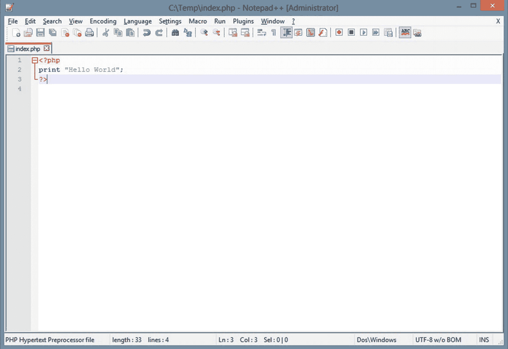

图 1-30
Notepad++ 中的 “Hello World”

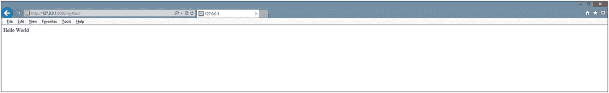

图 1-29
从名为 `myfiles` 的别名目录中以 `index.php` 文件运行时显示的 “Hello World”

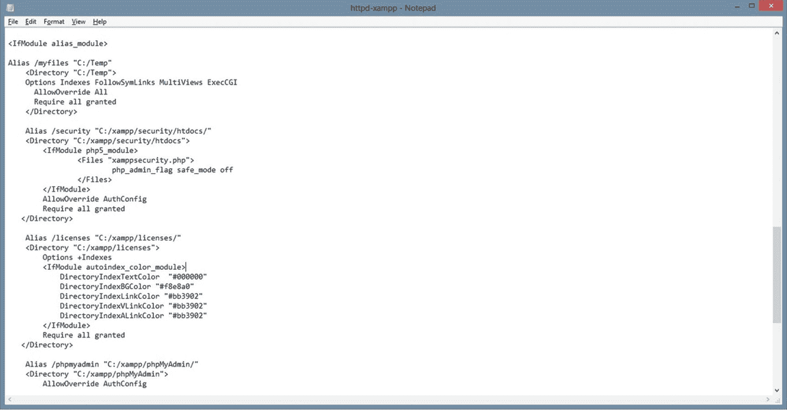

图 1-28
`httpd-xampp` 文件

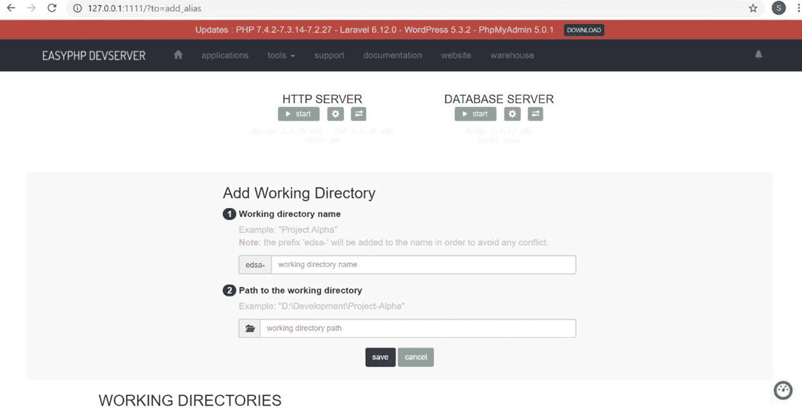

图 1-27
easyPHP 别名设置界面


图 1-26
“Hello World”

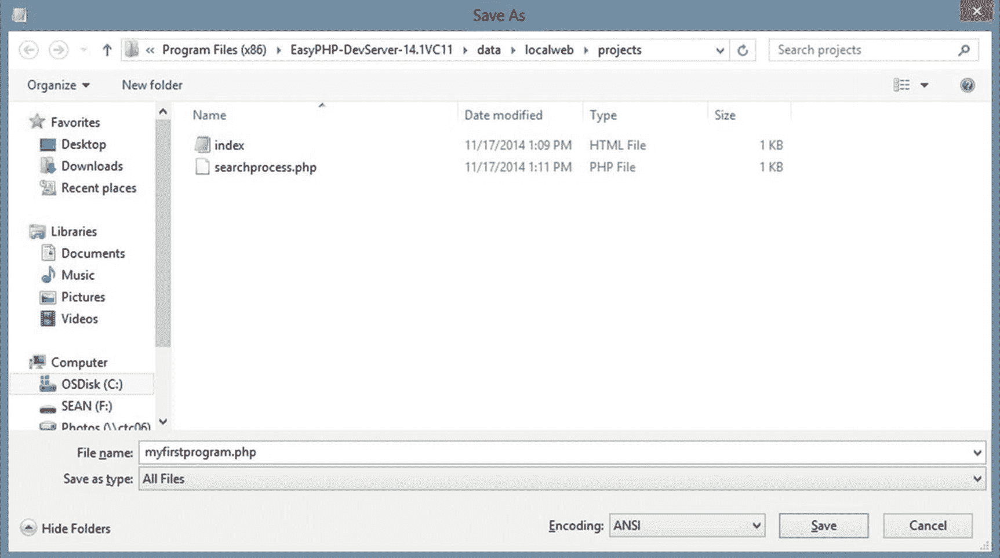

图 1-25
使用“另存为”（所有文件类型）保存 PHP 程序

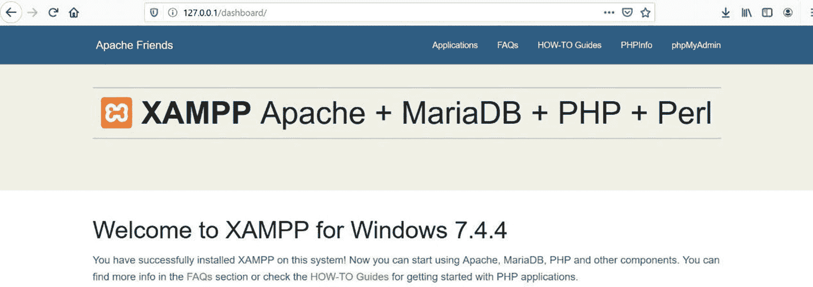

图 1-24
XAMPP 仪表盘界面（2020 年 4 月 6 日）

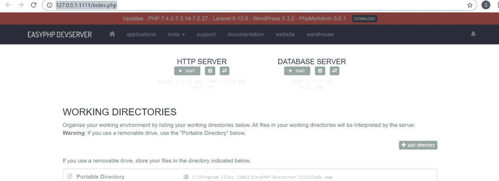

图 1-23
easyPHP 管理界面（PHP 7.4）

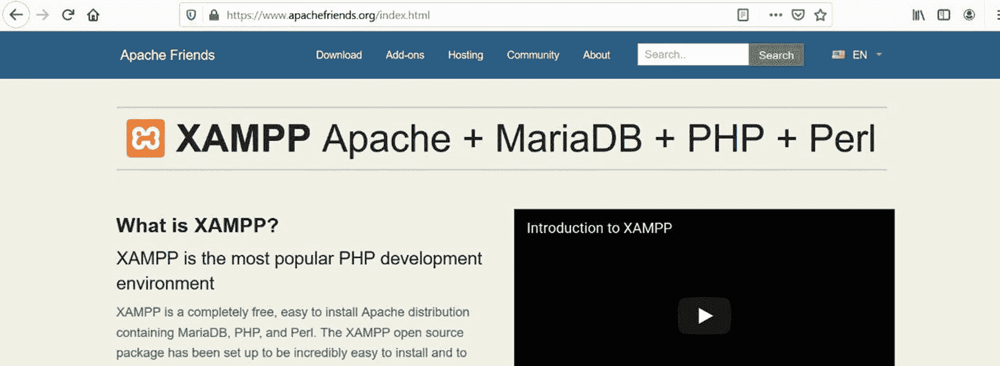

图 1-22
[www.apachefriends.org](https://www.apachefriends.org) 上的 XAMPP（2020 年 4 月 5 日）

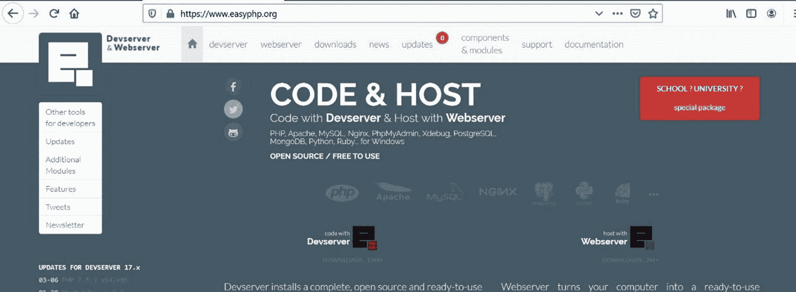

图 1-21
[www.easyphp.org](https://www.easyphp.org)（2020 年 4 月 5 日）

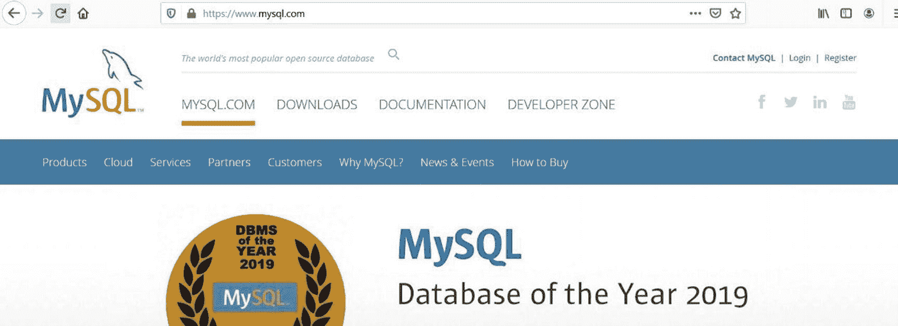

图 1-20
[www.mysql.com](https://www.mysql.com)（2020 年 4 月 5 日）

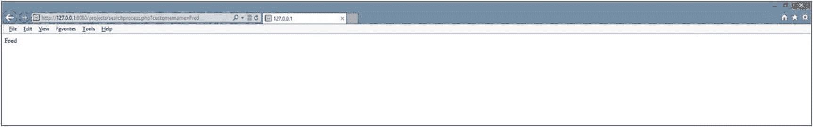

图 1-19
执行 `searchprocess.php`

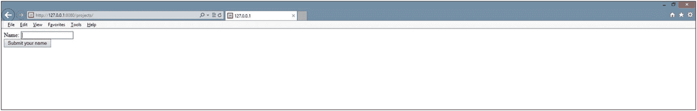

图 1-18
`Index.html` 示例


图 1-17
绿色猫咪（2020 年 4 月 5 日）

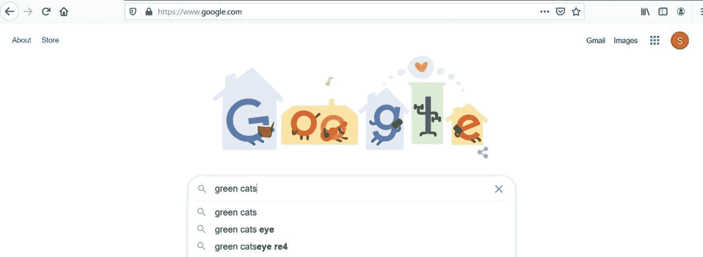

图 1-16
在 Google.com 搜索“green cats”（2020 年 4 月 5 日）


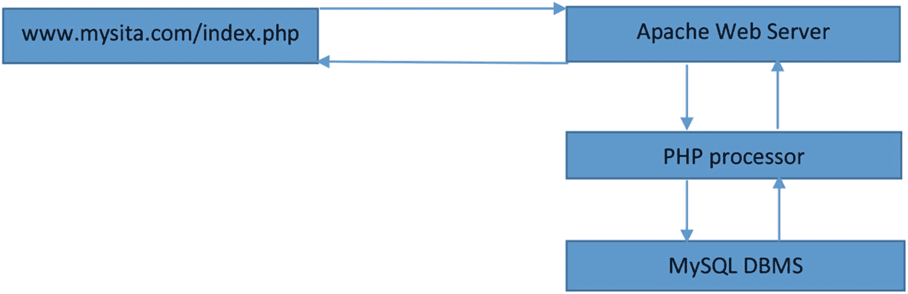

**图 1-15** 请求一个从 MySQL 数据库检索信息的 PHP 网页

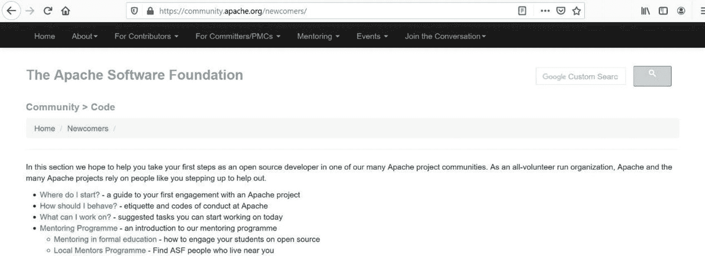

**图 1-14** Apache 新手页面（2020 年 4 月 5 日）


**图 1-13** Apache.org 网站（2020 年 4 月 5 日）

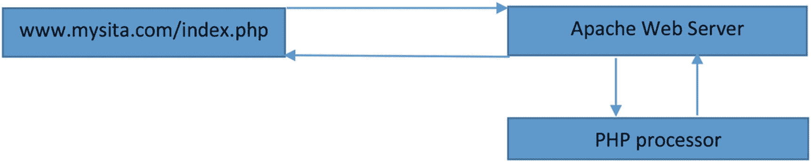

**图 1-12** 请求含有 PHP 代码的网页


**图 1-11** 请求 HTML/JavaScript 网页

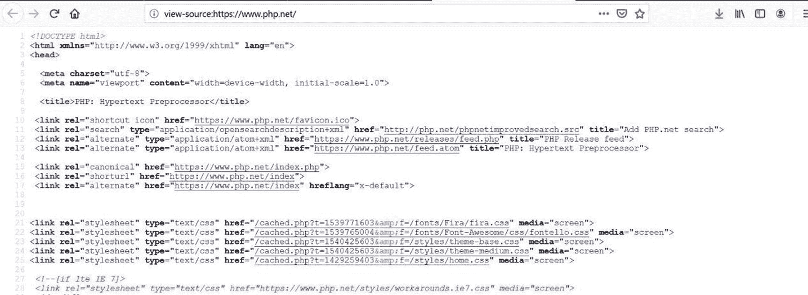

**图 1-10** [www.php.net](http://www.php.net) 的源代码（2020 年 4 月 1 日）

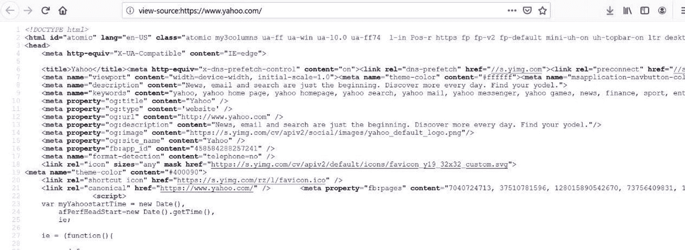

**图 1-9** 来自 yahoo.com 的 JavaScript、HTML 和 CSS 代码（2020 年 4 月 1 日）

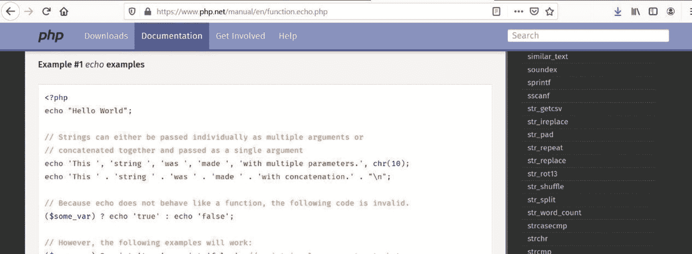

**图 1-8** echo 代码（2020 年 3 月 28 日）

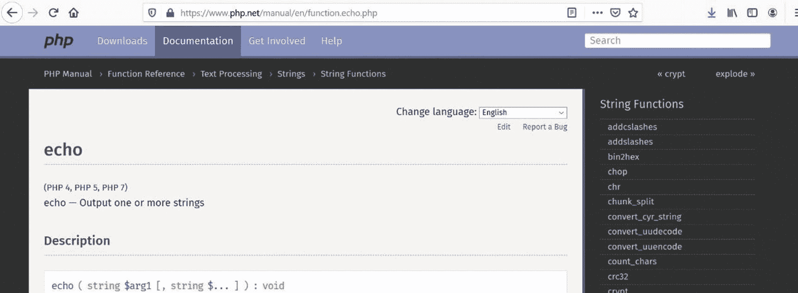

**图 1-7** echo（2020 年 3 月 28 日）

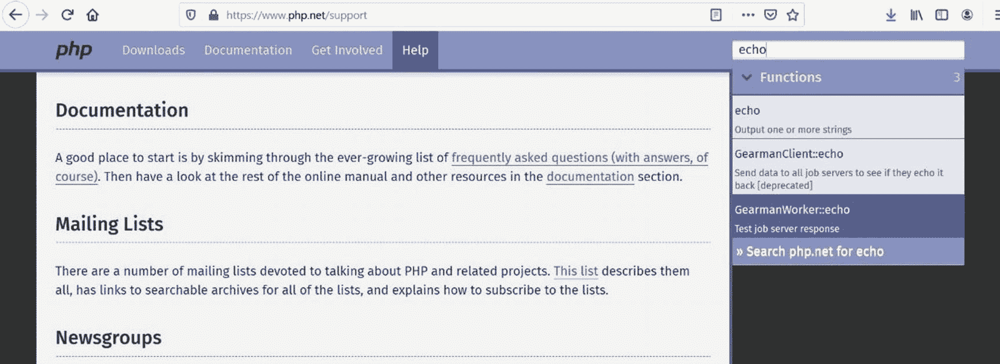

**图 1-6** 搜索（2020 年 3 月 28 日）

出于某些非常奇怪的原因，我们决定在互联网上搜索“绿色猫”。当我们把字符串输入到最常用的搜索引擎（本例中为 Google）并点击搜索按钮时，信息会被传送到某个地方的 Google 服务器集群。在哪里？谁知道呢，可能在地球上的任何地方。但互联网的力量在于，只要我们能够快速得到结果，我们就不在乎具体位置。好吧，我得说，看到有 8.83 亿个关于绿色猫的可能链接，我感到非常惊讶。哇，这个数字在 2014 年还只有 1 亿多。也许我们应该再过滤一下。然而，关键在于，Google 返回了一个网页，其中列出了链接以及这些链接的描述（外加广告）。Google 返回的是一个已经存在的*静态*页面吗？不。服务器是根据用户的请求创建了一个*动态*页面。Google 的算法（软件）搜索了庞大的 Google 数据库集群。请求首先从用户的浏览器发送到 Google 的 Web 服务器。然后，Web 服务器向 Google 数据库（实际上使用的是类似于 SQL 的 Google 查询语言）发送请求，以返回关于“绿色猫”的信息。接着，Web 服务器上的软件编译结果，添加 HTML 和 JavaScript（以及一些 Google 脚本语言代码）来格式化结果页面，最后将信息返回给用户。

-   **静态网页与动态网页** —— 静态网页不会根据用户请求或输入而改变。该页面由 Web 开发人员创建并驻留在 Web 服务器上。当用户通过浏览器请求该页面时，页面的副本会被发送到浏览器进行显示。动态页面不存在于 Web 服务器中。该页面是利用用户的输入创建的。驻留在 Web 服务器上的程序会创建并格式化页面。程序创建的页面随后会被下载到用户的浏览器中。（通常）不会在 Web 服务器上保留该页面的副本。有关静态网页的更多信息，请访问 [`en.wikipedia.org/wiki/Static_web_page`](http://en.wikipedia.org/wiki/Static_web_page)。有关动态网页的更多信息，请访问 [`en.wikipedia.org/wiki/Dynamic_web_page`](http://en.wikipedia.org/wiki/Dynamic_web_page)。

是否每个页面都被下载到了用户的 Web 浏览器？不，只有第一页。第一页结果底部的页面链接会将信息返回给 Web 服务器，请求下一组信息（以便动态创建第二页或其他请求的页面）。你可能已经开始意识到，我们刚才讨论的关于在互联网上处理 PHP 文件的相同过程，是创建动态页面的一种非常常见的过程。你可能已经注意到结果页面的 URL 地址有些有趣的地方。这个地址是 `www.google.com/search?source=hp&ei=KQ2KXtaJOOW3ggeY9IWQBw&q=green+cats&oq=green+cats&gs_lcp=CgZwc3ktYWIQAzICCAAyAggAMgIIADICCAAyAggAMgIIADICCAAyAggAMgIIADICCAA6BQgAEIMBSioIFxImMGcxMTRnMTAyZzk2ZzEwMGcxMjFnMTA3Zzk3ZzExNmcxMDNnOTBKGQgYEhUwZzFnMWcxZzFnMWcxZzFnMWcxZzFQr01Y93Bgv-AHaAJwAHgAgAFliAG3BpIBAzkuMZgBAKABAaoBB2d3cy13aXo&sclient=psy-ab&ved=0ahUKEwiWwvP639HoAhXlm-AKHRh6AXIQ4dUDCAg&uact=5`，而不是 `www.google.com`。Google 算法在向服务器发送搜索请求时使用 *GET HTTP 请求*。

-   **HTTP —— 超文本传输协议**是在互联网上的节点（计算机和服务器）之间传输消息（文本和网页）的协议（标准）。它是一种请求-响应协议。例如，用户通过浏览器“请求”一个网页。Web 服务器“响应”该请求并将页面返回给浏览器。浏览器将请求转换为一个 HTTP GET 请求（例如 `GET /pages/mypage.html HTTP/3`），发送给 Web 服务器。Web 服务器则返回所请求的信息以及一个状态码（例如 `HTTP/3 200 OK`）。有关 HTTP 的更多信息，请访问 [`en.wikipedia.org/wiki/Hypertext_Transfer_Protocol#Request_methods`](http://en.wikipedia.org/wiki/Hypertext_Transfer_Protocol%2523Request_methods)。

```
Name:
```

让我们看一个更简单的例子来了解发生了什么。假设上述代码保存在本地主机网站的 `projects` 文件夹下的 `index.html` 文件中。如果用户在浏览器显示的文本框中输入 `Fred`，结果页面（通过解释并执行 Web 服务器上的 `searchprocess.php` 文件，并将结果发送回浏览器而创建）将显示 URL 行：

```
http://127.0.0.1/projects/searchprocess.php?customername=Fred.
```


文本框名称（`customername`）以及在该文本框中输入的值（`Fred`）现在显示在 URL 行上。实际上，`customername`现在是一个参数，而`Fred`是该参数的值。这是使用 GET 过程的结果。

当我们点击 Google 搜索按钮或我们简单示例中的搜索按钮时，请求的信息会通过 GET HTTP 过程发送。接收程序所需的所有信息（和参数）都通过实际的 URL 行发送，以供 Web 服务器上的程序接收并处理初始请求。

为什么 Google 搜索引擎通过 GET 而不是 POST（POST 会隐藏信息）发送信息？主要原因是为了节省服务器内存。试想一下 Google 每天要处理数百万的信息请求。如果所有这些请求都驻留在内存中，服务器很快就会崩溃。此外，由于用户是在进行“公开”信息搜索，因此没有理由隐藏这些信息。在后面的章节中，我们将了解如何在 PHP 程序中读取 GET 和 POST 参数。

现在，让我们回到关于 Apache、PHP 和 DBMS 的讨论中。PHP 可以访问多种 DBMS 系统中的信息，包括 Oracle 和 SQL Server。然而，最流行的组合（如前所述）是将 PHP 与 MySQL 或 MariaDB 配对使用。我猜你现在能猜出原因了？是的，两者都有免费版本。MySQL 和 MariaDB 也是较易使用的 DBMS 系统之一。MySQL 还允许使用 NoSQL 数据库结构。

就像我们讨论过的所有开源产品一样，用户可以访问官方网站 [www.mysql.com](https://www.mysql.com) 下载最新版本。当前版本及之前的几个版本的文档均可下载。这些文档非常详尽，不适合心智薄弱者或初学者阅读。同样，你可能已经读腻了，但建议在你经验更丰富之前，不要单独下载新版本的 MySQL。至少现在，请坚持使用 WAMP、LAMP 和 MAMP 集成软件包。我们将在后面的章节中向你展示如何在服务器集成软件包内升级 MySQL 版本。

#### 动手实践

1.  为什么 PHP 处理器将 SQL 发送给 DBMS，而不是 Apache Web 服务器直接将其发送给 DBMS？
2.  在将 DBMS 返回的信息发送回用户的浏览器之前，Apache 可能会对这些信息做什么处理？
3.  前往 [`www.mysql.com`](http://www.mysql.com)。MySQL 的最新版本是什么？哪些版本的 Apache 和 PHP 与其兼容？
4.  为什么搜索引擎通过 GET HTTP 请求而非 POST HTTP 请求传递信息？你会在什么时候使用 POST 请求？

### 整合起来——PHP、Apache 和 MySQL

正如你到目前为止所发现的，PHP、Apache 和 MySQL/MariaDB 需要无缝协同工作，才能成功创建动态网页。有许多可用的**服务器集成软件包**提供了这些产品的组合，以及诸如 phpMyAdmin 和 MySQL Workbench（在设置 Web 服务器和数据库方面非常有帮助）等其他工具。通过安装其中一个产品，你将大大降低挫败感，甚至可能保住大部分头发。

选择服务器集成软件包时有很多选择。有些软件包仅适用于特定操作系统；有些则提供了许多你可以选择添加的附加工具。一些最受欢迎的选择包括：

- *XAMPP*: [`www.apachefriends.org/index.html`](http://www.apachefriends.org/index.html)
- *easyPHP*: [`www.easyphp.org/`](http://www.easyphp.org/)
- *AMAPPS*: [`www.ampps.com/`](http://www.ampps.com/)
- *LAMP*: [`www.linux.com/training-tutorials/easy-lamp-server-installation/`](http://www.linux.com/training-tutorials/easy-lamp-server-installation/)
- *LEMP*: [`https://linuxtechlab.com/beginners-guide-creating-lemp-server/`](https://linuxtechlab.com/beginners-guide-creating-lemp-server/)
- *MAMP*: [`www.mamp.info/en/downloads/`](http://www.mamp.info/en/downloads/)

对于 Microsoft Visual Studio 开发者，你还可以安装 DevSense 的 PHP Tools 插件。对于那些希望使用 Microsoft IIS 服务器（而不是 Apache）或 NGINX 的人来说，这是集成 PHP 最简单的方法。更多信息，请访问 [`www.devsense.com/en`](http://www.devsense.com/en)。

现在让我们简要地看看两个受欢迎的选择：easyPHP 和 XAMPP。我们不会深入探讨或提供分步安装说明，原因有二：本书出版后，相关说明很可能会发生变化；而且使用默认设置通常没问题。接受开发者建议的设置大多数情况下都能正常工作。

#### easyPHP

你可以从以下链接下载 easyPHP 的开发者版本。除非你打算直接将计算机上的“真实”网页托管到互联网上，否则无需下载主机版本。[`www.easyphp.org/easyphp-devserver.php`](http://www.easyphp.org/easyphp-devserver.php)

easyPHP 的开发者版本是一个 WAMP（Windows, Apache, MariaDB, PHP）集成软件包，用于 Microsoft Windows 环境。当 Oracle 收购 MySQL 时，easyPHP 的开发者转向了 MariaDB 数据库。这个数据库由一些创建 MySQL 的相同开发者创建。因此，它的工作方式类似。在后面的章节中，我们将了解如何安装最新版本的 MySQL。你可以选择安装一些额外的工具来辅助开发（包括代码嗅探器）。然而，就我们的目的而言，你只需要基本安装。安装后，文件将位于你程序文件目录下的 easyPHP 目录中。

> **警告**
> 
> 在下载过程中，请注意点击网站上的哪些按钮。你可能会下载到不需要的额外项目。

在网站上点击下载箭头下载安装程序后，按照软件提供的说明进行操作。在初次尝试时，请保留所有默认设置。希望一切都能正确安装。如果你没有选择让 easyPHP 自动启动 Apache 和 PHP，那么在 easyPHP 启动后，右键单击系统托盘中的 easyPHP 图标，选择 `Dashboard`。然后点击 HTTP 服务器标题下的启动按钮。如果它启动了（启动按钮会切换为停止按钮），则用同样的方式启动数据库。如果出现问题，请阅读下一节“常见安装问题”。

### 常见安装问题

##### 缺少 C# 库

PHP 8（以及早期版本的 PHP）需要 Microsoft Visual Studio C# 库。如果你使用的是 Windows 8 或更高版本，这个库可能已经安装。此外，如果你安装了较新版本的 Microsoft Visual Studio，它也可能已经安装。如果你收到指示缺少 C# 或版本错误的错误信息，请将错误信息粘贴到互联网的搜索引擎中。搜索来自 Microsoft 的关于如何修复该错误的说明。回复信息中应包含下载缺失文件和安装说明的链接。

#### 端口冲突

如果你已经有服务在使用端口 80（PC 与外部世界之间 HTML 流量的默认端口），当 Apache 尝试运行时，你将会收到一条错误消息。你可以通过多种方法解决这个问题。

1.  如果你不介意在开发期间关闭其他使用该端口的服务，可以按照给定的说明进行操作。在你使用完 Apache 和 PHP 后，可以重新打开这些服务，或者只需重启电脑，这些服务就会重新启动。
    1.  前往 Microsoft Windows 任务管理器（同时按下 `Ctrl+Alt+Delete`）。
    2.  选择“服务”选项卡。


3.  在 Windows 10 中查找以下任一服务：`SQL Server Reporter`、`Web Deployment Agent`、`BranchCache`、`Sync Share Service`、`WAS`（`IIS Administrator`）和 `W3SVC`。如果发现某个服务正在运行，右键单击它并将其关闭。然后尝试重新启动 `Apache`。如果不起作用，请重新打开该服务，然后尝试其他服务。（具体名称可能因 Windows 版本而异。）

2.  如果你需要其他服务保持运行，或者你没有关闭 80 端口上服务的管理员权限，则可以更改 `Apache` 的默认监听端口。

*   *Wikipedia 对端口（port）的定义如下：*

*   *在计算机网络中，端口是一种特定于应用程序或进程的软件结构，作为计算机主机操作系统中的通信端点。端口的作用是唯一标识单台计算机上运行的不同应用程序或进程，从而使它们能够共享到分组交换网络（如互联网）的单个物理连接。在互联网协议（Internet Protocol）的上下文中，端口与主机的 IP 地址以及用于通信的协议类型相关联。*

*   *有关端口的更多信息，请访问* [`http://en.wikipedia.org/wiki/Port_(computer_networking)`](http://en.wikipedia.org/wiki/Port_%2528computer_networking%2529)。

转到系统托盘（屏幕右下角）。通过滚动图标找到 `easyPHP` 图标。每个图标应显示相应的描述。如果未看到图标，请单击系统托盘中的向上箭头以查看更多图标。右键单击 `easyPHP` 图标。选择 `Dashboard`。这将在默认浏览器中打开。尝试单击 `HTTP Server`（默认设置为 `Apache`）下方的启动按钮。如果收到端口冲突错误，请单击齿轮图标（`Server Settings`）。然后你可以在下一个屏幕上更改端口。（将其更改为 `8080` 或 `81`。）通过单击绿色启动按钮再次尝试启动 `Apache`。返回 `Dashboard` 并通过单击启动按钮启动数据库。

#### 缺失文件（Missing Files）
如果你收到与此相关的错误消息，则说明你的文件在安装前已损坏。返回 `easyPHP` 网站并重新下载文件。此外，如果你不小心弄乱了 `Apache` 配置文件，请返回并重新安装该产品。

#### 无法在 Program Files 目录中安装文件（Cannot Install Files in Program Files Directory）
这表明你或其他对象对该目录有高安全限制。重新运行安装程序，并将安装位置更改为其他目录。请记住，当本书后面引用 `Program Files` 目录时，你应该查看你的文件实际安装到的目录。

#### Apache 延迟和挂起（Apache Delays and Hang-Ups）
在 Windows 中，你可能会遇到 `Apache` 运行缓慢或挂起的问题。要解决此问题，请转到系统托盘（屏幕右下角）。通过滚动图标找到 `easyPHP` 图标。每个图标应显示相应的描述。如果未看到图标，请单击系统托盘中的向上箭头以查看更多图标。右键单击 `easyPHP` 图标。选择 `Dashboard`。当 `Dashboard` 在默认浏览器中打开时，选择齿轮图标（`Server Settings`）。然后单击 `Configuration File` 按钮。文件内容将显示在按钮下方。单击铅笔图标以编辑 `Apache` 配置文件。这将在默认文本编辑器（可能是 `Notepad`）中打开 `Apache` 配置文件（`httpd.conf`）。首先将文件副本保存在某处，以防出错。这将使你能够从任何重大错误中恢复。

> **注意**  
> 使用 `Notepad` 或任何其他文本编辑器时，请确保使用 `Save As`，然后选择 `All Files` 作为文件类型。另外，请确保包含 `.conf` 文件扩展名。  
> 如果不将文件类型更改为所有文件，你的文件将保存为 `httpd.conf.txt`。如果发生这种情况，服务器将找不到该文件。你可以通过重新打开文件并以正确方法保存来轻松解决此问题。

然后在文件底部添加以下两行：

```
AcceptFilter http none
AcceptFilter https none
```

通过执行 `Save As` ➤ 选择 `All Files` 重新保存文件（确保将原始文件重新保存到原始位置）。它应显示该文件将保存在配置文件夹中。

#### 其他错误（Other Errors）
对于此处未讨论的错误，请将错误消息复制并粘贴到搜索引擎中。查找提供解决错误建议的答案列或博客。互联网上有很多免费资源。不要为网站（或其他人）付费来解决你的问题。

#### 配置（Configurations）
你需要确定何时希望 `Apache` 运行。可以将 `Apache` 设置为在启动 PC 时运行、在应用程序需要时运行或手动运行。要更改设置，你可以右键单击系统托盘（屏幕右下角）中的 `easyPHP` 图标，然后选择 `Dashboard`。如果未看到该图标，请单击系统托盘中的向上箭头。选择左侧菜单中的 `Settings and Applications`。然后你可以选中（或取消选中）复选框以自动启动服务器和 `PHP`。然后单击 `save` 按钮。
有许多可选库，你可以根据需要链接或取消链接到 `PHP`。在许多情况下，库已加载，只需链接即可。你可以通过转到 `PHP` 配置文件（`php.ini`）并删除行首的注释（`;`）字符来添加这些库。可以轻松地通过右键单击系统托盘中的 `easyPHP` 图标找到 `PHP` 配置文件。然后选择 `Dashboard`。接着单击 `HTTP server` 旁边的齿轮图标（`Server Settings`）。单击 `Configuration File` 按钮。文件将显示在按钮下方。单击文件内容右上角的铅笔图标。该文件将在默认文本编辑器（可能是 `Notepad`）中打开。在进行任何更改之前，请确保保存备份副本。同时确保使用 `Save As` 并选择 `All Files`。否则，你的文件可能以 `.txt` 结尾，而不是以 `.config` 结尾。目前不需要进行任何更改。还建议仅在需要时进行这些更改。

#### XAMPP
虽然 **XAMPP** 与 `easyPHP` 类似，但 `XAMPP` 更受欢迎，因为它有免费的 Windows、Linux 和 OS X 版本。它还包含许多附加组件，包括一些最受欢迎的内容管理系统——`Drupal`、`Joomla` 和 `WordPress`。`XAMPP` 使用 `MariaDB` 代替 `MySQL`。此更改发生在 `Oracle` 收购 `MySQL` 时。`MariaDB` 和 `MySQL` 的基础知识非常相似。我们将在本书后面探讨如何更改为最新版本的 `MySQL`。在某些设置中，`XAMPP` 仍然引用 `MySQL`，而实际上它是 `MariaDB`。最新版本可以直接从 `XAMPP` 官方网站或许多其他下载站点获取。[www.​apachefriends.​org/​](https://www.apachefriends.org/)

> **警告**  
> 注意你点击网站上的哪些按钮。你可能会下载到不想安装的额外项目。


首次尝试安装时，请使用开发人员在安装软件中建议的**默认设置**。这能极大降低出现问题的可能性或避免令人头疼的情况。如果你没有选择自动启动服务器和数据库，而现在想要启用自动启动，或者想关闭它，请双击系统托盘中的 XAMPP 图标。然后点击右上角的 **Config** 按钮（而不是服务器或 MySQL 旁边的那个）。下一个屏幕将显示复选框，允许你选择要自动启动的应用程序。勾选要自动启动的项目，然后点击 **save** 按钮。

如果你想要手动启动服务器或数据库，可以点击服务器右侧的 **start** 按钮。当服务器启动后，再点击 MySQL 右侧的 **start** 按钮。如果它们正确启动，按钮会变为 **stop** 按钮，并且相关项目会高亮显示为**绿色**。如果未能正确启动，相关项目则会高亮显示为**红色**。如果你确实遇到错误，请阅读下一节“常见安装问题”以获取帮助。

### 常见安装问题

你可能会收到 Microsoft Windows 防火墙的警告消息，要求你批准启动 Apache 和 MariaDB。当然，你应该点击允许它们运行。此外，在 Windows 中，安装过程中你可能会收到一条消息，告知你该机器已启用**用户安全控制**。如果你选择继续安装，在你的机器上安装过程通常仍能正常工作。

#### 端口冲突

如果你已经有服务在使用端口 80（PC 与外部世界之间传输 HTML 数据的默认端口），Apache 在尝试运行时将会收到错误消息。你可以通过多种方式解决此问题。

1.  如果你不介意在开发期间关闭使用该端口的其他服务，可以按照视频链接中的说明进行操作。完成 Apache 和 PHP 的使用后，你可以重新开启这些服务，或者只需重启 PC，这些服务便会自动重新启动。

2.  转到 Windows 任务管理器（同时按 `Ctrl+Alt+Delete`）。
    -   选择 **服务** 选项卡。
    -   在 Windows 中查找以下任意服务：SQL Server Reporter、Web Deployment Agent、BranchCache、Sync Share Service、WAS（IIS 管理员）和 W3SVC。如果发现某个服务正在运行，右键单击它并选择**关闭**。然后尝试重新启动 Apache。如果不起作用，请重新打开该服务，再尝试关闭另一个。（名称可能因 Windows 版本而异。）

3.  如果你需要保持其他服务运行，或者没有关闭端口 80 上服务的**管理权限**，则可以更改 Apache 的默认监听端口。

转到你的系统托盘（在 Microsoft Windows 中，位于屏幕右下角）。通过将鼠标悬停在图标上找到 XAMPP 图标。每个图标的描述应该会显示出来。如果看不到该图标，请单击系统托盘中的向上箭头以查看更多图标。双击该图标，会出现**控制面板**。你应该会在控制台上看到以红色显示的启动错误消息。如果是端口冲突，请点击 Apache 右侧的 **Config** 按钮。选择 **Services and Port Setting** 按钮（靠近右下角）。弹出的选项卡默认会选中 Apache。如果问题是 Apache 引起的，请将端口设置从 80 更改为 `8080` 或 `81`。这将允许 Apache 服务器监听这些不常用的端口之一。

然后，你可以通过点击 XAMPP 控制台中 Apache 旁边的 **Start** 按钮来重新启动 Apache。如果 Apache 状态变为绿色，你还应点击 MariaDB 右侧的 **Start** 按钮来启动它。

#### 文件缺失

如果你收到与此相关的错误消息，说明你的文件在安装前已损坏。请返回 XAMPP 网站，重新下载并安装文件。如果你不小心弄乱了 Apache 配置文件，你同样需要重新下载文件。

#### 无法在 Program Files 目录安装文件

这表明你或其他程序对该目录有**很高的安全限制**。请重新运行安装程序，并将安装位置更改为其他目录。请记住，当你之后在本书中引用程序文件目录时，应该查看你实际安装文件的目录。

#### Apache 延迟和挂起

在 Windows 中，你可能会遇到 Apache 运行缓慢或挂起的问题。要解决此问题，请转到系统托盘（屏幕右下角）。通过将鼠标悬停在图标上找到 XAMPP 图标。每个图标的描述应该会显示出来。如果看不到该图标，请单击系统托盘中的向上箭头以查看更多图标。双击 XAMPP 图标。选择 Apache 右侧的 **Config** 按钮（不是右上角的按钮，也不是 PHP 的 config 按钮）。选择 **Apache (httpd.conf)**。这将在记事本（或你的默认文本编辑器）中打开 Apache 配置文件（`httpd.conf`）。首先，在此文件某处保存一个副本，以防出现错误。这将允许你从可能发生的任何重大错误中恢复。

> **注意**
>
> 确保在使用记事本或任何其他文本编辑器时，你使用了**另存为**，然后选择**所有文件**作为文件类型。同时确保包含 `.conf` 文件扩展名。如果你不将文件类型更改为所有文件，你的文件将被保存为 `httpd.conf.txt`。如果发生这种情况，服务器将无法找到该文件。你可以通过重新打开文件并以正确方法保存来轻松解决此问题。

然后将以下两行添加到文件底部：

```
AcceptFilter http none
AcceptFilter https none
```

重新保存文件（确保将原始文件保存回原始位置）。

#### 其他错误

对于此处未讨论的错误，请将错误信息复制并粘贴到搜索引擎中。查找提供修复错误建议的问答专栏或博客。互联网上有许多免费资源。不要付费让某个网站（或其他人）来修复你的问题。

#### 配置

你可以通过转到**控制面板**（双击屏幕右下角系统托盘中的 XAMPP）来更改 XAMPP 的配置。然后点击你屏幕右上角的 **config** 按钮（而不是应用程序右侧的 config 按钮）。要**自动启动**（或停止自动启动）你的应用程序，你可以勾选（或取消勾选）提供的复选框，以便在下一次控制面板启动时自动启动相应项目。然后点击 **Save**。当然，你也可以在需要时随时从控制面板启动它们。

有许多可选的库，你可以根据需要链接或取消链接到 PHP。在许多情况下，库已经加载，只需链接即可。你可以通过转到 PHP 配置文件（`php.ini`）并删除行首的注释（`;`）字符来添加这些库。通过双击系统托盘中的 XAMPP 图标，可以轻松找到 PHP 配置文件。然后点击 Apache 右侧的 **Config** 按钮。将显示一个列表；选择 `php.ini`。目前无需进行任何更改。也建议只在需要时才进行这些更改。

#### Microsoft Internet Information Server

或者，如果你无法让 Apache 在 Windows（尤其是 Windows 10）中正常运行，或者你喜欢 Microsoft 的 IIS 服务器，你可以安装 PHP 以使用 Microsoft IIS（Internet Information Server）替代 Apache。有关更多信息，请访问 [`www.php.net/manual/en/install.windows.php`](http://www.php.net/manual/en/install.windows.php)。

#### 动手实践


### 使用搜索引擎回答以下问题

1.  你在安装 XAMPP 或 easyPHP 时，或者刚尝试启动它们时，收到了以下错误。如何才能找到问题的解决方案？可能是什么原因导致了此错误？

```
Internal Server Error

The server encountered an internal error or misconfiguration and was unable to complete your request.

Please contact the server administrator, you@example.com, and inform them of the time the error occurred, and anything you might have done that may have caused the error.

More information about this error may be available in the server error log.
```

2.  什么是 XAMPP 错误 #1130？如何修复此错误？

3.  尝试使用 easyPHP（和 Apache）运行 PHP 程序时，收到以下错误。是什么导致了此错误？如何修复？

```
Cannot load mcrypt extension. Please check your PHP configuration.
```

4.  如果你之前还没有尝试过，请在个人机器上安装 easyPHP 或 XAMPP。安装过程中遇到问题了吗？如果有，遇到了什么问题？你是如何解决这些问题的？

### 测试你的环境

现在你的指示灯都变绿了，对吧？一切都运行正常？希望如此。但你需要确认一下。最好的方法就是测试你的环境。

#### 测试你的管理环境

首先，我们需要测试服务器，看看管理页面能否正常显示。在 easyPHP 中，你可以执行以下任一操作：

1.  右键单击 easyPHP 图标，然后选择**控制面板**（Dashboard）。
2.  打开你最喜欢的浏览器，然后输入以下地址：

`http://127.0.0.1:1111/index.php`

如果因为端口冲突而不得不更改端口，你可能需要输入端口号，例如：

`http://127.0.0.1:8080/index.php`

你应该会看到一个类似于图 1-23 所示的界面。

对于 XAMPP，打开你最喜欢的浏览器，然后输入以下地址：

`http://127.0.0.1/dashboard/`

如果因为端口冲突而不得不更改端口，那么你也必须包含此端口：

`http://127.0.0.1:8080/dashboard/`

如果 XAMPP 安装正确，你应该会看到一个类似于图 1-24 所示的界面。

如果在此时你没有看到这个页面（或任何显示 XAMPP 的页面），那么说明出了问题。请检查以下内容：
-   easyPHP 或 XAMPP 是否正在运行（已启动）？
-   在 XAMPP 控制面板或 easyPHP 中，你是否看到了 Apache 的绿色指示灯或绿色阴影？如果没有，请尝试点击启动按钮或链接。
-   如果 Apache 无法启动，你是否看到了错误信息？如果没有，请检查错误日志文件。对于 easyPHP，请打开控制面板（Dashboard），选择齿轮图标（**服务器配置**），然后选择**错误日志**按钮。对于 XAMPP，请单击控制面板上 Apache 旁边的**日志**按钮，然后选择**错误日志**。
-   如果你看到了绿色指示灯，但页面似乎卡住了，请尝试停止并重新启动 Apache。可能需要尝试几次才能将其唤醒。如果它持续挂起，请检查你的计算机设置。你的 CPU 使用率是否已达到上限？

你能确定问题所在吗？如果你有错误信息，请将其粘贴到你最常用的搜索引擎中，看看专家们对此有何看法。

#### 动手实践

1.  如果你之前还没有这样做过，请按照前面的说明测试你的环境。遇到任何问题了吗？如果有，出现了什么问题？你是如何解决这些问题的？

#### 测试你的 PHP 环境

希望现在一切顺利。你要么运气极佳、一帆风顺，要么已经成功解决了所有遇到的问题。但是，你仍需确认是否真的能在 Apache 中运行你自己的 PHP 程序。

打开一个文本编辑器（不要用 Word，用记事本或 Notepad++ 就行），然后严格按照下面所示输入代码：


使用"文件"菜单中的"另存为"选项，将文件类型更改为"所有文件"或`php`。输入文件名`myfirstprogram.php`，并将其保存在以下位置之一。

如果你使用的是 `easyPHP`，请将其保存到：

```
C:\Program Files (x86)\EasyPHP-Devserver-xxxx\eds-www
```

当然，你需要将版本名称（或程序文件名称）更改为你机器上使用的正确版本（位置）。在此位置下，创建一个名为`projects`的文件夹，然后将文件保存在该文件夹下。

如果你使用的是 `XAMPP`，首先进入`C:\xampp\htdocs`，并创建一个名为`projects`的文件夹。然后返回你的文本编辑器，选择"另存为"（不要忘记将文件类型更改为"所有文件"或`php`），将文件命名为`myfirstprogram.php`，并将其保存到以下位置：

```
C:\xampp\htdocs\projects
```

如果你正确地将文件保存在 `easyPHP` 或 `XAMPP` 的位置，你可以尝试通过在浏览器地址栏中输入以下内容来运行你的程序：

```
http://127.0.0.1/projects/myfirstprogram.php
```

如果你更改了端口，则将第一部分更改为`http://127.0.0.1:8080/`（将`8080`替换为你正在使用的正确端口）。你的程序应显示图 1-26 中所示的消息。

#### 常见问题

**未显示任何内容，出现 404 错误：**

1.  确保你完全按照所示输入了地址。
2.  你的服务器可能挂起了。停止并重新启动它。
3.  确保你将文件放在了正确的位置。
4.  确保你将文件保存为`.php`文件，而不是`.txt`文件。重新尝试"另存为"并重命名文件（确保文件类型是"所有文件"或`php`）。
5.  检查实际程序代码中的拼写错误。你是否记得使用分号（`;`）？修正任何错误并重新保存。如果服务器因某种原因未看到更改，你可能需要停止并重新启动服务器。你可以查看日志文件中的 PHP 日志文件，以查看代码中可能存在的任何错误。
6.  查看 Apache 日志文件（参见之前常见问题中的说明）以查找错误。如果你无法修正这些错误，请复制错误信息并将其粘贴到搜索引擎中，看看其他人找到了什么解决方案。

**显示的是实际程序代码，而不是代码执行的结果：**

1.  确保你将文件保存为`.php`文件，而不是`.txt`文件。重新尝试"另存为"并重命名文件（确保文件类型是"所有文件"或`php`）。
2.  你的 Apache 服务器或 PHP 可能未启动或已挂起。停止并重新启动 Apache。
3.  你是否忘记或在`<?php`或`?>`行中有拼写错误？
4.  查看 Apache 日志文件（参见之前常见问题的说明）以查找错误。如果你无法修正这些错误，请复制错误信息并将其粘贴到搜索引擎中，看看其他人找到了什么解决方案。

**对于任何其他错误，** 请将其复制并粘贴到网络搜索引擎中，查看其他人发现了什么解决方案。

#### 动手实践

1.  如果你尚未测试你的环境，请进行测试。测试成功了吗？你遇到了什么问题（如果有的话）？你是如何解决这些问题的？

#### 别名（工作）目录

在实际开发中，在 Web 服务器中创建*别名*目录是一种常见做法。别名目录是文件的"虚假"位置，它会欺骗你网站的用户，使其相信文件在一个位置，而实际上它在另一个位置。

为什么要使用别名目录？随着网站的发展，服务器上的文件位置可能必须更改。通过使用别名，你网站的用户将不知道文件的实际位置已更改。别名使你能够将文件存储在计算机（服务器）上的任何位置。如果你不使用别名，所有文件都必须存储在默认位置。默认位置是：

*   *EasyPHP*：`C:\Program Files (x86)\EasyPHP-Devserver-xxxx\eds-www`
    *   `（将 xxxx 替换为你开发服务器的当前版本）`
*   *XAMPP*：`C:\xampp\htdocs\`

你可能需要考虑创建一个别名目录，尤其是当你希望将文件定位在 U 盘上时。在本书中，我们假设文件位于`projects`文件夹下的默认位置。

*   *EasyPHP*：`C:\Program Files (x86)\EasyPHP-Devserver-xxxx\eds-www\projects`
*   *XAMPP*：`C:\xampp\htdocs\projects`

这将使我们能够使用相同的 URL 测试程序，无论我们使用的是 `easyPHP` 还是 `XAMPP`。

```
http://127.0.0.1/projects/myfirstprogram.php
```

如果你确实创建了别名目录，只需记住将`projects`替换为你正在使用的任何别名名称。

在 `easyPHP` 中，可以从 Dashboard 屏幕创建别名目录。转到系统托盘（屏幕右下角），右键单击 `easyPHP` 图标，然后选择 Dashboard。在屏幕中间，找到"工作目录"，然后单击右侧的"添加工作目录"。单击并按照说明操作。如果该目录尚不存在，系统将创建它。

在 `XAMPP` 中，需要进行更多操作。通过双击图标打开系统面板。然后点击 Apache 右侧的 Config 按钮。从列表中选择`httpd-xampp`配置文件。在进行更改之前，请保存文件的备份副本。从文本编辑器菜单中选择"编辑"，然后选择"查找"。搜索字符串`"<IfModule alias_module>"`。不要更改此部分中已列出的任何内容。但是，你可以为可执行文件添加位置（使用以下代码）。输入所需行后，停止并重新启动 Apache 以帮助它找到新的更改。

```
Alias /myfiles "C:/Temp"

<Directory "C:/Temp">
    Options Indexes FollowSymLinks MultiViews ExecCGI
    AllowOverride All
    Require all granted
</Directory>

```

注意：

> 此目录设置允许对目录具有完全的读写能力。我们将在后面的章节中讨论保护"在线"网站目录安全的选项。

此配置允许当用户在 URL 行中输入`myfiles`作为目录名时，`C:/Temp`目录中的任何 PHP 文件在 Apache 中执行。所示的目录设置并未提供太多安全性。但是，这仅用于在测试机上进行测试。如果你处于在线环境，则需要加强`Directory`标签下的安全设置。要执行此目录中的文件，你需要在浏览器中输入 URL `http://127.0.0.1/myfiles`。如果你不包含文件名，Apache 将尝试查找`index.html`或`index.php`文件。如果两者都不存在，Apache 将根据当前设置列出目录中的文件。这便于轻松访问文件进行测试。但是，在在线环境中这不是一个好主意。你可以通过添加文件名`http://127.0.0.1/myfiles/myfirstprogram.php`来请求非索引文件。如果你不得不更改端口号，请记住包含端口号：`http://127.0.0.1:8080/myfiles/myfirstprogram.php`。当然，目录必须存在，并且文件必须在浏览器中测试 URL 之前位于该目录中。

#### 动手实践

1.  创建一个名为`myfiles`的别名文件夹，指向硬盘或闪存（可移动）驱动器上的一个现有位置。将你用于测试环境的`hello world`程序放入该文件夹。尝试使用之前的说明从该文件夹运行程序。你成功了吗？如果没成功，你遇到了什么问题？你是如何解决这些问题的？

#### Notepad++、编辑器和代码测试器

创建 PHP 代码时，你不需要使用特定的编辑器或购买编辑器。你可以使用任何文本编辑器（甚至记事本）创建所有代码。但是，使用一个能高亮（着色）代码的编辑器确实有助于更容易地发现编码（语法）错误。


### Notepad++

Notepad++ 可在 [`www.notepad-plus-plus.org`](http://www.notepad-plus-plus.org) 下载。该编辑器基础且易于使用，支持创建超过 20 种不同格式的文件（包括 PHP）。本书提供的大部分编码示例均使用 Notepad++ 创建。当你在 Notepad++ 中创建新的 PHP 程序时，必须告知应用程序文件类型。你可以通过选择“Language”菜单项，然后选择 PHP 来完成此操作。这将使应用程序能够为你提供代码颜色高亮及其他功能。

#### 其他编辑器

市面上还有数百种其他编辑器可供选择。我建议你选择一款自己最顺手的工具。挑选一个用户众多且评价较高的编辑器。

#### 动手实践

1.  确定一个文本编辑器，用于完成本书中的编码练习。将编辑器下载到你的电脑上。在编辑器中重新输入你的`hello world`程序并保存。通过浏览器运行该程序。你为什么选择下载的这款编辑器？你喜欢它的哪些功能？又不喜欢哪些功能？

## 章节术语

`PHP` | `过程式语言` | 面向对象语言 | [`www.php.net`](http://www.php.net) | `WAMP` | `LAMP` | `MAMP` | `脚本语言` | `编程语言` | `JavaScript` | `Web 浏览器` | `源代码` | `HTML` | `CSS` | `脚本标签` | `Web 服务器` | `print` 函数 | `Apache` | Apache 软件基金会 | `SQL` | 数据库管理系统 | `静态页面` | `动态页面` | `GET HTTP 请求` | `MySQL` | `easyPHP (开发者版)` | `端口 80` | `httpd.conf` | `php.ini` | `XAMPP` | XAMPP 控制面板 | `别名目录` | `开源` | `Notepad++` | `服务器栈`

## 章节问题与项目

### 选择题

1.  MAMP 代表什么？
    1.  移动应用电机处理器
    2.  我的超赞移动程序
    3.  Apache-MySQL-PHP
    4.  现代应用模块化编程
    5.  以上都不是

2.  Apache 软件基金会 (ASP) 的目标包括：
    1.  协调对 Apache Web 服务器的所有更改
    2.  监督所有 Apache 软件的销售
    3.  授权所有 Web 服务器
    4.  通过 Apache Web 服务器维护开源编程的成员资格

3.  哪些脚本语言可以在 Web 浏览器中查看？
    1.  Java
    2.  XML
    3.  JavaScript
    4.  PHP

4.  选出关于静态网页的正确陈述：
    1.  它们有时被称为平面页面/静止页面。
    2.  它们由 Web 应用程序生成。
    3.  静态网页对所有用户显示相同的信息。
    4.  以上所有选项。
    5.  A 和 C。

5.  ___________ 是一种面向对象的计算机编程语言，常用于在 Web 浏览器中创建交互效果。
    1.  HTML
    2.  XML
    3.  JavaScript
    4.  PHP

6.  结束一条 PHP 语句的正确方式是什么？
    1.  `;`
    2.  换行
    3.  `<!php>`
    4.  `.`

7.  XAMPP 控制面板上的“配置”按钮允许用户做什么？
    1.  安装 XAMPP
    2.  选择自动启动的应用程序
    3.  管理附加组件
    4.  配置 MYSQL

8.  `php.net` 提供以下所有内容，除了：
    1.  每个最新版本的信息
    2.  PHP 语言文档
    3.  LAMP、MAMP 和 WAMP 的下载
    4.  对 PHP 文档的贡献

9.  以下哪项最能描述脚本语言？
    1.  该语言是编译型的。
    2.  程序必须与操作系统和硬件兼容。
    3.  代码首次被访问时就是程序首次执行时。
    4.  代码比编译代码运行速度慢。

### 判断题

1.  别名目录允许你将网页文件保存在你选择的目录（文件夹）中，而不是`www`目录中。它允许 URL 地址直接指向该文件夹。

2.  静态页面（Static page）是指在烘干衣物时放入烘干机以防止静电吸附的纸片。

3.  客户端浏览器向服务器提交一个`GET HTTP`请求，然后服务器向客户端浏览器返回一个响应。

4.  easyPHP 的（开发者版）每次只能购买一年。

5.  动态网页从不改变，而静态网页则一直在变化。

6.  WAMP 代表 Windows、Apache、MySQL/MariaDB 和 PHP。

7.  Apache 是 Web 服务器的一个例子。

8.  HTML 代表超文本标记语言。

9.  PHP 最初代表个人主页。

10. 过程式语言是一种使用类和对象的编程语言。

11. 在浏览器中查看网站时，你可以查看源代码，其中会显示 HTML、JavaScript 和 CSS。但是，PHP 代码是不可见的。

12. Java 是一种过程式编程语言。

### 简答题/论述题

1.  解释浏览器请求静态网页时发生的过程。

2.  解释浏览器请求动态网页时发生的过程。

3.  解释过程式语言和脚本语言之间的区别。

4.  你如何将 PHP 库代码的访问权限添加到你的程序中？

5.  为什么初级程序员应该使用 WAMP、MAMP 或 LAMP，而不是单独安装每个应用程序？

### 项目

1.  创建一个 PHP 程序，显示你的工作经历和教育经历摘要。

2.  创建一个 PHP 程序，显示你的专业以及完成专业所需的课程。

3.  创建一个 PHP 程序，显示你所在学院/大学的目标和/或宗旨。

### 期末项目

1.  你的主管要求你设计一个安全的应用程序，用于跟踪 ABC 电脑零件公司仓库的库存。该应用程序将在仓库内部和外部（通过互联网和/或智能手机）均可访问。跟踪这些信息需要哪些数据字段？这些字段应定义为什么大小和数据类型（字符串、整数、浮点数）？还应为这些字段定义哪些输入限制（例如，项目编号不能为负值）？

例如，如果要求提供社会安全号码 (SSN) 字段：

*   SSN：大小：最小：9 个字符（字符串）最大：9 个字符（字符串）限制：有效的 SSN 格式

请注意，它使用字符而不是整数，因为无需对 SSN 号码进行任何计算。

