# 接口、平台与三层架构编程

*截至 2013 年 1 月，PHP 已安装在超过 2.4 亿个网站上（占抽样网站的 39%），以及 210 万个 Web 服务器上。*

—Ide, Andy (2013-01-31)。《PHP 持续增长》

## 章节目标/学生学习成果

完成本章学习后，学生将能够

*   列举能够托管 PHP 程序的平台或容器的示例

*   使用 PHP 创建一个简单的动态 Web 应用程序

*   解释三层架构设计并确定每层包含的内容

*   设计一个三层架构应用程序

*   解释程序开发生命周期 (PDLC) 的每个步骤

*   定义并解释 MVC 和依赖注入

### PHP 平台

PHP 是一种强大的语言，因为它几乎可以适用于任何硬件或软件平台。它与 HTML、CSS 和 JavaScript 轻松交互的能力，使得 PHP 应用程序能够在任何可以托管浏览器的系统上运行。越来越多的应用程序现在使用浏览器作为应用程序的主要接口工具进行创建。这使得应用程序可以在个人电脑、互联网乃至智能手机上运行，而无需在设备上安装实际应用程序（或其他软件）。它还允许用户在切换设备时体验到相同的应用程序“感觉”。随着基于云技术的引入，用户不再被束缚于认为他们使用的软件必须驻留在自己的设备上。

### PHP、AJAX 与 CSS——Web 应用程序

`PHP` 和 `AJAX`（异步 JavaScript 和 XML）能够很好地协同工作。`AJAX` 提供了在不重新加载整个页面的情况下动态更改网页部分内容的能力。大多数网页都有相对于用户交互保持不变的静态区域（菜单、页眉和页脚）。当用户与页面交互（点击按钮）时，这些网页区域无需发生变化。`AJAX` 可以让您开发一个容器（在以下示例中，容器位于 `div` 标签之间），用于显示托管在 web 服务器上的程序输出，而不会干扰整个网页。这样一来，当用户交互（点击按钮）的结果仍在处理中时，用户就可以先查看网页上的内容（菜单、页眉和页脚）。如果程序因某种原因运行缓慢、挂起或丢失，页面的其余部分仍能正常工作。您在显示某个页面时可能遇到过这种情况：因为要一次性加载大量信息（大量广告）而导致页面挂起，并且页面无法正常运行，因为它必须完全加载后才能使用。

`AJAX` 还允许您在不对网页造成干扰的情况下，修改 web 服务器上 `PHP` 应用程序的内容。这样您就可以在用户不知情的情况下更新应用程序代码。

让我们来看一个示例。

```
function getXMLHttp(){
var xmlHttp;
try
{
xmlHttp = new XMLHttpRequest();
}
catch(e)
{
// 对于老旧的 Internet Explorer 用户，实现方式与其他浏览器不同
try
{
xmlHttp = new ActiveXObject("Msxml2.XMLHTTP");
}
catch(e)
{
try
{
xmlHttp = new ActiveXObject("Microsoft.XMLHTTP");
}
catch(e)
{
alert("浏览器版本太老？请立即升级，以便使用 AJAX！")
return false;
}
}
}
return xmlHttp;
}
function AjaxRequest()
{
var xmlHttp = getXMLHttp();
xmlHttp.onreadystatechange = function()
{
if(xmlHttp.readyState == 4)
{
HandleResponse(xmlHttp.responseText);
}
}
xmlHttp.open("GET", "myfirstprogram.php", true);
// 将名称替换为任何 PHP 程序
xmlHttp.send(null);
}
function HandleResponse(response)
{
document.getElementById('AjaxResponse').innerHTML = response;
}
示例 2-1
AJAX_Example_JavaScript.js
```

> **注意：** 代码示例文件包含在 Apress 网站上。您可以直接复制并使用这些示例，无需任何修改。我们已尽一切努力确保本书中展示的代码是正确的。印刷错误可能会影响所展示的代码（例如大小写被调整，括号被替换为尖括号）。网站上提供的所有代码均功能正常。

- **JavaScript** — 一种脚本语言，使网页能够实现交互。使用 JavaScript，网页可以对用户在文本框中输入信息和/或点击按钮做出反应。如果您需要复习 JavaScript 或需要更多示例，请查看 YouTube 上提供的众多免费 JavaScript AJAX 视频。

如果您不了解 JavaScript，不必过于纠结于该程序的细节。让我们只看几个关键点。`AJAX` 使用 HTTP GET 来请求一个程序，类似于浏览器请求一个页面。在这个示例中，`XMLHttpRequest` 类（存在于 JavaScript 库中）的一个实例被命名为 `XmlHttp`。然后使用该对象打开对 `myfirstprogram.php` 的请求（就像打开一根管道）。接着，该对象的 `send` 方法发送请求（将水推入管道）。如果文件内容被正确返回，文件的输出将被放置在 HTML 网页上 ID 为 `AjaxResponse` 的 `div` 标签之间。如果浏览器无法处理 AJAX 通信，则会显示一个警告框，建议用户升级浏览器。尽管不太可能有人还在使用无法解释 AJAX 代码的浏览器，但您仍然应该处理所有可能性。

```
PHP Ajax 演示

PHP Ajax 演示

"注意了！！"
下方的文字将被替换为来自 'myfirstprogram.php' 文件的 "Hello World"，通过 AJAX 获取。
AJAX 演示

注意... 当您点击按钮时，只有这一部分会发生变化。

版权所有 & copy; 2020 小海浪 – Steve Prettyman

示例 2-2
ajaxdemo.html
```

要使用此脚本，请修改 `xmlHttp.open` 语句，选择您要执行的文件（而不是 `myfirstprogram.php`）。修改 `document.getElementById` 这一行，使其包含您想在 HTML 文件中用于承载输出的 `div` 标签的 ID（而不是 `AjaxResponse`）（请参见下一个示例中的 HTML 代码）。

- **HTML** — 超文本标记语言，是一种用于格式化网页布局的标记语言。HTML 由浏览器解释，然后向用户显示结果。

- 如需更深入地了解 HTML，请访问 w3schools 网站：[www.w3schools.com/html/default.asp](http://www.w3schools.com/html/default.asp)。

如果您对 HTML 了解不多，也不必担心。您只需关注本示例中的几行代码即可。首先，在代码顶部附近，一个 link 标签引入了 `ajaxdemo.css` 文件。这个 CSS 文件能让您看到一个带有一些图形细节的页面。它使您可以演示页面更新时，CSS 文件中的图形不会重新粘贴或闪烁。在这行代码下方，script type 标签加载了示例 2-1 中的 JavaScript 文件。如果您给自己的文件起了不同的名字，则需要调整这行代码中的文件名。如果您的文件不在同一个文件夹中，您应该在文件名前加上文件夹名称。

在 HTML body 部分的中间，input type 标签创建了一个按钮，点击该按钮将调用 `AjaxRequest` 函数（包含在 JavaScript 文件中）。这将导致示例 2-1 中的所有 JavaScript 代码被执行。我们需要关注的最后一行是 `<div id="AjaxResponse">` 标签。`id` 属性中的值（`AjaxResponse`）必须与 JavaScript 代码中 `getElementById` 使用的对象名称完全一致。假设它们匹配正确，一旦点击按钮，JavaScript 代码将请求 `myfirstprogram.php` 文件，并在 ID 为 `AjaxResponse` 的 `div` 标签之间显示结果。

```
body { background-color: #000000;
font-family: Arial, Verdana, sans-serif; }
#wrapper { margin: 0 auto;
width: 85%;
min-width: 800px;
background-color: #cc0000;
color: #000066; }
#header { background-color: #ff0000;
color: #00005D; }
h1 { margin-bottom: 10px; }
#content { background-color: #ffffff;
color: #000000;
padding: 10px 20px;
overflow: auto; }
#footer { font-size: 80%;
text-align: center;
padding: 5px;
background-color: #0000FF;
color: #ffffff;
clear: both;}
h2 { color: #000000;
font-family: Arial, sans-serif; }
#floatright { float: right;
margin: 10px; }
```

示例 2-3
`ajaxdemo.css`

为了内容的完整性，这里也展示了 CSS 文件。如果您不了解 CSS，也不必担心。该文件只是为了让演示中的网站看起来漂亮一些。如果您要使用此文件，请确保将其保存为扩展名为 `.css` 的文件。此外，如果您要更改文件名，请确保同时修改（HTML 文件中的）`link` 标签里的文件名，使其完全一致。如有必要，请确保包含任何文件夹名称。

- **CSS** — 层叠样式表（CSS）与 HTML 配合使用，以在网页上显示图形。CSS 描述了页面的布局、颜色、文本字体、背景图像以及其他网页特性。如需更深入地了解 CSS，请访问 w3schools 网站：[www.w3schools.com/css/default.asp](http://www.w3schools.com/css/default.asp)。

请仔细检查这三个文件（`.js`、`.css` 和 `.html`），确保文件名与调用它们的链接完全一致（一字不差）。如果所有文件都正确链接，`ajaxdemo.html` 文件将首先显示，如图 2-1 所示。

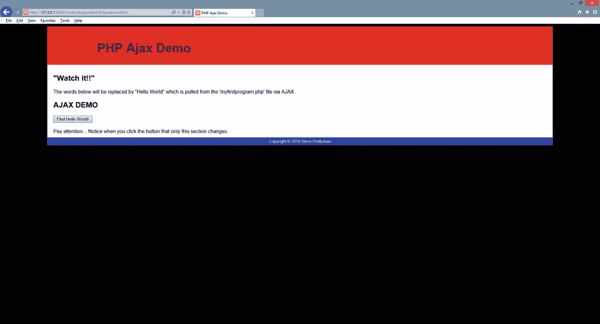

图 2-1

`ajaxdemo.html`

如果你的代码无法运行，请仔细检查文件名（确保它们没有 `.txt` 后缀）。如果你看到的是空白页面，则说明存在问题。请检查代码中是否有多余字符。是否遗漏了 `;`、`{`、`(` 或其他代码符号？如果收到错误消息，请将其粘贴到浏览器中，寻找可能的解决方案。如果没有看到错误消息，请查看 Apache 和 PHP 的日志（参见第 1 章）以确定其他可能的问题。

如果没有语法错误（或文件名/位置错误），当用户点击按钮时，页面将使用 AJAX 请求 `myfirstprogram.php` 文件，并会在 `div` 标签之间显示程序执行的结果。在本例中，将显示 `Hello World`。

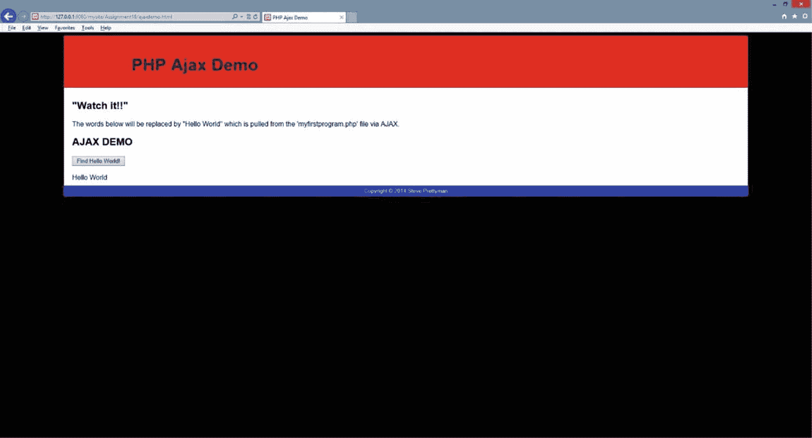

图 2-2

AJAX 请求后的 `ajaxdemo.html` 文件

## 动手实践

1.  将从本书网站获取的上述三个文件复制到你的项目文件夹中（即你在 Apache 中运行项目的位置）。运行 HTML 程序。测试成功了吗？如果没有，原因是什么？

2.  更改你的 `.js` 文件的名称，并修改 HTML 文件中的链接标签以反映新的文件名。测试你的 HTML 程序。测试成功了吗？如果没有，原因是什么？

3.  更改你的 PHP 程序的名称。修改 `.js` 文件以反映 PHP 程序的新名称。测试你的 HTML 程序。测试成功了吗？如果没有，原因是什么？

## PHP、AJAX 和 CSS——智能手机 Web 应用程序

至此，你应该开始发现创建 PHP 应用程序的灵活性和强大功能。你可能有点失望，因为我们没有详细讨论智能手机的应用程序开发。目前，PHP 通常不用于创建智能手机应用程序。然而，随着 PHP 8 效率和速度的提高，或许将来某一天会实现。但有时，我们确实希望让智能手机能够通过其浏览器访问 Web 应用程序。只需对之前的演示进行少量修改，我们就能提供这种能力。这为你提供了一个适用于任何包含浏览器的设备（无论大小）的应用程序。

你可以在不调整 HTML（除添加一个链接外）、JavaScript 或 PHP 代码的情况下进行此更改。你可以调整 `ajaxdemo` 网页，使其能够在智能手机或其他移动设备上使用 CSS 正确格式化。在这个例子中，你只需要修改 HTML 文件来检测显示屏幕的尺寸（界面）。然后，CSS 可用于更改图形以适配合适的屏幕尺寸。

如果 PHP 文件包含大量 HTML（和/或其他 CSS 代码），我们可能还需要调整 PHP 文件。然而，我们应该始终考虑让 CSS 来格式化整体输出（而不是 PHP 文件）。这将允许你在多个容器（主机）中使用相同的代码。

你可以在 `ajaxdemo.html` 文件中原始 CSS 文件链接的下方添加以下几行代码：

> **注意**
> 新的完整 HTML 文件位于 Apress 网站上。

这两行代码将尝试确定显示屏的尺寸，并为任何 480 像素或更小的屏幕使用新的 CSS 文件。该演示程序本身就能适配大多数移动设备。不过，我们还是对它进行一些调整，以移除部分间距、内边距和外边距。

> **注意**
> 你也可以针对多种设备尺寸使用 CSS3 Flexbox 属性。由于使用该属性需要对 CSS 有更深入的了解，因此我们坚持使用“旧式”方法。你可以通过以下 w3schools 链接找到有关 CSS3 Flexbox 的更多信息：[`www.w3schools.com/css/css2_flexbox.asp`](http://www.w3schools.com/css/css2_flexbox.asp)。

```
body { background-color: #000000;
font-family: Arial, Verdana, sans-serif; margin: 0; }
#wrapper { margin: 0 auto;
width: 100%;
margin: 0;
min-width: 0px;
background-color: #cc0000;
color: #000066; }
#header { background-color: #ff0000;
color: #00005D;
font-size: 100%;
padding: 0.5px; }
h1 { margin: 0px; }
#content { background-color: #ffffff;
color: #000000;
padding: 0.5px;
overflow: auto; }
#footer { font-size: 80%;
text-align: left;
padding: 0px;
background-color: #0000FF;
color: #ffffff;
clear: both;}
h2 { color: #000000;
font-family: Arial, sans-serif;
margin: 0px; }
#floatright { float: none;
margin: 0px; }
```

示例 2-4
`ajaxdemomobile.css` 文件

将示例 2-4 与示例 2-3 进行比较。示例 2-4 中的代码并不完美，但它让你了解了可以在原始 CSS 文件中进行哪些调整以适配移动设备显示。此示例将外边距和内边距缩小到零或几乎为零。这大大减少了在较小移动设备显示屏上浪费的空间。

## 动手实践

1.  在 Apress 网站上找到新的 HTML 文件和 CSS 文件。如果你有 Web 主机提供商，请将这些文件（以及 `.js` 文件）上传到主机上。尝试从你的智能手机访问 HTML 页面。测试成功了吗？如果没有，原因是什么？页面在你的手机上格式正确吗？如果没有，你认为需要调整什么？

> **注意**
> 如果你没有互联网上的主机网站，你也可以通过下载网上免费的移动模拟器之一来测试这个 CSS 文件。你也可以修改 HTML 文件中的链接标签，使其指向 `ajaxdemomobile.css` 文件而不是 `ajaxdemo.css` 文件。然后尝试缩小浏览器窗口的大小，以模拟智能手机屏幕。

## PHP、HTML、JavaScript、CSS 和动态网页

作为 PHP 程序容器（主机）的最后一个例子，我们来考虑一下浏览器。正如你在本章中所见，你可以使用 HTML 文件来调用我们的 PHP 程序（在前一个演示中点击按钮）。正如第 1 章所述，这将导致 PHP 程序执行，并将结果返回给浏览器。你也可以让 PHP 程序返回 HTML 代码。

```php
<?php
print "<html><body>";
print "<h1>我的程序</h1>";
print "<p>世界你好</p>";
print "</body></html>";
?>
```

示例 2-5
由 PHP 程序创建的动态 HTML 页面

你可以将一个完整的 HTML 页面（甚至包含 JavaScript 和链接）返回给请求执行 PHP 程序的设备（浏览器）。示例 2-5 展示了一段在 PHP 代码中创建完整动态 HTML 页面的方法。生成的输出甚至可以包含 CSS 文件的链接，以及用于格式化的内嵌 CSS 标签。不过，我强烈建议你谨慎使用那些依赖容器特定尺寸的内嵌 CSS 标签。作为开发者，你无法预知哪种设备会显示结果（PC、智能手机、平板还是 iPad）。更好的做法是提供多个 CSS 文件（如前文所示），以便根据不同设备对输出结果进行格式化。

在前面的示例中，我们将初始界面（HTML 和 JavaScript）与 PHP 程序分离开来。实际上，你可以将 HTML（用于显示初始网页）和 PHP 代码放在同一个文件中。

你可以创建一个 PHP 文件，用于判断用户之前是否请求过该页面。如果用户从未请求过，或者浏览器会话已超时，那么 PHP 程序可以显示一个用于用户交互（例如点击按钮）的初始 HTML 页面。然后，同一个程序可以再次调用自身，以判断按钮是否被点击，并返回相应的响应。

我们来看一个不同版本的 `Hello World` 程序来实现这一功能。

- *如需深入了解 PHP `if` 语句的演示，请查看 PHP 手册*：[www.php.net/manual/en/control-structures.if.php](http://www.php.net/manual/en/control-structures.if.php)。

```php
<?php
if (isset($_POST['submitbutton']))
{
print "<h1>Hello World</h1>";
}
else
{
print "PHP Example";
print "<form method='post' action='callmyself.php'>";
print "<input type='submit' name='submitbutton' value='查找 Hello World！'>";
print "</form>";
}
?>
```

示例 2-6
`callmyself.php` 文件

该程序包含一个简单的 `if` 条件语句，用于判断用户是否点击了提交按钮。

`if` 语句的格式如下：

```php
if (条件语句)
{
// 如果条件语句为真，则执行的代码
}
else
{
// 如果条件语句为假，则执行的代码
}
```

条件语句通常比较两个值，判断它们是否相同或不同，或者调用一个返回 `true` 或 `false` 值的方法。稍后我们会讨论返回值的方法。现在，先来看一个第一种类型的简单示例。

条件语句使用比较运算符（`==`、`<`、`>`、`<=` 和 `>=`）来判断语句是 `true` 还是 `false`。

```php
if ( a > b)
{
print "这是 A！";
}
else
{
print "这是 B！";
}
```

在这个示例中，比较了变量 `a` 和 `b` 中的值。如果 `a` 大于 `b`，则显示“这是 A！”。否则，显示“这是 B！”。PHP 在判断可能有必要时，会进行一些类型转换。例如，假设 `a = "5"`，而 `b = 6`。PHP 会将 `a` 中的字符串 5 转换为数字 5，以便进行比较。许多语言不会这样做，如果你试图比较字符串和数字，它们会显示错误。如果你不希望进行这种转换，可以使用一些特殊的比较运算符。例如，你可以使用三个等号（`a === b`）来判断两个值是否绝对相等，而不是使用两个等号。我们将在第 3 章中更详细地讨论比较运算符。

- *安全性与性能* — *尽可能使用* `===` *代替* `==`。这将确保你得到完全符合预期的结果。

在示例 2-6 中，`if` 语句调用了一个方法（`isset`）。`$_POST` 尝试从 HTML 表单中检索属性（`'submitbutton'`）及其值（`"查找 Hello World！"`），该表单使用了 HTTP POST 方法来传递信息（你也可以使用 `$_GET` 和 HTTP GET）。`isset` 方法会根据 `$_POST` 能否检索到该属性（及其内容），向 `if` 语句返回 `false` 或 `true`。这个 `true` 或 `false` 结果将决定 `if` 语句执行哪段代码块。

正如第 1 章所述，HTML 表单中的对象（例如按钮）会根据对象的名称以及该对象 value 语句中包含的内容，生成一个属性与值的组合。这对于已被指定名称（`id`）和值（如示例 2-6 所示）的提交按钮也同样适用。

当程序首次被浏览器调用时，按钮尚未被点击。因此，没有创建 `submitbutton` 变量。`isset` 方法返回 `false`。程序跳转到 `else` 部分，执行用于显示 HTML 表单和提交按钮的 `print` 语句（如图 2-3 所示）。

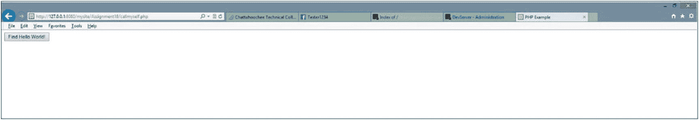

**图 2-3** 按钮点击前的 `callmyself.php`

当用户点击按钮时，程序会调用自身（查看 `form` 标签中的 `action` 参数）。这次，由于用户点击了按钮，因此存在一个 `submitbutton` 属性及变量值（`'查找 Hello World！'`）。程序判断该变量“已设置”（包含一个值），并返回 `true`。于是，`if` 语句执行 `if` 和 `else` 语句之间的那一行代码。随后显示 `Hello World`。这个 PHP 程序处理了应用程序的所有功能，而未使用任何现有的静态 HTML 页面。

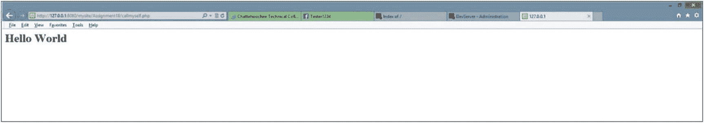

**图 2-4** 按钮点击后的 `callmyself.php`

这种技术的优点在于所有代码都可以包含在一个文件中。因此，所有更改都在一个地方完成。这种技术的缺点也在于所有代码都在一个文件中。代码越复杂，就越容易变得“混乱”。整理代码的一种方法是把代码移到其他 PHP 库所包含的函数中（我们稍后会讨论这一点）。另一个缺点是，在不能影响用户的前提下更改文件名。如果你将文件名更改为 `mynewprogram.php`，则需要通知所有用户新的名称（以及可能更改的位置）。之前使用 AJAX 的示例允许你在 HTML 代码页面中更改文件名，但不需要更改用户请求的 HTML 页面的实际名称。

#### 动手实践

1. 在 Apress 网站上找到 `callmyself.php` 文件。将文件下载到你的 Apache `projects` 文件夹中。修改并添加 `print` 语句，以显示你的完整姓名、学期和专业。测试你的程序。你的程序是否成功运行？如果没有，原因是什么？

### PHP 三层架构

本章大部分内容都在探讨能够"托管"PHP 应用程序的各种平台（或容器）。我们发现，PHP 几乎可以在任何容器（个人电脑、智能手机/移动设备或浏览器）中显示其输出内容。PHP 能够轻松地与 JavaScript、HTML 和 CSS 交互，正是这种灵活性的体现。如今，几乎所有平台都能与互联网交互（而那些目前尚不能交互的平台，未来也将具备此能力）。任何能与互联网交互的平台，也都能与 PHP 应用程序交互。

这种界面上的独立性（或者说灵活性）表明了界面的平台或主机与应用程序的其他"层"（部分）之间存在逻辑上的分离。这引出了对三层架构和 PHP 应用程序逻辑设计的探讨。应用程序规模越大，就越可能需要将其拆分为模块。此外，这些模块很可能驻留在不同的服务器（或 Web 服务器）上。大型应用程序通常需要多名程序员同时编写代码。这些程序员甚至可能使用不同的语言来创建程序模块。

构建大型应用程序与组装汽车并没有太大区别。汽车的各个组件（车身、车轮、电子设备和发动机）都是先单独组装好的。每个组装完成的组件随后被放置到汽车底盘内。然后，组件之间通过软管、电线和皮带相互连接。组装完成后，汽车的所有组件协同工作。如果某个组件发生故障，可以将其更换，而无需更换或更改汽车上的任何其他组件。

模块化（或组件化）编程的理念基于这样一种方法：将代码块单独创建，然后与其他模块组合，从而构建出一个可正常运行的应用程序。这些模块可以被修改或替换，而无需更改其他模块。这种方法已经存在了一段时间。即使在今天，许多程序也并非模块化的，因为小型程序即使不拆分为模块也能高效运行。然而，随着这些应用扩展为更大的应用程序，它们会变得难以更新或维护。一次更改需要更新整个应用程序，而不仅仅是某个模块。在某个节点上，一个未经模块化设计而在不断扩展的应用程序，必须为了更好的可维护性和可靠性而从头开始重新设计成模块化结构。

如第 1 章所述，搜索引擎能够在用户 PC 的浏览器上显示网页界面。用户输入搜索请求后，信息会通过互联网传输到一台远程服务器（我们不知道它在哪里），该服务器执行一个搜索应用程序（我们不知道它是用什么编程语言创建的）。然后，该应用程序在数据库中（我们不知道它使用的是什么数据库管理系统，也不知道它位于何处）搜索所请求的信息。结果被发送回应用程序，应用程序再将信息（通过 Web 服务器）发送回用户 PC 上的浏览器。

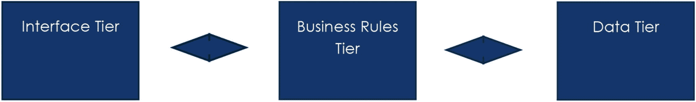

**图 2-5** 三层模块化应用程序设计

此过程中的信息流动使得这类 Web 应用程序的设计自然而然地划分为（至少）三层（模块）：**界面层、业务规则层和数据层**。将代码划分为不同层的一个优点是能够实现层在多个应用程序中的复用。例如，我们的搜索引擎可以在多个设备上使用相同的业务规则层和数据层，同时使用不同的界面（PC 应用程序或智能手机应用程序）。不同的层也可以独立更新，而不会影响其他层。智能手机应用程序界面可以更新以利用最新操作系统的新功能，而无需更改业务规则层或数据层。也可以更新业务规则层内的代码以修复逻辑错误，而无需更改界面层或数据层。让我们来看看每一层的典型职责。

- **模块化三层应用程序** – 设计、编程——三层设计提供了创建可分离为界面层、业务规则层和数据层的程序的能力。界面层包含所有与向用户显示信息相关的图形和程序代码。业务规则层不包含界面。但是，它处理从界面层提交的任何信息，然后可以将信息提交给数据层进行存储。数据层是应用程序的主要存储位置，可能涉及使用数据库。每个层都可以独立地更改和构建（编译），而不会影响其他层。

#### 动手实践

1.  模块化设计的三个层分别是什么名称？

2.  模块化设计与设计建筑物有何相似之处？

3.  模块化编程如何使编码更高效？

#### 界面层

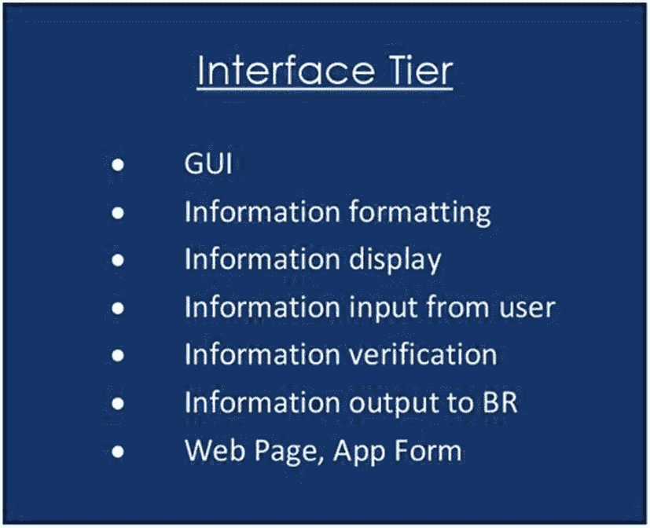

**图 2-6** 界面层

界面层（IT）负责显示信息，并允许用户与应用程序交互。大多数界面提供图形用户界面（GUI），它为用户提供了一种查看信息和与应用程序交互的友好方式。GUI 界面提供常见的对象，包括文本框和按钮，这有助于用户快速适应新的应用程序。此外，通常还会包含图片、图像、图标、视频和声音以保持用户的兴趣。菜单和其他导航对象也常被包含在内，以帮助用户成功地在应用程序中导航。

- **对象** – 对象是已经编译好供应用程序使用的代码块。对象包含方法和属性。方法（或函数）是完成某项任务的代码块（例如，将项目放入列表框中）。属性（或变量）是可以更改的对象特征（例如，背景颜色）。对象通常经过充分测试且没有错误。通过重用现有对象，程序员可以更快地创建更可靠的程序。

该层将使用对象（如标签和图片框）或脚本代码（如本章中的 `ajaxdemo.html` 示例）来显示信息。该层还通过交互式对象（如文本框和按钮）接收来自用户的信息。静态信息可以来自该层内部（通过菜单、徽标或页脚）。动态信息通常由业务规则层提供给该层（例如本章中 `myfirstprogram.php` 的输出）。

##### 界面层中的代码部分

界面层中可能存在一些代码（后续章节会展示），这些代码负责准备要发送给其他层的信息。例如，用于验证用户是否已输入所有必要信息或正确信息（如年龄文本框中的数字字符）的 `JavaScript` 代码是可接受的。此外，可能还有代码负责将从业务规则层接收的信息（例如将数字转换为文本格式）进行预处理，以便在界面中显示。

- **验证/验证码** — 验证码用于校验信息。这些代码将接收到的信息与预期的标准格式进行比对。例如，代码可以验证电子邮件地址是否同时包含 `@` 和 `.`（句点）。如果信息包含这两个符号，则可视为“有效”（尽管我们仍不确定该邮箱地址是否真实存在）。如果缺少任一符号，则代码判定为无效。无效信息通常会导致程序向用户显示错误消息，要求重新输入有效信息。

界面层通常提供能够响应用户交互（如点击提交按钮）的代码，这通常被称为*用户事件*。还可能存在代码，用于处理用户提供的信息，以便供其他层使用（例如将用户输入的文本转换为数字格式，供业务规则层进行计算）。

- **事件 — 事件驱动型语言**（如 `PHP`）可以在事件发生时执行代码块。事件既可以是用户的操作（如点击按钮），也可以由操作系统触发。程序提供监听代码来“侦听”事件。当事件发生时，代码会提供一个事件方法，然后该方法被执行。

程序根据是否提供监听代码来选择要监听的事件。

界面层不应直接与数据库管理系统或数据库本身交互。如果这样做，该层将被锁定在特定的数据库位置和实际数据库设计中。该层不应（除显示目的外）操作数据。任何与应用程序本身相关的记账、数学计算或数据处理都应在业务规则层完成。

##### 界面层中的该做与不该做

| 该做 | 不该做 |
| --- | --- |
| 格式化数据以用于显示 | 从数据库访问数据 |
| 验证用户信息的正确性 | 计算结果 |
| 响应用户事件 | 处理信息 |
| 处理意外情况（异常） | 验证用户 ID 和密码 |
| 为业务规则层格式化数据 |  |

- **数据库管理系统（DBMS）** — 数据库管理系统是一种允许用户或应用程序创建和定义数据库的软件。它还提供了在数据库中插入、更新或删除信息的能力。

#### 动手实践

1.  列举三个应包含在界面层中的项目示例。

2.  列举三个不应包含在界面层中的项目示例。

3.  界面层中可以包含一些程序代码吗？如果可以，这些代码提供了哪些任务功能？

### 业务规则层

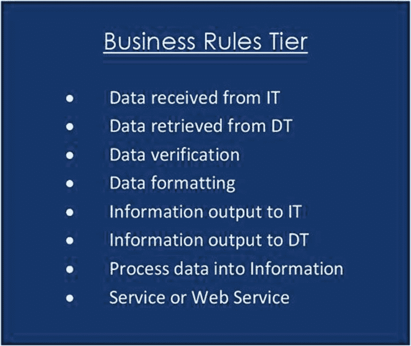

**图 2-7** 业务规则层

业务规则层处理从界面层和数据层接收的所有信息与数据。该层还会返回界面层请求的信息（例如返回 `"Hello World"`），并将信息提交给数据层进行存储。大部分实际编程代码都包含在这一层中。

业务规则层的代码通常使一个应用程序与其他应用程序真正区别开来。如果某个应用程序拥有版权，其独特创意的算法很可能隐藏在该层中。例如，网络搜索引擎之间的许多差异以及信息最终如何显示的机制，都嵌入在业务规则层中。

与可能包含浏览器中代码的界面层不同，业务层的所有编码都是使用服务器上的程序（例如 `PHP`）完成的。驻留在服务器上的脚本和编程代码由服务器本身保护，用户无法访问。业务层代码也可以驻留在应用服务器上（作为服务）或网络服务器上（作为网络服务）。服务器通过不允许用户直接访问，来确保该层中代码的安全。

- **服务器/应用服务器/网络服务器** — 服务器连接到网络，为网络（或互联网）上的任何节点（机器）提供服务。一台服务器可以提供不止一种服务（通信、安全和/或存储），也可以提供特定服务。应用服务器承载可供网络（或互联网）上用户访问的应用程序。网络服务器托管网页和网络应用程序。它们通常暴露在公司的外部访问中。

- **服务** — 服务是驻留在计算机或服务器内存中、响应其他应用程序请求的应用程序。服务可以在计算机或服务器启动时自动加载到内存中，也可以根据需要手动启动和停止。服务没有图形用户界面。业务规则层可以作为一项或多项服务驻留在计算机或服务器上。

在应用程序各层之间传递的信息可能会受到黑客的篡改；因此，该层可能包含类似于界面层中的代码，用于验证接收数据的有效性和正确格式。

从该层传递到其他层的信息可以格式化为易于接收的形式。例如，一个*数据集*（类似于表格或电子表格）可以返回给界面层，以便在网页上的表格或列表框中显示。数据集也可以发送到数据层，以便插入到数据库中。

- **数据集** — *数据集*是一种可以容纳多个数据表的结构。数据表类似于数据库中的表（包含行、列和数据）或电子表格。数据集通常用于在层之间和方法之间传递信息。

业务规则层向请求信息的各层返回数值。该层不提供任何图形用户界面或任何形式的表单。不需要界面，因为该层在任何时候都不与用户直接接触。所有与业务规则层的通信都通过界面层或数据层处理。与界面层类似，业务规则层不直接更新数据库中的存储信息。所有存储更新都在数据层进行。

##### 业务规则层中的该做与不该做

| 该做 | 不该做 |
| --- | --- |
| 操作数据 | 显示信息 |
| 格式化数据 | 将数据保存到辅助存储设备 |
| 将数据存储在内存中 | 显示错误消息 |
| 抛出异常 |  |
| 验证数据 |  |

#### 动手实践

1.  业务规则层代码可以完成哪些与界面层代码相似的任务？为什么这些代码可能在这两个层中重复出现？

2.  业务规则层如何传递和接收数据（信息）？

3.  为什么业务规则层必须通过接口层间接与用户交互以提供信息？

### 数据层

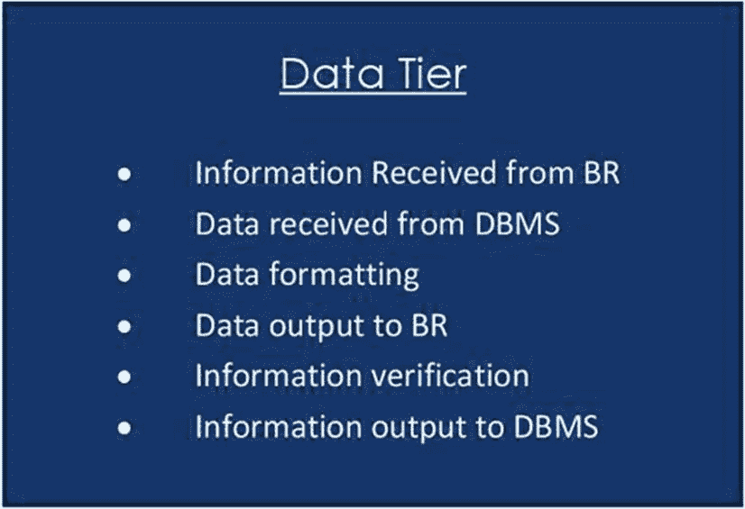

**图 2-8**

## 数据层

数据层的主要功能是将信息存储到辅助设备上，或向业务规则层返回数据。数据可以（并且通常）通过数据库管理系统（如 `MySQL` 或 `MariaDB`）存储在数据库中。该层与业务规则层进行交互，因为在数据显示之前可能需要对数据进行处理，例如生成报告。数据从该层返回时，会采用业务规则层（及编程语言）能够接受的格式。常见格式包括 `JSON`、`XML`、`SOAP` 和数据集。

- `JSON`——*JavaScript 对象表示法*是一种与 `XML` 类似的格式，用于存储和交换数据。`JSON` 可以在编辑器或浏览器中查看。它最常用于在层之间传递数据。

- `XML`——*可扩展标记语言*是一种与 `HTML` 类似的标记语言，用于存储和描述数据。`XML` 也可用于在层之间传输数据。

- `SOAP`——*简单对象访问协议*用于与 Web 服务交换数据。它与 `HTTP`（超文本传输协议）和 `SMTP`（简单邮件传输协议）协同工作，为应用程序和 Web 服务之间提供通信。

- *Web 服务*——一种没有界面的应用程序，可被调用来处理信息。Web 服务可以在 Web 服务器上远程提供业务层和/或数据层的功能。*Web 服务描述语言*（`WSDL`）用于描述对 Web 服务的调用，以及 Web 服务所接受和返回信息的格式。`WSDL` 与 `XML` 类似。

数据层的验证在数据库管理系统和/或通过程序代码完成。该层的验证是在更新数据库之前确保数据可靠且准确的最后机会。在存储前捕获验证问题，远比无效信息被记录后再处理要容易得多。

数据存储可以是本地的，也可以是远程的。移动设备可以将数据限制存储在本地数据库（如智能手机）中，但也可以使用 `WSDL`（Web 服务）在远程服务器或云端（如 `Microsoft Azure`）存储和检索信息。此外，许多应用程序会通过 Cookie 在本地保存少量信息，或将大量信息存储在远程数据库中。

- *Microsoft Azure*——`Microsoft Azure` 是一个云平台，提供数据服务、应用程序服务和网络服务。`Visual Studio` 应用程序可以上传到 `Microsoft Azure` 云端并进行安全保护。

数据层使用 `SQL` 语句（`INSERT`、`DELETE`、`UPDATE` 和 `SELECT`）来检索和更新数据库中的信息。然而，更改信息的实际请求来自业务规则层。例如，用户在 Web 应用程序中请求更改地址时，必须先通过接口层输入更改内容，在业务规则层格式化更新请求，然后在数据层更改数据库中的信息。

| 应该做 | 不应该做 |
| --- | --- |
| 将数据保存到辅助设备 | 操作数据 |
| 更新辅助设备上的数据 | 显示错误消息 |
| 引发异常 | 显示信息 |
| 验证数据 |  |

### 动手实践

1. 为什么数据层在将信息存入数据库之前必须再次进行验证？

2. 数据层中可以存在什么类型的代码（如果有的话）？

3. `SQL` 用于什么目的？

### 融会贯通

程序开发生命周期（`PDLC`）引导我们完成应用开发的整体设计与创建过程。应用开发成功的关键在于，在开始编码和开发之前，对系统布局进行合理规划。这样做可以减少可能出现的错误和问题的数量。许多项目可能会陷入开发者因前期规划不足而无法摆脱的"困境"。不同的作者和讲师对规划过程所需时间的估算各不相同，因为这取决于个人情况。技能更娴熟或经验更丰富的人可能比不那么自信的人所做的规划要少。然而，每个人至少都会规划出所需的模块以及模块之间流动的数据类型，即使只是在草稿纸上完成。另一个关键点在于，要在编码和开发过程中不断修正你的计划。当你开始编码时，你会发现自己"没想到"某些情况。这时应立即返回并调整你的计划。你越常这样做，就越不可能陷入找不到解决办法的"困境"。

在`PDLC`过程中，始终要邀请用户参与，并组建一支强大的专家团队。请记住，你开发这个项目是为了让你的客户满意。你或许自认为拥有终极的设计和解决方案。然而，如果用户不认同你，那一切都没有意义。有时你确实需要调整自己的思路，使其与客户更加一致。在行业工作中，我记得在我的工作组内曾开发过一个重大的变更管理系统（我很庆幸自己没有参与这个项目）。设计人员和编码人员创建了一个非常花哨且昂贵的系统，但一旦在数据中心实施后，却几乎无人使用。为什么？数据中心的工作人员并不想要一个花哨的系统；他们想要一个能快速完成所需任务的简单系统。尽管原始项目耗时六个月才完成，但一名数据中心员工利用自己的几个周末时间创建了另一个能满足他们需求的系统。那个系统后来被投入使用，并沿用了许多年。

通常，`PDLC`被定义为五个步骤：规划与信息收集、分析、设计、实施和评估。在规划与信息收集步骤中，需要汇集项目及项目团队的所有需求。同时还会创建初步文档，以回答以下问题："我们试图完成什么？"、"我们将如何完成它？"以及"我们将使用什么团队？"。在分析步骤中，需要确定项目的可行性。文档会回答以下问题："我们能否利用现有团队和资源完成项目？"、"还需要收集哪些额外资源？"以及"能否在给定的时间框架和预算内完成项目？"如果项目通过了分析步骤（许多项目未能通过），那么实际设计就开始了。在设计阶段，采用自上而下的方法，首先着眼于所需的整体模块以及模块之间的数据流。随着所需方法的确定、平台的选择、通信工具的整合以及信息存储的设计，会逐步添加更多细节。

在详细设计创建并获批后，项目进入开发和测试阶段。将进行单元测试（单个模块）和完整的应用程序测试。测试成功完成后，项目便可进入实施步骤。在实施过程中，必须决定如何安装项目以及何时安装。实施完成后，应用程序便"上线"了。但仍应持续进行评估，以确定效率需求、安全问题、逻辑问题以及可能对项目进行的整体增强。最终，大多数项目将返回该流程的第一步，以开发新版本。

本节假设规划与信息收集以及分析步骤已成功完成，这将使你进入设计步骤。我们将大致探讨确定应用程序各层中应发生何种类型活动的过程。我们还将研究可能在层之间流动的数据或信息类型。在后续章节中，我们将通过确定所需的方法类型以及必须流入和流出这些方法的信息和数据，来完善这一分析。我们还将研究为这些方法创建的实际活动和代码。

最好的学习方式是边做边学，因此让我们来看一个案例问题，并由此展开。

### 案例研究

**公司**：原子鱼苗孵化有限公司

**项目**：现场销售订单与佣金申请系统

**范围**：本系统需支持多种设备（移动端和 PC 端），方便现场销售代理、经理和薪酬人员轻松获取所需信息。系统将接收销售代理输入的信息，用于计算客户的采购成本、销售经理的销售业绩以及薪酬部门的佣金。项目第一阶段是开发该应用程序，用于接收销售代理信息、显示采购成本、计算佣金，并将信息存储到`MySQL`数据库中。平台测试成功后，将迁移至公司云平台并确保其安全性。

**输入（来自销售代理）**：销售代理编号、客户编号、订单编号、物品编号、数量及特殊需求

**输出**：（未来阶段可能确定更多信息）

**存储至数据库**：除销售代理输入的信息外，还包括：佣金、销售总额

目标是确定每一层中将要处理的信息类型、流程以及层与层之间的数据流。一旦确定，这些信息可用于开发一个通用的、空的层级结构，最终用于承载整个项目。

#### 接口层

公司要求系统支持多种设备访问。因此，我们必须考虑到除了笔记本电脑和 PC 之外，移动设备（平板电脑和智能手机）也将用于信息的输入和输出。我们可能决定为每种设备类型创建多个接口。通过三层设计，你可以设计一个系统，在共享业务规则层和数据层内容的同时，实现这种灵活性。

作为设计师和/或程序员，你必须确定将要输入的信息类型：多个字段（销售代理编号、客户编号、订单编号、物品编号和数量）都表明输入的是数字。你需要确定这些字段的大小，并验证只输入了数字信息。`金额`字段是唯一可能用于未来计算的字段。因此，所有其他字段可以保持文本格式。`金额`字段在将信息传递给业务规则层之前，需要转换为`Integer`（整数）格式。`特殊需求`字段是一个较大的字段，可以接受字母数字字符。数据库目前还不存在，因此我们必须根据公司政策或/和当前使用的纸质表单来确定字段大小。经过审查，已确定客户和销售代理的编号为 8 个字符。订单编号和物品编号为 6 个字符。

收集这些信息后，你现在可以设计接口层的顶层视图，如图 2-9 所示。

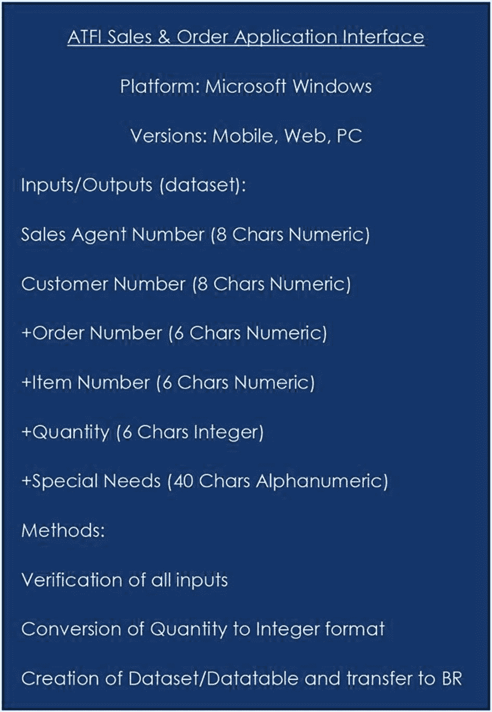

**图 2-9**

原子鱼苗孵化有限公司销售与订单应用接口

带有`+`的字段可由销售代理多次使用以输入所有信息。当创建实际数据集和数据表时，必须为这些条目提供多个列。

此外，还会存在一个（未图示的）额外表单，用于显示订单结果。此表单将显示所购物品的摘要和总成本。所有信息均可由销售代理输入、提交，并暂存于接口层（一个 cookie？），直到销售代理指示订单完成。然后，信息可被传输到业务规则层进行处理。之后，业务规则层可将信息返回，显示在第二个表单中。第二个表单可包含一个“批准”（或取消）按钮。一旦“批准”，信息便可传递到数据层进行存储。

### 业务规则层

业务规则层将包含两个处理流程。一个流程将在销售代理点击“订单完成”按钮后，接收完整的订单（数据集/数据表）并计算总销售成本。然后，它会将此信息的摘要返回到第二个表单。另一个流程将在代理点击“批准”按钮时执行。该流程随后会计算佣金并创建一个数据集（现包含额外字段），以便传递到数据层。该信息随后将被传递以进行存储。

此外，为确保订单数据有效，需要一些方法来验证从接口层接收到的字段。传输的所有数据的安全性至关重要。任何在层之间移动的数据在处理前都必须通过安全验证。业务规则层的顶层视图如图 2-10 所示。

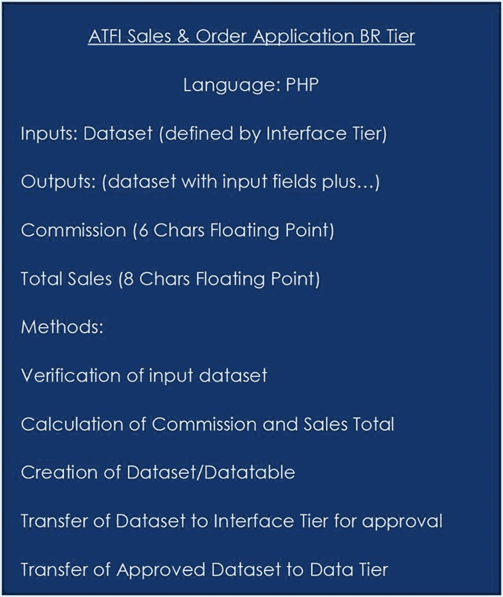

图 2-10 原子销售与订单应用业务规则层

### 数据层

在这种情形下，数据层仅用于存储由业务规则层提供的信息。该层将验证接收到的信息并将其存储到数据库中，如图 2-11 所示。

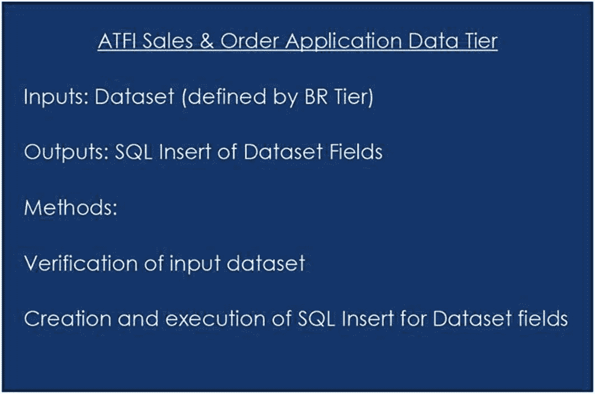

图 2-11 原子销售与订单应用数据层

有许多工具可帮助完成设计过程。关键因素是设计者要在过程中包含所有重要信息。作为该示例的另一种做法，你可以将数据集的描述移出各层，放置在各层之间的数据流中，如图 2-12 所示。

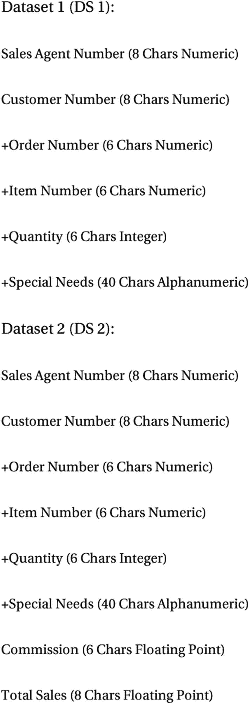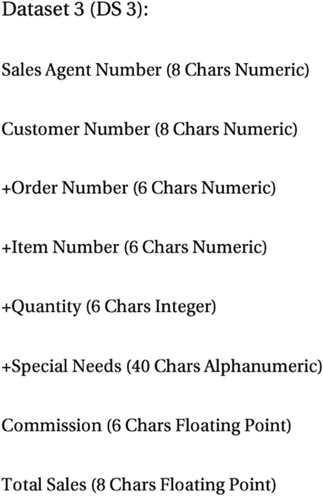

图 2-13 原子销售与订单应用三层模型

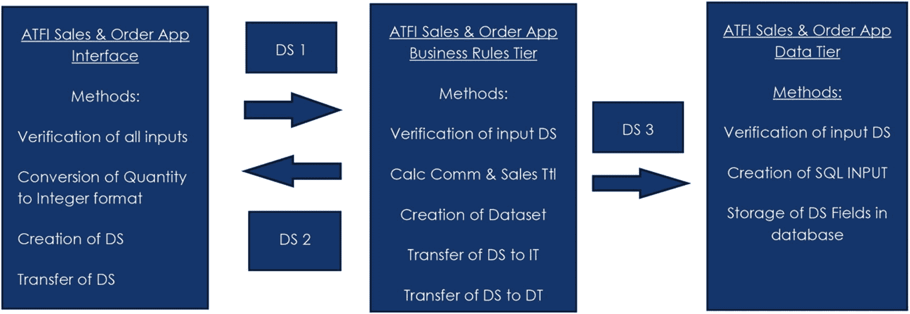

图 2-12 替代三层模型

##### 动手练习

1.  在什么时候必须将数字转换为数字形式（例如`Integer`）以便存储在数据库中？

2.  为什么使用数据集在层之间传递信息？

3.  案例示例中遗漏或忽略了哪些内容？

#### MVC 与依赖注入

MVC（模型-视图-控制器）是一种设计模式，软件工程师（包括 PHP 应用程序设计师）使用它通过控制器在视图和模型之间进行通信。*控制器*是一种软件，负责将用户的任何输入传输给模型。MVC 设计可以被认为是循环的，因为模型、控制器和视图之间能够相互通信。标准的三层模型是线性的：接口层要接收信息或向数据层传递信息，必须通过业务规则层。市场上有许多工具（如 Ruby on Rails）可以帮助软件工程师设计 MVC 应用程序。

- 访问 [`rubyonrails.org/`](https://rubyonrails.org/) 查看 MVC 应用程序的示例。

MVC 与基于组件的设计均可运用**依赖注入**。依赖注入允许程序（客户端）在使用某段代码（如一个类）时，无需了解该代码的具体实现。这使得各模块能够独立开发、更新、测试并实现可复用性。这类似于汽车点火装置与起动机的通信方式：点火装置几乎不了解起动机组件及其运作原理，甚至不知道起动机的品牌，它只需向起动机发送信号（电流）指令其工作。若更换了起动机，只要它在接收信号后仍能正常运转，点火装置就不会察觉也不受该变更的影响。

## 章节术语表

| 容器 | 平台 |
| --- | --- |
| AJAX | HTTP GET |
| `XMLHttpRequest` | `document.getElementById` |
| CSS | 条件语句 |
| If 语句 | 三层架构 |
| 界面层 | 业务逻辑层 |
| 数据层 | 图形用户界面（GUI） |
| 对象 | 验证码 |
| 事件 | 数据库管理系统 |
| 服务器 | 应用服务器 |
| Web 服务器 | 服务 |
| 数据集 | JSON |
| XML | SOAP |
| WSDL | SQL |
| Microsoft Azure | PDLC |
| 规划与信息收集 | 分析步骤 |
| 设计步骤 | 实现步骤 |
| 评估步骤 | MVC（模型-视图-控制器） |
| 依赖注入 | |

## 章节问题与项目

### 多项选择

1.  界面层  

    1.  是应用程序的主要存储位置，可能包含数据库的使用  

    2.  提供文本框、按钮等通用对象，帮助用户快速适应新应用程序  

    3.  应被用于所有与应用程序相关的会计、数学计算或数据处理  

    4.  显示信息并允许用户与应用程序进行交互

2.  一个`服务`是一个应用程序，它  

    1.  可以在需要时手动启动和停止  

    2.  没有界面  

    3.  驻留在计算机内存中  

    4.  以上全部

3.  SOAP 代表  

    1.  安全对象访问协议  

    2.  简单对象访问过程  

    3.  简单对象访问协议  

    4.  以上均不对

4.  PDLC 的五个步骤是  

    1.  规划与信息存储、分析、设计、实现、评估  

    2.  规划与信息收集、分析、设计、实现、评估  

    3.  规划与信息收集、分析、数据、实现、评估  

    4.  规划与信息收集、分析、设计、观察、评估

5.  网络服务描述语言用于  

    1.  描述对 Web 服务器的调用以及 Web 服务发送和返回信息的格式  

    2.  描述对 Web 服务的调用以及 Web 服务所接受信息的格式  

    3.  描述 HTML 文档中使用的代码  

    4.  描述对 Web 服务的调用并丢弃接收到的信息

6.  CSS 代表  

    1.  级联静态样式  

    2.  层叠样式表  

    3.  级联脚本表  

    4.  缓存样式脚本

7.  哪类代码应放置在 `<script>......</script>` 标签之间？  

    1.  Java  

    2.  HTML  

    3.  Servlets  

    4.  JavaScript

8.  三层架构由哪些部分构成？  

    1.  GUI/标签/验证  

    2.  界面层/业务层/数据访问层  

    3.  对象/变量/SQL  

    4.  JSP/Servlet/套接字

9.  对模型-视图-控制器（MVC）的最佳描述是  

    1.  一种将给定软件应用划分为三个相互连接部分的架构模式。  

    2.  一种用于在任何浏览器中验证和保护信息的编程语言。  

    3.  一种主要用于检查用户是否以正确格式输入信息的验证器。  

    4.  一种用于转换有害代码使其无法被编译器执行的方法。

10. 在分析步骤中执行什么？

    1.  项目可行性评估

    2.  代码创建与错误修正

    3.  项目逻辑数据流确定

    4.  对已实现应用进行重新评估以寻找可能的改进方案

11. 为什么必须验证你的代码？

    1.  确定你所用浏览器的功能

    2.  确保你的信息正确且安全

    3.  确保你的代码仅包含 JavaScript 和 HTML5

    4.  检查你的浏览器能否运行你的代码

12. 引用外部层叠样式表的正确 HTML 语法是什么？

    1.  `<stylesheet>my_style_sheet.css</stylesheet>`

    2.  `<link rel="stylesheet" type="text/css" href="my_style_sheet.css">`

    3.  `<style src="my_style_sheet.css">`

    4.  以上都不是

13. 哪个层次用于存储和检索数据？

    1.  表示层

    2.  数据层

    3.  应用层

    4.  以上都不是

14. SQL 代表什么？

    1.  结构化提问语言

    2.  结构化查询语言

    3.  强提问语言

15. 数据集类似于

    1.  一段数据

    2.  两个单词的组合

    3.  表格或电子表格

    4.  以上都不是

**判断对错**

1.  WSDL 代表 Web 服务描述语言。

2.  AJAX 用于创建更具交互性的应用。

3.  AJAX 能够在无需重新加载整个页面的情况下动态更改网页的某些部分。

4.  使用 HTTP GET 函数时，URL 必须放在引号内。

5.  服务是由 Web 服务器提供的一种功能。

6.  设计步骤是在分析步骤成功完成后进行的。

7.  MVC（模型-视图-控制器）是一种软件工程师（包括 PHP 应用设计师）使用的设计模式，通过控制器在视图和模型之间进行通信。

8.  规划和信息收集是 PDLC 的一部分。

9.  依赖注入允许程序客户端输入一段代码，以了解它将使用的代码块的实现方式。

10. 对象是已经编译好、供应用程序内部使用的代码块。

11. HTML 代表超文本标记语言。

12. 方法签名包括方法名称以及其参数的数量、类型和顺序。

13. 数据集不是在三层架构中各层之间发送数据时使用的多种格式之一。

## 简答/论述题

1.  请用自己的语言简要描述 PDLC 中的每个步骤。

2.  你认为为什么使用 PHP 开发 PC 应用程序的情况有所减少？

3.  创建使用 AJAX 的网页有哪些优势？

## 项目实践

1.  使用本章所演示的 PDLC 步骤，为智能手机和移动设备应用设计逻辑，该应用允许水表抄表员输入完整地址和水表读数。该应用应验证信息，并将有效信息发送到 MySQL 数据库。如果信息无效，则应向用户显示一条消息，指出问题所在。

2.  调整本章中的 AJAX 示例（代码可在本书网站上获取），以显示一份迷你版的个人简历。

3.  调整`Hello World`（示例`[2-6]`，`callmyself.php`）程序，以显示你所在学院或大学的名称、地址和主要电话号码。

## 期末项目

1.  利用你在第`[1]`章期末项目任务中确定的信息，以及本章展示的设计技术，为 ABC 计算机配件库存管理系统开发一个逻辑设计。该设计应包含所有可能的程序、接口和数据存储。应用设计必须是三层架构（接口层、业务逻辑层和数据层）。你的最终设计应类似于本章中展示的示例。