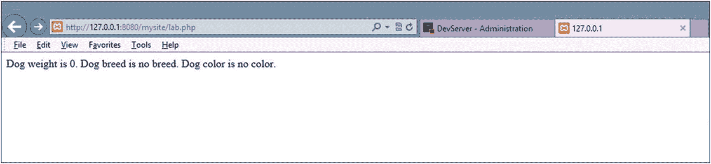
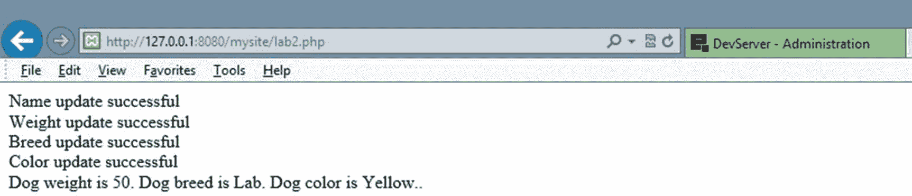
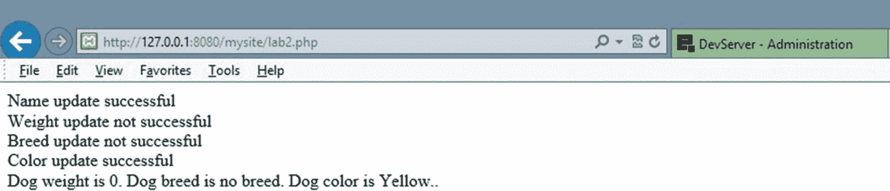
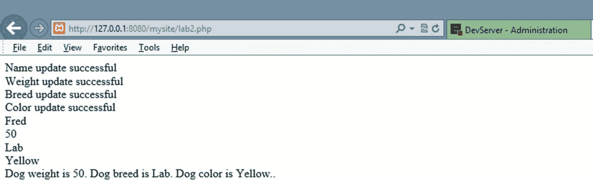
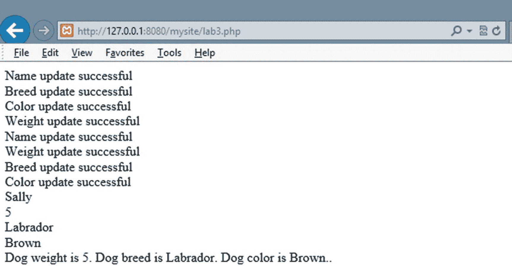
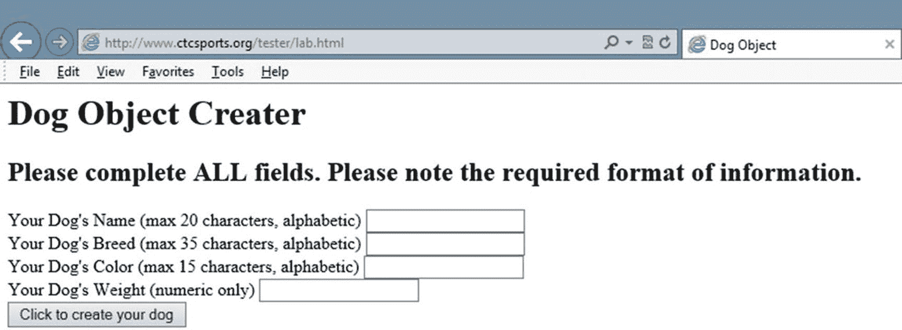
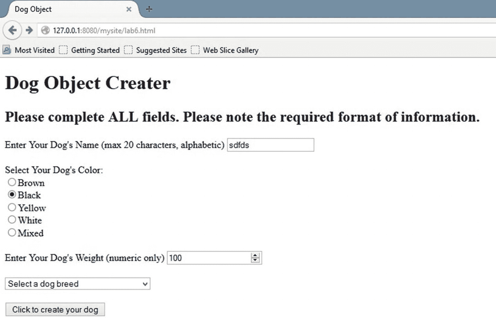
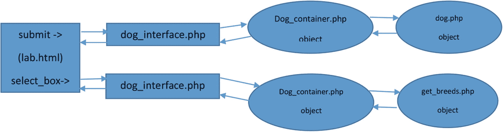

# 4. 模块化编程

*我刚看到我的人生在眼前闪过，而我所能看到的只有一个闭合标签……*

## 章节目标/学生学习成果

完成本章后，学生将能够

*   创建一个无错误的、简单的面向对象 (OO) 模块化 PHP 程序
*   创建一个 PHP 类并实例化该类（对象）
*   创建一个 OO PHP 封装程序，包括 GET 和 SET 方法
*   创建接受参数并返回信息的 PHP 方法（函数）
*   创建 PHP 公有和私有属性（变量）
*   将来自另一个文件或库的现有 PHP 代码导入到程序中
*   使用三元（条件）运算符验证接收到的信息


### PHP 库、扩展、类与对象

PHP 的一大优势在于能够轻松地将代码模块存储在库中。代码一旦存入库中，便可方便地在其他程序中复用。使用那些已在“实际”环境中经过充分测试和使用的代码，能大大减少程序错误并提高生产力，因为你无需重新发明轮子。没有必要重新创建已经成功运行的代码，这既浪费时间和精力，又容易导致不必要的程序错误。实际上，程序员可能并不了解代码模块（`class`）中具体存在什么代码。然而，程序员知道可以向这个“黑箱”传递哪些参数（例如数字），以及能从黑箱中获得什么结果（例如数字之和）。

你可能会担心：程序员盲目地将信息传入黑箱，又盲目地接收返回的信息。但这其实是个优势，而非劣势。它允许模块的创建者更新代码，而不会影响模块的使用方式。只要模块接受相同的输入并返回相同的输出，使用该模块的程序员就察觉不到任何变化。模块可以进行更新以提升效率、增强安全性或修正程序代码问题，而无需用户改变他们在代码中处理该模块的方式。

#### PHP 扩展

```
extension=bz2
extension=curl
;extension=ffi
;extension=ftp
extension=fileinfo
extension=gd2
extension=gettext
;extension=gmp
;extension=intl
;extension=imap
;extension=ldap
extension=mbstring
extension=exif
extension=mysqli
;extension=oci8_12c
;extension=odbc
;extension=openssl
;extension=pdo_firebird
extension=pdo_mysql
;extension=pdo_oci
;extension=pdo_odbc
;extension=pdo_pgsql
extension=pdo_sqlite
;extension=pgsql
;extension=shmop
;extension=snmp
;extension=soap
;extension=sockets
;extension=sodium
;extension=sqlite3
;extension=tidy
;extension=xmlrpc
;extension=xsl
例 4-1
php.ini 文件中的扩展
```

*有关 PHP 扩展及其功能的完整列表和说明，请访问* [*www.php.net/manual/en/extensions.alphabetical.php*](http://www.php.net/manual/en/extensions.alphabetical.php)*。*

PHP 拥有大量包含数千行经过充分测试代码的库。例 4-1 是 `php.ini` 文件的部分副本，展示了几个*可在 PHP 中激活的扩展（库）*。这些代码已经编译完成。通过移除扩展语句前的注释符号（`;`），即可激活 PHP 环境中已存在的库扩展。保存 INI 文件后，必须重启 PHP 和 Web 服务器（`Apache`）（参见第 1 章中关于 `php.ini` 文件位置以及重启 PHP 和 Apache 的示例）。这种便捷的库添加方式是 PHP 如此受欢迎的原因之一。还可以通过多种方法将额外的库“安装”到 PHP 中。其中一种流行的方法是 *PEAR*（PHP 扩展与应用仓库），它负责第三方库的代码分发与维护。

- *PEAR 以及其他第三方库的安装方法超出了本书的讨论范围。不过，你可以通过以下链接了解更多信息：*
- [`pear.php.net/manual/en/about-pear.php`](https://pear.php.net/manual/en/about-pear.php)

此外，程序员还可以通过 `require` 或 `require_once` 语句，将自有的代码库（未编译的）直接“安装”到应用程序中。在企业中，将可能多次复用的代码（例如数据库访问）包含进来是一种常见做法。通过将其（经过充分测试的代码）存放在本地库中，任何更改（例如数据库迁移到另一台服务器）只需在一个位置（本地库文件）处理，而无需修改多个文件。这同时也减少了代码冗余，提高了可靠性。

虽然本地库可以只包含代码方法（函数），但更常见的是这些库中包含模块（类）。这使得程序员能够采用前面提到的“黑箱”概念进行编程。三层架构（第 2 章中解释过）正是基于这一前提。通过引用包含代码的库（使用 `require` 或 `require_once` 语句），可以从库中访问代码类。一旦建立引用，便会创建该类的一个实例（`对象`）。创建实例后，程序代码就能访问该对象的所有功能。

#### 类与对象

类类似于房屋的蓝图。蓝图包含建造房屋所需所有元素的描述（特征）。但蓝图本身并非实际的房屋，它描述的是如果我们召集施工队建造房屋，可能实现的结果。蓝图不被认为实际存在（如同房屋那样存在）。然而，它描述了建造房屋所需的材料（钉子、石膏板和木材）以及建造过程。

一个**类**描述了代码模块的**特征**（属性）以及该代码中可能发生的**行为**（方法或函数）。但在创建该类的一个实例（称为**对象**）之前，它在内存中并不实际存在。一旦创建实例，就可以访问其特征和行为。正确创建的类与对象能够保护特征（属性）不受直接访问。这为对象提供了在属性值变更请求生效之前，验证该请求是否合法的机会。这通常被称为**封装**。为了保护属性不被外部直接访问，应使用 **private** 访问类型来声明它们。`Private` 访问类型只允许类内部的方法修改属性的值。**设置方法**（本章稍后讨论）用于修改属性。**获取方法**（同样在稍后讨论）通常用于检索属性值。

#### 创建 PHP 类

我们先创建一个类的基本结构。我们将创建一个 `dog` 类，它可以设置狗的某些特征（体型、品种、颜色和名字），并且能让狗“叫”以及显示各属性中保存的值。我们将把 `dog` 类创建在一个独立的文件（库）中，以便在需要时加载到程序（或任何其他程序）中。

要创建一个 PHP 类，我们使用 `class` 关键字，并将类中的所有代码封装在 `{}` 中。

```
例 4-2
dog.php 文件中的基本类结构
```


### 文本排版：PHP 类与属性

如示例 4-2 所示，`class`关键字是小写的。然而，类名`Dog`以大写字母开头。PHP 允许你创建以小写字母开头的类，但通常的实践是通过大写首字母来轻松识别类。包含类的实际文件名（`dog.php`）也应与类名（`Dog`）匹配。

*关于类、方法和属性的更多信息，请访问 php.net 上的 [www.php.net/manual/en/classobj.examples.php](http://www.php.net/manual/en/classobj.examples.php)。*

类名不能包含空格。你还应避免使用特殊字符。不过，下划线（`_`）是允许的，并且常用于连接两个单词（`set_name`）。你可能注意到，有些类名在类名之前包含双下划线（`__`）（例如`__Myclass`）。但由于存在使用此格式的“魔术”类（本章后面会介绍其中两个），这并不是推荐的做法。

如前所述，类包含属性。**属性**也称为**变量**。

属性包含类的特征。当创建类的一个实例时，属性对于该对象是唯一的。操作系统会在内存中预留一块空间来保存属性。操作系统为我们处理内存管理，包括清理不再需要的属性。在 PHP 中，一旦到达右花括号（`}`），已创建的属性就会被操作系统中的**垃圾回收器**安排移除。此时程序无法再访问该属性。

属性可以保存多种不同类型的数据。在大多数语言中，创建属性时，还必须包含一个数据类型来描述所存储数据的种类（例如字符串）。然而，PHP 不需要定义数据类型。但我们建议你使用数据类型，以便验证是否接受了正确的信息。当未声明数据类型时，PHP 会在数据首次放入属性时确定要存储在该属性中的数据类型。

属性以初始的`$`和属性名称创建。属性名称可以包含字母、数字和下划线（`_`）。下划线可以放在属性名前（在`$`之后）或单词之间。不允许包含空格。属性通常以小写字母创建，但 PHP 也允许大写字母。PHP 是区分大小写的，会将小写属性（`speak`）和大写属性（`Speak`）视为两个不同的属性。

*   *程序设计建议——在 PHP 中，属性可以随时创建。属性在你第一次使用时创建。这既可能是帮助也可能是麻烦。如果你拼错了属性名，PHP 不会报错，而是会创建一个拼写错误名称的新属性。建议（在可能的情况下）在程序（或方法、类）的顶部用初始值创建属性，以便更容易确定属性名以及它是否已被创建。*

```
Example 4-3a
Basic class structure with properties in dog.php file
```

如示例 4-3a 所示，`Dog`类的每个属性（除了`$dog_size`）都被声明为`private`并初始设置为字符串（文本）。`$dog_size`属性已设置为数字零（我们知道它是数字而不是字符串，因为周围没有`""`）。默认情况下，PHP 会请求操作系统以 ASCII 格式（用于表示每个字符的 0 和 1 组合）存储属性（`$dog_breed`、`$dog_color`和`$dog_name`）中的字符串值，并以数字格式在内存中存储`$dog_size`属性中的值。当变量在程序中使用时，操作系统会创建内存表来查找变量值的实际内存地址。

注意

代码格式必须包括代码语句末尾的分号（所有被执行的代码行都必须包含分号）。

```
Example 4-3b
Basic class structure with data type–defined properties in dog.php file
```

如前所述，我们建议使用数据类型，通过限制可存储在属性中的数据类型来提高安全性和验证。在示例 4-3b 中，`$dog_size`被声明为只允许整数（整数）。其他三个属性被定义为只允许字符串。请记住，无论何时使用数据类型，都必须将`strict`类型设置为 1，如示例所示。默认情况下，`strict`设置不强制数据类型。

正如你可能注意到的，在这一点上，示例并不是很有用。即使我们创建了类的一个实例，我们也无法访问类中的任何东西或显示属性中的值。让我们向类中添加一个方法，以允许我们显示类中包含的内容。为此，我们需要创建一个使用`print`语句来显示值的方法。我们也可以借此机会使用**字符串拼接**来构建一个字符串输出。

在 PHP 中，字符串拼接可以通过多种方式完成。在许多语言中，使用属性构建字符串需要不断地打开和关闭字符串（使用`""`）。

```
print "Dog_weight is " . $this->dog_weight  . ". Dog breed is " . $this->dog_breed . "Dog color is " . $this->dog_color;
```

给定的`print`代码行在 PHP 中是有效的。然而，如你所见，有很多引号和许多句点。这可能导致难以正确匹配所有内容。句点（`.`）是 PHP 中的字符串拼接字符，如果我们选择使用这种技术，就需要用到它（在许多语言中，我们不得不使用类似疯狂的做法）。然而，PHP 比这友好得多。

*   *`$this`指针——`$this`指针用于访问对象中包含的属性。`$this`表示代码想要检索存在于特定对象（类的实例）中的属性的值。很快我们将创建一个名为`$lab`的类的实例。当`$lab`实例中存在的代码被执行时，`$this`指针将告诉操作系统它想要仅存在于`$lab`实例中的属性（例如`dog_weight`）的值。注意，语句的格式包含`$this`指针的`$`符号，但不包含变量（`$this->dog_weight`）的`$`符号。*

*   *你可能会问，为什么我们需要`$this`指针？简单答案是，你可以创建一个对类的每个实例都存在的属性（称为静态属性）。*

```
private static int $dog_count = 0;
```

在上面的示例中，如果`$dog_count`的值发生改变，它将对`Dog`类的所有实例都发生改变。这可以作为跟踪所创建狗的数量的一种方式。三个`private string`属性将仅针对它被引用的特定类实例（`$lab`）发生改变。


```php
print "Dog weight is $this->dog_weight. Dog breed is $this->dog_breed.
Dog color is $this->dog_color.";
```

PHP 允许我们将属性放入字符串（引号）中。这样可以减少句点和引号的使用（或许也能减少你抓耳挠腮的次数）。关于 `$this` 指针的示例，请访问 [`php.net/manual/en/language.oop5.basic.php`](http://php.net/manual/en/language.oop5.basic.php)。

现在我们已经有了生成输出所需的代码，需要在类中添加一个方法来执行 `print` 行。类中发生的所有"动作"都必须包含在**方法**中。方法的创建风格与类类似（只是它们实际上包含在类内部）。方法使用关键字 `function` 后跟方法名和 `()` 来声明。通常方法名使用小写字母，但 PHP 也接受大写字母。下划线（`_`）也可以放在方法名的开头或内部。方法内的所有代码都包含在 `{}` 中。

- **程序设计建议**——如示例 4-4 所示，注意正确使用开闭括号（`{` 和 `}`）变得更加重要。每个开括号都必须有一个闭括号。编辑器（在第 1 章中讨论过）可以通过颜色编码帮助你更轻松地查看所有括号。此外，缩进（如示例 4-4 所示）有助于在视觉上对齐括号。PHP 引擎会忽略多余的空格（称为**空白**）。因此，程序员可以让代码在视觉上更美观且更容易调试。

```php
dog_weight. Dog breed is
$this->dog_breed. Dog color is $this->dog_color.";
}
}
?>
Example 4-4
Basic class structure with properties and a method in dog.php file
```

这个类现在能够执行一个动作（通过 `display_properties` 方法）。所以，我们终于可以测试其功能了。为此，示例 4-4 中的代码必须放在 `dog.php` 文件中（与类名相同），并且位于将使用它的程序所在的同一位置。

现在我们需要创建一个程序，通过 `require_once` 语句引入这个代码库。然后，程序需要创建类（`Dog`）的一个实例。最后，程序需要调用方法（`display_properties`）来显示属性的内容。

- **程序设计建议**——PHP 允许在程序代码中的任何位置使用 `include`、`include_once`、`require` 和 `require_once` 语句。如果在错误的位置使用或多次使用，可能会导致潜在问题。强烈建议将这些语句集中放在代码尽可能靠前的位置，以便于检查库是否已安装。在 PHP 8 中，我们可以将这些文件预加载到服务器的内存中。我们将在后续章节中演示这一功能。

- **安全性与可靠性**——PHP 有多种方法可将库引入 PHP 程序。`include` 方法会尝试引入一个库。但是，如果库不存在，程序会继续运行（或显示警告）。`include` 方法也不关心该库是否已附加到代码中。大型程序可能会意外地多次尝试引入同一个库（由于重复的方法和/或类名，这会在程序中抛出异常）。`include_once` 方法消除了多次尝试引入同一个库的可能性。如果库已被包含，则该语句不会执行。`require` 方法不允许在找不到库时继续运行程序。但与 `include` 方法一样，它也可能多次尝试引入同一个库。`require_once` 方法通过仅在库尚未安装时引入它，解决了这些潜在问题。

我们在前一章简要介绍了 `require` 语句。但在这里回顾其用法是值得的，因为我们将在本书的剩余部分中使用它。`require_once` 语句的格式很简单。关键字 `require_once` 后跟库名（`dog.php`）。该语句应放在代码的开头附近，并且在实际创建类（`Dog`）的实例之前。

```php
require_once("dog.php");
```

*你可以在 `require_once` 语句中包含路径名。但建议不要使用绝对路径。更多信息，请访问 [www.php.net/manual/en/function.require-once.php](http://www.php.net/manual/en/function.require-once.php)。*

要创建类的实例，需要创建一个属性，该属性"指向"内存中的类实例。使用 `new` 关键字来告知操作系统应在内存中创建该类的一个实例（并且构造函数方法应执行，稍后会提到）。实际的类名用于确定要构建成对象的类。

```php
$lab = new Dog;
```

这段代码会创建 `Dog` 类的一个实例，并用 `$lab` 属性（指针）来引用它。每个类实例都会创建各个属性的实际独立副本（`$dog_size`、`$dog_breed`、`$dog_color` 和 `$dog_name`）。这允许你更改该实例（`$lab`）的属性值，而不会影响其他实例的属性。

```php
$lab->display_properties();
```

一旦创建了实例，你就可以通过对象名（`$lab`）和方法名（`display_properties`）来访问任何方法。

```php
display_properties();
?>
Example 4-5
Basic program structure including a library, object, and method call in lab.php
```

**注意**  
我们目前假设 `dog.php` 文件存在。但是，如果这段代码用于生产环境，我们需要处理文件可能丢失的情况。我们将在后面的示例中使用第 3 章讨论的 `try/catch` 方法来捕获任何问题。

图 4-1 展示了 `lab.php` 程序的成功输出，该程序包含了 `dog.php` 文件中的 `Dog` 类。



**图 4-1**  
lab.php 的输出

*关于创建对象（类的实例）的更多示例，请访问 [www.php.net/manual/en/language.oop5.basic.php](http://www.php.net/manual/en/language.oop5.basic.php)。*

**动手实践**


1.  向 `Dog` 类添加一个 `speak` 方法，使每个实例都能“汪汪叫”。提示：在方法中包含一个 `print`（或 `echo`）语句。在 `lab.php` 文件的 `display_properties` 方法调用之后，添加对你的 `speak` 方法的调用。

2.  在 `lab.php` 文件中，从 `Dog` 类创建第二个对象，命名为 `$chow`。调用 `speak` 方法（#1）让它“汪汪叫”。

3.  创建一个新的库文件，其中包含你选择的另一种动物的类。在该类中，创建四个属性来描述该动物的特征。包含一个方法，用于打印这些特征中的每一个。同时还要包含一个方法，能让该动物发出叫声。创建另一个文件，使用这个库文件来创建该类的一个实例。该程序还应调用显示属性的方法以及让动物发出叫声的方法。

**程序错误**——如果在尝试此示例时遇到错误，请检查以下几点：

1.  你是否将类名（`Dog`）和文件名（`dog.php`）命名一致？请确保 `dog.php` 和 `lab.php` 文件的结尾都是 `.php` 而非 `.txt`。

2.  在 `lab.php` 文件的 `require_once` 语句中，文件名是否与 `dog.php` 文件完全一致？

3.  `dog.php` 和 `lab.php` 文件是否在同一个文件夹中？

4.  在两个程序中，你是否包含了相同数量的左花括号（`{`）和右花括号（`}`）？

5.  你是否遗漏了任何分号（`;`）？

6.  对于每条 `$this` 语句，确保 `$` 是 `this` 的一部分，而不是属性的一部分（`$this->dog_weight`）。

7.  对于其他任何错误，请将你的错误信息复制并粘贴到搜索引擎中，查找可能的解决方案。请记住，错误可能出现在 Apache 或 PHP 的错误日志中（详见第 1 章）。

#### 返回方法

在第 2 章中，业务规则层被定义为包含返回请求信息的代码模块，但不提供显示返回数据的界面或格式。在前面的例子中，`Dog` 类违反了这一要求。不过，我们只需对 `dog.php` 和 `lab.php` 文件稍作修改，就能解决这个问题。

`Dog` 类中的 `print` 语句应被替换。但是，我们需要将多个值（`dog_weight`、`dog_color`、`dog_breed` 和 `dog_name`）传回调用它的程序。完成这个任务有多种方法。不过，由于你刚开始学习编程，我们采用简单的方法。我们可以通过重新格式化原始字符串，轻松地创建一个用逗号分隔的字符串。现在，我们可以用以下内容替换 `print` 语句：

```
return "$this->dog_weight, $this->dog_breed, $this->dog_color.";
```

如第 3 章所示，我们通过在方法签名行添加 `: string`，将方法返回的信息的数据类型限制为字符串。新的 `Dog` 类将包含如示例 4-6 所示的内容。

```
dog_weight,$this->dog_breed,$this->dog_color.";
}
}
?>
示例 4-6
包含返回语句的基础 Dog 类——dog.php
```

现在我们需要调整 `lab.php` 文件，使其能够接收 `get_properties` 方法传回的内容（`display_properties` 更名为 `get_properties`，以反映它不再显示属性，而是返回属性）。我们可以在 `lab.php` 文件中创建一个属性来接收 `get_properties` 方法传回的内容来实现这一点。

```
string $dog_properties = $lab->get_properties();
```

> **注意：** 尽管我们确信 `get_properties` 方法只返回了一个字符串，因为我们限制了其数据类型，但我们还通过将 `$dog_properties` 声明为相同的数据类型来锁定任何潜在的数据泄漏。我们必须记住，外部文件可能会在我们不知情的情况下被更改。应始终采用防御性编程。

此时，如果我们使用 `print` 函数来显示 `$dog_properties`，我们将看到：

```
no weight, no breed, no color
```

然而，我们本打算产生与之前类似的结果。我们可以做到这一点，但需要能够根据逗号“,”分隔符将字符串分成三部分。幸运的是，PHP 提供了可以轻松完成此任务的方法。`explode` 方法可以根据分隔符拆分字符串。然后，可以使用 `list` 对象将子字符串（字符串片段）放入各个属性中。根据我们的需求，我们可以像下面这样拆分 `$dog_properties` 字符串：

```
list($dog_weight, $dog_breed, $dog_color) = explode(',', $dog_properties);
```

关于 `explode` 函数的更多信息，请访问 [www.php.net/manual/en/function.explode.php](http://www.php.net/manual/en/function.explode.php)。这段代码会将 `0` 放入 `$dog_weight`，将 `no breed` 放入 `$dog_breed`，将 `no color` 放入 `$dog_color`。这三个属性也在这同一行代码中于 `lab.php` 程序内部被创建。我碰巧给它们取了与 `Dog` 类中对应属性相同的名字。但是，请记住，如果我们没有创建过 `Dog` 类，我们不会知道原始的属性名称。不过这没关系，因为我们可以随意给它们命名，并且完成相同的任务。

现在，我们已经有了包含信息的变量，我们可以在 `lab.php` 程序中重新创建原始的 `print` 语句，而不是在 `dog.php` 库中。

```
print "Dog weight is $dog_weight. Dog breed is $dog_breed. Dog color is $dog_color.";
```

请注意，我们*没有*包含 `$this` 指针。我们并不是在类中执行这个语句。我们也不创建 `lab.php` 程序的实例。该程序只有一个实例（因为它不是一个类，不能有多个实例）。因此，`$this` 指针是多余的。

新的 `lab.php` 程序现在看起来会像示例 4-7 这样。

```
get_properties();
list($dog_weight, $dog_breed, $dog_color) = explode(',', $dog_properties);
print "Dog weight is $dog_weight. Dog breed is $dog_breed.
Dog color is $dog_color.";
?>
示例 4-7
包含 print 语句的 lab.php 程序
```

假设我们的程序没有错误，输出将与图 4-1 相同，与程序的先前版本相比没有变化。然而，`Dog` 类现在通过将信息返回给调用它的程序，并且不试图格式化输出，从而满足了业务规则层的其中一个标准。现在由 `lab.php` 程序负责处理输出的格式化。

#### 动手实践

1.  调整 `dog.php` 文件中的 `speak` 方法，使其返回 `bark` 字符串，而不是`打印`它。同时调整 `lab.php` 文件中对该方法的调用，以显示该字符串的输出。你可以使用类似于下面的语法，在一行代码中从该方法接收字符串并`打印`该字符串：
    
    ```
    print $lab->speak();
    ```

2.  调整 `lab.php` 文件中的 `$chow` 对象，使其能正确处理属性字符串和 `speak` 字符串的返回。

3.  调整 `animal` 类，使其返回任何字符串，而不是打印它们。调整创建 `animal` 类实例的程序，使其能够接收并显示返回的字符串。

#### 设置方法


这个示例仍然非常有限，因为目前我们无法调整属性中的值，使其与我们创建的实际对象（例如 `$lab`）相关联。为了调整这些属性，我们必须能够从使用该对象的程序（`lab.php`）中访问这些属性。然而，出于封装和安全性的考虑，我们不希望将属性暴露给调用程序直接操作。面向对象编程的标准要求我们将属性设置为“私有”（正如我们已经做的那样），然后使用类中的实际方法来更改任何值。

- **安全性与可靠性**——在类中创建 `set` 方法，使得类能够在更新属性之前，验证将要放入属性中的信息是否有效。验证不仅包括数据类型，还包括有效范围，例如一个人的年龄范围是 1 到 140。如果在更改属性值之前未进行此项验证，则可能导致数据损坏。事后，纠正已接受的无效数据可能变得不可能或非常困难。`Set` 方法可以拒绝无效数据，并向调用程序返回错误消息或抛出异常。

一个 `set` 方法允许将值传入该方法。然后，这些值可以在更新对象属性之前进行验证。参数（值）在方法调用的括号 `()` 内传递给方法。

```
$dog_error_message = $lab->set_dog_name('Fred');
```

如果 `set_dog_name` 方法存在于 `Dog` 类中，并且接受一个表示狗名的字符串，你可以使用类似于前面代码的方法调用。此调用会将字符串 `"Fred"` 传递到 `set_dog_name` 方法中。它还使 `set` 方法能够将一个值返回给属性 `$dog_error_message`，以指示属性是否已正确更新。你可以简单地从方法中返回一个 `'true'` 或 `'false'` 的布尔值来表示更新的状态。然后，调用程序可以决定如何处理更新的状态。

如果你只是传回一个 `'true'` 或 `'false'` 的布尔值，你可以使用一种简化的 PHP 条件语句版本，称为*三元运算符*来检查 `$dog_error_message`。

```
print $dog_error_message ? 'Name update successful' :
'Name update not successful';
```

*有关**三元条件运算符**的更多信息，请访问* [*www.php.net/manual/en/language.operators.comparison.php*](http://www.php.net/manual/en/language.operators.comparison.php)*。*

- **安全性与性能**——在向应用程序的实际最终用户显示错误消息时要谨慎。你可能会提供过多信息，不必要地暴露你的程序代码。向用户显示一条通用错误消息，例如“系统当前不可用”，可能是更安全的选择。在实际运行的应用程序中，应创建日志文件来记录错误和应用程序自身的访问。

采用这种格式，调用程序（`lab.php`）可以轻松确定更新的状态并显示相应的消息。如果 `$dog_error_message` 中的字符串为 `'true'`，则会显示 `?` 和 `:` 之间的消息（“`Name update successful`”）。如果 `$dog_error_message` 中的值为 `'false'`，则会显示 `:` 和 `;` 之间的字符串（“`Name update not successful`”）。

注意

当一个比较结构的定义中不包含比较运算符（==, <=, >=, ...）和要比较的值时，PHP 会假定它是一个布尔（true/false）比较。因此，我们不需要包含实际检查 'true' 或 'false' 的代码。不过，我们也可以包含它，如下所示。

```
set_dog_name('Fred');
print $dog_error_message ? 'Name update successful' :
'Name update not successful';
bool $dog_error_message = $lab->set_dog_weight(50);
print $dog_error_message ? 'Weight update successful' :
'Weight update not successful';
bool $dog_error_message = $lab->set_dog_breed('Lab');
print $dog_error_message ? 'Breed update successful' :
'Breed update not successful';
bool $dog_error_message = $lab->set_dog_color('Yellow');
print $dog_error_message ? 'Color update successful' :
'Color update not successful';
//-----------------------------获取属性---------------------------
$dog_properties = $lab->get_properties();
list($dog_weight, $dog_breed, $dog_color) = explode(',', $dog_properties);
print "狗的重量是 $dog_weight。狗的品种是 $dog_breed。
狗的颜色是 $dog_color。";
?>
示例 4-8
包含 set 方法和错误检查的 lab.php 文件
```

```
print $dog_error_message == TRUE ? 'Name update successful' :
'Name update not successful';
```

在示例 4-8 中，`lab.php` 现在能够将信息传递到 `Dog` 类的 `$lab` 对象的属性中。它还可以确定每个属性的更新是否成功并做出相应响应。这个示例中有机会让你编写的代码量更高效。不过，我们会先暂缓考虑效率问题，等你掌握了更多技能再说。

`lab.php` 代码现在为每个要更新的属性调用一个 `set` 方法（`set_dog_name`、`set_dog_breed`、`set_dog_weight` 和 `set_dog_color`），并将信息传递给每个方法。注意，除了 `set_dog_weight` 方法接受一个整数（整型）值外，其他方法都接受字符串。

我们现在需要在 `Dog` 类中创建 `set` 方法。每个方法现在都接受一个参数（字符串或整数）并返回一个 `'true'` 或 `'false'` 的布尔值。方法的创建风格与我们之前创建的 `get_properties` 方法类似。暂时让我们保持验证过程简单，你将在后面的章节中学习如何改进它。

```
function set_dog_name(string $value) : bool
{
bool $error_message = TRUE;
(ctype_alpha($value) && strlen($value) < 21) ? $this->dog_name = $value : $error_message = FALSE;
return $error_message;
}
```

`set_dog_name` 方法将接受一个字符串进入函数头中定义的 `$value` 属性（参数）（`function set_dog_name( string $value) : bool`）。接下来，该方法创建一个属性 `$error_message` 并提供一个初始值 `TRUE`。该属性（连同 `$value` 属性）只会在方法执行期间存在。一旦执行到达 `}` 闭合大括号，这些属性将不再可用。

- **编程说明**——`TRUE` 和 `FALSE` 是作为 PHP 语言一部分包含的常量。常量不可更改，且全部大写。`TRUE` 在内部实际上表示为 `1`，而 `FALSE` 在内部表示为 `0`。

注意

由于我们在示例中包含了标量类型提示（数据类型），我们不需要包含 `ctype_alpha` 函数来确定该值是否为字符串。然而，我们将其作为判断变量是否包含字符串的另一个工具提供。

- **编程说明**——`&&` 是一个 `AND` 运算符。为了使 `(ctype_alpha($value) && strlen($value) < 21)` 语句为 `TRUE`，`$value` 必须只包含字母字符，并且长度必须少于 21 个字符。

一个**三元运算符**会检查 `$value` 属性的两种可能状态（该属性包含传入方法的内容）。

1.  `ctype` 方法用于确定 `$value` 中的字符是否为字母（`ctype_alpha($value)`）。

2.  `strlen` 方法用于确定 `$value` 中字符串的长度是否小于 21 个字符（`strlen($value) < 21`）。


要了解其他 `ctype` 函数，请访问 [`www.php.net/manual/en/book.ctype.php`](http://www.php.net/manual/en/book.ctype.php)。

如果 `$value` 属性仅包含字母字符且长度小于 21 个字符，则 `$dog_name` 属性会更新为传入的值。如果存在非字母字符或字符串长度超过 20 个字符，则 `$error_message` 会更新为布尔值 `FALSE`（表示更新未发生）。最后，`$error_message` 中的值（`TRUE` 或 `FALSE`）会被返回给调用程序。

*安全与性能 — 这个过程现在可能有点令人困惑。然而，创建安全的程序非常重要。每当应用程序或对象从外部来源（如另一个程序或用户）接收信息时，都必须对信息进行验证。这种验证应包括对接收信息大小的限制以及其他约束。通过互联网传输的数据（例如从用户的浏览器到 Web 服务器）可能被拦截和篡改。在服务器上的应用程序中使用这些信息之前，对其进行验证至关重要。验证可以在浏览器中（通过 JavaScript）进行，以确保用户输入了正确的信息。但是，如前所述，数据包嗅探程序可以拦截这些信息，并在 Web 服务器上的应用程序接收之前对其进行篡改。*

在查看代码更改之前，还有最后一点说明。下表总结了第 3 章中介绍的比较运算符。

```
操作                    结果 – 如果...则返回 TRUE
$a == $b                $a 和 $b 忽略大小写时相等
$a === $b               $a 和 $b 大小写相同时相等
$a != $b, $a <> $b      $a 和 $b 忽略大小写时不相等
$a !== $b               $a 和 $b 不相等或大小写不同
$a < $b                 $a 小于 $b
$a > $b                 $a 大于 $b
$a <= $b                $a 小于或等于 $b
$a >= $b                $a 大于或等于 $b
$a <=> $b               $a 小于 $b 时返回 -1，等于时返回 0，大于时返回 1
```

此外，空合并运算符（Null Coalesce Operator）可用于在三元运算中使用某个值之前，检查该值是否“已设置”（即包含内容）。

```php
$dog_name = $value ?? 'No Name';
```

在此示例中，如果 `value` 中存在内容，则将其放入 `$dog_name`。如果 `value` 未设置，则将 `No Name` 放入 `$dog_name`。

让我们更新 `Dog` 类，以包含所有必要的 `set` 方法。

*程序设计建议 — 在编码和测试程序时，请先只编写一个 `set` 方法。然后测试该方法以纠正错误。当您成功完成一个 `set` 方法后，将其复制并粘贴到代码中，并进行必要的修改。不要试图在测试之前完整地编写一个程序。应逐个片段地编写程序，然后进行测试。尽管您可能认为这会减慢编码速度，但实际上并非如此。通过每次对程序进行小规模添加时捕获错误，更容易找到它们。如果您试图编写一个完整的程序，可能会遇到大量错误，并花费大量时间尝试查找每个错误。如果您在查找错误时遇到困难，请注释掉（使用 `//`）程序中的新代码行并重新测试。如果一切正常，则逐渐（一次几行）从代码行中移除注释行（`//`）并重新测试。这个过程应该有助于您找到可能导致问题的代码行。*

*安全与性能 — 在实时环境中，程序员不应向用户显示导致更新失败的具体细节。提供过多信息可能会让黑客知道可以更改什么来使用无效信息成功更新属性。应将导致更新失败的详细信息传递到服务器上的安全日志文件中。*

```php
$dog_name = $value ?: $error_message = FALSE;
return $error_message;
}
function set_dog_weight(int $value) : bool
{
bool $error_message = TRUE;
(ctype_digit($value) && ($value > 0 && $value < 1001)) ? $this->dog_weight = $value : $error_message = FALSE;
return $error_message;
}
function set_dog_breed(string $value) : bool
{
bool $error_message = TRUE;
(ctype_alpha($value) && strlen($value) < 21) ? $this->dog_breed = $value : $error_message = FALSE;
return $error_message;
}
function set_dog_color(string $value) : bool
{
bool $error_message = TRUE;
(ctype_alpha($value) && strlen($value) < 21) ? $this->dog_color = $value : $error_message = FALSE;
return $error_message;
}
function get_properties() : string
{
return "$this->dog_weight,$this->dog_breed,$this->dog_color.";
}
}
?>
示例 4-9
dog.php 中包含 set 方法的 Dog 类
```

代码开始变得冗长。但是，每个 `set` 函数都非常相似。当您编写 `set` 函数时，您会发现这是很常见的情况。这也使您能够在拥有一个可用的无错误示例后，通过复制和粘贴工作方法并进行简单修改，快速创建 `set` 方法。在示例 4-9 中，根据正在更新的信息类型，确定了不同的字符串长度。此外，`set_dog_weight` 方法检查传递的字符串中的数值，而不是字母字符。否则，这些方法几乎完全相同。

图 4-2 演示了当有效信息传递到每个属性时的输出。会显示“成功”消息。另请注意，`get_properties` 方法会显示每个属性的新更新值。在实时环境中，您可能会考虑不显示成功消息，而只显示未成功的消息。



**图 4-2**
通过 Dog 类中的 set 方法成功更新的输出 — dog.php 和 lab.php

图 4-3 测试了当无效信息传递给 `set` 方法时生成的输出。请注意，未更新的属性中仍然保留默认值。这强调了在部分属性未更新时需要包含默认值。在 PHP 中，显示的属性如果为 `NULL`（没有值），通常会在输出中显示一个空白。例如，如果 `$dog_weight` 没有默认值，输出将显示“Dog weight is .”。



**图 4-3**
Dog 类中具有无效体重（1000）和无效品种（'Lab12'）的输出 — dog.php 和 lab.php

*程序设计建议 — 尽管 PHP 很友好，并且会尝试在显示时将 NULL 值转换为空格，但假设这种情况会发生并不是好的编程习惯。许多编程语言不会为您进行此转换，并且在尝试显示具有 NULL 值的属性时会显示错误消息。此外，在使用属性进行数学计算时，设置默认值非常重要。PHP 会再次尝试将 NULL 值转换为零以进行计算。但是，在某些情况下，这不会发生，从而会产生错误。在许多编程语言中，当尝试使用 NULL 值进行计算时，会产生错误消息。建立适用于所有语言的编程习惯将帮助您快速培养处理多种语言的技能。*

**动手实践**

1. 在 `Dog` 类中创建一个额外的属性（`$dog_gender`）。创建一个 set 方法（`set_dog_gender`）。确定是否已将有效值（Male, Female）传递到 `set` 方法中。您可以使用以下代码或开发自己的版本来检查有效信息。

```php
($value == 'Male' || $value == 'Female') ?
    $this->dog_gender = $value : $error_message = FALSE;
```

2.  前往 `php.net`，查找一个能检查 #1 中 `"Male"` 或 `"Female"` 任意大小写形式的方法。请更新条件语句，使其能接受任意大小写版本（如 `Male`、`MALE`、`male`、`Female`、`FEMALE`、`female` 等）。提示：可以使用 `strtoupper` 或 `strtolower` 方法将 `$value` 中的字符全部转换为大写或小写，然后将其作为全大写（`MALE`、`FEMALE`）或全小写（`male`、`female`）字符串进行检查。

#### Get 方法

在之前的示例中，我们创建了一个 `get_properties` 方法来同时返回多个属性。这是一个有效且实用的方法。不过，更常见的做法是为每个 `set` 方法都配上一个 `get` 方法。这样一来，类的属性就同时具备了**写入**（`set` 方法）和**读取**（`get` 方法）能力。在某些情况下，你可能只想提供 `get` 方法而不提供 `set` 方法（使属性成为只读）。反之，我们也可以（尽管很少这样做）只提供 `set` 方法而不提供 `get` 方法（使属性成为只写）。

实际上，`get` 方法比 `set` 方法要容易编写得多。因为你在读取数据而非更新数据，所以无需对数据进行验证。

```php
function get_dog_name() : string
{
return $this->dog_name;
}
```

在 `get` 方法中，只需要一个 `return` 语句，它返回属性中的值，而对象的使用者无需直接访问该属性。

```php
dog_name = $value : $error_message = FALSE;
return $error_message;
}
function set_dog_weight(int $value) : bool
{
bool $error_message = TRUE;
(ctype_digit($value) && ($value > 0 && $value < 120)) ? $this->dog_weight = $value : $error_message = FALSE;
return $error_message;
}
function set_dog_breed(string $value) : bool
{
bool $error_message = TRUE;
(ctype_alpha($value) && strlen($value) <= 20) ? $this->dog_breed = $value : $error_message = FALSE;
return $error_message;
}
function set_dog_color(string $value) : bool
{
bool $error_message = TRUE;
(ctype_alpha($value) && strlen($value) <= 15) ? $this->dog_color = $value : $error_message = FALSE;
return $error_message;
}
// -----------------------------Get 方法 -------------------------------
function get_dog_name() : string
{
return $this->dog_name;
}
function get_dog_weight() : string
{
return $this->dog_weight;
}
function get_dog_breed() : string
{
return $this->dog_breed;
}
function get_dog_color() : string
{
return $this->dog_color;
}
function get_properties() : string
{
return "$this->dog_weight,$this->dog_breed,$this->dog_color.";
}
}
?>
示例 4-10
包含 set 和 get 方法的 Dog 类——dog.php
```

这段代码虽然很长，但正如之前指出的，和 `set` 方法一样，`get` 方法之间也非常相似。一旦你成功创建了一个 `get` 方法，就可以通过复制粘贴来创建其他方法。每个 `get` 方法只需要修改方法名和要返回的属性名即可。

```php
set_dog_name('Fred');
print $dog_error_message == TRUE ? 'Name update successful' :
'Name update not successful';
bool $dog_error_message = $lab->set_dog_weight(50);
print $dog_error_message == TRUE ? 'Weight update successful' : '
Weight update not successful';
bool $dog_error_message = $lab->set_dog_breed('Lab');
print $dog_error_message == TRUE ? 'Breed update successful' :
'Breed update not successful';
bool $dog_error_message = $lab->set_dog_color('Yellow');
print $dog_error_message == TRUE ? 'Color update successful' :
'Color update not successful';
// ------------------------------获取属性--------------------------
print $lab->get_dog_name() . "<br/>";
print $lab->get_dog_weight() . "<br/>";
print $lab->get_dog_breed() . "<br/>";
print $lab->get_dog_color() . "<br/>";
$dog_properties = $lab->get_properties();
list($dog_weight, $dog_breed, $dog_color) = explode(',', $dog_properties);
print "Dog weight is $dog_weight. Dog breed is $dog_breed.
Dog color is $dog_color.";
?>
示例 4-11
使用 set 和 get 方法的 lab.php 程序
```

在查看示例 4-11 的代码时，请注意 `print` 语句调用了 `get` 方法（如 `print $lab->get_dog_name() . "<br/>";`）。运算顺序（将在后续章节中详细讨论）会导致方法（`get_dog_name()`）先被执行，尽管通常情况下代码行会从左到右执行。该方法返回 `dog_name` 中的值（字符串 `"Fred"`）。该字符串会被放置在原来调用方法的位置。`get` 方法执行完毕后，代码行变为：

```
print "Fred" . "<br/>";
```

然后代码从左到右执行，产生输出：

*编程提示——与属性不同，方法绝不能包含在引号（`""` 或 `''`）中。字符串必须拆开，并使用 `'.'` 进行拼接，如示例所示。如果将方法包含在引号内，PHP 会抛出异常。*

```
Fred 
```

从图 4-4 可以看出，`get` 方法成功显示了属性中更新后的值。如果有任何属性未更新，`get` 方法将显示默认值。



**图 4-4** 包含 set 和 get 方法的 Dog 类输出

*程序设计建议——在编码和测试阶段，经常显示属性中的值是个好习惯，这样可以确保它们在恰当的时间被更新。但是，当你将程序从测试模式迁移到生产环境时，应该减少向用户显示的内容。通常没有必要向用户展示属性中的更新值。最好只向用户提示更新已成功。在生产环境之前，你可以简单地将不需要的打印代码行注释掉。这样，在将来对应用程序进行升级时，只需移除这些代码行的注释，就能快速进行调试。*

#### 动手实践

1.  除了在 `Dog` 类中创建 `$dog_gender` 属性和 `set` 方法之外，再创建一个 `get` 方法来显示更新后的值。同时更新 `lab.php` 文件，添加一个 `print` 语句（类似于本节中的示例）来调用 `get` 方法。


### 构造方法

前述示例中存在一个难点：若需初始创建对象并为其属性赋值，则需大量调用 `set` 例程。`Dog` 类要求我们调用四个 set 方法（`set_dog_name`、`set_dog_breed`、`set_dog_color` 和 `set_dog_weight`）才能为所有属性赋值。我们可以采用更高效的方法一次性更新所有这些属性，从而精简 `lab.php` 文件中的代码。在提供初始值后，我们仍可借助 `Dog` 类中的 `set` 例程进行后续修改（例如狗狗体重增加了）。这些初始值并非默认值，但若初始值无效，则仍需默认值作为备选。

当在内存中创建类的实例（对象）时，操作系统会执行**构造方法**，该方法会用所有现有的属性和方法构建该对象。系统还会在内存中构建表格，用于追踪对象的位置及对象属性中存在的值。当对象不再需要时，操作系统的垃圾回收器将被该对象的**析构方法**调用，从而将其从内存中移除。

您也可以编写一个构造方法，当对象被放入内存时，该方法会被自动调用。当执行创建对象的代码行（`$lab = new Dog;`）时，系统会在对象中查找构造方法。若存在，则执行该方法。您可以在同一行创建对象的代码中，将所有属性的初始值传递给该构造方法。

```
$lab = new Dog('Fred', 'Lab', 'Yellow', 50);
```

这样就能从 `lab.php` 程序中更高效地提供初始值。

构造方法是一种通用格式，其函数名为 `__construct`（注意 construct 前有两个下划线）。

您可以在构造方法中使用现有的 `set` 方法来更新属性。您需要收集所有消息（`TRUE`/`FALSE`）并将其返回给调用程序（`lab.php`）。您可以采用最初编写 `get_properties` 方法时使用的类似流程。

```
set_dog_name($value1) == TRUE ? 'TRUE,' : 'FALSE,';
string $breed_error = $this->set_dog_breed($value2) == TRUE ? 'TRUE,' : 'FALSE,';
string $color_error = $this->set_dog_color($value3) == TRUE ? 'TRUE,' : 'FALSE,';
string $weight_error= $this->set_dog_weight($value4) == TRUE ? 'TRUE' : 'FALSE';
$this->error_message = $name_error . $breed_error . $color_error . $weight_error;
}
//---------------------------------toString-------------------------------
public function __toString()
{
return $this->error_message;
}
//... 此行以下 dog.php 无其他代码变更。
示例 4-12
带构造方法的 Dog 类——dog.php
```

有关 `__construct` 方法的更多信息，请访问 [www.php.net/manual/en/language.oop5.decon.php](http://www.php.net/manual/en/language.oop5.decon.php)。

首先，我们来讨论示例 4-12 中名为 `__toString` 的特殊方法（注意有两个下划线）的用法。默认情况下，构造方法不允许返回信息。`return` 语句不能在构造方法内部使用。为了将构造方法中生成的错误消息返回给调用程序（`lab.php`），您必须采用技巧。`__toString` 方法允许程序员决定：当尝试对对象名使用 `print`（或 `echo`）方法（如 `print $lab;`）时会发生什么。可以通过包含一个返回字符串的 `__toString` 方法来覆盖此行为。您可以通过允许在执行 `print $lab;` 语句时返回 `$error_message` 属性中的值，来解决无法返回错误消息的问题。

有关 `__toString` 方法及其他魔术方法的更多信息，请访问 [www.php.net/manual/en/language.oop5.magic.php](http://www.php.net/manual/en/language.oop5.magic.php)。

由 `set` 方法返回的 `TRUE` 和 `FALSE` 常量也会引发问题，因为它们是常量而非字符串。如果您尝试使用某个方法（例如 `strval(TRUE);`）将这些常量转换为字符串，那么它们所代表的值（`TRUE` 为 1，`FALSE` 为 0）将变成字符串，而非 `'TRUE'` 或 `'FALSE'`。因此，它们无法通过 `__toString` 方法返回。为解决此问题，我们在构造方法中编写以下代码，将 `TRUE` 转换为 `'TRUE'` 或将 `FALSE` 转换为 `'FALSE'`：

```
$name_error = $this->set_dog_name($value1) == TRUE ? 'TRUE,' : 'FALSE,';
```

运算顺序将导致 `set_dog_name` 方法在该代码的任何部分之前执行。`set_dog_name` 方法返回 `TRUE` 或 `FALSE`（常量）。假设执行后该方法返回 `TRUE`，那么该行代码现在变为：

```
$name_error == TRUE == TRUE ? 'TRUE,' : 'FALSE,';
```

运算顺序随后要求评估比较 (`TRUE == TRUE`)。显然，此结果为 `TRUE`。因此将使用 `?` 和 `:` 之间的语句。

```
$name_error = 'TRUE,';
```

因此 `$name_error` 被设置为字符串 `"TRUE,"`，这现在是一个字符串，而非常量。同时请注意，为了准备接收下一个 `'TRUE'` 或 `'FALSE'` 值，已添加了一个 ','。每个传递的值（最后一个值除外）都必须用 ',' 分隔，以便后续拆分该字符串。另外三行类似的代码被评估，并在错误消息属性中放置 `'TRUE,'` 或 `'FALSE,'`（权重错误评估的字符串末尾不包含逗号，因为它是最后一个被评估的）。

构造方法中的最后一行代码被评估。

```
$this->error_message = $name_error . $breed_error . $color_error . $weight_error;
```

这一行将每个错误属性的值放入 `error_message` 属性中。如果所有更新都成功，`$error_message` 属性将包含：

```
"TRUE,TRUE,TRUE,TRUE"
```

请注意，除了最后一个项目外，每个传递的项目都包含一个 ',' 作为分隔符。这对于拆分字符串的结果是必要的。

```
' :
'Name update not successful';
print $breed_error == 'TRUE' ? 'Breed update successful' :
'Breed update not successful';
print $color_error == 'TRUE' ? 'Color update successful' :
'Color update not successful';
print $weight_error == 'TRUE' ? 'Weight update successful' :
'Weight update not successful';
// ------------------------------Set Properties----------------------------
...此行以下 lab.php 无其他变更。
示例 4-13
调用构造方法的 lab.php 文件
```


示例 4-13 第三行对象的创建方式略有变化。

```
$lab = new Dog('Fred','Lab','Yellow','100');
```

现在我们通过构造函数将初始值（`Fred`、`Lab`、`Yellow` 和 `100`）传入对象。否则，我们需要调用四次 `set` 方法（`set_dog_name`、`set_dog_breed`、`set_dog_color` 和 `set_dog_weight`）才能达到相同效果。这允许我们在初始设置对象（`$lab`）后，使用 `set` 方法进行所需的更新。

为了确定四个属性的更新是否成功，我们必须从对象中的 `$error_message` 属性检索值（`TRUE`、`TRUE`、`TRUE`、`TRUE`）。`Dog` 类中的 `__toString` 方法允许我们通过将 `$lab` 视为字符串来实现这一点。这允许我们使用 `explode` 方法以类似 `get_properties` 方法输出的方式进行操作。

```
list($name_error, $breed_error, $color_error, $weight_error) = explode(',', $lab);
```

这行代码将按照逗号分割 `$lab` 的内容（`TRUE`、`TRUE`、`TRUE`、`TRUE`），并将每个部分放入属性 `$name_error`、`$breed_error`、`$color_error` 和 `$weight_error` 中。这些属性现在每个都应包含字符串 `'TRUE'`。然后，我们可以使用与评估 `set` 方法结果非常相似的技术来评估这些消息，以查看更新是否成功。

```
print $name_error == 'TRUE' ? 'Name update successful' : 'Name update not successful';
```

这种格式与评估 `set` 方法结果的相似语句之间只有几个小的差异。这些代码行中的每一行都使用不同的错误消息进行评估（`$name_error`、`$breed_error`、`$color_error` 和 `$weight_error`）。之前，我们对所有 `set` 方法的结果使用相同的属性（`$error_message`）。现在我们评估字符串 `'TRUE'` 而不是常量 `TRUE`（代码中唯一的区别是实际引号）。

在图 4-5 中，前四行输出是通过将值传递给构造函数以为每个属性提供初始设置而产生的。接下来的四行输出是在使用 `set` 方法更改属性中的值时产生的。最后四行是通过执行 `get` 方法（显示每个属性的内容）产生的。最后一行输出是由 `get_properties` 方法产生的。尽管初始值（`Fred`、`Lab`、`Yellow` 和 `100`）成功传递给了构造函数，但每个属性中的值可以使用 `set` 方法（传递 `Sally`、`Labrador`、`Brown` 和 `5`）进行更改。



**图 4-5**  
来自 `dog.php` 和 `lab.php` 的输出，使用了 `constructor`、`set` 和 `get` 方法

*   *安全性与性能* — 有些人可能会认为，每次更新都检查错误有些过度。然而，在当前数据不断被篡改的环境下，执行更新时尽可能谨慎是必要的。没有程序能 100% 防止数据损坏。希望你已经注意到，一旦养成了检查数据的习惯，你的数据检查代码行每次都会变得非常相似。因此，通过复制和粘贴（稍作修改）那些成功验证数据的代码行，你可以在不增加过多额外编码时间的情况下大大增强安全性。

**动手实践**

1.  本章涉及了许多 PHP 示例和术语。为了帮助你澄清当前在理解 PHP 语言时可能遇到的任何困难，请访问以下网站获取更多教程：

[`www.w3schools.com/php/default.asp`](https://www.w3schools.com/php/default.asp)


1.  更新`Dog`类中的构造函数，使其也能接收`dog_gender`值（Male 或 Female）。修改`lab.php`程序以通过构造函数传递性别。同时更新`lab.php`，将`$lab`字符串分割成五个部分（为`dog_gender`增加一个部分）。然后评估`gender_error`返回的结果（`'TRUE'`或`'FALSE'`），以显示`"Gender update successful"`或`"Gender update not successful"`。

## 章节术语

`PHP Extensions` | `PEAR` | | --- | --- | --- | --- | --- | | `require` | `require_once` | 类 | 属性 | | 变量 | 方法 | 函数 | 对象 | | 封装 | 私有 | `set`方法 | `get`方法 | | `$this`指针 | 字符串连接 | `Include` | `include_once` | | `new`关键字 | `return` | 逗号分隔字符串 | `explode`方法 | | 子字符串 | `set`方法 | 布尔值 | 条件语句 | | 三元运算符 | 整数 | 参数 | Null 合并运算符 | | `&&, And` | `ctype_alpha` | `strlen` | `ctype_digit` | | `||, Or` | 宇宙飞船运算符 | NULL | 运算顺序 | | 构造方法 | 析构方法 | `__toString` | 列出对象 |

## 章节问题与项目

### 选择题

1.  PHP 变量以哪个符号开头？
    1.  ?
    2.  `!`
    3.  `$`
    4.  `&`

2.  有效的函数名可以以下列哪个开头？
    1.  一个字母
    2.  一个下划线
    3.  一个数字
    4.  选项 A 和 B

3.  哪种条件语句语法对 PHP 有效？
    1.  `IF (condition) { execution };`
    2.  `IF (condition) { execution }`
    3.  `if (condition) { execution };`
    4.  `if (condition) {execution}`

4.  以下哪个包含了可在应用程序中发生的属性和行为（方法或函数）？
    1.  类
    2.  `set`方法
    3.  `get`方法
    4.  `for`循环

5.  构造方法执行哪个基本功能？
    1.  定义属性
    2.  定义方法
    3.  将类的一个实例放入内存
    4.  选项 A 和 B

6.  `&&`符号和/或单词`AND`
    1.  是关系运算符，使用时要求所有被检查的语句都为真，整个`if`语句才被视为`true`
    2.  是 PHP 中用于连接程序的连词
    3.  是关系运算符，使用时只要求一个被检查的语句为真，整个`if`语句就被视为`true`
    4.  是 PHP 中用于连接程序的关系运算符和连词

7.  整数是以下哪种？
    1.  一个字符串或文本值
    2.  一个浮点数
    3.  一个整数（整数）
    4.  一个分数

8.  三元运算符是以下哪种？
    1.  设置变量的一种替代方案
    2.  使用`if-else`条件语句的一种替代方案
    3.  使用嵌入式`if-else`条件语句的一种替代方案
    4.  选项 B 和 C

9.  如何在 PHP 中创建类`fred`的一个实例并执行构造方法？
    1.  `$this->fred`
    2.  `$variable = new fred`
    3.  `$load_class = fred`
    4.  `$fred`

10. `ctype_digit`方法的作用是什么？
    1.  随机生成一个整数值
    2.  判断输入的字符是否为数字
    3.  判断一个类的输出是否为数字
    4.  将字符串值转换为整数

11. PEAR 是哪个短语的缩写？
    1.  PHP Extends and Applies Registry
    2.  PHP Excellence in Applied Requirements
    3.  PHP Extension and Application Repository
    4.  Properties of Extension and Application Registry

12. 在类内部创建`set`方法
    1.  允许属性被自动更改
    2.  不应该这样做，因为会损坏数据
    3.  提供了在属性更新之前让类验证信息的能力
    4.  提供了在属性更新之后让类验证信息的能力

13. `if`语句
    1.  也被称为条件语句
    2.  可以比较两个值以判断它们是否相同或不同
    3.  使用比较运算符（`==`、`<`、`>`、`<=`、`>=`）来判断语句是真还是假
    4.  以上全部

14. 当`$x`和`$y`都为什么时，`$x && $y`条件为`TRUE`？
    1.  都为真
    2.  其中一个为真
    3.  都为假
    4.  其中一个为假

15. 选择关于布尔值的错误陈述。
    1.  布尔是一种具有两个可能值（TRUE 和 FALSE）的数据类型。
    2.  布尔值代表逻辑的真值。
    3.  布尔值仅与条件语句相关联。
    4.  在 PHP 布尔字面量中，TRUE 和 FALSE 是区分大小写的。

16. 这些数字中哪一个是整数的例子？
    1.  1.01
    2.  2f
    3.  423
    4.  .002

17. 保护对象的数据免受类外部代码的访问被称为什么？
    1.  继承
    2.  封装
    3.  分类
    4.  阻塞

18. 哪种方法比`set`方法更容易编码，并且被称为只读方法，因为它们不更改任何属性值？
    1.  `explode`方法
    2.  `get`方法
    3.  `constructor`方法
    4.  `match`方法

19. 为什么要在程序中包含对象？
    1.  在代码中做笔记
    2.  制作迷你移动程序
    3.  使代码更复杂
    4.  保护代码免受直接访问

20. 如何调用名为`myFunction`的函数？
    1.  `call myFunction();`
    2.  `myFunction();`
    3.  `call function myFunction；`
    4.  `call.myFunction();`

21. 一个类可以包含以下所有内容，除了
    1.  属性
    2.  方法或函数
    3.  条件语句
    4.  机器码

22. 当处理逗号分隔的字符串时，使用哪个字符来分隔字符串中的数据？
    1.  空格
    2.  分号
    3.  星号
    4.  逗号

### 判断题

1.  方法是属于类的函数。
2.  当希望两个条件都为真时，会使用符号`||`或单词`or`。
3.  当一个函数是私有时，它只能在其存在的类内部使用。
4.  `explode`方法可用于在指定的分隔符处分割字符串。
5.  `new`关键字告诉操作系统应在内存中创建该类的一个实例。
6.  `ctype_alpha`函数在传入数字时会返回`true`。
7.  `require_once`如果文件已被附加到程序将不会执行。
8.  `ctype_digit`函数判断传递的字符是否为字母。
9.  `ctype_alpha`函数判断传递的字符是否为字母。
10. PHP 构造方法与类具有相同的名称。
11. 三元运算符是`while`循环的简写形式。
12. 如果一个文件已经包含在程序中，`require_once`函数将只生成一个警告并允许程序继续执行。
13. 当没有对对象的剩余引用或该对象已被显式销毁时，会调用析构方法。
14. 对象是已经编译好用于应用程序的代码块。
15. `else`语句通过允许在`if`语句评估为`FALSE`时执行代码来扩展`if`语句。
16. `include`或`require`语句只能放在 PHP 程序的顶部。
17. 程序员可以通过`require`或`require_once`语句将自己的代码库拉入应用程序。

### 简答题/论述题

1.  解释封装的含义以及类是如何被封装的。
2.  为什么程序员应该使用`set`和`get`方法？
3.  为什么来自用户的网页上的每个条目都应该被验证？

### 项目


1. 创建一个包含 `Student` 类的 PHP 程序，该类具有以下属性：`student_id`、`student_name`、`student_address`、`student_state`、`student_zip` 和 `student_age`。该程序为每个属性包含 `get` 和 `set` 方法。验证传递给每个属性的数据的正确类型和大小。该程序还允许每个属性通过构造函数来设置值。创建一个该类的实例，并通过构造函数传递属性。使用 `set` 方法更改其中两个属性。使用 `get` 方法显示这些属性。

2. 创建一个用于跟踪杂货店库存的 PHP 程序。每个 `item`（`class`）包括一个商品编号、描述、尺寸、售价、过道、数量和价格。在条目被接受之前，必须验证每个字段的正确信息。商品编号范围从 00000 到 99999。商店有 16 个过道（00–15）。商店中没有商品价格超过 1000 美元。所有条目通过构造函数或 `set` 方法进行编码。在所有条目被正确接受后，程序将生成一个条目报告（使用 `get` 方法）。

**学期项目**

1. 使用第 2 章期末项目的设计，创建一个 PHP 程序，该程序将为输入 ABC 计算机零件公司的仓库库存项目提供界面。PHP 类必须验证从每个字段传递的信息内容（通过 `set` 方法），以确保没有发生损坏。每个属性必须在类中存在 `Set` 和 `Get` 方法。构造函数应使用 `set` 方法来填充属性。同时创建一个界面程序，该程序将创建一个类的实例并测试填充属性的能力。测试程序应生成一个已入库项目的报告（类似于本章中所示的输出）。创建的文件应使用与本章示例中所示的逻辑相似的逻辑。

5. 安全用户界面

*所有伟大的想法对于那些失败者来说都像坏主意。用一个已知的失败者来测试一个新想法总是好的，以确保他们不喜欢它。 — 迪尔伯特，1997 年 11 月 18 日 (http://dilbert.com/strips/comic/1997-11-18/)*

**章节目标/学生学习成果**

完成本章后，学生将能够：

*   解释为什么必须在界面和业务规则层验证用户输入
*   解释为什么必须在业务规则层过滤用户输入
*   使用 HTML5 代码验证用户输入
*   使用 PHP `if` 语句（条件语句）验证和过滤输入
*   使用 `foreach` 循环从 XML 文件动态创建 HTML 选择框
*   使用简单数组进行过滤和验证
*   将简单数组传递给方法（函数）

**安全的用户交互**

在第 2 章中，`Hello World` 示例包含了用户交互（点击提交按钮）来调用 PHP 程序。本章将使用 HTML web 表单来接受用户的信息，然后将这些信息传递给 PHP 程序。

*不要信任你的用户！* 你必须为你的用户在 web 表单中输入的任何类型的信息做好准备。你还必须确保在每次接受信息进入你的程序之前对其进行验证和保护。你必须记住，用户可能会选择不允许 JavaScript 在其浏览器中运行。因此，你的程序不能依赖 JavaScript 代码来进行输入验证。你必须能够处理以下场景：

1.  如果用户使用的是支持 HTML5 的浏览器，你可以在将输入发送到 web 服务器上的 PHP 程序之前，使用 HTML5 和/或 JavaScript 验证所有输入。这将减少客户端机器和服务器之间的信息传递。信息在验证通过之前不会被传递。
2.  如果用户使用的浏览器不具备 HTML5 能力，用户输入仍然可以由 web 服务器上的 PHP 程序进行验证。

最好使用第一种方法进行初始验证。这将在信息发送到服务器之前，大部分时间验证正确信息。第二种方法会导致更多的服务器调用，因为信息必须发送到服务器进行验证，然后任何错误消息必须发送回浏览器供用户更正。

即使你使用方法#1 验证了信息，当 PHP 程序在 web 服务器上接收到信息时，数据也必须再次进行评估。即使用户可能发送了有效信息，数据包嗅探程序也可以将有效信息更改为有害信息。

**HTML5 表单验证**

当构建 HTML5 表单时，你可以验证用户输入的信息。如前所述，这将减少客户端机器和服务器之间的流量。安全的程序会限制接受用户文本输入的对象数量（如文本框）。在可能的情况下，向用户提供一个有效选项列表以供选择要安全得多。请记住，尚未实现 HTML5 技术（或全部 HTML5）的浏览器会将这些对象（如文本框）视为普通的非验证对象。框中的信息将被接受而不进行任何验证。然而，服务器上的 PHP 程序也会验证数据。

*   *安全性和性能——安全编程只是保护你信息完整过程的一部分。文件、目录、服务器、网络和数据库也必须得到适当的保护。此外，任何高度重要的信息（如信用卡号）必须通过安全通道（HTTPS）发送以进一步保护信息。用户 ID 和密码应进行哈希处理（加密），以使数据包嗅探软件难以获取。*

我们将继续第 4 章的示例，通过更新 `Dog` 类来接受用户为我们属性输入的信息。`Dog` 类已经具备了安全性；我们不需要对其进行额外的安全更新。

```
Dog 对象

Dog 对象创建器

请填写所有字段。请注意信息的所需格式。
您的狗的名字（最多 20 个字符，仅限字母）

您的狗的品种（最多 35 个字符，仅限字母）

您的狗的颜色（最多 15 个字符，仅限字母）

您的狗的体重（仅限数字）

示例 5-1
带有一些验证的 lab.html 文件
```



**图 5-1**
lab.html 文件

在示例 5-1 中，`dog_name`、`dog_breed` 和 `dog_color` 文本框将字段长度设置为与第 4 章中 `Dog` 类验证的相同最大值。它们还使用 HTML5 `pattern` 属性（[a-zA-Z]）来只允许字母字符。`title` 属性用于在输入错误信息时向用户显示错误。`dog_weight` 文本框使用 `number` 输入类型，这自动限制了输入。`min` 和 `max` 参数也被设置，以将狗的体重限制在 1 到 120 磅之间。如前所述，如果浏览器没有完全实现 HTML5 标准，它可能不会解释这些限制。然而，这些信息将在服务器上的 PHP 程序中进行验证。


### 用户输入验证与过滤

确保从用户接受信息并将信息传递给应用程序的整个过程中，所有验证都是一致的，这一点非常重要。HTML 和 JavaScript 代码很容易被用户查看（你可以在浏览器中通过“查看源代码”看到代码）。任何高安全级别格式的验证都应该在编译并受服务器保护的编程语言中完成。

- **安全性与性能**——你可能会疑惑为什么要在用户端进行验证。为什么不直接将所有信息传递给服务器上的程序，让程序告诉你是否需要修复任何问题？有些程序员确实这样做。然而，目标是拥有高效的程序。通过尝试在用户浏览器中验证信息，可以减少与服务器的往返调用次数。这提高了应用程序和 Web 服务器的性能与效率。此外，正如你将看到的，通过在浏览器中进行验证，文本框中的内容仍然可供用户调整。如果验证在 Web 服务器上完成，HTML 表单中的信息可能会丢失，因为每次与 Web 服务器收发信息时，网页都会重新加载。

浏览器中验证的目标是确保用户提供的信息满足服务器上程序的要求。你最初可能会对这个示例向用户显示所需信息的格式感到不满。然而，目标不是保护数据安全；目标是确保数据有效。向用户告知所请求的数据格式并非安全漏洞。

#### 动手实践

1. 调整示例 5-1，包含第 4 章“动手实践”中的性别信息。使用文本框从用户处接收信息。尝试使用 HTML5 来限制用户可以在文本框中输入的信息类型。测试你的代码。

### PHP 过滤

现在是时候看看对 PHP 文件（`lab.php`）需要做哪些更改了。我们需要能够接收来自 HTML 程序的属性与值（`dog_name`、`dog_breed`、`dog_color`和`dog_weight`）。但是，我们需要担心有人可能会尝试发送可能影响程序运行甚至导致系统崩溃的信息。

本节采用两种方法来帮助减少有害数据的可能性。首先，我们将确定是否已收到所有必需信息。如果没有，我们将要求用户返回 HTML 页面（`lab.html`）输入信息。这至少可以确保我们拥有所有数据，并且这些数据可能已经通过了 HTML5 页面提供的验证。其次，我们将从接收到的数据中过滤掉 HTML、JavaScript 和 PHP 语法。这将减少可执行语句被传递到程序中的机会。

```php
<?php declare(strict_types=1);
require_once("dog.php");
if ((isset($_POST['dog_name'])) && (isset($_POST['dog_breed'])) && (isset($_POST['dog_color'])) && (isset($_POST['dog_weight'])))
{
string $dog_name = filter_var( $_POST['dog_name'],
FILTER_SANITIZE_STRING);
string $dog_breed = filter_var( $_POST['dog_breed'],
FILTER_SANITIZE_STRING);
string $dog_color = filter_var( $_POST['dog_color'],
FILTER_SANITIZE_STRING);
string $dog_weight = filter_var( $_POST['dog_weight'],
FILTER_SANITIZE_STRING);
$lab = new Dog($dog_name,$dog_breed,$dog_color,$dog_weight);
list($name_error, $breed_error, $color_error, $weight_error) =
explode(',', $lab);
...
示例 5-2
lab.php 顶部含有 clean_input 方法的部分列表
```

*关于 PHP 函数`filter_var`的更多信息，请访问* [`www.php.net/manual/en/function.filter-var.php`](http://www.php.net/manual/en/function.filter-var.php)。*关于与`filter_var`一起使用的过滤器类型的更多信息，请访问* [`www.php.net/manual/en/filter.filters.php`](http://www.php.net/manual/en/filter.filters.php)。*关于`$_POST`的更多信息，请访问* [`www.php.net/manual/en/reserved.variables.post.php`](http://www.php.net/manual/en/reserved.variables.post.php)。

在`lab.php`的顶部，我们添加了几个项目以提供更安全的代码。

```php
if ((isset($_POST['dog_name'])) && (isset($_POST['dog_breed'])) &&
(isset($_POST['dog_color'])) && (isset($_POST['dog_weight'])))
```

这个`if`语句使用`isset`方法和`$_POST`来验证所有四个属性（`dog_name`、`dog_breed`、`dog_color`和`dog_weight`）都已通过`POST`方法从 HTML 文件传递到程序中。如果所有项目都已传递，那么我们将过滤（清理）这些项目。如果其中任何一个没有传递，一个`else`语句（我们稍后将查看）将请求用户返回`lab.html`页面输入所有必需信息。

```php
string $dog_name = filter_var( $_POST['dog_name'],
FILTER_SANITIZE_STRING);
string $dog_breed = filter_var( $_POST['dog_breed'],
FILTER_SANITIZE_STRING);
string $dog_color = filter_var( $_POST['dog_color'],
FILTER_SANITIZE_STRING);
string $dog_weight = filter_var( $_POST['dog_weight'],
FILTER_SANITIZE_STRING);
```

`filter_var`方法与`FILTER_SANITIZE_STRING`过滤器将移除所有标签和其他字符来净化字符串。在字符串被净化后，它消除了用户输入可执行代码的可能性。但是，此时它不会消除不合逻辑的字符（例如狗名字中的数字）。我们稍后将进一步清理每个单独的字符串。

- **安全性与性能**——程序过滤掉从应用程序外部接收到的任何可能有害的信息至关重要。在有害数据被使用或保存之前，先将其移除或拒绝，要容易得多。在当今发生重大安全漏洞的情况下，这是绝对必须做的。

演示的过滤器方法不会阻止某人输入“asabsbabsa”作为狗的名字。然而，这些方法将防止任何输入造成危害。

```php
else
{
print "Missing or invalid parameters. Please go back to the lab.html page to
enter valid information.";
print "Dog Creation Page";
}
示例 5-3
lab.php 底部的部分列表
```

前面提到的`if`语句的`true`部分包含了`lab.php`文件中的所有活动代码。如果一个或多个参数缺失，`else`部分（位于`lab.php`文件的底部）将请求用户返回`lab.html`页面正确输入信息。

#### 动手实践

1. 调整新的`lab.php`文件（从本书网站下载）中的代码。添加代码以过滤不良的性别代码，并确保已从 HTML 文件接收到性别信息。确保通过`filter_var`方法传递你的属性以移除任何有害数据。

### 额外的 HTML 输入安全

从本章到目前为止开发的代码中可以看出，每当在 HTML 表单上使用文本框时，必须在多个区域包含额外的代码来验证用户输入的内容。当你需要允许用户在输入内容上有灵活性（例如包含姓名和地址的表单）时，文本框是必需的。但是，当你希望将用户的响应限制在特定的可能值列表（例如州的两字母缩写）时，可以使用其他表单对象。这将提供更有效的数据，因为用户将无法输入拼写错误或无效数据。

### HTML5 选择列表框和单选按钮


### 排版后的内容

我们可以从原始 HTML 文件中更改的一项内容是犬种条目。美国养犬俱乐部（American Kennel Club）目前在其网站上列出了超过 150 个犬种。我们可以在 HTML 文件中为每个犬种编写一个 `option` 值行，但这将非常耗时。此外，如果一个犬种发生变化，我们必须返回并调整列表。更好的方法是将犬种放入一个文件中，然后使用该文件来填充一个 `select` 列表。如果某个犬种发生变化或新增，我们只需在一个地方更新该文件，所有使用它的程序将自动访问新列表。如果此文件托管在 Web 服务器上，我们还可以在 `dog.php` 代码中使用同一个文件来验证用户是否正确地将一个犬种传递给了 Web 服务器。

```
Affenpinscher
Afghan Hound
Airedale Terrier
Akita
Alaskan Malamute
American English Coonhound
American Eskimo Dog
American Foxhound
American Staffordshire Terrier
...

示例 5-4
breeds.xml 文件
```

`breeds.xml` 文件包含简单的 XML 代码（两个标签——`breeds` 和 `breed`），列出了所有犬种。如果我们要创建一个真正的犬种网站，我们可能希望在该文件中包含更多信息。我们可以在以后添加更多信息，而不会影响此程序。

我们现在希望使用 XML 文件（来自示例 5-4）来填充一个选择列表框。由于此文件将驻留在服务器上，我们需要在服务器上创建一个程序来调用并检索信息。我们假设此文件已在服务器上被保护为只读访问。我们不会尝试更新或删除文件本身的任何信息。

我们可以创建一个 PHP 程序，只需几行代码即可检索我们所需的信息。

*   *安全与性能——请记住，安全是团队的努力。不仅需要保护程序的安全，Web 服务器及其文件结构也必须得到妥善保护。*

```
asXML();
print "";
print "Select a dog breed";
foreach ($breed_file->children() as $name => $value)
{
print "$value";
}
print "";
?>
示例 5-5
getbreeds.php 文件
```

PHP 只需几行代码就可以完成许多强大的任务。示例 5-5 的第一行打开了 `breeds.xml` 文件，将内容放入一个属性（`$breed_file`）中，然后关闭了 `breeds.xml` 文件。

跳到 `foreach` 语句：

```
foreach ($breed_file->children() as $name => $value)
```

XML 数据以父子关系处理。父级可以包含子级（子级又可以包含子级）。在 XML 文件中，初始父级是 `breeds`。`breeds` 下的子级都具有 `breed` 标签。

```
Affenpinscher
```

在此示例中，每个犬种（子级）的值是存在于 `breed` 标签之间的文本（例如，`Affenpinscher`）。

`$breed_file->children()` 指示 `foreach` 语句循环遍历每个子级（在此文件中是 `breed`）。`$name => $value` 部分告诉系统将每个子级标签名称（在此示例中始终是 `breed`，但您可以有不同子级）放入 `$name` 中。它还指示系统将子级中包含的值（`Affenpinscher`）放入 `$value` 中。

```
print "$value";
```

在 `foreach` 循环内部，`print` 语句将 `$value` 的内容放置在两个地方——`option` 标签的 `value` 参数和 `option` 标签之间。对于第一个子级，它将产生：

*   *在 HTML 中，当在 `select` 对象中选择一个选项时，会创建一个参数（变量），其 ID 为在 `select` 标签中声明的 `dog_breed`（在此示例中）。然后，此参数将被设置为通过 `option` 标签选择的 `value`（“Affenpinscher”）。*

```
Option value="Affenpinscher">Affenpinscher
```

`foreach` 循环自动遍历文件，直到文件中没有更多记录。将为文件中的每个犬种创建类似的行。这些行与文件中的其他 `print` 行一起，根据 XML 文件的内容动态生成一个 HTML `select` 框。

*   有关 `foreach` 循环的更多信息，请访问 [www.php.net/manual/en/control-structures.foreach.php](http://www.php.net/manual/en/control-structures.foreach.php)。
*   有关读取 XML 文件的更多信息，请访问 [www.php.net/manual/en/book.xml.php](http://www.php.net/manual/en/book.xml.php)。

我们现在需要从 HTML 文件中调用此程序。我们可以使用第 2 章中的 AJAX JavaScript 示例来执行此操作。这将允许我们仅更新页面中用于显示该框的部分来检索选择框。唯一需要从第 2 章示例更改的行是调用 PHP 程序的那一行。

```
xmlHttp.open("GET", "get_breeds.php", true);
```

我们只需将现有文件名替换为检索选择框的程序（`get_breeds.php`）。然后，我们可以将文件重命名（为 `get_breeds.js`）。

我们现在需要对 HTML 文件做一些更改，以使用 `get_breeds.js` 并创建一个用于容纳选择框的 `div` 标签。

```

Dog Object

Dog Object Creator

Please complete ALL fields. Please note the required format of information.
Enter Your Dog's Name (max 20 characters, alphabetic) 
Select Your Dog's Color:
Brown
Black
Yellow
White
Mixed
Enter Your Dog's Weight (numeric only)

AjaxRequest();

示例 5-6
包含动态选择框的 lab.html 文件
```

`<script src="get_breeds.js"></script>` 标签添加到代码顶部附近，以引入包含 AJAX 的 JavaScript 文件，该文件用于调用将显示选择框的 PHP 程序（`get_breeds.php`）。

```
AjaxRequest();

```

一个脚本区域已替换了犬种文本框。它只包含一行（`AjaxRequest();`），用于执行 AJAX JavaScript 代码（来自 `get_breeds.js` 文件）。`<div id="AjaxResponse"></div>` 放置在结束脚本标签下方。此行应该看起来很熟悉。它与第 2 章 AJAX 示例中包含的行相同。`AjaxRequest()` 方法的输出将 Web 服务器返回的响应放置在 ID 为 `AjaxResponse` 的 `div` 标签之间。在此示例中，动态创建的选择框被放置在该位置。



图 5-2
包含动态选择框和单选按钮的 lab.html 文件

我们还将颜色文本框替换为静态的单选按钮选择。狗只有几种可能的颜色组合（好吧，假装我是对的），并且这些颜色组合不太可能发生变化，因此我们不需要动态列表。在 HTML 文件中直接硬编码这些选择是合理的。

该程序（`lab.html`）的界面现在通过减少使用的文本框数量，极大地降低了输入无效数据的可能性。用户别无选择，只能从选择框中选择一个犬种，并从单选按钮中选择一种颜色。

我们现在还可以使用相同的 XML 文件来验证 PHP 程序是否在服务器端从用户那里接收到了有效的犬种名称。

#### 动手实践

1.  调整示例 5-6 中的 `lab.html` 文件，使其包含单选按钮（而非文本框）来接受狗的性别。确保新的 `lab.html` 文件能够与您之前“动手实践”中的 `lab.php` 文件配合使用。

### 使用 XML 文件验证输入

我们可以在 `dog.php` 文件中添加几行代码，以验证用户不仅发送了格式正确的字符串，而且还发送了 AKC 列出的犬种。


```php
private function validator_breed(string $value) : bool
{
$breed_file = simplexml_load_file("breeds.xml");
$xmlText = $breed_file->asXML();
if(stristr($xmlText, $value) === FALSE)
{
return FALSE;
}
else
{
return TRUE;
}
}
```

**示例 5-7**  
`validator_breed` 函数（位于`dog.php`中）

我们可以创建一个 `private` 函数（仅供类内部使用）来检查品种是否合法。该函数接受一个传递给 `$value` 属性的字符串值。接着，函数使用 `$breed_file = simplexml_load_file("breeds.xml");` 将 XML 文件的内容加载到 `$breed_file` 中。下一行代码（`$xmlText = $breed_file->asXML();`）将 `$breed_file` 的内容转换为格式良好的字符串。

```php
if(stristr($xmlText, $value) === FALSE)
```

`stristr` 方法比较其第二个参数（此处为 `$value`）的内容，检查它是否存在于第一个参数（`$xmlText`）的字符串中。如果不存在，则返回 `FALSE`。如果存在，则返回该字符串的位置。我们的需求仅需知道它是否存在。如果不存在，我们返回 `FALSE`；如果存在，则返回 `TRUE`。

*有关 `stristr` 方法的更多信息，请访问* [www.php.net/manual/en/function.stristr.php](http://www.php.net/manual/en/function.stristr.php)*。*

```php
set_dog_name($value1) ==
TRUE ? 'TRUE,' : 'FALSE,';
string $breed_error = $this->set_dog_breed($value2) ==
TRUE ? 'TRUE,' : 'FALSE,';
string $color_error = $this->set_dog_color($value3) ==
TRUE ? 'TRUE,' : 'FALSE,';
string $weight_error= $this->set_dog_weight($value4) ==
TRUE ? 'TRUE' : 'FALSE';
$this->error_message = $name_error . $breed_error .$color_error .
$weight_error;
}
else
{
exit;
}
}
//--------------------------------toString---------------------------------
public function __toString()
{
return $this->error_message;
}
// ----------------------------- Set Methods ------------------------------
function set_dog_name(string $value) : bool
{
bool $error_message = TRUE;
(ctype_alpha($value) && strlen($value) dog_name = $value : $error_message = FALSE;
return $error_message;
}
function set_dog_weight(string $value) : bool
{
bool $error_message = TRUE;
(ctype_digit($value) && ($value > 0 && $value dog_weight = $value : $error_message = FALSE;
return $error_message;
}
function set_dog_breed(string $value) : bool
{
bool $error_message = TRUE;
((preg_match("/[a-zA-Z ]+$/", $value)) &&
($this->validator_breed($value) === TRUE) && strlen($value) dog_breed = $value : $error_message = FALSE;
return $error_message;
}
function set_dog_color(string $value) : bool
{
bool $error_message = TRUE;
(ctype_alpha($value) && strlen($value) dog_color = $value : $error_message = FALSE;
return $error_message;
}
// ----------------------------- Get Methods ------------------------------
function get_dog_name() : string
{
return $this->dog_name;
}
function get_dog_weight() : int
{
return $this->dog_weight;
}
function get_dog_breed() : string
{
return $this->dog_breed;
}
function get_dog_color() : string
{
return $this->dog_color;
}
function get_properties() : string
{
return "$this->dog_weight,$this->dog_breed,$this->dog_color.";
}
// -----------------------------General Method-----------------------------
private function validator_breed(string $value) : bool
{
$breed_file = simplexml:load_file("breeds.xml");
$xmlText = $breed_file->asXML();
if(stristr($xmlText, $value) === FALSE)
{
return FALSE;
}
else
{
return TRUE;
}
}
}
?>
```

**示例 5-8**  
带有验证功能的完整犬类类

我们对检查 `dog_breed` 值合法性的代码行做了细微更改。

```php
((ctype_alpha($value)) && ($this->validator_breed($value) === TRUE) &&
strlen($value) dog_breed = $value : $error_message = FALSE;
```

该语句将 `$value` 传递给 `validator_breed ($this->validator_breed($value)`)。如果返回 `TRUE`，则 `if` 语句的这一部分为真；否则为假。如果整个 `if` 语句为 `TRUE`，则 `dog_breed` 属性被设置为 XML 文件中找到的品种（`$this->dog_breed = $value`）。如果为假，则将 `FALSE` 传递给 `$error_message` 属性（`$error_message = FALSE`）。

*编程提示——当你在同一个对象中调用函数时，必须使用 `$this` 指针（`$this->validator_breed($value) === TRUE))）。*

我们现在已经完成了一个更加安全的程序。在大多数情况下，用户无法输入任何无效信息。他们唯一可以尝试输入无效信息的字段是 `dog_name` 字段。然而，即使他们试图输入程序代码或其他代码，服务器端程序也会剥离特殊字符，从而使代码变得无害。如果某个数据包嗅探程序在数据被服务器端程序接收之前试图更改数据，验证和/或过滤方法要么会导致数据被拒绝，要么同样会使数据变得无害。

该程序效率很高，因为它会在信息发送到服务器之前尝试进行验证。它减少了服务器和用户之间来回的通信量。完成后的程序具有两层结构（界面、业务规则），并且可以在不进行重大代码修改的情况下扩展出第三层（数据层）。

*编程建议——对于那些不常用的小型 Web 应用程序，没有必要像本例这样将程序拆分开。然而，如果这是一个未来可能会扩展，或者未来可能会增加大量用户的应用，那么在最初创建时就应考虑到这一点。*

**动手实践**

1.  访问本书网站并运行示例程序。看看你是否能“攻破”程序中内置的安全机制。请记住，你只能尽力做到尽可能安全；没有任何东西是 100%安全的。你是否成功向程序发送了影响其运行的有害信息？如果是，你做了什么？程序中可能缺少了什么才导致这种情况发生？如果没有，是什么阻止了你的有害数据破坏程序？你会对该程序做哪些修改，从而需要你引入一个数据层？程序中还存在哪些低效之处？你可以做些什么来修复它们？

### 依赖注入

正如你所见，在创建程序时，开发者会经历多次迭代，最终才能完成应用程序。在此过程中，经验丰富的程序员会保留他们程序的不同版本。这使得程序员可以在当前版本出现太多重大问题时，快速回退到之前的版本。否则，他们就必须尝试在不破坏好代码的前提下剥离出“坏”的代码。应用程序包含许多文件（HTML、JavaScript、CSS、PHP 类和 PHP 库）。跟踪哪个版本与哪个版本兼容，或者轻松地将程序的一个部分替换成另一个部分的新版本，可能会变得令人困惑，尤其是当文件名和类名被硬编码在程序本身的代码中时。

第 2 章简要讨论了*依赖注入*。它允许将要使用某段代码（例如一个类）的程序（客户端）在不了解其实际实现细节的情况下使用该代码。客户端程序并不知道实际的类名。


你可以利用这一思路来辅助开发流程。接下来的示例虽非面向大型应用，但能让你直观感受依赖注入的优势。大型应用应使用 MVC（模型-视图-控制器）模型或成熟的分层（或组件）系统，以实现组件间更高效通信。

*   **安全与性能**——在极致安全与最佳性能之间，常常需要权衡。后续示例在检查程序是否存在并调用`require_once`加载程序时，会执行多次系统调用。检查文件存在性能让程序优雅处理文件缺失，而非直接崩溃。后续章节将介绍使用`try/catch`块，使程序能捕获异常而不崩溃，从而减少系统调用次数（无需再检查文件是否存在），提升程序性能。

`dog`应用使用了不同文件中的类和方法。因此代码中必须包含`require_once`语句来引入这些文件。当前设计将实际文件名写死在`require_once`语句中，这意味着除非修改代码，否则无法切换不同版本的文件。现在我们将移除这些依赖，为应用的未来开发提供更大灵活性。

我们本可以通过修改 Web 服务器配置来实现灵活性。例如，在 Apache 中，可以声明别名目录并添加`DirectoryIndex`标签：

```
...
DirectoryIndex lab.html
DirectoryIndex lab.php
...
```

如果一个 PHP 程序包含`require(“/lab”);`语句，系统会优先尝试加载`lab.html`文件（问题在于它并非`.php`文件）。如果文件不存在，则会尝试加载`lab.php`。这或许能成功。但如果两个文件都不存在，则会将目录内容列出。这种机制将控制权从程序中剥离，完全依赖于服务器配置文件与目录内容的匹配。一旦文件名变更，就必须重新配置服务器使用新文件名。本章示例虽然需要编写更多代码，但能将应用所使用文件的控制权与服务器或操作系统解耦。

在深入代码之前，图 5-3 展示了程序间的数据流关系。



图 5-3
`dog`应用的数据流

`dog_interface.php`程序将为`dog`应用的所有部分提供接口。此外，它还将提供安全性和过滤功能（如前面示例所设计）。除了这些功能外，`dog_interface`会创建并使用`dog_container`对象来包含、创建和传递所需的其他对象（无需知道对象的具体名称）。`dog_container`对象使用一个 XML 文件（未展示）来发现它将创建的类文件的位置和名称（实现依赖注入）。

应用将始终通过`dog_interface`程序来访问其他类。`dog_interface`程序会确定完成特定任务所需的类。每当需要某个类时，`dog_interface`会使用`dog_container`通过 XML 文件确定该类的位置和名称，并创建该类的一个实例（对象）。通过使用 XML 文件来列出类文件名和位置，可以在不修改应用代码的情况下进行更改。

当从`lab.html`页面请求品种选择框时，会调用`dog_interface`程序。该程序会创建一个`dog_container`对象。`dog_container`对象会查找`get_breeds`类文件和品种 XML 文件的位置及文件名。找到后，`dog_container`对象会创建一个`get_breeds`对象。`get_breeds`对象随后构建选择框的代码，最终将代码返回到`lab.html`中的表单，呈现给用户。所有对象（`dog_container`和`get_breeds`）随后被销毁（从内存中移除）。

当点击`lab.html`表单上的提交按钮时（假设所有验证通过），它会调用`dog_interface`程序。该程序会创建`dog_container`对象。`dog_container`对象会查找`dog.php`类文件的位置和文件名。找到后，`dog_container`对象会创建`dog`对象。`dog`对象的行为与先前示例完全一致（验证属性并显示属性）。`dog`对象完成后，对象（`dog_container`和`dog`）被销毁（从内存中移除）。这种设计实现了对象的完全独立，同时提供了双层设计（接口层与业务规则层）和依赖注入。

```
dog3.php
get_breeds2.php
breeds.xml

示例 5-9
`dog_applications.xml`文件
```

在示例 5-9 中，我们创建了一个简单的 XML 文件，用于管理 PHP 应用中重要文件的版本变更。每个`application`标签标识文件类型（`dog`、选择框、品种）。每个`application`标签内的`location`标签提供了文件名和位置（尽管本例中所有文件位于同一位置）。一旦我们调整程序来使用此文件，就可以灵活更改文件名（例如使用`dog3.php`代替`dog.php`）和位置，而无需修改任何程序代码。这有助于我们在开发过程中轻松地交换应用的版本。

接下来，我们将创建一个`Dog_container`类，其中包含两个方法。`get_dog_application`方法用于“获取”XML 文件中列出的任何文件的名称和位置。`create_object`方法将创建`dog`类或`get_breeds`类的一个实例。


```php
app = $value;
}
else
{
exit;
}
}
public function set_app($value)
{
$this->app = $value;
}
public function get_dog_application()
{
$xmlDoc = new DOMDocument();
if ( file_exists("dog_applications.xml") )
{
$xmlDoc->load('dog_applications.xml');
$searchNode = $xmlDoc->getElementsByTagName("type");
foreach($searchNode as $searchNode)
{
$valueID = $searchNode->getAttribute('ID');
if($valueID == $this->app)
{
$xmlLocation =
$searchNode->getElementsByTagName( "location" );
return $xmlLocation->item(0)->nodeValue;
break;
}
}
}
return FALSE;
}
function create_object($properties_array)
{
$dog_loc = $this->get_dog_application();
if(($dog_loc == FALSE) || (!file_exists($dog_loc)))
{
return FALSE;
}
else
{
require_once($dog_loc);
$class_array = get_declared_classes();
$last_position = count($class_array) - 1;
$class_name = $class_array[$last_position];
$dog_object = new $class_name($properties_array);
return $dog_object;
}
}
}
?>
例 5-10
dog_container.php 文件
```

首先，在类（`dog_container`）的顶部，我们声明了两个私有属性——`$app` 和 `$dog_location`。这些属性被声明为私有而非公有，以确保它们的值仅在此类内部可知。

在构造函数中，`$value` 接受一个我们想要在 XML 文件中查找的应用程序类型名称（例如 `selectbox`）。在后续代码中，我们会将 `$value` 与 XML 文件中的类型 ID 进行比对，以确定是否能找到该应用程序类型及其关联文件。构造函数将 `$value` 放入 `$app` 属性中。不过，该方法还包含一个 `if` 语句，它使用 `function_exists` 方法来判断 `get_properties` 函数是否存在。

这是为什么呢？在此例中，我们探讨了一种限制哪些程序可以使用此类的方法。`if` 语句要求任何实例化此类的程序也必须包含一个 `get_properties` 方法。如果某程序尝试创建该类的实例，但该程序尚未包含 `get_properties` 方法，则会执行 `if` 语句的 `else` 部分，导致对象无法创建并关闭程序。

> **安全与性能**——任何程序从互联网或网络接收信息时，最好都确定信息来源。除了确定应用程序和函数名称外，PHP 程序还可以检查来源 IP 地址。

```
public function get_dog_application()
{
$xmlDoc = new DOMDocument();
if ( file_exists("dog_applications.xml") )
{
$xmlDoc->load( 'dog_applications.xml' );
$searchNode = $xmlDoc->getElementsByTagName( "type" );
```

`get_dog_application` 方法的第一部分应该看起来比较熟悉。这段代码会先确认 `dog_applications.xml` 文件存在，然后将其打开，并把内容加载到 `$xmlDoc` 中。最后一行调用了 PHP 方法 `getElementsByTagName`。该方法会在 `$xmlDoc` 中搜索所有出现的 "type"，并将每个出现点放入 `$searchNode` 中。

```
foreach( $searchNode as $searchNode )
{
$valueID = $searchNode->getAttribute('ID');
if($valueID == $this->app)
{
$xmlLocation = $searchNode->getElementsByTagName( "location" );
return $xmlLocation->item(0)->nodeValue;
break;
}
}
```

`foreach` 循环会处理 `$searchNode` 中的每一行。它使用 PHP 方法 `getAttribute` 将下一行带有 `ID` XML 属性的内容放入属性 `$valueID` 中。一旦放入 `$valueID`，这个属性中的值（`dog`、`selectbox` 或 `breeds`）就会与 `$this->app` 进行比较。（`app` 属性在构造函数中已加载了一个值。）如果在 XML 文件中找到了该 `ID`，`getElementsByTagName` 会继续搜索下一行包含 `location` XML 标签的内容。然后，`return` 行会获取 location 标签中的值（文件名及其位置），并将其返回给调用此方法的程序。`break` 语句用于提前跳出循环，因为在前一行代码中已经返回了所需的值。如果 XML 文件不存在，该方法的 `else` 部分（如例 5-10 所示）将返回 `FALSE`。

```
function create_object($properties_array)
```

`create_object` 方法用于创建 `dog` 和 `get_breeds` 对象。`dog` 对象的构造函数原本期望接收四个值（`dog_name`、`dog_weight`、`dog_breed` 和 `dog_color`）。而 `get_breeds` 应用程序的构造函数不接收任何值。为了在 `dog_container` 中提供更高效的代码，我们更改了每个类构造函数的签名（函数的第一行），使其接收一个数组，而非单独的值。这样，我们就可以将任意数量的项传递到任何一个构造函数中。

```
function __construct($properties_array)
{ // dog 类构造函数
if (method_exists('dog_container', 'create_object')) {
string $name_error = $this->set_dog_name($properties_array[0]) ==
TRUE ? 'TRUE,' : 'FALSE,';
string $breed_error = $this->set_dog_breed($properties_array[1]) ==
TRUE ? 'TRUE,' : 'FALSE,';
string $color_error = $this->set_dog_color($properties_array[2]) ==
TRUE ? 'TRUE,' : 'FALSE,';
string $weight_error= $this->set_dog_weight($properties_array[3]) ==
TRUE ? 'TRUE' : 'FALSE';
```

这就需要修改 `dog.php` 文件中的这些行，使其能够接受一个数组，并使用数组中的值来设置每个属性。

注意，第一行中的 `$properties_array` 并没有声明其为数组（除了名称本身）。请记住，PHP 属性是通过传入属性的内容来决定其数据类型的。数组也是如此。如果向 `$properties_array` 传入一个数组，它就会成为数组。

数组的地址被传入该方法。接受该地址的属性（`$properties_array`）实际上指向了该数组在内存中的位置。这非常高效。如果你需要向一个方法传递 50 个项目，你可以在方法签名中为每个项目声明不同的属性，然后逐一传递。但相反，你可以创建一个包含这 50 个项目的数组，并传递这个数组。通过这种方法，你只传递了一个值，即该数组在内存中的地址。此外，如本例所示，使用数组使得我们可以灵活调整传递到方法签名中的项目数量。

```
$name_error = $this->set_dog_name($properties_array[0]) == TRUE ? 'TRUE,' : 'FALSE,';
```

要从数组中复制一个项目，我们使用数组的名称（`$properties_array`）和项目在数组中的位置（`[0]`）来引用它。注意我们使用 `[]` 括号来声明位置。这个位置通常被称为*下标*。数组下标通常从位置 0 开始，而不是位置 1。

```
class GetBreeds {
function __construct($properties_array)
{ //get_breeds 构造函数
if (!(method_exists('dog_container', 'create_object')))
{
exit;
}
}
```


我们必须调整 `get_breeds` 程序。`GetBreeds` 现在是一个类。我们还为 `GetBreeds` 构造函数创建了签名，使其接受一个数组。然而，正如你从这段代码中看到的，我们实际上会忽略传入数组的任何内容。这使我们能够在 `dog_container` 中使用相同的方法来创建任何一个类的对象（或者实际上是任何接受数组的类的对象）。我们需要找到的就是类的名称（`dog` 或 `GetBreeds`），以便能够创建它的实例。

```
function create_object($properties_array)
{
$dog_loc = $this->get_dog_application();
if(($dog_loc == FALSE) || (!file_exists($dog_loc)))
{
return FALSE;
}
```

然后，`create_object` 方法会调用 `get_dog_application` 方法，并将返回的值（文件路径和文件名）存入 `$dog_loc`。如果 `$dog_loc` 中的值为 FALSE 或者对应的文件不存在，该方法会向调用它的程序返回 `FALSE`。

```
else
{
require_once($dog_loc);
$class_array = get_declared_classes();
$last_position = count($class_array) - 1;
$class_name = $class_array[$last_position];
$dog_object = new $class_name($properties_array);
return $dog_object;
} } }
?>
```

如果路径和文件名有效，则会执行代码的 `else` 部分。`$dog_loc` 中的值被用于 `require_once` 语句（该语句会将文件内容拉取到此方法中）。我们现在必须确定文件中存在的类的名称（依赖注入要求我们不仅要发现文件名和文件路径，还要发现类名）。

PHP 方法 `get_declared_classes` 会返回一个数组，其中包含程序中当前存在的所有类。这些类按照从先到后的顺序排列。因此，由于我们刚刚引入了一个包含类的文件（要么是 `dog` 类，要么是 `get_breeds` 类），我们可以寻找所创建数组中的最后一个条目。我们将 `get_declared_classes` 创建的数组存入 `$class_array`。现在我们可以确定数组的大小。PHP 方法 `count` 会返回数组的大小。请记住，数组的大小是数组中元素的数量，而不是最后一个位置的索引。如果一个数组的大小是 10，那么实际的下标是 0 到 9，而不是 1 到 10。

```
$last_position = count($class_array) - 1;
```

*有关 `get_declared_classes` 的更多信息，请访问*
[*www.php.net/manual/en/function.get-declared-classes.php*](http://www.php.net/manual/en/function.get-declared-classes.php)*。*

考虑到这一点，这条语句会确定 `$class_array` 的大小，然后从大小中减去 1，并将该值存入 `$last_position`。因此，如果数组大小为 10，数字 9 就会被存入 `$last_position`（因为数组下标是 0 到 9，而不是 10）。

```
$class_name = $class_array[$last_position];
```

然后，我们可以使用 `$last_position` 中的值从数组中取出最后创建的类，并将其存入 `$class_name`。如你所见，我们可以在 `[]` 下标括号之间传递属性 `$last_position`，以向程序指示我们想要获取位于 `$last_position` 中位置上的值。这使我们能够从任意大小的数组中获取最后一个位置的信息（因为我们不确定 `$class_array` 的大小）。

现在我们可以创建该类的一个实例，因为我们已经将类名保存在 `$class_name` 中了。

```
$dog_object = new $class_name($properties_array);
```

这行代码现在将创建任何刚刚被引入（`require_once`）到程序中的类（其构造函数接受一个数组）的一个实例。该方法将创建 `dog` 类或 `getBreeds` 类的一个实例。

```
return $dog_object;
```

最后，该对象（无论是 `dog` 对象还是 `getBreeds` 对象）被返回给调用此方法的程序。通过返回该对象，调用程序可以完全访问该对象及其属性和方法，即使它并没有实际创建这个对象（`dog_interface` 可以使用该对象，尽管是 `dog_container` 创建了它）。

对象在内存中的位置以类似的方式返回，就像上一个示例中数组的位置被传入构造函数一样。我们可以将其理解为新对象暂时被“包含”在 `dog_container` 对象内部。然而，该对象会被返回（给 `dog_interface`）。

*   *编程说明——什么？实际发生的情况是，`$dog_object` 在内存中的地址被传递给调用程序（`dog_interface`）。这使得调用程序以及 `dog_container` 对象都能访问该对象。因此，内存中只有一份 `$dog_object` 的副本，但两个不同的程序块都可以使用它。如果其中一个块（`dog_container` 或 `dog_interface`）关闭，另一个对象仍然可以访问它，直到它自身也关闭。然后，垃圾回收器会将 `$dog_object` 从内存中移除。*

```
asXML();
$this->result = "";
$this->result = $this->result . "
选择一种狗的品种";
foreach ($breed_file->children() as $name => $value)
{ $this->result = $this->result . "
$value";  }
$this->result = $this->result . "";
return $this->result;
} else {
return FALSE;
}
}
}
?>
示例 5-11
get_breeds 类
```

如示例 5-11 所示，只需进行少量更改。如前所述，我们声明了一个类，并添加了一个构造函数。该构造函数会验证这个类是由一个包含 `dog_container` 和 `create_breed_app` 这两个方法的程序创建的。这种安全措施旨在防止其他程序获知 `Dog` 应用程序的文件名和位置存在于 `dog_application.xml` 文件中。


```
' :
'Name update not successful';
print $breed_error == 'TRUE' ? 'Breed update successful' :
'Breed update not successful';
print $color_error == 'TRUE' ? 'Color update successful' :
'Color update not successful';
print $weight_error == 'TRUE' ? 'Weight update successful' :
'Weight update not successful';
}
function get_properties($lab) {
print "Your dog's name is " . $lab->get_dog_name() . "";
print "Your dog weights " . $lab->get_dog_weight() . " lbs. ";
print "Your dog's breed is " . $lab->get_dog_breed() . "";
print "Your dog's color is " . $lab->get_dog_color() . "";
}
//----------------主代码段-------------------------------------
if ( file_exists("dog_container.php"))
{ require_once("dog_container.php"); }
else { print "系统错误 #1"; exit; }
if (isset($_POST['dog_app']))
{
if ((isset($_POST['dog_name'])) && (isset($_POST['dog_breed'])) && (isset($_POST['dog_color'])) && (isset($_POST['dog_weight'])))
{ $container = new dog_container(filter_var($_POST['dog_app'],
FILTER_SANITIZE_STRING));
string $dog_name = filter_var( $_POST['dog_name'],
FILTER_SANITIZE_STRING);
string $dog_breed = filter_var( $_POST['dog_breed'],
FILTER_SANITIZE_STRING);
string $dog_color = filter_var( $_POST['dog_color'],
FILTER_SANITIZE_STRING);
string $dog_weight = filter_var( $_POST['dog_weight'],
FILTER_SANITIZE_STRING);
$properties_array =
array($dog_name,$dog_breed,$dog_color,$dog_weight);
$lab = $container->create_object($properties_array);
if ($lab != FALSE) {
error_check_dog_app($lab);
get_properties($lab);  }
else { print "系统错误 #2"; }
}
else {
print "缺少或参数无效。
请返回 dog.html 页面以输入有效信息。";
print "创建狗狗页面";
}
}
else
{
$container = new dog_container("selectbox");
$lab = $container->create_breed_app();
if ($lab != FALSE) {
$container = new dog_container("selectbox");
$properties_array = array("selectbox");
$lab = $container->create_object($properties_array);
if ($lab != FALSE) {
$container->set_app("breeds");
$dog_app = $container->get_dog_application();
$method_array = get_class_methods($dog_data);
$last_position = count($method_array) - 1;
$method_name = $method_array[$last_position];
$result = $dog_data->$method_name($dog_app);
if ( $result == FALSE) {
print "系统错误 #3"; //选择框未创建
}
else
{
print $result; //返回选择框
}
}
else
{
print "系统错误 #4";
}
}
?>
示例 5-12
文件：dog_interface.php
```

`dog_interface` 程序实际上是 `lab.php` 程序，只是主代码段中的代码做了改动。`lab.php` 中的方法均未改变。

```
if ( file_exists("dog_container.php"))
{        require_once("dog_container.php"); }
else {   print "系统错误 #1"; exit; }
if (isset($_POST['dog_app']))
```

首先，程序通过 PHP 的 `file_exists` 方法判断 `dog_container` 是否存在。如果存在，则使用 `require_once` 将代码引入程序。如果 `dog_container` 不存在，程序会打印一条错误消息（`"系统错误 #1"`），然后关闭（`exit;`）。

接下来，程序使用 `isset` 判断调用程序是否已为 `$dog_app` 提供了一个值。如果该值已传递，则表明调用程序希望创建一个 `Dog` 对象。

```
$container = new dog_container(filter_var($_POST['dog_app'],
FILTER_SANITIZE_STRING));
string $dog_name = filter_var( $_POST['dog_name'],
FILTER_SANITIZE_STRING);
string $dog_breed = filter_var( $_POST['dog_breed'],
FILTER_SANITIZE_STRING);
string $dog_color = filter_var( $_POST['dog_color'],
FILTER_SANITIZE_STRING);
string $dog_weight = filter_var( $_POST['dog_weight'],
FILTER_SANITIZE_STRING);
$properties_array =
array($dog_name,$dog_breed,$dog_color,$dog_weight);
$lab = $container->create_object($properties_array);
if ($lab != FALSE) {
error_check_dog_app($lab);
get_properties($lab);  }
else { print "系统错误 #2"; }
}
else {
print "缺少或参数无效。
请返回 dog.html 页面以输入有效信息。";
print "创建狗狗页面";
} }
```

然后，程序创建一个 `dog_container` 实例（`$container`），并将 `$dog_app` 的值传递给该 `$container` 对象。`Dog` 对象的每个属性均使用 `filter_var` 方法进行过滤。接着，这些属性被传递到 `$properties_array` 数组中。该数组随后被传递给 `dog_container` 对象（`$container`）的 `create_object` 方法。如果 `Dog` 对象（`$lab`）创建成功，则会调用 `error_check_dog_app` 方法来验证每个属性的信息是否有效。然后调用 `get_properties` 方法来显示每个属性。

如果 `Dog` 对象所需的任何属性缺失，系统会提示用户返回 `lab.html` 页面重新输入所需信息。

```
else
{ //获取品种
$container = new dog_container("selectbox");
$properties_array = array("selectbox");
$lab = $container->create_object($properties_array);
if ($lab != FALSE)
{
$container->set_app("breeds");
$dog_app = $container->get_dog_application();
$method_array = get_class_methods($lab);
$last_position = count($method_array) - 1;
$method_name = $method_array[$last_position];
$result = $lab->$method_name($dog_app);
if ( $result == FALSE) // 选择框未创建
{
print "系统错误 #3";
}
else
{
print $result; // 选择框已创建！
}
}
else
{
print "系统错误 #4";
}
```


如果 `$dog_app` 值未传入类中，则会执行 `else` 语句。此时假定用户想要创建一个 `getBreeds` 对象。创建了 `dog_container` 的一个实例（`$container`），并向其传递值 `selectbox`。（如果对象无法创建，则会显示 `"System Error #4"`。）字符串“selectbox”被传入数组 `$properties_array`（注意：必须使用 `array` 关键字，否则我们创建的是属性而非数组）。然后，容器对象（`$container`）会调用 `create_object`（传入 `$properties_array` 以创建 `getBreeds` 类的一个实例（`$lab`））。如果 `getBreeds` 对象成功创建（`$lab != FALSE`），那么我们需要找到 `get_breeds.xml` 文件（其中包含品种列表）的位置。因此，我们重置容器中的应用程序属性（通过调用 `set_app`）为“breeds”。这告诉容器程序我们是一个 `getBreeds` 对象，而不是一个 `dog` 对象。然后，我们使用容器的 `get_dog_application` 方法来查找品种 XML 文件的位置。

*有关数组的更多信息，请访问* [*www.php.net/manual/en/function.array.php*](http://www.php.net/manual/en/function.array.php)*。*

PHP 方法 `get_class_methods` 用于创建一个包含 `getBreeds` 中方法的数组。由于 `get_select` 方法是唯一的方法（除了构造函数），因此它也是数组中的最后一个方法。从数组中提取其名称，然后使用属性 `$method_name` 调用它（`$result = $dog_data->$method_name($dog_app)`）。这使得 `getBreed` 类完全独立于 `dog_interface`。开发者可以更改 `get_select` 方法的名称，一切仍能正常工作（只要它是类中的最后一个方法）。这实现了界面层与业务规则层的完全分离。

XML 文件的位置被传入 `getBreeds` 对象（`$lab`）的 `get_select` 方法中，该方法使用 XML 文件中的数据来创建选择列表框。选择列表框的代码被放入 `$result` 中。如果代码确实被放入了 `$result`，则代码会显示（`print $result`）回 HTML 表单中，供用户选择品种。如果文件名无效，则会显示错误消息（`print "System Error #3"`）而不是选择框。

唯一需要的其他更改是对 `lab.html` 和 `get_breeds.js` 文件的两处轻微改动。

```
function AjaxRequest($value)
```

在 `get_breed.js` 文件中，`AjaxRequest` 方法的函数头已更改，以传递实际被调用的文件（这不是此设计的要求，但它允许此文件用于任何通过 AJAX 调用的程序）。

```
xmlHttp.open("GET", $value, true);
```

此外，`open` 语句已调整为使用 `$value` 而不是文件名。

在 `lab.html` 程序中，还有几处额外的更改。

```
AjaxRequest('dog_interface.php');
```

对 JavaScript 函数的调用现在传入了文件名，该文件名也已更改为 `dog_interface.php` 文件。

最后，HTML 表单的 action 标签（在两个表单标签位置）已更改为调用 `dog_interface.php` 程序。请注意，现在，每当我们想要使用 `Dog` 应用程序时，我们首先调用界面。然后界面确定我们要完成什么（获取品种选择框或处理您正在创建的狗的属性）。我们必须通过界面与所有类进行通信。反过来，界面必须使用容器创建任何所需的对象（当然，容器本身除外）。这遵循了分层设计的概念。

您将看不到与之前任何不同的输出（除非您有一些系统错误）。然而，现在您可以轻松地在应用程序中更改文件名和位置（通过 XML 文件），而无需更改任何程序代码！在后面的章节中，我们将探讨预加载最常用文件的能力，以提高程序的效率。

#### 动手实践

1.  从本书网站下载本节的这些文件。更改 `get_breeds.xml` 文件、`get_breeds.php` 文件和 `dog.php` 文件的文件名。尝试通过 `lab.html` 文件运行程序。选择框将不会显示，程序也将无法运行。现在转到 `dog_applications.xml` 文件，将 XML 文件中的数据更改为您刚刚创建的新文件名。返回您的 `lab.html` 文件（重新加载它）。您现在应该能看到选择框。填写并选择信息，然后单击“提交”按钮。应用程序现在应该可以工作了。

## 章节术语表

| 验证 | `validator` 方法 |
| --- | --- |
| JavaScript 隐藏/显示 | HTML `onSubmit` |
| 表单验证 | JavaScript 警告框 |
| HTML 传递“表单” | JavaScript 点表示法 |
| JavaScript `if` 语句 | JavaScript `length` 方法 |
| `&& AND` | `&#124;&#124; OR` |
| 正则表达式 | JavaScript `match` 方法 |
| 过滤/过滤操作 | `isset` |
| `$_POST` | `str_ireplace` |
| `Stripslashes` | `htmlentities` |
| `strip_tags` | `$__SERVER` |
| `exit` | `else` |
| HTML 选择列表 | XML |
| XML 数据格式 | XML 父子关系 |
| `foreach` 循环 | HTML 单选按钮 |
| `private` 函数 | `stristr` |
| 依赖注入 | `function_exists` |
| `break` 语句 | `method` 签名 |
| `getElementsByTagName` | `getAttribute` |
| `array` | `array subscript` |
| `get_declared_classes` | `Count` |
| 数组的大小 | 数组的最后一个位置 |
| `array` 关键字 | 传递对象 |
| `get_class_methods` |   |

## 章节问题与项目

### 选择题

1.  使用表单验证时，以下哪项是正确的？
    1.  服务器会自动成功处理输入值，而不会出现任何错误。
    2.  检查必填字段以确保其包含内容。
    3.  更新动态网页。
    4.  所有信息都发送到服务器。

2.  以下哪项可以使用验证器进行验证？
    1.  电子邮件
    2.  IP 地址
    3.  整数
    4.  以上所有

3.  为什么必须验证您的代码？
    1.  查看您的浏览器是否能完成任务
    2.  确保您的信息正确且安全
    3.  确保您的浏览器能运行 JavaScript 和 HTML5
    4.  验证您的计算机是否能运行最新版本的 PHP

4.  PHP 文件中的验证代码执行以下哪项操作？
    1.  将接收到的信息与预期的标准格式进行比较
    2.  验证用户程序的交互
    3.  检查并消除用户输入的有害数据
    4.  检查是否使用了不正确的 PHP 函数

5.  `stripslashes` 执行以下哪项操作？
    1.  删除引号中的反斜杠
    2.  将 HTML 字符转换为其等效的 HTML 实体
    3.  删除任何 PHP 或 HTML 标签
    4.  以上所有

6.  如果数组的大小是 29，那么下标范围是多少？
    1.  1 到 30
    2.  1 到 29
    3.  0 到 29
    4.  以上都不对

7.  `in_array` 执行以下哪项操作？
    1.  搜索数组中空格的数量
    2.  搜索数组中字符的数量


### 多项选择题

3.  在数组中搜索一个值
4.  以上都不是

8.  PHP 方法 `count` 将返回数组的哪一个属性？
    1.  `last_position`（最后位置）
    2.  `subscript`（下标）
    3.  `size`（大小）
    4.  以上都不是

9.  哪个方法会产生一个可用于引用数组最后位置的变量？
    1.  `$last_position=count($class_array) - 1;`
    2.  `$class_array=$last_position(count - 1);`
    3.  `$count=$last_position - 1($class_array);`
    4.  `$last_position=$class_array -1 (count);`

10. `exit` 命令执行以下哪项操作？
    1.  自动将用户引导至新页面
    2.  如果程序未从正确的 HTML 页面调用，则关闭程序
    3.  关闭你的电脑
    4.  以上都不是

11. 关于 `foreach` 命令，哪项描述不正确？
    1.  仅适用于数组和对象
    2.  用于解析数组中的每个键/值对
    3.  可以通过引用进行迭代
    4.  等同于 `if/then` 语句

12. `break` 语句执行以下哪项操作？
    1.  结束 `for`、`foreach`、`do-while` 和/或 `switch` 结构的执行
    2.  执行 `for`、`foreach`、`do-while` 和/或 `switch` 结构
    3.  确保执行 `for`、`foreach`、`do-while` 和/或 `switch` 结构
    4.  在 `for`、`foreach`、`do-while` 和/或 `switch` 结构执行之前中断它们

13. 使用 `getAttribute` 将执行以下哪项操作？
    1.  返回属性的值
    2.  打印数据列表
    3.  加载新的 HTML 页面
    4.  以上都不是

14. 哪个函数将 HTML 标签转换为其实体版本？
    1.  `strlen`
    2.  `htmlentities`
    3.  `explode`
    4.  `getAttribute`

15. 哪个是常用于查找字符串长度的函数？
    1.  `strlen`
    2.  `getLength`
    3.  字符串连接
    4.  `__toString`

### 判断题

1.  `count` 函数返回数组中元素的数量。
2.  使用数组时，索引不得超过数组的大小。
3.  下标是指定项目当前在数组中所处位置的名称，通常包含在 `[]` 中。
4.  `private` 函数是 PHP 中用于网络求职的一个事件。
5.  `exit` 的一个用途是结束程序。
6.  `getElementsByTagName` 搜索与特定 XML 标签匹配的出现项。
7.  `get_declared_classes` 按从第一个到最后一个的顺序返回程序中当前存在的所有类组成的数组。
8.  依赖注入允许程序客户端进入一个代码块，以了解它将使用的该代码块的实现。

### 简答题/论述题

1.  为什么你应该同时在界面层和业务规则层中验证用户输入？
2.  为什么业务规则层接收到的输入需要被过滤？你可以通过哪些不同方式过滤这些信息？
3.  解释如何使用用于接收信息的 HTML 对象类型（例如单选按钮）来减少用户输入错误。
4.  是什么导致本章依赖注入部分中展示的示例代码效率低下？这段代码如何帮助开发人员应对应用程序的版本变更？

### 项目

1.  创建一个为当地 5 公里公路赛注册跑者的应用程序。界面应接受所有必要的个人信息（姓名、地址、性别、年龄和 T 恤尺码）。尽可能使用限制输入的 HTML 对象（例如，用于 T 恤尺码和州的 select 对象）。在界面层使用 HTML5 和 JavaScript 验证所有信息。如果信息有效，则将信息传递到业务规则层。业务规则层将验证接收到的信息并过滤掉任何有害信息。一旦所有信息被接收，程序将显示参赛费用（$25）。任何超过 XL 尺码的衬衫将额外收取 $2 费用。任何 65 岁或以上的跑者将少收取 $5 费用。
2.  开发问题 #1 中描述的应用程序，以使用依赖注入来允许开发人员更改文件名和位置，而无需修改应用程序本身的代码。

### 学期项目

1.  更新第 4 章的学期项目，以验证在界面层输入到 HTML 表单中的所有信息（按照第 5 章中通过 HTML 所示的方式）。信息验证通过后，将其传递到业务规则层。业务规则层将验证接收到的信息并过滤掉任何有害信息。一旦信息被接收（并存储在属性中），应用程序将显示存储在 ABC 电脑零件公司仓库中的产品的所有字段。界面层和业务规则层必须使用依赖注入（通过 XML 文件）分离，如图所示。你完成的项目应使用与本示例类似的逻辑。

