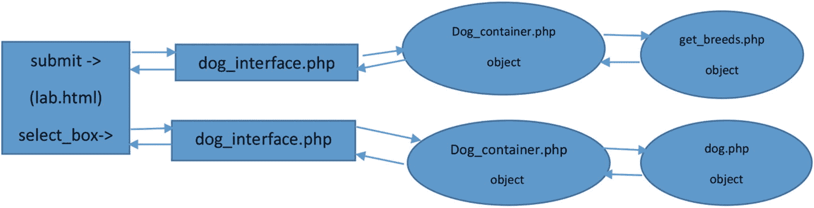
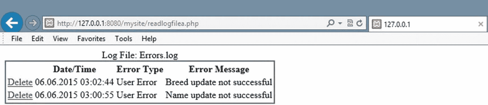
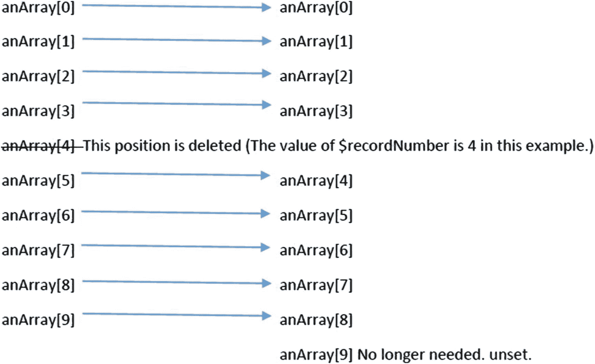

# 6. 异常处理与日志记录

*一个人的教育永无止境，直到他去世。* ——罗伯特·E·李（引自劳伦斯·J·彼得所著《彼得的语录：我们这个时代的想法》（1977 年），第 175 页）

## 本章目标/学生学习成果

完成本章后，学生将能够：

*   解释错误与异常之间的区别

*   创建一个能够处理一般异常的 PHP 程序

*   创建一个能够创建、引发和处理用户自定义异常的 PHP 程序

*   解释并使用 `switch` 和/或嵌入式 `if/else` 语句

*   创建一个使用 `while` 循环和/或 `for` 循环的 PHP 程序

*   创建一个使用二维数组读取/更新文本文件的程序

*   创建一个能够记录异常并向支持人员发送邮件的 PHP 程序

### 处理异常

作为程序员，你应尽一切可能确保程序不会崩溃。任何使用你应用的人，如果不得不应对系统崩溃，都会感到非常糟糕。你可能也经历过这种情况。作为用户，你可能会因为差评而选择某个应用而非另一个。一旦某个应用被认定为“漏洞百出”，即使新版本修正了部分或全部问题，也很难说服客户使用该产品。必须创建一个能够处理所有可能意外事件的应用。

程序必须审视每种场景，并判断是继续运行还是必须关闭。总有可能因意外事件导致应用无法继续运行。设计得当的程序会在不崩溃的情况下告知用户存在问题。当一个应用要求用户“稍后重试”时（假设问题在他们返回网站前已修复），用户更有可能理解。

### 错误

`错误`是由系统处理的程序事件，会导致程序关闭。在某些情况下，系统可以关闭程序并显示错误消息。有些错误会直接导致程序崩溃（例如服务器本身崩溃）。错误通常是程序控制范围之外的事件，并非直接由程序中的代码（或代码缺失）引起。例如，内存不足会导致应用错误。

### 异常

`异常`是不属于程序逻辑正常流程的事件。所有异常都应由程序处理。当应用预见到问题（如文件缺失）或用户做了非常规操作（如输入无效信息）时，可以“引发”异常。程序应“捕获”所有异常，然后检查异常并判断是否可以纠正、忽略，或者应用必须关闭。如果程序不捕获异常，系统将显示异常消息并关闭应用。

根据具体情况，PHP 会产生错误和异常的混合体。在 PHP 5 之前，并不存在异常处理机制。因此，一些较旧的 PHP 命令会产生错误（导致程序关闭）而非异常。自 PHP 7 起，异常处理成为了“规则”。错误可以通过异常处理技术来处理。如果异常未通过程序代码处理，程序将像遇到致命错误一样停止运行。

任何依赖外部因素的应用，都可能在某时出现问题。例如，在 `Dog` 应用中，期望用户输入正确的信息。应用必须预见到并非所有用户都会输入正确信息。该应用还依赖于服务器上的几个文件（`dog_interface`、`dog_container`、`dog_applications` 和 `get_breeds`）。如果这些文件中任何一个缺失，应用都无法继续正常运行。

大多数面向对象编程语言使用标准格式来处理异常。当前版本的 PHP 也采用这种方法。当你在互联网上探索 PHP 示例时，会发现一些现有的 PHP 代码并未使用这种标准格式。标准方法使用 `try-catch` 块。

```php
try {
// 可能引发异常的代码
}
catch(Throwable $t) {
// PHP 7+ 格式，用于捕获所有异常。无法捕获 PHP 7 之前的问题。
}
catch(Error $e) {
// PHP 7+ 捕获并处理错误。无法捕获无法恢复的错误，例如服务器内存错误。
}
catch(Exception $e) {
// 捕获 PHP 5+ 异常的代码。本书示例中未包含。
}
```

任何可能引发异常的代码都应包含在 `try` 块中。此外，你可能还需要考虑将其他条件（例如数学计算）也放入 `try` 块中。

```php
try {
$result = $firstNumber / $secondNumber;
}
catch(Throwable $t) {
// 发生异常时执行的代码
$t->getMessage();
}
catch(Error $e) {
// PHP 7+ 捕获并处理错误
$e->getMessage();
}
```

如果 `$secondNumber` 包含零（除以零），此示例可能会产生异常。如果发生异常，代码将跳转到 `Throwable` 的 `catch` 块。该块中的任何代码随后都会被执行。语句 `$t->getMessage();` 将显示与异常相关的任何系统消息（在此例中，是关于尝试除以零的消息）。但是，你不必非得使用系统消息；你可以使用 `echo` 或 `print` 向用户显示消息。

```php
try {
$result = $firstNumber / $secondNumber;
}
catch(Throwable $t) {
echo "您为第二个数字输入了零。您的输入必须大于零";
}
```

然而，这些示例存在一个问题。如果你试图在 `try` 块中捕获多种类型的异常，所有异常都会进入同一个 `catch` 块。任何异常都会显示相同的消息。

有几种不同的方法可以处理这种情况。

一种方法是自行抛出异常，而不是让系统抛出异常。

- **编程注释**——除了 `getMessage` 方法外，`Exception` 和 `Error` 对象还包括：

  - `getCode()`——显示导致异常的代码

  - `getFile()`——显示包含抛出异常代码的文件名

  - `getLine()`——显示抛出异常的行号

  - `getTrace()` 和 `getTraceAsString()`——显示回溯（异常在程序中的流程）信息

  - 在某些情况下，向用户显示 `Exception` 或 `Error` 消息可能是合适的。然而，其他方法应仅用于调试或日志记录。向用户提供代码信息通常是不必要的，并且是一种安全漏洞。

```php
try {
if ($secondNumber == 0)
{ throw new Exception("零异常"); }
else { $result = $firstnumber / $secondnumber; }
// 其他可能产生异常的代码
}
catch(Exception $e) {
switch ($e->getMessage()) {
case "零异常":
echo "第二个数字的值必须大于零";
break;
case "其他某种异常":
echo "您做了其他错误操作";
break;
}
}
catch(Throwable $t) {
echo $t->getMessage();
}
```

在这个示例中，`catch` 块中使用了一个 `switch` 语句来检查可能的异常消息。`switch` 语句完成了与内嵌 `if` 语句相同的任务。你也可以使用：

```php
If($e->getMessage == "零异常")
{ echo "第二个数字的值必须大于零"; }
else if($e->getMessage == "其他某种异常")
{ echo "您做了其他错误操作"; }
```

对于某些人来说，当需要检查同一属性（变量）的多个可能值或执行某个方法得到的结果时（如本例所示），`switch` 语句更容易理解。`switch` 语句的 `default` 部分（或内嵌 `if` 语句中的最后一个 `else` 语句）用于捕获你未预料到的任何情况。

如前所述，处理所有异常和错误非常重要。通过包含默认代码，你能够处理那些你从未预料到的异常和错误。请注意，每个 `case` 部分都必须以 `break` 作为最后一条语句。这可以防止代码继续执行到下一个 `case` 语句。

处理多个异常的另一种方法是创建你自己的异常、抛出它们，然后再捕获它们。你需要为自己的异常创建一个类。

```php
class zeroException extends Exception {
public function errorMessage() {
$errorMessage = "第二个数字不能为 " . $this->getMessage();
return $errorMessage;
}
}
try {
if ($secondNumber == 0)
{ throw new zeroException("零"); }
else
{ $result = $firstnumber / $secondnumber; }
// 其他可能抛出异常的代码
}
catch(zeroException $e) {
echo $e->errorMessage();
}
catch(Throwable $t) {
Echo $t->getMessage();
}
```

`zeroException`类继承自`Exception`类。`extends`关键字用于继承`Exception`类的所有功能。继承是面向对象编程的另一个关键组成部分（与封装和多态一起）。子类（如`zeroException`）可以继承其父类（`Exception`）的所有属性和方法。然后子类可以添加特定于该类的方法（例如`errorMessage`函数）。由于`zeroException`继承了`Exception`，它被当作其他任何异常一样对待。可以抛出`zeroException`（`throw new zeroException("零")`），也可以捕获它（`catch(zeroException $e)`）。

*   程序说明——程序员创建的异常类继承自`Exception`。因此，任何新的异常类都可以使用`Exception`类的全部功能。

*   `class zeroException extends Exception { }`

*   上述代码创建了一个有效的新的`zeroException`类，且没有新方法。

*   `catch(zeroException $e) { echo $e->getMessage(); }`

*   这个`catch`块将被新的异常调用，并显示由`Exception`类生成的异常消息。

对于每个创建并抛出的异常类，都必须有一个`catch`块来捕获该异常。在示例中，有两个`catch`块：一个捕获`zeroException`，另一个捕获可能出现的任何其他异常。就像之前使用`switch`默认或`if else`语句的示例一样，应该始终让最后一个`catch`块处理任何剩余的异常或错误。如果通用`catch`块排在第一位，则所有异常都会由该块捕获，而不会由特定的异常处理块捕获。

如前所述，开发人员应尽一切努力防止应用程序崩溃。然而，错误被设计为显示消息并使用错误代码关闭程序（即你认为的“崩溃”程序）。在 PHP 7 之前，在某些情况下，可以通过创建处理错误的方法来覆盖此功能。

自 PHP 7 起，`Error`对象将许多潜在的系统错误作为异常来捕获。

```
try {
call_method(null); // 没有这样的方法！
}
catch (Error $e)
{
echo $e->getMessage();
}
```

以前，调用一个不存在的函数会导致致命错误。使用`EngineException`对象允许程序员处理该错误。这项新技术旨在让程序员对错误有更多的控制。如果未包含此`catch`块，任何“错误”都会导致程序崩溃并显示`"致命错误：未捕获的异常"`消息。尽可能使用新的`Error`对象和`Exception`对象来避免致命错误。

*   安全性和性能——通常，使用抛出和捕获异常可以减少程序所需的代码量。然而，存在权衡。一些针对不同面向对象编程语言的研究得出的结论是，异常处理效率（性能）低于使用开发者创建的例程。开发人员应将异常用作应用程序正常流程的真正“例外”。对于更频繁发生的情况，开发人员应该在应用程序中创建情况处理例程。



图 6-1

Dog 应用程序的数据流

在`Dog`应用程序中，信息在许多不同程序之间流动。这些程序中的每一个都必须能正确处理异常。然而，消息处理应全部在接口中发生。属于业务规则层的任何对象（`dog_container`、`dog`和`get_breeds`）都应将所有异常消息传递给接口来处理。起初这听起来可能是一项复杂且令人困惑的任务。然而，异常处理的层次结构将极大地简化此任务。正如你将看到的，使用异常处理将减少所需的代码量。

当抛出异常时，环境将在程序（或类）内部查找是否存在可以处理该异常的`catch`块。如果没有`catch`块，它会向上移动一个层次级别，并检查任何调用程序（或创建该类实例的程序）是否存在`catch`块。此过程将一直持续，直到发现某个`catch`块，或者确定必须由环境本身来处理该异常。

使用此过程，我们可以在`dog_container`、`dog`和`get_breeds`模块中抛出异常，而无需使用`catch`块。在`dog_interface`中，我们可以围绕对这些文件的调用创建一个`try`块。可以在接口中创建多个`catch`块（或一个带有`switch`语句的`catch`块）来处理来自接口和所有其他模块的异常。这满足了三层编程的一个要求。业务规则层（和数据层）将消息传递给接口层。然后接口层决定如何处理这些消息。它可以将消息显示给用户、将其放入日志文件（我们将在本章后面介绍），或者忽略它们（前提是不对应用程序的操作产生不利影响）。

在我们更改`Dog`应用程序代码之前，让我们看一个通过层次结构处理异常的示例。

```
produceerror();
echo “此行不显示”;
$tester->throwexception(); // 如果执行了 produceerror()，则不会执行
echo “此行不显示”;
}
catch (errorException $e ){
echo $e->getMessage();
}
catch (userException $e) {
echo $e->getMessage();
}
catch (Throwable $t) {
echo $t->getMessage();
}
echo “此行会显示”;
?>
示例 6-2
handleerror.php 文件捕获错误或异常
```

```
示例 6-1
testerror.php 包含产生错误和异常的方法
```

`handleerror`程序（在示例 6-2 中）包含一个将处理用户错误（`errorHandler`）的方法，以及`set_error_handler`命令，该命令将错误重定向到此方法。它还包含一个类（`userException`），当在`try`块中抛出`userException`异常时，该类可以做出响应。`require_once`语句包含在`try`块中，以便在文件缺失时尝试捕获错误。然而，这恰好是一个系统错误（而非用户错误），无法被重定向。要捕获系统错误，必须在`catch`块中使用`Error`类。

在`require_once`语句之后，创建了类`testerror`的一个实例。如果此类缺失，系统也会因致命消息而出错。该块调用`produceerror`方法，该方法会导致用户错误。此错误被重定向到`errorHandler`，后者抛出一个异常（`errorException`）。`catch`块接收该异常并显示错误消息。由于异常不会关闭程序（如致命错误），程序流程会跳转到所有`catch`块之后的第一行，并执行`echo`语句（`echo "此行会显示";`）。对错误的反应将导致程序跳过`try`块中任何剩余的代码。在此示例中，`throwexception`方法调用将被忽略。

如果`$tester->produceerror()`行被注释掉，则`throwexception`方法调用可以发生。`userException`在该方法中被抛出。`userException`类继承自`Exception`类。`userException`中没有包含特殊方法。程序的流程将跳转到针对`userException`的`catch`块。该块使用`Exception`类的`getMessage`方法来显示消息。然后逻辑跳转到`catch`块之后的第一行代码，并执行`echo "This line will display"`语句。

- **程序说明——`try/catch`** 还可以在所有`catch`块之后包含一个`finally`块。对于所有被捕获的异常，`finally`块将在关联的`catch`块执行完毕后执行。PHP 允许`finally`块在没有`catch`块的情况下存在（但`try`块仍然必须存在）。`finally`块最常见的用途之一是在发生异常时关闭文件和/或数据库。程序不应在文件和数据库被正确关闭之前终止。如果未正确关闭，数据可能会损坏并无法访问。

#### 动手实践

1.  前往本书的网站，下载示例 [6-1] 和 [6-2] 的文件。调整`testerror`程序仅创建一个错误。创建一个额外的`testexception`程序（包含一个`testexception`类）来抛出一个异常。然后调整`handleerror`程序以创建两个程序的实例。`handleerror`程序现在应该能够处理来自任一程序（类）的错误或异常。

#### 异常与错误处理对比 `if/else` 条件语句

程序员始终可以选择使用`if/else`条件语句来处理异常和错误，如第 [5] 章中的`dog`应用文件所示。用这种方式处理错误并非效率低下（甚至可能更高效）。然而，我们即将发现，如果使用异常处理，业务规则层（和数据层）中代码的*态度*会发生变化。当我们使用`if/else`语句时，程序流程会花费大量时间悲观地准备应对最坏情况（错误和/或异常）。在许多情况下，通过使用异常处理，大部分业务规则层（和数据层）的编码变得乐观，包含处理程序正常操作的代码。应用程序依赖界面层来处理任何问题。

```php
$breedxml = $properties_array[4];
$name_error = $this->set_dog_name($properties_array[0]) == TRUE ? 'TRUE,' : 'FALSE,';
$color_error = $this->set_dog_color($properties_array[2]) == TRUE ? 'TRUE,' : 'FALSE,';
$weight_error = $this->set_dog_weight($properties_array[3]) == TRUE ? 'TRUE' : 'FALSE';
$breed_error = $this->set_dog_breed($properties_array[1]) == TRUE ? 'TRUE,' : 'FALSE,';
$this->error_message = $name_error . $breed_error . $color_error . $weight_error;
if(stristr($this->error_message, 'FALSE'))
{
    throw new setException($this->error_message);
}
}
else { exit; }
}
function set_dog_name($value) : bool {
    $error_message = TRUE;
    (ctype_alpha($value) && strlen($value) < 21) ? $this->dog_name = $value : $this->error_message = FALSE;
    return $this->error_message; }
function set_dog_weight($value) {
    $error_message = TRUE;
    (ctype_digit($value) && ($value > 0 && $value < 121)) ? $this->dog_weight = $value : $this->error_message = FALSE;
    return $this->error_message; }
function set_dog_breed($value) {
    $error_message = TRUE;
    ($this->validator_breed($value) === TRUE) ? $this->dog_breed = $value : $this->error_message = FALSE;
    return $this->error_message; }
function set_dog_color($value) {
    $error_message = TRUE;
    (ctype_alpha($value) && strlen($value) < 21) ? $this->dog_color = $value : $this->error_message = FALSE;
    return $this->error_message; }
// ------------------------------Get Methods-------------------------------
function get_dog_name() : string {
    return $this->dog_name; }
function get_dog_weight() : int {
    return $this->dog_weight; }
function get_dog_breed() : string {
    return $this->dog_breed; }
function get_dog_color() : string{
    return $this->dog_color; }
function get_properties() : string {
    return "$this->dog_name,$this->dog_weight,$this->dog_breed, $this->dog_color."; }
// -----------------------------General Method-----------------------------
private function validator_breed($value) : bool
{
    $breed_file = simplexml_load_file($this->breedxml);
    $xmlText = $breed_file->asXML();
    if(stristr($xmlText, $value) === FALSE)
    {
        return FALSE;
    }
    else
    {
        return TRUE;
    }
}
}
?>
```

**示例 6-3：包含异常处理的狗类**

比较示例 [5-8] 和示例 [6-3]，你只会注意到代码的几处细微变化。`__toString`方法已被移除，取而代之的是一个`if`语句，该语句检查`error_message`字符串中是否存在`FALSE`。如果存在，则会引发一个`setException`消息，将`error_message`字符串传递给异常处理器。这导致了整个应用程序流程的逻辑改变。`dog_interface`程序（在示例 [5-12] 中）不再通过调用`__toString`方法来检查用户输入错误，而是由`Dog`类在用户出错时通知`dog_interface`（通过抛出的异常）。以前，界面层必须从`Dog`类中拉取错误。在这个例子中，`Dog`类将错误推送给界面类。正如你将看到的，这将消除`dog_interface`程序中的代码，因为它不再需要询问是否有任何错误。

### 安全性与性能

#### `__toString` 方法与安全性

安全性与性能——`__toString` 方法会将其返回的任何内容“暴露”给任何创建了该函数所在类实例的程序。使用此方法传递错误消息可能让黑客判断出他们正在向程序发送何种错误信息。在第 5 章的 `dog.class` 示例中，`__toString` 返回了包含 `'TRUE'` 或 `'FALSE'` 响应的 `error_message` 字符串。这比直接返回错误消息更安全。然而，通过替换 `__toString` 方法并抛出一个特定的异常，你可以提供更好的安全性。黑客现在不仅需要知道 `error_message` 的含义，还必须知道异常的名称（`setException`），才能在自己的程序中捕获它。

```php
asXML();
$this->result = "";
$this->result = $this->result . "
选择一种犬种";
foreach ($breed_file->children() as $name => $value)
{
$this->result = $this->result . "$value";
}
$this->result = $this->result . "";
return $this->result;
}
else
{
throw new Exception("犬种 xml 文件丢失或损坏");
}
}
}
?>
```

**示例 6-4** 具有异常处理功能的 `getbreeds.class`

将之前的 `GetBreeds` 类（示例 5-11）与示例 6-4 进行比较，可以发现只有一处更改。它返回 `'FALSE'` 并抛出一个通用异常，指示 `breed.xml` 文件丢失或损坏。同样，`GetBreeds` 类将所有异常推送到接口。接口不再需要判断是否存在任何异常。尽管文件丢失错误无法重定向为异常处理，但代码使用了 `file_exists`，以便在文件丢失时抛出异常。

```php
app = $value;
} else { exit; }
}
public function set_app($value) {
$this->app = $value; }
public function get_dog_application($search_value) {
$xmlDoc = new DOMDocument();
if ( file_exists("e5dog_applications.xml") ) {
$xmlDoc->load( 'e5dog_applications.xml' );
$searchNode = $xmlDoc->getElementsByTagName( "type" );
foreach( $searchNode as $searchNode )  {
$valueID = $searchNode->getAttribute('ID');
if($valueID == $search_value) {
$xmlLocation =
$searchNode->getElementsByTagName( "location" );
return $xmlLocation->item(0)->nodeValue;
break; }
}
}
throw new Exception("犬种应用程序 xml 文件丢失或损坏");
}
function create_object($properties_array) {
$dog_loc = $this->get_dog_application($this->app);
if(($dog_loc == FALSE) || (!file_exists($dog_loc))) {
throw new Exception("文件 $dog_loc 丢失或损坏。");  }
else
{
require_once($dog_loc);
$class_array = get_declared_classes();
$last_position = count($class_array) - 1;
$class_name = $class_array[$last_position];
$dog_object = new $class_name($properties_array);
return $dog_object;
}
}
}
?>
```

**示例 6-5** 具有异常处理功能的 `dog_container.php` 文件

示例 6-5 中的 `dog_container` 替换了示例 5-9 中当 `dog_application.xml` 文件、`dog.class` 文件和/或 `get_breeds` 文件丢失时返回 `'FALSE'` 的做法。取而代之的是，抛出一个异常，指示哪个文件丢失。

```php
getMessage());
$name_error == 'TRUE' ? $eMessage = '' :
string $eMessage = '名称更新未成功';
$breed_error == 'TRUE' ? $eMessage .= '' :
$eMessage .=  '品种更新未成功';
$color_error == 'TRUE' ? $eMessage .= '' :
$eMessage .= '颜色更新未成功';
$weight_error == 'TRUE' ? $eMessage .= '' :
$eMessage .= '体重更新未成功';
return $eMessage;
}
}
function get_properties($lab)
{
print "您的狗的名字是 " . $lab->get_dog_name() . "";
print "您的狗的体重是 " . $lab->get_dog_weight() . " 磅。 ";
print "您的狗的品种是 " . $lab->get_dog_breed() . "";
print "您的狗的颜色是 " . $lab->get_dog_color() . "";
}
//----------------主程序部分-------------------------------------
try {
if ( file_exists("e5dog_container.php"))
{    Require_once("e5dog_container.php"); }
else
{    throw new Exception("狗容器文件丢失或损坏"); }
if (isset($_POST['dog_app'])) {
if ((isset($_POST['dog_name'])) && (isset($_POST['dog_breed'])) &&
(isset($_POST['dog_color'])) &&  (isset($_POST['dog_weight'])))
{
$container = new dog_container(filter_var($_POST['dog_app'],
FILTER_SANITIZE_STRING));
string $dog_name = filter_var( $_POST['dog_name'],
FILTER_SANITIZE_STRING);
string $dog_breed = filter_var( $_POST['dog_breed'],
FILTER_SANITIZE_STRING);
string $dog_color = filter_var( $_POST['dog_color'],
FILTER_SANITIZE_STRING);
string $dog_weight = filter_var( $_POST['dog_weight'],
FILTER_SANITIZE_STRING);
$breedxml = $container->get_dog_application("breeds");
$properties_array = array($dog_name,$dog_breed,$dog_color,
$dog_weight,$breedxml);
$lab = $container->create_object($properties_array);
print "更新成功";
get_properties($lab);
}
else {
print "缺少或无效参数。
请返回 lab.html 页面输入有效信息。";
print "狗创建页面";
}
} else // 选择框
{
$container = new dog_container("selectbox");
$properties_array = array("selectbox");
$lab = $container->create_object($properties_array);
$container->set_app("breeds");
$dog_app = $container->get_dog_application("breeds");
$result = $lab->get_select($dog_app);
print $result;
}
} // try
catch(setException $e)
{
echo $e->errorMessage();
}
catch(Throwable $t)
{
echo $t->getMessage();
}
catch(Error $e)
{
echo $e->getMessage();
}
?>
```

**示例 6-6** 具有异常处理功能的 `dog_interface.php` 文件

当将示例 5-12 与示例 6-6 进行比较时，处理异常所需的代码量少于使用 `if/else` 条件语句。程序的逻辑流程更容易跟踪，因为 `else` 语句很少。这是因为该应用程序中所有文件抛出的异常都由 `dog_interface` 中的 `catch` 块处理。用户错误被抛给一个特殊的 `setException` 异常。系统错误由 `Error` 的 `catch` 块捕获。`error_check_dog_app` 方法（在示例 5-12 中）已被 `setException` 类取代。该类中的代码与 `error_check_dog_app` 中的代码非常相似。`$eMessage` 字符串中单个更新消息的显示被移除，因为这个类应对的是用户错误，而不是成功的更新。在代码主体中添加了一条通用的 `print` 行，以告知用户所有更新均已成功。`try` 块已添加到该接口的所有代码周围。这有助于捕获此应用程序任何部分的问题。请注意，如果找不到 `dog_container` 文件，也会抛出异常。

此应用程序只需要三个`catch`块。`setException catch`块调用`setException`类中的`errorMessage`方法，该方法确定发生了哪些用户错误。然后将信息显示给用户。`Throwable catch`块处理所有其他异常。它当前将这些信息显示给用户。然而，`Exception`和`Error`的`catch`块当前向用户提供了过多信息。告知用户应用程序可能遇到的其他问题违反了安全规定。您应该只告诉他们系统当前不可用，并请他们稍后再试。在测试时显示详细错误是可以的，但在实际生产环境中并不好。您将在下一节中解决这个安全漏洞。有关异常处理的更多信息，请访问[www.php.net/manual/en/language.errors.php7.php](http://www.php.net/manual/en/language.errors.php7.php)。

**实践练习**

1.  检查本节中的代码。是否存在可以将错误检查转换为异常处理的区域？请访问本书网站并下载本节代码。对现有代码进行可能的更改，以使用额外的异常处理。

#### 记录异常

应用程序必须能够将问题发生的情况通知系统分析师。然而，不应向应用程序用户显示关于错误的特定消息。应通知用户系统当前无法操作。应通知系统分析师发生的具体问题。

提供此功能的最简单方法是将错误消息放入日志文件中。PHP 应用程序可以将消息记录到默认的 PHP 错误文件或特定于应用程序的文件中。`php.ini`文件可以被编辑（参见第 1 章了解位置）以指定默认错误日志文件的位置和名称。在编辑器中打开`php.ini`文件后，搜索`error_log`。如果该行开头有一个分号，则该位置已被注释掉。只需删除分号并指定一个位置，例如：

```
error_log = c:/temp/php_errors.log
-or-
error_log = http://www.asite.com/temp/php_errors.log
```

当写入默认错误日志时，PHP 会插入一个*时间戳*以及您提交的错误消息。您的默认时区可能在`php.ini`文件中未正确设置。搜索`date.timezone`。美国大陆的有效时区设置为：

```
date.timezone = "America/New_York"
date.timezone = "America/Chicago"
date.timezone = "America/Los_Angeles"
所有其他美洲时区请访问：www.php.net/manual/en/timezones.america.php
全球时区请访问：www.php.net/manual/en/timezones.php
```

Apache 的`httpd`配置文件（参见第 1 章了解位置）可以覆盖`php.ini`文件中的设置。您还应该打开此文件并搜索`date.timezone`。将现有行替换为类似于以下格式的内容：

```
php_value date.timezone "America/New_York"
```

一旦您更新并保存了`php.ini`和/或`apache.httpd`文件，您必须重新加载 Apache 服务器以使更改生效（参见第 1 章）。

**注意**

时区也可以通过程序代码设置。对于 PHP 5.2+，可以使用`datefmt_set_timezone`方法。有关通过程序代码设置时区的更多信息，请访问[www.php.net/manual/en/datetime.settimezone.php](http://www.php.net/manual/en/datetime.settimezone.php)。

输入此代码并将其保存在一个测试文件中。在您的环境中测试它。如果您的设置正确，PHP 会在`error_log`参数指定的位置创建错误日志。不要自己创建该文件。PHP 不会将信息记录到不是由它创建的日志文件中。发送到您日志文件的消息格式应类似于以下内容：

```
[25-Jun-2020 17:01:12 America/New_York] error message
```

仅用这简单的一行代码，PHP 就在指定的位置创建了基于文本的文件，并将消息放入文件中。如果您无权访问这些文件，您可以在 PHP 应用程序中指定一个特定位置来发送您的消息。此功能还允许您设置多个应用程序日志文件。应用程序通常会有信息日志文件、身份验证（登录）日志文件、错误日志文件和安全日志文件。通过分隔每种类型的消息，更容易在日志文件中扫描特定类型的消息。

假设我们想将用户错误记录在一个文件中，而将其他错误记录在另一个文件中。

```php
<?php
const USER_ERROR_LOG = 'User_Errors.log';
const ERROR_LOG = 'Errors.log';
// sending a user error
error_log("A user error",3,USER_ERROR_LOG);
// sending all other errors
error_log("A general error",3,ERROR_LOG);
?>
```

此代码将使用**常量**（`USER_ERROR_LOG`和`ERROR_LOG`）将错误消息导向正确的位置。请注意，使用了第二个参数`3`来告知`error_log`方法将使用不同的位置来记录错误。向您的日志发送消息时，应使用标准格式。该格式应包括时间/日期（如果环境未像前面提到的那样自动包含）、消息类型（如果文件中有多种消息类型）、错误消息以及任何其他相关信息。默认情况下，消息大小限制为 120 个字符。但是，这可以在`php.ini`文件中更改。

```php
$date = date('m.d.Y h:i:s');
// For more info on data time format, go to: http://php.net/manual/en/function.date.php
$errormessage = "This is the error";
$eMessage =  $date . " | User Error | " . $errormessage . "\n";
error_log($eMessage,3,USER_ERROR_LOG);
```

上述代码将产生：

```
06.06.2020 03:00:55 | User Error | This is the error
```

可以使用标准文本编辑器（如 Notepad++ 或 Notepad）或日志监控软件（我们将在本章后面创建一个日志读取程序）来查看文件内容。

系统会限制日志文件的大小。然而，假设每天记录的日志量不是很大，应用程序可以创建特定于每天的日志文件。

*   安全与性能——日志文件应存放在与应用不同的文件夹中。该文件夹需要允许应用拥有写入权限，但同时应确保其安全，防止服务器外部的读取或写入访问。只有获得授权的人员才能访问日志。

```php
$USER_ERROR_LOG = "User_Errors" . date('mdy') . ".log";
$ERROR_LOG = "Errors" . date('mdy') . ".log";
...
error_log($eMessage,3,$USER_ERROR_LOG);
```

请注意，由于`date`方法可能产生变量输出（不同日期），常量（`USER_ERROR_LOG` 和 `ERROR_LOG`）必须改为变量。其格式会生成类似 `User_Errors06062020.log` 或 `Errors06062020.log` 的文件名。

当有内容写入日志文件时，PHP 也能很轻松地发送邮件提醒。Web 服务器必须包含邮件服务器。你的本地机器可能不具备此功能。然而，通常具备 PHP 功能的网络托管服务提供商会包含邮件服务。要使用此功能，你可以添加一条 `error_log` 语句：

*   安全与性能——虽然很想让收到邮件的人员了解应用中发生的具体问题，但请不要这样做。默认情况下，邮件是未加密的。发送包含应用详细信息的未加密邮件，无异于引狼入室，诱使黑客破坏你的应用。不过，你应当在邮件中提供足够的信息（例如日期/时间戳，可能还有错误编号），以便相关人员能够在日志文件中定位错误消息。

```php
error_log("Date/Time: $date - Serious System Problems with Dog Application. Check error log for details", 1, "noone@helpme.com", "Subject: Dog Application Error \nFrom: System Log " . "\r\n");
```

第一个参数指定邮件的内容。第二个参数告知 `error_log` 通过邮件发送此信息。第三个参数提供“收件人”邮箱地址。第四个参数是额外的邮件头字段。该字段通常用于包含邮件主题和发件人邮箱地址。“发件人”地址必须包含，否则邮件将无法发送。不过，“发件人”地址不必是一个真实存在的地址。

*关于错误记录的更多信息，请访问* [`www.php.net/manual/en/function.error-log.php`](http://www.php.net/manual/en/function.error-log.php)*。*

在 `Dog` 应用中，我们可以通过调整 `dog_interface` 中的 `catch` 块（来自示例 6-6），来实现记录异常并通过邮件发送重大错误的功能。

```php
getMessage());
string $name_error == 'TRUE' ? $eMessage = '' : $eMessage =
'Name update not successful';
string $breed_error == 'TRUE' ? $eMessage .= '' : $eMessage .=
'Breed update not successful';
string $color_error == 'TRUE' ? $eMessage .= '' : $eMessage .=
'Color update not successful';
string $weight_error == 'TRUE' ? $eMessage .= '' : $eMessage .=
'Weight update not successful';
string return $eMessage;
}
}
function get_properties($lab)
{
print "Your dog's name is " . $lab->get_dog_name() . "";
print "Your dog weights " . $lab->get_dog_weight() . " lbs. ";
print "Your dog's breed is " . $lab->get_dog_breed() . "";
print "Your dog's color is " . $lab->get_dog_color() . "";
}
//----------------主代码部分-------------------------------------
try {
if ( file_exists("e5dog_container.php"))
{
Require_once("e5dog_container.php");
}
else
{
throw new Exception("Dog container file missing or corrupt");
}
if (isset($_POST['dog_app']))
{
if ((isset($_POST['dog_name'])) && (isset($_POST['dog_breed'])) &&
(isset($_POST['dog_color'])) && (isset($_POST['dog_weight'])))
{
$container = new dog_container(filter_var($_POST['dog_app'],
FILTER_SANITIZE_STRING));
string $dog_name = filter_var( $_POST['dog_name'],
FILTER_SANITIZE_STRING);
string $dog_breed = filter_var( $_POST['dog_breed'],
FILTER_SANITIZE_STRING);
string $dog_color = filter_var( $_POST['dog_color'],
FILTER_SANITIZE_STRING);
string $dog_weight = filter_var( $_POST['dog_weight'],
FILTER_SANITIZE_STRING);
$breedxml = $container->get_dog_application("breeds");
$properties_array = array($dog_name,$dog_breed,$dog_color,
$dog_weight,$breedxml);
$lab = $container->create_object($properties_array);
print "Updates successful";
get_properties($lab);
}
else
{
print "Missing or invalid parameters. Please go back to the dog.html page to enter valid information.";
print "Dog Creation Page";
}
}
else // 选择框
{
$container = new dog_container("selectbox");
$properties_array = array("selectbox");
$lab = $container->create_object($properties_array);
$container->set_app("breeds");
$dog_app = $container->get_dog_application("breeds");
$result = $lab->get_select($dog_app);
print $result;
}
}
catch(setException $e)
{
echo $e->errorMessage(); // 向用户显示
$date = date('m.d.Y h:i:s');
$errormessage = $e->errorMessage();
$eMessage =  $date . " | User Error | " . $errormessage . "\n";
error_log($eMessage,3,USER_ERROR_LOG); // 将消息写入用户错误日志文件
}
catch(Throwable $t)
{
echo "The system is currently unavailable. Please try again later.";
// 向用户显示消息
$date = date('m.d.Y h:i:s');
$errormessage = $t->getMessage();
$eMessage = $date . " | User Error | " . $errormessage . "\n";
error_log($eMessage,3,ERROR_LOG); // 将消息写入错误日志文件
error_log("Date/Time: $date - Serious System Problems with Dog Application. Check error log for details", 1, "noone@helpme.com", "Subject: Dog Application Error \nFrom: System Log " . "\r\n");
// 通过邮件通知相关人员系统出现问题
}
catch (Error $e)
{
echo "The system is currently unavailable. Please try again later.";
// 向用户显示消息
$date = date('m.d.Y h:i:s');
$errormessage = $e->getMessage();
$eMessage = $date . " | Fatal System Error | " . $errormessage . "\n";
error_log($eMessage,3,ERROR_LOG); // 将消息写入错误日志文件
error_log("Date/Time: $date - Serious System Problems with Dog Application. Check error log for details", 1, "noone@helpme.com", "Subject: Dog Application Error \nFrom: System Log " . "\r\n");
// 通过邮件通知相关人员系统出现问题
}
```

示例 6-7
包含异常记录和邮件功能的 `dog_interface.php` 文件

在示例 6-7 代码的顶部，创建了常量`USER_ERROR_LOG`和`ERROR_LOG`，用于指定日志文件的名称和位置。将可能变化的常量（如税率）放在代码顶部，便于负责维护应用程序的程序员快速修改。如前所述，日志文件的位置必须位于允许应用程序写入访问的文件夹中。建议将日志文件集中存放在一个公共文件夹内，与其他日志文件一起，方便数据中心人员（或系统分析师）访问。

其他代码更改位于`catch`块中。`setException catch`块将`setException`类生成的错误消息返回给用户。此消息告知用户哪些属性（`Name`、`Breed`、`Color`和`Weight`）未更新。导致此异常的错误可能来自用户，也可能是在信息从客户端机器传输到服务器时发生损坏。这些消息仅提供关于属性要求的信息，用户本应已知晓这些要求。`catch`块还向用户错误日志写入类似的消息。用户错误并非需要分析师立即处理的紧急错误。然而，跟踪用户问题的趋势可以提示可能需要进行哪些更改，以确保用户获得最佳应用体验。

`Throwable`和`Error catch`块捕获所有非用户生成的异常。由这些异常引起的消息可能会泄露破坏应用程序安全性的信息。因此，应向用户显示一条通用消息（例如`"The system is currently unavailable. Please try again later."`）。有关异常的详细信息（如错误消息、文件位置、引发异常的代码行）应放入错误日志以供进一步分析。大多数由这些`catch`块捕获的异常会导致应用程序停止运行。因此，必须通知相关人员正在发生的问题。`catch`块是向支持人员发送电子邮件以提醒他们任何问题的好位置。

既然我们已经在内建了异常处理和错误处理机制，我们可以编辑`php.ini`文件来关闭向用户显示错误报告的设置。但是，我们应该等到所有开发和测试完成后再进行此操作。在`php.ini`文件中找到`"display_errors = On"`这一行。如果我们将此设置更改为`"display_errors = Off"`，大多数错误消息将不会显示给用户。此更改不会影响程序通过`echo`或`print`方法（包括在任何`catch`块中）发送回用户的任何消息。此更改将使开发者在系统出现问题时，能更好地控制显示给用户的错误消息类型。

### 操作指南

1.  下载本节的代码。创建一个或使用一个现有的 HTML 页面，该页面不检查用户输入错误。运行程序，输入可能导致用户错误的名称、品种、体重和颜色值。停止程序并打开用户错误日志文件的内容。错误是否出现在文件中？如果没有，请检查包含日志文件的文件夹的安全性，确保其允许对日志文件的写入访问。确认程序已捕获用户错误后，尝试引发其他系统错误。提示：在`dog`应用程序的 XML 文件中将文件名更改为不存在的名称。检查错误日志以确定错误是否已写入文件。您是否能够引发任何未被任一日志文件捕获的错误？如果是，是否有办法捕获这些错误？

### 读取日志文件和文本文件

在上一节中，我们发现`error_log`方法仅用一行代码就能写入日志文件。如果日志文件不存在，它会创建该文件。它将以追加方式（添加到文件末尾）将传递给它的任何消息写入文件内容，然后关闭文件。如果您要创建自己的日志记录流程，则需要多行代码。

```php
$logFile = fopen("error_log.log", "a");
$eMessage = $e->getMessage();
fwrite($logFile, $eMessage);
fclose($logFile);
```

`fopen`方法也会在文件不存在时创建它。参数`"a"`表示写入文件的内容应被追加。参数`"w"`表示文件中的任何内容都将丢失（被覆盖）。然后，`fwrite`方法会将第二个参数（`$eMessage`）中的字符串放入由第一个参数（`$logFile`）指定的文件中。`$logFile`是一个指向文本文件位置的指针。`fclose`方法关闭文本文件。

*有关写入文本文件的更多信息，请访问 w3schools：[www.w3schools.com/php/php_file_create.asp](http://www.w3schools.com/php/php_file_create.asp)*。

由于日志文件是基于文本的文件，您可以使用类似的逻辑来创建自己的应用程序，以打开日志文件并读取其内容。

```php
$logFile = fopen("error_log.log", "r");
echo fgets($logFile);
fclose($logFile);
```

这段代码将打开日志文件，读取文件中的第一行（通过`fgets`方法），然后关闭文件。然而，文件中很可能有多行内容。我们必须能够循环遍历并显示文件中的每一行。我们可以使用这里显示的`while`循环来实现。

```php
$logFile = fopen("error_log.log", "r");
while(!feof($logFile))
{
echo fgets($logFile) . "";
}
fclose($logFile);
```

`while`循环会在条件语句为`TRUE`时持续循环。一旦条件语句变为`FALSE`，代码将退出循环并跳转到循环结束后的下一条代码行。在此示例中，`error_log`文件以只读方式打开（`"r"`）。`while`循环检查日志文件的文件末尾指示器（`feof`），以确定是否已到达文件末尾。如果`feof`返回`TRUE`，则表示已到达文件末尾。当未到达文件末尾时，循环必须继续。要使条件语句在仍有待读取记录时产生`TRUE`，我们必须反转逻辑，使得在还有记录时`feof`产生`TRUE`，在没有记录时产生`FALSE`。我们可以通过使用`!`运算符来实现这一点。`!`运算符是一个`NOT`运算符，它可以反转结果。`NOT TRUE`是`FALSE`，而`NOT FALSE`是`TRUE`。因此，`!feof`运算符现在会在有更多记录时产生`TRUE`，在没有更多记录时产生`FALSE`。循环与`fgets`方法结合，将显示文件中的每条记录。显示完每条记录后，将使用`fclose`关闭文件。

*有关读取文本文件的更多信息，请访问 w3schools：[www.w3schools.com/php/php_file_open.asp](http://www.w3schools.com/php/php_file_open.asp)*。

*有关`while`循环的更多信息，请访问 w3schools：[www.w3schools.com/php/php_looping.asp](http://www.w3schools.com/php/php_looping.asp)*。

前面示例产生的输出相当简单：

```
06.06.2020 03:00:55 | User Error | This is the error
```

这并不能比直接在文本编辑器中打开日志文件提供更好的查看体验。我们可以结合使用 HTML 表格、`explode`方法和数组来生成更好的输出。我们可以使用`explode`方法将日志文件中的每一行放入一个二维数组中。这个二维数组将拥有与 HTML 表格一样的行和列。

```php
$dogs = array
(
array("Sammy","Lab",18,"Yellow"),
array("Spot","Mixed",14,"Mixed"),
array("Princess","Chihuahua",4,"White"),
array("Max","Boxer",35,"Brown")
);
```

二维数组是行信息的集合。每一**行**在每个位置（**列**）上都有共同的信息。在前面的示例中，所有狗的名字都在位置 0，狗的品种在位置 1，狗的重量在位置 2，狗的颜色在位置 3。这与表格中的位置直接关联。

有关多维数组的更多信息，请访问 [www.w3schools.com/php/php_arrays_multidimensional.asp](http://www.w3schools.com/php/php_arrays_multidimensional.asp)。

```
Sammy | Lab | 18 | Yellow |
Spot | Mixed | 14 | Mixed |
Princess | Chihuahua | 4 | White |
Max | Boxer | 35 | Brown |
```

表格和二维数组中的每个位置都通过列和行来引用。在此表中，`Sammy` 位于位置 `(0,0)`，`Yellow` 位于位置 `(0,3)`，`Max` 位于位置 `(3,0)`，`Brown` 位于位置 `(3,3)`。第一个位置是列，第二个位置是行。在 PHP 中，`[]` 用于定义数组的下标（位置）。

```php
echo $dogs[0][0]; // displays Sammy
echo $dogs[0][3]; // displays Yellow
echo $dogs[3][0]; // displays Max
echo $dogs[3][3]; // displays Brown
```

现在我们可以调整循环，将日志内容放入一个二维数组中。然而，我们不知道数组的大小，因此无法使用之前展示的格式。如果开发者不使用 PHP，这可能会让他们感到非常头疼。但 PHP 允许我们动态创建数组，就像它允许我们在需要时创建变量（属性）一样。

```
$logFile = fopen("error_log.log", "r");
$row_Count = 0;
while(!feof($logFile))
{
print_r ($error_Array[$row_Count] = explode(' | ', fgets($logFile)));
$row_Count++;
}
fclose($logFile);
```

在此示例的循环中，`explode` 方法通过 `|` 字符（实际上是空格、`|` 和空格）来拆分从文本文件读入的行。它将拆分后的每个字符串放入 `$error_Array` 中由 `$row_Count` 值指示的行中。第一次循环时，日志文件的第一行被放入 `$error_Array[0]`（数组的第一行）。由于 `explode` 命令对字符串进行了拆分，因此会为每一部分创建相应的列。

如果文件的第一行包含：

```
A general error | stuff | more stuff
```

那么数组的第一行将包含：

```
$error_Array[0][0] = "A general error"
$error_Array[0][1] = "stuff";
$error_Array[0][2] = "more stuff";
```

我们可以通过示例中展示的 `print_r` 命令来验证这一点。`print_r` 会以下列格式显示数组的内容：

```
Array ( [0] => A general error [1] => stuff [2] => more stuff )
```

这种格式验证了字符串的每一部分都被正确放入了数组的对应位置。`$row_count` 在循环继续前会递增 1。这样会将文件的下一行放入数组的下一个位置（如果是文件的第二行，则放入 `$error_Array[1]`）。当然，我们不会使用 `print_r` 向用户展示结果（因为它不太美观）。

不过，它是一个很好的工具，可以帮助我们确保程序正确地将所有内容放入了数组中。我们可以在循环中添加代码来构建一个表格。

```
$logFile = fopen("Errors.log", "r");
$row_Count = 0;
echo "<table>";
while(!feof($logFile))
{      echo "<tr>";
$error_Array[$row_Count] = explode(' | ', fgets($logFile));
$displayString = "";
for($I=0; $I < 3; $I++)
{           $displayString = $displayString . "<td>" . $error_Array[$row_Count][$I] . "</td>";
}
echo $displayString;
echo "</tr>";
$row_Count++;
}
echo "</table>";
fclose($logFile);
```

一个 `echo` 语句被放置在 `while` 循环之前，用于打开 HTML 表格。另一个 `echo` 语句（`echo "<tr>"`）位于 `while` 循环内部，用于创建表格的一行。

有关 `for` 循环的更多信息，请访问 [www.w3schools.com/php/php_looping_for.asp](http://www.w3schools.com/php/php_looping_for.asp)。

同样，在 `while` 循环中，我们创建了一个 `for` 循环来遍历该行的每一列。由于我们知道有四列，因此 `for` 循环是一个很好的选择。当我们确切知道循环次数时，会使用 `for` 循环。`for` 循环的第一个参数（在 `;` 之前）初始化计数变量（`$I=0`）。此变量（`$I`）用于计数每次循环。第二个参数（`$I < 3`）包含一个比较，用于确定逻辑流是否将停留在循环中。如果比较结果为 `TRUE`，循环将继续；如果为 `FALSE`，逻辑流将跳转到循环后的第一个语句（`echo "</tr>"`）。第三个参数（`$I++`）可以递增或递减计数变量。`for` 循环通过将所需信息集中在一行代码中，帮助程序员记住要初始化变量、检查条件并递增变量。

`for` 循环中的 `echo` 语句使用 `$row_Count` 和 `$I` 变量从当前行的每一列中提取信息。第一次进入循环时，`$row_Count` 为 0。`echo` 语句将显示 `$errorArray[0][0]` 的内容。随着 `for` 循环的继续，将依次显示 `$errorArray[0][1]`、`$errorArray[0][2]` 和 `$errorArray[0][3]` 的内容。每个值都通过 `<td>` 和 `</td>` 标签放入表格的一个单元格中。`for` 循环完成后，流程跳转到循环下方，关闭该行（`echo </tr>`）。然后递增 `row_Count` 变量。如果还有更多行（文件中有更多记录），`while` 循环将继续处理下一行，直到文件中没有更多记录为止。当流程跳出 `while` 循环后，表格被关闭（`echo "</table>"`）。然后关闭文件。

文本（日志）文件是顺序文件。当添加（追加）项目时，它们会被添加到列表的底部。您可能希望对信息进行排序，将最新的记录排在前面。这只需对代码进行轻微修改即可实现。

```
$logFile = fopen("Errors.log", "r");
$row_Count = 0;
while(!feof($logFile))
{
$error_Array[$row_Count] = explode(' | ', fgets($logFile));
$row_Count++;
}
$row_Count--;
fclose($logFile);
echo "<table>";
for ($J=$row_Count; $J >= 0; $J--)
{      echo "<tr>";
$displayString = "";
for($I=0; $I < 3; $I++)
{           $displayString = $displayString . "<td>" . $error_Array[$J][$I] . "</td>";
}
echo $displayString;
echo "</tr>";
}
echo "</table>";
```

`while` 循环现在会将记录加载到数组中，并记录数组中项目的数量。在循环结束且文件关闭后，一个 `for` 循环会以相反的顺序遍历数组，以输出表格中的行。计数器变量 `$J` 从数组的总行数（`$row_Count`）开始。在循环开始前从 `$row_Count` 中减去 1，因为它在 `while` 循环中获取最后一条记录后递增了一次，这使得计数多了一个。然后每次循环对 `$J` 进行递减（`$J--`），直到其值小于零。内部的 `for` 循环（`for($I=0;$I<3;$I++)`）没有改变，因为它仍然需要遍历行的每一列来显示信息。

通过将记录加载到数组中，我们可以在需要时对其进行修改。假设我们想要删除日志中的一条记录。只要我们知道了要删除的行号，就可以从数组中移除该记录。然后，我们可以用剩余的记录重新填充文件。

首先，我们对已完成的 `echo` 代码做一处微调，在待删除记录旁添加一个链接。接着，我们将新增一个 `delete` 方法，把显示代码移至 `display` 方法中（以便随时调用），并创建一个 `saveChanges` 方法用于更新日志文件。

```
";
echo " table { border: 2px solid #5c744d;}  ";
echo "";
echo "日志文件: " . ERROR_LOG . "";
echo "日期/时间错误类型错误消息";
for ($J=$row_Count; $J >= 0; $J--) {
echo "删除";
for($I=0; $I  " . $error_Array[$J][$I] . "  ";
}
echo "";
}
echo "";
echo "";
} // 主程序段
const ERROR_LOG = "Errors.log";
$logFile = fopen(ERROR_LOG, "r");
$row_Count = 0;
while(!feof($logFile))
{
$error_Array[$row_Count] = explode(' | ', fgets($logFile));
$row_Count++;
}
fclose($logFile);
if(isset($_GET['rn']))
{
deleteRecord($_GET['rn'], $row_Count, $error_Array);
saveChanges($row_Count,$error_Array,ERROR_LOG);
}
displayRecords($row_Count,$error_Array);
?>
```

示例 6-8 `readerrorlog.php`文件



图 6-2 包含用户错误的`readerrorlog.php`文件

在示例 6-8 中，`displayRecords`方法包含了之前展示的大部分代码。新增了一些 CSS 代码，使显示效果更专业。同时，每条记录都附带了一个 HTML `href`链接。该链接会重新调用程序，并传递用户想要删除的记录编号。位于“主程序段”（首先执行的代码行）中的代码集创建了一个常量`ERROR_LOG`，用于定义日志文件的位置和名称。文件的打开和数组的加载方式与之前相同。

数组加载完毕后，程序会检查是否由某条记录的删除链接所调用。如果通过 HTTP `GET`传递了某个值，程序就会调用`deleteRecord`方法。`deleteRecord`方法执行完毕后，程序接着调用`saveChanges`方法。无论程序是否接收到值，它都会执行最后一条语句，即调用`displayRecords`方法。

- **程序说明**——`deleteRecords`方法的方法头（`function deleteRecord($recordNumber, &$row_Count, &$error_Array)`）使用了按引用传递而非按值传递，以便在方法中更新`$row_Count`和`$error_Array`。默认情况下，传入方法的参数不能被该方法修改（按值传递）。`&`表示该参数是按引用传递的，这允许参数的值被修改。`deleteRecords`可以调整数组的行数（`$row_Count`）以及数组本身的信息（`$error_Array`）。

- 按值传递是将参数中包含的内容（数据）传入方法。按引用传递是将参数的内存地址传入方法，这使得方法可以修改参数在内存中的值。

`deleteRecords`方法接受待删除的记录编号作为其参数之一。数组中任何位于此记录编号之上的位置保持不变。任何位于此记录之下的位置都必须向上移动一位。例如，如果一个数组有十个位置（0–9），并且要删除第五个位置（4），那么位置 5–9 必须变成位置 4–8。在下面的示例中，对于待删除的`$recordNumber`之后的任何记录，位置`$J+1`被放入位置 J：



数组的最后一个位置不再需要了。数组的最后一个位置被释放（使用`unset`）。这将告知操作系统，该内存空间不再需要。操作系统会调用其垃圾回收器来释放该内存位置。在后续章节讨论关联数组时，我们会发现完成此任务的更简单方法。数组重新配置后，会调用`saveChanges`方法替换日志文件中的记录。显示的代码与本章前面的示例非常相似，只有一个例外。`fopen`方法使用了参数`"w"`。`"w"`参数会清除文件中已存在的所有内容，并用当前写入文件的内容替换它。在此示例中，文件将被更新（替换）为排除了已删除记录的新记录集。每次调用程序时（无论是否删除了记录），都会调用`displayRecords`方法。此方法显示日志文件的内容。

- **编程说明**——检索在整个程序中都会用到的数据的程序，通常在代码的初始阶段检索信息，并将其放入数据结构（数组、列表或数据集）中。当数据在程序中被更新时，数据结构中的信息也会被更新。数据处理完成后，信息会被送回原始位置（文本文件或数据库）。更新文本文件或数据库通常在程序的最后阶段之一完成。用户退出程序的过程会提供一个事件，指示应保存更新后的数据。

#### 动手实践

1.  从本书网站下载示例 6-8 的代码。添加一个`try` catch 块来处理任何意外问题（例如日志文件不存在）。测试并保存你的更改。

2.  调整#1 或本书网站中的示例 6-8 代码，允许用户选择要读取的日志文件。程序应允许用户选择用户日志文件或通用系统日志文件。测试并保存你的更改。

## 章节术语

| 错误 | 异常 |
| --- | --- |
| `try/catch` 块 | `$e->getMessage();` |
| `switch` 语句 | 嵌入式 `if` 语句 |
| 默认代码 | `extends` |
| 异常类 | 继承 |
| 子类 | 父类 |
| `trigger_error` | 异常处理层次结构 |
| 引发（抛出）异常 | 捕获异常 |
| 代码态度 | 推送错误 |
| 拉取错误 | 日志文件 |
| 默认 PHP 错误文件 | `error_log` |
| `时间戳` | `date.timezone` |
| 应用程序日志文件 | 常量 |
| 电子邮件警报 | `display_errors` |
| 文本文件 | 顺序文件 |
| `Fopen` | `fwrite` |
| `指针` | `fclose` |
| `Fgets` | `while` 循环 |
| `Feof` | `! 运算符` |
| `EngineException` | `explode` |
| 二维数组 | 行 |
| 列 | 下标 |
| 动态数组 | 数组的第一行 |
| `print_f` | 递增 |
| 递减 | `for` 循环 |
| HTML HREF | `unset` |

### 章节问答与项目

### 选择题

1.  关于 PHP 程序错误，以下哪项是正确的？

    1.  在 PHP 5.0 之前，它们用于所有异常情况。

    2.  它们由操作系统处理。

    3.  它们可能会显示给用户。

    4.  以上所有选项。

2.  关于 PHP 程序异常，以下哪项是正确的？

    1.  在 PHP 5.0 之后，它们用于所有异常情况。

    2.  它们可以由操作系统处理。

    3.  它们可能会显示给用户。

    4.  以上所有选项。

3.  `try/catch`块用于执行以下哪项操作？

    1.  捕获所有错误

    2.  仅捕获已知错误

    3.  捕获所有异常

    4.  仅捕获已知异常

4.  继承具有以下哪项功能？

    1.  是面向对象编程的一部分

    2.  允许子类使用其父类的所有属性

    3.  允许子类创建自己的方法或属性

    4.  以上皆是

5.  文本文件具备以下哪些特性？

    1.  易于在 PHP 中使用

    2.  比使用数据库更安全

    3.  是非顺序的

    4.  以上皆非

6.  PHP 日志文件具备以下哪些特性？

    1.  由`error_log`方法创建

    2.  由`error_log`方法更新

    3.  应位于与应用程序不同的目录中

    4.  以上皆是

7.  以下哪项描述的是二维数组？

    1.  它们类似于 HTML 表格，包含行和列。

    2.  应不惜一切代价避免使用它们，因为它们效率低下且难以使用。

    3.  它们要求所有列在行之前加载数据。

    4.  以上皆非。

8.  以下哪项描述的是二维数组的第一个位置？

    1.  它的下标为 0。

    2.  它的下标为 1。

    3.  它有一个默认值。

    4.  以上皆非。

9.  应用程序日志文件应包含以下哪些内容？

    1.  用户日志文件

    2.  错误日志文件

    3.  信息性日志文件

    4.  以上皆是

10. 因程序异常而生成的电子邮件应执行哪些操作？

    1.  包含所有错误信息，包括错误描述

    2.  包含导致错误的代码行

    3.  包含错误发生的日期和时间

    4.  以上皆是

**True/False**

1.  所有异常都应显示给用户。

2.  当确切知道循环次数时，应使用`for`循环。

3.  `while`循环将持续循环，直到条件语句变为真。

4.  可以使用`unset`释放数组中的一个位置。

5.  所有 PHP 数组在使用前必须声明。

6.  指针指向对象在内存中所在的位置。

7.  `!`运算符将`TRUE`结果反转成`FALSE`结果。

8.  可以使用`print_f`来显示数组的内容。

9.  `Try/Catch`块应位于业务规则层和数据层，但不应位于界面层。

10. 只有程序代码有意抛出的`Exceptions`才应该被捕获。

**Short Answer/Essay**

1.  解释异常处理层次结构如何与三层应用程序协同工作。

2.  错误和异常之间的区别是什么？

3.  如果 PHP 提供了错误的时间戳，如何修正时区？

4.  PHP 程序员如何尝试捕获错误，以便将它们视为异常来处理？

5.  为什么应用程序生成多个日志文件很重要？

**Projects**

1.  调整第 4 章项目 #1（或 #2）中的代码，以包含异常处理和日志记录。

2.  创建一个应用程序，为你最喜欢的游戏节目注册参赛者。包括使用 HTML5 和 JavaScript 对输入数据进行验证。同时，在数据传递给应用程序时也要进行验证。该应用程序应包含一个接口 PHP 程序（界面层）和一个注册类（业务规则层）。注册类应包括异常处理（包括用户异常和程序异常）。接口程序应使用本章所示的`try/catch`块来处理异常。

**Term Project**

1.  更新 ABC 电脑零件仓库库存应用程序以包含异常处理。该应用程序应尽可能尝试处理所有异常和错误。

用户异常应记录到用户日志中。所有其他异常应记录到系统日志中。如果异常被认为是严重的（将导致程序崩溃），则应向系统管理员发送电子邮件。提示：`Try/Catch`块应仅存在于界面层。