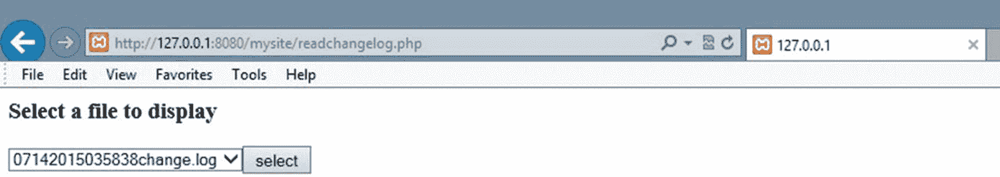
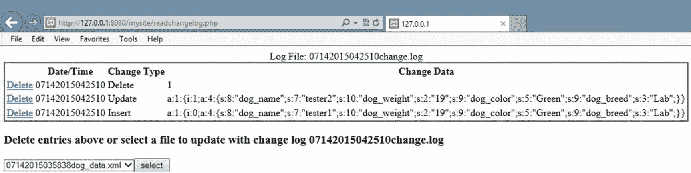
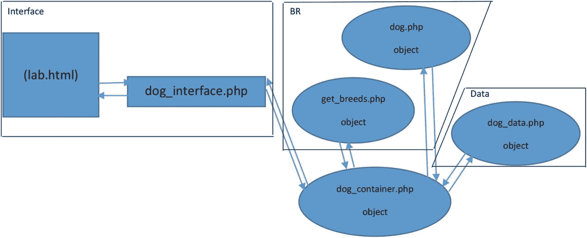

# 7. 数据类

*我是一个理想主义者。我不知道我要去哪里，但我已在路上。——*卡尔·桑德堡*，《偶发事件》(1904)*

## 章节目标 / 学生学习成果

完成本章后，学生将能够：

*   创建一个用于插入、更新和删除 XML 或 JSON 数据的数据类

*   解释如何使用 SQL 脚本创建一个用于更新 MySQL 数据的数据类

*   创建一个用于生成变更备份日志的 PHP 程序

*   创建一个能够从先前备份中恢复数据的 PHP 程序

*   应用更改以创建最新的有效信息

*   使用依赖注入将数据类附加到业务规则层的另一个类

*   创建一个三层 PHP 应用程序

### 数据类

界面层和业务规则层不应存储应用程序信息。这些层甚至不应知道信息的存储方式（文本文件、XML 或数据库）或存储位置。任何需要存储的信息都必须从业务规则层传递到数据层。数据层还负责响应来自业务规则层的信息请求。

这使得界面层和业务规则层无需了解存储方法类型（文本文件、XML 或数据库）或存储项目位置的任何更改。数据层接受的签名（参数）和返回的项目在应用程序的生命周期内应保持不变。只要这些不变，当数据层发生更改时，其他层也应无需更改。

*   *安全与性能——在使用数据库时，在业务规则层构建 SQL 字符串并将该字符串传递给数据层似乎是合理的。但这会在应用程序中造成一个主要的安全漏洞。黑客可以传递任何 SQL 字符串（包括* *delete* *字符串）。将 SQL 更新命令（DELETE、* *UPDATE 和* *INSERT）传递给数据层似乎也很合理。同样，这也提供了一个主要漏洞。为 SQL 的* *WHERE* *命令传递数据也是一个坏主意，因为它可能允许黑客删除或更改数据库中任意组合的数据。*

数据类应提供操作信息的完整功能。这包括读取、插入、更新和删除信息的能力。即使当前应用程序不需要所有这些命令，从逻辑上讲，它们也应存在于数据类中以便将来使用。

在性能和存储信息的需求之间应取得平衡。虽然高度重要的信息可能需要立即存储，但其他信息可以保存在应用程序的数据结构（列表、数组、数据集）中，直到用户完成所有更新。在服务器的内存中保存和对信息进行更改，而不是在存储位置进行，效率要高得多。仅在所有更改完成后才存储信息，可以将对存储位置的多次调用减少到两次（初始检索信息和保存更新后的信息）。在内存中对信息进行更改总是比在存储设备（如硬盘驱动器）上进行更改更高效。

然而，当数据发生变化时，可能会发生冲突。应用程序正在对数据进行更改的同时，数据结构中驻留的实时数据可能也正在被更新。有多种方法可以减少或消除冲突的可能性。所需的方法取决于数据的使用频率和更改频率。可以设计锁定机制来限制对当前正在使用的数据的访问。这些技术通常是在数据结构本身内部处理的。对于频繁更改的数据，这些技术是保留有效数据所必需的。本书示例中使用的数据不经常更改。因此，冲突的可能性大大降低。

使用数据类可提供一种逻辑能力，用于填充数据结构并将信息自动保存到存储位置。假设仅在需要更新信息时才创建数据类的实例，则该类的构造函数可用于从存储中检索信息并将其置于服务器内存中。当不再需要数据对象时，从逻辑上讲，不再需要对信息进行更改。该类的析构函数可用于将信息从内存返回到存储。

```php
class dog_data
{
function __construct()
{
$xmlfile = file_get_contents(get_dog_application("datastorage"));
$xmlstring = simplexml_load_string($xmlfile);
$array = (array)$xmlstring;
print_r($array);
}
}
```

这个示例构造函数非常接近从 XML 文件中提取有用信息的目标。PHP 的 `file_get_contents` 方法打开一个文本 XML 文件，将内容存入一个字符串，然后关闭文件。构造函数调用此方法以及 `get_dog_application` 方法（与示例 6-5 中的 `dog_container` 中使用的方法相同）来确定 XML 数据文件的名称和位置。文件内容随后被放入 `$xmlfile` 中。接着，PHP 的 `simplexml:load_string` 方法对数据进行格式化，使 SimpleXML 数据模型能够遍历这些信息。此时，可以使用 SimpleXML 方法来显示和操作数据。然而，下一行试图将 XML 数据转换为数组。`(array)` 语句尝试使用类型转换。`print_r` 语句则显示结果。

```
Woof

Yellow
Lab

Sam

Brown
Lab
```

假设 XML 文件的格式如上所示，输出结果将包含：

```
Array ( [dog] => Array (
[0] => SimpleXMLElement Object (
[dog_name] => Woff [dog_weight] => 12
[dog_color] => Yellow [dog_breed] => Lab )
[1] => SimpleXMLElement Object (
[dog_name] => Sam [dog_weight] => 10
[dog_color] => Brown [dog_breed] => Lab )
) )
```

这里创建了多维数组和 SimpleXML 对象的组合。这并不能提供易于操作的实用数据。不过，你可以使用 JSON 方法“诱导” PHP 创建一个多维的*关联数组*。

```php
class dog_data
{
function __construct()
{
$xmlfile = file_get_contents(get_dog_application("datastorage"));
$xmlstring = simplexml:load_string($xmlfile);
$json = json_encode($xmlstring);
print_r($json);
}
}
{"dog":[{"dog_name":"Woff","dog_weight":"12","dog_color":"Yellow",
"dog_breed":"Lab"},{"dog_name":"Sam","dog_weight":"10",
"dog_color":"Brown","dog_breed":"Lab"}]
}
```

使用 PHP 的 `json_encode` 方法可以将数据转换为结构良好的 JSON 数据。你可以使用多种 PHP 技术之一来操作 JSON 数据，或者通过额外的一个语句（`json_decode`）来创建一个结构良好的多维关联数组。

```php
class dog_data
{
function __construct()
{
$xmlfile = file_get_contents(get_dog_application("datastorage"));
$xmlstring = simplexml:load_string($xmlfile);
$json = json_encode($xmlstring);
$dogs_array = json_decode($json,TRUE);
print_r($dogs_array);
}
}
Array ( [dog] =>
Array (
[0] => Array ( [dog_name] => Woff [dog_weight] => 12
[dog_color] => Yellow [dog_breed] => Lab )
[1] => Array ( [dog_name] => Sam [dog_weight] => 10
[dog_color] => Brown [dog_breed] => Lab )
) )
```

如你所见，这里不再有数组和 SimpleXML 对象的混合。我们创建了一个关联数组，它使用关键字而不是数字值作为下标（索引）。在前面的示例中，创建了一个名为 `"dog"` 的数组，其中包含两行（每行由一个数组表示）。在每一行中，列（单元格）通过列名（`dog_name`、`dog_weight`、`dog_color` 和 `dog_breed`）而不是索引（0, 1, 2, 3）来引用。我们可以使用前几章中看到的一些技术来操作这些行和列。

一旦我们完成了对数组的所有更改（根据业务逻辑层的要求），我们将在析构函数中将信息返回到存储位置。

```php
private $dogs_array = array(); // 初始定义为一个空数组
function __construct()
{
$xmlfile = file_get_contents(get_dog_application("datastorage"));
$xmlstring = simplexml:load_string($xmlfile);
$json = json_encode($xmlstring);
$this->dogs_array = json_decode($json,TRUE);
}
function __destruct()
{
$xmlstring = '';
$xmlstring .= "\n\n";
foreach ($this->dogs_array as $dogs=>$dogs_value) {
foreach ($dogs_value as $dog => $dog_value)
{
$xmlstring .="\n";
foreach ($dog_value as $column => $column_value)
{
$xmlstring .= "" . $dog_value[$column] . "\n";
}
$xmlstring .= "\n";
}
}
$xmlstring .= "\n";  file_put_contents(get_dog_application("datastorage"),$xmlstring);
}
```

在 PHP 中有很多创建 XML 数据的方法。前面的示例采用了一种简单的方法，即从数组中提供 XML 标签。从结构中可以看到，这个多维数组中有三组数组。第一个 `foreach` 循环用于遍历第一个数组（dogs）。第二个 `foreach` 循环处理狗数组（行）。进入此循环后，第三个 `foreach` 循环控制每个狗数组（每一行）中的列。第三个循环获取列名（来自 `$column`）并将它们放入 XML 标签中。`$column` 也用于提取列中的值（`$dog_value[$column]`）。`$xmlstring` 提供与原始 XML 文件相同的标签和结构。请注意，每行都包含一个换行符（`\n`），以便在文件中显示不同的行。即使没有这个换行符，结构也能正常工作。但是，它使得文件在文本编辑器中更具可读性。一旦 `$xmlstring` 创建完成，代码会结合使用 PHP 的 `file_put_contents` 方法和 `get_dog_application` 方法（来自第 4 章）来打开 XML 文件，用 `$xmlstring` 中包含的字符串替换其内容，并关闭文件。

我们需要对构造函数进行最后的调整，以便使其能够处理 XML 解析错误。当 XML 结构出现问题时，就会发生解析错误。之前的 `dog_breed` 和 `dog_application` XML 文件不会由应用程序更新，并且相当稳定。然而，存储狗信息的 XML 文件将会频繁更新。我们需要处理可能发生的任何问题。我们将引发一个通用错误，`dog_interface` 会将其视为重要错误，进行记录并通过电子邮件发送给支持人员。它还会向用户显示一条消息：`"System currently not available please try again later"`。

```php
$dogs_array = array(); // 初始定义为一个空数组
Libxml_use_internal_errors(true);
function __construct() {
$xmlfile = file_get_contents(get_dog_application("datastorage"));
$xmlstring = simplexml_load_string($xmlfile);
if ($xmlstring === false) {
$errorString = "Failed loading XML: ";
foreach(libxml_get_errors() as $error) {
$errorString .= $error->message . " ";  }
throw new Exception($errorString); }
$json = json_encode($xmlstring);
$this->dogs_array = json_decode($json,TRUE);
}
```

默认情况下，XML 解析错误会导致系统向用户显示错误并关闭程序。`libxml_user_internal_errors(true)`方法会抑制这些错误。通过`simplexml_load_string`方法将字符串转换为 XML 格式时，系统会解析 XML 以判断其是否有效。如果无效，该方法将返回`FALSE`而非 XML 信息。所示的`if`语句会创建一个`$errorString`，并使用`foreach`语句循环遍历`libxml_get_errors`方法返回的每个错误（该方法返回一个包含错误的数组）。收集完所有错误后，它会引发一个异常并传递`$errorString`。`dog_interface`程序将捕获此错误并进行处理，如第 6 章所示。这个示例做了一个不好的假设（这简化了示例）：它假定`$errorString`不会超过日志文件 120 个字符的最大容量。格式非常糟糕的文件可能会迅速使`$errorString`超出此大小。在 PHP 配置文件中可以调整此限制。

由于数据对象从内存中移除时会自动保存数据，因此插入、更新和删除方法只需调整多维关联数组的内容即可。让我们先看看如何创建`delete`方法，因为你在第 6 章中已经见过一个示例。

在`readerrorlog`程序（示例 6-8）中，我们创建了一个`deleterecord`方法。该方法用于常规的多维数组。我们可以对这个例程稍作调整，为`dog_data`类创建`deleteRecord`方法。

```php
function deleteRecord($recordNumber) {

    foreach ($this->dogs_array as $dogs=>&$dogs_value) {

        for($J=$recordNumber; $J < count($dogs_value) - 1; $J++) {

            foreach ($dogs_value[$J] as $column => $column_value) {

                $dogs_value[$J][$column] = $dogs_value[$J + 1][$column];

            }

        }

        unset ($dogs_value[count($dogs_value) -1]);

    }

}
```

在之前的`deleterecord`方法中，数组的行数和数组本身被传入该方法。`dog_data`类中的数组由包含狗狗信息的XML文件填充。并没有设置记录数的属性。这不是问题。PHP的`count`方法会返回数组的大小。我们可以使用`$this`指针访问和更新`dogs_array`（这是一个受保护的私有属性）。类中的方法可以使用`this`指针访问和更新受保护的属性；无需将它们传入方法。我们需要传递给`deleteRecord`方法的唯一属性是要删除的记录编号（`$recordNumber`）。

该关联数组有三个维度。外层维度与XML结构中的`dogs`标签相关。虽然`dogs`只有一行，但仍然需要循环进入下一个数组（`dog`）。`foreach`循环穿透`dogs`数组，并提供对`dog`数组的访问（该数组是从XML文件中的`dog`标签创建的）。`$dogs`将包含当前使用的狗狗行的编号。`$dogs_value`将包含该行的内容（一个包含`dog_name`、`dog_weight`、`dog_color`和`dog_breed`值的数组）。为了遍历`dog`数组中的每一行（数组），该方法使用了`for`循环。条件语句（`$J < count($dogs_value) - 1`）使用`count`方法确定`dog`数组的大小。`count`方法返回的是数组的大小，而不是最后一个位置。因此，循环次数必须小于（`<`）`count`返回的大小。从这个值中减去1。如第6章所述，删除行之后的任何行都必须从其当前位置向上移动一位。数组的最后一个位置将不再需要，这会使所需的循环次数减少一次。

在第5章的示例中，使用了`for`循环将行中的每一列提取出来并放置到上一行中。对于关联数组，我们使用`foreach`循环。`$column`参数包含列名（`$J`包含行号），以便将值放入列中的正确位置。移动完行中的值后，使用PHP的`unset`方法移除数组的最后一个位置。类似的逻辑几乎可以用在任何编程语言中。然而，PHP的关联数组允许跳过索引编号。与其他语言会在缺失索引处放置`NULL`值不同，PHP的关联数组会直接跳过实际的索引。因此，任何数组都可能包含0、1、2、4和5这样的索引，而`foreach`循环仍然可以正确遍历该数组。考虑到这一点，我们可以大大简化之前的删除示例，使其仅包含一行代码，即仅展示`unset`命令。`unset`命令会从`dog_array`中移除传入该方法的索引。任何使用`dog_array`的`for`循环仍然可以正确遍历该数组。

我们还可以对第5章中的`displayRecords`方法稍作调整，以返回调用程序（如`Dog`类）请求的任何记录。

```php
function readRecords($recordNumber) {
    if($recordNumber === "ALL") {
        return $this->dogs_array["dog"];
    }
    else {
        return $this->dogs_array["dog"][$recordNumber];
    }
}
```

如您所见，`readRecords()`方法比`displayRecords()`方法更简单。该方法结果的所有格式化工作都留给调用程序（如果需要）。请记住，输出的显示和格式化发生在界面层，而不是数据层（或业务规则层）。此方法允许调用程序请求所有记录或特定记录。无论哪种情况，它都会返回一个数组，其中包含一行（请求的特定记录）或所有行。当返回所有行时，会移除顶层数组（代表行的XML标签），以保持两种选择下的维度（二维）相同。

`insertRecords()`方法接受一个关联数组，其下标名称如前所述。然而，为了实现对XML文件标签名称的依赖注入和灵活性，调用程序直到创建了`dog_data`类的实例后才需要知道标签名称。这可以通过使用`readRecords()`方法拉取第一条记录，然后让调用程序检查从该记录返回的下标名称来实现。

```php
function insertRecords($records_array)
{
    $dogs_array_size = count($this->dogs_array["dog"]);
    for($I=0;$I<count($records_array);$I++)
    {
        $this->dogs_array["dog"][$dogs_array_size + $I] = $records_array[$I];
    }
}
```

**注意**

使用前面展示的JSON函数创建`dog_array`的过程会在创建`dog_array`时产生一个不一致之处。如果`dog_data.xml`文件只包含一条记录，JSON函数将不会创建数字索引（例如`'0'`）。当XML文件中包含多条记录时，则会创建数字索引（例如`'0'`、`'1'`）。

在`insertRecords()`方法中，所有记录都被添加到数组的末尾（调用程序可以在需要时对其进行排序）。`dogs_array`的当前大小由`count`方法确定并存储在`$dogs_array_size`中。`for`结构内部也使用了`count`方法来确定`$records_array`的大小以及循环次数。由于`count`方法的结果给出了数组的大小，该值比最后一个下标位置大1，因此`count`的结果也提供了可插入记录的下一个可用位置。在第一次循环中，`$I`为0。`$records_array`的第一条记录被放置在`$dogs_array_size`加0的位置，即`$dogs_array_size`（第一个用于放置记录的空行）。下一次循环时，`$records_array`的第二条记录（`$I`已由循环递增）被放置在位置`$dogs_array_size`加1处。这是插入第一条记录后的下一个可用位置。循环将持续进行，直到`$records_array`中没有更多记录。顺便说一句，此方法也适用于仅插入一条记录的情况（只要它作为关联数组传递）。循环将仅执行一次。

我们需要考察的最后一个方法是`update`方法。此方法是析构方法的一种非常简单的形式。

```php
function updateRecords($records_array)
{
    foreach ($records_array as $records=>$records_value) {
        foreach ($records_value as $record => $record_value) {
            $this->dogs_array["dog"][$records] = $records_array[$records];
        }
    }
}
```

这个非常小巧的方法将接受任何大小的关联数组并更新`dogs`数组。它基于PHP动态构建数组的能力。

```php
$records_array = Array (
    0 => Array ( "dog_name" => "Jeffrey", "dog_weight" => "19",
                 "dog_color" => "Green", "dog_breed" => "Lab" ),
    2 => Array ( "dog_name" => "James", "dog_weight" => "21",
                 "dog_color" => "Black", "dog_breed" => "Mixed" ));
```

动态构建的数组不需要为数组中的每个位置都包含值。如果前面展示的动态数组被传递给`updateRecords()`方法，那么记录0和记录2的将被新信息更新。`dogs`数组中位置1的值将保持不变。花点时间看看这些方法。在这些方法中，只有两个XML标签被硬编码（`dogs`和`dog`）。即便这两个标签也可以从XML文件中获取。但是，假设这些标签始终存在于一个有效的狗类XML文件中，这在逻辑上是合理的。通过从XML文件动态提取所有其他标签（`dog_name`、`dog_weight`、`dog_color`和`dog_breed`），可以在不引起任何代码更改的情况下对文件进行修改。可以添加、删除和/或更改额外的标签。

最后，让我们将所有内容整合在一起。

```
load('e5dog_applications.xml');
$searchNode = $xmlDoc->getElementsByTagName("type");
foreach ($searchNode as $searchNode) {
    $valueID = $searchNode->getAttribute('ID');
    if ($valueID == "datastorage") {
        $xmlLocation = $searchNode->getElementsByTagName("location");
        $this->dog_data_xml = $xmlLocation->item(0)->nodeValue;
        break;
    }
}
} else {
    throw new Exception("Dog applications xml file missing or corrupt");
}
$xmlfile = file_get_contents($this->dog_data_xml);
$xmlstring = simplexml_load_string($xmlfile);
if ($xmlstring === false) {
    $errorString = "Failed loading XML: ";
    foreach (libxml_get_errors() as $error) {
        $errorString .= $error->message . " ";
    }
    throw new Exception($errorString);
}
$json = json_encode($xmlstring);
$this->dogs_array = json_decode($json, TRUE);
}

function __destruct() {
    $xmlstring = '';
    $xmlstring .= "\n\n";
    foreach ($this->dogs_array as $dogs => $dogs_value) {
        foreach ($dogs_value as $dog => $dog_value) {
            $xmlstring .= "\n";
            foreach ($dog_value as $column => $column_value) {
                $xmlstring .= "" . $dog_value[$column] . "\n";
            }
            $xmlstring .= "\n";
        }
    }
    $xmlstring .= "\n";
    file_put_contents($this->dog_data_xml, $xmlstring);
}

function deleteRecord($recordNumber) {
    foreach ($this->dogs_array as $dogs => &$dogs_value) {
        for ($J = $recordNumber; $J < count($dogs_value) - 1; $J++) {
            foreach ($dogs_value[$J] as $column => $column_value) {
                $dogs_value[$J][$column] = $dogs_value[$J + 1][$column];
            }
        }
        unset($dogs_value[count($dogs_value) - 1]);
    }
}

function readRecords($recordNumber) {
    if ($recordNumber === "ALL") {
        return $this->dogs_array["dog"];
    } else {
        return $this->dogs_array["dog"][$recordNumber];
    }
}

function insertRecords($records_array) {
    $dogs_array_size = count($this->dogs_array["dog"]);
    for ($I = 0; $I < count($records_array); $I++) {
        $this->dogs_array["dog"][$dogs_array_size + $I] = $records_array[$I];
    }
}

function updateRecords($records_array) {
    foreach ($records_array as $records => $records_value) {
        foreach ($records_value as $record => $record_value) {
            $this->dogs_array["dog"][$records] = $records_array[$records];
        }
    }
}
}
?>
示例 7-1
`dog_data.php` 文件
```

在这个最终版本的 `dog_data` 类中，唯一的改变是在构造函数中包含了 `get_dog_application` 方法的代码，用于获取存放狗类数据的 XML 文件的位置和名称。

```php
<?php
require_once("dog_data.php");
$tester = new dog_data();
$records_array = Array (
    0 => Array ( "dog_name" => "Sally", "dog_weight" => "19",
                 "dog_color" => "Green", "dog_breed" => "Lab" ));
$tester->insertRecords($records_array);
print_r ($tester->readRecords("ALL"));
print("");
$records_array = Array (
    1 => Array ( "dog_name" => "Spot", "dog_weight" => "19",
                 "dog_color" => "Green", "dog_breed" => "Lab" ));
$tester->updateRecords($records_array);
print_r ($tester->readRecords("ALL"));
print("");
$tester->deleteRecord(1);
print_r ($tester->readRecords("ALL"));
$tester = NULL; // 调用析构函数并将 xml 记录保存到文件
?>
示例 7-2
`testdata.php` 文件
```

示例 7-2 测试了使用 `dog_data` 类的一些可能场景。注意最后一行代码调用了析构函数（以保存数据）。这是通过将指向对象的指针（`$tester`）设置为 `NULL` 来实现的，这会释放该对象。这将通知操作系统的垃圾回收器，该对象应从内存中移除。这会导致析构函数执行，从而更新 XML 文件并将该对象从服务器内存中移除。

### JSON 数据

让我们稍作停顿，回顾一下读写 JSON 数据的能力。使用本章所示的示例代码，当您使用除 XML 以外的其他数据形式时，只需调整构造函数和析构函数。访问和使用 JSON 数据甚至比使用 XML 数据更加简单。

```php
...
$json = file_get_contents($this->dog_data_JSON);
$this->dogs_array = json_decode($json, TRUE);
if ($this->dogs_array === null && json_last_error() !== JSON_ERROR_NONE) {
    throw new Exception("JSON error: " . json_last_error_msg());
}
...
```

在构造函数中，在从 `dog_application.xml` 文件获取数据位置的 `if else` 结构之后，原先用于访问和格式化 XML 数据的多行代码可以替换为前面所示的这几行代码。`json_decode` 方法（如前所示）会尝试将文本文件中的数据格式化为关联数组格式。如果数据不是有效的 JSON 格式，则会抛出异常并传递错误信息。由于使用了 `Exception` 类，`dog_interface` 程序会将这些信息记录到错误日志中，发送邮件给支持人员，并向用户显示一条通用消息。

```php
$json = json_encode($this->dogs_array);
file_put_contents($this->dog_data_JSON, $json);
```

析构函数的完整代码只需要两行。`json_encode` 方法会将关联数组数据转换为 JSON 格式。然后 `file_put_contents` 方法会将信息保存到 JSON 文件的正确位置（`$this->dog_data_JSON`）。`dog_data` 中的任何其他方法都不需要修改。

### MySQL 8+ 的 MySQL 和 NoSQL 数据

现在是简要举例说明我们可以对构造函数和析构函数方法进行调整以访问和更新数据库信息的好时机。当前版本的 MySQL 允许创建 MySQL 和 NoSQL 数据。


有关安装最新版本 MySQL 的信息，请访问 [https://dev.mysql.com/doc/refman/8.0/en/installing.html](https://dev.mysql.com/doc/refman/8.0/en/installing.html)。

每当使用外部数据存储技术时，都应实施所有安全措施以完全保护所有数据。所有数据库系统都包含数据安全工具，以便在存储之前对信息进行验证。

有关在 MySQL 数据库结构中保护数据安全的信息，请访问 [https://dev.mysql.com/doc/refman/8.0/en/security.html](https://dev.mysql.com/doc/refman/8.0/en/security.html)。

```php
$mysqli =mysqli_connect($server, $db_username, $db_password, $database);
if (mysqli_connect_errno())
{
throw new Exception("MySQL connection error: " . mysqli_connect_error());
}
$sql="SELECT * FROM Dogs";
$result=mysqli_query($con,$sql);
If($result===null)
{
throw new Exception("No records retrieved from Database");
}
$this->dogs_array = mysqli_fetch_assoc($result);
mysqli_free_result($result);
mysqli_close($con);
```

构造函数所需的大部分代码都与连接、检索和断开数据库相关。`mysqli_connect` 方法使用服务器位置（`$server`）、数据库用户 ID（`$db_username`）、数据库密码（`$db_password`）和数据库名称（`$database`）来连接数据库。如果 `mysqli_connect_errno` 包含任何错误，则会抛出一个描述该错误的 `Exception`。如果没有错误，则使用 SQL SELECT 语句（`$sql`）从数据库的 `Dogs` 表中检索所有记录。如果没有检索到记录，则会抛出另一个异常。如果检索到记录，`mysqli_fetch_assoc` 方法会将数据转换为关联数组。`mysqli_free_result` 语句会释放 `$result` 中的数据。`mysqli_close` 方法会关闭对数据库的访问。

析构函数需要编写更多的代码。然而，其循环结构与保存 XML 数据类似。

```php
$mysqli = new mysqli($server, $db_username, $db_password, $database);
if ($mysqli->connect_errno)
{
throw new Exception("MySQL connection error:" . $mysqli->connect_error);
}
If( (!$mysqli->query("DROP TABLE IF EXISTS Dogs") ||
(!$mysqli->query("CREATE TABLE IF NOT EXISTS Dogs (dog_id CHAR(4), dog_name CHAR(20), dog_weight CHAR(3), dog_color CHAR(15), dog_breed CHAR(35)") )
{
throw new Exception("Dog table can't be created or deleted. Error: " .
$mysqli->error);
}
foreach ($this->dogs_array as $dogs=>$dogs_value) {
foreach ($dogs_value as $dog => $dog_value)
{
$dog_id = $dog_value["dog_id"];
$dog_name = $dog_value["dog_name"];
$dog_weight = $dog_value["dog_weight"];
$dog_color = $dog_value["dog_color"];
$dog_breed = $dog_value["dog_breed"];
If(!$mysqli->query("INSERT INTO Dogs(dog_id, dog_name,
dog_weight, dog_color, dog_breed)
VALUES ('$dog_id', '$dog_name', '$dog_weight', '$dog_color', '$dog_breed')"))
{
throw new Exception("Dog Table Insert Error: " . $mysqli->error);
}
}
}
...
```

析构函数方法尝试连接数据库。如果连接成功，该方法会删除任何预先存在的 `Dogs` 表，并使用所需的字段创建一个新表。（注意：或许重命名旧表再创建新表会更好。）如果旧表能被删除且新表被成功创建，那么该方法会尝试向表中插入行。SQL `INSERT` 语句将 `$dog_name`、`$dog_weight`、`$dog_color` 和 `$dog_breed` 中的值放入表中的一行。`foreach` 循环从关联数组中检索每一行以便放入表中。如果任何插入操作不成功，则会抛出一个异常。

有关创建和使用 MySQL 数据存储以保存 NoSQL 数据的信息，请访问 [https://dev.mysql.com/doc/refman/8.0/en/document-store.html](https://dev.mysql.com/doc/refman/8.0/en/document-store.html)。

*   **编程注意事项**——要运行此（或类似）数据库示例，必须正确配置 Apache 服务器，并且必须正确安装 MySQL。`$server` 必须设置为 URL、“localhost”或“127.0.0.1”。`$db_username` 必须设置为用于访问数据库的用户 ID 名称（如果尚未配置用户 ID，则为'root'）。`$db_password` 必须设置为数据库密码（如果没有密码，则为 `''`）。`$database` 必须设置为数据库名称。在 PHP 语言中有多种访问和操作数据库的方式。

#### 动手实践

1.  从本书网站下载本节的示例文件。

    调整 `deleteRecords` 方法以支持删除多条记录。同时，增加检查机制以限制可删除的记录数量。允许删除所有记录是非常不安全的。如果试图删除所有记录（或过多记录），应抛出异常。该异常应导致调用程序（最终是 `dog_interface`）向主日志文件写入错误信息、通过电子邮件通知支持人员，并向用户显示通用消息（如第 6 章所示）。调整 `testdata` 程序以测试删除多条记录的功能并捕获异常。

2.  从本书网站下载本节的示例文件。

    调整 `testdata` 程序以测试所有尚未测试的剩余场景。这些场景涉及插入、更新（多条）、读取和删除记录。务必测试格式不正确的信息。在 `testdata` 程序中创建一个 `try catch` 块来捕获任何异常。你可以参考第 6 章中 `dog_interface` 的 `try catch` 块作为示例。

## 备份与恢复

对存储信息进行更改时，总有可能出现问题。一个完善的应用程序在保存数据前必须过滤和清理数据，同时也必须准备好处理坏数据可能渗透并损坏信息的情况。除了故意破坏，还可能出现不可预见的问题（如系统崩溃）。应用程序必须提供在不丢失数据的情况下进行恢复的能力。这可以通过记录变更请求和备份有效信息来实现。恢复可以通过使用有效的备份，并将有效的更改重新应用于备份文件以生成最新信息来完成。

只需对 `dogdata` 文件（示例 7-1）进行少量改动，即可创建变更日志并提供备份和恢复能力。首先，我们将创建一个主方法（`processRecords`），它负责解释传递给该类的任何数据。此函数通过允许恢复程序将所有变更日志信息传递给一个方法，从而简化恢复过程。


```
function processRecords(string $change_Type, $records_array)
{
switch($change_Type)
{
case "Delete":
$this->deleteRecord($records_array);
break;
case "Insert":
$this->insertRecords($records_array);
break;
case "Update":
$this->updateRecords($records_array);
break;
case "Display":
$this->readRecords($records_array);
Break;
default:
throw new Exception("Invalid XML file change type: $change_Type");
}
}
```

所有更改请求现在都将通过此方法传递。该方法接受一个变更类型（`Insert`、`Delete`、`Update`或`Display`）以及数组（用于`Insert`或`Update`）或记录编号（用于`Delete`或`Update`）。这些值被传递给`$record_array`。`$record_array`被动态创建为数组或字符串。这使得`processRecords`方法能够提供*多态性*（同一方法调用接受不同参数的能力），这是面向对象语言的要求之一（与封装和继承一起）。`switch`语句检查`$change_Type`以决定调用哪个方法，然后调用相应的方法。如果传递了无效类型，则抛出异常。

> 安全和性能提示——在“生产”环境中，向此类方法传递“代码”而非指示将要执行的操作的值会更安全。例如，可以用`101`表示更新。`switch`语句可以轻松调整为检查这些代码以决定调用哪个方法。

此前我们审查过的每个方法（除了构造方法和析构方法）现在都被设置为`'private'`。这使得过程更加安全；更改只能通过使用`processRecords`方法进行。在每个方法的末尾还增加了三行代码以提供备份和恢复能力。

```
...
$change_string = date('mdYhis') . " | Delete | " . $recordNumber . "\n";
$chge_log_file = date('mdYhis') . $this->change_log_file;
error_log($change_string,3,$chge_log_file); // might exceed 120 chars
...
```

第一行格式化了一个用于变更日志文件的字符串。其格式类似于我们在第 6 章中看到的格式。在前面的示例中，根据`delete`方法的要求传入了记录编号。

```
$change_string = date('mdYhis') . " | Update | " . serialize($records_array) . "\n";
```

对于`update`和`insert`方法，传入了数组。但是，数组不能直接放入字符串中。`serialize`方法将数组转换为类似以下格式的字符串：

```
a:1:{i:0;a:4:{s:8:"dog_name";s:7:"Spot";s:10:"dog_weight";s:2:"19";s:9:
"dog_color";s:5:"Green";s:9:"dog_breed";s:3:"Lab";}}
```

序列化字符串中的数据可以使用`unserialize`方法恢复为数组格式（或其他格式）。第二行创建了一个字符串`($chge_log_file`)，它使用`date`方法和位于`dog_applications` XML 文件中的日志文件名来创建备份文件名（和路径）。然后将该字符串通过`error_log`方法传递给此日志。日志文件的内容将类似于以下内容：

```
07142020042510 | Insert | a:1:{i:0;a:4:{s:8:"dog_name";s:7:"tester1";s:10:
"dog_weight";s:2:"19";s:9:"dog_color";s:5:"Green";s:9:"dog_breed";s:3:"Lab";}}
07142020042510 | Update | a:1:{i:1;a:4:{s:8:"dog_name";s:7:"tester2";s:10:
"dog_weight";s:2:"19";s:9:"dog_color";s:5:"Green";s:9:"dog_breed";s:3:"Lab";}}
07142020042510 | Delete | 1
```

此格式提供了帮助恢复过程所需的所有信息。如果当前版本的狗狗数据文件损坏，可以使用变更日志文件将更改应用于一个完好的文件版本，以生成一个新的当前版本。

`data`类需要的其他唯一改动是在析构函数中增加几行代码。

```
$new_valid_data_file = preg_replace('/[0-9]+/', '', $this->dog_data_xml);
// 移除之前的日期和时间（如果存在）
$oldxmldata = date('mdYhis') . $new_valid_data_file;
if (!rename($this->dog_data_xml, $oldxmldata))
{
throw new Exception("备份文件 $oldxmldata 无法创建。");
}
file_put_contents($new_valid_data_file,$xmlstring);
```

在析构函数使用`file_put_contents`方法将更改应用到 XML 文件之前，应创建一个备份，以防更改导致当前数据损坏。恢复过程将允许支持人员选择包含良好数据的数据文件，以及将哪些更改文件应用于数据，以生成数据的正确当前版本。

由于此过程可能使用数据的备份文件（其文件名包含日期和时间），因此使用`preg_replace`方法从数据文件名中移除所有数值信息。第一个参数中的正则表达式（`/[0-9]+/`）指示该方法搜索`$this->dog_data_xml`中所有出现的数字。如果找到任何匹配项，则将其替换为第二个参数（`''`）中的值，在本例中为空字符串。然后，新文件名被存储在`$new_valid_data_file`中。这不会对“正常的”非备份文件名造成任何更改，因为它不包含任何数值信息。使用`$new_valid_data_file`中的文件名加上日期和时间信息，创建了一个新的备份文件名，并存储在`$oldxmldata`中。

现在，可以使用`rename`方法将最后有效的原始数据移动到新的备份文件中。`$this->dog_data_xml`中的数据（未更改的有效数据位置）被复制到新的备份文件位置（`$oldxmldata`）。如果文件无法重命名，则抛出异常。最后，有效的更改数据（位于`$xmlstring`中）可以被放置到有效数据的新位置（即不含任何日期信息的相同文件名），该位置由`$new_valid_data_file`属性指定。

例如，如果`07142020042510dog_data.xml`包含最后可用的有效数据，那么`07152020001510dog_data.xml`可能是在应用任何更改之前此数据的新位置。`dog_data.xml`将是应用更改后有效数据的位置。对`dog`数据类的最后一次编码更改是包含了一个`set`方法。

```php
function setChangeLogFile($value)
{
$this->dog_data_xml = $value;
}
```

为了使恢复应用程序能够使用最后有效的数据，应用程序必须能够更改有效数据的位置。`setChangeLogFile`方法更改了`$this->dog_data_xml`中的值。此属性最初是通过定位 dog 应用程序 XML 文件中的信息设置的。然而，当前的位置可能不是有效数据的位置。添加到析构函数中的代码将使用有效数据的新位置，应用所需的更改，并将有效数据放回原始数据文件中。无需对`data_application` XML 文件进行任何更改。析构函数完成后，数据文件将包含最新的有效数据。

```php
load( 'e5dog_applications.xml' );
$searchNode = $xmlDoc->getElementsByTagName( "type" );
foreach( $searchNode as $searchNode ) {
$valueID = $searchNode->getAttribute('ID');
if($valueID == "datastorage") {
$xmlLocation = $searchNode->getElementsByTagName( "location" );
$this->dog_data_xml = $xmlLocation->item(0)->nodeValue;
break;
}
}
else { throw new Exception("Dog applications xml file missing or corrupt"); }
$xmlfile = file_get_contents($this->dog_data_xml);
$xmlstring = simplexml_load_string($xmlfile);
if ($xmlstring === false) {
$errorString = "Failed loading XML: ";
foreach(libxml_get_errors() as $error) {
$errorString .= $error->message . " " ;  }
throw new Exception($errorString); }
$json = json_encode($xmlstring);
$this->dogs_array = json_decode($json,TRUE);
}
function __destruct() {
$xmlstring = '';
$xmlstring .= "\n\n";
foreach ($this->dogs_array as $dogs=>$dogs_value) {
foreach ($dogs_value as $dog => $dog_value) {
$xmlstring .="\n";
foreach ($dog_value as $column => $column_value)
{
$xmlstring .= "" . $dog_value[$column] . "\n";
}
$xmlstring .= "\n";
}   }
$xmlstring .= "\n";
$new_valid_data_file = preg_replace('/[0-9]+/', '', $this->dog_data_xml);
// remove the previous date and time if it exists
$oldxmldata = date('mdYhis') . $new_valid_data_file;
if (!rename($this->dog_data_xml, $oldxmldata)) {   throw new Exception("Backup file $oldxmldata could not be created."); }
file_put_contents($new_valid_data_file,$xmlstring);
}
private function deleteRecord($recordNumber)
{
foreach ($this->dogs_array as $dogs=>&$dogs_value) {
for($J=$recordNumber; $J < count($dogs_value) -1; $J++) {
foreach ($dogs_value[$J] as $column => $column_value)
{
$dogs_value[$J][$column] = $dogs_value[$J + 1][$column];
}
}
unset ($dogs_value[count($dogs_value) -1]);
}
$change_string = date('mdYhis') . " | Delete | " . $recordNumber . "\n";
$chge_log_file = date('mdYhis') . $this->change_log_file;
error_log($change_string,3,$chge_log_file); // might exceed 120 chars
}
private function readRecords($recordNumber)
{
if($recordNumber === "ALL") {
return $this->dogs_array["dog"];
} else {
return $this->dogs_array["dog"][$recordNumber];
}
}
private function insertRecords($records_array)
{
$dogs_array_size = count($this->dogs_array["dog"]);
for($I=0;$I<count($records_array);$I++) {
$this->dogs_array["dog"][$dogs_array_size + $I] = $records_array[$I];
}
$change_string = date('mdYhis') . " | Insert | " . serialize($records_array) . "\n";
$chge_log_file = date('mdYhis') . $this->change_log_file;
error_log($change_string,3,$chge_log_file); // might exceed 120 chars
}
private function updateRecords($records_array)
{
foreach ($records_array as $records=>$records_value)
{
foreach ($records_value as $record => $record_value)
{
$this->dogs_array["dog"][$records] = $records_array[$records];
}
}
$change_string = date('mdYhis') . " | Update | " . serialize($records_array) . "\n";
$chge_log_file = date('mdYhis') . $this->change_log_file;
error_log($change_string,3,$chge_log_file); // might exceed 120 chars
}
function setChangeLogFile($value)
{
$this->dog_data_xml = $value;
}
function processRecords($change_Type, $records_array)
{
switch(string $change_Type)
{
case "Delete":
$this->deleteRecord($records_array);
break;
case "Insert":
$this->insertRecords($records_array);
break;
case "Update":
$this->updateRecords($records_array);
break;
default:
throw new Exception("Invalid XML file change type: $change_Type");
} } }
```

**示例 7-3: 包含日志记录以及备份和恢复过程的`dogdata.php`文件**

现在你已经具备了提供备份和恢复的能力，让我们对`readerrorlog`文件（如示例 6-8 所示）进行一些调整。新的应用程序将需要允许支持人员选择（和修改）任何有效的更改日志文件，选择最有效的数据文件，并应用更改日志文件中的更改来生成一个新的有效数据 XML 文件。

```php
if(isset($_POST['data_File']))
{
update_XML_File_Process();
}
else if(isset($_GET['rn']))
{
delete_Process();
}
else if(isset($_POST['change_file']))
{
display_Process();
}
else
{
select_File_Process();
}
```

由于代码篇幅增长，若将大部分工作封装在方法中，将更便于理解逻辑流程（以及在必要时修改代码）。与许多应用程序一样，程序的主流程变成了一个嵌入式的 `if else` 语句。



**图 7-1** `readchangelog.php` 文件请求选择变更日志文件

打开应用程序时，列表框将允许用户选择要使用（且可能更新）的有效变更日志文件。语句中的 `else` 部分会将程序定向到 `select_File_Process` 来处理此请求。



**图 7-2** `readchangelog` 文件显示所选日志并请求有效数据文件

用户选择变更文件后，文件内容将以与第 6 章相同的方式显示。`display_Process` 方法将提供这些信息。用户可以决定删除所选变更文件中的某些条目。如果需要删除，`delete_Process` 方法将使用第 6 章所示的技术完成此过程。此外，同一方法将允许用户选择最新的有效数据文件来应用变更。一旦选择了数据文件，`update_XML_File_Process` 将使用 `dogdata` 程序（示例 7-3）将变更应用到该文件。该过程将向用户显示一条变更已完成的消息。

`select_File_Process` 方法使用了与 `getbreeds.php` 程序（示例 5-5）中类似的逻辑。

```php
function select_File_Process()
{
$directory = "";
$files = glob($directory . "*change.log");
echo "";
echo "选择要显示的文件";
echo "";
foreach($files as $file)
{
echo "$file";
}
echo "";
echo "";
echo "";
}
```

PHP 的 `glob` 方法将指定目录（`$directory`）中的所有文件名放入一个数组（`$files`）。将 `$directory` 设置为 `""` 表示将搜索当前目录。第二个参数提供了过滤检索文件类型的能力。`*change.log` 指示该方法提取所有以 `change.log` 结尾的文件。`*`（星号）是一个通配符，可匹配任何字符。这种组合将提取所有由 `dog_data` 类生成的变更日志文件。其余行将创建一个 HTML 下拉列表，显示检索到的文件名。提交后，程序将再次调用自身，所选文件将存在 `change_file` 属性中。

```php
function display_Process()
{
$change_Array = load_Array();
$row_Count = count($change_Array) -1;
displayRecords($row_Count, $change_Array, $_POST['change_file']);
}
```

当选择了一个变更文件时，会调用 `display_Process`。此方法调用 `load_Array` 方法。

```php
function load_Array()
{
$change_File = $_POST['change_file'];
$logFile = fopen($change_File, "r");
$row_Count = 0;
while(!feof($logFile))
{
$change_Array[$row_Count] = explode(' | ', fgets($logFile));
$row_Count++;
}
$row_Count--;
fclose($logFile);
return $change_Array;
}
```

`load_Array` 方法与 `dog_data` 类中的构造函数非常相似。该方法检索 `change_file` 的值并将其放入 `$change_File`。然后打开此文件，并将文件中的所有条目放入 `$change_Array`。`explode` 方法将产生三列（日期/时间、变更类型、用于变更的数组或字符串）。它将此数组返回给调用程序（`display_Process`）。

该数组被返回给 `display_Process` 中的 `$change_Array`。`count` 方法确定此数组的大小。其值被放入 `$row_Count`。然后调用 `displayRecords`，并将 `row_count`、`change_Array` 和 `change_file` 传递给 `displayRecords`。

```php
function displayRecords($row_Count, $change_Array, $change_File)
{
echo "";
echo " table { border: 2px solid #5c744d;}  ";
echo "";
echo "";
echo "日志文件: " . $change_File . "";
echo "日期/时间变更类型变更数据";
for ($J=$row_Count -1; $J >= 0; $J--)
{
echo "删除";
for($I=0; $I  " . $change_Array[$J][$I] . "  ";
}
echo "";
}
echo "";
echo "";
$directory = "";
$files = glob($directory . "*dog_data.xml");
echo "";
echo "删除上方条目或选择一个文件以使用变更日志 $change_File 进行更新";
echo "";
foreach($files as $file)
{
echo "$file";
}
echo "";
echo "";
echo "";
echo "";
}
```

`displayRecords` 使用与 `readerrorlog` 程序（示例 6-8）中的 `displayRecords` 方法几乎完全相同的逻辑来显示变更日志文件的内容。它还使用了与 `selectFileProcess`（之前展示的）几乎相同的逻辑来显示数据文件，供用户选择最后一个未损坏的文件。

如果用户决定从变更日志中删除某些记录，将调用 `delete_Process`。

```php
function delete_Process()
{
$change_Array = load_Array();
deleteRecord($_GET['rn'], $row_Count, $change_Array);
saveChanges($row_Count,$change_Array,$change_File);
displayRecords($row_Count,$change_Array,$change_File);
}
```

`delete_Process` 方法将使用与之前相同的 `change_Array` 将变更文件记录放入 `$change_Array`。它将待删除的记录号（`$_GET['rn']`）、数组中的行数（`$row_Count`）和该数组（`$change_Array`）传递给 `deleteRecord` 方法。`deleteRecords` 方法将使用与 `readerrorlog` 程序（示例 6-8）中的 `deleteRecord` 方法相同的逻辑。然后 `delete_Process` 将调用 `saveChanges` 方法，并传入 `row_count`、`change_Array` 和 `change_File` 信息。

```php
function saveChanges($row_Count,$change_Array,$change_File)
{
$changeFile = fopen($change_File, "w");
for($I=0; $I < $row_Count; $I++)
{
$writeString = $change_Array[$I][0] . " | " . $change_Array[$I][1] . " | " . $change_Array[$I][2];
fwrite($changeFile, $writeString);
}
fclose($changeFile);
}
```

`saveChanges` 方法根据 `change_Array` 构建之前看到的 `日期/时间-变更类型-变更数据` 格式。此信息保存在 `$writeString` 中，并用于用更新后的版本替换变更日志文件（减去已删除的记录）。然后 `delete_Process` 方法再次调用 `displayRecords` 方法（前面已描述）以显示更新后的变更日志（减去已删除的记录）和数据文件下拉列表。

一旦用户选择了要更改的数据文件，将调用 `update_XML_File_Process` 方法。

```php
function update_XML_File_Process()
{
$change_Array = load_Array();
require_once("dog_data.php");
$data_Changer = new dog_data();
$row_Count = count($change_Array) -1;
for($I=0;$I processRecords($change_Array[$I][1], $temp);
}
```

该方法调用 `load_Array` 方法，将变更返回到 `$change_Array`。将 `dog_data` 文件导入到该方法中，为对用户选择的数据文件进行变更做准备。创建了一个 `dog_data` 类的实例（`$data_Changer`）。

一个`for`循环用于遍历变更数组，并将每个变更传递给数据类的`processRecords()`方法。但在传递记录之前，必须使用`unserialize()`方法将序列化数据还原为关联数组格式。如果变更请求是`Delete`，则必须进行类型转换，将数据（记录编号）转换为整数。这是 PHP 少数需要类型转换的场景之一。序列化数据不被视为一种数据类型，必须通过反序列化或类型转换来处理。变更类型（`Update`、`Delete`或`Insert`）被传递到`processRecords()`方法的第一个参数中，变更数组或记录编号则作为第二个参数。所有变更都会应用到数据上，文件会被备份，并生成新的变更日志，以防出现更多数据损坏问题。

```
";
echo " table { border: 2px solid #5c744d;}  ";
echo "Log File: " . $change_File . "";
echo "Date/TimeChange TypeChange Data";
for ($J=$row_Count -1; $J >= 0; $J--) {
echo "Delete";
for($I=0; $I  " . $change_Array[$J][$I] . "  ";
}
echo "";
}
echo "";
echo "";
echo "";
echo "";
$directory = "";
$files = glob($directory . "*dog_data.xml");
echo "";
echo "Delete entries above or select a file to update with change log $change_File";
echo "";
foreach($files as $file) {
echo "$file";
}
echo "";
echo "";
echo "";
echo "";
}
function deleteRecord($recordNumber, &$row_Count, &$change_Array) {
for ($J=$recordNumber; $J ";
echo "Select a file to display";
echo "";
foreach($files as $file) {
echo "$file";
}
echo "";
echo "";
echo "";
}
function update_XML_File_Process() {
$change_Array = load_Array();
require_once("dog_datad.php");
$data_Changer = new dog_data();
$row_Count = count($change_Array) -1;
for($I=0;$I processRecords($change_Array[$I][1], $temp);
}
$data_Changer->setChangeLogFile($_POST['data_File']);
$data_Changer = NULL;
echo "Changes completed";
}
// main section
if(isset($_POST['data_File'])) {
update_XML_File_Process();
} else if(isset($_GET['rn'])) {
delete_Process();
} else if(isset($_POST['change_file'])) {
display_Process();
} else {
select_File_Process();
}
?>
Example 7-4
The displaychangelog.php file
```

### JSON 备份与恢复

如果要将 JSON 数据的备份与恢复改为处理 XML 数据，需要做哪些修改？实际上完全不需要修改。只要实现了本章第一部分中的变更，`displaychangelog`程序以及对`dog_data`类的修改，就能像处理 XML 数据一样处理 JSON。

### MySQL 备份与恢复

正如你可能猜测到的，只要实现了本章第二部分中的变更，对 MySQL 数据的备份与恢复就不需要额外修改。不过我们可以花点时间，看看另一种处理 MySQL 数据的方式。

常见的做法是创建一个 SQL 脚本文件，然后在数据库上执行。脚本文件包含所有更新数据库所需的 SQL 代码。使用这种文件，你可以执行相应的`INSERT`、`UPDATE`和`DELETE` SQL 命令，而不仅仅是像之前示例中那样只能执行`INSERT`。之前的示例需要为关联数组中的每条记录都创建`INSERT`命令，包括那些没有变更的记录。对于中型到大型数据库来说，这会非常低效。你只需要更新发生变更的记录。

你可以根据关联数组中发生变更的记录来生成脚本文件。你也可以将变更日志用作脚本文件，因为 SQL 脚本会列出所有已请求的变更，并且可以重新运行以修复任何损坏的数据。

例如，在`updateRecords()`方法中，你可以创建任何所需的`UPDATE`命令。

```
private function updateRecords($records_array)
{
$chge_log_file = date('mdYhis') . $this->change_log_file;
string $chge_string = "";
foreach ($records_array as $records=>$records_value)
{
$this->dogs_array["dog"][$records] = $records_array[$records];
$chge_string .=  "UPDATE Dogs ";
$chge_string .= "SET dog_name='" . $records_array[$records]['dog_name'] ."', ";
$chge_string .= "dog_weight='" . $records_array[$records]['dog_weight'] ."',”;
$chge_string .= "dog_color='" . $records_array[$records]['dog_color'] ."', ";
$chge_string .= "dog_breed='" . $records_array[$records]['dog_breed'] ."' ";
$chge_string .= "WHERE dog_id='" . $records_array[$records]['dog_id'] . "';\n";
}
$chge_log_file = date('mdYhis') . $this->change_log_file;
error_log($chge_string,3,$chge_log_file); // might exceed 120 chars
}
```

这些修改将从关联数组中构建所有更新需求。类似的修改也可以应用于插入和删除方法。

```
private function deleteRecord($recordNumber)
{
foreach ($this->dogs_array as $dogs=>&$dogs_value) {
for($J=$recordNumber; $J  $column_value)
{
$dogs_value[$J][$column] = $dogs_value[$J + 1][$column];
}
}
unset ($dogs_value[count($dogs_value) -1]);
}
$dog_id = $this->dogs_array['dog'][$recordNumber]['dog_id'];
$chge_string = "DELETE FROM Dogs WHERE dog_id='" . $dog_id . "';\n";
$chge_log_file = date('mdYhis') . $this->change_log_file;
error_log($chge_string,3,$chge_log_file); // might exceed 120 chars
}
```

这个示例中的`delete()`方法一次只删除一条记录。因此，`delete`字符串是在循环外部构建的。而`update()`方法允许更新多条记录，所以`update`字符串是在循环内部构建的。`insert()`方法也需要在循环内部构建字符串。

```php
private function insertRecords($records_array)
{
    string $chge_string = "";
    $dogs_array_size = count($this->dogs_array["dog"]);
    for($I=0;$I<$dogs_array_size;$I++)
    {
        $this->dogs_array["dog"][$dogs_array_size + $I] = $records_array[$I];
        $dog_id = rand(0,9999); // get a number between 0 and 9999
        while (in_array($dog_id, $this->dogs_array, true)) // in array?
        {
            $dog_id = rand(0,9999); // if it is getting another number
        }
        $chge_string .="INSERT INTO Dogs VALUES('";
        $chge_string .= $dog_id . "', '" . $records_array[$I]['dog_name'] . "', '";
        $chge_string .= $records_array[$I]['dog_weight'] . "', '";
        $chge_string .= $records_array[$I]['dog_color'] . "', '";
        $chge_string .= $records_array[$I]['dog_breed'] . "');";
    }
    $chge_log_file = date('mdYhis') . $this->change_log_file;
    error_log($chge_string,3,$chge_log_file); // might exceed 120 chars
}
```

如果我们回顾`changeRecords`方法，会看到它是通过一个名为`dog_id`的属性构建 SQL `WHERE`子句的。在 XML 和 JSON 示例中，我们并没有这个字段。然而，SQL `UPDATE`语句需要`where`子句来确定要更新哪条（或哪些）记录。所使用的属性必须是唯一的，以便精准识别记录。唯一需要代码生成这个`dog_id`的地方，是在数据库中创建新记录时（在`insertRecords`方法中）。这可以通过 PHP 的`rand`方法来实现。

PHP 的`rand`方法用于生成随机数。第一个参数是起始数字（0），第二个参数是结束数字（9999）。该字段在数据库中被设置为`char(4)`类型，最多允许四个字符。这样我们最多就能容纳 10,000 条狗狗记录。我确信这绰绰有余！

`insertRecords`方法中的`while`循环使用 PHP 的`in_array`方法来判断生成的数字是否已经存在于`dogs_array`（该数组包含了数据库中所有当前的记录）中。必须指定第三个参数，用于决定是否进行严格（`strict`）搜索（即比较数据类型），这样才能在处理多维关联数组时得到可靠的结果。如果该数字已存在，逻辑会继续生成新的随机数，直到找到唯一的数字为止。然后，该值被赋值给`$dog_id`，并与其他字段（`dog_name`、`dog_weight`、`dog_color`和`dog_breed`）一起插入到数据库中。注意：此代码假设数据库中的`Dogs`表已按所示顺序创建了字段（`dog_id`、`dog_name`、`dog_weight`、`dog_color`和`dog_breed`）。

变更日志（现在也是一个 SQL 脚本文件）现在会包含类似于下面的语句：

```sql
INSERT INTO Dogs VALUES('2288', 'tester1', '19', 'Green', 'Lab');
UPDATE Dogs SET dog_name="tester1", dog_weight="19", dog_color="Green",
dog_breed='Lab' WHERE dog_id="0111";
UPDATE Dogs SET dog_name="tester2", dog_weight="19", dog_color="Green",
dog_breed='Lab' WHERE dog_id="1211";
DELETE FROM Dogs WHERE dog_id="1111";
```

当所有变更都被记录后，这个文件就可以针对数据库运行。析构函数现在可以执行这个文件（而不是删除表并将所有记录重新插入到一个新表中）。

```php
$mysqli = new mysqli($server, $db_username, $db_password, $database);
if ($mysqli->connect_errno)
{
    throw new Exception("MySQL 连接错误:" . $mysqli->connect_error);
}
$chge_log_file = date('mdYhis') . $this->change_log_file;
$sql = explode(";",file_get_contents($chge_log_file));
foreach($sql as $query)  {
    If(!$mysqli->query($query))
    {
        throw new Exception("狗狗表变更错误: " . $mysqli->error);
    }
}
```

与原始的 MySQL 示例相比，析构函数的代码变得更简单了。析构函数不需要格式化任何 SQL 语句，只需要执行它们。该方法从变更日志中读取变更记录，并通过每条 SQL 命令行末尾的`;`进行分割。每一行被放入数组`$sql`中。然后，逻辑会遍历该数组，并通过`query`命令执行每条语句。如果任何 SQL 语句出现问题，就会抛出异常（该异常也会通过`dog_interface`程序向支持人员发送邮件）。

**注意**

如前所述，提供 MySQL 示例是为了帮助读者理解`dog_data`类的整体逻辑能够很好地适用于所有数据类型。关于如何使用 PHP 与数据库交互，有专门的书籍进行阐述。本书的目的并非培训用户完全掌握数据库操作。

**动手实践**

1.  `dog_data`类每次运行时都会创建一个新的日志文件。这可能会在很短的时间内产生大量日志文件。你的任务是修改`readchangelog`文件（从本书网站下载）或创建你自己的维护程序。该代码将询问用户要保留的日志文件（和数据文件）数量。然后，程序将保留请求数量的最近文件。如前所示，可以使用`glob`方法来检索所有文件名。可以使用`unlink`方法来删除文件：

    ```php
    unlink($file);
    ```

2.  现在展示的 MySQL 示例会在变更日志文件中产生不同的内容。从本书网站下载`readchangelog`程序，并对代码进行必要的调整，以便正确查看和删除变更日志。假设数据库管理员已将数据库内容回滚到最后一组有效数据，请调整程序，使其能针对数据库执行所选中的变更日志。提示：你完成的程序代码将比本书网站上的示例更少。

## 连接数据层

既然已经创建了一个可靠且经过充分测试的数据类，现在是时候将其连接到业务规则层了。`Dog`类将使用`dog_data`类将狗狗信息存储到 XML 文件中。

```
if (method_exists('dog_container', 'create_object')) {
$this->breedxml = $properties_array[4];
string $name_error = $this->set_dog_name($properties_array[0]) == TRUE ?
'TRUE,' : 'FALSE,';
string $color_error = $this->set_dog_color($properties_array[2]) == TRUE ?
'TRUE,' : 'FALSE,';  
string $weight_error= $this->set_dog_weight($properties_array[3]) == TRUE ?
'TRUE' : 'FALSE';
string $breed_error = $this->set_dog_breed($properties_array[1]) == TRUE ?
'TRUE,' : 'FALSE,';
$this->error_message = $name_error . $breed_error . $color_error . $weight_error;
$this->save_dog_data();
if(stristr($this->error_message, 'FALSE'))
{
throw new setException($this->error_message);
}
else
{
exit;
}
```

`Dog` 类的构造函数会设置所有属性，如果出现问题则抛出异常。如果没有问题，信息会被保存（通过 `save_dog_data`），然后程序关闭（`exit`）。

为了保持数据层独立于业务规则层，将使用依赖注入来发现 `dog_data` 类的位置和名称，并调用该类中的 `processRecords` 方法。我们将借用第 5 章中的逻辑。实际上，我们可以直接使用示例 5-10 中的 `dog_container` 而无需任何更改。如果你不记得这个类的细节，请重新查阅第 5 章。

`dog_container` 类包含 `get_dog_application` 方法，该方法使用多次讨论过的逻辑来搜索狗狗应用 XML 文件，以获取所需文件（`dog_data.php`）的名称。`set_app` 方法允许我们传递应用类型（`dogdata`），以便在 `get_dog_application` 中进行搜索。它还包含 `create_object` 类，该类将确定类名（`dog_data`），创建该类的一个实例，并将该类（类在内存中的地址）传回给调用程序。该类要求调用程序中存在一个 `get_properties` 函数。目前我们在 `Dog` 类中还没有这个函数。不过，我们可以在该类中创建一个外壳（一个空函数）来满足这个需求。

要使用这个容器，我们可以采用 `dog_interface` 程序中的逻辑：创建一个容器实例，找到 `dog_data` 的位置，并创建一个 `dog_data` 的实例（而无需知道类名）。

```php
function get_properties() { }
private function save_dog_data()
{
if ( file_exists("e5dog_container.php")) {
require_once("e5dog_container.php"); // 使用第 5 章的容器，包含异常处理
} else {
throw new Exception("狗容器文件缺失或损坏");
}
$container = new dog_container("dogdata"); // 设置在 XML 文件中查找的标签名称
$properties_array = array("dogdata"); // 未使用，但必须传递给 create_object
$dog_data = $container->create_object($properties_array); // 创建 dog_data 对象
$method_array = get_class_methods($dog_data);
$last_position = count($method_array) - 1;
$method_name = $method_array[$last_position];
$record_Array = array(array('dog_name'=>"$this->dog_name", 'dog_weight'=>
"$this->dog_weight", 'dog_color'=>"$this->dog_color", 'dog_breed'=>"$this->dog_breed"));
$dog_data->$method_name("Insert",$record_Array);
$dog_data = NULL;
}
```

实现此功能的代码行与之前在 `dog_interface` 中看到的相同；我们创建 `dog_container`，找到 `dogdata` 文件的位置，并创建一个 `dog_data` 类的实例。唯一的区别是传入 `"dogdata"` 作为搜索参数。使用 PHP 函数 `get_class_methods` 创建 `dog_data` 类中的方法列表。该类中的最后一个方法是 `processRecords`。该方法的名称被提取出来并赋值给 `$method_name`。然后构建 `record_Array` 以传递给 `processRecords`。调用该方法，传入 `"Insert"` 和 `record_Array`。最后，将 `dog_data` 对象设置为 `NULL`，这会触发析构函数保存数据。

这实现了完全的*依赖注入*。`dog` 对象在代码确定之前，并不知道 `dog_data` 类的名称、`dog_data` 类的位置，以及要调用的方法的名称。这就在数据层和业务规则层之间建立了完全的分离，符合三层设计的要求。

```php
breedxml = $properties_array[4];
string $name_error  = $this->set_dog_name($properties_array[0]) ==
TRUE ? 'TRUE,' : 'FALSE,';
string $color_error = $this->set_dog_color($properties_array[2]) ==
TRUE ? 'TRUE,' : 'FALSE,';
string $weight_error= $this->set_dog_weight($properties_array[3]) ==
TRUE ? 'TRUE' : 'FALSE';
string $breed_error = $this->set_dog_breed($properties_array[1])  ==
TRUE ? 'TRUE,' : 'FALSE,';
$this->error_message = $name_error . $breed_error .
$color_error . $weight_error;
$this->save_dog_data();
if(stristr($this->error_message, 'FALSE'))
{
throw new setException($this->error_message);
} }
else
{ exit; }
}
private function save_dog_data()
{
if ( file_exists("e5dog_container.php")) {
require_once("e5dog_container.php");
// 使用第 5 章的容器，包含异常处理
} else {
throw new Exception("狗容器文件缺失或损坏");
}
$container = new dog_container("dogdata");
// 设置在 XML 文件中查找的标签名称
$properties_array = array("dogdata");
// 未使用，但必须传递给 create_object
$dog_data = $container->create_object($properties_array);
// 创建 dog_data 对象
$method_array = get_class_methods($dog_data);
$last_position = count($method_array) - 1;
$method_name = $method_array[$last_position];
$record_Array = array(array('dog_name'=>"$this->dog_name", 'dog_weight'=> "$this->dog_weight", 'dog_color'=>"$this->dog_color", 'dog_breed'=>"$this->dog_breed"));
$dog_data->$method_name("Insert",$record_Array);
$dog_data = NULL;
}
function set_dog_name(string $value) : bool
{
bool $error_message = TRUE;
(ctype_alpha($value) && strlen($value) dog_name = $value :
$this->error_message = FALSE;
return $this->error_message;
}
function set_dog_weight(int $value) : bool
{
bool $error_message = TRUE;
(ctype_digit($value) && ($value > 0 && $value dog_weight = $value : $this->error_message = FALSE;
return $this->error_message; }
function set_dog_breed(string $value) : bool
{
bool $error_message = TRUE;
($this->validator_breed($value) === TRUE) ? $this->dog_breed = $value :
$this->error_message = FALSE;
return $this->error_message; }
function set_dog_color(string $value) : bool
{
bool $error_message = TRUE;
(ctype_alpha($value) && strlen($value) dog_color = $value : $this->error_message = FALSE;
return $this->error_message;
}
// ----------------------------- 获取方法 ------------------------------
function get_dog_name() : string
{
return $this->dog_name;
}
function get_dog_weight() : int
{
return $this->dog_weight;
}
function get_dog_breed() : string
{
return $this->dog_breed;
}
function get_dog_color() : string
{
return $this->dog_color;
}
function get_properties() : string
{
return "$this->dog_name,$this->dog_weight,$this->dog_breed,$this->dog_color.";
}
// ----------------------------- 通用方法 -----------------------------
private function validator_breed($value) : bool
{
$breed_file = simplexml_load_file($this->breedxml);
$xmlText = $breed_file->asXML();
if(stristr($xmlText, $value) === FALSE)
{
return FALSE;
}
else
{
return TRUE;
}
}
}
?>
```

**示例 7-5** 使用 `dog_data.php` 保存数据的 `dog.php` 文件

现在，`Dog` 应用拥有了完整的三个层级。



**图 7-3** 三层结构的 Dog 应用

### 接口层、业务规则层和数据层

接口层包含`lab.html`文件和`dog_interface.php`程序。业务规则层包括`dog.php`类和`get_breeds`类。`dog_data`类位于数据层。来自`dog_interface`程序与业务规则层通信的任何请求都由`dog_container`类处理。来自业务规则层与数据层通信的任何请求也由`dog_container`类处理。对数据层的访问只能通过业务规则层进行。对接口层的访问也只能通过业务规则层进行。

接口层不知道业务规则层中任何类或方法的位置/名称。这些信息通过使用`dog_container`来发现。业务规则层不知道数据层中任何类或方法的位置/名称。这些信息也通过使用`dog_container`来发现。这使得每一层完全独立，从而允许在一层中进行更改而不需要在其他两层中进行更改。

#### 动手实践

1. 从本章下载`dog`应用程序的所有文件。调整`dog_application` XML 文件中的文件名，以了解应用程序如何处理丢失的文件。应用程序是否正确处理了这些问题？调整`dog_data` XML 文件以包含格式错误的 XML 数据。运行应用程序。它是否正确处理了这些问题？清空`dog_data` XML 文件（除了`dogs`和`dog`标签）。运行应用程序。它是否正确处理了这种情况？对于任何导致应用程序报错而不是引发异常的情况，尝试调整代码以预测问题并引发异常。

## 本章术语

| 数据层 | `file_get_contents` |
| --- | --- |
| `SimpleXML`数据模型 | `simplexml:load_string` |
| 类型转换 | JSON 数据 |
| JSON 方法 | 关联数组 |
| `json_encode` | `json_decode` |
| 关键字 | `new line character` |

## 本章问题与项目

### 选择题

1. 以下哪项描述了类型转换？
   1. 在 PHP 中很少需要。
   2. 它存在于大多数语言中。
   3. 序列化数据需要它。
   4. 以上所有选项。

2. 以下哪项描述了关联数组？
   1. 它具有键值关系（`key->value`）。
   2. 它使用数字下标。
   3. 它没有索引。
   4. A 和 B。

3. 以下哪项是换行符？
   1. `&`
   2. `.`
   3. `;`
   4. 以上都不是

4. 以下哪项描述了 JSON 数据？
   1. 它的格式与数组类似。
   2. 它不能仅与 JavaScript 一起使用。
   3. 它比使用 XML 数据需要更多的编码。
   4. 它比 XML 数据更安全。

5. 以下哪项描述了`unlink`？
   1. 它可以用来释放数组的一个参数。
   2. 它可以用来删除文件或目录。
   3. 它可以用来拆分数组。
   4. 以上都不是。

6. 以下哪项描述了多态性？
   1. 包含和保护应用程序的容器
   2. 将多种数据类型传递给相同方法签名的能力
   3. 使用父类方法和属性的能力
   4. 以上都不是

7. 以下哪项描述了`rand`？
   1. 它可以用来生成随机数。
   2. 第一个参数是起始数字。
   3. 第二个参数是结束数字。
   4. 以上所有选项。

8. 当使用`in_array`时，`strict`搜索执行以下哪项操作？
   1. 它比较数据类型。
   2. 它是第三个参数（设置为`true`）。
   3. 在搜索关联数组时应使用它。
   4. 以上所有选项。

9. 以下哪项描述了`shell`方法？
   1. 它不包含数据。
   2. 它没有签名。
   3. 它包含 JSON 数据。
   4. 以上所有选项。

10. 数据层执行以下哪项操作？
    1. 更新数据
    2. 返回数据
    3. 过滤数据
    4. 以上所有选项

### 判断题

1. 日志文件对于成功恢复信息很重要。
2. 数据被序列化以将数据类型转换为字符串。
3. 更新完成后，所有数据备份副本都可以销毁。
4. 依赖注入对于保持各层（接口层、业务规则层和数据层）相互独立是必要的。
5. SQL 脚本文件会更新所有记录，包括那些未更改的记录。

### 简答题/论述题

1. 解释用于纠正已损坏数据文件的过程。
2. 为什么存储在数据库中的数据通常比存储在文本文件中的数据更安全？
3. 比较和对比用于更新 XML 数据的方法与用于更新 MySQL 数据的方法。哪一种更高效？为什么？
4. 在更新数据时，何时应向系统管理员发送电子邮件？这封电子邮件应包含什么？不应包含什么？为什么？
5. 系统管理员如何确定哪个数据文件是最后一个未损坏的版本？

### 项目

1. 调整第 4 章项目#1 或#2 中的代码，以包含备份和恢复功能。
2. 为你之前完成的某个项目创建一个完整的存储系统（XML 或 JSON 格式）以及一个备份和恢复系统。该系统应包含用户限制恢复文件数量的功能、调整选定文件内容（更新、插入和删除）的功能，以及针对最新有效数据执行该文件的功能。当过程完成时，任何损坏的文件应自动删除。系统还应保留自己的日志文件以指示何时发生更改。

### 学期项目

1. 更新 ABC 计算机零件库存程序，以包含数据存储（XML 或 JSON 格式）以及完整的备份和恢复功能。应用程序应包含一个变更日志以指示任何数据更改。应包含额外的支持程序，以便轻松恢复任何损坏的数据。你的完整应用程序应使用类似于本章示例所示的逻辑。