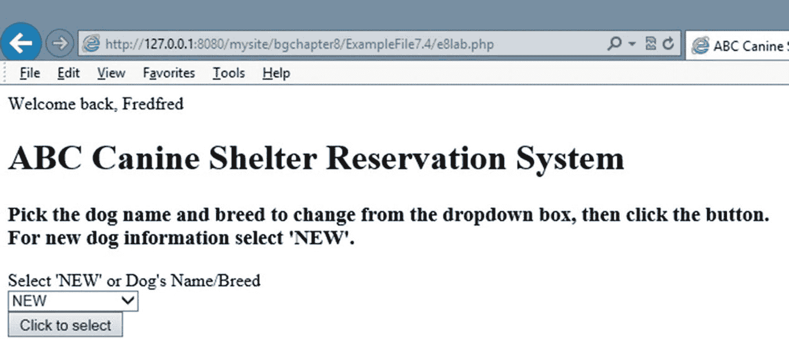
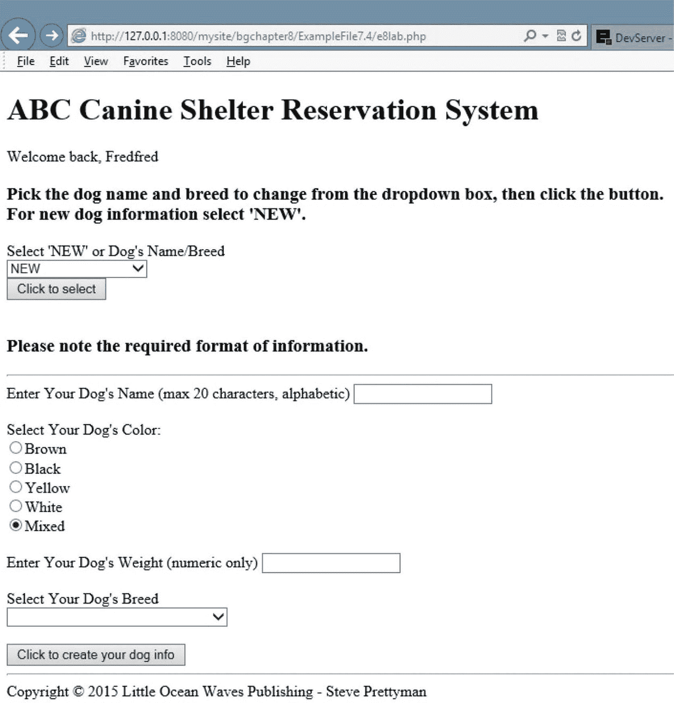
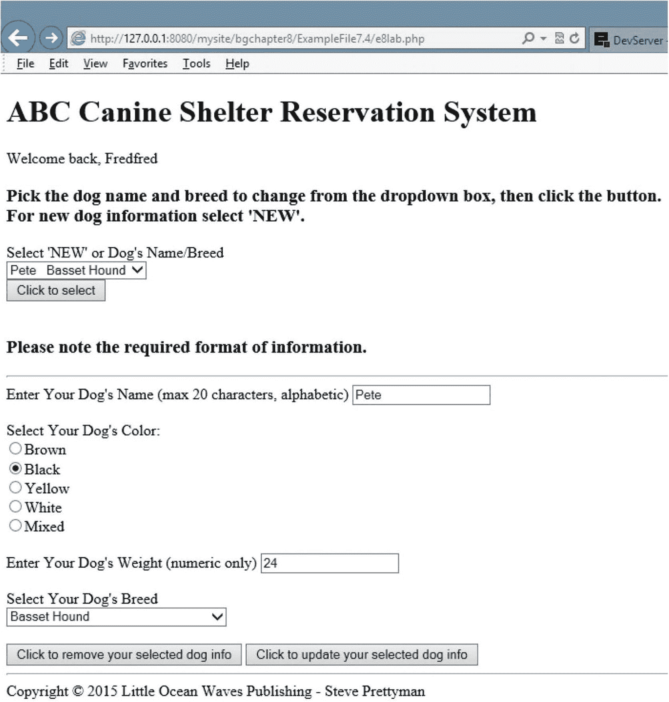
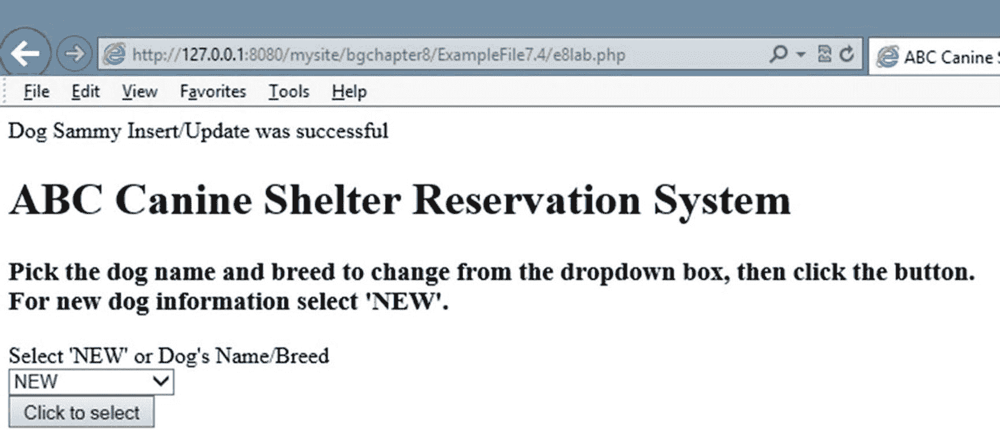
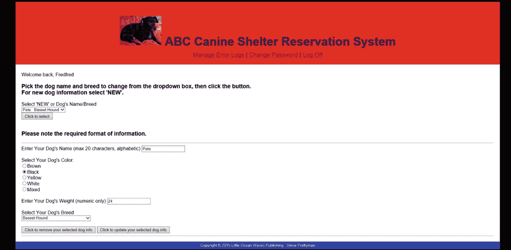
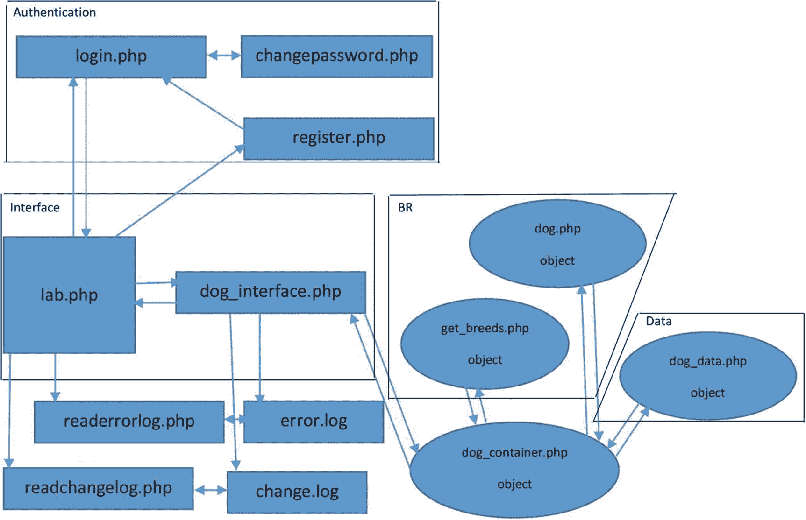

# 8. 身份验证

*（致 Lisa）你拥有可以走得很远的智慧和才华，当你做到的时候，我会在那里向你借钱。*

—巴特·辛普森

## 本章目标/学生学习成果

完成本章后，学生将能够：

*   定义会话并解释它们如何用于身份验证

*   创建一个对用户登录进行身份验证的 PHP 程序

*   创建一个注册用户的 PHP 程序

*   创建一个允许用户更改密码的 PHP 程序

*   创建一个记录无效登录尝试的 PHP 程序

*   创建一个使用当前密码哈希技术的 PHP 程序

### 验证与会话

任何关于安全性的讨论都离不开用户 ID/密码认证。当前版本的 PHP 包含许多帮助开发者验证用户的技术。本章将研究其中一种较为简单的方法。

由于登录凭证需要即时验证的特性，认证过程直接访问数据源进行验证（不经过业务逻辑层）。因此，认证过程被视为一个独立的层级，置于应用程序之上以提供访问权限。如您所见，界面层程序只需稍作修改即可限制访问，大部分编码工作都集中在认证层。

除了认证之外，登录过程中还可以确定访问级别。并非所有用户都需要对应用程序拥有完全访问权限。有些用户可能只需要读取权限，有些可能只需要对自己相关的信息具有写入权限，而有些用户（管理员）则需要对整个应用程序拥有完全访问权限。应用程序的每个部分都需要能够确定正确的访问级别，而无需向用户索取额外信息（超出最初登录应用程序时的信息）。

一个登录流程必须允许用户验证应用程序的所有部分。应用程序的每个部分都需要访问由认证层设置的通用属性（如用户 ID 和密码），以验证有效访问和有效访问级别。PHP 提供了一种能力，通过声明*会话*，将应用程序的信息存储在服务器内存中。会话被认为包含用户与应用程序的完整交互过程（例如，将资金从储蓄账户转移到支票账户的完整流程）。会话可以在用户登录应用程序时立即建立，在用户注销系统（或应用程序超时或关闭）后关闭。会话关闭时，服务器内存中存储的所有属性都会被垃圾回收器清除。

会话处于活动状态时，属性可以在整个应用程序中存储和共享。通过这种方式，用户 ID 和密码可以存储在会话属性中。应用程序的每个部分都可以通过检查`userid`和`password`属性中是否有值来验证用户是否已登录。

在查看登录认证流程之前，我们先来了解如何判断用户是否已登录系统。本章的示例不包括安全访问级别的验证，但确定这些级别的过程会使用与示例中类似的代码。

*   *编程提示—`session_start`方法调用必须是代码顶部的第一条语句。`<?php`标签和`session_start`之间不能有任何空格或代码。`session_start`方法会生成一个 HTML 头，如果在方法调用之前存在任何代码，该头将无法正确形成。*

```php
<?php
session_start();
if (!isset($_SESSION['username']) || !isset($_SESSION['password'])) {
echo "<a href='login.php'>Login</a> | <a href='register.php'>Create an account</a>";
}
else {
echo "Welcome back, " . $_SESSION['username'] . "";
}
?>
```

界面层（用户可访问）中的每个程序都应包含类似上述示例的代码。在此示例中，`session_start`方法告知操作系统该程序是现有会话的一部分（该会话在认证层中声明）。系统使用唯一生成的 ID 来标识每个会话。只要用户（或系统）未关闭会话，会话 ID 就会附加到用户调用的任何包含`session_start`方法的程序上。这使得程序能够访问与当前会话相关的所有属性。

PHP 的`isset`方法（在`if`语句中）可以判断`username`和`password`属性中是否存在值。如果值不存在，则表明用户尚未通过身份认证。会话属性通过`$_SESSION`来获取（和设置）。在上一个示例中，如果任何一个属性未设置，系统会向用户提供登录页面（`login.php`）或注册页面（`register.php`）的链接。如果两个属性都已设置，则会欢迎用户进入系统。用户别无选择，只能登录后才能访问该程序。

```php
<?php
session_start();
if (!isset($_SESSION['username']) || !isset($_SESSION['password'])) {
echo "<a href='login.php'>Login</a> | <a href='register.php'>Create an account</a>";
echo "</nav>";
}
else
{
echo "Welcome back, " . $_SESSION['username'] . "";
?>

<h1>Dog Object</h1>
<h2>Dog Object Creator</h2>
<p>Please complete ALL fields. Please note the required format of information.</p>
<form>
<p>Enter Your Dog's Name (max 20 characters, alphabetic) <input type='text' name='dog_name'></p>
<p>Select Your Dog's Color:
<select name='dog_color'>
<option value='Brown'>Brown</option>
<option value='Black'>Black</option>
<option value='Yellow'>Yellow</option>
<option value='White'>White</option>
<option value='Mixed'>Mixed</option>
</select>
</p>
<p>Enter Your Dog's Weight (numeric only) <input type='text' name='dog_weight'></p>
<p><input type='button' value='Create Your Dog' onclick='AjaxRequest("e5dog_interface.php");'></p>
<p>Select Your Dog's Breed</p>
</form>

<?php
}
?>
```

**示例 8-1** — 包含用户 ID/密码验证的`lab.php`文件

在示例 8-1 中，验证代码放在程序的顶部。`else`语句必须包含用户登录系统后需要执行的所有代码。由于该程序的代码是 HTML（和 CSS）代码，因此`if`语句必须包裹在现有代码周围。`else`语句的右花括号移动到了代码的底部（在所有 HTML 标签之后）。PHP 允许您根据需要多次关闭 PHP 代码（通过`?>`）并重新打开 PHP 代码（通过`<?php`）。在此示例中，PHP 代码在程序顶部（在`else`语句中）右花括号之前关闭。然后，在代码底部重新打开 PHP 代码，以包含一个单独的右花括号，用于闭合`else`语句。这样，`else`语句就包裹了所有现有代码。用户现在只有在登录的情况下才能访问此部分代码。

由于`lab`程序中现在包含 PHP 代码，文件后缀必须从`.html`更改为`.php`。否则服务器将不会执行 PHP 代码。

现在，我们来看看如何通过创建登录程序来填充会话属性。首先，我们来看一下用于向用户请求信息的 HTML 代码。

```html
<form action="login.php" method="post">
Username: <input type="text" name="username" pattern=".{8,}" title="Eight or more characters">
Password: <input type="password" name="password" pattern="(?=.*\d)(?=.*[a-z])(?=.*[A-Z]).{8,}" title="Must contain at least one number and one uppercase and lowercase letter, and at least 8 or more characters">
<input type="submit" value="Login">
</form>
```

HTML5 没有包含最小长度参数。但是，可以使用`pattern`参数（配合正则表达式）来设定最小长度。在上一个示例的`username`标签中，模式`".{8,}"`要求用户至少输入八个字符。为了密码安全，需要更复杂的模式。在密码示例中，除了最少八个字符的要求外，还要求至少包含一个数字（`?=.*\d`）、一个大写字母（`?=.*[A-Z]`）和一个小写字母（`?=.*[a-z]`）。


### 安全与性能
提供的 HTML 过滤用于告知用户可能存在的输入错误。在登录过程中，您不是在存储信息，而是在将信息与已存储的信息进行比较。您无需担心任何潜在有害信息被传递到文本框中。任何有害信息都不会与已存储的有效信息匹配。用户将收到无效的用户 ID/密码消息。

```php
// validate process not shown
$_SESSION['username'] = $_POST['username'];
$_SESSION['password'] = $_POST['password'];
// Redirect the user to the home page
header("Location: http://www.asite.com/lab.php");
```

假设我们已经将输入的信息与有效的用户 ID 和密码列表进行了验证（我们很快会探讨这一过程），那么我们可以将有效的用户 ID 和密码信息存入会话变量。之后，可以使用 PHP 的`header`方法将应用程序重定向到下一个要执行的程序（`lab.php`）。只要`lab.php`包含了`session_start`方法（如前所示），它就能访问这些会话变量。

```
用户名：
密码：
```

整合这些部分需要一个`if`语句来判断用户是否已输入用户 ID 和密码。如果用户尚未输入，则显示用于请求输入的 HTML 代码。如果信息已经输入（并且通过所示的 HTML5 模式表达式验证为有效），则执行语句的`else`部分（将值存入会话变量并调用`lab.php`程序）。这为我们提供了接受用户 ID 和密码、验证其存在性、并在验证通过后调用接口层程序的基本框架。当然，在调用程序之前，我们需要对用户 ID 和密码进行身份验证。

如果用户未输入用户 ID/密码或输入的并非有效用户 ID/密码，可能会产生未经授权的头部消息。这将自动导致系统请求用户输入用户 ID/密码。这种技术相当直接。然而，过去曾有报告称某些浏览器无法正常使用此技术。此外，自行设计技术可以让您制作的登录屏幕与网站其他部分保持一致的风格。

```php
header('WWW-Authenticate: Basic realm="ABC Canine"');
header('HTTP/1.0 401 Unauthorized');
```

关于验证用户 ID 和密码的其他方法的更多信息，请访问 [www.php.net/manual/en/features.http-auth.php](http://www.php.net/manual/en/features.http-auth.php)。

```php
$valid_useridpasswords = array("sjohnson" => " working");
$valid_userids = array_keys($valid_useridpasswords);
$userid = $_SESSION['username'];
$password = $_SESSION['password'];
$valid = (in_array($userid, $valid_userids)) && ($password == $valid_useridpasswords[$userid]);
If($valid) { header("Location: http://www.asite.com/lab.php");}
```

有几种方法可以对用户 ID 和密码进行身份验证。如果您创建的系统不需要用户 ID 和密码进行更改，您可以使用数组。在前面的例子中，`$valid_useridpasswords`关联数组包含了有效用户 ID 和密码的组合。PHP 方法`array_keys`将所有键（在此例中为用户 ID）放入一个单独的数组（`$valid_userids`）中。在会话变量被存入`$userid`和`$password`之后，使用 PHP 的`in_array`方法来判断用户 ID 和密码的组合是否正确。`in_array`用于判断用户 ID 是否存在于数组中。然后，使用用户 ID 作为下标从`valid_useridpasswords`数组中取出密码，并与`$password`中的值进行比较。如果用户 ID 存在且密码相同，则一切有效。`$valid`将为`TRUE`。如果其中任何一个（或两者）无效，`$valid`将为`FALSE`。如果`$valid`为`TRUE`，应用程序将重定向到`lab.php`程序。

从技术上讲，会话中的属性是受保护的，无法从会话外部进行任何访问。然而，过去曾有报道称黑客程序突破了这种安全性并访问了会话信息。在此例中，如果用户 ID 和密码存储在会话变量中并通过互联网传递给另一个程序，黑客可能获取到这些信息。

如果用户 ID 和密码存储在外部文件或数据库中，这些信息也会在程序外部传输。一旦这些信息驻留在文件或数据库中，程序将不再能控制它们的安全性。这可能让黑客有机会访问这些信息。如前所述，安全性需要程序员、数据管理员和网络管理员共同努力。

通常的做法是对密码进行哈希处理，以降低黑客发现身份验证信息（或任何其他安全信息）的机会。自 PHP 5.5 起，可以使用`password_hash`方法来保护密码安全。

编程注意事项——在存储密码的哈希版本时应谨慎。哈希结果的大小会随着新哈希版本的推出而增加。255 个字符的大小很可能在多年内都足够使用。此哈希所需的毫秒数会随着加密的大小和类型而增加。高级程序员可能希望在自己的服务器上测试时间成本。

有关哈希处理的更多信息，请访问 [www.php.net/manual/en/function.password-hash.php](http://www.php.net/manual/en/function.password-hash.php)。

编程注意事项——您不能简单地将由 PHP 的`password_hash`方法创建的哈希密码进行直接比较。生成的哈希包含加密类型和哈希后的密码。自 PHP 7.0.0 起，此方法使用默认的盐值设置，并且不允许其他盐值选项。

您只需替换示例中的一行代码即可验证密码。您可以将

```php
$valid = ((in_array($userid, $valid_userids)) && ($password == $valid_useridpasswords[$userid]));
```

替换为

```php
$valid =( (in_array($userid, $valid_userids)) && (password_verify($password,
$valid_useridpasswords[$userid]));
```

如果您将哈希后的密码放入`$valid_useridpasswords`数组中，则验证技术无需任何其他更改。PHP 的`password_verify`方法将对用户提供的密码进行哈希处理，并与现有密码进行比较。如果匹配，则返回`TRUE`。

当使用 XML 或 JSON 文件时，可以使用与第 7 章中`dogdata.php`程序构造器相同的逻辑来检索有效的用户 ID 和密码信息。唯一需要修改的是确定用户 ID 和密码文件位置的`if`语句，以及构造器中的最后一行，将生成的数组放入`$valid_useridpasswords`而非`dogs_array`。

```
Fredfred
$2y$10$VosI32FejL.bOMaCjGbBp.Jre6Ipa.tLYQrVqj9kiVpef5zZ25qQK

Petepete
$2y$10$FdbXxIVXmVOHtaBNxB8vzupRBJFCqUyOTJXrlpNdrL0HKQ/U.jFHO
```

假设 XML 的格式与狗数据 XML 文件（如前所示）类似，则可以使用类似的逻辑来检索信息。

```php
$valid_useridpasswords = json_decode($json,TRUE);
$userid = $_POST['username'];
$password = $_POST['password'];
foreach($valid_useridpasswords as $users)
{
foreach($users as $user)
{
$hash = $user['password'];
if((in_array($userid, $user)) && (password_verify($password,$hash)))
{
$_SESSION['username'] = $userid;
$_SESSION['password'] = $hash;
header("Location: lab.php");
}
}
}
```


使用`json_decode`方法创建的数组与从`dog_data` XML 文件创建的数组格式类似。它需要两个`foreach`循环，一个用于遍历“users”数组，另一个用于遍历“user”数组。然后可以使用`in_array`方法判断用户 ID 是否存在于 user 数组中。如果存在，则使用 PHP 方法`password_verify`将密码与哈希密码进行比较。此方法使用哈希密码的第一部分来检索关于哈希技术和盐值的信息。盐值是一个自动生成的值，用于生成哈希密码。如果密码匹配，则将用户 ID 和哈希密码（`$hash`）保存为会话变量。然后调用主程序（参见示例 8-1）。

> **注意**：在 PHP 5.5 中，可以调整盐值。在 PHP 7 中，此选项已被弃用，因为它被认为是不必要的系统资源使用。

```
load( 'e7dog_applications.xml' );
$searchNode = $xmlDoc->getElementsByTagName( "type" );
foreach( $searchNode as $searchNode )
{
$valueID = $searchNode->getAttribute('ID');
if($valueID == "UIDPASS")
// changed value to UIDPASS
{
$xmlLocation =
$searchNode->getElementsByTagName( "location" );
// change $this->dog_data_xml to dog_data_xml
$dog_data_xml =
$xmlLocation->item(0)->nodeValue;
break;
}
}
}
else
{
throw new Exception("Dog applications xml file missing or corrupt");
}
$xmlfile = file_get_contents($dog_data_xml);
$xmlstring = simplexml_load_string($xmlfile);
if ($xmlstring === false) {
$errorString = "Failed loading XML: ";
foreach(libxml:get_errors() as $error) {
$errorString .= $error->message . " " ;  }
throw new Exception($errorString); }
$json = json_encode($xmlstring);
// changed array name to $valid_useridpasswords
$valid_useridpasswords = json_decode($json,TRUE);
// ...... code to verify userid and password ....
$userid = $_POST['username'];
$password = $_POST['password'];
foreach($valid_useridpasswords as $users) {
foreach($users as $user) {
$hash = $user['password'];
if((in_array($userid, $user)) && (password_verify($password,$hash))) {
$_SESSION['username'] = $userid;
$_SESSION['password'] = $password;
$login_string = date('mdYhis') .
" | Login | " . $userid . "\n";
error_log($login_string,3,$user_log_file);
header("Location: e7lab.php");
} }  } }
}
catch(Exception $e)
{
echo $e->getMessage();
}
// code below executes if the user has not logged in or if it is an invalid login.
?>
```

用户 ID 必须包含八个或更多字符。
密码必须包含至少一个数字、一个大写字母和一个小写字母，并且总长度至少为 8 个字符。
用户名： 
密码：

示例 8-2
包含 XML 用户 ID/密码验证的 login.php 文件

除了提到的代码外，示例 8-2 还包含一个`try catch`块来捕获抛出的异常，并调用用户日志文件记录成功登录系统的信息。

### JSON 数据

要使用 JSON 数据代替 XML 数据，示例 8-2 只需包含第 7 章所示的变化。`userid`和`password`的 JSON 数据也需要按如下格式进行格式化。

```
{"user":
[
{"userid":"Fredfred","password":"$2y$10$VosI32FejL.bOMaCjGbBp.Jre6Ipa.tLYQrVqj9kiVpef5zZ25qQK"},
{"userid":"Petepete","password":"$2y$10$FdbXxIVXmVOHtaBNxB8vzupRBJFCqUyOTJXrlpNdrL0HKQ\/U.jFHO"}
] }
```

### MySQL 数据

更常见且通常更安全的方式是在数据库中存储用户 ID 和密码信息。数据库可以使用用户 ID 和密码进行保护，还可以包含对信息的访问级别（只读、读写）。即使有这种级别的安全性，密码仍然应该被加密。

需要对第 7 章中的 MySQL 构造器示例进行极少的改动即可完成身份验证。

```
$mysqli =mysqli_connect($server, $db_username, $db_password, $database);
if (mysqli_connect_errno())
{
throw new Exception("MySQL connection error: " . mysqli_connect_error());
}
$sql="SELECT * FROM Users"; // Change the table used
$result=mysqli_query($con,$sql);
If($result===null)
{
throw new Exception("No records retrieved from Database");
}
$valid_useridpasswords = mysqli_fetch_assoc($result); // change the array used
mysqli_free_result($result);
mysqli_close($con);
```

此示例代码将从数据库的表（`Users`）中提取信息，并将其放入关联数组（通过`mysqli_fetch_assoc`方法）。如果表中的字段与 XML 文件中的标签名称（`userid`和`password`）相同，则构建的关联数组将类似于使用示例 8-2 中的代码构建的数组。所有之前的代码`"// ...... code to verify userid and password ...."`都被此处展示的代码替换。这些语句下方的代码无需调整。

### 动手实践

1.  创建一个转换程序，使用 PHP 方法`password_hash`（参见[`www.php.net/manual/en/function.password-hash.php`](http://www.php.net/manual/en/function.password-hash.php)）来确定密码的哈希版本。

2.  下载本节中的示例文件。向`uidpass`文件中添加可用于访问权限（只读或读写）和级别（用户或管理员）的 XML 记录。测试以验证新的`uidpass`文件能正确与现有代码协同工作。进行任何必要的代码更改以使其兼容。

3.  下载本节中的示例文件。向程序中添加代码，将使用错误密码登录的尝试次数限制为三次。记录任何无效的登录尝试（三次尝试后），并将其写入用户日志。

### 注册

除了授权用户登录外，大多数系统还允许用户自行创建用户 ID 和密码。默认情况下，自行创建的 ID 会被赋予最低优先级。管理员此后可以登录并提升该 ID 的权限等级。部分网站允许未注册用户（未登录的用户）。未注册用户应仅被授予对非特权信息的只读访问权限。未注册用户的安全风险要大得多，因为在发生安全漏洞时很难确定其身份。PHP 提供了使用`$_SERVER['REMOTE_ADDR']`获取用户 IP 地址的能力。这可能会提供一定的追踪用户能力。然而，许多用户使用免费的公共接入点，这些接入点会生成随机 IP 地址。如果使用了这类接入点之一，追踪他们将变得更加困难。


此外，为用户提供创建用户 ID 和密码的机会，使得程序能够收集额外信息（例如姓名和电子邮件），这些信息有助于安全防护，并能方便地向网站用户推广该网站。对于已经熟悉该网站的客户，销售网站所提供的产品或服务的成功率会高得多。为了鼓励用户创建用户 ID 和密码，网站应为他们提供一些访客无法获得的益处（例如访问服务台）。

`registration.php` 页面在许多方面的工作方式与登录页面类似。但是，任何输入的有效用户 ID 或密码都将被存储（而非进行比较）。由于应用程序将更新有效 ID 列表，因此应用程序必须在更新之前验证信息。你可以使用之前在验证 `dog` 类属性时使用过的一些技术。首先，当用户输入用户 ID 和密码（必须通过之前展示的 HTML5 验证）时，这些信息会被传递到一个 PHP 程序。即使它被认为在会话中是安全的，但信息会从 HTML 表单传输到 PHP 代码。应该再次对信息进行验证。

```php
if ((isset($_POST['username'])) || (isset($_POST['password'])))
{
$userid = $_POST['username'];
$password = $_POST['password'];
if (!(preg_match("/^.*(?=.{8,})(?=.*\d)(?=.*[a-z])(?=.*[A-Z]).*$/", $password)) || (!(strlen($userid) >= 8)))
{
throw new Exception("Invalid Userid and/or Password Format");
}
else
```

这个 `if` 语句使用 PHP 函数 `preg_match` 来判断密码格式是否包含一个大写字母、一个小写字母、一个数字，并且至少八个字符。注意，正则表达式格式与 HTML5 代码中使用的格式相同（表达式的顺序有所改变，但包含的信息相同）。PHP 的 `strlen` 方法还会检查用户 ID，以确定其包含八个或更多字符。

如果任一验证未通过，程序会抛出一个 `Exception`。如果两者都通过，则执行 `else` 部分的语句来对密码进行哈希处理并存储信息。

```php
$password = password_hash($password, PASSWORD_DEFAULT);
$input = file_get_contents($dog_data_xml);
$find = "";
$newupstring = "\n" . $userid . "\n" . $password;
$newupstring .= "\n\n";
$find = preg_quote($find,'/');
$output = preg_replace("/^$find(\n|\$)/m","",$input);
$output = $output . $newupstring;
file_put_contents($dog_data_xml,$output);
$login_string = date('mdYhis') . " | New Userid | " . $userid . "\n";
error_log($login_string,3,$user_log_file);
header("Location: e7login.php");
```

在将密码插入 XML 文件之前，必须对其进行加密（哈希处理）。PHP 方法 `password_hash` 会将密码转换为前面展示过的格式。`file_get_contents` 将 XML 用户 ID/密码文件的内容转储到 `$input` 中。`preg_quote` 会在 `$find` 中的任何特殊字符（例如 `/users` 中包含的反斜杠）旁边放置反斜杠，以防止 PHP 将这些字符解释为正则表达式的一部分。`preg_replace` 将使用正则表达式 `/^$find(\n|\$)/m` 来搜索带有或不带有末尾 `\n` 的 `</users>`。由于文件中的记录由换行符界定，这将确保你能找到位于文件行末或文件行内的 `</users>`。当在文件（文件内容位于 `$input` 中）中找到 `</users>` 时，它会被替换为 `""`（空字符串）。`preg_replace` 也会尝试在第二参数（当前 `""` 所在位置）中存在的任何字符串中放置反斜杠。如果将 `$newupstring` 放入该参数，则加密后的密码会被 `preg_replace` 修改。即使输入的用户输入正确，这也会导致密码验证失败。因此，`$newupstring`（新用户信息）的内容会被追加到 `$output` 中。然后使用 `$output` 字符串替换用户 ID/密码 XML 文件的所有内容。一旦信息成功保存，用户日志会被更新以记录新用户 ID 的创建，并且用户会被重定向到登录屏幕，以便使用新的用户 ID 和密码登录应用程序。

或者，也可以使用之前将文件加载到关联数组、更新关联数组、然后将关联数组加载回 XML 文件的过程。但是，这需要更多代码，且没有必要，因为该过程在应用程序中只使用一次。该程序不会多次尝试用同一个用户更新用户 ID 和密码文件。

```php
= 8)))
{
throw new Exception("Invalid Userid and/or Password Format");
}
else
{
Libxml_use_internal_errors(true);
$xmlDoc = new DOMDocument();
if ( file_exists("e7dog_applications.xml") )
{
$xmlDoc->load( 'e7dog_applications.xml' );
$searchNode = $xmlDoc->getElementsByTagName( "type" );
foreach( $searchNode as $searchNode )
{
$valueID = $searchNode->getAttribute('ID');
if($valueID == "UIDPASS")
{
$xmlLocation = $searchNode->getElementsByTagName ( "location" );
$dog_data_xml =
$xmlLocation->item(0)->nodeValue;
break;
}
}
}
else
{
throw new Exception("Dog applications xml file missing or corrupt");
}
}
$password = password_hash($password, PASSWORD_DEFAULT);
$input = file_get_contents($dog_data_xml);
$find = "";
$newupstring = "\n" . $userid . "\n" . $password . "\n\n";
$find_q = preg_quote($find,'/');
$output = preg_replace("/^$find_q(\n|\$)/m",$newupstring,$input);
file_put_contents($dog_data_xml,$output);
$login_string = date('mdYhis') . " | New Userid | " . $userid . "\n";
error_log($login_string,3,$user_log_file);
header("Location: e7login.php");
} } }
catch(Exception $e) { echo $e->getMessage(); }
?>
```

用户 ID 必须包含八个或更多字符。
密码必须包含至少一个数字、一个大写字母和一个小写字母，并且总共至少 8 个字符。
用户名：
密码：

**示例 8-3**
`registration.php` 文件

### JSON 数据

JSON 数据只需要进行少许修改。

```json
{"user":

[

{"userid":"Fredfred","password":"$2y$10$VosI32FejL.bOMaCjGbBp.Jre6Ipa.tLYQrVqj9kiVpef5zZ25qQK"},

{"userid":"Petepete","password":"$2y$10$FdbXxIVXmVOHtaBNxB8vzupRBJFCqUyOTJXrlpNdrL0HKQ\/.uJ.FHO"}

] }
```

数据以组合 `]}` 结尾，该组合不会出现在其他地方。`$find` 可以设置为此值（`$set = "]}";`）。`$newupstring` 的值也可以改为：

```php
$newupstring = ',{"userid":"' . $userid . '","password":"' . $password . '"}\n]}';
```

这两项修改（连同之前的修改）将会更新一个 JSON 文件，其中包含新的用户 ID/密码组合。

### MySQL 数据

MySQL 还需要进行一些额外的修改。在使用 `password_hash` 对密码进行哈希处理后，可以打开数据库、插入记录，然后关闭数据库。

```php
$password = password_hash($password, PASSWORD_DEFAULT);

$mysqli =mysqli_connect($server, $db_username, $db_password, $database);

if (mysqli_connect_errno())

{

throw new Exception("MySQL connection error: " . mysqli_connect_error());

}

$sql="INSERT INTO Users (userid, password) VALUES('" . $userid . "','" . $password . "');";

$result=mysqli_query($con,$sql);

If($result===null)

{

throw new Exception("Userid/Password not added to Database");

}

mysqli_close($con);

$login_string = date('mdYhis') . " | New Userid | " . $userid . "\n";

error_log($login_string,3,$user_log_file);

header("Location: e7login.php");
```

### 登录

除了为用户提供创建自己用户 ID 和密码的功能外，应用程序还应提供修改密码的功能。设置密码有效期以限制密码使用时间，对于提升安全性非常有益。每次用户登录时，都可以对该值进行比较。如果当前日期比保存的日期早超过 `xx` 天，则要求用户更改密码。

由于密码嗅探程序会尝试猜测密码，因此限制使用正确用户 ID 和密码组合的登录尝试次数也是一个好主意。这将降低密码嗅探程序生成正确组合的可能性。重要的是，在达到最大尝试次数后，在一定时间内不允许成功登录。尽管这会让用户感到沮丧，但它降低了密码嗅探程序发现正确组合的机会。如果程序不知道尝试已超时，即使它在 `timeout` 期间猜对了正确的组合，它也会收到无效的用户 ID/密码消息。这些调整需要为用户 ID/密码文件（或数据库）添加额外的字段。

```
Fredfred

$2y$10$VosI32FejL.bOMaCjGbBp.Jre6Ipa.tLYQrVqj9kiVpef5zZ25qQK

2015-09-03

Poppoppop

$2y$10$C1jXhTl0myamuLKhZxK5m.4X4TVcdeFbeLSBIA7l4fx6tUnC8vrg6

2015-06-04
```

`$newupstring` 可以在 `registration.php` 程序（示例 8-3）中进行调整，以添加身份验证字段。

```php
$newupstring = "\n" . $userid . "\n" . $hashed_password . "\n";

$newupstring .= "" . date('Y-m-d', strtotime('+30 days')) . "\n";

$newupstring .= "0\n" . date('mdYhis') . "\n";

$newupstring .= "" . date('mdYhis') . "\n\n";
```

PHP 方法 `strtotime` 将解析任何标准的日期和时间格式，并尝试将其转换为 UNIX 日期时间格式（PHP 使用的格式）。在此示例中，该方法提供了在当前日期上增加 30 天的能力，这反过来将用于判断密码是否已过期。或者，在批量创建用户 ID 时（例如在课程管理系统中填充学生 ID），可以将一个已过期的日期（例如当前日期的前一天）放入此字段。这将强制用户在首次登录系统时更改密码。过期日期存储在 `datestamp` 中，供用户登录系统时使用。示例中的 `attempts` 标签将记录用户尝试使用错误的用户 ID 密码组合登录的次数（在成功登录时重置为零）。如果 `lastattempt` 中的日期和时间在五分钟内，并且 `attempts` 的值为 `3` 或更大，则用户必须等到距离上次尝试登录超过五分钟才能再次尝试。与大多数登录系统一样，即使用户使用有效信息登录，距离上次无效登录也必须至少过去五分钟。上次成功登录的日期和时间也记录在 `validattempt` 标签中。虽然在本示例中这不用于身份验证，但记录所有成功登录非常重要。

为了尽可能保持程序主代码的简洁，查找用户 ID 和密码文件位置的代码已被移至 `retrieve_useridpasswordfile` 方法。将数据保存到 XML 文件的代码也已移至 `saveupfile` 方法。这些方法的代码没有发生任何变化（除了如前所述新增了更多 XML 标签）。

```php
';

$xmlstring .= "\n\n";

foreach($valid_useridpasswords as $users)

{

foreach($users as $user)

{

$xmlstring .="\n" . $user['userid'] . "\n";

$xmlstring .="" . $user['password'] . "\n";

$xmlstring .="" . $user['datestamp'] . "\n";

$xmlstring .= "" . $user['attempts'] . "\n";

$xmlstring .= "" . $user['lastattempt'] . "\n";

$xmlstring .= "" . $user['validattempt'] . "\n\n";

}

}

$xmlstring .= "\n";

$xmlstring .= "\n";

$new_valid_data_file = preg_replace('/[0-9]+/', '', $dog_data_xml);

// 移除之前的日期和时间（如果存在）

$oldxmldata = date('mdYhis') . $new_valid_data_file;

if (!rename($dog_data_xml, $oldxmldata))

{

throw new Exception("备份文件 $oldxmldata 无法创建。");

}

file_put_contents($new_valid_data_file,$xmlstring);

}

function retrieve_useridpasswordfile()

{

$xmlDoc = new DOMDocument();

if ( file_exists("e7dog_applications.xml") )

{

$xmlDoc->load( 'e7dog_applications.xml' );

$searchNode = $xmlDoc->getElementsByTagName( "type" );

foreach( $searchNode as $searchNode )

{

$valueID = $searchNode->getAttribute('ID');

if($valueID == "UIDPASS")

{

$xmlLocation =

$searchNode->getElementsByTagName(“location" );

$dog_data_xml =

$xmlLocation->item(0)->nodeValue;

break;

}

}

}

else

{

throw new Exception("Dog 应用程序 xml 文件缺失或损坏");

}

return $dog_data_xml;

}

try {

if ((isset($_POST['username'])) && (isset($_POST['password'])))

{

libxml:use_internal_errors(true);

$dog_data_xml = retrieve_useridpasswordfile();

$xmlfile = file_get_contents($dog_data_xml);

$xmlstring = simplexml_load_string($xmlfile);

if ($xmlstring === false) {

$errorString = "加载 XML 失败： ";

foreach(libxml_get_errors() as $error) {

$errorString .= $error->message . " " ;  }

throw new Exception($errorString); }
```

$json = json_encode($xmlstring);

$valid_useridpasswords = json_decode($json,TRUE);

$userid = $_POST['username'];

$password = $_POST['password'];

$I = 0;

$passed = FALSE;

foreach($valid_useridpasswords as $users)

{

foreach($users as $user)

{

if (in_array($userid, $user)) {

$hash = $user['password'];

$currenttime = strtotime(date('Y-m-d'));

$stamptime = strtotime($user['datestamp']);

if ($currenttime > $stamptime) {

// 密码已过期，强制修改密码

header("Location: e7changepassword.php");

}

if (($user['attempts'] = $user['lastattempt']))

{

$hash = $user['password'];

if(password_verify($password,$hash))

{

$passed = TRUE;

$valid_useridpasswords['user'][$I]['validattempt'] = date('mdYhis');

// 显示上次成功登录时间

$valid_useridpasswords['user'][$I]['attempts'] = 0;

// 成功登录后重置为 0

$_SESSION['username'] = $userid;

$_SESSION['password'] = $password;

saveupfile($dog_data_xml,$valid_useridpasswords);

// 在 header 调用前保存更改

$login_string = date('mdYhis') . " | 登录 | " . $userid . "\n";

error_log($login_string,3,$user_log_file);

header("Location: e7lab.php");

}

else {

$valid_useridpasswords['user'][$I]['lastattempt'] = date('mdYhis');

// 上次尝试登录时间

} } }

$I++;

} }

// 密码/用户 ID 无效或尝试次数过多时跳转至此

if (!$passed) {

$I--;

echo "无效的用户 ID/密码";

$valid_useridpasswords['user'][$I]['attempts'] = $user['attempts'] + 1;

// 尝试次数加 1

// 如果不成功，必须保存这些值

saveupfile($dog_data_xml,$valid_useridpasswords);

} } }

catch(Exception $e)

{ echo $e->getMessage(); }

?>

```

```php
form method="post" action="">

用户 ID 必须包含 8 个或更多字符。

密码必须包含至少一个数字、一个大写字母、一个小写字母，且总长度至少为 8 个字符。

用户名： 

密码：
```

#### 示例 8-4

具有密码超时和三次登录超时机制的 `login.php` 文件

在示例 8-4 中，`if` 语句将当前日期/时间与 `datestamp` 中保存的日期/时间进行比较。如果当前日期/时间比 `datestamp` 中的值晚 30 天以上，则会调用密码修改程序（`changepassword`）。下一个 `if` 语句用于判断用户的无效登录尝试次数是否少于三次，并且距离上次尝试是否已超过五分钟。如果是这种情况，PHP 方法 `password_verify` 会将用户输入的密码与 XML 文件中包含的密码进行比较。如果密码匹配，`validattempts` 值将更新为当前日期/时间，尝试次数将重置为 0，用户 ID 和密码将保存在会话变量中。然后保存对 XML 文件的更改。此外，用户登录信息会记录在日志文件中。如果密码不匹配，`lastattempt` 值将更新为当前日期/时间。

由于有效的登录或密码过期会使应用程序通过 PHP 的 `header` 方法重定向到不同的程序，因此仅当用户 ID 和密码组合无效，或在五分钟内尝试次数过多时，程序才会执行到最后一个 `if` 语句。此时，会显示“无效用户 ID/密码”消息，并且尝试次数增加 1。然后保存对 XML 文件的更改。程序随后将继续显示用户 ID 和密码输入框，并附上“无效的用户 ID/密码”消息。如前所述，即使是有效的用户 ID/密码组合，如果在五分钟内被输入，或者出现三次或以上的无效输入（连续），也会被拒绝。

#### JSON 数据

JSON 数据需要做一些更改以容纳新增的字段。

```json
{"user":[

{"userid":"Fredfred","password":"$2y$10$VosI32FejL.bOMaCjGbBp.Jre6Ipa.tLYQrVqj9kiVpef5zZ25qQK","datestamp":"2015-09-03","attempts":"0","lastattempt":"08052015044229","validattempt": "08052015045431"},

{"userid":"Poppoppop","password":"$2y$10$C1jXhTl0myamuLKhZxK5m.4X4TVcdeFbeLSBIA7l4fx6tUnC8vrg6","datestamp":"2015-09-04","attempts":"2","lastattempt":"08062015011347","validattempt": "08062015113038"}

]}
```

由于新增了这些字段，`$newupstring` 也需要进行更改。如前所述，部分代码的位置也需要移至方法中。

```php
$newupstring = ',{"userid":"' . $user['userid'] . '","password":"' . $user['password'] . '","';

$newupstring .= 'datestamp":"' . $user['datestamp'] . '","attempts":"' . $user['attempts'] . "',"';

$newupstring .= 'lastattempt":"' . $user['lastattempt'] . '","validattempt":"' . $user['validattempt'] .'"';

$newupstring .= '"}\n]}';
```

#### MySQL 数据

MySQL 登录代码需要使用 `UPDATE` 语句（而不是注册代码中的 `INSERT` 语句）来更新已更改的字段。此外，应使用第 5 章中的 `filter_var` 方法，从 `userid` 字段中移除任何有害的 PHP 和 SQL 语句。这将有助于降低发生 *SQL 注入* 的几率，因为 SQL 注入可能导致 SQL 语句更改超出所需字段和记录的范围。例如，如果 `$user['userid']` 字段包含 `'*'`，则所有记录都将被更新，而不仅仅是具有有效用户 ID 的单条记录。在执行 `UPDATE` 语句之前，还可以验证用户 ID 是否存在于数据库中。这样做（假设数据库中的所有数据均有效）也能减少发生有害更改的可能性。

在以下示例中，所有可能的文件会一次性更新。或者，也可以在需要时仅更新已更改的字段。但这样做需要更多代码，且不一定更高效。此外，如果未事先验证用户 ID 是否存在于数据库中，而 `userid` 又不在数据库里，那么 SQL 语句将自动不更新任何字段。

```php
$userid = filter_var($user['userid'], FILTER_SANITIZE_STRING);

$sql ="UPDATE Users SET(datestamp='" . $user['datestamp'] . "',attempts='";

$sql .=$user['attempts'] . "',lastattempt='" . $user['lastattempt'] . "',";

$sql .="validattempt='" . $user['validattempt'] . "') WHERE userid='" . $userid . "';";
```

注意，上述`UPDATE`代码的`WHERE`语句中**没有**包含密码字段。在此示例中，当密码无效时会更新部分字段，当密码有效时会更新另一部分字段。如果将 SQL 语句拆分为多个语句（至少一个用于有效用户 ID/密码，一个用于无效用户/密码），则有效信息的`WHERE`语句可以同时包含用户 ID 和密码，而无效信息的语句可以仅包含密码。包含使用 MySQL 数据库的完整登录、注册和密码更改应用程序的示例，请参见本书网站第 8 章。

#### 更改密码

更改密码的过程需要验证当前密码，然后保存新密码。它还需要更新 XML 文件中`datestamp`标签包含的日期。程序代码与登录程序非常相似。

```php
$userid = $_POST['username'];

$npassword = $_POST['password'];

$newpassword = password_hash($npassword, PASSWORD_DEFAULT);

$password = $_POST['oldpassword'];

$datestamp = date('Y-m-d', strtotime('+30 days'));

$I = 0;

$passed = FALSE;

// First a few properties are set for the userid, new userid, and the new datestamp.

$hash = $user['password'];

if(password_verify($password,$hash))

{

$passed = TRUE;

$valid_useridpasswords['user'][$I]['password'] = $newpassword;

$valid_useridpasswords['user'][$I]['datestamp'] = $datestamp;

$valid_useridpasswords['user'][$I]['attempts'] = 0;

saveupfile($dog_data_xml,$valid_useridpasswords);

// save changes before header call

$login_string = date('mdYhis') . " | Password Changed | " . $userid . "\n";

error_log($login_string,3,$user_log_file);

header("Location: e7logina.php");

}

else

{

$valid_useridpasswords['user'][$I]['lastattempt'] = date('mdYhis');

// last attempted login

}
```

如果用户 ID 和旧密码通过正确认证，则新的`password`、`datestamp`和`attempts`属性会被修改并更新到 XML 文件中。同时，日志文件中会记录一条条目。如果密码未通过验证，则显示`"invalid userid/password"`消息。

```php
';

$xmlstring .= "\n\n";

foreach($valid_useridpasswords as $users)

{

foreach($users as $user)

{

$xmlstring .="\n" . $user['userid'] . "\n";

$xmlstring .="" . $user['password'] . "\n";

$xmlstring .="" . $user['datestamp'] . "\n";

$xmlstring .= "" . $user['attempts'] . "\n";

$xmlstring .= "" . $user['lastattempt'] . "\n";

$xmlstring .= "" . $user['validattempt'] . "\n\n";

}

}

$xmlstring .= "\n";

$new_valid_data_file = preg_replace('/[0-9]+/', '', $dog_data_xml);

// remove the previous date and time if it exists

$oldxmldata = date('mdYhis') . $new_valid_data_file;

if (!rename($dog_data_xml, $oldxmldata))        {

throw new Exception("Backup file $oldxmldata could not be created.");        }

file_put_contents($new_valid_data_file,$xmlstring); }

function retrieve_useridpasswordfile() {

$xmlDoc = new DOMDocument();

if ( file_exists("e7dog_applications.xml") )

{

$xmlDoc->load( 'e7dog_applications.xml' );

$searchNode = $xmlDoc->getElementsByTagName( "type" );

foreach( $searchNode as $searchNode )

{

$valueID = $searchNode->getAttribute('ID');

if($valueID == "UIDPASS")

{

$xmlLocation = $searchNode->getElementsByTagName( "location" );

$dog_data_xml = $xmlLocation->item(0)->nodeValue;

break;

}

}

}

return $dog_data_xml;

}

if (!(isset($_SESSION['message']))) {

// valid userid and password but password expired

echo $_SESSION['message'];

}

try {

if((isset($_POST['username'])) && (isset($_POST['oldpassword'])) && (isset($_POST['password'])) && (isset($_POST['password_confirm'])))

{

libxml:use_internal_errors(true);

$dog_data_xml = retrieve_useridpasswordfile();

$xmlfile = file_get_contents($dog_data_xml);

$xmlstring = simplexml:load_string($xmlfile);

if ($xmlstring === false) {

$errorString = "Failed loading XML: ";

foreach(libxml:get_errors() as $error) {

$errorString .= $error->message . " " ;  }

throw new Exception($errorString); }

$json = json_encode($xmlstring);

$valid_useridpasswords = json_decode($json,TRUE);

$userid = $_POST['username'];

$npassword = $_POST['password'];

$newpassword = password_hash($npassword, PASSWORD_DEFAULT);

$password = $_POST['oldpassword'];

$datestamp = date('Y-m-d', strtotime('+30 days'));

$I = 0;

$I = 0;

$passed = FALSE;

foreach($valid_useridpasswords as $users) {

foreach($users as $user) {

if (in_array($userid, $user)) {

$hash = $user['password'];

if(password_verify($password,$hash))

{

$passed = TRUE;

$valid_useridpasswords['user'][$I]['password'] = $newpassword;

$valid_useridpasswords['user'][$I]['datestamp'] = $datestamp;
```

```markdown
$valid_useridpasswords['user'][$I]['attempts'] = 0;

saveupfile($dog_data_xml, $valid_useridpasswords);

// save changes before header call

$login_string = date('mdYhis') . " | Password Changed | " . $userid . "\n";

error_log($login_string, 3, $user_log_file);

header("Location: e7login.php");

} }

$I++;

} }

// drops to here if not valid password/userid or too many attempts

if (!$passed) {

echo "Invalid Userid/Password";

} } }

catch(Exception $e) {

echo $e->getMessage();

}

?>

```

`用户名`必须包含八个或更多字符。密码必须至少包含一个数字、一个大写字母和一个小写字母，并且总长度至少为 8 个字符。
`用户名`:
`旧密码`:
`新密码`:
`确认密码`:

```

function check(input) {

if (input.value != document.getElementById('password').value) {

input.setCustomValidity('Password Must be Matching.');

} else {

// input is valid -- reset the error message

input.setCustomValidity('');

}

}
```

```
## 示例 8-5
##### `changepassword.php` 文件

除了已解释的 PHP 代码外，示例 8-5 还包含了 JavaScript 代码，用于验证新密码的格式是否正确以及新密码是否输入了两次。示例中未包含 PHP 代码中对正确用户 ID 和密码输入的验证。由于信息通过互联网从表单传输到 PHP 程序，因此也应在 PHP 程序中验证用户 ID 和密码。该编码留作本节练习。

#### JSON 数据
修改密码程序若需处理 JSON 数据，只需参考本章前文 JSON 相关章节中的指示即可。

#### MySQL 数据
`UPDATE` SQL 语句需要按照前文 MySQL 章节中其他字段的修改方式，“设置”密码属性的结构。

#### 动手实践

1.  从本书网站复制本节示例文件。调整密码修改程序，加入用于验证用户 ID、密码及新密码格式正确性的 PHP 代码。

2.  从本书网站复制本章示例文件。调整注册程序，使其在尝试插入新的用户 ID/密码组合前，先检查是否存在重复的用户 ID。提示：可使用`in_array`方法实现。若用户 ID 已存在，应向用户显示相应提示信息。

3.  从本书网站复制本节示例文件。修改必要程序，要求用户在注册时同时提供姓名、电话和邮箱。同时确保修改其他程序，以保证这些信息的有效性。

## 章节术语表

| 身份验证 | 会话 |
| --- | --- |
| `session_start` | `isset` |
| 会话属性 | `$_SESSION` |
| 验证码 | `.{8,}` |
| `?=.*\d` | `?=.*[A-Z]` |
| `?=.*[a-z]` | 标头 |
| `array_keys` | `password_hash` |
| `password_verify` | 未注册用户 |
| `$_SERVER['REMOTE_ADDR']` | 注册页面 |
| `preg_match` | `strlen` |
| `file_get_contents` | `preg_quote` |
| `preg_replace` | 密码过期 |
| 密码嗅探程序 | 限制尝试次数 |
| 超时期限 | `strtotime` |
| SQL 注入 | |

## 章节问题与项目

### 选择题

1.  身份验证具有以下哪项功能？
    1.  为应用程序提供安全性
    2.  验证用户 ID 和密码
    3.  应使用加密密码
    4.  以上所有选项

2.  会话具有以下哪项功能？
    1.  通过`session_create`方法创建
    2.  允许在程序间共享信息
    3.  不提供任何安全优势
    4.  以上所有选项

3.  注册页面具有以下哪项功能？
    1.  允许用户创建自己的用户 ID 和密码
    2.  可用于收集用户信息
    3.  应在存储密码前对其进行加密
    4.  以上所有选项

4.  验证码具有以下哪项功能？
    1.  使用`session_start`将程序附加到当前会话
    2.  验证用户是否已登录
    3.  必须仅附加到界面层的程序
    4.  以上所有选项

5.  以下哪项描述了 SQL 注入？
    1.  使用 SQL 语句更新数据库的过程
    2.  在 SQL 语句中插入变量以提高灵活性的过程
    3.  导致数据损坏
    4.  以上所有选项

### 判断题

1.  MD5 是最新且最安全的加密技术。

2.  应使用`password_hash`来创建加密密码。

3.  当用户输入正确用户 ID 和密码的尝试次数超过最大限制时，应通知用户。

4.  身份验证系统无需设置密码超时，也无需在密码过期时强制用户更改密码。

5.  可以将`preg_replace`与加密密码结合使用，以确保 PHP 不会将特殊字符解释为 PHP 命令。

### 简答题/论述题

1.  解释可用于降低密码嗅探程序发现正确用户 ID 和密码组合可能性的技术。

2.  解释会话的工作原理。包括解释会话如何通过用户 ID 和密码身份验证帮助保护应用程序安全。

3.  什么是 SQL 注入？如何避免？

4.  为什么密码需要加密？在互联网上探索并找出最新的加密版本。当前最新版本的 PHP 是否使用了最新版本的加密技术？

### 项目

1.  从第 6 章下载日志维护文件，或使用你在第 6 章自行创建的维护文件。使用本章介绍的技术，通过用户 ID 和密码身份验证来保护这些文件。

2.  下载本章的文件。更新文件和程序，以便用户可以请求找回密码。必须随机生成一个临时密码（XML 文件中的新字段）（使用`rand`函数），并通过电子邮件发送给用户。该密码应有较短的过期时间（一天或更短）。用户必须能够通过验证注册页面输入的其他信息（安全问题或其他个人信息）来请求密码。如果用户使用临时密码成功登录，系统应强制用户更改密码。

### 课程项目

1.  更新 ABC 电脑配件库存应用程序，使其包含本章所示的用户 ID 和密码身份验证功能。务必保护与该应用程序相关的所有日志维护程序。

# 9. 多功能界面

*勤奋工作从未累死人，但何必冒险呢。*

——埃德加·伯根（`http://coolfunnyquotes.com`）

## 章节目标/学生学习成果

完成本章学习后，学生将能够

*   创建一个能够执行删除、更新和插入操作的完整 PHP 应用程序
*   使用 CSS 为完成的应用程序创建专业外观
*   使用 JavaScript 接收和处理来自其他程序的数据
*   保护应用程序内需要用户 ID/密码的所有程序
*   使用 JSON 对象中的值填充 HTML 对象
*   创建一个使用当前密码加密技术的 PHP 程序

## 完整的应用程序

在本章中，我们将完成 ABC 流浪犬收容所预约系统的开发。系统的当前版本允许用户在每次添加完一只狗的信息后，必须重新登录才能添加别的狗。此外，系统也不允许用户更新或删除系统中已有的狗狗信息。我们在第 7 章（数据对象）已经完成了提供更新和删除功能所需的大部分 PHP 代码。现在，我们需要将数据对象(`dog_data`)的这一部分附加到业务规则层(`dog`)。此外，我们还需要对界面层(`dog_interface`和`lab`)进行一些修改，以便调用`update`和`delete`方法并显示结果。正如你将很快看到的，大部分所需的编码工作都将在`lab.php`文件中进行。因此，我们将从这些修改开始。

### 使用 JavaScript 处理数据

当前的 `lab.php` 文件只允许用户输入将被插入数据存储（`XML`、`JSON` 或 `MySQL`）的狗狗信息。需要修改界面，让用户能够指明他们想要完成的操作（`插入`、`更新`或`删除`）。同时，如果操作涉及更新或删除，还需要允许用户选择一只现有的狗狗。这应该能说明，我们需要一个列表框，其中填充了收容所当前所有狗狗的信息。

我们将在本章后续部分讨论所需的 PHP 修改。现在，我们先假设 `dog_interface`（接口层）将返回这些信息，这些信息是通过 `dog` 方法（业务规则层）从 `dog_data`（数据层）检索而来的。我们还将假设将创建与 `dog_breeds` 程序（第 4 章）类似的代码，以生成一个狗狗列表框。

此外，`lab.php` 需要访问所选特定狗狗的所有信息。代码需要将所有信息放入 `dog_name` 和 `dog_weight` 文本框、`dog_breeds` 列表框以及 `dog_color` 单选按钮中。我们可以通过两种方式完成此任务。一种是允许用户从列表框中选择狗狗，然后重新调用 `dog_interface` 程序，向 dog 类请求该特定狗狗的信息，dog 类再向 `dog_data` 类请求信息。然而，这需要在互联网上进行一次额外的、不必要的调用来请求信息。相反，我们可以在用户首次调用 `lab.php` 界面时，收集所有必要的信息（`dog_breed` 列表框信息、`dogs` 列表框信息以及当前数据存储中所有狗狗的完整信息）。我们可以使用当前的 JavaScript AJAX 代码，只需稍作修改即可检索所有必要信息。

在填充表单对象（文本框、列表框和单选按钮）之前，我们必须确保用户指明了所请求的操作类型（至少是插入还是更改/删除）。我们可以通过在选择之前不显示表单对象来实现这一点。我们可以对第 5 章中使用的 JavaScript 代码和 CSS 代码的组合稍作调整，要求用户在表单显示之前先从一个狗狗列表框中进行选择。

#### 备注

我们即将审视的过程是 Web 应用程序中非常常见的做法。许多 Web 应用程序以数组、`JSON` 或 `XML` 格式返回数据。然后，接口（在此例中为 `lab.php`）可以使用 JavaScript 来检索所需的信息。

*编程说明——购物车使用类似的技术。当客户选择要购买的商品时，这些商品会被放置在客户端机器上的一个数据对象（很可能是一个 `JSON` 对象）中。当客户开始结账流程时，数据会被传输到服务器。这允许客户进行更改，而不会引起对服务器的额外调用。由于购买信息不被视为安全风险，这通常是一个安全的流程。当然，处理信用卡信息时就不适合采用这种方式。*

使用图 9-1 所示的格式，用户必须先选择 `新建` 或从列表框中选择一只狗狗才能继续。一旦用户做出选择，就可以显示带有默认值（用于插入操作）或所选狗狗当前值的 HTML 表单。CSS 代码最初会将按钮（和表单）的显示设置为 `"none"`。JavaScript 代码（我们稍后会看到）会在适当的时候将相应按钮和表单的显示更改为 `"inline"`。



##### 图 9-1
带有狗狗列表框的 `lab.php` 文件

图 9-2 展示了当用户选择“新建”时的结果。所提供的默认值与前面章节中显示的一致。唯一可见的变化是输入按钮的文本。这种方法的缺点在于当用户未启用 JavaScript 时会出现问题。在这个例子中，如果 JavaScript 未启用，我们将要求输入所有信息。我们可以通过 `Dog` 类从 `dog_data` 类请求单个狗狗的信息。虽然这种方法不如我们即将使用的 JavaScript 方法高效，但比起要求输入所有信息，它对用户更加友好。



##### 图 9-2
选择了“新建”的 `lab.php` 文件

图 9-3 展示了当选中一只已有狗狗时的结果。列表框中显示了狗狗的名字和品种（以尽可能确保唯一性）。此外，也可以提供一个狗狗 ID 来标识特定的狗狗。当选中狗狗时，狗狗信息（`dog_name`、`dog_color`、`dog_weight` 和 `dog_breed`）会填入表单中。然后用户可以更新或删除该狗狗信息。



##### 图 9-3
选中了一只狗狗的 `lab.php` 文件

> **注意**
>
> 此示例中提供的代码并未限制重复条目。因此，在实际运行环境中，需要使用一个额外的字段（狗狗 ID）来确保狗狗的唯一性。

之前当执行 `insert` 操作时，系统会显示一条消息指示更改成功。如果需要再次更改，用户必须重新加载 `lab.php` 文件。我们可以通过让 `dog_interface` 程序设置一个包含待返回消息的会话属性来解决这个问题。然后 `dog_interface` 可以调用 `lab.php` 文件，而该文件进而可以检查是否有消息需要显示。



##### 图 9-4
处理来自 `dog_interface` 消息的 `lab.php` 文件

我们将结合使用 PHP 代码、JavaScript 代码和 CSS 代码来达到预期的效果。让我们逐项来看。
```

<?php

echo "<h3>";

echo "登录 | 创建账户";

echo "</h3>";

}

else if(($_SERVER['HTTP_REFERER'] ==

'http://127.0.0.1:8080/mysite/bgchapter8/ExampleFile8/e8login.php') || ($_SERVER['HTTP_REFERER'] ==

'http://127.0.0.1:8080/mysite/bgchapter8/ExampleFile8/e8lab.php'))

{

if (isset($_SESSION['message'])) {

echo $_SESSION['message'];

}

else {

echo "欢迎回来，" . $_SESSION['username'] . "";

}}

?>

位于实验室程序顶部的 PHP 代码现在将包含一项额外的检查，以确定是否有消息被返回。虽然语句的 `if` 部分不需要任何更改，但 `else` 部分有几处额外的改动。请注意，新的 `if` 语句会检查实验室程序是否是由自身调用的。当 `dog_interface` 使用 `header` 方法重新调用 `lab.php` 时，`$_SERVER['HTTP_REFERER']` 方法会将 `lab.php` 返回为调用程序。此外，同一个 `if` 语句还会检查 `login.php` 是否调用了 `lab`。现在这是对 `lab.php` 程序发起的唯一两种合法调用。`else` 块中的另一个 `if` 语句使用 `isset` 方法检查是否有 `$_SESSION['message']` 被返回。如果它被返回了，则说明 `lab.php` 是由 `dog_interface` 调用的，因为登录不会返回 `$_SESSION['message']`。现在实验室程序会显示该消息。如果没有 `$_SESSION['message']`，则显示欢迎消息。

现在我们来查看 `lab.php` 中的 HTML 代码。然后我们再看 CSS 和 JavaScript 代码。

```html
<h1>ABC 犬类收容所预约系统</h1>

<script>

AjaxRequest('e8dog_interface.php');

</script>

从下拉框中选取要更改的狗狗名字和品种，然后点击按钮。如需新建狗狗信息，请选择“新建”。

请选择“新建”或狗狗的名字/品种

请留意信息的必需格式。

输入狗狗的名字（最多 20 个字符，仅限字母） 

选择狗狗的颜色：

棕色

黑色

黄色

白色

混色

输入狗狗的体重（仅限数字）

选择狗狗的品种
```

除了一些小的显示消息更改外，还创建了一个新的 `div` 标签，其 ID 为 `AjaxReturnValue`，用于容纳狗狗列表框（它将为用户提供可供选择的狗狗列表）。后面跟着一个 HTML 按钮（不是提交按钮）。点击该按钮将导致 JavaScript 函数 (`process_select`) 执行。还添加了另一个包含 HTML 表单的 `div` 标签。此表单将被隐藏，直到用户点击按钮。程序顶部包含了 CSS 代码 (`#input_form { display:none; }`) 以防止表单显示。额外的 CSS 代码也阻止了按钮的显示。在表单底部，创建了一个隐藏属性 (`index`) 来保存所选狗狗的索引（来自狗狗数组）。初始值设置为 `-1`。当用户选择狗狗时，此属性将被更改。原始的提交按钮被三个提交按钮（一个用于插入，一个用于删除，一个用于更新）取代。无论点击哪个按钮，都会创建一个属性（`insert`、`delete` 或 `update`）并设置为一个值。属性名称是按钮的 ID，属性中的内容是被点击按钮的 `value` 属性的内容。这将帮助 `dog_interface` 确定用户请求的是哪种类型的更改。这些按钮也包含在未启用 JavaScript 的表单中。请记住，在这个例子中，未启用 JavaScript 的浏览器将要求用户输入成功执行 `insert`、`delete` 或 `update` 所需的所有信息。希望我们刚才看到的更改相当容易理解。

现在我们来看一些处理这些数据的 JavaScript 代码。正如前面提到的，通过 JavaScript 操纵数据是 Web 应用程序中的常见任务。虽然这不是一本 JavaScript 书籍，但任何 Web 应用程序开发人员都熟悉 JavaScript 是很重要的。我想你会看到 JavaScript 语言的结构与 PHP 语言的结构相似。

首先，我们将查看对 `get_breeds.js` 文件（来自第 5 章）的更改。该文件被重命名为 `getlists.js`，以反映它将处理 `getBreeds` 和 `dogs` 列表框。

```javascript
function HandleResponse(response)

{

var responsevalues = response.split('|');

document.getElementById('AjaxResponse').innerHTML = responsevalues[0];

document.getElementById('AjaxReturnValue').innerHTML = responsevalues[1];

obj = JSON.parse(responsevalues[2]);

}
```

所有代码更改都在 JavaScript 文件的 `HandleResponse` 方法中。以前，响应属性（传递给该方法）中的值被直接传递到 ID 为 `AjaxResponse` 的 `div` 标签中。那时，只返回了品种的列表框代码。现在该方法将接受三种类型的信息（品种列表框、狗狗列表框和狗狗数组）。为了减少对 Web 服务器的调用次数，只发起一次 AJAX 调用。它将所有信息返回到 `response` 属性中。信息将使用管道符 (`|`) 分隔。稍后我们将看到，这个字符串的形成将在 `dog_interface` 程序中进行。

我们需要以类似于之前使用 PHP `explode` 方法拆分数据的方式，对此处数据进行拆分。在 JavaScript 中，`split` 方法会根据所提供的参数 (`|`) 将字符串拆分为一个数组。在本例中，这将创建一个名为 `responsevalues` 的数组。`var` 关键字使此数组成为该方法的局部变量。当方法结束（即遇到 `}` 符号）时，该数组将不再需要并被销毁。现在，该数组包含三行。第一行 (`[0]`) 包含了 `getBreeds` 列表框的代码。第二行 (`[1]`) 包含了 `dogs` 列表框的代码。第三行（我猜你已经猜到了）包含了完整的 dogs 数组。

*安全性与性能——在此应用程序中，狗狗信息并非高度敏感。此外，这些信息会显示给用户。这让用户能够查看并修复任何可能已损坏的数据。对于更敏感的信息，应使用 `private` 声明数组，以确保数据仅对当前方法（函数）可访问。*

现在，可以使用这些下标（0、1 和 2）来提取数组的每个部分，并将其释放到适当的位置。`responsevalues[0]` 被放置到 `AjaxResponse` 中，用于显示 `getBreeds` 列表。`responsevalues[1]` 被放置到 `AjaxReturnValue` 中，用于显示 dogs 列表框。由于我们还不知道用户选择了哪只狗，因此 dogs 数组将被放置到一个 JSON 对象 (`obj`) 中。正如我们所见，JSON 数据包含命名的索引和值，这与 PHP 中的关联数组非常相似。这里没有使用 `var` 语句，因为此对象必须是公开的，并且可供整个应用程序使用。

如果你还记得前几章的内容，数组不能直接格式化为字符串。数组必须经过序列化。然而，JSON 数据也可以用字符串的形式传递。我们很快就会看到，`responsevalues[3]` 中的“数组”已经被 `dog_interface` 程序格式化为 JSON 数据。JavaScript 的 `JSON.parse` 方法能够检查数据，如果数据有效，则将其转换为 JSON 对象。这与 PHP 的 `json_encode` 方法非常相似。现在，让我们看看当用户从 dogs 列表框中选择一只狗时，我们如何填充表单。

JavaScript 方法 `process_select`（当用户从 dogs 列表中选择后，由 HTML 按钮调用）已被放置在 `lab.php` 文件的代码顶部。它也可以放在自己的 JS 文件中，并像导入 `getlists.js` 文件一样被导入。这个新方法使用 `obj`（包含所有狗的 JSON 狗狗对象）中包含的信息，用用户在列表框中选择的狗的信息来填充文本框（`dog_name` 和 `dog_weight`）、单选按钮（`dog_color`）和列表框（`dog_breed`）。

```javascript
function process_select() {

var colorbuttons = document.getElementsByName('dog_color');
```

首先，使用 JavaScript 方法 `getElementsByName`，将来自 HTML 表单的所有单选按钮颜色值提取出来，并放入一个名为 `colorbuttons` 的数组中。`dog_color`（每个单选按钮的名称）被传入该方法。此过程将创建一个与颜色单选按钮下标索引一致的单选按钮数组。例如，数组的 `0` 位置现在将包含 `brown`，这是 HTML 表单中显示的第一个单选按钮。这样，我们就可以通过引用其位置（例如 `colorbuttons[0]` 来设置 `brown`）来设置正确的颜色单选按钮。

```javascript
if(!(document.getElementById('dogs').value == -1))
{
    index = document.getElementById('dogs').selectedIndex -1;
    document.getElementById('index').value = index;
    document.getElementById('dog_name').value = obj.dogs[index].dog_name;
    document.getElementById('dog_weight').value = obj.dogs[index].dog_weight;
```

HTML 列表框包含文本和值。文本是用户看到的内容；值代表其含义。这与 PHP 关联数组——键（索引）和值——非常相似。`if` 语句检查 `dogs` 数组以确定其当前值。如果值为 `-1`，表示用户未选择任何内容，或者他们选择了“新建”。JavaScript 中的 `!` 符号与 PHP 中的 `!` 符号作用相同。该符号会改变 `if` 部分的判断逻辑，使其在 `'dogs'` 的值不等于 `-1` 时执行。因此，如果用户从 `dogs` 列表框中选择了某只狗，这段代码就会执行。

列表框的 `selectedIndex` 属性指示用户选择的索引。然而，HTML 列表框的编号是从 1 开始的。而 JavaScript 数组和 JSON 对象的索引是从 0 开始的。这导致 `selectedIndex` 比在 JavaScript 数组或 JSON 对象中的位置多 1。示例中的代码减去了 1 以平衡这个关系。这个值被存入变量 `index` 中。它也被保存在同名（`index`）的隐藏属性（在 HTML 表单上）中。由于 `index` 是一个属性而不是 `div` 标签，因此必须使用 JavaScript 的 `value` 属性来设置 `index` 的值。

`obj` 是在进行 AJAX 调用时创建的 JSON 对象（包含所有狗）。从 JSON 对象中检索信息的方式与从 PHP 关联数组中检索信息的方式非常相似。`obj` 对象类似于前几章中展示的多维 `dogs` 数组。顶层数组是 `dogs` “数组”。在 `dogs` 数组中，是每只单独的狗的“数组”。这些数组没有关联的键名，但有数字索引。每个狗的数组包含单独的字段（`dog_name`、`dog_color`、`dog_breed` 和 `dog_weight`）。在前一行代码中设置的 `index` 属性包含了用户选择的狗的索引。它将用于从 `obj` 中提取所选狗的信息并填充表单对象。由于我们知道要检索的数据的确切位置（在 `index` 中），因此不需要循环。

`obj.dogs[index].dog_name` 使用 JSON 对象名 (`obj`)、顶层数组名 (`dogs`)、所需狗数组的编号 (`index`) 和所需字段的名称 (`dog_name`) 来访问所需信息。再次强调，此格式类似于从 PHP 关联数组中提取信息。`dog_name` 和 `dog_weight` 值使用这种点符号格式从 `obj` JSON 对象中提取信息，并将其放置在 HTML 表单上相应的文本框中。

```javascript
dog_color = obj.dogs[index].dog_color;
if(dog_color == "Brown")
{
    colorbuttons[0].checked = true;
} else if (dog_color == "Black")
{
    colorbuttons[1].checked = true;
} else if (dog_color == "Yellow")
{
    colorbuttons[2].checked = true;
} else if (dog_color == "White")
{
    colorbuttons[3].checked = true;
}
```

设置颜色需要稍微多一些工作。从 `obj` 对象中提取出 `dog_color`（`dog_color = obj.dogs[index].dog_color;`）并放入一个属性（`dog_color`）中。然后使用 `if` 语句来确定该属性中存在何种颜色。（是的，JavaScript 也有 `case` 语句可供选择。）`if` 语句将正确单选按钮的 `checked` 属性设置为 `true`，从而使该单选按钮被选中。请注意，默认值（`'mixed'`）没有包含在 `if` 语句中。如果狗是 `'mixed'`，或者因为某种原因该对象中的颜色属性没有值，则没有理由更改默认值（`'mixed'`）。

```javascript
dog_breed = obj.dogs[index].dog_breed;
document.getElementById('dog_breed').value = dog_breed;
document.getElementById('update').style.display = "inline";
document.getElementById('delete').style.display = "inline";
document.getElementById('insert').style.display = "none";
}
```

`breeds` 列表框的设置与文本框的设置采用相同的代码风格。`value` 属性用于设置用户看到的列表框文本。用户随后可以根据需要更改该值。`"update"` 和 `"delete"` 按钮被设置为 `"inline"` 以进行显示。`"Insert"` 被设置为 `"none"`。

```javascript
else
{
    colorbuttons[4].checked = true;
    document.getElementById('dog_name').value = "";
    document.getElementById('dog_weight').value = "";
    document.getElementById('dog_breed').value = "Select a dog breed";
    document.getElementById('insert').style.display = "inline";
    document.getElementById('update').style.display = "none";
    document.getElementById('delete').style.display = "none";
}
```

`if` 语句的 `else` 部分在索引为 `-1`（选择了 `NEW`，或未选择任何内容）时执行。如之前其他章节所示，会设置默认值：颜色设置为 `'mixed'`，名称和体重文本框为空，`breeds` 列表框设置为提示用户 `Select a dog breed`。`"insert"` 按钮会显示（使用 `"inline"`）。其他按钮则不显示（使用 `"none"`）。

```javascript
document.getElementById('input_form').style.display = "inline";
}
```

最后，表单本身（现在称为 `'input_form'`）的显示被设置为 `'inline'`，这将允许用户看到完整的表单及其值，正如在前面的代码中设置的那样。让我们看一下完整的代码。

```php
";

echo "Login | Create an account";
echo "";
}
else if(($_SERVER['HTTP_REFERER'] == 'http://127.0.0.1:8080/mysite/bgchapter8/login.php') || ($_SERVER['HTTP_REFERER'] == 'http://127.0.0.1:8080/mysite/bgchapter8/lab.php'))
{
    if (isset($_SESSION['message']))
    {
        echo $_SESSION['message'];
    }
    else
    {
        echo "Welcome back, " . $_SESSION['username'] . "";
    }
)
?>

ABC Canine Shelter Reservation System

#JS { display:none; }

#insert {display: none; }
```

# ABC Canine Shelter Reservation System

## 界面层更新、删除和插入

现在来看一下界面层和业务规则层程序的更改。数据层所需的更改非常少，因为之前已经创建了 `dog_data` 程序来处理狗信息的显示、更新、插入和删除。提前完成这项工作使得其他层所需的更改总量变得容易得多。

正如本书中反复提到的，界面层负责格式化信息以供显示，以及从业务规则层请求或处理信息。`dog_interface` 程序应接受来自数据层的狗数组信息，并在需要时对其进行格式化，以供 `lab.php` 程序使用。它还应接受用于狗列表框的狗信息，对其进行格式化，并将其发送到 `lab.php` 以进行显示。此外，`dog_interface` 必须接受来自 `lab.php` 的插入、更新和删除狗信息的请求，并将这些请求传递到数据层进行处理。这听起来可能很多，但正如我们将看到的，这些程序中的大部分代码已经存在。

首先，让我们看一下将 `insert` 或 `update` 请求传递到数据层的过程。

```php
string $dog_color = filter_var( $_POST['dog_color'],
FILTER_SANITIZE_STRING);
string $dog_weight = filter_var( $_POST['dog_weight'],
FILTER_SANITIZE_STRING);
string $dog_index = filter_var($_POST['index'],
FILTER_SANITIZE_STRING);
```

## 示例 9-1：getlists.js 文件

```javascript
#delete {display: none; }

#update {display: none; }

#input_form { display:none; }

function checkJS() {
    document.getElementById('JS').style.display = "inline";
}

function process_select() {
    var colorbuttons = document.getElementsByName('dog_color');
    if(!(document.getElementById('dogs').value == -1)) {
        index = document.getElementById('dogs').selectedIndex -1;
        document.getElementById('index').value = index;
        document.getElementById('dog_name').value = obj.dogs[index].dog_name;
        document.getElementById('dog_weight').value = obj.dogs[index].dog_weight;
        dog_color = obj.dogs[index].dog_color;
        if(dog_color == "Brown") {
            colorbuttons[0].checked = true;
        } else if (dog_color == "Black")  {
            colorbuttons[1].checked = true;
        } else if (dog_color == "Yellow")  {
            colorbuttons[2].checked = true;
        } else if (dog_color == "White")  {
            colorbuttons[3].checked = true;
        }
        dog_breed = obj.dogs[index].dog_breed;
        document.getElementById('dog_breed').value = dog_breed;
        document.getElementById('update').style.display = "inline";
        document.getElementById('delete').style.display = "inline";
        document.getElementById('insert').style.display = "none";
    } else {
        colorbuttons[4].checked = true;
        document.getElementById('dog_name').value = "";
        document.getElementById('dog_weight').value = "";
        document.getElementById('dog_breed').value = "Select a dog breed";
        document.getElementById('insert').style.display = "inline";
        document.getElementById('update').style.display = "none";
        document.getElementById('delete').style.display = "none";
    }
    document.getElementById('input_form').style.display = "inline";
}

AjaxRequest('e8dog_interface.php');
```

从下拉框中选择要更改的狗的名称和品种，然后点击按钮。要输入新狗的信息，请选择 'NEW'。

选择 'NEW' 或狗的名称/品种

请注意所需的信息格式。

输入您的狗的名字（最多 20 个字符，只能为字母）

选择您的狗的颜色：

- 棕色
- 黑色
- 黄色
- 白色
- 杂色

输入您的狗的体重（只能为数字）

选择您的狗的品种

## 示例 9-2：包含更新、插入和删除功能的 lab.php 文件

```javascript
function AjaxRequest(value)
{
    var xmlHttp = getXMLHttp();
    xmlHttp.onreadystatechange = function()
    {
        if(xmlHttp.readyState == 4)
        {
            HandleResponse(xmlHttp.responseText);
        }
    }
    xmlHttp.open("GET", value, true);
    xmlHttp.send(null);
}

function HandleResponse(response)
{
    var responsevalues = response.split('|');
    document.getElementById('AjaxResponse').innerHTML = responsevalues[0];
    document.getElementById('AjaxReturnValue').innerHTML = responsevalues[1];
    obj = JSON.parse(responsevalues[2]);
}

function getXMLHttp()
{
    var xmlHttp;
    try {
        xmlHttp = new XMLHttpRequest();
    }
    catch(e)
    {
        //Internet Explorer 与其他浏览器不同
        try {
            xmlHttp = new ActiveXObject("Msxml2.XMLHTTP");
        }
        catch(e) {
            try {
                xmlHttp = new ActiveXObject("Microsoft.XMLHTTP");
            }
            catch(e)
            {
                alert("浏览器版本过旧？请升级以便使用 AJAX！")
                return false;
            }
        }
    }
    return xmlHttp;
}
```

上述更改中唯一未提及的是在代码末尾删除了 `session_destroy`。由于我们希望 `dog_interface` 能够调用 `lab.php`，会话需要保持活动状态，直到用户完成更改。我们将在本章后面创建一个注销例程来关闭会话。

## 做一做

1.  解释如何使用 PHP 代码来替代 JavaScript 代码，用于显示列表框、确定选择了哪只狗，以及用所选狗的信息填充表单对象的过程。对于未启用 JavaScript 的浏览器，此过程是必要的。提示：PHP 代码的工作方式与 JavaScript 代码非常相似。需要对 `dog_interface.php`、`dog.php` 和 `dog_data.php` 程序进行哪些更改才能完成此任务？

2.  从本书网站下载本节代码。调整代码以处理包含以下附加字段的狗的信息：`dog_ID`（每只狗唯一）和 `dog_gender`。假设 `dog_interface.php`、`dog.php` 和 `dog_data.php` 文件将返回这些字段。在您阅读完这些程序的更改之前，您将无法完全测试此作业。

`lab.php` 文件将向 `dog_interface` 发送一个属性（`'index'`）。此属性将以与传递的其他属性相同的方式被接收和清理。

传递给 `insert` 或 `update` 请求的信息类型几乎完全相同（所有狗狗属性加上 `'index'`）。因此，处理过程非常相似。我们需要一种方式来指明请求的类型（是 `update` 还是 `insert`）。

```php
if ((isset($_POST['insert'])) || (isset($_POST['update'])))
{
    if (isset($_POST['insert']))
    {
        $insert = TRUE;
    }
    else
    {
        $insert = FALSE;
    }
}
```

我们可以通过创建一个属性来实现这一点。在这个示例中，如果是插入请求，`$insert` 将被设置为 `TRUE`；如果是更新请求，则设置为 `FALSE`。如果请求是 `update` 或 `insert`，则必须填充属性数组。

```php
$properties_array = array($dog_name,$dog_breed,$dog_color,$dog_weight,$breedxml,$insert,$dog_index);
```

我们可以像之前在众多示例中所做的那样创建 `$properties_array`。创建完毕后，它会被传递给 `dog` 类的一个实例。唯一真正的变化是增加了 `$insert` 和 `$dog_index`。`update` 过程将使用 `$dog_index` 来指明要更改哪条记录。当进行插入操作时，它会被（通过 `lab.php`）设置为 `-1`，因为所有记录都会被插入到数据的末尾。（我们本可以使用 `-1` 作为插入操作的指示符，而不必创建 `$Insert`。）

```php
$lab = $container->create_object($properties_array);
```

使用 `$container`（它是代码中已创建的 `dog_container` 的一个实例），`create_object` 方法创建了 `dog` 类的一个实例，并将属性数组传递给它。稍后，我们会对 `dog` 类进行一点小改动，使其能利用属性数组来决定是否应调用 `dog_data` 中的 `insert` 或 `update` 方法来完成请求。

```php
$_SESSION['message'] = "Dog $dog_name Insert/Update was successful";
```

如果 `update` 一切顺利，程序将不会使用 `echo` 或 `print` 来显示消息，而是将消息存入 `$_SESSION['message']`，随后由 `lab.php` 显示。

```php
header("Location: lab.php");
```

然后，应用程序被重定向回 `lab.php`。`lab.php` 会验证是否由 `dog_interface` 调用，然后在页面顶部显示 `"Dog $dog_name Insert/Update was successful<br />"`。（其中 `$dog_name` 会被替换为实际的狗狗名称。）

如果请求是 `delete`，则执行类似的过程。

```php
else if($_POST['delete'])
{
    $properties_array = $dog_index;
```

`dog_data` 的 `delete` 方法只需要知道数组中的位置即可确定要移除的内容。因此，`$properties_array` 被设置为 `$dog_index` 中的值。尽管此时 `$properties_array` 是一个字符串而非数组，但 `dog_data` 中的 `processRecords` 方法利用了多态性，可以接受数组或字符串。这使得代码与 `update` 和 `insert` 的代码非常相似。

```php
$lab = $container->create_object($properties_array);

$_SESSION['message'] = "Dog $dog_name Deletion was successful";

header("Location: lab.php");
```

如同在 `update` 和 `delete` 中看到的那样，`$container`（它是已创建的 `dog_container` 的一个实例）调用 `create_object` 方法来创建 `dog` 类的一个实例，并传递 `$properties_array`（实际上是一个字符串）。如果删除成功，`$_SESSION['message']` 会被设置为删除消息。然后调用 `lab.php` 程序。`lab.php` 会验证是否由 `dog_container` 调用，然后在页面顶部显示 `"Dog $dog_name Deletion was successful<br />"`。（其中 `$dog_name` 会被替换为实际的狗狗名称。）

这些就是 `dog_interface` 程序中为了处理插入、更新或删除请求所需的全部代码变更。`dog_interface` 还必须从数据层接收狗狗列表框和完整的狗狗数组，以便格式化并发送给 `lab.php`。`dog_interface` 必须通过调用 `dog_data.php` 中的 `display` 方法来请求狗狗数组信息。

```php
$container = NULL;
```

容器指针 `$container` 在处理完返回品种列表的请求后可以重用。通过将其设置为 `NULL`，可以释放当前容器（一个 `dog_container` 实例，其属性设置为用于获取品种信息）。

```php
$container = new dog_container("dog");
```

`dog_container` 的一个新实例传递的是 `"dog"` 而不是 `"selectbox"`。这让容器知道将要创建的是 `dog` 类的一个实例，而不是 `breeds` 类的实例。

```php
$properties = "dog";
$lab = $container->create_object($properties);
```

当通过 `create_object` 创建 `dog` 类的一个实例时，再次传递 `"dog"` 以表明需要 `dog` 类的一个实例。

```php
$container->set_app("dog");
$dog_app = $container->get_dog_application("dog");
$method_array = get_class_methods($lab);
$last_position = count($method_array) - 1;
$method_name = $method_array[$last_position];
$returned_array = $lab->$method_name("ALL");
```

用于调用 `dog_data` 中 `delete`、`insert` 和 `update` 方法的相同代码，也用于调用 `display` 方法。不过，传递的是 `"ALL"` 而不是属性数组。`"ALL"` 告诉 `dog_data` 的 `display` 方法返回所有狗狗记录。`dog_data` 返回的所有记录都会被存入 `$return_array`。

现在，既然 `dog_interface` 拥有了所有记录（在 `$return_array` 中），它就可以格式化代码来显示狗狗列表框。所使用的代码与创建品种列表框的代码类似。

```php
$resultstring = "";
$resultstring = $resultstring . "NEW";
```

属性 `$resultstring` 将保存列表框的所有代码。首先，创建一个 ID 为 `'dogs'` 的 HTML `<select>` 标签。然后创建列表框的第一行，供用户选择 NEW 以插入新狗狗。注意，NEW 的值为 `-1`。这也是 `lab.php` 中 HTML 表单隐藏属性 `'index'` 的默认值。我们在本章前面看到的代码将判定 `-1` 是一个指示，用于用狗狗信息的默认设置填充 HTML 表单对象。无论是用户选择了 NEW，还是在 `dogs` 列表框中未作任何选择，情况都是如此。

```php
foreach ($returned_array as $column => $column_value)
{
    $resultstring = $resultstring . "" . $column_value['dog_name'];
    $resultstring .= "& nbsp;& nbsp;& nbsp;" . $column_value['dog_breed'] . "";
}
$resultstring = $resultstring . "";
```

一个`foreach`循环将遍历狗狗数组（包含在`$returned_array`中），并使用数组中每一条狗狗条目的`dog_name`和`dog_breed`构建列表框的其余行。在所有狗狗都被放入列表框后，使用HTML的`</select>`标签关闭列表框。

```php
print $result . "|" . $resultstring . "|" . '{ "dogs" : ' . json_encode($returned_array) . "}";
```

`lab.php`期望在第一个位置接收品种列表框代码，第二个位置接收狗狗列表框代码，第三个位置接收完整的狗狗数组。`$result`已经包含了完整的品种列表框。`$resultstring`包含了新的狗狗列表框。`$return_array`仍然包含所有狗狗记录。`lab.php`期望狗狗数组的外部数组被标记为`'dogs'`。`dog_data`中的`display`方法不会传回外部数组。之前的代码会创建一个包含所有单个狗狗数组的狗狗数组。注意，`$return_array`在返回时已被转换为JSON代码。`lab.php`中的JavaScript代码将在接收到时验证它是否为格式正确的JSON代码。

让我们来看一下完整的`dog_interface`程序。

```php
$eMessage = "";

$name_error == 'TRUE' ? $eMessage = '' : $eMessage = '名称更新不成功';

$breed_error == 'TRUE' ? $eMessage .= '' : $eMessage .= '品种更新不成功';

$color_error == 'TRUE' ? $eMessage .= '' : $eMessage .= '颜色更新不成功';

$weight_error == 'TRUE' ? $eMessage .= '' : $eMessage .= '体重更新不成功';

return $eMessage;

function get_properties($lab)

{

    print "您的狗的名字是 " . $lab->get_dog_name() . "";

    print "您的狗的体重是 " . $lab->get_dog_weight() . " 磅。 ";

    print "您的狗的品种是 " . $lab->get_dog_breed() . "";

    print "您的狗的颜色是 " . $lab->get_dog_color() . "";

}

//----------------主部分-------------------------------------

try {

    if ( file_exists("e8dog_container.php"))

    {

        Require_once("e8dog_container.php");

    }

    else

    {

        throw new Exception("狗容器文件缺失或已损坏");

    }

    if (isset($_POST['dog_app']))

    {

        if ((isset($_POST['dog_name'])) && (isset($_POST['dog_breed'])) && (isset($_POST['dog_color'])) && (isset($_POST['dog_weight'])))

        {

            $container = new dog_container(clean_input($_POST['dog_app']));

            $dog_name = filter_var( $_POST['dog_name'], FILTER_SANITIZE_STRING);

            $dog_breed = filter_var( $_POST['dog_breed'], FILTER_SANITIZE_STRING);

            $dog_color = filter_var( $_POST['dog_color'], FILTER_SANITIZE_STRING);

            $dog_weight = filter_var( $_POST['dog_weight'], FILTER_SANITIZE_STRING);

            $dog_index = filter_var( $_POST['index'], FILTER_SANITIZE_STRING);

            $breedxml = $container->get_dog_application("breeds");

            if ((isset($_POST['insert'])) || (isset($_POST['update'])))

            {

                if (isset($_POST['insert']))

                {

                    $insert = TRUE;

                }

                else

                {

                    $insert = FALSE;

                }

                $properties_array = array($dog_name,$dog_breed,$dog_color,$dog_weight,$breedxml,$insert,$dog_index);

                $lab = $container->create_object($properties_array);

                $_SESSION['message'] = "狗 $dog_name 的插入/更新操作成功";

                header("Location: e8lab.php");

            }

            else

            {

                $insert = FALSE;

            }

            $properties_array = array($dog_name,$dog_breed,$dog_color,$dog_weight,$breedxml,$insert,$dog_index);

            $lab = $container->create_object($properties_array);

            $_SESSION['message'] = "狗 $dog_name 的插入/更新操作成功";

            header("Location: e8lab.php");

        }

        else if($_POST['delete'])

        {

            $properties_array = $dog_index;

            $lab = $container->create_object($properties_array);

            $_SESSION['message'] = "狗 $dog_name 的删除操作成功";

            header("Location: e8lab.php");

        }

    }

    else

    {

        print "参数缺失或无效。请返回 dog.php 页面输入有效信息。";

        print "创建狗页面";

    }

}

else // 品种选择框

{

    $container = new dog_container("selectbox");

    $properties_array = array("selectbox");

    $lab = $container->create_object($properties_array);

    $container->set_app("breeds");

    $dog_app = $container->get_dog_application("breeds");

    $method_array = get_class_methods($lab);

    $last_position = count($method_array) - 1;

    $container = NULL;

    $result = $lab->$method_name($dog_app);
```


```php
$container = NULL;

// 读取狗数据数组

$container = new dog_container("dog");

$properties = "dog";

$lab = $container->create_object($properties);

$container->set_app("dog");

$dog_app = $container->get_dog_application("dog");

$method_array = get_class_methods($lab);

$last_position = count($method_array) - 1;

$method_name = $method_array[$last_position];

// 从数据中返回狗信息

$returned_array = $lab->$method_name("ALL");

// 格式化狗列表选择框

$resultstring = "";

$resultstring = $resultstring . "新";

foreach ($returned_array as $column => $column_value)

{

    $resultstring = $resultstring . "" . $column_value['dog_name'] . "&nbsp;&nbsp;&nbsp;" ;

    $resultstring = $resultstring .  $column_value['dog_breed'] . "";

}

$resultstring = $resultstring . "";

print $result . "|" . $resultstring . "|" . '{ "dogs" : ' . json_encode($returned_array) . "}";

}

}

catch(setException $e)

{

    echo $e->errorMessage(); // 向用户显示

    $date = date('m.d.Y h:i:s');

    $errormessage = $e->errorMessage();

    $eMessage =  $date . " | 用户错误 | " . $errormessage . "\n";

    error_log($eMessage,3,USER_ERROR_LOG); // 将消息写入用户错误日志文件

}

catch(Throwable $t)

{

    echo "系统目前不可用，请稍后再试。";

    // 向用户显示消息

    $date = date('m.d.Y h:i:s');

    $eMessage =  $date . " | 系统错误 | " . $t->getMessage() . " | " .

    $t->getFile() . " | ". $t->getLine() . "\n";

    error_log($eMessage,3,ERROR_LOG);

    // 将消息写入错误日志文件

    error_log("日期/时间: $date - 狗狗应用出现严重系统问题。请检查错误日志以获取详细信息", 1, "noone@helpme.com", "主题: 狗狗应用错误 \n 发件人: 系统日志 " . "\r\n");

    // 发送邮件通知相关人员系统问题

}
```

#### 动手实践

1.  从本书网站下载本节代码。示例代码（例 6-3）可拆分为多个方法来处理列表框和`dogs`数组的创建。请创建这些方法并将代码移入其中以处理相关信息，然后在原代码所在位置调用这些方法。

2.  从本书网站下载本节代码。调整代码以处理包含以下附加字段的犬只信息：`dog_ID`（每只犬的唯一标识）和`dog_gender`。假设`dog.php`和`dog_data.php`文件会返回这些字段。在阅读完这些程序的变更说明之前，你无法完全测试此任务。注意：如果之前未完成前面的"动手实践"练习，请将此任务与前一任务一并完成。

### 在业务规则层中实现更新、删除与插入操作

ABC 犬类收容所预约系统的开发已接近尾声。我们需要对`Dog`类进行几项修改，以判断该类被调用的目的（`insert`、`delete`或`update`），然后将信息传递给`dog_data`类中的正确方法。如前所述，`dog_data`类无需改动，因为其中已存在`insert`、`update`和`delete`方法。此外，`Dog`类必须从`dog_data`检索所有犬只记录，并将其发送至`dog_interface`。

```php
<?php declare(strict_types=1);

class Dog

{

// ------------------------------ 属性 ------------------------------

private int $dog_weight = 0;

private string $dog_breed = "no breed";

private string $dog_color = "no color";

private string $dog_name = "no name";

private string $error_message = "??";

private $breedxml = "";

private bool $insert = FALSE;

private $index = -1;

```

在`Dog`类属性顶部，创建了`$insert`和`$index`，用于接收`dog_interface`程序通过`properties_array`传递的值。`$index`初始值为`-1`，表示默认假设用户选择了"新建"或未从犬只列表框（位于`lab.php`中）中选择任何犬只。

```php
if((is_bool($properties_array[5])) && ($properties_array[6] > -1))

{ // 确认是否为布尔值且索引有效，否则使用默认值

$this->insert = $properties_array[5];

$this->index = $properties_array[6];

}

$this->change_dog_data("Insert/Update");

}

if(is_numeric($properties_array))

{   // 确认索引有效，无效则不执行删除

$this->index = $properties_array;

$this->change_dog_data("Delete");

}

```

在构造函数中，验证犬只属性值（`dog_name`、`dog_breed`、`dog_weight`和`dog_color`）后，还需验证 insert 和 index 值。所示的`if`语句使用 PHP 方法`is_bool`判断`$properties_array[5]`的值是否为`TRUE`或`FALSE`。`$properties_array[5]`存储的是来自`insert`属性的值（若为插入操作则设为`TRUE`，若为更新操作则设为`FALSE`）。该`if`语句还判断`$properties_array[6]`的值是否大于`-1`。大于`-1`表示更新或删除操作，等于`-1`表示插入请求。若验证通过，则将值赋给`$this->insert`和`$this->index`，然后调用私有方法`change_dog_data`并传入参数"Insert/Update"。

下一个`if`语句使用 PHP 方法`is_numeric`判断`$properties_array`是否并非数组而是一个数字。若为真，则表示已传入待删除犬只的索引。此时将`$property_array`（包含待删除索引）赋给`$this->index`，并调用私有方法`change_dog_data`并传入参数"Delete"。

```php
private function change_dog_data($type)

{

if ( file_exists("e8dog_container.php")) {

require_once("e8dog_container.php");

// 使用第 5 章的容器，包含异常处理

} else {

throw new Exception("Dog container file missing or corrupt");

}

$container = new dog_container("dogdata"); // 设置 XML 文件中要搜索的标签名称
```


$properties_array = array("dogdata"); // 实际未使用，但必须传入 create_object 方法

$dog_data = $container->create_object($properties_array); // 创建 dog_data 对象

新增的`change_dog_data`方法（在前述代码中调用）将使用与前一章节中`display_dog_data`方法非常相似的代码。首先，该方法确认`dog_container`是否存在。若容器存在，则创建容器实例（`$container`）并传入参数`"dogdata"`，告知容器本次请求将使用犬只 XML 文件。接着，创建一个包含`"dogdata"`的简单数组赋给`$properties_array`。此数组实际不会使用，但`dog_data`类要求必须向构造函数传递参数。现在，通过容器的`create_object`方法创建`dog_data`实例（`$dog_data`）。

```php
$method_array = get_class_methods($dog_data);

$last_position = count($method_array) - 1;

$method_name = $method_array[$last_position];
```

如先前代码所示，`change_dog_data`方法使用 PHP 的`get_class_methods`创建`dog_data`对象（`$dog_data`）中包含的方法数组。`dog_data`中的最后一个方法是`processRecords`方法，它使用`case`语句调用正确的私有方法。

```php
if (($this->index > -1) && ($type == "Delete"))

{

$record_Array = $this->index;

$dog_data->$method_name("Delete",$record_Array);

}
```

若索引大于`-1`且类型为`"Delete"`，则`change_dog_data`方法调用`dog_data`对象的`processRecords`方法，并传入`"Delete"`和待删除的索引。

```php
else if (($this->index == -1) && ($type == "Insert/Update"))

{

$record_Array = array(array('dog_name'=>"$this->dog_name", 'dog_weight'=>"$this->dog_weight", 'dog_color'=>"$this->dog_color", 'dog_breed'=>"$this->dog_breed"));

$dog_data->$method_name("Insert",$record_Array);

}
```

若索引为`-1`且类型为`"Insert/Update"`，则表示用户请求执行插入操作。创建包含所有犬只属性（`dog_name`、`dog_weight`、`dog_color`和`dog_breed`）的数组，然后将`"Insert"`和该数组传入`dog_object`的`processRecords`方法。

```php
else if ($type == "Insert/Update")

{

$record_Array = array($this->index => array('dog_name'=>"$this->dog_name",

'dog_weight'=>"$this->dog_weight", 'dog_color'=>"$this->dog_color",

'dog_breed'=>"$this->dog_breed"));

$dog_data->$method_name("Update",$record_Array);

}

$dog_data = NULL;

}
```

若索引不等于`-1`且类型为`"Insert/Update"`，则表示用户请求更新信息。创建的数组与插入操作类似，唯一区别在于数组的索引（`array($this->index =>`）被设为待更新记录的索引。然后将该数组和`"Update"`传入`dog_data`对象的`processRecords`方法。插入、更新或删除操作完成后，将`dog_data`对象（`$dog_data`）设为`NULL`。如前几章所述，`dog_data`对象首先更新存储每只犬信息的关联数组。当调用`dog_data`对象的析构函数时，信息将更新至`dog_data` XML 文件中。将`$dog_data`设为`NULL`会释放`dog_data`对象，从而触发其析构函数。

至此，业务规则层的所有修改已完成。让我们将所有内容整合起来。

```php
$breedxml = $properties_array[4];

$name_error = $this->set_dog_name($properties_array[0]) == TRUE ? 'TRUE,' : 'FALSE,';

$color_error = $this->set_dog_color($properties_array[2]) == TRUE ? 'TRUE,' : 'FALSE,';

$weight_error= $this->set_dog_weight($properties_array[3]) == TRUE ? 'TRUE' : 'FALSE';

$breed_error = $this->set_dog_breed($properties_array[1]) == TRUE ? 'TRUE,' : 'FALSE,';

$this->error_message = $name_error . $breed_error . $color_error . $weight_error;

if(stristr($this->error_message, 'FALSE'))

{

throw new setException($this->error_message);

}

if((is_bool($properties_array[5])) && ($properties_array[6] > -1))

{ // 确认值为 true 或 false，且索引有效，否则采用默认值

$this->insert = $properties_array[5];

$this->index = $properties_array[6];

}

$this->change_dog_data("Insert/Update");

}

if(is_numeric($properties_array))

{ // 确认索引有效，若无效则不执行删除操作

$this->index = $properties_array;

$this->change_dog_data("Delete");

}

}

else

{

exit;

}

}

function set_dog_breed($value)

{

$error_message = TRUE;

($this->validator_breed($value) === TRUE) ? $this->dog_breed = $value :

$this->error_message = FALSE;

return $this->error_message;

}

function set_dog_color($value){

$error_message = TRUE;

(ctype_alpha($value) && strlen($value) < 20) ? $this->dog_color = $value :

$this->error_message = FALSE;

return $this->error_message; }

// ------------------------------ 获取方法 ------------------------------

function get_dog_name() : string

{

return $this->dog_name;

}

function get_dog_weight() : string

{

return $this->dog_weight;

}

function get_dog_breed() : string

{

return $this->dog_breed;

}

function get_dog_color() : string

{

return $this->dog_color;

}

function get_properties() : string

{

return "$this->dog_name,$this->dog_weight,$this->dog_breed,$this->dog_color.";

}


// ---------------------------通用方法-----------------------------

```php
private function validator_breed($value) : bool
{
    $breed_file = simplexml_load_file($this->breedxml);
    $xmlText = $breed_file->asXML();
    if(stristr($xmlText, $value) === FALSE)
    {
        return FALSE;
    }
    else
    {
        return TRUE;
    }
}

private function change_dog_data($type)
{
    if ( file_exists("e8dog_container.php")) {
        require_once("e8dog_container.php");
        // 使用第 5 章的容器并包含异常处理
    } else {
        throw new Exception("狗狗容器文件缺失或损坏");
    }

    $container = new dog_container("dogdata"); // 设置要在 XML 文件中查找的标签名
    $properties_array = array("dogdata");
    // 未使用，但必须传入 create_object 方法
    $dog_data = $container->create_object($properties_array);
    // 创建 dog_data 对象

    $method_array = get_class_methods($dog_data);
    $last_position = count($method_array) - 1;
    $method_name = $method_array[$last_position];

    if (($this->index > -1) && ($type == "Delete"))
    {
        $record_Array = $this->index;
        $dog_data->$method_name("Delete",$record_Array);
    }
    else if (($this->index == -1) && ($type == "Insert/Update"))
    {
        $record_Array = array(array('dog_name'=>"$this->dog_name", 'dog_weight'=>"$this->dog_weight", 'dog_color'=>"$this->dog_color", 'dog_breed'=>"$this->dog_breed"));
        $dog_data->$method_name("Insert",$record_Array);
    }
    else if ($type == "Insert/Update")
    {
        $record_Array = array($this->index => array('dog_name'=>
        "$this->dog_name",
        'dog_weight'=>"$this->dog_weight", 'dog_color'=>"$this->dog_color",
        'dog_breed'=>"$this->dog_breed"));
        $dog_data->$method_name("Update",$record_Array);
    }

    $dog_data = NULL;
}

function display_dog_data($record)
{
    if ( file_exists("e8dog_container.php")) {
        require_once("e8dog_container.php"); // 使用第 5 章的容器并包含异常处理
    } else {
        throw new Exception("狗狗容器文件缺失或损坏");
    }

    $container = new dog_container("dogdata"); // 设置要在 XML 文件中查找的标签名
    $properties_array = array("dogdata"); // 未使用，但必须传入 create_object 方法
    $dog_data = $container->create_object($properties_array); // 创建 dog_data 对象

    $method_array = get_class_methods($dog_data);
    $last_position = count($method_array) - 1;
    $method_name = $method_array[$last_position];

    $record_Array = $record;
    return $dog_data->$method_name("Display",$record_Array);
}
?>
```

#### 示例 9-4
包含更新、插入和删除功能的 `dog.php` 文件

如你所见，`dog_data.php` 文件中无需修改，因为它已经包含了插入、更新和删除方法。

#### 动手实践

1.  从本书网站下载本节代码。运行（基本）完整的程序。尝试“破坏”程序。你成功了吗？如果成功了，是哪里出了问题？尝试修复你可能发现的任何问题。

2.  从本书网站下载本节代码。调整代码以处理包含以下额外字段的狗狗信息：`dog_ID`（每只狗唯一）和 `dog_gender`。调整 `dog.php` 和 `dog_data.php` 程序以返回这些字段。现在你应该能够测试完整的应用程序了。注意：如果你之前没有完成本章前面的“动手实践”练习，请将这些任务与本次任务一起完成。

#### 最后修饰

在本节中，我们将完成 ABC 犬类收容所预约系统的编码（终于！）。我们将使用一些 CSS 代码来让应用程序看起来更专业。此外，我们还将添加一个菜单，允许用户读取错误日志并退出应用程序（关闭会话）。

第 2 章的 CSS 代码使用 HTML 标签（`<div id="wrapper">`）来控制 `body` 部分的内容。因此，此标签直接添加在 body 标签之后（并在结束 body 标签之前关闭）。

```
ABC Canine Shelter Reservation System
```

CSS 代码还使用 HTML 标签（`<div id="header">`）来格式化页面的头部（标题）。代码也已调整，使用 HTML `img` 标签包含了一张狗狗的图片。

```
Manage Error Logs | Change Password | Log Off
```

`header` 部分还包含一个简单的菜单，允许用户读取错误日志、更改密码或退出应用程序。请注意，退出系统的代码将重新调用 `lab.php` 程序，并创建一个值为 `"True"` 的属性 `"logoff"`。你只需对 `lab.php` 代码进行最后的细微调整即可处理此选择。

body 部分的所有其余内容都放置在 HTML 标签（`<div ='contents'>`）中。

```
ABC Canine Shelter Reservation System
```

第 2 章的 CSS 代码将被引入到文件的 `head` 部分。该文件已重命名。文件内容保持不变，除了为 wrapper 添加了 `float: top` 以使显示与浏览器顶部对齐，以及为 header 添加了 `text-align: center` 以使应用程序标题居中。这些更改提供了更好的外观和体验。

你需要在 `lab.php` 程序中查看的最后一段代码是 `logoff` 例程。

```php
session_start();
if (isset($_GET['logoff']))
{
    session_destroy();
}
if ((!isset($_SESSION['username'])) || (!isset($_SESSION['password'])) || (isset($_GET['logoff']))) {
```

在 `lab.php` 代码的顶部，添加了一个 `if` 语句来判断 `logoff` 是否已被设置（通过 `GET`）。如果已设置，则销毁会话。用于判断用户 ID 和密码是否未设置的 `if` 语句也进行了修改，增加了检查 `logoff` 是否已设置。如果已设置，则（此时）用户不再登录系统。

```php
echo "ABC Canine Shelter Reservation System";
echo "img { height: 100px; width: 140px; }";
echo "ABC Canine Shelter Reservation System";
echo "";
echo "You must login to access the ABC Canine Shelter Reservation System";
echo "";
```


echo "Login | Create an account";

echo "";

echo "Copyright &copy; 2020 Little Ocean Waves Publishing - Steve Prettyman";

echo "";

```

然后，用户将被重定向以登录或创建账户。另外请注意，代码已修改，包含了用于`wrapper`、`header`、`content`和`footer`的相同`div`标签。这将使页面与`lab.php`文件具有相同的外观。

此外，向用户显示的任何页面都应具有此外观。`readerrorlog`程序的`displayRecords`方法也已修改（如下所示），以包含相同的`div`标签。

```

echo "ABC Canine Shelter Reservation System";

echo "";

echo " table { border: 2px solid #5c744d;}";

echo "img { height: 100px; width: 140px; } ";

echo "";

echo " ABC Canine Shelter Reservation System";

echo "";

echo "Log File: " . ERROR_LOG . "";

echo "Date/TimeError TypeError Message";

for ($J=$row_Count; $J >= 0; $J--)

{

echo "Delete";

for($I=0; $I  " . $error_Array[$J][$I] . "  ";

}

echo "";

}

echo "";

echo "Copyright &copy; 2020 Little Ocean Waves Publishing - Steve Prettyman";

echo "";

```

让我们看一下示例 9-5 中`lab.php`的最终版本。

```

ABC Canine Shelter Reservation System";

echo "";

echo " table { border: 2px solid #5c744d;}";

echo "img { height: 100px; width: 140px; } ";

echo "";

echo " ABC Canine Shelter Reservation System";

echo "";

echo "Log File: " . ERROR_LOG . "";

echo "Date/TimeError TypeError Message";

echo "Date/TimeError TypeError Message";

for ($J=$row_Count; $J >= 0; $J--)

{

echo "Delete";

for($I=0; $I  " . $error_Array[$J][$I] . "  ";

}

echo "";

}

echo "";

echo "Copyright &copy; 2020 Little Ocean Waves Publishing - Steve Prettyman";

echo "";

}

const ERROR_LOG = "Errors.log";

if ((!isset($_SESSION['username'])) || (!isset($_SESSION['password']))) {

echo "ABC Canine Shelter Reservation System";

echo "img { height: 100px; width: 140px; }";

echo "ABC Canine Shelter Reservation System";

echo "";

echo "You must login to access the ABC Canine Shelter Reservation System";

echo "";

echo "Login | Create an account";

echo "";

echo "Copyright &copy; 2020 Little Ocean Waves Publishing - Steve Prettyman";

echo "";

}

else

{

$logFile = fopen(ERROR_LOG, "r");

$row_Count = 0;

while(!feof($logFile))

{

$error_Array[$row_Count] = explode(' | ', fgets($logFile));

$row_Count++;

}

$row_Count--;

fclose($logFile);

if(isset($_GET['rn']))

{

deleteRecord($_GET['rn'], $row_Count, $error_Array);

saveChanges($row_Count,$error_Array,ERROR_LOG);

}

displayRecords($row_Count,$error_Array);

}

?>

示例 9-6

完整的`readerrorlog.php`文件

```

```

ABC Canine Shelter Reservation System";

echo "img { height: 100px; width: 140px; }";

echo "ABC Canine Shelter Reservation System";

echo "";

echo "You must login to access the ABC Canine Shelter Reservation System";

echo "";

echo "Login | Create an account";

echo "";

echo "Copyright &copy; 2020 Little Ocean Waves Publishing - Steve Prettyman";

echo "";

}

else if(($_SERVER['HTTP_REFERER'] == 'http://127.0.0.1:8080/mysite/bgchapter8/ExampleFile7.4/e74login.php') || ($_SERVER['HTTP_REFERER'] == 'http://127.0.0.1:8080/mysite/bgchapter8/ExampleFile7.4/e8lab.php'))

{

```

```

ABC Canine Shelter Reservation System

```

```css

#JS { display:none; }

#input_form { display:none; }

#insert {display: none; }

#delete {display: none; }

#update {display: none; }

img { height: 100px; width: 140px; }

```


```javascript

function checkJS() {

document.getElementById('JS').style.display = "inline";

}

function process_select() {

var colorbuttons = document.getElementsByName('dog_color');

if(!(document.getElementById('dogs').value == -1))

{

index = document.getElementById('dogs').selectedIndex -1;

document.getElementById('index').value = index;

document.getElementById('dog_name').value = obj.dogs[index].dog_name;

document.getElementById('dog_weight').value =  obj.dogs[index].dog_weight;

dog_color = obj.dogs[index].dog_color;

if(dog_color == "Brown")

{

colorbuttons[0].checked = true;

} else if (dog_color == "Black")

{

colorbuttons[1].checked = true;

} else if (dog_color == "Yellow")

{

colorbuttons[2].checked = true;

}

else if (dog_color == "White")

{


```php
colorbuttons[3].checked = true;
}
dog_breed = obj.dogs[index].dog_breed;
document.getElementById('dog_breed').value = dog_breed;
document.getElementById('update').style.display = "inline";
document.getElementById('delete').style.display = "inline";
document.getElementById('insert').style.display = "none";
}
else
{
colorbuttons[4].checked = true;
document.getElementById('dog_name').value = "";
document.getElementById('dog_weight').value = "";
document.getElementById('dog_breed').value = "选择一种犬种";
document.getElementById('insert').style.display = "inline";
document.getElementById('update').style.display = "none";
document.getElementById('delete').style.display = "none";
}
document.getElementById('input_form').style.display = "inline";
}
```

```php
<?php
echo "<div id='message'>" . $_SESSION['message'] . "</div>";
}
else
{
echo " 欢迎回来，" . $_SESSION['username'] . "";
}
?>
```


```
`AjaxRequest('e8dog_interface.php');`

从下拉框中选择要修改的狗的名称和品种，然后点击按钮。如需添加新的狗信息，请选择'NEW'。

请选择'NEW'或狗的名称/品种

请注意信息的格式要求。

请输入您的狗的名字（最多 20 个字符，仅限字母）

请选择您的狗的颜色：
棕色
黑色
黄色
白色
混色

请输入您的狗的体重（仅限数字）

请选择您的狗的品种

版权所有 &copy; 2020 Little Ocean Waves Publishing - Steve Prettyman

#### 示例 9-5
完整的 `lab.php` 文件



**图 9-5** 完整的 `lab.php` 文件

1.  从本书网站下载本节代码。同时，从第 7 章（在示例 [7-4](https://doi.org/10.1007/978-1-4842-6240-5_7Fig#4) 中）下载 `displaychangelog.php` 程序及其变更日志（如果尚未拥有）。更新 `lab.php` 程序中提供的菜单，添加指向 `displaychangelog.php` 程序的链接。在 `displaychangelog.php` 程序中添加代码，要求用户登录。如果用户未登录，则将其重定向到登录或注册选项（如示例所示）。同时更新 `displaychangelog.php` 文件中的 HTML，使用 `e8dogstylesheet.css` 文件来显示变更日志页面和登录/注册选择页面，其格式与图 9-5 所示一致。

2.  从本书网站下载本节代码。调整代码以处理包含以下额外字段的狗信息：`dog_ID`（每只狗唯一）和 `dog_gender`。调整所有必要的程序（包括 `readerrorlog` 和 `displaychangelog`（示例 [7-4](https://doi.org/10.1007/978-1-4842-6240-5_7Fig#4) 中））。现在你应该能够测试完整的应用程序。

3.  从本书网站下载本节代码。为用户添加一个菜单，以便在使用 `readerrorlog.php` 文件时返回收容所注册页面（`lab.php`）或注销。在 `readerrorlog.php` 文件中添加必要的代码以实现用户注销。如果尚未完成，请加入必要的修改，以格式化 `readerrorlog.php` 文件的显示，如图 9-5 所示；同时，对 `displaychangelog.php` 文件也进行相应修改（如果你完成了第 1 步）。

#### ABC 犬类收容所预约系统逻辑设计

ABC 犬类收容所预约系统的最终逻辑设计展示了一个四层架构（身份验证层、接口层、业务规则层和数据层）。还可以使用额外的层级将大型应用程序拆分到多个服务器上。



**图 9-6** 完整的 ABC 犬类收容所预约系统

除了这些层级之外，维护程序（`readerrorlog` 和 `readchangelog`）还提供了加强安全性、修复错误以及提供备份和恢复的能力。

#### 局限性/建议

ABC 犬类收容所预约系统在本书中被用作教学工具。然而，该系统并不完整，尚未准备好投入实际使用。本书已讨论了该系统的诸多局限性，并将其作为练习供您进一步提升 PHP 编程技能。应进行以下所述的修改，以改善用户体验、安全性和性能。此外，用户测试至关重要，以确保系统用户满意。对系统设计和性能不满意的用户不太可能使用它。

##### `lab.php`
- 需要包含一个 `Dog_ID` 或其他类型的唯一字段，以区分同名同品种的狗。
- 对于不使用 JavaScript 的用户，需要一个表单来通过 PHP 调用和检索更新和删除所需的信息。
- 需要在菜单选择中提供一个指向 `displaychangelog.php` 的链接。
- 需要一个 `dog_Gender` 字段。如果还能有狗的图片就更好了。
- 该程序需要处理并响应用户尝试插入已存在狗信息的情况。

##### `dog_interface.php`
- 需要从 `Dog` 类接受 `Dog_ID` 信息（更新/插入），并将其传递给 `lab.php`。
- 需要添加代码，以便为不支持 JavaScript 的浏览器将完整狗数组和特定狗的请求返回给 `lab.php`。这些信息将从 `dog.php` 中检索。
- 需要从 `dog.php` 中提取 `dog_Gender` 字段并传递给 `lab.php`。
- 当用户尝试输入数据中已存在的狗时，必须向 `lab.php` 程序传递一条会话消息。该消息在 `catch` 块中创建。

##### `dog.php`
- 需要从 `dog_data.php` 中提取 `Dog_ID` 信息并传递给 `dog_interface.php`。
- 需要从 `dog_data.php` 中提取 `dog_Gender` 信息并传递给 `dog_interface.php`。

##### `dog_data.php`
- 需要将 `Dog_ID` 传递给 `dog.php`。需要包含插入和更新此字段的功能。
- 需要将 `dog_Gender` 传递给 `dog.php`。需要包含插入和更新此字段的功能。

##### `register.php`
- 此程序需要包含一个唯一字段（`customerID`）来确定重复的用户 ID。此字段将自动生成，无需用户输入。
- 此程序需要检测试图创建重复 ID 的用户。代码甚至可以基于用户尝试创建的内容（例如在用户 ID 末尾添加数字）来建议用户 ID 名称。
- 此程序需要要求用户密码中也包含一个特殊符号。

##### 排版后的文档

当用户忘记密码时，此程序需要设置安全问题。

需要添加额外的字段，例如姓名、电子邮件和地址。

##### `login.php`

此程序需要能够为忘记密码但记得安全问题答案的用户创建临时密码。

##### 总体

- 你需要考虑将更多程序（文件）名称移至 XML 文件中，以便于版本变更。
- 你需要考虑为新的用户 ID 添加访问和审批级别。

一旦系统稳定并准备好上线，你可以考虑预加载主文件。此功能在 PHP 7.4 中实现，并将提高应用程序的速度。为了进行预加载，你需要创建一个单独的 PHP 程序，该程序在每次服务器重新加载时运行。此外，任何预加载的文件只能在服务器重启时进行更改。因此，只有稳定的文件才应被预加载。预加载大大减少了 PHP 代码重新编译的必要性。文件首次使用时会被编译，然后以编译后的格式保留在服务器内存中供后续所有使用。未预加载的文件每次加载到服务器内存时都会被编译。

有关预加载 PHP 文件的示例和更多说明，请访问 [`wiki.php.net/rfc/preload`](https://wiki.php.net/rfc/preload)。

## 章节术语

`$_SERVER['HTTP_REFERER']` | HTML 按钮 | `split` | `var` | JSON 对象 | `JSON.parse` | `getElementsByName` | HTML 列表框 | `selectedIndex` | `value` | 点符号格式 | `checked` 属性 | `is_bool` | `img` | `float: top` | `text-align: center` | 四层应用

## 章节问题与项目

### 选择题

1. 哪种 JavaScript 方法可以实现与 PHP 方法 `explode` 类似的功能？
   1. `explode`
   2. `slice`
   3. `split`
   4. 以上都不是

2. 哪种 JavaScript 方法可以实现与 PHP 方法 `json_decode` 类似的功能？
   1. `JSON.scan`
   2. `JSON.parse`
   3. `JSON.decode`
   4. 以上都不是

3. JSON 对象类似于哪种 PHP 对象？
   1. 数组
   2. 多维数组
   3. 关联数组
   4. 以上都不是

4. HTML 按钮可以用来做什么？
   1. 可用于调用 JavaScript 方法
   2. 可以提交表单
   3. 可以显示表单
   4. 以上全部

5. `private` 关键字用于在 PHP 中创建私有对象。JavaScript 中使用什么关键字来实现相同功能？
   1. `private`
   2. 不需要额外关键字；它们默认是私有的
   3. `var`
   4. 以上都不是

### 判断题

1. JavaScript 常用于检索和使用从其他编程语言传递的数据。
2. CSS 代码 `display:` 表单用于显示已对用户隐藏的表单。
3. CSS 代码 `p {float: top}` 会导致所有段落标签中的内容浮动到浏览器窗口顶部。
4. `getElementsByName` 可用于从一组单选按钮中创建数组。
5. `is_numeric` 可用于判断一个对象是否不是数组。

### 简答题/论述题

1. 解释为什么以及如何通过最初向用户隐藏表单来迫使他们从列表框中进行选择。
2. 解释 ABC 犬类收容所预约系统中每个程序如何使用 -1 来表示插入请求。
3. 解释四层应用程序的每一层。
4. 将 ABC 犬类收容所预约系统转换为猫类收容所预约系统需要进行哪些更改？
5. 举例说明在 ABC 犬类收容所预约系统中持续重用的三个算法（代码块）。

### 项目

1. 回到本章标题为“限制/建议”的部分，再次查看列表。从本章下载完整代码，并修复其中一项（或多项）限制。确保在所有适用文件中修复该限制。

### 学期项目

1.  更新 ABC 计算机零件库存应用程序，以提供完整的 `delete`、`update` 和 `insert` 功能（如本章所示）。在应用程序界面的每个程序中添加 CSS，以提供更专业的信息显示。添加必要的代码，确保用户必须登录才能访问应用程序的任何部分。列出该应用程序中仍然存在的任何限制。

# 索引

## A

### ABC 犬舍预订系统

### 管理环境，测试

### Apache
-   EasyPHP 界面
-   端口号
-   XAMPP 仪表盘界面

### AJAX 与 CSS
-   智能手机网页应用
-   `ajaxdemo.html`
-   `ajaxdemomobile.css`
-   `callmyself.php` 文件
-   条件语句
-   动态 HTML 页面
-   嵌入式 CSS 标签
-   `if` 语句
-   `isset` 方法
-   安全性/性能
-   网页应用
-   `ajaxdemo.css`
-   `ajaxdemo.html`
-   `AJAX_Example_JavaScript.js`

### `AjaxRequest` 函数
-   容器
-   HTML
-   `XmlHttp`

### 别名
-   添加位置
-   EasyPHP 界面
-   `httpd-xampp`
-   `index.php` 文件
-   `myfiles`
-   存储位置

### Apache
-   Apache 软件基金会（ASP）

### 应用服务器

### 数组
-   `array` 关键字
-   `array merge`
-   箭头（`=>`）符号
-   关联数组
-   `$cars`
-   类信息
-   定义
-   `foreach` 循环
-   `for` 循环
-   循环
-   多维数组
-   一维数值数组
-   `print_r` 函数
-   扩展运算符
-   下标编号
-   `var_dump` 函数
-   `while` 循环

### 异步 JavaScript 与 XML（AJAX）

### 认证过程
-   `array_keys`
-   黑客
-   哈希密码
-   HTML
-   ID/密码验证
-   `if` 语句
-   `lab.php`
-   日志文件
-   `password_hash`
-   PHP 代码
-   安全访问级别
-   服务器内存
-   登录过程
-   用户名
-   XML 文件

## B

### 备份/恢复过程

### 业务规则层
-   原子销售/订单应用
-   数据集
-   脚本/编程代码
-   服务器
-   服务
-   独特算法
-   *对比* 接口层

## C

### 层叠样式表（CSS）

### `change_dog_data` 方法

### 条件语句
-   `and` 运算符
-   基本结构
-   比较运算符
-   比较
-   定义
-   等号
-   错误消息
-   异或（`xor`）
-   逻辑运算符
-   不全等运算符（`!==`）
-   非表达式（`!`）
-   非运算符（`!`）
-   `?` 运算符
-   `or` 运算符
-   `print` 命令
-   火箭飞船运算符
-   太空船运算符
-   `switch` 语句

### 构造方法
-   名称 `__construct`
-   `Dog` 类
-   `lab.php` 文件
-   对象
-   操作
-   安全性/性能

### `create_breed_app` 方法

### `create_object` 方法

### CSS 代码
-   `div` 标签
-   HTML 标签
-   ID/密码

## D

### 数据库管理系统（DBMS）

### 数据类

### 数据集

### 数据结构

### 数据层
-   原子销售/订单应用
-   数据存储
-   `delete`
-   `display` 方法
-   `insert`
-   JSON
-   Microsoft Azure
-   SOAP
-   SQL 语句
-   `update`
-   验证
-   Web 服务
-   XML

### `datefmt_set_timezone` 方法

### `delete` 方法

### `delete_Process` 方法

### `deleteRecords` 方法

### 依赖注入
-   `$class_array`
-   构造方法
-   犬类应用
-   `dog_container.php` 文件
-   `dog_interface` 程序
-   `dog_interface.php` 文件
-   `foreach` 循环
-   `get_breed.js` 文件
-   `get_breeds` 类
-   `get_breeds` 程序
-   `get_breeds.xml` 文件
-   `get_declared_classes`
-   `get_properties` 方法
-   `lab.html` 页面
-   MVC 模型
-   对象
-   `$properties_array`
-   `$searchNode`
-   下标

### `display_Process` 方法

### `display_properties` 方法

### `displayRecords` 方法

### `$dog_app` 值

### `dog_data delete` 方法

### `dogdata.php` 文件

### `dog_interface` 程序
-   `dog.php` 文件
-   `delete`
-   `insert`
-   `is_numeric`
-   `selected NEW`
-   `update`
-   XML 文件

### `$dog_size` 属性

### 动态构建的数组

## E

### EasyPHP
-   Apache 延迟/挂起
-   配置
-   开发者版本
-   下载
-   错误
-   缺少 C#库
-   缺少文件
-   端口冲突
-   程序文件目录

### `error_check_dog_app` 方法

### `error_log` 方法

### `error_message` 属性

### `error_message` 字符串

### `errorMessage` 方法

### 错误

### 事件

### 异常与错误处理
-   *对比* `if`/`else` 条件
-   `catch` 块
-   `Dog` 类
-   `dog_container.php` 文件
-   `dog_interface` 程序
-   `dog_interface.php` 文件
-   `error_message` 字符串
-   `getbreeds.class`

### 异常
-   定义
-   处理
-   有缺陷的
-   `catch` 块
-   犬类应用
-   `dog_interface`
-   错误对象
-   产生错误对象的方法
-   `require_once` 语句
-   `switch` 语句
-   `testerror` 程序
-   `try` 块
-   `$secondNumber`
-   `zeroException` 类

### PHP

### 可扩展标记语言（XML）

## F

### `fclose` 方法

### `fgets` 方法

### `file_put_contents` 方法

### `filter_var` 方法

### `fopen` 方法

### `foreach` 循环

### 函数
-   `addtwo` 函数
-   数据类型
-   `display_hello`
-   `display_names`
-   `finally` 块
-   通用格式
-   `include` 关键字
-   `print` 语句
-   `require` 关键字
-   `strict_type`
-   `try`/`catch` 结构
-   联合类型
-   `fwrite` 方法

## G

### 垃圾回收器

### `get_class_methods`

# 方法列表

## A

- `get_dog_application` 方法
- `getMessage` 方法
- `get_properties` 方法

## G

- 图形用户界面（GUI）

## H

- `HandleResponse` 方法
- HTML 输入安全
- 依赖注入
- 列表框/单选按钮，HTML 5
- `breeds.xml` 文件
- `foreach` 循环
- `getbreeds.php` 文件
- `lap.html` 文件
- 输入验证，`xml` 文件
- HTML/JavaScript 网页
- 超文本标记语言（HTML）
- 超文本传输协议（HTTP）

## I

- `in_array` 方法
- `include_once` 方法
- `insertRecords` 方法
- 接口层（IT）
- 原子销售/订单应用程序
- 数据库管理系统
- 动态信息
- 事件
- 对象
- 静态信息
- 用户事件
- 验证/验证码
- `isset` 方法

## J, K

- JavaScript AJAX 代码
- JavaScript 代码
- JavaScript/HTML/CSS 代码
- JavaScript 对象表示法（JSON）
- JSON 数据
- 备份/恢复
- XML 数据
- `json_decode` 方法

## L

- `lab.php` 文件
- `array`
- `colorbuttons`
- `complete`
- CSS 代码
- `dog selected`
- `dogs list box`
- `getBreeds`
- `handling message`
- `inline`
- `JavaScript`
- `JSON`
- `NEW selected`
- `obj` 对象
- `radio button`
- `text/values`
- `libxml:get_errors` 方法
- `libxml:user_internal_errors(true)` 方法
- Linux、Apache、MySQL/MariaDB（LAMP）
- `load_Array` 方法
- 记录异常
- `catch` 代码块
- `dog_interface.php` 文件
- `error_log`
- 标准文本编辑器

## M

- Mac、Apache、MySQL/MariaDB、PHP（MAMP）
- Microsoft Azure
- 微软 Internet 信息服务
- 模型-视图-控制器（MVC）
- 模块化 PHP 程序
- `classes`
- `classes/objects`
- `creating class`
- `display_properties`
- `dog.php` 文件
- `program errors`
- `properties`
- `special characters`
- `string concatenation character`
- `string properties`
- `extensions`
- `get` 方法
- `return` 方法
- `set` 方法
- 多维数组
- MySQL 数据
- `backup/recovery`
- `code`
- `datestamp`
- JSON 数据
- `log in`
- `nonregistered users`
- `$output` 字符串
- `registration page`
- `statements`
- `timeout period`
- `update` SQL 语句
- `WHERE` 语句
- MySQL 数据库结构
- `mysqli_close` 方法
- `mysqli_connect` 方法
- `mysqli_fetch_assoc` 方法

## N

- `$name_error`
- NoSQL 数据

## O

- 面向对象（OO）
- 面向对象语言
- 一维数值数组
- 开源语言

## P, Q

- `password_hash` 方法
- 密码嗅探程序
- `password_verify` 方法
- 个人主页（PHP）
- `code`
- `documentation page`
- `download page`
- `dynamic page`
- `echo`
- `echo` 代码
- `editors`
- `GET` 和 `POST` 参数
- `get involved`
- `google.com` 搜索
- `green cats`
- `home page`
- `index.html`
- `manual`
- `MySQL`
- `.net` 源代码
- `Notepad++`
- `print` 函数
- `processor`
- `search`
- `searchprocess.php`
- `tags`
- `URL`
- `web page`
- PHP 7
- PHP 7.4
- PHP 7.5
- PHP 8
- PHP 环境，测试
- `port`
- `problems`
- `projects`
- 另存为
- `text editor`
- `URL`
- XAMPP
- PHP 扩展与应用库（PEAR）
- PHP `glob` 方法
- 多态
- `preg_replace` 方法
- 打印函数
- 过程式语言
- `processRecords` 方法
- 程序开发生命周期（PDLC）
- 编程语言
- `$properties_array`

## R

- `readchangelog.php` 文件
- `readerrorlog` 程序，272 秒
- `readerrorlog.php` 文件
- 读取日志和文本文件
- `create variables`
- `echo` 语句
- `$error_Array`
- `feof`
- `files`
- `log file`
- `multidimensional dimensional array`
- `readerrorlog.php` 文件
- `$recordNumber`
- `$row_count`
- `$row_count`
- `two-dimensional array`
- `while` 循环
- `readRecords` 方法
- `require_once` 方法

## S

- `saveChanges` 方法
- `saveupfile` 方法
- 脚本语言
- 安全用户界面
  - HTML 5 表单验证
  - JavaScript 代码
  - PHP 过滤
- `select_File_Process` 方法
- `serialize` 方法
- `$_SERVER['HTTP_REFERER']` 方法
- 服务器栈软件包
- `session_start` 方法
- `setChangeLogFile` 方法
- `set_dog_name` 方法
- `set_error_handler` 命令
- `set` 方法
  - `comparison operators`
  - `Dog` 类
  - `get_properties`
  - `lab.php` 代码
  - `private properties`
  - `security/performance`
  - `ternary conditional operator`
  - `ternary operator`
  - `$error_message`
- 简单对象访问协议（SOAP）
- `simplexml:load_string` 方法
- SimpleXML 方法
- 静态网页 *vs.* 动态网页
- `stristr` 方法
- `strlen` 方法
- `strtotime` 方法
- 语法
  - `addIt` 函数
  - `assignment operator`
  - `Boolean`
  - `camel case`
  - `comments`
  - `data type`
  - `data type conversion`
  - `examples`
  - `floating-point numbers`
  - `functions`
  - `int_Total_Sales`
  - `merging`
  - `myFunction`
  - `null`
  - `order of operations`
  - `print` 语句
  - `strict type` 语句
  - `string concatenation character (.)`
  - `tags`
  - `text strings`
  - `tutorials`
  - `variables`

## T

- 三元运算符
- 三层架构
  - `alternate model`
  - `atomic sales/order application`
  - `change-management system`
  - `design`
  - `flexibility`
  - `flow`
  - `modular`
  - `PDLC process`
- 三层狗应用程序
- `throwexception` 方法
- `__toString` 方法

## U

- `unserialize` 方法
- `unset` 方法
- `update` 方法
- `updateRecords` 方法

## V

- 变量
- 验证码

## W

- Web 服务器
- Web 服务
- Web 服务描述语言（WSDL）
- Windows、Apache、MySQL/MariaDB、PHP（WAMP）

## X, Y, Z

- XAMPP
  - Apache 延迟/挂起
  - 配置
  - 下载
  - 错误
  - 文件缺失
  - 端口冲突
  - 程序文件目录
```