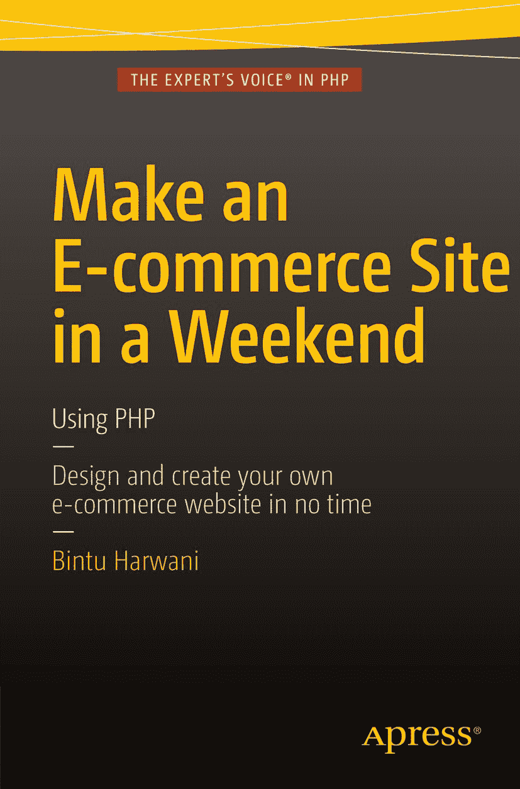

# 周末搭建电子商务网站：使用 PHP

宾图·哈瓦尼

作者在本文中引用的任何源代码或其他补充材料，读者均可从 [`www.apress.com`](http://www.apress.com/) 获取。关于如何找到本书源代码的详细信息，请访问 [`www.apress.com/source-code/`](http://www.apress.com/source-code/)。

ISBN 978-1-4842-1673-6

电子版 ISBN 978-1-4842-1672-9

DOI 10.1007/978-1-4842-1672-9

© 宾图·哈瓦尼 2015

**周末搭建电子商务网站：使用 PHP**

常务董事：韦尔莫德·斯帕尔

首席编辑：本·雷诺-克拉克

技术审阅：马西莫·纳尔多内

编辑委员会：史蒂夫·安格林、普拉米拉·巴伦、路易丝·科里根、吉姆·德沃尔夫、乔纳森·根尼克、罗伯特·哈钦森、塞莱斯廷·苏雷什·约翰、米歇尔·洛曼、詹姆斯·马克姆、苏珊·麦克德莫特、马修·穆迪、杰弗里·佩珀、道格拉斯·庞迪克、本·雷诺-克拉克、格韦南·斯皮林

协调编辑：梅丽莎·马尔多纳多

文字编辑：凯齐娅·恩兹利

排版：SPi Global

索引编制：SPi Global

插图制作：SPi Global

有关翻译的信息，请发送电子邮件至 `rights@apress.com`，或访问 [`www.apress.com`](http://www.apress.com/)。Apress 和 friends of ED 的书籍可批量购买，用于学术、企业或促销用途。大多数图书也提供电子版和许可证。如需更多信息，请参阅我们的特别批量销售–电子书许可网页：[`www.apress.com/bulk-sales`](http://www.apress.com/bulk-sales)。

本作品受版权保护。出版商保留所有权利，无论涉及材料的全部或部分内容，特别是翻译、重印、重用插图、朗诵、广播、以缩微胶卷或任何其他物理方式复制，以及以电子方式改编、计算机软件或任何当前已知或未来开发的类似或不同方法进行传输或信息存储与检索的权利。出于评论或学术分析目的而使用的简短摘录，或专门为输入计算机系统并由购买者独家使用而提供的材料，不受此法律限制。仅允许根据出版商所在地现行版权法的规定复制本出版物或其部分内容，且使用许可必须始终从斯普林格获得。使用许可可通过版权清算中心的 RightsLink 获取。违反者将根据相应的版权法被起诉。

本书中可能出现商标名称、徽标和图像。我们不会在每次出现商标名称、徽标或图像时都使用商标符号，而是仅以编辑方式使用这些名称、徽标和图像，以维护商标所有者的利益，并无意侵犯商标。本出版物中使用的商品名称、商标、服务标志和类似术语，即使未标明，也不应被视为对其是否受所有权保护的意见表达。

尽管本书中的建议和信息在出版时被认为是真实准确的，但作者、编辑和出版商均不对任何可能出现的错误或遗漏承担法律责任。出版商对本书所包含的内容不作任何明示或暗示的保证。

本书通过斯普林格科学与商业媒体纽约分公司在全球图书贸易中发行，地址：233 Spring Street, 6th Floor, New York, NY 10013。电话：1-800-SPRINGER，传真：(201) 348-4505，电子邮件：`orders-ny@springer-sbm.com`，或访问 `www.springer.com`。Apress Media, LLC 是加利福尼亚州有限责任公司，其唯一成员（所有者）是斯普林格科学与商业媒体金融公司（SSBM Finance Inc）。SSBM Finance Inc 是特拉华州的一家公司。

**本书献给：**

我的母亲，尼塔·哈瓦尼夫人。我的母亲对我来说仅次于上帝。我今天的一切都源于她教导我的道德价值观。还有弗拉基米尔·科斯马·兹沃里金、菲洛·泰勒·法恩斯沃思和约翰·洛吉·贝尔德——现代电视（通常称为 TV）的发明者。众所周知，电视是当今最令人放松和娱乐的设备。在漫长而疲惫的一天工作之后，我喜欢坐在电视机前观看我最喜欢的节目。

## 引言

在本书中，你将学习开发一个电子商务网站。电子商务涉及通过互联网使用计算机和智能手机购买和销售产品或服务。如今，几乎所有企业都需要一个电子商务网站来销售其产品或服务，并展示其全球影响力。因此，大多数公司通过开发电子商务网站在互联网上展示自己。

你将在本书中学习开发的电子商务网站将能够销售几乎所有商品，包括书籍、智能手机、笔记本电脑等。该网站将通过顶部的一个下拉菜单展示不同的产品类别，并配有一个搜索框。用户可以选择产品并在线付款。该网站会将所有产品、订单和客户信息存储在数据库中。

本书面向没有太多网站开发经验的新手开发者。本书教你如何在线展示和销售自己的产品和服务。它解释了维护网站和客户信息所需的不同数据库表。本书讲解并带你经历开发电子商务网站的不同阶段。例如，你将学习开发用于展示产品的不同网页、实现搜索功能以便客户快速搜索产品、开发下拉菜单以链接网站的不同页面、对登录客户进行身份验证检查，以及关联支付网关以接受客户付款。对于想要学习或教授网站开发的开发者和教师来说，本书将非常有益。

## 关键主题覆盖范围

- 建立 PHP 与 MySQL 服务器的连接
- 使用 HTTP 方法在网页间传输数据
- 对输入表单应用验证检查
- 访问商品与列表，并搜索所需商品
- 为网站创建下拉菜单
- 添加网站页眉
- 会话处理
- 将商品选择保存到购物车
- 维护购物车
- 提供配送信息并进行支付

以下列出了本书不同章节的内容简要描述：

第 1 章，“引言”——在本章中，你将了解进行电子商务（即在网络上销售产品和服务）的好处。你将学习你的电子商务网站在完成时最终网页的外观。你还将学习安装创建和测试网站所需的 WampServer。你将看到通过 phpMyAdmin 软件工具配置 MySQL 服务器所需的步骤。此外，你还会了解所需的不同数据库表的结构，以便你的电子商务网站能够高效运行。

第 2 章，“PHP 与 MySQL”——本章解释了如何利用 PHP 和 MySQL 的组合来开发电子商务网站。你将学习编写和运行第一个 PHP 脚本的步骤。此外，你还将学习如何将信息从一个 PHP 脚本传递到另一个。你将学习显示表单以从用户那里获取信息。同时，你还会了解在 PHP 和 MySQL 服务器之间建立连接所需的方法。你将学习编写用于将用户信息存储到数据库表中的脚本。你还将学习从表中访问信息所需的方法，并最终利用这些知识通过编写登录脚本来验证用户身份。

第 3 章，“使用 PHP 访问数据库”——本章解释了从商品表中访问商品并将其以表格形式显示在屏幕上的技术。你还将学习创建一个显示不同商品类别的下拉菜单，并实现页面之间的导航。你将学习显示特定类别的商品、定义网站页眉、实现搜索功能以及显示选定商品的详细信息。你还将了解如何在网站中进行会话处理。你将学习定义网站的主页，该页面将以淡入淡出效果显示不同的商品图片。

第 4 章，“管理购物车”——在本章中，你将学习如何在跟踪访客会话 ID 后将所选的商品保存到购物车表中。你还将学习根据访客要求管理购物车内容。你将学习在网站页眉上显示购物车数量（购物车中选择的商品数量）和访客的登录状态。你将学习提供配送信息、接受付款，并将所选商品保存到 `orders` 和 `orders_details` 数据库表中。

## 致谢

我衷心感谢高级 Web 开发编辑 Ben Renow-Clarke 最初的认可，并给予我创作这部作品的机会。我非常感谢 Apress 的整个团队，感谢他们始终如一的合作和贡献，才得以完成这本书。

感谢 Matthew Moodie 作为开发编辑提供了大量反馈意见，帮助改进了各章节。他在改善信息结构和质量方面发挥了至关重要的作用。

我必须感谢技术审阅者 Massimo Nardone，他出色且细致地审阅了作品，并提出了许多有益的意见和建议。

特别感谢文字编辑 Kezia Endsley，她进行了顶级的结构和语言编辑。我感激她为提升本书内容质量并赋予其精美外观所做的努力。

我还要感谢格式编排公司 SPi Global，他们出色的排版使本书的视觉效果得到了显著提升。

长期且衷心地感谢协调编辑 Melissa Maldonado，她出色地完成了工作，确保本书按时出版。

万分感谢 Apress 的编辑、制作人员以及整个团队，他们不懈努力才使这本书得以出版。说真的，我很享受与你们每一位共事。

我也感谢我的家人。感谢 Anushka（我的妻子）和我的两个小宝贝——Chirag 和 Naman——他们一直鼓励和激励着我。

我不应忘记感谢我亲爱的学生们，他们也是我的良师益友，因为他们让我了解了他们所面临的基础问题，并帮助我直击这些主题。正是由于我的学生们提出了无穷无尽的有趣问题，我才能以坚实的实践方法撰写这本书。