# 1. 引言

电子补充材料 本章的在线版本（doi:`10.1007/978-1-4842-1672-9_1`）包含补充材料，授权用户可获取。

在本书中，你将学习如何开发一个电子商务网站。电子商务，也称为电商，是指通过计算机/智能手机利用互联网购买和销售产品或服务。如今，几乎所有企业都需要一个电子商务网站。为什么呢？以下是一些原因：

- 在线销售无需办公空间或任何产品展示空间。
- 你可以全天候/每周 7 天/每年 365 天进行销售；没有商店营业时间的限制。
- 消费者可以在家中方便且随时购买。他们可以节省大量在交通拥堵中前往商店所浪费的时间。
- 你可以将产品销往全球。
- 资金在线转移快速、方便且用户友好。

因此，大多数公司都通过开发电子商务网站在互联网上展示自己的存在。你在本书中将要学习开发的电子商务网站将销售几乎所有商品，包括书籍、智能手机、笔记本电脑等。该网站将通过一个下拉菜单展示不同的产品类别，并在顶部提供一个搜索框。用户可以选择产品并在线支付。该网站将所有产品、订单和客户信息存储在数据库中。

尽管你可以通过不同网站托管提供商提供的免费电子商务网站设计工具非常轻松地创建一个网站，但这会存在以下限制：

- 设计工具可能不够灵活。菜单、表格和其他界面可能不适合你的需求。
- 你可能会遇到数据库连接和其他身份验证过程的问题。
- 你可能无法获得支持来获取网站管理任务所需的信息。
- 如果你通过其专利工具构建网站，那么更换网站托管商将会非常困难。

因此，你将从头开始使用 PHP 开发这个电子商务网站。

在本章中，你将学习：

- 全书将制作的电子商务网站的概要
- 开发网站所需的软件
- 安装 WampServer
- 配置 MySQL
- 网站中所需的数据库表的详细信息

## 为什么选择 PHP？

PHP 全称为“PHP 超文本预处理器”，是开发者中最流行的 Web 脚本引擎之一。问题是，它为何如此受欢迎？

原因有很多，但首要的一点是它是一种服务器端脚本语言，因此所有 PHP 脚本都是在服务器而非客户端机器上执行的。因此，脚本执行消耗的是服务器资源而非客户端资源。在本书中，你也会在适当且有必要使用的地方看到一些客户端的 `JavaScript` 代码。

PHP 脚本在服务器上运行，其输出以纯 HTML 形式发送给客户端，这使其非常安全。网站访客永远无法通过浏览器的“查看源代码”选项看到 PHP 源代码，他们只能看到 PHP 脚本的输出，即纯 HTML。

除此之外，PHP 支持众多数据库（`MySQL`、`Informix`、`Oracle`、`Sybase`、`Solid`、`PostgreSQL`、`Generic ODBC` 等）。因此你可以将客户信息、访客信息、服务及产品信息存入数据库，并在需要时随时检索。

PHP 是开源软件（OSS），可免费获取，使用 PHP 无需付费。而且，有庞大的社区参与开发和增强 PHP 特性，这确保了更快的错误修复和更完善的功能更新。

PHP 通常运行在一个名为 `LAMP` 的开源平台上。`LAMP` 的全称是 `Linux`、`Apache`、`MySQL` 和 `PHP`。同样得益于开源，该平台能得到全球开发者持续的支持。

PHP 可以轻松嵌入 HTML 标签和脚本。因此，不那么重要的代码可以用 HTML 编写，关键代码则用 PHP 编写。这种组合比纯 PHP 编写的代码运行速度更快。

PHP 可运行于任何平台——`Linux`、`Unix`、`Mac OS X` 和 `Windows`。此外，PHP 拥有垃圾回收机制和高效的内存管理器，能优化任何站点的内存消耗。

## 电子商务网站的外观

让我们快速预览一下本书的最终成果。你将贯穿全书开发的电子商务网站，其外观将如下列图示所示。

启动购物车网站后，你看到的第一个界面如图 1-1 所示。


图 1-1. 启动电子商务网站后的第一个界面

可以看到顶部是包含网站标题的页眉，右上角是一个购物车图标（方便用户了解购物车已选了什么）。页眉下方是一个下拉菜单，显示网站上可用的产品类别列表（见图 1-2）。


图 1-2. 显示不同产品类别的下拉菜单

如果你选择一个类别，比如“笔记本电脑”，来查看该类别下的所有产品，你将看到如图 1-3 所示的输出。

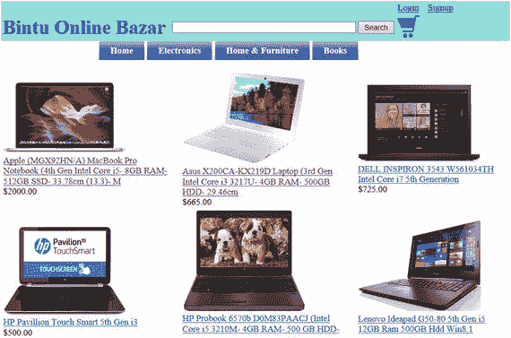

图 1-3. 显示不同在售笔记本电脑的页面

产品图片和名称包含一个链接，点击后将显示所选产品的详细信息。例如，点击华硕 `X200CA-KX219D` 笔记本，将显示其详细信息，如图 1-4 所示。

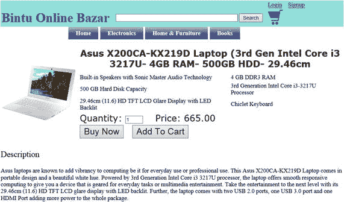

图 1-4. 显示所选笔记本电脑详细信息的页面

“数量”文本框用于输入你想购买所选产品的数量。如果留空并点击“添加到购物车”按钮，默认数量为 1。假设你想购买一台所选笔记本电脑，你可以在“数量”文本框中输入 1，然后点击“添加到购物车”按钮，或者也可以直接点击该按钮，因为默认数量总是 1。

所选项目及其输入的数量将被添加到购物车中，如图 1-5 所示。

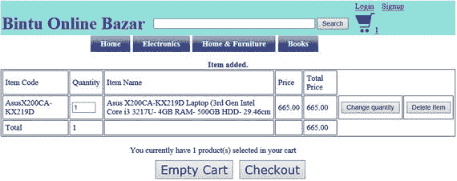

图 1-5. 购物车中已选的项目

你随时可以更改购物车中已选产品的数量，也可以从购物车中删除任何项目。要将购物车中华硕笔记本的数量改为 2，可修改“数量”列中的值并点击“修改数量”按钮。购物车中的数量和总价将随之变化，如图 1-6 所示。

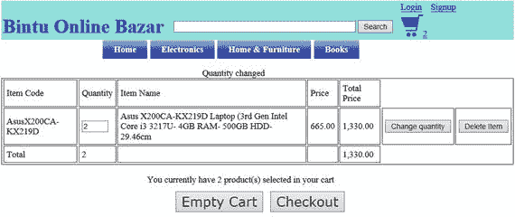

图 1-6. 购物车中项目的数量已更改

你甚至可以购买属于其他类别的更多商品。假设你需要查看“智能手机”类别下的所有商品，你可以从顶部的下拉菜单中选择该类别。智能手机类别下的所有产品将会显示，如图 1-7 所示。


图 1-7. 显示不同在售智能手机的页面

同样，每个产品的图片和名称都包含一个链接，点击后会显示所选产品的详细信息。

如果你点击 `Micromax-Canvas-Knight-2-E471` 智能手机，其详细信息将如图 1-8 所示。

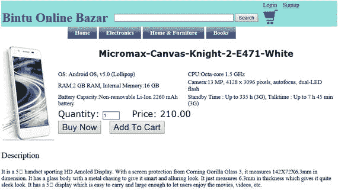

图 1-8. 显示所选智能手机详细信息的页面

同样，`Quantity` 文本框指定您想要购买的商品数量（默认值为 1）。假设您想要选定的产品之一，请单击 `Add To Cart` 按钮。单击 `Add To Cart` 按钮后，购物车中所有选定的产品将会显示出来，如图 1-9 所示。

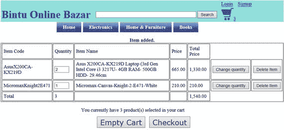

图 1-9. 购物车中选定的商品

如前所述，您不仅可以更新购物车中任何选定商品的数量，还可以删除购物车中任何不需要的商品。例如，假设您不再想要 Micromax 智能手机。要将其从购物车中删除，请单击该产品行中的 `Delete Item` 按钮。Micromax 智能手机将从购物车中移除，购物车中将留下两台华硕笔记本电脑（见图 1-10）。

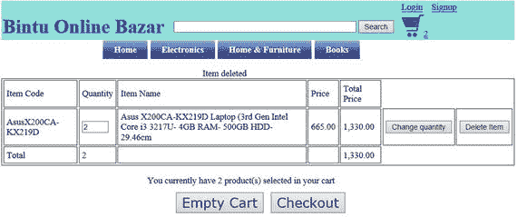

图 1-10. 从购物车中删除的商品

> **注意**
>
> 单击 `Empty Cart` 按钮将移除购物车中当前的所有产品。

如果您已准备好购买商品，可以单击 `Checkout` 按钮。如果您在开始购物前已创建帐户并登录，您的用户详细信息（例如姓名、地址、联系电话等）将自动显示。应用程序只会要求您提供配送信息。但如果您尚未登录，将会看到如图 1-11 所示的消息。


图 1-11. 告知客户登录状态的页面

如果您尚未创建帐户，系统会提示您先创建。如果您有帐户，系统会提示您登录。如果您选择创建帐户链接（“click here to login”），您将看到一个填写用户详细信息的界面，如图 1-12 所示。

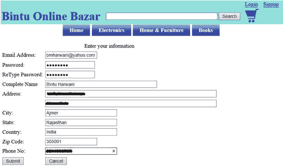

图 1-12. 用于创建客户帐户的页面

在填写表单时，请务必小心填写`Password`和`ReType Password`这两个字段。这两个字段必须完全相同。如果这两个字段的内容不匹配，系统将要求您重新输入。

输入所需信息后，您需要单击`Submit`按钮。如果提供的信息正确，您将被注册，并在购买完成后要求提供配送信息（商品必须送达的地址），如图 1-13 所示。


图 1-13. 给已登录客户的欢迎信息

当您选择提供配送信息的链接时，您会看到一些文本框，用于指定商品的送货地址，如图 1-14 所示。

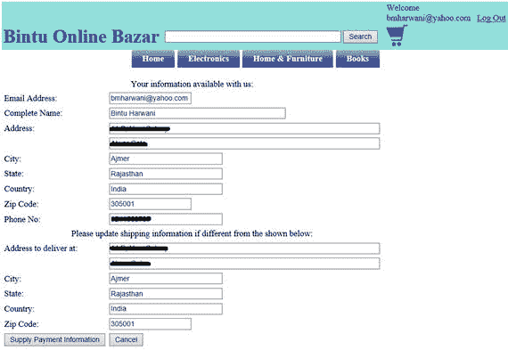

图 1-14. 用于提供配送信息的页面

填写配送信息后，您单击`Supply Payment Information`按钮。您将进入一个要求您输入付款信息的页面，如图 1-15 所示。

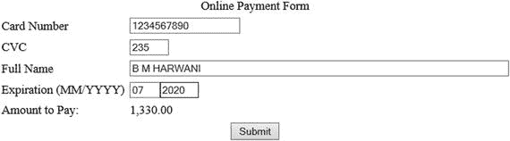

图 1-15. 用于输入付款信息的页面

单击`Submit`按钮后，订单详细信息将连同唯一的订单号一起存储在数据库中。该订单号会显示给用户，以便日后沟通。

### 开发网站所需的软件

由于您将使用 PHP 开发此电子商务网站，因此需要以下三种软件产品来运行 PHP 脚本：

- **Apache 网络服务器** — 用于在本地机器上运行和调试 PHP 脚本的本地网络服务器。

- **PHP 解释器** — 用于解释 PHP 代码。Apache 网络服务器使用 PHP 解释器来解释 PHP 代码并生成 HTML 代码。

- **MySQL** — 与 PHP 最流行的数据库系统，用于存储用户输入的数据以供日后参考。

您不必单独安装这些产品，可以安装 WampServer 或 XAMPP 服务器。这些服务器会同时在您的机器上安装所有三种产品：Apache、PHP 和 MySQL。接下来，您将学习如何安装 WampServer。

> **注意**
>
> WampServer 为 Apache、MySQL 和 PHP 数据库提供了 Windows 网络开发环境。

### 安装 WampServer

为了在上传到实际服务器之前在本地检查和调试 PHP 脚本，您需要在本地机器上安装 WampServer。因此，请从[`http://www.wampserver.com/en`](http://www.wampserver.com/en)下载免费的 WampServer 副本。撰写本文时可用的最新 WampServer 版本是 2.5。下载 WampServer 后，双击其`.exe`文件并选择`Run`。

> **注意**
>
> WampServer 是一个开源、易于使用的服务器。它包含一个出色的图形化工具`phpMyAdmin`，使得管理 MySQL 变得非常容易。WampServer 的工具非常易于使用，您不需要任何先验知识。在本章后面，您将学习如何使用 WampServer 及其工具。

第一个界面是欢迎界面，指示将要安装的 WampServer 版本，如图 1-16 所示。单击`Next`按钮。

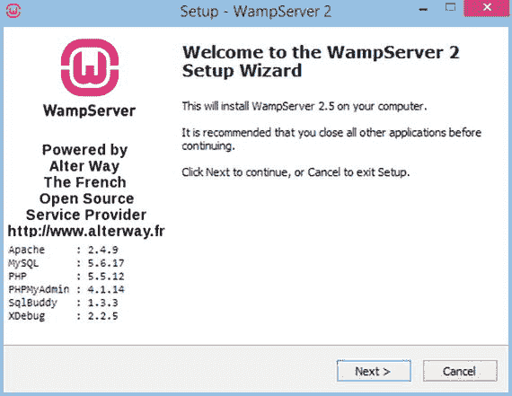

图 1-16. WampServer 安装向导的欢迎界面

下一个窗口显示使用 WampServer 的许可协议和条款与条件（见图 1-17）。接受许可协议并单击`Next`。

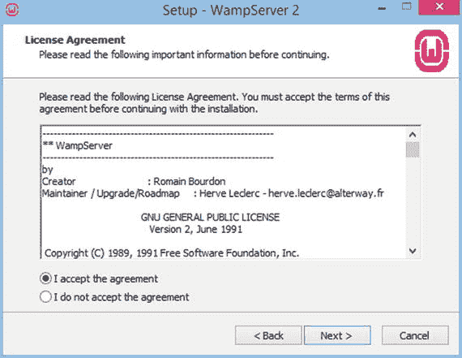

图 1-17. 显示许可协议的界面

选择安装 WampServer 的文件夹（见图 1-18）。最好保留默认的文件夹位置。单击`Next`按钮。

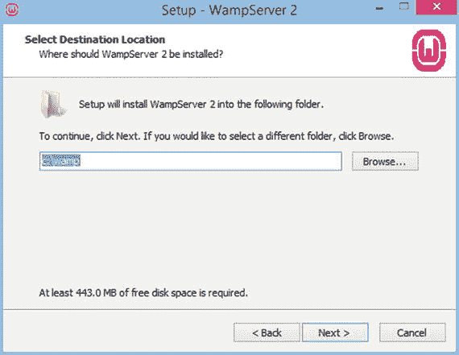

图 1-18. 提示选择安装文件夹的界面

将显示复选框（见图 1-19），询问您是否要将 WampServer 图标添加到桌面和快速启动栏。勾选复选框。单击`Next`继续。

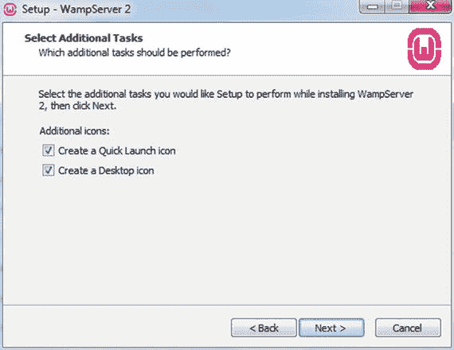

图 1-19. 提示是否显示快速启动和桌面图标的界面

下一个窗口显示您到目前为止所选择的项目以供复查。您可以单击`Back`按钮进行任何更改。让我们单击`Install`按钮以启动安装过程（见图 1-20）。

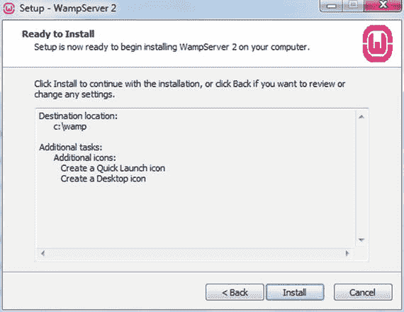

图 1-20. 安装 WampServer 文件之前的最终界面

如果您的机器上安装了 Linux，您可以下载并安装 LAMP 服务器。

## 安装 LAMP 服务器

LAMP 代表 Linux、Apache、MySQL 和 PHP。它是一组开源软件产品，用于在 Linux 机器上运行 Web 服务器。以下是安装 LAMP 的步骤：

**安装 Apache。** 要安装 Apache，请打开终端并输入以下命令：

```
sudo apt-get install apache2
```

要检查 Apache 是否已安装，请打开浏览器并访问地址`http://localhost/`。如果页面显示文本 "It works!"，则表示 Apache 安装成功。

**安装 MySQL。** 要安装 MySQL，请打开终端并输入以下命令：

```
sudo apt-get install mysql-server
```

系统会提示您设置 root 密码。如果您的计算机没有提示，请输入以下命令来设置 root 密码：

```
mysql -u root
mysql> SET PASSWORD FOR 'root'@'localhost' = PASSWORD('yourpassword');
```

要安装`phpMyAdmin`工具，请在终端中输入以下命令：

```
sudo apt-get install libapache2-mod-auth-mysql php5-mysql phpmyadmin
```

MySQL 安装完成后，您可以使用以下命令激活它：

```
sudo mysql_install_db
```

**安装 PHP。** 要安装 PHP，请打开终端并输入以下命令：

```
sudo apt-get install php5 libapache2-mod-php5 php5-mcrypt
```

对提示的问题回答 "yes"，PHP 将自行安装。

成功安装 WampServer 或 LAMP 后，您可以继续启动其中任何一个。本书中使用的是 WampServer，但步骤对于两个服务器是通用的。

### 启动服务器

要使用 WampServer，您需要启动它。因此，请双击其桌面图标或按照以下步骤操作：

- 打开开始屏幕。

- 在开始屏幕上显示的磁贴列表中，找到 WampServer。如果在应用程序和程序列表中找不到 WampServer，请在屏幕的空白处输入文本 "WAMP"。

- 将出现一个搜索框，并列出所有与输入文本匹配的应用程序。

- 单击结果列表中显示的 WampServer 图标。

启动 WampServer 后，任务栏中会出现一个图标，如图 1-21 所示。


图 1-21. 任务栏中显示的 WampServer 图标

当 WampServer 图标为红色时，表示其上的服务均未运行。当其为橙色时，表示 WampServer 已启动，但并非所有服务都在运行。当其为绿色时，表示 WampServer 已启动且所有服务均正常运行。要启动服务器，请单击其图标，并从弹出的菜单中选择**启动所有服务**选项（见图 1-22）。

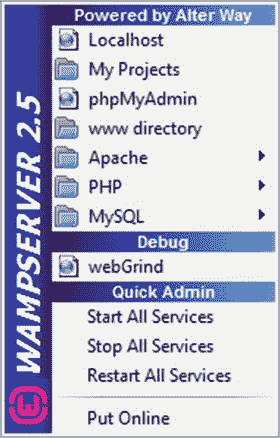

*图 1-22. WampServer 弹出菜单*

随着服务器启动，它会从红色变为橙色再变为绿色。WampServer 可能与 Skype 的默认设置、IIS 服务器以及其他服务器发生冲突。如果您发现并非所有 WampServer 服务都在运行（即图标在启动后仍保持橙色），则需要停止您的 IIS 服务器，退出 Skype，然后重新启动您的 WampServer。

如果 WampServer 图标变为绿色，则表示服务器已成功设置并完全正常运行。您也可以通过启动浏览器并访问 `http://localhost` 地址来验证这一点。如果您看到显示服务器配置、Apache 版本、PHP 版本等信息（见图 1-23）以及已加载的扩展的屏幕，则表示 WampServer 已成功安装并正在运行。

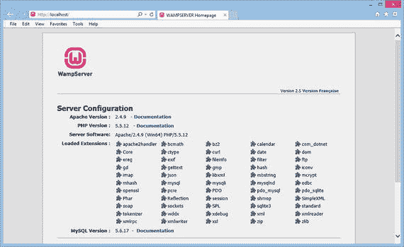

*图 1-23. 成功安装 WampServer 后，浏览器显示服务器配置*

恭喜，您的 WampServer 已成功安装。这也意味着 Apache、MySQL 和 PHP 已成功安装在您的机器上。

默认情况下，WampServer 不会为 MySQL 的 root 用户设置密码。为了实现安全性并避免未经授权的访问，您需要为 MySQL 的 root 用户设置密码，并在必要时创建其他用户。那么，让我们继续配置 MySQL 服务器。

### 配置 MySQL

您将使用 `phpMyAdmin` 来配置 MySQL 服务器。`phpMyAdmin` 是一个用 PHP 编写的软件工具，用于通过网络管理 MySQL。您可以通过 `phpMyAdmin` 的图形用户界面轻松管理 MySQL 数据库、表、索引、用户等。要调用 `phpMyAdmin`，请单击 WampServer 图标并选择 `phpMyAdmin` 选项。

`phpMyAdmin` 将打开，如图 1-24 所示。屏幕的左窗格中显示了最近的数据库。在右上角，您会找到用于管理数据库、SQL、用户等的按钮。中间窗格显示了下拉列表，使您能够定义 MySQL 连接。您还会找到用于更改默认语言、主题、字体大小和其他设置的下拉列表。

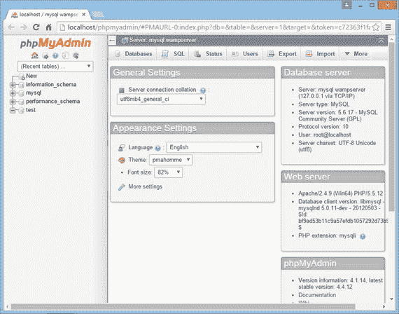

*图 1-24. 启动 phpMyAdmin 工具时的首屏*

要配置 root 密码，您需要访问位于左窗格 `mysql` 数据库中的用户表。`mysql` 数据库节点上的 `+`（加号）表示它当前处于折叠状态。要展开节点，请单击其 `+` 号。`mysql` 数据库节点将展开，显示其中存在的所有表。单击 `user` 表以显示其中的行数（见图 1-25）。您可以看到 `user` 表默认包含以下四个用户：

-   主机 `127.0.0.1` 的用户 `root`——表示 localhost（IPv4 未解析 IP）的 root 用户。

-   主机 `::1` 的用户 `root`——表示 localhost（IPv6 未解析 IP）的 root 用户。

-   主机 `localhost` 的用户 `root`——表示 localhost（已解析 IP）的 root 用户。

-   主机 `localhost` 的用户 `anonymous`——表示具有已解析 IP 的匿名用户。

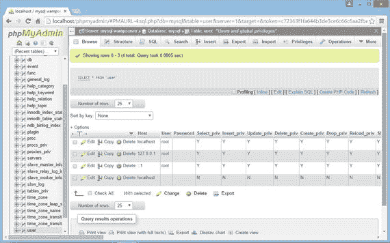

*图 1-25. 显示 user 表行的屏幕*

默认情况下，这些用户的密码为空。root 用户名是拥有所有权限的超级用户帐户，但空密码使得 MySQL 服务器极易受到未经授权的访问。因此，首要任务是为所有这些 root 帐户提供密码，并删除匿名用户或也为该用户帐户提供一个密码。

要为 root 用户提供密码，请单击相应行上的**编辑**图标以编辑其内容。该行将展开并显示三个文本框——Host、User 和 Password。在**Password**列中输入密码（见图 1-26）。如果您想加密密码（而不是以纯文本格式保存），请从**函数**组合框中选择 `PASSWORD` 选项。输入密码后，单击底部的**执行**按钮以保存更改。

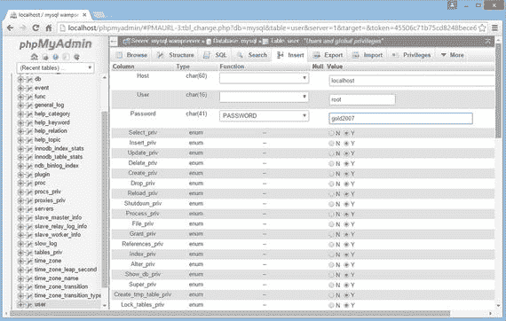

*图 1-26. 更改 MySQL 服务器的 root 密码*

一旦为所有 root 用户设置了密码，您的 MySQL 服务器就会变得相当安全，免受未经授权的访问。接下来，让我们了解您的电子商务网站所需的不同数据库表。

#### 必需的数据库表

我们的电子商务网站总共将创建七张表，名称如下：

- `products` — 存储产品信息，包括产品名称、重量、价格、描述等。

- `productfeatures` — 存储产品的功能特性。

- `cart` — 存储购物车中选择的商品信息。

- `customers` — 存储已注册客户的信息。

- `orders` — 存储订单号、订单数据以及下订单客户的配送信息。

- `orders_details` — 存储给定订单中购买的所有产品的信息。

- `payment_details` — 存储用于支付任何订单的所选支付方式的卡号及其他信息。

你将在名为 `shopping` 的数据库中创建这些表。这些表的结构在表 1-1 到 1-7 中进行了说明。

**表 1-7.** `payment_details` 表结构简要说明

| 列名 | 类型 | 描述 |
| --- | --- | --- |
| `order_no` | `int(6)` | 存储付款所对应的订单号。 |
| `order_date` | `date` | 存储给定订单的下单日期。 |
| `amount_paid` | `DECIMAL(7,2)` | 存储给定订单已支付的金额。 |
| `email_address` | `varchar(50)` | 存储付款客户的电子邮件地址。 |
| `customer_name` | `varchar(50)` | 存储付款客户的姓名。 |
| `payment_type` | `varchar(20)` | 存储支付方式，即客户是通过借记卡、信用卡、网上银行等方式付款。 |
| `name_on_card` | `varchar(30)` | 如果客户使用银行卡付款，则存储借记卡/信用卡上的姓名。 |
| `card_number` | `varchar(20)` | 存储信用卡号。 |
| `expiration_date` | `varchar(10)` | 存储卡的到期日期（如果客户使用银行卡付款）。 |

**表 1-6.** `orders_details` 表结构简要说明

| 列名 | 类型 | 描述 |
| --- | --- | --- |
| `order_no` | `int(6)` | 存储客户所下订单的订单号。 |
| `item_code` | `varchar(20)` | 存储订单中选择的产品代码。 |
| `item_name` | `varchar(100)` | 存储订单中选择的产品名称。 |
| `quantity` | `SMALLINT` | 存储订单中选择的产品数量。 |
| `price` | `DECIMAL(7,2)` | 存储订单中选择的产品价格。 |

**表 1-5.** 订单表结构简要说明

| 列名 | 类型 | 描述 |
| --- | --- | --- |
| `order_no` | `int(6)` | 存储客户所下订单的订单号。订单号自动生成，是上一个订单号加 1。 |
| `order_date` | `date` | 存储客户下单的日期。 |
| `email_address` | `varchar(50)` | 存储下单客户的电子邮件地址。 |
| `customer_name` | `varchar(50)` | 存储下单客户的全名。 |
| `shipping_address_line1` | `varchar(255)` | 存储需要送货的第一行收货地址。 |
| `shipping_address_line2` | `varchar(255)` | 存储需要送货的第二行收货地址。 |
| `shipping_city` | `varchar(50)` | 存储需要送货的城市名称。 |
| `shipping_state` | `varchar(50)` | 存储收货州/省。 |
| `shipping_country` | `varchar(50)` | 存储收货国家。 |


### 表 1-4. 客户表结构简要说明

| 列名 | 类型 | 描述 |
| --- | --- | --- |
| `email_address` | `varchar(50)` | 存储已注册客户的电子邮件地址。每个客户的电子邮件地址被视为唯一的。 |
| `password` | `varchar(50)` | 存储已注册客户的密码。 |
| `complete_name` | `varchar(50)` | 存储已注册客户的全名。 |
| `address_line1` | `varchar(255)` | 假设客户地址较长，此字段存储已注册客户的第一行地址。 |
| `address_line2` | `varchar(255)` | 存储已注册客户的第二行地址。 |
| `city` | `varchar(50)` | 存储客户所属的城市名称。 |
| `state` | `varchar(50)` | 存储客户所属的州/省。 |
| `zipcode` | `varchar(10)` | 存储客户所在城市的邮政编码。 |
| `country` | `varchar(50)` | 存储客户的国家名称。 |
| `cellphone_no` | `varchar(15)` | 存储已注册客户的手机号码。 |

### 表 1-3. 购物车表结构简要说明

| 列名 | 类型 | 描述 |
| --- | --- | --- |
| `cart_sess` | `char(50)` | 存储客户的会话 ID。 |
| `cart_itemcode` | `varchar(20)` | 存储客户在购物车中选择的产品的唯一代码。 |
| `cart_quantity` | `SMALLINT` | 存储购物车中选择的产品数量。 |
| `cart_item_name` | `varchar(100)` | 存储购物车中选择的产品名称。 |
| `cart_price` | `DECIMAL(7,2)` | 存储购物车中选择的产品价格。 |

### 表 1-2. `productfeatures` 表结构简要说明

| 列名 | 类型 | 描述 |
| --- | --- | --- |
| `item_code` | `varchar(20)` | 为每个产品存储唯一的代码。 |
| `feature1/ feature2/ feature3/ feature4/ feature5/ feature6` | `varchar(255)` | 存储产品的功能特性。 |

### 表 1-1. 产品表结构简要说明

| 列名 | 类型 | 描述 |
| --- | --- | --- |
| `item_code` | `varchar(20)` | 存储产品的唯一代码。 |
| `item_name` | `varchar(150)` | 存储产品名称。 |
| `brand_name` | `varchar(50)` | 存储产品的品牌名称。 |
| `model_number` | `varchar(30)` | 存储产品的型号。 |
| `weight` | `varchar(20)` | 存储产品的重量。 |
| `dimension` | `varchar(50)` | 存储产品的尺寸。 |
| `description` | `text` | 存储产品的描述。 |
| `category` | `varchar(50)` | 存储产品类别，例如产品属于智能手机、笔记本电脑还是图书类别。 |
| `quantity` | `SMALLINT` | 存储产品的现有库存数量。即仓库中当前的产品数量。 |
| `price` | `DECIMAL(7,2)` | 存储产品的价格。 |
| `imagename` | `varchar(50)` | 存储产品图片的路径和名称。 |

别担心；你不必手动创建这些数据库表和 `shopping` 数据库。我在本书中提供了一个名为 `creatingtables.sql` 的 SQL 脚本。该 SQL 脚本如代码清单 1-1 所示。

### 代码清单 1-1. SQL 脚本 `creatingtables.sql`

```sql
create database shopping;

use shopping;

create table products (
item_code varchar(20) not null,
item_name varchar(150) not null,
brand_name varchar(50) not null,
model_number varchar(30) not null,
weight varchar(20),
dimension varchar(50),
description text,
category varchar(50),
quantity SMALLINT not null,
price DECIMAL(7,2),
imagename varchar(50)
);

create table productfeatures (
item_code varchar(20) not null,
feature1 varchar(255),
feature2 varchar(255),
feature3 varchar(255),
feature4 varchar(255),
feature5 varchar(255),
feature6 varchar(255)
);

create table cart (
cart_sess char(50) not null,
cart_itemcode varchar(20) not null,
cart_quantity SMALLINT not null,
cart_item_name varchar(100),
cart_price DECIMAL(7,2)
);

create table customers (
email_address varchar(50) not null,
password varchar(50) not null,
complete_name varchar(50),
address_line1 varchar(255),
address_line2 varchar(255),
city varchar(50),
state varchar(50),
zipcode varchar(10),
country varchar(50),
cellphone_no varchar(15),
primary key(email_address)
);

create table orders (
order_no int(6) not null auto_increment,
order_date date,
email_address varchar(50),
customer_name varchar(50),
shipping_address_line1 varchar(255),
shipping_address_line2 varchar(255),
shipping_city varchar(50),
shipping_state varchar(50),
shipping_country varchar(50),
shipping_zipcode varchar(10),
primary key (order_no)
);

create table orders_details (
order_no int(6) not null,
item_code varchar(20) not null,
item_name varchar(100) not null,
quantity SMALLINT not null,
price DECIMAL(7,2)
);

create table payment_details (
order_no int(6) not null,
order_date date,
amount_paid DECIMAL(7,2),
email_address varchar(50),
customer_name varchar(50),
payment_type varchar(20),
name_on_card varchar(30),
card_number varchar(20),
expiration_date varchar(10)
);
```

你只需运行此脚本即可创建数据库和数据表。请按照以下步骤操作。

#### 运行 MySQL 脚本的步骤

要运行 SQL 脚本，需要打开 MySQL 控制台。因此，请点击任务栏中的 WampServer 图标，然后从弹出的菜单中选择 `MySQL`->`MySQL 控制台` 选项。

系统会提示你输入用户 `root` 的密码。输入密码后，你将在 MySQL 控制台窗口中看到 `mysql>` 提示符，如图 1-27 所示。


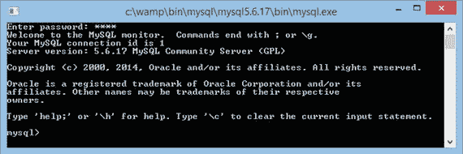

图 1-27. 用于运行 SQL 命令/脚本的 MySQL 控制台窗口

要执行 SQL 脚本，你需要使用 `source` 命令。`source` 命令的语法是：

`source [路径] sqlscript.sql`

假设 `creatingtables.sql` 文件位于 `D:` 盘，你可以使用以下命令执行它：

`source D:\\creatingtables.sql`

`creatingtables.sql` 文件中的 SQL 命令将被执行，并创建 `shopping` 数据库以及前面讨论过的数据表。每成功执行一条 SQL 命令，都会得到 `Query OK` 的输出，如图 1-28 所示。

*   执行 `show databases` 命令会显示 MySQL 服务器中现有的数据库。`shopping` 数据库的出现确认了 `shopping` 数据库已成功创建。

*   `use` 命令使指定的数据库成为活动或当前数据库。`use shopping` SQL 命令使 `shopping` 数据库变为活动状态。

*   执行 `show tables` 命令会显示当前活动数据库中存在的所有数据表。你可以看到所有七张数据库表都已成功创建在 `shopping` 数据库中。

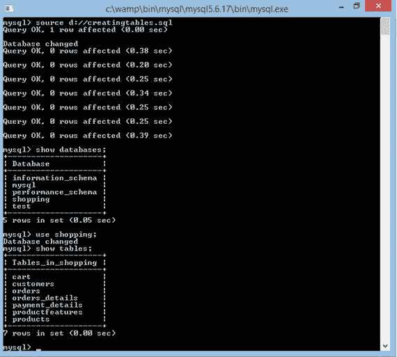

图 1-28. 执行用于创建 shopping 数据库及其数据表的 SQL 脚本

成功创建数据库及其数据表后，你需要在 `products` 和 `productsfeatures` 表中填充一些测试商品信息。为此，你需要执行本书提供的另一个 SQL 脚本，名为 `insertingrows.sql`。执行过程与 `creatingtables.sql` 脚本完全相同。

## 章节总结

在本章中，你学习了最终完成的电子商务网站将呈现的样子。同时，你也了解了如何安装创建和测试本网站所需的 WampServer。你还学习了如何通过 phpMyAdmin 软件工具配置 MySQL 服务器。最后，你了解了为本网站保存商品、订单和客户信息所需的各种数据表的数据库结构。

在下一章中，你将学习如何编写你的第一个 PHP 脚本。同时，你还将学习如何将信息从一个 PHP 脚本传递到另一个。利用这些知识，你将学习创建一个用于创建新用户帐户的登录表单。