# 2. PHP 与 MySQL

**电子补充材料**：本章的在线版本 (doi:10.1007/978-1-4842-1672-9_2) 包含补充材料，仅供授权用户使用。

你将使用 PHP 和 MySQL 来开发这个电子商务网站。问题是为什么选择 PHP 和 MySQL？答案非常简单。PHP 和 MySQL 的组合使 Web 开发任务变得相当容易。这里列出了它们的一些特点：

*   两者都是开源技术，并在 GPL（通用公共许可证）下提供。因此，使用这种组合开发 Web 应用程序的成本相当低。
*   PHP 是一种强大的语言，并且可以非常容易地连接 MySQL 服务器，这使得该组合在 Web 开发中很受欢迎。
*   该组合可以成功地在 UNIX 和 Windows 平台上使用。
*   该组合的性能非常高。用 PHP 编写的用于从 MySQL 插入和获取信息的代码非常高效。
*   PHP 和 MySQL 受到开发社区的广泛支持，因此你能获得定期的更新。

在本章中，你将学习以下内容：

*   编写你的第一个 PHP 脚本
*   在 PHP 中使用变量，创建 `echo` 语句，以及拼接字符串
*   使用 HTTP 方法传输数据——GET 和 POST
*   使用 `$_GET`、`$_POST` 和 `$_REQUEST` 数组将信息从一个脚本传递到另一个脚本
*   创建一个登录表单
*   应用验证检查
*   编写用于连接 PHP 与 MySQL 的代码
*   通过 PHP 执行 SQL 命令，在数据库表中存储信息，以及从数据库访问信息
*   实现身份验证


## 编写你的第一个 PHP 脚本

一个 PHP 文件通常包含 HTML 标签以及内嵌其中的一些 PHP 脚本代码。清单 2-1 展示了一个显示 PHP 配置信息的最简 PHP 脚本。在学习如何运行此脚本之前，你应当先快速了解该脚本中使用的 `phpinfo()` 函数。

`phpinfo()` 函数用于显示 PHP 的配置信息，其显示的信息包括以下几个方面：

* PHP 编译选项
* PHP 版本
* 服务器信息和环境
* PHP 环境
* 不同配置选项的值
* PHP 许可证

**清单 2-1. 用于显示 PHP 配置信息的 PHP 脚本 (phpdetails.php)**

```
<?php
        phpinfo();
?>
```

要运行此 PHP 脚本，请按以下步骤操作：

使用任意编辑器输入此脚本，并将其以 `phpdetails.php` 为文件名，保存在 `wamp` 目录下的 `www` 子文件夹中。例如，如果 WampServer 安装在 `C:` 盘，则将此脚本保存在 `C:\wamp\www` 文件夹中。请确保 WampServer 正在运行，即其任务栏图标为绿色。如果没有运行，请单击其图标，并从弹出的菜单中选择“**启动所有服务**”。

WampServer 启动后，打开浏览器并访问以下地址：`http://localhost/phpdetails.php`。你将看到如图 2-1 所示的输出。

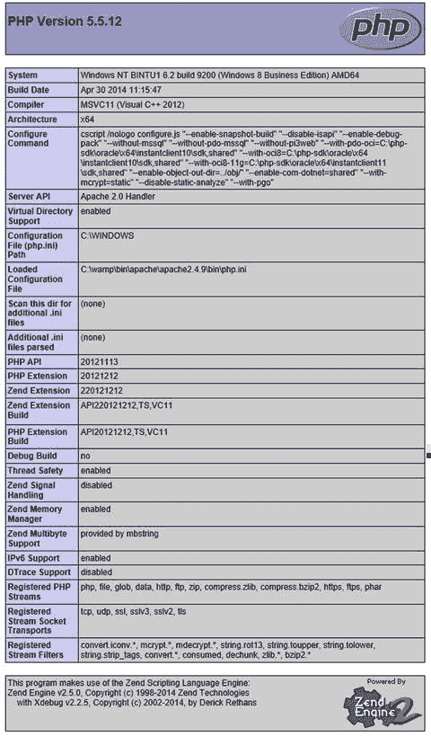

**图 2-1. 显示 PHP 配置信息的 PHP 脚本**

接下来，清单 2-2 展示了一个在输出中显示两行文本的非常基础的示例。

**清单 2-2. 简单的 PHP 脚本 (phpscript1.php)**

```
<html>
    <head>
    </head>
    <body>
        <h1>宾图在线集市</h1>
        <?php
            echo '<b>欢迎光临我们的商店</b>';
        ?>
    </body>
</html>
```

同样，将此脚本以 `phpscript1.php` 为文件名，保存在 `wamp` 目录下的 `www` 子文件夹中。确保 WampServer 正在运行，然后打开浏览器并访问以下地址：`http://localhost/phpscript1.php`。你将得到如图 2-2 所示的输出。

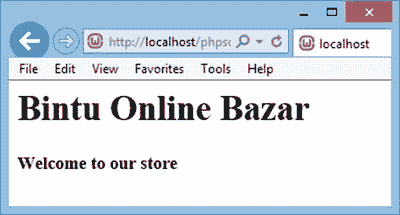

**图 2-2. 显示欢迎信息的 PHP 脚本**

在清单 2-1 所示的代码中，你可以看到 PHP 脚本可以简单地通过起始 PHP 标签 `<?php` 和结束 PHP 标签 `?>` 嵌入到 HTML 中。

当 Web 服务器发现 PHP 脚本时，它会调用 PHP 引擎并将脚本传递给它。PHP 引擎会解释 `<?php` 和 `?>` 标签之间的语句，生成相应的 HTML 代码，并将其传递回 Web 服务器。然后，Web 服务器将 HTML 文档发送到客户端浏览器进行显示。

PHP 脚本块可以放置在文档中的任意位置，并且每条语句都必须以分号结束。分号作为分隔符，用于区分不同的语句。

为了存储值和文本，你需要使用变量。因此，接下来我们将讨论变量。

### 在 PHP 中使用变量

变量可用于存储用户输入的数据，或存储常量数值或文本。变量的值通过赋值操作符 (`=`) 进行赋值。PHP 中的所有变量都以美元符号 (`$`) 开头。清单 2-3 中的脚本 `phpscript2.php` 演示了如何在 PHP 中定义和使用变量。

**清单 2-3. 演示变量使用的 PHP 脚本 (phpscript2.php)**

```
<html>
    <body>
        <?php
            $name="John";
            echo "欢迎 $name <br/>";
            $a=10;
            $b=20;
            echo "$a 加上 $b 的和为 ";
            echo $a+$b;
        ?>
    </body>
</html>
```

**输出**

```
欢迎 John
10 加上 20 的和为 30
```

PHP 脚本中最常用的语句是 `echo`。接下来将介绍它。

### echo 语句

`echo` 语句用于在 HTML 代码中的当前位置，将输出显示在客户端的浏览器上。输出可以使用单引号、双引号或不加引号来显示：

* **单引号**——用于显示不包含任何变量或数组的消息。示例：`echo '欢迎光临我们的商店';`
* **不加引号**——要显示分配给变量的值/文本，无需使用引号。例如，以下代码行显示分配给变量 `msg` 的文本：
  ```
  $msg = '欢迎光临我们的商店';
  echo $msg;
  ```
* **双引号**——用于在字符串内显示分配给变量的值/文本。示例：`$msg = '欢迎光临我们的商店';` `echo "您好！$msg";`

### 字符串拼接

要拼接两个或多个字符串变量，请使用点 (`.`) 操作符。清单 2-4 中的脚本 `phpscript3.php` 展示了如何拼接两个字符串。

**清单 2-4. 演示字符串拼接的 PHP 脚本 (phpscript3.php)**

```
<html>
    <body>
        <?php
            $a="John";
            echo "您好 $a!" . " 欢迎光临我们的商店";
        ?>
    </body>
</html>
```

**输出：**

```
您好 John! 欢迎光临我们的商店
```

在此脚本中，你可以看到第一个字符串 `"您好 John!"` 通过在其间使用点操作符 (`.`)，与另一个字符串 `"欢迎光临我们的商店"` 拼接在一起。

> **注意**：在 PHP 中，使用 `//` 进行单行注释。对于跨越多行的注释，请将其包含在一对 `/*` 和 `*/` 符号之间。

## 用于数据传输的 HTTP 方法

在开发应用程序时，你可能会遇到这样的情况：希望用户在一个 Web 表单中输入的数据被提交到另一个表单以进行进一步处理或操作。从一个 Web 表单传递到另一个表单的信息通常通过两种 HTTP 请求方法进行，即 GET 和 POST。

### GET 方法

这是传递数据的默认方法，被认为安全性较低，因为它会显示在浏览器的地址栏中。当你在浏览器的地址栏中看到类似这样的内容：

`display.php?name=john&email_add=john@yahoo.com`

意味着数据正在使用 GET 方法传递给 `display.php` 脚本。所传递的数据包含两个变量——`name` 和 `email_add`。通过 GET 方法传递的数据对所有人可见，并且会存储在浏览器的历史记录/日志中，因此安全性较低。所以，GET 方法通常用于传递非重要的数据。

GET 方法仅支持 ASCII 字符，因此你无法使用此方法传递二进制信息。此外，通过此方法传递的信息量有限，最大为 2KB。某些服务器能处理高达 64KB。

当使用 HTTP GET 方法时，前一个表单的数据被存储在一个名为 `$_GET` 的数组中。数据以键值对（变量名和值）的形式传递。

### POST 方法

在这种方法中，传递的信息更为安全，因为它不会显示在浏览器的地址栏中。以下是 POST 方法的一些特点：

* 数据通过安全的 HTTP 协议直接在套接字连接上传递，因此数据是安全的。
* POST 方法变量不会显示在 URL 中。同时，POST 请求不会保留在浏览器历史记录中。
* 对发送数据的大小没有限制。
* 可以发送二进制数据或 ASCII 信息。
* 当使用 POST 方法时，当前表单的数据被收集在 `$_POST` 数组中。


## 在脚本之间传递信息

为了理解通过 GET 和 POST 方法传递数据的概念，你将创建一个表单，要求用户输入姓名和电子邮件地址，如图 2-3 所示。

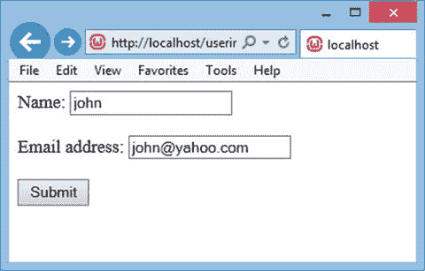

图 2-3. 提示输入姓名和电子邮件地址的表单

要创建这样的表单，请创建一个名为 `userinfo.php` 的 PHP 脚本，其代码如代码清单 2-5 所示。

代码清单 2-5. 用于输入姓名和电子邮件地址的表单 (`userinfo.php`)

```
<html>
    <head>
    </head>
    <body>
        <form action="display.php" method="Get">
            Name: <input type="text" name="name" /><br/><br/>
            Email address: <input type="text" name="email_add" /><br/><br/>
            <input type="submit" value="Submit" />
        </form>
    </body>
</html>
```

该表单有两个输入框，分别名为 `name` 和 `email_add`。表单的 `action` 指向一个 PHP 文件 `display.php`。用于传递数据（`name` 和 `email_add`）的 HTTP 方法是 GET。

要在脚本之间传递信息，有三个作为数据载体的数组：`$_GET`、`$_POST` 和 `$_REQUEST`。接下来你将逐一了解这些数组是如何用于传输数据的。

### 使用 `$_GET` 数组

`$_GET` 数组用于存储先前表单通过 HTTP GET 方法发送的数据。先前表单发送的数据以键值对的形式呈现：变量名和对应的值。

请参考代码清单 2-2 中所示的表单。当用户点击其中的“提交”按钮时，浏览器地址栏中的 URL 将显示如下：

`http://localhost/display.php?name=john&email_add=john@yahoo.com`

你可以看到，该 URL 显示了所有正在传递的信息。目标 PHP 脚本 `display.php` 现在可以通过代码从 `$_GET` 数组中提取数据，如代码清单 2-6 所示。

代码清单 2-6. 从 `$_GET` 数组访问信息的表单 (`display.php`)

```
<html>
    <head>
    </head>
    <body>
        Welcome <?php echo $_GET["name"]; ?>.<br>
        Your email address is <?php echo $_GET["email_add"]; ?>
    </body>
</html>
```

这段代码通过 `$_GET` 数组访问由 `userinfo.php` 传递的姓名和电子邮件地址，并将它们显示在屏幕上，如图 2-4 所示。

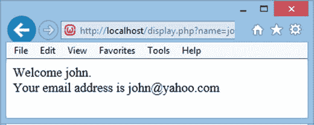

图 2-4. 在另一个表单上显示的用户姓名和电子邮件地址

### 使用 `$_POST` 数组

`$_POST` 数组用于收集通过 HTTP POST 方法从表单发送的值。要使用 POST 方法传递数据，你只需将在代码清单 2-2 所示的 `userinfo.php` 脚本中，表单的 `method` 属性中的 GET 替换为 POST 即可。

如前所述，在 POST 方法中，`$_POST` 数组收集表单中的值。这也意味着当用户点击“提交”按钮时，`$_POST["name"]` 和 `$_POST["email_add"]` 变量将自动填充他们在两个输入框中输入的数据。

要在目标 PHP 脚本 `display.php` 中显示姓名和电子邮件地址，你需要将 `$_GET` 数组替换为 `$_POST` 数组，如代码清单 2-7 所示。

代码清单 2-7. 从 `$_POST` 数组访问信息的表单 (`display.php`)

```
<html>
    <head>
    </head>
    <body>
        Welcome <?php echo $_POST["name"]; ?>.<br>
        Your email address is <?php echo $_POST["email_add"]; ?>
    </body>
</html>
```

除了 `$_GET` 和 `$_POST` 之外，还有一个用于存储当前表单信息的数组，它叫做 `$_REQUEST`。

### 使用 `$_REQUEST` 数组

`$_REQUEST` 数组包含 `$_GET` 和 `$_POST` 的内容。也就是说，它用于收集通过 GET 或 POST 方法发送数据的表单中的信息。

因此，如果你不确定源 PHP 脚本使用了哪种 HTTP 方法，明智的做法是使用 `$_REQUEST` 数组来访问信息。要在 `display.php` 脚本中通过 `$_REQUEST` 数组显示姓名和电子邮件地址，只需将（代码清单 2-7 中的）`$_POST` 替换为 `$_REQUEST`，如代码清单 2-8 所示。

代码清单 2-8. 从 `$_REQUEST` 数组访问信息的表单 (`display.php`)

```
<html>
    <head>
    </head>
    <body>
        Welcome <?php echo $_REQUEST["name"]; ?>.<br />
        Your email address is <?php echo $_REQUEST["email_add"]; ?>
    </body>
</html>
```

现在你已经了解了表单的创建方式以及可用的 HTTP 方法。一个表单的信息也可以传递到另一个表单。接下来，你将利用目前已掌握的知识，创建一个允许用户在网站上注册的注册表单。


## 创建注册表单

注册表单允许用户在您的网站上注册。注册表单通常提示用户输入电子邮件地址、密码、全名、地址、手机号码等信息。这些信息随后会存储在数据库中，以备将来使用。

一旦用户的数据存储在数据库中，他们无需重新输入。成功登录后，这些信息将自动获取。PHP 脚本 `signup.php` 如清单 2-9 所示。

**清单 2-9.** 用于创建新账户的注册表单 (`signup.php`)

```html
<html>
<head>
</head>
<body>
    <form action="addcustomer.php" method="post">
        <table border="0" cellspacing="1" cellpadding="3">
            <tr><td colspan="2" align="center">请输入您的信息</td></tr>
            <tr><td>电子邮件地址：</td><td><input size="20" type="text" name="emailaddress"></td></tr>
            <tr><td>密码：</td><td><input size="20" type="password" name="password"></td></tr>
            <tr><td>重新输入密码：</td><td><input size="20" type="password" name="repassword"></td></tr>
            <tr><td>全名：</td><td><input size="50" type="text" name="complete_name"></td></tr>
            <tr><td>地址：</td><td><input size="80" type="text" name="address1"></td></tr>
            <tr><td></td><td><input size="80" type="text" name="address2"></td></tr>
            <tr><td>城市：</td><td><input size="30" type="text" name="city"></td></tr>
            <tr><td>州/省：</td><td><input size="30" type="text" name="state"></td></tr>
            <tr><td>国家：</td><td><input size="30" type="text" name="country"></td></tr>
            <tr><td>邮政编码：</td><td><input size="20" type="text" name="zipcode"></td></tr>
            <tr><td>电话号码：</td><td><input size="30" type="text" name="phone_no"></td></tr>
            <tr><td><input type="submit" name="submit" value="提交"></td><td>
            <input type="reset" value="取消"></td></tr>
        </table>
    </form>
</body>
</html>
```

该 PHP 脚本的输出如图 2-5 所示。可以看到，页面上显示了多个文本框，供用户输入电子邮件地址、密码、全名、地址、城市、州/省、国家、邮政编码和电话号码。在各个文本框中输入的数据会被传递给 `addcustomer.php` 脚本，用于将信息存储到数据表中。表单通过 HTTP POST 请求方法提交。回顾一下，`$_POST` 是一个数组，用于存储通过 HTTP POST 方法发送的变量名和值。这也意味着，在 `addcustomer.php` 脚本中，新用户的信息将通过 `$_POST` 数组获取。

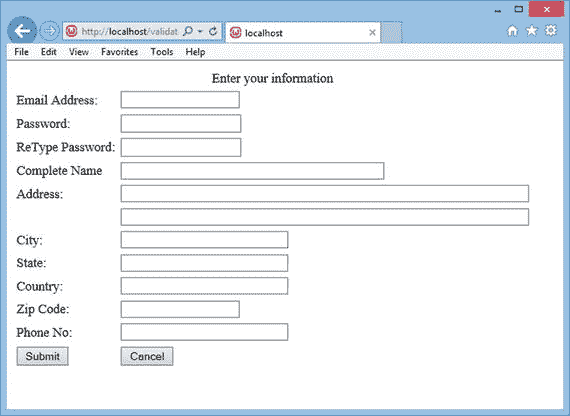

**图 2-5.** 用于创建新账户的注册表单

如果用户正确填写了电子邮件地址、密码等必要信息，这个 PHP 脚本似乎完全正常运行。但如果用户把某些必要的文本框留空了呢？

前面的 PHP 脚本没有应用验证检查。接下来，让我们学习如何为注册表单应用验证检查。

### 应用验证检查

为了向应用程序提供正确的输入，数据验证是必不可少的。数据验证是确保输入到 Web 表单中的数据正确且符合所需格式的过程。数据验证包括检查以下几点：

*   必填字段是否已输入数据。没有关键字段留空。
*   输入数据时是否出错。例如，数字字段中未输入文本，反之亦然。
*   数据是否以所需格式输入。例如，日期是否以要求的格式输入。

您将使用 JavaScript 为注册表单应用验证检查。PHP 脚本 `validatesignup.php` 如清单 2-10 所示。

**清单 2-10.** 用于创建新账户的注册表单 (`validatesignup.php`)

```html
<html>
<head>
<script language="JavaScript" type="text/JavaScript" src="checkform.js"></script>
</head>
<body>
<form action="addcustomer.php" method="post" onsubmit="return validate(this);">
<table border="0" cellspacing="1" cellpadding="3">
<tr><td colspan="2" align="center">请输入您的信息</td></tr>
<tr><td>电子邮件地址：</td><td><input size="20" type="text" name="emailaddress" ><span id="emailmsg"></span></td></tr>
<tr><td>密码：</td><td><input size="20" type="password" name="password" ><span id="passwdmsg"></span></td></tr>
<tr><td>重新输入密码：</td><td><input size="20" type="password" name="repassword"><span id="repasswdmsg"></span></td></tr>
<tr><td>全名：</td><td><input size="50" type="text" name="complete_name" ><span id="usrmsg"></span></td></tr>
<tr><td>地址：</td><td><input size="80" type="text" name="address1"></td></tr>
<tr><td></td><td><input size="80" type="text" name="address2"></td></tr>
<tr><td>城市：</td><td><input size="30" type="text" name="city"></td></tr>
<tr><td>州/省：</td><td><input size="30" type="text" name="state"></td></tr>
<tr><td>国家：</td><td><input size="30" type="text" name="country"></td></tr>
<tr><td>邮政编码：</td><td><input size="20" type="text" name="zipcode"></td></tr>
<tr><td>电话号码：</td><td><input size="30" type="text" name="phone_no"></td></tr>
<tr><td><input type="submit" name="submit" value="提交"></td><td>
<input type="reset" value="取消"></td></tr>
</table>
</form>
</body>
</html>
```

首先要提到的语句是将 JavaScript 文件 `checkform.js` 导入到当前网页中：

```html
<script language="JavaScript" type="text/JavaScript" src="checkform.js"></script>
```

由于本章使用了 JavaScript，因此需要对其进行简要介绍。

JavaScript 是一种编程语言，用于通过实现动态页面和执行验证检查来扩展网站的功能。JavaScript 的一些特性包括：

*   它是一种轻量级的、解释型编程语言。
*   它通常在客户端机器上执行，因此消耗更少的服务器资源，并避免了过多的服务器流量。
*   它响应速度非常快。由于它在客户端机器上处理和执行，因此其响应速度比其他服务器端脚本语言更快。
*   它相对容易学习，因为其语法接近英语。

JavaScript 文件 `checkform.js` 包含用于验证 `validatesignup.php` 文件中不同字段的代码。

在网页中包含 JavaScript 有两种方式：

*   将 JavaScript 放置在 `<head>` 元素中。
*   将 JavaScript 放在一个单独的文件中，以 `.js` 扩展名保存，然后使用 `<script>` 元素来包含该代码文件。（通过包含该 JavaScript 文件，其代码将在该位置合并到 HTML 中。）这种方法更可取，因为它能使 HTML 代码保持简洁，并将所有 JavaScript 代码集中在一处。


`onsubmit="return validate(this);"` 调用了 JavaScript 文件中的 `validate()` 函数，并将 `this`（即当前表单作为参数）传入，以便在 `validate` 函数中验证其所有字段。此外，只有当 `validate` 函数返回 `true` 时，表单才会提交并跳转到 `addcustomer.php` 脚本。如果该函数返回 `false`（即任何字段验证失败），则不会提交表单。相反，会显示错误信息，并提示用户修正该字段。

`<span id="emailmsg"></span>` 定义了一个带有 ID 的位置，该 ID 为 `emailmsg`，当用户在邮箱地址框中输入错误的邮箱地址时，将使用此位置显示错误信息。类似地，后续的输入框也定义了带有 ID 的位置：`passwdmsg`、`repasswdmsg` 和 `usrmsg`，以便在密码、确认密码和完整姓名字段验证失败时显示错误信息。

JavaScript 文件 `checkform.js` 对注册表单 `validatesignup.php` 应用验证检查。该文件如清单 2-11 所示。

### 清单 2-11. JavaScript 文件 (checkform.js)

```
function validate(userForm) {

div=document.getElementById("emailmsg"); // #1

div.style.color="red";                   // #2

if(div.hasChildNodes())                  // #3

{

div.removeChild(div.firstChild);     // #4

}

regex=/(^\w+\@\w+\.\w+)/;                // #5

match=regex.exec(userForm.emailaddress.value);

if(!match)

{

div.appendChild(document.createTextNode("Invalid Email"));   // #6

userForm.emailaddress.focus();       // #7

return false;                        // #8

}

div=document.getElementById("passwdmsg");

div.style.color="red";

if(div.hasChildNodes())

{

div.removeChild(div.firstChild);

}

if(userForm.password.value.length <=5)  // #9

{

div.appendChild(document.createTextNode("The password should be of at least size 6"));

userForm.password.focus();

return false;

}

div=document.getElementById("repasswdmsg");

div.style.color="red";

if(div.hasChildNodes())

{

div.removeChild(div.firstChild);

}

if(userForm.password.value != userForm.repassword.value) // #10

{

div.appendChild(document.createTextNode("The two passwords don’t match"));

userForm.password.focus();

return false;

}

var div=document.getElementById("usrmsg");

div.style.color="red";

if(div.hasChildNodes())

{

div.removeChild(div.firstChild);

}

if(userForm.complete_name.value.length ==0) // #11

{

div.appendChild(document.createTextNode("Name cannot be blank"));

userForm.complete_name.focus();

return false;

}

return true;

}
```

当点击“提交”按钮时，会调用 `validate()` 方法。该方法检查各个文本框中输入的数据是否正确。`document.getElementById()` 方法用于在网页表单中查找具有指定 ID 的对象。表单中任何位置放置的给定 ID 的对象都会通过此方法被搜索到。语句 #1 在网页表单上搜索 ID 为 `emailmsg` 的元素，并将其赋值给名为 `div` 的对象（名称可以是任意值）。语句 #2 将显示在 `emailmsg` ID 指定位置的内容设置为红色。

语句 #3 中的 `hasChildNodes()` 方法检查 `emailmsg` ID 位置是否已显示了一条消息。如果已经显示了一条错误消息，则通过语句 #4 中的 `removeChild()` 方法将其移除。语句 #5 中的正则表达式用于检查有效的邮箱地址。如果用户输入了无效的邮箱地址，语句 #6 会使用 `appendChild()` 方法在 `emailmsg` ID 位置显示错误消息 `"Invalid Email"`，如图 2-6 所示。`appendChild()` 方法用于将给定的节点附加到文档中。请记住，除非使用 `appendChild()` 方法将节点附加到文档中，否则节点永远不会在浏览器窗口中显示。子节点可以附加到任何元素上。

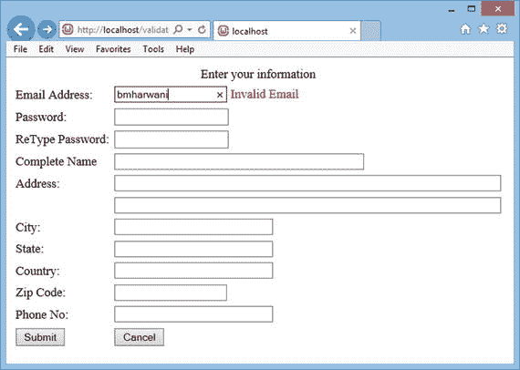

**图 2-6.** 输入无效邮箱地址后出现无效邮箱错误信息

因为输入了无效的邮箱地址，所以通过语句 #7 应用于邮箱地址框的 `focus()` 方法，将光标置于该框中，从而要求用户重新输入。语句 #8 返回 `false`，以便表单无法提交。只有当 `validate()` 方法返回 `true` 时，表单才能成功提交，而这只有在所有必填字段的数据均正确输入后才有可能实现。

语句 #9 确保输入的密码长度不小于 5。语句 #10 确保在“密码”和“确认密码”文本框中输入的密码完全相同。如果这两个密码不匹配，则会在 `repasswdmsg` ID 代表的位置显示 `"The two passwords don’t match"`（两次输入的密码不匹配）错误消息（参见图 2-7）。

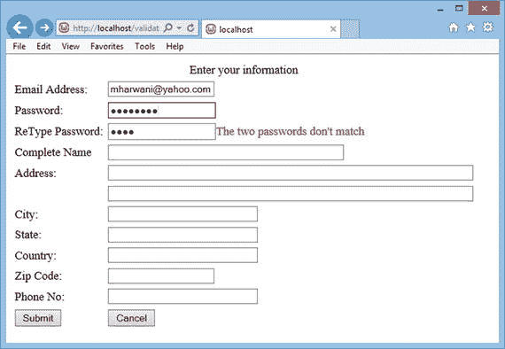

**图 2-7.** 如果两次输入的密码不匹配，则显示两次密码不匹配错误信息

语句 #11 确保用户没有将完整姓名字段留空。如果有任何验证检查失败，`validate()` 方法会返回 `false`。如果所需的文本框成功通过各项验证检查，验证方法则返回 `true`，从而表单被提交，输入的数据被传输到 `addcustomer.php` 脚本以保存到数据库表中。

为了通过 PHP 将数据保存到 MySQL 服务器的数据库表中，你需要了解 PHP 和 MySQL 之间是如何建立连接的。你将在下一节学习如何实现。

### 连接 PHP 与 MySQL 的代码

要连接到 MySQL 服务器，你需要使用有效的用户名和密码执行 `mysqli_connect()` 方法。建立连接的语法如下：

```
$variable = mysqli_connect("localhost", $user, $password, $database) or die ("Error Message.");
```

**注意：** PHP 和 MySQL 版本 5 的支持不再捆绑在标准 PHP 发行版中，因此你需要显式配置 PHP 以利用此扩展。

在上述语法中，`localhost` 表示 MySQL 服务器安装在本地机器上，但如果你要连接到远程服务器，此字符串将被替换为服务器的 IP 地址或服务器名称。`$user` 和 `$password` 包含管理员提供的有效用户 ID 和密码。变量 `$database` 代表你要连接并对其执行 SQL 语句以插入或获取所需信息的数据库。关键词 `die` 用于在信息有误时打印错误消息。以下示例将 root 用户连接到 `shopping` 数据库：

```
$connect = mysqli_connect("localhost", "root", "gold", "shopping") or die ("Please, check the server connection.");
```

此语句如果执行成功，将返回一个代表与 MySQL 服务器和指定数据库连接的对象。


#### 通过 PHP 执行 SQL 命令

建立与数据库的连接后，下一步任务就是在该数据库上执行所需的 SQL 语句。要在数据库上执行所需的 SQL 语句，需使用 `mysqli_query()` 方法，其语法如下：

```
$result = mysqli_query($connect, $sql) or die(mysql_error());
```

`$connect` 变量表示与 MySQL 服务器的连接，`$sql` 表示要在已连接的数据库上执行的 SQL 语句。`$result` 变量将存储 SQL 语句的执行结果。

清单 2-12 中的 PHP 脚本用于检查是否已建立与 MySQL 服务器的连接。

**清单 2-12.** `checkconnection.php` 脚本确认与 MySQL 服务器的连接是否已建立

```
<?php
    // 连接到数据库服务器
    $MySQLi = new MySQLi("localhost", "root", "gold", "shopping");
    if ($MySQLi->errno) {
        printf("无法连接到数据库：<br /> %s",$MySQLi->error);
        exit();
    }
else
    printf("已成功连接到 MySQL 服务器并打开了 shopping 数据库");
?>
```

在上述代码中，建立了与 MySQL 服务器的连接并选择了 `shopping` 数据库。连接成功后，您将看到如图 2-8 所示的消息。

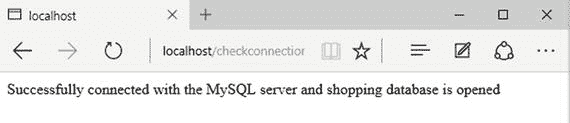

**图 2-8.** 消息确认已成功连接到 MySQL 服务器并打开了 `shopping` 数据库

##### 在数据库表中存储信息

用于在底层数据库表中存储新用户信息的 PHP 脚本如清单 2-13 所示。

**清单 2-13.** `addcustomer.php` 脚本将客户信息保存到数据库表中

```
<?php
$connect = mysqli_connect("localhost", "root", "gold", "shopping") or die ("请检查服务器连接。");
$email_address = $_POST['emailaddress'];
$password = $_POST['password'];
$repassword = $_POST['repassword'];
$completename = $_POST['complete_name'];
$address1 = $_POST['address1'];
$address2 = $_POST['address2'];
$city = $_POST['city'];
$state = $_POST['state'];
$country = $_POST['country'];
$zipcode = $_POST['zipcode'];
$phone_no = $_POST['phone_no'];
$sql = "INSERT INTO customers (email_address, password, complete_name, address_line1, address_line2, city, state, zipcode, country, cellphone_no) VALUES ('$email_address',(PASSWORD('$password')), '$completename', '$address1','$address2','$city', '$state', '$zipcode', '$country', '$phone_no')";
$result = mysqli_query($connect, $sql) or die(mysql_error());
if ($result)
{
?>
    <p>
    尊敬的，<?php echo $completename; ?> 您的账户已成功创建
<?php
}
else
{
    echo "发生了一些错误。请使用不同的邮箱地址";
}
?>
```

此 PHP 脚本将用户通过 `validatesignup.php` 脚本（参见清单 2-10）显示的网络表单中输入的信息保存到 `shopping` 数据库的 `customers` 表中。回顾一下，在第 1 章中，您创建了 `shopping` 数据库以及该电子商务网站所需的不同表。

您可以看到，首先建立了与 MySQL 服务器的连接并选择了 `shopping` 数据库。用户输入的 `validatesignup.php` 脚本中的信息被赋值给 `$_POST` 数组。然后检索 `$_POST` 数组中的信息并存储到不同的变量中。之后，执行一条在 `customers` 表中插入记录的 SQL 语句，并通知用户账户创建成功，如图 2-9 所示。

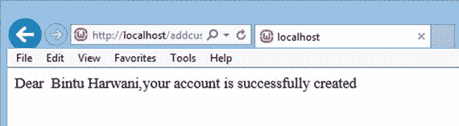

**图 2-9.** 消息确认用户账户创建成功

##### 从数据库访问信息

存储在数据库中的信息是为了将来使用。这意味着您可以在需要时从数据库访问信息。要从数据库访问信息，可使用以下四种方法：

*   `mysqli_num_rows()` — 返回给定记录集中的行数。
*   `mysqli_affected_rows()` — 返回受指定 SQL 命令影响的行数。
*   `mysqli_fetch_array()` — 一次从给定记录集中返回一行。
*   `extract()` — 提取指定行中的列或字段。

让我们详细讨论这些方法。

###### `mysqli_num_rows()`

`mysqli_num_rows()` 方法返回指定记录集中存在的行数。使用此方法的语法如下：

```
int mysqli_num_rows(recordset)
```

其中 `recordset` 表示通过 `mysqli_query()` 方法执行 SQL `SELECT` 语句后检索到的记录或行。

###### `mysqli_affected_rows()`

`mysqli_affected_rows()` 方法返回指定 SQL 查询中执行的 `DELETE`、`INSERT`、`REPLACE` 或 `UPDATE` 语句影响的行数。此方法应在通过 `mysqli_query()` 方法执行 SQL 语句后立即使用。使用此方法的语法如下：

```
int mysqli_affected_rows()
```

###### `mysqli_fetch_array()`

`mysqli_fetch_array()` 函数一次从指定的记录集或行数组中取出一行。它从给定记录集中获取一行并返回 `true`。每行以关联数组或数字数组的形式返回。当记录集中没有更多行时，该函数返回 `false`。使用此方法的语法是：

```
row = mysqli_fetch_array(recordset, array_type)
```

其中 `recordset` 表示执行 `mysqli_query()` 函数后返回的行。

`array_type` 参数是可选的，它表示取出的行需要返回的数组格式。该参数的可用选项有：

*   `MYSQL_ASSOC` — 以关联数组格式返回一行。
*   `MYSQL_NUM` — 以数字数组格式返回一行。
*   `MYSQL_BOTH` — 默认值。返回一个既可以作为关联数组又可以作为数字数组使用的行。也就是说，返回的数组同时具有关联和数字索引。

取出一行后，`mysqli_fetch_array()` 函数会自动移动到记录集中的下一行。每次后续调用此函数都会返回指定记录集中的下一行。例如，以下语句从指定的 `$result`（即记录集）中取出一行，并以关联数组格式返回该行：

```
$row = mysqli_fetch_array($result, MYSQLI_ASSOC)
```

###### `extract()`

`extract()` 函数提取指定数组或行中存储的所有变量或列。使用此方法的语法如下：

```
extract(array/row)
```

例如，这会提取指定行中的所有列：

```
extract($row);
```

现在让我们看看如何应用这些方法来验证用户身份。


## 实现身份验证

对用户进行身份验证意味着判断访问者是否已在电子商务网站上注册。实现身份验证包含两个步骤：

您已经学习了如何显示并执行一个脚本，让访问者能够在您的网站上注册并创建账户。为了验证访问者是否已注册，系统会提供一个登录表单，提示他们输入有效的电子邮件地址和密码。当用户输入电子邮件地址和密码后，点击登录表单中的“提交”按钮，就会被引导至另一个脚本，该脚本访问 `customers` 表，并确认是否存在与所提供电子邮件地址和密码匹配的客户（行）。如果存在与指定电子邮件地址和密码匹配的客户，则表明该访问者已在您的网站注册，屏幕上将显示一条欢迎消息。如果 `customers` 表中没有与所提供电子邮件地址和密码匹配的行，则表明该访问者尚未在您的网站注册，或输入了错误的信息。因此，系统会向访问者提供两个链接供其选择——一个引导他们创建新账户，另一个允许他们重新尝试登录。

名为 `signin.php` 的 PHP 脚本如代码清单 2-14 所示。它执行实现身份验证的第一步——显示登录表单。

**代码清单 2-14.** 用于显示登录表单的 `signin.php` 脚本

```
<html>
<head>
</head>
<body>
<form action="validateuser.php" method="post">
<table border="0" cellspacing="1" cellpadding="3">
<tr><td>电子邮件地址：</td><td><input type="text" name="emailaddress"></td></tr>
<tr><td>密码：</td><td><input type="password" name="password"></td></tr>
<tr><td colspan=2 align="center"><input type="submit" name="submit" value="登录"></td></tr>
</table>
</form>
</body>
</html>
```

该脚本向访问者显示两个文本框，一个用于输入电子邮件地址，另一个用于输入密码（见图 2-10）。用户输入电子邮件地址和密码并点击“提交”后，表单中输入的信息将被赋值给 `$_POST` 数组，并发送至 `validateuser.php` 脚本，以检查 `customers` 表中是否存在与所提供电子邮件地址和密码匹配的用户。

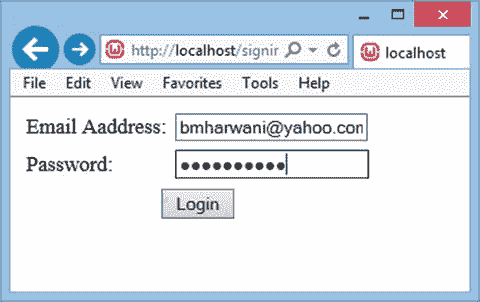

**图 2-10.** 提示用户输入有效电子邮件地址和密码的登录表单

名为 `validateuser.php` 的 PHP 脚本如代码清单 2-15 所示。它执行身份验证的第二步——验证访问者输入的信息是否有效。

**代码清单 2-15.** 用于对用户进行身份验证的 `validateuser.php` 脚本

```
<html>
<head>
</head>
<body>
<?php
$connect = mysqli_connect("localhost", "root", "gold", "shopping") or die("请检查您的服务器连接。");
$query = "SELECT email_address, password, complete_name FROM customers WHERE email_address like '" . $_POST['emailaddress'] . "' " .
"AND password like (PASSWORD('" . $_POST['password'] . "'))";
$result = mysqli_query($connect, $query) or die(mysql_error());
if (mysqli_num_rows($result) == 1) {
while ($row = mysqli_fetch_array($result, MYSQLI_ASSOC)) {
extract($row);
echo "欢迎 " . $complete_name . " 来到我们的购物中心<br>";
}
}
else {
?>
无效的电子邮件地址和/或密码<br>
尚未注册？
<a href="validatesignup.php">点击此处</a> 进行注册。<br><br><br>
想要重试？<br>
<a href="signin.php">点击此处</a> 重新登录。<br>
<?php
}
?>
</body>
</html>
```

如预期那样，建立了与 MySQL 服务器的连接，并选择了 `shopping` 数据库。编写了一条 SQL 语句用于在 `customers` 表中搜索。该 SQL 语句检查 `customers` 表中是否存在任何一行的电子邮件地址和密码与 `$_POST` 数组中的电子邮件地址和密码匹配。回想一下，通过 `signin.php` 脚本显示的表单中输入的电子邮件地址和密码会被赋值给 `$_POST` 数组，并导航至 `validateuser.php`。

如果 `customers` 表中存在与所提供电子邮件地址和密码匹配的客户，则会向用户显示一条欢迎消息（见图 2-11 — 底部）。

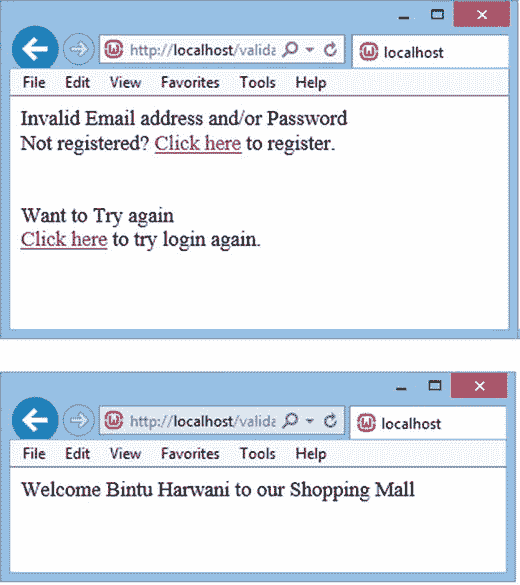

**图 2-11.** 输入错误的电子邮件地址或密码时出现的消息（顶部）以及输入正确的电子邮件地址和密码时显示的欢迎消息（底部）

如果 `customers` 表中不存在（与访问者的电子邮件地址和密码匹配的）行，则假定访问者尚未注册，或输入了无效的电子邮件地址或密码。因此，会向访问者显示两个链接供其选择——一个用于创建新账户（`validatesignup.php`），另一个用于重新尝试登录（`signin.php`）（见图 2-11 — 顶部）。

## 本章小结

在本章中，您学习了如何编写和运行您的第一个 PHP 脚本。您还了解了信息如何从一个脚本传递到另一个脚本。您学习了通过创建注册表单从用户那里获取信息。为了存储新客户的信息，您学习了在 PHP 和 MySQL 服务器之间建立连接所需的方法。

您学习了创建和执行用于将用户信息存储在 `customers` 表中的脚本。最后，您学习了从数据库访问信息所需的方法，并利用这些知识对用户进行身份验证（通过创建登录脚本）。

在下一章中，您将学习如何访问 `products` 表并显示其中的产品列表。此外，您还将学习显示产品图片。您将学习在电子商务网站上实现搜索框，以便访问者快速搜索所需产品，记住访问者的喜好，最后，您还将学习会话处理。

