# 3. 使用 PHP 访问数据库

电子补充材料 本章的在线版本 (doi:[10.1007/978-1-4842-1672-9_3](http://dx.doi.org/10.1007/978-1-4842-1672-9_3)) 包含补充材料，可供授权用户使用。

在电子商务网站上，将产品信息与其图片并列显示，并且信息尽可能详细，这一点至关重要。由于产品数量可能非常庞大，这些信息都存储在数据库中。回想一下，您已经创建了一个包含多个产品的 `products` 表，这些产品被分类到不同的区域。本章首先解释如何从 `products` 表中访问产品信息并将其显示在屏幕上。

在本章中，您将学习以下内容：

*   访问产品并显示在屏幕上

*   创建下拉菜单

*   显示特定类别的产品

*   添加网站页眉

*   实现搜索功能

*   显示产品详情

*   会话处理

*   登录与登出

*   定义网站主页

## 访问产品并将其显示在屏幕上

你已经学习了用于与 MySQL 服务器建立连接以及打开数据库以执行操作的函数。你还学习了在指定数据库上执行 SQL 查询的过程。如清单 3-1 所示的 `allitemslist.php` 脚本，使用这些函数从 `products` 表中访问产品信息，并以表格形式将其显示在屏幕上。

**清单 3-1.** 用于显示 `products` 表中项目的 `allitemslist.php` 脚本

```php
<html>
<head>
</head>
<body>
<?php
$connect = mysqli_connect("localhost", "root", "gold", "shopping") or die("请检查您的服务器连接。");
$query = "SELECT item_code, item_name, description, imagename, price FROM products";
$results = mysqli_query($connect, $query) or die(mysql_error());
echo "<table border=\"0\">";
$x=1;
echo "<tr>";
while ($row = mysqli_fetch_array($results, MYSQLI_ASSOC))  {
if ($x <= 3)
{
$x = $x + 1;
extract($row);
echo "<td style=\"padding-right:15px;\">";
echo "<a href=itemdetails.php?itemcode=$item_code>";
echo '</img><br/>';
echo $item_name .'<br/>';
echo "</a>";
echo '$'.$price .'<br/>';
echo "</td>";
}
else
{
$x=1;
echo "</tr><tr>";
}
}
echo "</table>";
?>
</body>
</html>
```

这段代码首先以用户 `root` 身份连接到 MySQL 服务器，并选择 `shopping` 数据库。然后，编写一条 SQL 语句，用于检索 `products` 表中的所有行。执行 SQL 查询，从 `products` 表中获取数据行，并将其赋值给 `$results` 数组。之后，借助 `while` 循环，每次从 `$results` 数组中取出一行，并将产品信息以表格形式显示在屏幕上（参见图 3-1）。变量 `x` 用于确保每行显示三个产品。

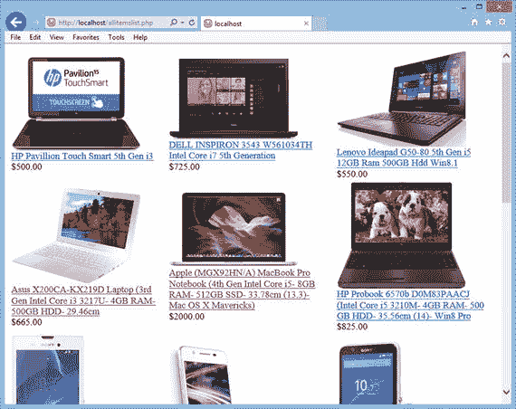

**图 3-1.** `products` 表中的所有项目及其图片一同显示

为了链接到不同的网页，使用户能够从网站访问所需的信息，你需要创建一个下拉菜单。我们来看看如何实现。

## 创建下拉菜单

假设你的网站销售电子产品、家居家具产品和书籍，那么下拉菜单需要提供指向这些产品分类的链接。同时，假设该网站销售智能手机、笔记本电脑、相机和电视，这些产品类别必须归在电子产品分类下。如清单 3-2 所示的 `menu.php` 文件，定义了一个提供指向这些产品类别链接的下拉菜单。

**清单 3-2.** 用于显示电子商务网站下拉菜单的 `menu.php` 脚本

```html
<!DOCTYPE html>
<head>
<meta charset="utf-8">
<title>宾图在线集市</title>
<link rel="stylesheet" href="css/style.css">
</head>
<body>
<div class="container">
<nav>
<ul class="nav">
<li><a href="index.php">首页</a></li>
<li class="dropdown">
<a href="index.php">电子产品</a>
<ul>
<li><a href="itemlist.php?category=CellPhone">智能手机</a></li>
<li><a href="itemlist.php?category=Laptop">笔记本电脑</a></li>
<li><a href="index.php">相机</a></li>
<li><a href="index.php">电视</a></li>
</ul>
</li>
<li class="dropdown">
<a href="index.php">家居 & 家具</a>
<ul class="large">
<li><a href="index.php">厨房用品</a></li>
<li><a href="index.php">卫浴用品</a></li>
<li><a href="index.php">家具</a></li>
<li><a href="index.php">餐具与盛具</a></li>
<li><a href="index.php">炊具</a></li>
</ul>
</li>
<li><a href="index.php">图书</a></li>
</ul>
</nav>
</div>
<p>
```

你可以在这段代码中看到，下拉菜单是使用无序列表元素制作的。该菜单包含四个主要部分：首页、电子产品、家居 & 家具和图书。电子产品菜单有四个子菜单选项——智能手机、笔记本电脑、相机和电视。类似地，家居 & 家具菜单显示了不同的子菜单选项。当用户通过任何子菜单选项选择了产品类别后，页面将导航到名为 `itemlist.php` 的 PHP 脚本。他们所选的产品类别也会被发送到 `itemlist.php` 脚本，该脚本进而从数据库表中获取该类别下的所有产品，并将其显示在屏幕上。

为了在下拉菜单以及鼠标悬停时的菜单选项上应用前景色和背景色，该脚本使用了一个名为 `style.css` 的层叠样式表。该样式表已链接到脚本中。接下来是 CSS 的简要介绍。

### CSS

CSS 代表层叠样式表，其中包含网站的不同样式、布局、字体和颜色。使用样式表的优点包括：

-   所有样式都保存在一个地方，因此易于维护。要更改某个元素的样式，无需搜索整个网站，只需在一个地方进行编辑即可。

-   可以非常轻松地更改网站的布局和设计。

-   通过 CSS 应用样式可以使代码更高效，并减少网站加载时间。

回到本网站，清单 3-3 显示了在 `style.css` 文件中定义的样式。

**清单 3-3.** `style.css` 样式表文件为电子商务网站的不同 HTML 元素应用样式

```markdown
# 下拉菜单与产品列表

这段代码为下拉菜单赋予了动态外观。清单 3-3 所示的 CSS 样式实现了以下功能：

-   设置图片的高度和宽度
-   隐藏有序列表和无序列表的列表项标记（圆形、方形等）
-   设置下拉菜单的高度和底部边框
-   设置下拉菜单的宽度和边距
-   移除菜单和子菜单中显示的链接的默认下划线
-   设置列表项（即子菜单选项）在下拉菜单中向左浮动，并保留右侧的外边距
-   设置文本的高度、内边距（相对于下拉框边界）、前景色和背景色，并移除链接的默认下划线
-   设置当鼠标悬停在菜单和子菜单选项上时文本的背景色和前景色

使用`style.css`中应用了 CSS 样式的`menu.php`脚本运行时，你将得到图 3-2 所示的下拉菜单。

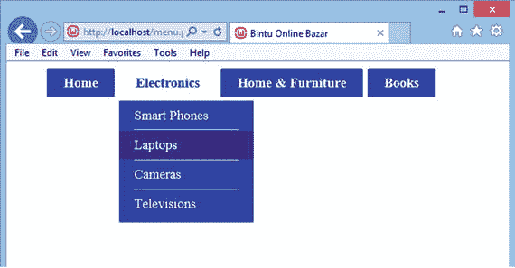

图 3-2. 显示不同产品类别的下拉菜单

清单 3-1 中所示的`allitemslist.php`脚本会显示`products`表中定义的所有产品。该脚本运行良好，但用户会花费大量时间在列表中搜索他们想要的产品。那么，只显示用户从下拉菜单中选择的类别的产品如何？

清单 3-4 中所示的`itemlist.php`脚本正实现了此功能。它只显示用户从下拉菜单中选择其类别的产品。

## 清单 3-4. 用于显示从下拉菜单中选择类别的产品的`itemlist.php`脚本

```php
<?php

include('menu.php');

$connect = mysqli_connect("localhost", "root", "gold", "shopping") or die("请检查您的服务器连接。");

$category=$_REQUEST['category'];

$query = "SELECT item_code, item_name, description, imagename, price FROM products " .
         "where category like '$category' order by item_code";

$results = mysqli_query($connect, $query) or die(mysql_error());

echo "<table border=\"0\">";

$x=1;

echo "<tr>";

while ($row = mysqli_fetch_array($results, MYSQLI_ASSOC))  {
  if ($x <= 3) {  // #1
    $x = $x + 1;
    extract($row);
    echo "<td style=\"padding-right:15px;\">";
    echo "<a href=itemdetails.php?itemcode=$item_code>";  // #2
    echo '</img><br/>';
    echo $item_name .'<br/>';
    echo "</a>";
    echo '$'.$price .'<br/>';
    echo "</td>";
  } else {
    $x=1;
    echo "</tr><tr>";
  }
}

echo "</table>";

?>

</body>

</html>
```

在脚本顶部，包含了另一个名为`menu.php`的脚本，以使下拉菜单出现在网站中。回顾一下，`menu.php`显示不同的产品类别。当用户选择一个类别时，导航会跳转到`itemlist.php`文件，同时所选的产品类别也会被传递。

所选的产品类别通过`$_REQUEST`数组访问，并赋值给类别变量。

不出所料，建立到 MySQL 服务器的连接，以用户`root`身份登录，并选择`shopping`数据库来执行操作。执行一个 SQL 查询，从`products`表中获取与用户选择的类别相匹配的所有产品。获取到的行被赋值给`results`记录集。从`results`记录集中，产品被逐个赋值并显示在屏幕上。

此脚本设置为每行只显示三个产品；因此，使用变量`x`（参见语句#1）使得每行仅显示三个产品。您始终可以更改变量`x`的值，以显示您希望在一行中展示的产品数量。

所显示的信息是产品图片、名称和价格。为了让用户能够查看详细的产品信息，通过语句#2 在产品图片和名称上创建了超链接。这意味着，如果用户点击任何产品的图片或名称，导航将跳转到`itemdetails.php`脚本，该脚本将显示该产品的更多详细信息。在导航到`itemdetails.php`脚本时，所选产品的代码也会被传递。而`itemdetails.php`脚本将使用该产品代码从`products`表中获取更多产品信息，例如其描述和特性。产品以图 3-3 所示的格式显示。您可以看到每行只显示三个产品，并且产品图片和名称上已创建超链接。

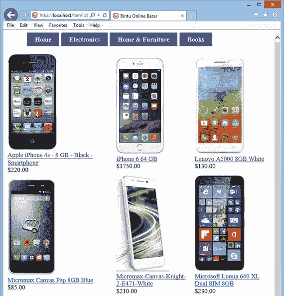

图 3-3. 显示网站上所有在售智能手机的网页

查看图 3-3 所示的输出时，您会发现缺少了一些重要的东西，那就是网站页眉。页眉不仅显示网站名称和搜索框，还展示了常用的图标和链接。

## 添加网站页眉

为了显示网站页眉，您需要修改清单 3-2 中显示的 `menu.php` 脚本，使其变成清单 3-5 中显示的 `topmenu.php` 脚本。只有加粗的代码是新增的；其余代码与您在清单 3-2 中看到的相同。

### 清单 3-5. 用于显示电子商务网站页眉（包括下拉菜单）的 `topmenu.php` 脚本
```

```html
<!DOCTYPE html>
<head>
<meta charset="utf-8">
<title>Bintu Online Bazar</title>
<link rel="stylesheet" href="css/style.css">
</head>
<body>
<table  width="100%" cellspacing="0" cellpadding="2">
<col style="width:30%">
<col style="width:40%">
<col style="width:20%">
<tr><td style="background-color:cyan;color:Blue;"></td><td style="background-color:cyan;color:Blue;"></td><td style="background-color:cyan;color:Blue;">
<tr><td style="font-size: 35px;color:blue;background-color:cyan;"> <!-- #1 -->
<b>Bintu Online Bazar</b></font></td>
<td bgcolor="cyan">
<form  method="post" action="searchitems.php"> <!-- #2 -->
<input  size="50" type="text" name="tosearch">
<input  type="submit" name="submit" value="Search">
</form></td>
<td bgcolor="cyan" ><a href="cart.php"></img><span id="cartcountinfo"></span></a> <!-- #3 -->
</td></tr>
</table>
<div class="container">
<nav>
<ul class="nav">
<li><a href="index.php">Home</a></li>
<li class="dropdown">
<a href="index.php">Electronics</a>
<ul>
<li><a href="itemlist.php?category=CellPhone">Smart Phones</a></li>
<li><a href="itemlist.php?category=Laptop">Laptops</a></li>
<li><a href="index.php">Cameras </a></li>
<li><a href="index.php">Televisions</a></li>
</ul>
</li>
<li class="dropdown">
<a href="index.php">Home & Furniture</a>
<ul class="large">
<li><a href="index.php">Kitchen Essentials</a></li>
<li><a href="index.php">Bath Essentials</a></li>
<li><a href="index.php">Furniture</a></li>
<li><a href="index.php">Dining & Serving</a></li>
<li><a href="index.php">Cookware</a></li>
</ul>
</li>
<li><a href="index.php">Books</a></li>
</ul>
</nav>
</div>
<p>
```

为了显示页眉，定义了一个包含三列的 `table` 元素。为了显示网站标题、搜索框和购物车图标，各列的宽度按比例定义为 30%、40% 和 20%。表格的背景色设置为青色，前景色设置为蓝色。为了显示网站标题“Bintu Online Bazar”，通过语句 #1 将字体大小设置为 35px。当用户点击“搜索”按钮时，语句 #2 将用户导航到 `searchitems.php` 脚本。用户在搜索框中输入的文本也通过 `$_POST` 数组传递给 `searchitems.php` 脚本。

在搜索框之后，通过语句 #3 显示了一个购物车图标。该图标的宽度和高度设置为 30px。点击购物车图标，将导航到 `cart.php` 脚本，该脚本进而显示购物车中所选产品的信息。span 的 ID `cartcountinfo` 将用于显示购物车中选择的产品数量。

当执行 `topmenu.php` 脚本时，会显示如图 3-4 所示的网站页眉。


**图 3-4.** 网站页眉，显示标题、搜索框以及带下拉菜单的购物车图像

您的大多数网站访问者不会有足够的时间浏览您销售的全部产品。他们只想搜索他们想要的产品并立即在屏幕上查看其详细信息。要添加此功能，您必须为您的网站添加一个搜索框，您将在下一节中学习如何操作。

## 实现搜索功能

回想一下，您已经在网站页眉中添加了一个搜索框。用户可以在搜索框中输入文本，然后单击“搜索”按钮。系统将搜索整个 `products` 表以查找指定的文本，并且所有包含该文本的产品（无论是在其名称、描述、特性还是其他方面）都将显示在屏幕上。

清单 3-6 中显示的 `searchitems.php` 脚本会在 `products` 表的所有列中搜索搜索框中输入的文本。如果该文本出现在任何列中，则该行将显示在屏幕上。

**清单 3-6.** `searchitems.php` 脚本显示与搜索框中输入的文本匹配的商品

```php
<?php
include('topmenu.php');
$connect = mysqli_connect("localhost", "root", "gold", "shopping") or die("请检查您的服务器连接。");
$tosearch=$_POST['tosearch'];
$query = "select * from products where ";
$query_fields = Array();
$sql = "SHOW COLUMNS FROM products";                                                   // #1
$columnlist = mysqli_query($connect, $sql) or die(mysql_error());                      // #2
while($arr = mysqli_fetch_array($columnlist, MYSQLI_ASSOC)){                           // #3
    extract($arr);
    $query_fields[] = $Field . " like('%". $tosearch . "%')";
}
$query .= implode(" OR ", $query_fields);
$results = mysqli_query($connect, $query) or die(mysql_error());
echo "<table border=\"0\" >";
$x=1;
echo "<tr>";
while ($row = mysqli_fetch_array($results, MYSQLI_ASSOC))  {
    if ($x <= 3)
    {
        $x = $x + 1;
        extract($row);
        echo "<td style=\"padding-right:15px;\">";
        echo "<a href=itemdetails.php?itemcode=$item_code>";
        echo '</img><br/>';
        echo $item_name .'<br/>';
        echo "</a>";
        echo '$'.$price .'<br/>';
        echo "</td>";
    }
    else
    {
        $x=1;
        echo "</tr><tr>";
    }
}
echo "</table>";
?>
```

在顶部包含了`topmenu.php`脚本以显示网站页眉和下拉菜单。代码首先作为用户`root`连接到MySQL服务器，并选择`shopping`数据库来执行操作。访问用户在`topmenu.php`脚本的搜索框中输入的文本，并将其赋值给`tosearch`变量。

因为您希望在`products`表的所有列中搜索`tosearch`变量中的文本，所以会访问`products`表的所有列名（参见语句 #1），并通过语句 #2 将它们赋值给`columnlist`变量。使用`while`循环，创建一个SQL查询，该查询会访问`products`表的每一列，并检查其中是否包含所需的文本（参见语句 #3）。执行该SQL查询后，所有在任何列中包含所搜索文本的产品都会显示在屏幕上。例如，如果您在搜索框中输入`lenovo`，您将获得所有包含该文本的产品，如图 3-5 所示。

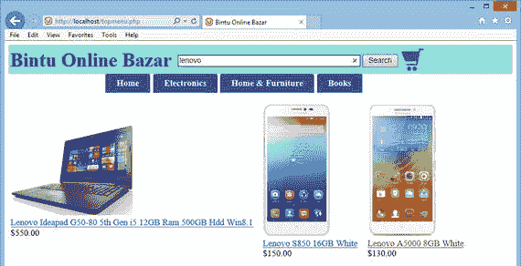

**图 3-5.** 显示与搜索框中输入的文本相匹配的产品的网页

本章中您创建的所有脚本都只显示产品的最少信息——产品图片、名称和价格。如果用户想查看产品的更多详细信息该怎么办？

## 显示产品详情

那么，如何显示额外的产品详情，比如描述和不同的功能特性呢？回想一下第 1 章的内容，关于产品的所有信息——包括其代码、名称、价格、描述等——都存储在`products`表中。产品的功能特性则存储在一个名为`productfeatures`的独立表中。脚本`itemdetails.php`（如代码清单 3-7 所示）会显示所选产品的详细信息。

代码清单 3-7. `itemdetails.php`脚本显示所选项目的详细信息

```php
<?php

include('topmenu.php');

$connect = mysqli_connect("localhost", "root", "gold", "shopping") or die("请检查服务器连接。");

$code=$_REQUEST['itemcode'];

$query = "SELECT item_code, item_name, description, imagename, price FROM products " .
    "where item_code like '$code'";

$results = mysqli_query($connect, $query) or       die(mysql_error()); // #1

$row = mysqli_fetch_array($results, MYSQLI_ASSOC);

extract($row);

echo "<table width=\"100%\" cellspacing=\"0\" cellpadding=\"5\">";
echo "<tr><td style=\"padding: 3px;\" rowspan=\"6\">";
echo '</img></td>';
echo "<td colspan=\"2\" align=\"center\" style=\"font-family:verdana; font-size:150%;\"><b>";
echo $item_name;
echo "</b></td></tr><tr><td colspan=\"2\"><table><tr><td>";
$itemname=urlencode($item_name);
$itemprice=$price;
$itemdescription=$description;
$pfquery = "SELECT feature1, feature2, feature3, feature4, feature5, feature6 FROM productfeatures " .
    "where item_code like '$code'";                                                        // #2
$pfresults = mysqli_query($connect, $pfquery) or die(mysql_error());
$pfrow = mysqli_fetch_array($pfresults, MYSQLI_ASSOC);
extract($pfrow);
echo $feature1;
echo "</td><td>";
echo $feature2;
echo "</td></tr><tr><td>";
echo $feature3;
echo "</td><td>";
echo $feature4;
echo "</td></tr><tr><td>";
echo $feature5;
echo "</td><td>";
echo $feature6;
echo "</td></tr><tr>";
echo "<form method=\"POST\" action=\"cart.php?action=add&icode=$item_code&iname=$itemname&iprice=$itemprice\">";
echo "<td colspan=\"2\" style=\"font-family:verdana; font-size:150%;\">";
echo " 数量: <input type=\"text\" name=\"quantity\" size=\"2\">   价格: " . $itemprice;
echo "</td></tr><tr><td  colspan=\"2\"><input type=\"submit\" name=\"buynow\" value=\"立即购买\" style=\"font-size:150%;\">";
echo "      <input type=\"submit\" name=\"addtocart\" value=\"加入购物车\" style=\"font-size:150%;\"></td>";
echo"  </form>";
echo "</tr></table></table>";
echo "<p  style=\"font-size:140%;\">描述</p>";
echo $itemdescription;
?>
```

在与SQL服务器建立连接并选择了`shopping`数据库之后，将获取由`itemlist.php`和`searchitems.php`脚本发送过来的产品代码，并将其赋值给代码变量。回想一下，`itemlist.php`和`searchitems.php`脚本会显示包含产品图片、名称和价格的产品列表。当用户点击任何产品的图片或名称时，用户会被导航到`itemdetails.php`脚本，并且所选产品的代码也会被发送到该脚本。

语句 #1 执行SQL命令，访问与产品代码匹配的产品的项目名称、描述、图片名称和价格。

获取到的产品信息会显示在屏幕上。除了产品的描述和价格，你还想显示其功能特性。因此，语句 #2 定义了一条SQL语句，该语句从`productfeatures`表中访问`feature1`、`feature2`等列。该SQL语句被执行，产品的功能特性便显示在屏幕上。

在产品特性下方，提供了一个文本框，以便用户输入所需产品的数量。当用户按下“加入购物车”按钮时，用户输入的数量会被赋值给`quantity`变量，并连同该商品的`item_code`、`item_name`和`price`一起发送到`cart.php`脚本。

当用户点击任何产品图片或名称时，会从`itemlist.php`和`searchitems.php`脚本执行`itemdetails.php`脚本。点击任何产品图片或名称后，其详细信息将显示出来，如图 3-6 所示。

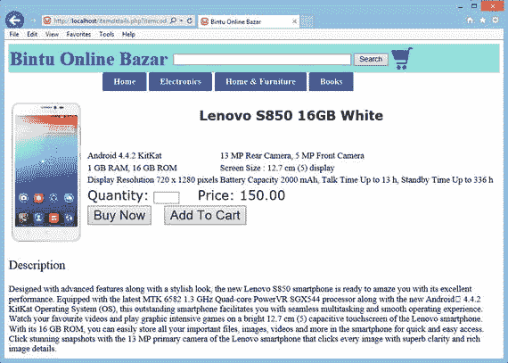

图 3-6. 显示所选产品详细信息的网页

学习了显示产品及其信息的技术后，接下来你将了解网站如何记住用户信息。

## 会话处理

由于HTTP是一种无状态协议，浏览器和Web服务器之间的交互是无状态的。这意味着浏览器发送给Web服务器的每个HTTP请求都独立于任何其他请求。HTTP的无状态特性允许用户通过跟踪超文本链接并以任意顺序访问页面来浏览网页。HTTP还允许应用程序跨多个服务器分发甚至复制内容，以平衡大量请求产生的负载。这些特性之所以成为可能，正是因为HTTP的无状态特性。

HTTP 无状态的缺点在于，网页不会记住用户的信息。如果用户在一个网页上输入了一些信息，然后转到另一个页面，那些数据就会丢失。例如，如果用户已通过登录页面登录，当用户点击某个链接并导航到另一个页面时，该登录信息就会丢失。为了在网页之间记住某些数据，比如特定用户在购物车中选择的商品，网站必须使用会话处理。会话使得用户信息能够存储在服务器内存中。它可以存储任何类型的对象以及自定义对象。会话数据是为每个客户端分别存储的。

由于 HTTP 是一种无状态协议，为了跟踪用户，需要将会话 ID 与用户持续关联起来。这种关联通过以下方法实现：

- **Cookies** — 当客户端首次连接到服务器时，服务器会在客户端机器上放置 cookies。在随后的每一个请求中，服务器都使用 cookies 来识别用户及其设置。

- **URL 重写** — 会话 ID 通常会被附加到 URL 的查询字符串中，如下例所示：`http://www.bmharwani.com/productdetails.php;jsessionid=2243781FG55544K1`

- **隐藏字段** — 在 Web 表单中嵌入一个隐藏字段，其中包含会话 ID。通过提取隐藏字段中的会话 ID 来识别用户。

让我们快速了解一下会话处理中所需的不同函数。

### 会话处理中使用的函数

会话由两部分组成：一个包含所有你想存储数据的服务器端文件，以及一个包含对服务器数据引用的客户端 cookie。该文件和客户端 cookie 都是通过 `session_start()` 函数创建的，具体情况如下所述。

#### `session_start()`

`session_start()` 函数用于初始化会话数据。它会基于当前的会话 ID 创建一个新会话，或恢复现有会话。该函数的语法如下：

`bool session_start ( void )`

此函数始终返回 `true`。如果你想使用一个指定的会话名称，必须在调用 `session_start()` 之前先调用 `session_name()` 函数。

当调用 `session_start()` 时，PHP 会检查访问者是否发送了会话 cookie。如果已发送，PHP 会加载会话数据；否则，PHP 会在服务器上创建一个新的会话文件，并向访问者返回一个 ID，将其与该新文件关联。由于每位访问者的数据都独立存储在各自的会话文件中，因此在尝试读取会话变量之前，每次都需要调用 `session_start()`。由于 `session_start()` 需要将引用 cookie 发送到用户的计算机，因此这条语句应写在网页正文之前——甚至在任何空格之前。

#### `session_id()`

`session_id()` 函数用于获取或设置当前会话的会话 ID。更精确地说，如果没有当前会话（即不存在当前会话 ID），`session_id()` 函数会返回当前会话的 ID 或一个空字符串（`""`）。其语法如下：

`string session_id ([ string $id ] )`

当不提供 `id` 参数时，该函数返回当前会话的会话 ID。如果提供了 `id` 参数，该函数会将当前会话替换为指定 ID 的会话。在这种情况下，`session_id()` 函数必须在调用 `session_start()` 之前调用。

#### `isset()`

`isset()` 函数用于判断一个变量是否已设置，即它是否被赋予了某个值，或者是否为 `NULL`。其语法如下：

`bool isset ( variable/variable list)`

如果指定的变量已设置，该函数返回 `true`。如果指定变量已被 `unset()` 函数取消设置，或已被设置为 `NULL`，则 `isset()` 函数返回 `false`。

如果提供了多个参数，那么仅当所有参数都已设置时，`isset()` 才会返回 `true`。求值过程从左到右进行，一旦遇到未设置的变量便会停止。

名为 `sessionscript1.php` 的 PHP 脚本如代码清单 3-8 所示。它展示了如何启动一个会话以及如何设置某些变量。

**代码清单 3-8.** 脚本 `sessionscript1.php` 在会话变量中设置值

```php
<?php
if (session_status() == PHP_SESSION_NONE) {                           // #1
    session_start();
}
?>
<!DOCTYPE html>
<html>
<body>
<?php
$_SESSION["username"] = "John";                                       // #2
$_SESSION["cartquantity"] = 3;
$_SESSION["cartprice"] = 19.99;
?>
购物结束了吗？<br>
点击 <a href="sessionscript2.php"> 查看购物车 </a> 链接，查看购物车中已选产品的数量和金额
</body>
</html>
```

语句 #1 确保如果会话尚未启动，则调用 `session_start()` 函数创建一个新会话。语句 #2 将 `username` 变量设置为 `John`。类似地，接下来的两条语句分别将 `cartquantity` 和 `cartprice` 变量设置为 `3` 和 `19.99`。

设置会话变量后，脚本显示一个名为“查看购物车”的超链接，该链接会将用户导航到另一个名为 `sessionscript2.php` 的脚本。正如预期，`sessionscript2.php` 脚本将从会话变量中访问值并将其显示在屏幕上。运行此脚本后，会显示“查看购物车”超链接以及一条消息，如图 3-7 所示。

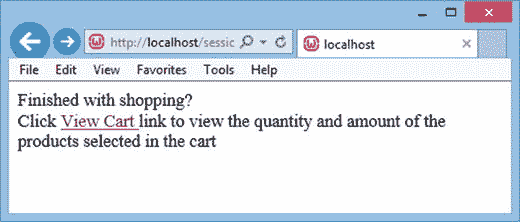

**图 3-7.** 会话变量的值已设置，并显示了一个用于访问和查看会话变量的链接

> **注意：** 如有需要，会话信息甚至可以永久存储在数据库中。

代码清单 3-9 中所示的 `sessionscript2.php` 脚本完成了以下任务：

- 检查会话是否存在。如果不存在，则启动一个新会话。

- 检查 `username` 变量是否已设置，并显示一条欢迎消息。

- 检索在 `sessionscript1.php` 脚本中设置的会话变量 `cartquantity` 和 `cartprice` 的值，并将其显示在屏幕上。

**代码清单 3-9.** 脚本 `sessionscript2.php` 从会话变量中检索值

```php
<?php
if (session_status() == PHP_SESSION_NONE) {
    session_start();
}
?>
<html>
<body>
<?php
if (isset($_SESSION['username']))
    $username=$_SESSION["username"];
else
    $username="先生/女士";
$cartquantity=$_SESSION["cartquantity"];
$cartprice=$_SESSION["cartprice"];
echo "会话已开启，会话 ID 为 " . session_id() . "<br>";
echo "欢迎您，$username。 <br>";
echo "购物车中有 $cartquantity 件产品，总价值 $$cartprice";
?>
</body>
</html>
```

当脚本运行时，会显示会话 ID 以及一条欢迎用户的问候语。同时，购物车数量和总价也会显示出来，如图 3-8 所示。

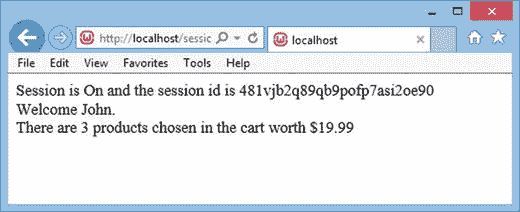

**图 3-8.** 网页显示了会话 ID、用户名、购物车数量和价格

是否考虑将用户的登录信息添加到站点页头中，通过代码清单 3-5 所示的 `topmenu.php` 脚本来显示？

您可以在页眉中显示登录（Login）和注册（Signup）链接，它们将完成以下任务：

-   显示已登录用户的用户名，或显示登录链接以便用户登录。

-   显示注册链接，该链接将显示一个表单，使用户能够在您的网站上注册。

要完成这些任务，请修改`topmenu.php`脚本，使其如清单 3-10 所示。只有**加粗**的代码是新内容；其余部分与清单 3-5 相同。

**清单 3-10.** 电子商务网站的`topmenu.php`页眉文件，已修改为显示已登录用户信息

```php
<!DOCTYPE html>
<head>
<meta charset="utf-8">
<title>Bintu Online Bazar</title>
<link rel="stylesheet" href="css/style.css">
</head>
<body>
<table  width="100%" cellspacing="0" cellpadding="2">
<col style="width:30%">
<col style="width:40%">
<col style="width:20%">
<tr><td style="background-color:cyan;color:Blue;"></td><td style="background-color:cyan;color:Blue;"></td><td style="background-color:cyan;color:Blue;">
<?php
if (session_status() == PHP_SESSION_NONE) {
    session_start();
}
echo "<span id=\"userinfo\"><a href=\"signin.php\">Login</a>&nbsp;&nbsp;&nbsp;<a href=\"validatesignup.php\">Signup</a></span></td></tr>";
?>
<tr><td style="font-size: 35px;color:blue;background-color:cyan;">
<b>Bintu Online Bazar</b></font></td>
<td bgcolor="cyan">
<form  method="post" action="searchitems.php">
<input  size="50" type="text" name="tosearch">
<input  type="submit" name="submit" value="Search">
</form></td>
<td bgcolor="cyan" ><a href="cart.php"></img><span id="cartcountinfo"></span></a></td></tr>
</table>
<div class="container">
<nav>
<ul class="nav">
<li><a href="index.php">Home</a></li>
<li class="dropdown"><a href="index.php">Electronics</a>
<ul>
<li><a href="itemlist.php?category=CellPhone">Smart Phones</a></li>
<li><a href="itemlist.php?category=Laptop">Laptops</a></li>
<li><a href="index.php">Cameras </a></li>
<li><a href="index.php">Televisions</a></li>
</ul>
</li>
<li class="dropdown">
<a href="index.php">Home & Furniture</a>
<ul class="large">
<li><a href="index.php">Kitchen Essentials</a></li>
<li><a href="index.php">Bath Essentials</a></li>
<li><a href="index.php">Furniture</a></li>
<li><a href="index.php">Dining & Serving</a></li>
<li><a href="index.php">Cookware</a></li>
</ul>
</li>
<li><a href="index.php">Books</a></li>
</ul>
</nav>
</div>
<p>
```

加粗的代码启动了一个会话。之后，它在页眉中添加了一个 ID 为`userinfo`的`span`元素。该`span`元素显示两个超链接——登录（Login）和注册（Signup）（见图 3-9）。登录超链接会将用户导航到`signin.php`脚本，该脚本将显示一个表单，提示用户输入凭据信息以登录您的网站。注册链接会将用户导航到`validatesignup.php`脚本，该脚本显示一个表单，使用户能够在您的网站上注册。

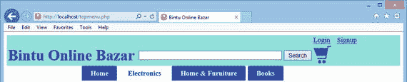

**图 3-9.** 修改后的页眉显示了登录和注册链接，使访问者能够注册和登录网站

## 登录与登出

显然，存储常客的信息是有益的。这样做可以让他们免于每次在您的网站上购买产品时都要输入地址、联系方式等信息。要存储常客的信息，您需要让他们能够在您的网站上注册。注册用户可以通过输入电子邮件地址和密码随时登录。当用户完成购买后，他们可以从您的网站登出。在本节中，您将学习如何允许网站访问者登录和登出。

> **注意**
>
> 会话通常会在用户的计算机上设置一个用户密钥，它看起来像一串很长的字符，例如`234hjg5hg34g5hj23g532hjg34hjg5k4`。例如，当在另一个页面上打开一个会话时，它会扫描计算机以查找用户密钥。如果匹配，它将访问该会话；如果不匹配，它将启动一个新会话。

清单 3-11 中显示的`signin.php`脚本会提示用户输入凭据信息，以便他们登录您的网站。

**清单 3-11.** `signin.php`脚本显示一个登录页面，同时包含页眉和下拉菜单

```php
<?php
include('topmenu.php');
?>
<html>
<head>
</head>
<body>
<form action="validateuser.php" method="post">
<table border="0" cellspacing="1" cellpadding="3">
<tr><td>Email Aaddress:</td><td><input type="text" name="emailaddress"></td></tr>
<tr><td>Password:</td><td><input type="password" name="password"></td></tr>
<tr><td colspan=2 align="center"><input type="submit" name="submit" value="Login"></td></tr>
</table>
</form>
</body>
</html>
```

该代码显示了一个表单，其中包含两个输入框，供用户输入电子邮件地址和密码。该表单还显示一个按钮，在输入电子邮件地址和密码后可以点击。点击该按钮会将用户导航到`validateuser.php`脚本。由于表单将通过 HTTP POST 方法提交，因此在此表单中输入的电子邮件地址和密码可以在`validateuser.php`脚本中通过`$_POST`数组访问。

运行此脚本后，您将看到一个提示用户输入电子邮件地址和密码的屏幕，如图 3-10 所示。

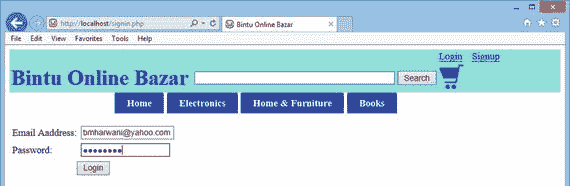

**图 3-10.** 登录网页，包含页眉和下拉菜单

用户输入电子邮件地址和密码后，下一步是确认输入的信息是否有效。清单 3-12 中显示的`validateuser.php`脚本执行以下任务：

-   它验证用户，即确定用户是否输入了有效的电子邮件地址和密码。

-   如果用户通过身份验证，它将显示一条欢迎消息。

-   如果输入了无效的电子邮件地址或密码，它会显示一条错误消息，后跟两个链接，允许用户重新输入凭据或创建新帐户。

-   如果用户成功通过身份验证，它会更新网站的页眉，用用户名和欢迎消息替换登录链接。同时，注册链接被替换为登出（Log Out）链接。

**清单 3-12.** `validateuser.php`脚本在网站页眉中显示已登录用户的信息

```php
<html>
<head>
<script language="JavaScript" type="text/JavaScript">
function updateUser(username){                                     // #1
    var ajaxUser = document.getElementById("userinfo");                // #2
    ajaxUser.innerHTML = "Welcome " + username + "   <a href=\"logout.php\">Log Out</a>";
}
</script>
</head>
<body>
<?php
include('topmenu.php');
if (session_status() == PHP_SESSION_NONE) {
    session_start();
}
$connect = mysqli_connect("localhost", "root", "gold", "shopping") or die("Please, check your server connection.");
```

```php
$query = "SELECT email_address, password, complete_name FROM customers WHERE email_address like '" . $_POST['emailaddress'] . "' " .
"AND password like (PASSWORD('" . $_POST['password'] . "'))";
$result = mysqli_query($connect, $query) or die(mysql_error());       // #3
if (mysqli_num_rows($result) == 1) {
    while ($row = mysqli_fetch_array($result, MYSQLI_ASSOC)) {
        extract($row);
        echo "Welcome " . $complete_name . " to our Shopping Mall <br>";      // #4
        $_SESSION['emailaddress'] = $_POST['emailaddress'];
        $_SESSION['password'] = $_POST['password'];
        echo "<SCRIPT LANGUAGE=\"JavaScript\">updateUser('$complete_name');</SCRIPT>"; // #5
    }
} else {
    ?>
    Invalid Email address and/or Password<br>                             // #6
    Not registered?
    <a href="validatesignup.php">Click here</a> to register.<br><br><br>
    Want to Try again<br>
    <a href="signin.php">Click here</a> to try login again.<br>
    <?php
}
?>
</body>
</html>
```

在这段代码中，语句 #1 定义了一个名为 `updateUser` 的 JavaScript 函数，当用户输入有效的电子邮件地址和密码时，此函数被调用。语句 #2 在 ID 为 `userinfo` 的 span 元素中显示一条欢迎消息和用户的姓名。它还显示了一个名为“退出”的链接，该链接将用户导航到 `logout.php` 脚本，使用户能够退出您的网站。

语句 #3 执行一个 SQL 查询，用于确定 `customers` 表中是否存在包含用户在 `signin.php` 脚本中输入的用户名和密码的行。如果存在这样的行，语句 #4 将显示一条欢迎消息和用户的姓名。

语句 #5 调用 JavaScript 函数 `updateUser`，在网站页眉中显示一条欢迎消息。语句 #6 及之后的语句显示一条错误消息和链接，使用户能够再次尝试登录或创建一个新帐户。

如果用户输入了网站无法识别的电子邮件地址或密码，屏幕上将显示两个链接。这些链接使用户能够再次尝试登录或创建一个新帐户，如图 3-11 所示。

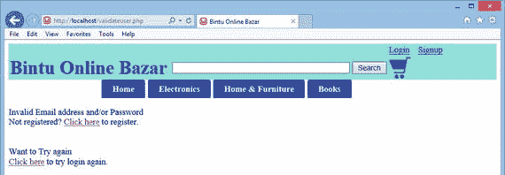

**图 3-11.** 当用户输入未知的电子邮件地址或密码时显示的消息

如果用户输入了有效的电子邮件地址和密码，将显示一条带有用户姓名的欢迎消息。这条消息会显示在网站主体以及页眉中，如图 3-12 所示。

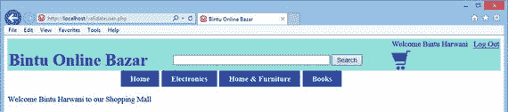

**图 3-12.** 当用户输入已有的电子邮件地址和密码时显示的欢迎消息

清单 3-13 中所示的 `logout.php` 脚本会销毁用户的会话，从而允许用户退出登录。

该脚本使用了以下两种方法：

*   `unset()` — 取消设置或销毁指定的会话变量。

*   `session_destroy()` — 销毁与当前会话关联的所有数据。也就是说，所有全局和局部的会话变量都会被销毁。

**清单 3-13.** `logout.php` 脚本，该脚本销毁用户的会话以便他们退出登录

```php
<?php
session_start();
if (isset($_SESSION['emailaddress'])) {
    unset($_SESSION['emailaddress']);
    session_destroy();
}
include("index.php");
?>
```

该脚本检查是否设置了电子邮件地址会话变量。如果已设置，则将其销毁。此外，与当前会话关联的所有数据也会被销毁。销毁所有会话信息后，主页 `index.php` 会被打开。

## 定义网站主页

主页是网站的入门页面，它在吸引访问者方面起着重要作用。

这个电子商务网站的主页显示网站页眉、一个下拉菜单以及网站销售的一些产品图片。展示的产品图片会在几秒钟后淡出，并被其他图片取代。此过程会持续显示不同的图片。点击任意图片，用户将被导航到显示该类型产品完整列表的页面。例如，当用户点击任意笔记本电脑图片时，他们会被导航到显示所有待售笔记本电脑完整列表的页面。

清单 3-14 中所示的 `index.php` 脚本用于显示主页。它包含网站页眉、一个下拉菜单以及三个被不断替换的产品图片。

**清单 3-14.** `index.php` 脚本是网站的主页

```php
<?php
include('topmenu.php');
?>
<span id="crossfade">
    <a href="itemlist.php?category=CellPhone">
        
        
    </a>
</span>
<span id="crossfade">
    <a href="itemlist.php?category=CellPhone">
        
        
    </a>
</span>
<span id="crossfade">
    <a href="itemlist.php?category=Laptop">
        
        
    </a>
</span>
</body>
</html>
```

在这段代码中，您可以看到最初显示的是 Apple iPhone 4s 智能手机、Micromax Knight 2E471 智能手机和 Microsoft Lumia 笔记本电脑的图片。几秒钟后，当这些产品图片淡出时，Xperia T3 白色智能手机、Dell Vostro1 和 HP Probook 6570 笔记本电脑的图片会出现。

清单 3-15 中所示的代码实现了主页上显示的交叉淡入淡出效果。

**清单 3-15.** 实现交叉淡入淡出效果的代码

```css
#crossfade {
    position:relative;
    height:350px;
    width:350px;
    margin-right:250px;
}
#crossfade img {
    position:absolute;
    left:0;
    -webkit-transition: opacity 1s ease-in-out;
    -moz-transition: opacity 1s ease-in-out;
    -o-transition: opacity 1s ease-in-out;
    transition: opacity 1s ease-in-out;
}
@keyframes crossfadeFadeInOut {
    0% {
        opacity:1;
    }
    45% {
        opacity:1;
    }
    55% {
        opacity:0;
    }
    100% {
        opacity:0;
    }
}
#crossfade img.top {
    animation-name: crossfadeFadeInOut;
    animation-timing-function: ease-in-out;
    animation-iteration-count: infinite;
    animation-duration: 5s;
    animation-direction: alternate;
}
```

这段代码会在五秒钟后淡出当前图片，并使接下来的三张图片可见。此过程会持续循环。当您运行该网站时，您会得到如图 3-13 所示的主页。

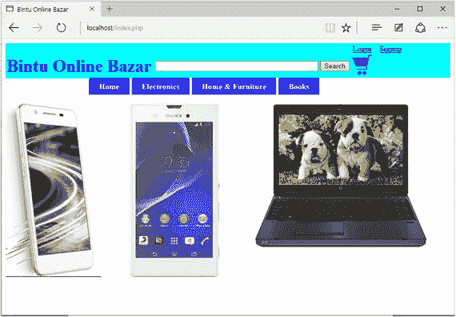

**图 3-13.** 网站的主页，显示了网站页眉、下拉菜单和三张图片

几秒钟后，当前产品图片会淡出，其他产品图片变得可见，如图 3-14 所示。

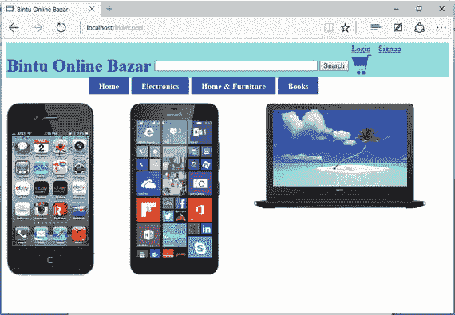

**图 3-14.** 主页上的图片淡出，并被三张新图片取代

## 总结

在本章中，你学习了如何访问 `products` 数据表中的产品，并以表格形式将其显示在屏幕上。你还学习了如何创建显示不同产品类别的下拉菜单，并实现页面间的导航。此外，你还学习了如何显示属于特定类别的产品、定义网站页眉、实现搜索功能，以及展示选定产品的详细信息。你还了解了网站如何通过会话处理来记住访问者信息。在编写网站首页代码之前，你学习了如何为网站应用登录和注销功能。

下一章将重点介绍用户选择放入购物车的商品。你将学习如何显示购物车以及编辑购物车中的商品。你还将了解如何下单，以及如何输入和保存用户的配送信息。最后，你将学习提供不同的支付方式，供用户购买你的产品。