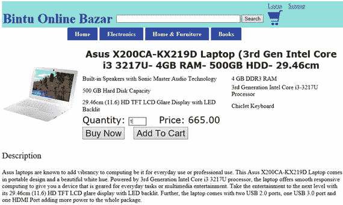
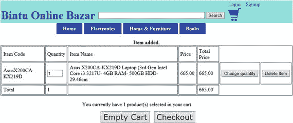
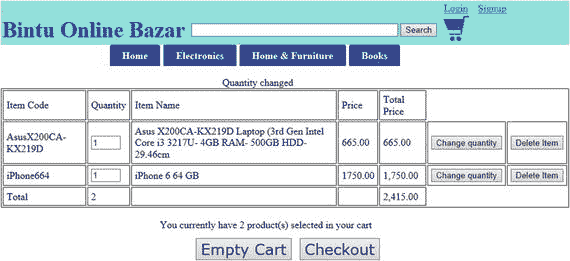
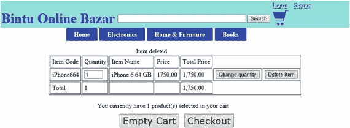
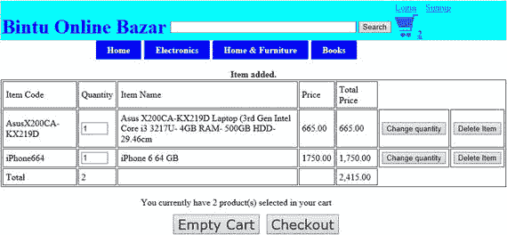
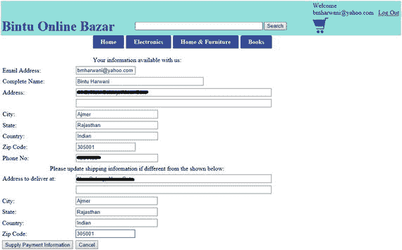
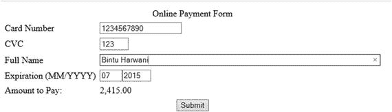

# 4. 管理购物车

电子补充材料 本章在线版本（doi:[10.1007/978-1-4842-1672-9_4](http://dx.doi.org/10.1007/978-1-4842-1672-9_4)）包含补充材料，仅供授权用户使用。

到目前为止，我们一直专注于展示产品列表及其详细信息。在本章中，你将让用户能够选择他们想要购买的产品，并将其添加到购物车中。

顾名思义，购物车是一个软件模块，用于显示访问者选择购买的产品。购物车中的商品可以根据需要修改，即在将产品添加到购物车后，用户可以从购物车中移除商品、添加更多商品，或增加已在购物车中选定商品的数量。购物车是一个数据表，用于临时保存用户选定要购买的商品。

为了存储和管理购物车中的商品，我们创建了一个名为 `cart` 的数据表，其结构在第 1 章中定义。在这里，你将学习编写代码，将访问者想要购买的商品保存到购物车中。

在本章中，你将学习以下内容：

- 将选定商品保存到购物车
- 维护购物车
- 使用 AJAX 在网站页眉中显示购物车数量
- 进入结算流程
- 提供配送信息
- 了解不同的支付方式
- 进行支付

## 将选定商品保存到购物车

回顾第 3 章中清单 3-7 所示的 `itemdetails.php` 脚本，它展示了选定产品的详细信息，并在信息下方显示以下两个按钮：

- **立即购买** — 将商品添加到购物车并进入结算流程。
- **加入购物车** — 将商品添加到购物车并停留在当前页面，以便用户选择更多产品。

**加入购物车**按钮会导航到 `cart.php` 脚本，该脚本将当前产品的信息保存到 `cart` 数据表中。`cart.php` 脚本的代码如清单 4-1 所示。

**清单 4-1.** `cart.php` 脚本保存用户选定的商品

```
<?php

include('topmenu.php');

if (session_status() == PHP_SESSION_NONE) {
    session_start();
}

$connect = mysqli_connect("localhost", "root", "gold", "shopping") or die("请检查服务器连接。");

$message = "";
$quantity="";
$action="";
$query="";

if (isset($_POST['quantity'])) {
    $quantity = trim($_POST['quantity']);
}

if ($quantity=='')
{
    $quantity=1;
}

if($quantity <=0)
{
    echo "数量值无效 ";
    echo "请返回并输入有效值";
}
else
{
    if (isset($_REQUEST['icode'])) {
        $itemcode = $_REQUEST['icode'];
    }

    if (isset($_REQUEST['iname'])) {
        $item_name = $_REQUEST['iname'];
    }

    if (isset($_REQUEST['iprice'])) {
        $price = $_REQUEST['iprice'];
    }

    if (isset($_POST['modified_quantity'])) {
        $modified_quantity = $_POST['modified_quantity'];
    }

    $sess = session_id();

    if (isset($_REQUEST['action'])) {
        $action = $_REQUEST['action'];
    }

    switch ($action) {
        case "add":
            $query="select * from cart where cart_sess = '$sess' and cart_itemcode like '$itemcode'";
            $result = mysqli_query($connect, $query) or die(mysql_error());
            if(mysqli_num_rows($result)==1)
            {
                $row=mysqli_fetch_array($result, MYSQLI_ASSOC);
                $qt=$row['cart_quantity'];
                $qt=$qt + $quantity;
                $query="UPDATE cart set cart_quantity=$qt where cart_sess = '$sess' and cart_itemcode like '$itemcode'";
                $result = mysqli_query($connect, $query)  or die(mysql_error());
            }
            else
            {
                $query = "INSERT INTO cart (cart_sess, cart_quantity, cart_itemcode, cart_item_name, cart_price) VALUES ('$sess', $quantity, '$itemcode', '$item_name', $price)";
                $message = "<div align=\"center\"><strong>商品已添加。</strong></div>";
            }
            break;

        case "change":
            if($modified_quantity==0)
            {
                $query = "DELETE FROM cart WHERE cart_sess = '$sess' and cart_itemcode like '$itemcode'";
                $message = "<div style=\"width:200px; margin:auto;\">商品已删除</div>";
            }
            else
            {
                if($modified_quantity <0)
                {
                    echo "输入的数量无效";
                }
                else
                {
                    $query = "UPDATE cart SET cart_quantity = $modified_quantity  WHERE cart_sess = '$sess' and cart_itemcode like '$itemcode'";
                    $message = "<div style=\"width:200px; margin:auto;\">数量已更改</div>";
                }
            }
            break;

        case "delete":
            $query = "DELETE FROM cart WHERE cart_sess = '$sess' and cart_itemcode like '$itemcode'";
            $message = "<div style=\"width:200px; margin:auto;\">商品已删除</div>";
            break;

        case "empty":
            $query = "DELETE FROM cart WHERE cart_sess = '$sess'";
            break;
    }

    if($query !="")
    {
        $results = mysqli_query($connect, $query) or die(mysql_error());
        echo $message;
    }

    include("showcart.php");
    echo "<SCRIPT LANGUAGE=\"JavaScript\">updateCart();</SCRIPT>";
}

?>
```


程序首先启动会话。会话 ID 将用于记住特定用户在购物车中所选的项目。记住，如果会话已启用且不存在任何会话，则会话状态等于`PHP_SESSION_NONE`。然后，建立与 MySQL 服务器的连接，并选择`shopping`数据库。从`$_POST`数组中检索所购商品的数量（存储在`quantity`变量中）。如果用户未指定数量，则默认为 1。同时，还会验证输入的数量值是否为非负数。从`itemdetails.php`脚本发送的商品代码、商品名称和价格（分别存储在`icode`、`iname`和`iprice`变量中）通过`$_REQUEST`数组检索，并赋值给`$itemcode`、`$item_name`和`$price`变量。

生成一个会话并存储在`$sess`变量中。此会话 ID 被分配给购物车中选中的所有产品，以标识特定用户选择的商品。检索`action`变量的值，该值决定对购物车项目执行的操作类型。`action`变量的值可以是`add`、`change`或`delete`。当`action`变量的值为`add`时，表示需要将产品添加到`cart`表中。类似地，如果`action`的值为`change`，则表示需要修改已在购物车中的产品；而`delete`操作则表示需要从购物车中删除指定产品。

当`action`变量为`add`时，首先检查该产品是否已在购物车中。如果产品已在购物车中，则仅修改数量字段，即增加产品的数量以表示添加。如果产品不在购物车中，则在`cart`表中添加新行。

注意

会话是服务器端文件（包含要存储的访问者所有数据）和客户端 cookie（包含对服务器数据的引用）的组合。使用`session_start()`函数创建该文件和客户端 cookie。正如你在第 3 章中学到的，HTTP 是一种无状态协议，这意味着必须通过使用 cookie、URL 重写或隐藏字段将会话 ID 与用户持续关联。

运行该脚本后，你将看到所选产品的详细信息。还会看到输入该产品数量的提示，随后点击“添加到购物车”或“立即购买”，如图 4-1 所示。



图 4-1.

将所选商品添加到购物车

清单 4-1 中所示的`cart.php`脚本主要专注于向购物车添加产品。将产品添加到购物车后，需要对其进行维护。也就是说，你需要根据访问者的更改来修改购物车的内容。你将在下一节中了解如何操作。

### 维护购物车

将产品添加到购物车后，需要一个脚本来显示购物车中选中的所有产品，并在需要时修改购物车内容。清单 4-2 中所示的`showcart.php`脚本负责显示购物车中选中的项目并管理它们。

清单 4-2. `showcart.php`脚本显示`cart`表中的内容并进行维护

```
<?php

if ( ! isset($totalamount)) {
    $totalamount=0;
}

$totalquantity=0;

if (!session_id()) {
    session_start();
}

$connect = mysqli_connect("localhost", "root", "gold", "shopping") or die("Please, check your server connection.");

$sessid = session_id();

$query = "SELECT * FROM cart WHERE cart_sess = '$sessid'";

$results = mysqli_query($connect, $query) or die (mysql_query());

if(mysqli_num_rows($results)==0)
{
    echo "<div style=\"width:200px; margin:auto;\">Your Cart is empty</div> ";
}
else
{
    ?>
    <table border="1" align="center" cellpadding="5">
    <tr><td> Item Code</td><td>Quantity</td><td>Item Name</td><td>Price</td><td>Total Price</td>
    <?php
    while ($row = mysqli_fetch_array($results, MYSQLI_ASSOC)) {
        extract($row);
        echo "<tr><td>";
        echo $cart_itemcode;
        echo "</td>";
        echo "<td><form method=\"POST\" action=\"cart.php?action=change&icode=$cart_itemcode\"><input type=\"text\" name=\"modified_quantity\" size=\"2\" value=\"$cart_quantity\">";
        echo "</td><td>";
        echo $cart_item_name;
        echo "</td><td>";
        echo $cart_price;
        echo "</td><td>";
        $totalquantity = $totalquantity + $cart_quantity;
        $totalprice = number_format($cart_price * $cart_quantity, 2);
        $totalamount=$totalamount + ($cart_price * $cart_quantity);
        echo $totalprice;
        echo "</td><td>";
        echo "<input type=\"submit\" name=\"Submit\"  value=\"Change quantity\"></form></td>";
        echo "<td>";
        echo "<form method=\"POST\" action=\"cart.php?action=delete&icode=$cart_itemcode\">";
        echo "<input type=\"submit\" name=\"Submit\" value=\"Delete Item\"></form></td></tr>";
    }
    echo "<tr><td >Total</td><td>$totalquantity</td><td></td><td></td><td>";
    $totalamount = number_format($totalamount, 2);
    echo $totalamount;
    echo "</td></tr>";
    echo "</table><br>";
    echo "<div style=\"width:400px; margin:auto;\">You currently have " . $totalquantity . " product(s) selected in your cart</div> ";
    ?>
    <table border="0" style="margin:auto;">
    <tr><td  style="padding: 10px;">
    <form method="POST" action="cart.php?action=empty">
    <input type="submit" name="Submit" value="Empty Cart" style="font-family:verdana; font-size:150%;" >
    </form>
    </td><td>
    <form method="POST" action="checklogin.php">
    <input id="cartamount" name="cartamount" type="hidden" value= "<?php echo $totalamount ; ?>">
    <input type="submit" name="Submit" value="Checkout"  style="font-family:verdana; font-size:150%;" >
    </form>
    </td></tr></table>
    <?php
}
?>
</body>
</html>
```

该程序确定会话 ID 是否已设置。如果未设置，则启动一个新会话。如前所述，会话 ID 有助于识别特定网站访问者选择的产品。此后，建立与 MySQL 服务器的连接，并选择`shopping`数据库。执行 SQL 查询，以检查具有给定会话 ID 的购物车中是否有任何产品。如果有，则表示该访问者已经向购物车中添加了一个或多个产品。在这种情况下，购物车中存储的所有商品及其各自的数量都会显示在屏幕上。

如果在`cart`表中未找到与给定会话 ID 匹配的产品，则表示购物车中没有产品。屏幕上会显示一条消息，告知访问者“购物车中已选择 0 件产品”。

该脚本使访问者能够执行以下任务：

*   通过从顶部菜单中选择任何商品类别，向购物车添加更多产品。
*   修改购物车中任何商品的数量。
*   从购物车中删除某件商品或清空整个购物车。


运行脚本后，您会在购物车中看到选中的产品，如图 4-2 所示。请注意，此时购物车中只选中了一个产品。



图 4-2. 维护购物车

假设访客向购物车中添加了两部 iPhone 智能手机，购物车内容现在应如图 4-3 所示。


图 4-3. 展示购物车中选中的商品

您始终可以通过在文本框中输入所需数量，然后点击该商品行中的“更改数量”（Change Quantity）按钮，来更改任何产品的数量。将 iPhone 产品的数量更改为 1 后，购物车将如图 4-4 所示。



图 4-4. 更改购物车中任意商品数量后的购物车内容

您还可以通过点击相应行中的“删除商品”（Delete Item）按钮，从购物车中删除任何产品。例如，从购物车中删除华硕笔记本电脑后，购物车中将只剩下一件商品，如图 4-5 所示。



图 4-5. 从购物车中删除商品后的购物车内容

底部的“清空购物车”（Empty Cart）按钮将删除购物车中的所有商品。您将看到一条确认此操作的消息，如图 4-6 所示。


图 4-6. 购物车为空时看到的消息

## 使用 AJAX 在站点页眉中显示购物车数量

站点的页眉看起来很棒（见图 4-5），但电子商务网站所需的某些功能仍然缺失。首先，购物车中商品的数量，即如果访客在购物车中选择了一个产品，页眉中的购物车图标旁边应显示一个数值 `1`，以表示购物车中有一件商品。当用户向购物车中添加更多商品或从中移除商品时，该数值应持续更新。页眉中缺少的第二件事是已登录用户的电子邮件地址。也就是说，如果用户已登录站点，购物车图标上方的“登录”链接应显示一条欢迎消息，并附上访客的电子邮件地址。您现在将学习如何添加这两项功能。

为了在站点页眉中显示购物车中选中的商品数量以及访客信息，您将使用 AJAX。

AJAX 代表异步 JavaScript 和 XML（Asynchronous JavaScript and XML）。它是一个用于创建动态且高度响应式网页的总称。通常，在 Web 应用程序中，无法局部更新网页。例如，当用户从服务器上的数据库中请求某些信息时，整个网页都会被刷新以显示获取到的信息。也就是说，即使获取到的信息只需显示在网页的一个小区域中，整个页面也会被重新加载。借助 AJAX，只有负责显示获取信息的区域会被刷新，这使得其具有高度响应性。

其次，使用 AJAX，数据可以在后台发送到服务器并从服务器访问。这使得显示响应速度更快。

AJAX 分别使用 `XMLHttpRequest` 对象和 JavaScript 与服务器通信以及在网页上显示数据。

> **注意**
> 
> 由于往返过程，网页在显示用户期望的结果时通常有点慢。往返过程是指从客户端发出请求到服务器生成响应所花费的时间。所需信息的请求从客户端发送到 Web 服务器。Web 服务器作为回应，从数据库访问所需信息或根据需要处理该信息，并将其发送回客户端。客户端重新加载整个网页以显示服务器的响应。即使服务器的响应应该显示在网页的一个小区域中，整个网页也会被刷新。而在 AJAX 中，可以刷新网页的一个小区域，从而使其在交付结果方面快得多。

为了显示购物车中选中的商品数量以及访客的电子邮件地址，现有的 `topmenu.php` 脚本被修改为如清单 4-3 所示。请注意，只有粗体显示的代码是新增的。

**清单 4-3. `topmenu.php` 脚本显示站点页眉，指示购物车内容和用户的登录状态**

```html
<!DOCTYPE html>
<head>
<meta charset="utf-8">
<title>Bintu Online Bazar</title>
<link rel="stylesheet" href="css/style.css">
<script language="JavaScript" type="text/JavaScript">
function makeRequestObject(){
    var xmlhttp=false;
    try {
        xmlhttp = new ActiveXObject('Msxml2.XMLHTTP');                        // #1
    } catch (e) {
        try {
            xmlhttp = new ActiveXObject('Microsoft.XMLHTTP');                  // #2
        } catch (E) {
            xmlhttp = false;
        }
    }
    if (!xmlhttp && typeof XMLHttpRequest!='undefined') {
        xmlhttp = new XMLHttpRequest();                                       // #3
    }
    return xmlhttp;
}
function updateCart(){                                                        // #4
    var xmlhttp=makeRequestObject();
    xmlhttp.open('GET',  'countcart.php', true);                             // #5
    xmlhttp.onreadystatechange = function(){                                 // #6
        if (xmlhttp.readyState == 4 && xmlhttp.status == 200) {               // #7
```


```javascript
var ajaxCart = document.getElementById("cartcountinfo");              // #8
ajaxCart.innerHTML = xmlhttp.responseText;
}
}
xmlhttp.send(null);
}
</script>
</head>
<body>
<table  width="100%" cellspacing="0" cellpadding="2">
<col style="width:30%">
<col style="width:40%">
<col style="width:20%">
<tr><td style="background-color:cyan;color:Blue;"></td><td style="background-color:cyan;color:Blue;"></td><td style="background-color:cyan;color:Blue;">
<?php
if (session_status() == PHP_SESSION_NONE) {
    session_start();
}
if (isset($_SESSION['emailaddress']))
{
    echo "欢迎 " . $_SESSION['emailaddress'] .  "&nbsp;&nbsp;&nbsp;";  // #9
    echo "<a href=\"logout.php\">退出登录</a></td></tr>";
}
else
{
    echo "<a href=\"signin.php\">登录</a>&nbsp;&nbsp;&nbsp;";
    echo "<a href=\"validatesignup.php\">注册</a></td></tr>";
}
?>
<tr><td style="font-size: 35px;color:blue;background-color:cyan;">
<b>Bintu 在线集市</b></font></td>
<td bgcolor="cyan">
<form  method="post" action="searchitems.php">
<input  size="50" type="text" name="tosearch">
<input  type="submit" name="submit" value="搜索">
</form></td>
<td bgcolor="cyan" ><a href="cart.php"></img><span id="cartcountinfo"></span></a>
</td></tr>
</table>
<div class="container">
<nav>
<ul class="nav">
<li><a href="index.php">首页</a></li>
<li class="dropdown">
<a href="index.php">电子产品</a>
<ul>
<li><a href="itemlist.php?category=CellPhone">智能手机</a></li>
<li><a href="itemlist.php?category=Laptop">笔记本电脑</a></li>
<li><a href="index.php">相机 </a></li>
<li><a href="index.php">电视</a></li>
</ul>
</li>
<li class="dropdown">
<a href="index.php">家居与家具</a>
<ul class="large">
<li><a href="index.php">厨房必需品</a></li>
<li><a href="index.php">浴室必需品</a></li>
<li><a href="index.php">家具</a></li>
<li><a href="index.php">餐具与上菜</a></li>
<li><a href="index.php">炊具</a></li>
</ul>
</li>
<li><a href="index.php">图书</a></li>
</ul>
</nav>
</div>
<p>

语句 #1 创建了一个 `XMLHttpRequest` 对象。`XMLHttpRequest` 对象使 JavaScript 代码能够执行异步的 HTTP 服务器请求。正是通过使用这个对象，你可以在完全后台的情况下发出 HTTP 请求、接收响应并更新页面上的某个区域。

为了使用 JavaScript 向服务器发出 HTTP 请求，需要一个最初在 Internet Explorer 中以 ActiveX 对象形式引入的类，它被称为 `XMLHTTP`。JavaScript 内置了一个 `XMLHttpRequest()` 函数，可用于在其他浏览器（如 Firefox、Safari 和 Opera）中发出 HTTP 请求。

语句 #1 尝试使用 `ActiveXObject("Msxml2.XMLHTTP")` 创建 `XMLHttpRequest` 对象，并假设浏览器为 IE6+。如果失败，则语句 #2 执行 `ActiveXObject("Microsoft.XMLHTTP")`，假设浏览器为 IE5.0。如果所有这些都失败，则使用语句 #3 中的内置函数 `XMLHttpRequest()` 来创建 `XMLHttpRequest` 对象。

语句 #4 中显示的 `updateCart` 函数定义了一个 JavaScript 函数，用于显示购物车中商品的数量。每当用户对购物车进行更改时，即每当向购物车添加、修改或删除任何商品时，都会调用此函数。

要实现 AJAX，在创建好 `XMLHttpRequest` 对象之后，下一步是发送 Web 请求以从服务器获取数据。该请求通过 `open` 方法发出。语句 #5 使用 `GET` 方法向服务器发出请求，并传递要在服务器上执行的文件名 `countcart.php`。`countcart.php` 脚本如代码清单 4-4 所示，它简单地统计 `cart` 表中的行数并返回结果。

注意
```


所有现代浏览器——Chrome、IE7+、Firefox、Safari 和 Opera——都有一个内置的`XMLHttpRequest`对象。

向服务器发出异步请求时，您需要监视请求的状态以及请求的响应。为此，语句#6 中使用了一个名为`xmlhttp.onreadystatechange`的函数，它会持续检查请求的状态。

语句#7 中所示的`readyState`属性保存了服务器响应的状态。每次`readyState`发生变化时，都会执行`onreadystatechange`函数。以下是`readyState`属性的可能取值：

- 状态 0：请求未初始化
- 状态 1：请求已建立
- 状态 2：请求已发送
- 状态 3：请求正在处理
- 状态 4：请求已完成

语句#7 中的`status`属性表示 HTTP 请求的状态。如果`status`值为`500`，则表示服务器内部错误；`400`值表示错误请求；`401`表示未授权；`403`表示禁止访问；`404`表示未找到，依此类推。状态值`200`表示没有错误。`onreadystatechange`函数会检查请求的状态。如果`state`的值为`4`，则表示已收到完整的服务器响应。如果`status`的值为`200`，则表示响应没有错误，您可以继续处理它。

语句#8 访问具有`cartcountinfo`ID 的元素。`cartcountinfo`是添加到购物车图标后页眉中的`span`元素的 ID。通过此元素，将显示由`countcart.php`文件返回的购物车数量。

语句#9 显示欢迎消息以及用户的电子邮件地址（如果用户已登录且会话变量存在）。此外，如果用户已登录，语句#10 会显示“注销”链接，点击该链接将调用`logout.php`文件。

为了显示购物车中的商品数量，清单 4-4 中所示的`countcart.php`脚本会访问`cart`表中与站点访问者的会话 ID 匹配的商品，并返回获取的行数。

**清单 4-4。`countcart.php`文件计算并返回购物车中选择的商品数量**

```php
<?php
$totalquantity=0;
if (session_status() == PHP_SESSION_NONE) {
    session_start();
}
$connect = mysqli_connect("localhost", "root", "gold", "shopping") or die("Please, check your server connection.");
$sess = session_id();
$query="select * from cart where cart_sess = '$sess'";
$results = mysqli_query($connect, $query) or die(mysql_error());
while ($row = mysqli_fetch_array($results, MYSQLI_ASSOC)) {
    extract($row);
    $totalquantity = $totalquantity + $cart_quantity;
}
echo $totalquantity;
?>
```

您可以在这段代码中看到，建立了到 MySQL 服务器的连接，激活了`shopping`数据库，并且访问了`cart`表中与访问者会话 ID 匹配的所有行。购物车中商品的数量会被累加，并将总数量作为购物车计数返回。假设访问者在购物车中选择了两件商品，购物车计数`2`将出现在站点页眉的购物车图标旁边，如图 4-7 所示。



图 4-7.

显示购物车中选择商品数量的网站页眉

点击“登录”链接后，将执行`signin.php`脚本，它会提示用户输入电子邮件地址和密码。如果用户输入了有效的电子邮件地址和密码，欢迎消息将显示在站点页眉以及页面正文中，如图 4-8 所示。


图 4-8.

已登录用户的欢迎消息显示在站点页眉中

## 前往结账

一旦访问者完成向购物车添加商品并希望购买它们，他们可以随时点击位于购物车底部的“结账”按钮（见图 4-7）。点击“结账”按钮时，系统会检查访问者的状态，以确定他们是否已登录。为了保存商品交付的发货信息，访问者需要在站点注册并登录。如果访问者尚未登录，将显示两个链接——一个允许用户登录，另一个允许用户在尚未注册时创建账户。根据访问者的当前状态，他们可以创建新账户或登录站点。

清单 4-5 中所示的`checklogin.php`脚本会检查访问者的登录/登录状态。

**清单 4-5。`checklogin.php`脚本检查访问者的登录状态**

```php
<?php
include('topmenu.php');
if (session_status() == PHP_SESSION_NONE) {
    session_start();
}
$connect = mysqli_connect("localhost", "root", "gold", "shopping") or die("Please, check your server connection.");
$cartamount=0;
$cartamount = $_POST['cartamount'];
$_SESSION['cartamount']=$cartamount;
if (isset($_SESSION['emailaddress']))
{
    $email_address=$_SESSION['emailaddress'];
    echo "Welcome " . $email_address . ". <br/>";
}
if (isset($_SESSION['password']))
{
    $password=$_SESSION['password'];
}
if ((isset($_SESSION['emailaddress']) && $_SESSION['emailaddress'] != "") ||   (isset($_SESSION['password']) && $_SESSION['password'] != "")) {
    $sess = session_id();
    $query="select * from cart where cart_sess = '$sess'";
    $result = mysqli_query($connect, $query) or die(mysql_error());
    if(mysqli_num_rows($result)>=1)
    {
        echo "If you have finished Shopping ";
        echo "<a href=shipping_info.php>Click Here</a> to supply Shipping Information";
        echo " Or You can do more purchasing by selecting items from the menu ";
    }
    else
    {
        echo "You can do purchasing by selecting items from the menu on left side";
    }
}
else
{
    ?>
    <html>
    <head>
    </head>
    <body>
    <h3>Not Logged in yet</h1>
    <p>
    You are currently not logged into our system.<br>
    You can do purchasing only if you are logged in.<br>
    If you have already registered,
    <a href="signin.php">click here</a> to login, or if would like to create an account, <a href="create_account.php">click here</a> to register.
    </p>
    </body>
    </html>
    <?php
}
?>
```

由于每个用户在其唯一的会话中都拥有各自选择的商品，因此在读取会话变量之前会调用`session_start()`函数。之后，建立到 MySQL 服务器的连接并选择`shopping`数据库。检索`$_SESSION`数组中的电子邮件地址和密码，以防它们被任何网页先前设置过。

`$_SESSION`数组元素只有在用户注册并登录站点时才能被设置；否则，其元素不会被设置。如果`$_SESSION`数组中设置了电子邮件地址和密码（即用户已登录），则会向用户提供两个选项。如果他已经完成购物，必须提供发货信息（见图 4-9），或者他可以通过从顶部菜单中选择商品类别来继续购物。但是，如果`$_SESSION`数组中未设置电子邮件地址和密码，则会要求用户登录或创建一个账户。


图 4-9.

检查访问者登录状态后显示的消息

假设用户已经注册，下一步便是提供商品交付的发货信息。您将在下一节中进行此操作。


### 提供配送信息

如果用户已登录网站，则会显示一个链接，用于提供产品配送的送货信息。清单 4-6 中所示的 `shipping_info.php` 脚本会从客户表中加载地址、州/省、国家/地区以及其他信息，并将其显示在屏幕上。访客可以为产品配送选择相同的地址，也可以在需要时进行更改。

**清单 4-6.** `shipping_info.php` 脚本允许输入产品配送的送货信息

```php
<?php

include('topmenu.php');

if (session_status() == PHP_SESSION_NONE) {
    session_start();
}

if (isset($_SESSION['cartamount']))
{
    $cartamount=$_SESSION['cartamount'];
}

$connect = mysqli_connect("localhost", "root", "gold", "shopping") or die("请检查您的服务器连接。");

$email_address="";
if (isset($_SESSION['emailaddress']))
{
    $email_address=$_SESSION['emailaddress'];
}

if (isset($_SESSION['password']))
{
    $password=$_SESSION['password'];
}

if ((isset($_SESSION['emailaddress']) && $_SESSION['emailaddress'] != "") ||   (isset($_SESSION['password']) && $_SESSION['password'] != "")) {
    $query = "SELECT * FROM customers  where email_address like '$email_address' and password like (PASSWORD('$password'))";
    $results = mysqli_query($connect, $query) or die(mysql_error());
    $row = mysqli_fetch_array($results, MYSQLI_ASSOC);
    extract($row);
    ?>
    <form action="purchase.php" method="post">
    <table border="0" cellspacing="1" cellpadding="3">
    <tr><td colspan="2" align="center">我们存档的您的信息：</td></tr>
    <tr><td>电子邮件地址：</td><td><input size="20" type="text" name="email_address" value="<?php echo $email_address; ?>"></td></tr>
    <tr><td>完整姓名： </td><td><input size="50" type="text" name="complete_name" value="<?php echo $complete_name; ?>"></td></tr>
    <tr><td>地址：  </td><td><input size="80" type="text" name="address1" value="<?php echo $address_line1; ?>"></td></tr>
    <tr><td></td><td><input size="80" type="text" name="address2" value="<?php echo $address_line2; ?>"></td></tr>
    <tr><td>城市：  </td><td><input size="30" type="text" name="city" value="<?php echo $city; ?>"></td></tr>
    <tr><td>州/省：  </td><td><input size="30" type="text" name="state" value="<?php echo $state; ?>"></td></tr>
    <tr><td>国家/地区：  </td><td><input size="30" type="text" name="country" value="<?php echo $country; ?>"></td></tr>
    <tr><td>邮政编码：  </td><td><input size="20" type="text" name="zipcode" value="<?php echo $zipcode; ?>"></td></tr>
    <tr><td>电话号码：  </td><td><input size="30" type="text" name="phone_no" value="<?php echo $cellphone_no; ?>"></td></tr>
    <tr><td colspan=2 align="center">如果配送信息与以下所示不同，请更新： </td></tr>
    <tr><td>    配送地址：  </td><td><input type="text" size="80" name="shipping_address_line1" value="<?php echo $address_line1; ?>"></td></tr>
    <tr><td></td><td><input type="text" size="80" name="shipping_address_line2" value="<?php echo $address_line2; ?>"></td></tr>
    <tr><td>    城市：  </td><td><input size="30" type="text" name="shipping_city" value="<?php echo $city; ?>"></td></tr>
    <tr><td>    州/省：  </td><td><input size="30" type="text" name="shipping_state" value="<?php echo $state; ?>"></td></tr>
    <tr><td>    国家/地区：  </td><td><input size="30" type="text" name="shipping_country" value="<?php echo $country; ?>"></td></tr>
    <tr><td>    邮政编码：  </td><td><input type="text" size="20" name="shipping_zipcode" value="<?php echo $zipcode; ?>"></td></tr>
    <tr><td><input type="submit" name="submit" value="提供支付信息"></td><td>
    <input type="reset" value="取消"></td></tr>
    </table>
    </form>
    <?php
}
?>
</body>
</html>
```

会话已启动。与 MySQL 服务器建立连接，并选择了 `shipping` 数据库。在登录操作期间输入并存储在 `$_SESSION` 数组中的电子邮件地址和密码被检索出来，并分别赋值给 `$email_address` 和 `$password` 变量。

执行一条 SQL 语句，从 `customers` 表中检索访客的所有详细信息（包括姓名、地址、城市、州/省、国家/地区、邮政编码和电话号码）。这些信息会显示在屏幕上。配送信息也会显示出来。访客可以使用创建账户时已提供的地址来接收产品，也可以提供新的配送信息。提供配送信息后，访客可以点击“提供支付信息”按钮来支付产品费用。



**图 4-10.** 输入产品的配送信息

现在，您的网站开发已进入需要用户为其商品付款的阶段。在下一节中，您将了解不同的支付方式。


## 了解不同的支付模式

在电商网站中，所购商品的款项以电子方式处理。主要的电子支付模式包括：

- **信用卡**——信用卡是由银行或某些供应商发行的一种小型塑料卡，持卡人可凭此以信用方式购买商品或服务。发卡方设定信用额度，持卡人不可超支。持卡人购物时，发卡方代为付款，持卡人随后在指定期限内将款项还给发卡方。
- **借记卡**——借记卡与信用卡类似，是一种小型塑料卡，持卡人可凭此从其银行账户中付款。持卡人需先将资金存入银行账户，然后才能通过借记卡支付所购商品或服务。借记卡与信用卡的主要区别在于，使用借记卡时，金额会立即从您的银行账户中扣除。您的银行账户中必须有足够的资金才能完成交易。而信用卡则不同，即使账户中资金不足，交易也能完成，由银行代客户付款。
- **智能卡**——外观与信用卡和借记卡相似，智能卡内置有一个微处理器芯片。它存储客户的个人信息以及货币信息。客户购物时，货币信息会相应更新。
- **电子货币**——在此支付模式下，资金直接从一家金融机构转移到另一家，无需任何卡公司参与其中。
- **电子资金转账**——这是一种将资金从一个银行账户转移到另一个银行账户的电子支付方式。资金转账可通过 ATM（自动柜员机）或计算机进行。要通过计算机转账，客户需在银行网站注册。登录后，他们可以请求将一定金额转入卖家账户。如果目标账户在同一家银行，则银行直接转账；否则，该请求会转至 ACH（自动清算中心）。
- **货到付款交易**——此模式下，款项由客户直接支付给卖家。
- **网上银行**——使用此方法的客户通过提供网上银行 ID 和 PIN 码，从其账户向电商网站付款。此支付方式无需使用任何卡片。

> **注意：** 电商网站通过称为支付网关提供商的第三方服务商向消费者收款。支付网关是一种处理信用卡及其他卡片支付的电商应用程序服务商。它充当购物消费者与发卡银行之间的桥梁。支付网关为资金交换提供了更安全的平台。在货到付款交易中，不涉及支付网关，因为款项由客户直接支付给卖家。

## 进行支付

选择要购买的商品后，下一步就是付款。`purchase.php`脚本会提示访问者提供付款信息。

要在线接受信用卡和借记卡付款，您可以使用多种在线支付处理服务。我在`purchase.php`脚本中使用了`2CheckOut.com`服务，如列表 4-7 所示。请访问[`https://www.2checkout.com/`](https://www.2checkout.com/)了解更多信息。

### jQuery

列表 4-7 中显示的代码使用了 jQuery，因此我们快速了解一下 jQuery。

jQuery 是一个轻量级、功能丰富的 JavaScript 库。它可以更轻松地在您的网站上应用 JavaScript。事实上，许多复杂任务，如遍历 HTML 元素、实现动画、处理事件等，都可以通过使用 jQuery 方法轻松应用到您的网站上。以下是 jQuery 的一些特性：

- jQuery 使得选择 DOM 元素并根据需要操作它们变得非常容易。
- jQuery 能够感知 HTML 元素上的不同事件，并据此采取相应操作。
- jQuery 使您能够将 AJAX 应用于您的网站，从而使其具有高度的响应性。
- jQuery 包含多种内置动画效果，可直接应用于您的网站。
- jQuery 受到大多数主流浏览器的支持，包括 IE 6.0+、FF 2.0+、Safari 3.0+、Chrome 和 Opera 9.0+。

#### 列表 4-7. `purchase.php` 脚本允许您输入支付方式和配送信息

```html
<HTML>
<HEAD>
<script type="text/javascript" src="https://www.2checkout.com/checkout/api/2co.min.js"></script>
<script src="//ajax.googleapis.com/ajax/libs/jquery/1.11.0/jquery.min.js"></script>
<script>
var successCallback = function(data) {
    var myForm = document.getElementById('payment-form');
    // Set the token as the value for the token input
    myForm.token.value = data.response.token.token;
    myForm.submit();
};

// Called when token creation fails.
var errorCallback = function(data) {
    // Retry the token request if ajax call fails
    if (data.errorCode === 200) {
        call tokenRequest();
    } else {
        alert(data.errorMsg);
    }
};

var tokenRequest = function() {
    // Setup token request arguments
    var args = {
        sellerId: "102626791",
        publishableKey: "E0F6517A-CFCF-11E3-8295-A7DD28100996",
        ccNo: $("#card-number").val(),
        cvv: $("#card-cvc").val(),
        expMonth: $("#card-expiry-month").val(),
        expYear: $("#card-expiry-year").val()
    };
    // Make the token request
    TCO.requestToken(successCallback, errorCallback, args);
};

$(function() {
    // Pull in the public encryption key for our environment
    TCO.loadPubKey('production');
    $("#payment-form").submit(function(e) {
        // Call our token request function
        tokenRequest();
        // Prevent form from submitting
        return false;
    });
});
</script>
</HEAD>
<BODY>
<?php
if (session_status() == PHP_SESSION_NONE) {
    session_start();
}

if (isset($_SESSION['cartamount'])) {
    $cartamount=$_SESSION['cartamount'];
}

$complete_name=$_POST['complete_name'];
$address1 = $_POST['address1'];
$city = $_POST['city'];
$state = $_POST['state'];
$zipcode = $_POST['zipcode'];
$country = $_POST['country'];
$shipping_address_line1 = $_POST['shipping_address_line1'];
$shipping_address_line2 = $_POST['shipping_address_line2'];
$shipping_city = $_POST['shipping_city'];
$shipping_state = $_POST['shipping_state'];
$shipping_country = $_POST['shipping_country'];
$shipping_zipcode = $_POST['shipping_zipcode'];
$phone_no= $_POST['phone_no'] ;

$_SESSION['complete_name'] =$complete_name;
$_SESSION['address1'] =$address1;
$_SESSION['city'] =$city;
$_SESSION['state'] =$state;
$_SESSION['zipcode'] =$zipcode;
$_SESSION['country'] =$country;
$_SESSION['shipping_address_line1'] =$shipping_address_line1;
$_SESSION['shipping_address_line2'] =$shipping_address_line2;
$_SESSION['shipping_city'] =$shipping_city;
$_SESSION['shipping_state'] =$shipping_state;
?>
</BODY>
</HTML>
```


`$_SESSION['shipping_country'] =$shipping_country;`

`$_SESSION['shipping_zipcode'] =$shipping_zipcode;`

`$_SESSION['phone_no'] =$phone_no;`

`?>`

`<span class="payment-errors"></span>`

`<form action="placeorder.php" method="POST" id="payment-form" >`

`<input id="token" name="token" type="hidden" value="">`

`<table border="0" cellspacing="1" cellpadding="3">`

`<tr><td colspan="2" align="center">在线支付表格</td></tr>`

`<tr><td>卡号</td><td><input type="text" size="20" autocomplete="off" id="card-number"></td></tr>`

`<tr><td>CVC</td><td><input type="text" size="4" autocomplete="off" id="card-cvc"></td></tr>`

`<tr><td>持卡人姓名</td><td><input type="text" id="name" size="80" autocomplete="on"></td></tr>`

`<tr><td>有效期 (MM/YYYY)</td><td><input type="text" size="2" id="card-expiry-month"><input type="text" size="4" id="card-expiry-year"></td></tr>`

`<tr><td>支付金额：</td><td><?php echo $cartamount; ?></td></tr>`

`<tr><td colspan="2" align="center"><input type="submit" name="submit" value="提交" onclick="formSubmit()">`

`</table>`

`</form>`

`</BODY>`

`</HTML>`

运行脚本时，系统会提示用户提供信用卡/借记卡信息，如图 4-11 所示。



图 4-11. 输入支付信息

当用户单击提交按钮时，订单将被下达，已购买产品的信息将保存在 `orders` 和 `orders_details` 表中。清单 4-8 中所示的 `placeorder.php` 脚本会接收访客的订单，并显示订单编号及“感谢”消息。

清单 4-8. `placeorder.php` 脚本用于下达订单

```
<?php

require_once("lib/Twocheckout.php");

Twocheckout::privateKey('E0F6517A-CFCF-11E3-8295-A7DD28100996');

Twocheckout::sellerId('102626791');

include('topmenu.php');

if (session_status() == PHP_SESSION_NONE) {

session_start();

}

if (isset($_SESSION['cartamount']))

{

$cartamount=$_SESSION['cartamount'];

}

$connect = mysqli_connect("localhost", "root", "gold", "shopping") or die("请检查您的服务器连接。");

$complete_name=$_SESSION['complete_name'];

$address1 = $_SESSION['address1'];

$city = $_SESSION['city'];

$state = $_SESSION['state'];

$zipcode = $_SESSION['zipcode'];

$country = $_SESSION['country'];

$shipping_address_line1 = $_SESSION['shipping_address_line1'];

$shipping_address_line2 = $_SESSION['shipping_address_line2'];

$shipping_city = $_SESSION['shipping_city'];

$shipping_state = $_SESSION['shipping_state'];

$shipping_country = $_SESSION['shipping_country'];

$shipping_zipcode = $_SESSION['shipping_zipcode'];

$phone_no= $_SESSION['phone_no'] ;

$email_address= $_SESSION['emailaddress'] ;

$today = date("Y-m-d");

$sessid = session_id();

$sql = "INSERT INTO orders (order_date, email_address, shipping_address_line1, shipping_line_2, shipping_city, shipping_state, shipping_country, shipping_zipcode)

VALUES ('$today','$email_address','$shipping_address_line1', '$shipping_address_line2', '$shipping_city','$shipping_state','$shipping_country','$shipping_zipcode'')";

$result = mysqli_query($connect, $sql) or die(mysql_error());

$orderid = mysql_insert_id();

try {

$charge = Twocheckout_Charge::auth(array(

"merchantOrderId" => "$orderid",

"token" => $_POST['token'],

"currency" => 'USD',

"total" => '$cartamount',

"billingAddr" => array(

"name" => '$complete_name',

"addrLine1" => '$address1',

"city" => '$city',

"state" => '$state',

"zipCode" => '$zipcode',

"country" => '$country',

"email" => '$email_address',

"phoneNumber" => '$phone_no'

),

"shippingAddr" => array(

"name" => '$complete_name',

"addrLine1" => '$shipping_address_line1',

"city" => '$shipping_city',

"state" => '$shipping_state',

"zipCode" => '$shipping_zipcode',

"country" => '$shipping_country',

"email" => '$email_address',

"phoneNumber" => '$phone_no'

)

), 'array');

if ($charge['response']['responseCode'] == 'APPROVED') {

echo "感谢您的订购！";

echo "请记住您的订单编号是 $orderid<br>";

echo "<h3>返回参数：</h3>";

echo "<pre>";

print_r($charge);

echo "</pre>";

$query = "SELECT * FROM cart WHERE cart_sess='$sessid'";

$results = mysqli_query($connect, $query) or die(mysql_error());

while ($row = mysqli_fetch_array($results, MYSQLI_ASSOC)) {

extract($row);

$totalamount=$totalamount + ($cart_price * $cart_quantity);

$sql2 = "INSERT INTO orders_details (order_no, item_code, item_name, quantity, price)

VALUES ($orderid,$cart_itemcode,'$cart_item_name',

$cart_quantity,$cart_price)";

$insert = mysqli_query($connect, $sql2) or die(mysql_error());

}

$sql2 = "INSERT INTO payment_details (order_no, email_address, customer_name, payment_type, name_on_card, card_number, expiration_date)

VALUES ($orderid,$cart_itemcode,'$cart_item_name',

$cart_quantity,$cart_price)";

$insertpayment = mysqli_query($connect, $sql2) or die(mysql_error());

$query = "DELETE FROM cart WHERE cart_sess='$sessid'";

$delete = mysqli_query($connect, $query) or die(mysql_error());

session_destroy();

}

} catch (Twocheckout_Error $e) {

print_r($e->getMessage());

}

?>
```

会话已启动。建立了到 MySQL 服务器的连接，并选择了 `shopping` 数据库。从 `$_POST` 数组中检索用户先前在 `shipping_info.php` 脚本中输入的配送信息（如配送地址、城市、州、国家、邮政编码和支付方式）。执行一条 SQL 语句，将这些信息连同系统日期（即下单日期）一起存储到 `orders` 表中。在 `orders` 表中，创建了一个名为 `order_no` 的主键字段。该字段为 `integer` 类型，并设置为 `auto_increment` 模式，这意味着每插入一条记录，其值会自动增加 1。借助以下语句：

```
$orderid = mysql_insert_id();
```

检索到 `orders` 表中插入记录的 `order_no` 的 `id`，并将其存储在 `$orderid` 变量中。此订单编号会被添加到 `orders_details` 表中的每一项，以确定与特定订单编号关联的所有已购买商品。

`cart` 表中所有具有给定会话 ID（同一用户）的记录被逐条提取并存入 `orders_details` 表。之后，`cart` 表中所有具有该会话 ID 的项目被删除。用户将看到“订单已确认”消息，并显示订单 ID 以供后续沟通使用。最后，会话被销毁。


