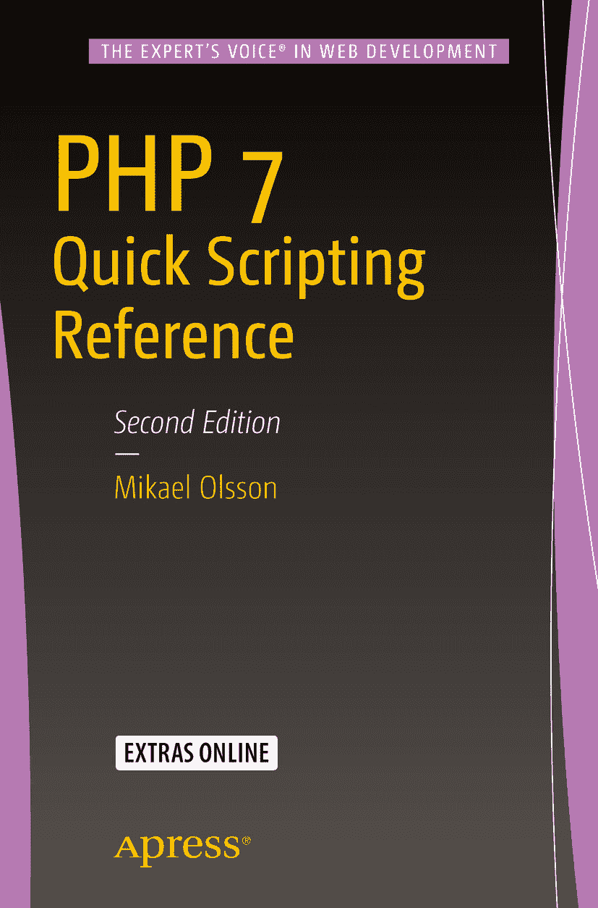

  
Mikael Olsson  
*PHP 7 快速脚本参考*  
2016 年第 2 版  

作者在本文中引用的任何源代码或其他补充材料，读者均可从 [`www.apress.com/9781484219218`](http://www.apress.com/9781484219218) 获取。关于如何找到本书源代码的详细信息，请访问 [`www.apress.com/source-code/`](http://www.apress.com/source-code/)。读者也可以在 SpringerLink 的“补充材料”部分查阅每章的源代码。  

ISBN 978-1-4842-1921-8  
电子版 ISBN 978-1-4842-1922-5  
DOI 10.1007/978-1-4842-1922-5  
美国国会图书馆控制号：2016941199  

© Mikael Olsson 2016  

*PHP 7 快速脚本参考*  
董事总经理：Welmoed Spahr  
首席编辑：Steve Anglin  
技术审校：Jamie Rumbelow  
编辑委员会：Steve Anglin, Pramila Balan, Louise Corrigan, Jonathan Gennick, Robert Hutchinson, Celestin Suresh John, Michelle Lowman, James Markham, Susan McDermott, Matthew Moodie, Jeffrey Pepper, Douglas Pundick, Ben Renow-Clarke, Gwenan Spearing  
统筹编辑：Mark Powers  
文字编辑：Kim Burton-Weisman  
排版：SPi Global  
索引编制：SPi Global  
插图制作：SPi Global  

如需翻译方面的信息，请发送电子邮件至 `rights@apress.com`，或访问 [`www.apress.com`](http://www.apress.com)。  

Apress 及 friends of ED 图书可批量购买，用于学术、企业或促销用途。大多数图书也提供电子书版本和许可证。如需更多信息，请参阅我们的大宗销售与电子书授权网页：[`www.apress.com/bulk-sales`](http://www.apress.com/bulk-sales)。  

作者姓名列于扉页中  

本书中可能出现商标名称、徽标和图像。对于商标名称、徽标或图像的每次出现，我们并非都使用商标符号，而是仅以编辑方式使用这些名称、徽标和图像，以维护商标所有者的利益，且无意侵犯商标权。本出版物中使用商品名称、商标、服务标记及类似术语（即使未明确标识为商标），不应视为对它们是否受专有权利保护的意见表达。  

尽管本书中的建议和信息在出版时被认为是真实准确的，但作者、编辑和出版商均不对可能出现的任何错误或遗漏承担法律责任。出版商对本书所包含的内容不作任何明示或暗示的保证。  

采用无酸纸印刷  

由 Springer Science+Business Media New York（地址：233 Spring Street, 6th Floor, New York, NY 10013）向全球图书贸易发行。电话：1-800-SPRINGER，传真：(201) 348-4505，电子邮件：`orders-ny@springer-sbm.com`，或访问 `www.springeronline.com`。  

Apress Media, LLC 是一家加利福尼亚有限责任公司，其唯一成员（所有者）是 Springer Science + Business Media Finance Inc (SSBM Finance Inc)。SSBM Finance Inc 是一家特拉华州注册公司。  

## 引言  

PHP 是一种服务器端编程语言，用于创建动态网站和交互式 Web 应用程序。PHP 这个缩写最初代表 Personal Home Page（个人主页），但随着其功能增强，后来改为 PHP: Hypertext Preprocessor（PHP：超文本预处理器）。这个递归缩写源自其以 PHP 代码为输入、以 HTML 为输出的特性。这意味着用户无需安装任何软件即可查看 PHP 生成的网页，唯一的要求是 Web 服务器已安装 PHP 以解释脚本。  

与 HTML 网站不同，PHP 网站是动态生成的。网站并非由大量静态 HTML 文件组成，而是可能仅包含少量模板文件。模板文件仅使用 PHP 代码描述网站的结构，而网页内容从数据库中提取，样式格式则来自层叠样式表（CSS）。这使得网站整体更改只需在单一位置进行，从而提供灵活、易于设计、维护和更新的网站。  

使用 PHP 创建网站时，通常使用内容管理系统（CMS）。CMS 提供了一个完全集成的网站开发平台，包含后端和前端。前端是访问者浏览网站时看到的内容，而后端则由管理员配置、更新和管理网站。后端还允许 Web 开发人员更改模板文件和修改插件，以更广泛地定制网站的功能和结构。免费的基于 PHP 的 CMS 解决方案示例包括 WordPress、Joomla、ModX 和 Drupal，其中 WordPress 最为流行，占据了超过一半的 CMS 市场份额。  

PHP 的第一个版本由 Rasmus Lerdorf 创建，并于 1995 年发布。自那时起，PHP 已从一个简单的脚本语言发展为功能完备的 Web 编程语言。官方实现现由 PHP Group 发布，截至撰写本文时，PHP 7 是最新版本。该语言可免费使用，并且是开源的，允许开发人员为其自身使用而扩展，或为其发展做出贡献。  

PHP 是当今使用最广泛的服务器端编程语言。与其他服务器端技术（如 ASP.NET、Java、Ruby 和 Perl）相比，它拥有不断增长的 80% 市场份额。PHP 被广泛采用的原因之一是其平台独立性。它可以安装在所有主流 Web 服务器和操作系统上，并与任何主流数据库系统配合使用。PHP 的另一个强大特性是其基于 C 和 Perl 的易用语法，新手易于学习；然而，PHP 也为专业程序员提供了许多高级功能。

