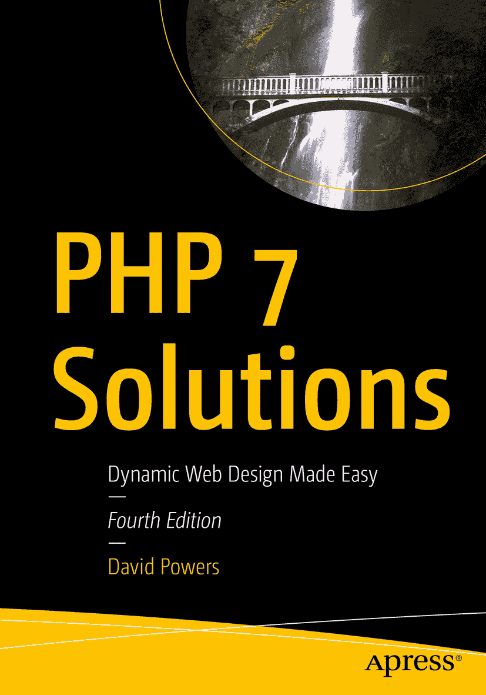

ISBN 978-1-4842-4337-4 e-ISBN 978-1-4842-4338-1 [`doi.org/10.1007/978-1-4842-4338-1`](https://doi.org/10.1007/978-1-4842-4338-1) © David Powers 2019 本作品受版权保护。出版商保留所有权利，涵盖材料的全部或部分内容，具体包括翻译权、重印权、插图再利用权、朗诵权、广播权、微缩胶片或其他物理形式的复制权、传输或信息存储与检索权、电子改编权、计算机软件权，以及目前已知或未来开发的任何类似或不同方法。本书中可能出现商标名称、标识和图像。我们并非在每个商标名称、标识或图像出现时均使用商标符号，而是仅以编辑方式使用这些名称、标识和图像，并服务于商标所有者，无意侵犯商标权。在本出版物中使用商品名称、商标、服务标记及类似术语（即使未明确标明）不应被视为对这些术语是否受专有权利约束的意见表达。尽管本书中的建议和信息在出版时被认为是真实准确的，但作者、编辑和出版商均不对可能出现的任何错误或遗漏承担法律责任。出版商对本书所含内容不作任何明示或暗示的担保。本书由 Springer Science+Business Media New York 在全球图书贸易中发行，地址：233 Spring Street, 6th Floor, New York, NY 10013。电话：1-800-SPRINGER，传真：(201) 348-4505，电子邮件：orders-ny@springer-sbm.com，或访问 www.springeronline.com。Apress Media, LLC 是加利福尼亚州的有限责任公司，其唯一成员（所有者）是 Springer Science + Business Media Finance Inc（SSBM Finance Inc）。SSBM Finance Inc 是特拉华州的公司。

*谨以此书纪念我的朋友、伴侣和相伴多年的妻子 Toshiko*

## 引言

我一直担心本书副标题“动态网页设计轻松入门”会不当提升读者的期望。PHP 并不难，但也不像速成蛋糕粉那样：只需加水搅拌即可。每个网站都不同，所以不可能抓取一个脚本，粘贴到网页中，就指望它能运行。我的目标是帮助那些对编程知之甚少或完全不懂的网页设计师，让他们有信心深入代码并根据自身需求进行调整。

使用本书不需要任何 PHP 或其他编程语言的经验，但它的推进速度较快。在最初几章之后，你将开始接触该语言相对高级的特性。别让这一点吓到你，将其视为一个挑战。本书之所以命名为“PHP 解决方案”，正是为了提供实际问题的解决方案，而非一系列无意义的练习。

如何使用本书取决于你的经验水平。如果你是 PHP 和编程的新手，请从头开始，逐步通读全书。本书按逻辑顺序组织，每章都建立在先前章节所获得的知识和技能之上。在描述代码时，我会尽量用通俗的语言解释其作用。我避免使用行话，但不会回避技术术语（每个新术语在首次出现时都会简要说明）。如果你有更多 PHP 经验，可以直接跳到你感兴趣的任何部分。即使没有我的解释你也能理解代码，我也希望文本能阐明我在用 PHP 解决问题时的思维过程。

### 一个微小但重要的变化

本版的标题有一个细微差异。我们在其中悄悄加了个“7”。之前的版本仅称为“PHP 解决方案”，但我和编辑决定明确说明本版专注于 PHP 7——目前唯一受支持的 PHP 版本。PHP 7 的一大优势（除了大幅提升的速度）是它几乎完全向后兼容 PHP 5——换句话说，几乎所有在 PHP 5 上运行的代码都可以无缝迁移到 PHP 7。但反过来则不成立。本书使用了大量 PHP 7 的新特性。因此，如果你尝试在仍运行 PHP 5 的旧服务器上运行 PHP 7 解决方案中的代码，很快会遇到问题。

由于托管公司往往升级其提供的 PHP 版本较慢，本书之前的版本为旧版 PHP 提供了变通方案。但这次我不会这样做。对于一些读者来说，这意味着在本地测试环境中完美运行的代码，上传到远程服务器后很可能会失效。截至 2019 年中，尽管 PHP 5 的所有官方支持已于 2018 年 12 月结束，仍有超过三分之二的运行 PHP 的网页服务器在使用 PHP 5。甚至连 PHP 7 的原始版本（7.0）也不再受支持。本书中的代码是在 PHP 7.3 上开发的，不过除了第 10 章（附有变通方案）中提到的一个微小例外，所有内容均可在 PHP 7.2 或更高版本上运行。

PHP 不像那辆你开了多年、只要给予足够关爱和机油就无需更换的老爷车。PHP 在不断更新，不仅是为了添加新功能，也是为了修复漏洞和安全问题。即使你对新功能不感兴趣，也应该关注安全修复。互联网可能是一个充满各种不轨之徒试图寻找网站可利用漏洞的野蛮之地。本书包含大量安全建议，但它无法保护你免受 PHP 内核中发现的安全问题的侵害。确保你的远程服务器保持更新，是一项不可或缺的保险政策，以最大程度降低风险。而且这不会增加额外成本，因为 PHP 是免费的（尽管托管公司会收取服务费）。

如果你确实需要兼容 PHP 5 的代码，请查阅本书第三版。但更好的做法是，迁移到最新版本的 PHP。

### 本版还有哪些新内容？

本版紧密遵循之前版本的结构，并使用相同的“日本之旅”案例研究，因此乍一看可能觉得变化不大。然而，每一页都经过修订，力求文本更清晰。更重要的是，代码经过了全面审查和更新。第 9 章和第 10 章中的 `Upload` 和 `ThumbnailUpload` 类已被彻底重写，使其更简单、更健壮。新增了一章关于数组操作的内容；编写 PHP 脚本的章节被拆分为两章。第 3 章现在是为新手提供的 PHP 快速入门，而第 4 章则作为初学者和经验丰富读者的 PHP 快速参考。第 4 章已扩展，涵盖 PHP 7 的新特性。

关于操作 MySQL 或 MariaDB 数据库的章节也已修订，使代码更安全。我还添加了一个 PHP 解决方案，重点说明了使用超全局变量 `$_SERVER['PHP_SELF']` 的潜在问题，并提出了一个可靠的变通方案。

