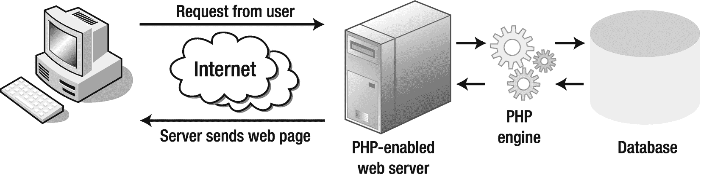

# PHP 如何使页面动态化

PHP 最初被设计为嵌入到网页的 HTML 中，并且至今仍常以这种方式使用。例如，要在版权声明中显示当前年份，你可以将其放在页脚中：

```
&copy;  PHP 7 解决方案
```

在启用了 PHP 的 Web 服务器上，`<?php` 和 `?>` 标签之间的代码会被自动处理并像这样显示年份：


这只是一个简单的例子，但它说明了使用 PHP 的一些优势：

* 任何在元旦午夜钟声敲响后访问你网站的人都会看到正确的年份。

* 日期由 Web 服务器计算，因此即使用户计算机的时钟设置不正确，也不会受到影响。

虽然像这样将 PHP 代码嵌入 HTML 很方便，但它是重复性的，并且可能导致错误。它还可能使你的网页难以维护，尤其是当你开始使用更复杂的 PHP 代码时。因此，常见的做法是将大量动态代码存储在单独的文件中，然后使用 PHP 从不同的组件构建你的页面。这些单独的文件——或者通常被称为*包含文件*——可以只包含 PHP、只包含 HTML，或者两者都包含。

举一个简单的例子，你可以将网站的导航菜单放在一个包含文件中，并使用 PHP 将其包含在每个页面中。每当需要更改菜单时，你只需编辑这个包含文件，更改就会自动反映在每个包含该菜单的页面中。想象一下，对于一个拥有几十个页面的网站来说，这能节省多少时间！

对于普通的 HTML 页面，内容由 Web 开发人员在设计时固定并上传到 Web 服务器。当有人访问该页面时，Web 服务器只是发送 HTML 和其他资源，例如图片和样式表。这是一个简单的事务——请求来自浏览器，固定的内容由服务器发回。当你使用 PHP 构建网页时，情况要复杂得多。图 1-1 展示了这个过程。



图 1-1. Web 服务器响应请求动态构建每个 PHP 页面

当访问一个由 PHP 驱动的网站时，会触发以下一系列事件：

1. 浏览器向 Web 服务器发送请求。

2. Web 服务器将请求交给嵌入在服务器中的 PHP 引擎。

3. PHP 引擎处理代码。在许多情况下，它可能在构建页面之前还会查询数据库。

4. 服务器将完成的页面发送回浏览器。

这个过程通常只需要几分之一秒，因此 PHP 网站的访问者不太可能注意到任何延迟。由于每个页面都是单独构建的，PHP 网站可以响应用户输入，在用户登录时显示不同的内容，或显示数据库搜索的结果。

## 创建能够自主思考的页面

PHP 是一种服务器端语言。PHP 代码保留在 Web 服务器上。经过处理后，服务器只发送脚本的输出。通常，输出是 HTML，但 PHP 也可用于生成其他 Web 语言，例如 `JSON`（JavaScript 对象表示法）或 `XML`（可扩展标记语言）。

PHP 使你能够将基于条件判断的逻辑引入网页。一些决策是利用 PHP 从服务器收集的信息做出的：日期、时间、星期几、页面 URL 中的信息等等。如果是星期三，它将显示星期三的电视节目表。在其他时候，决策基于用户输入，PHP 从在线表单中提取这些输入。如果你已在某个网站注册，它将显示个性化信息——诸如此类。