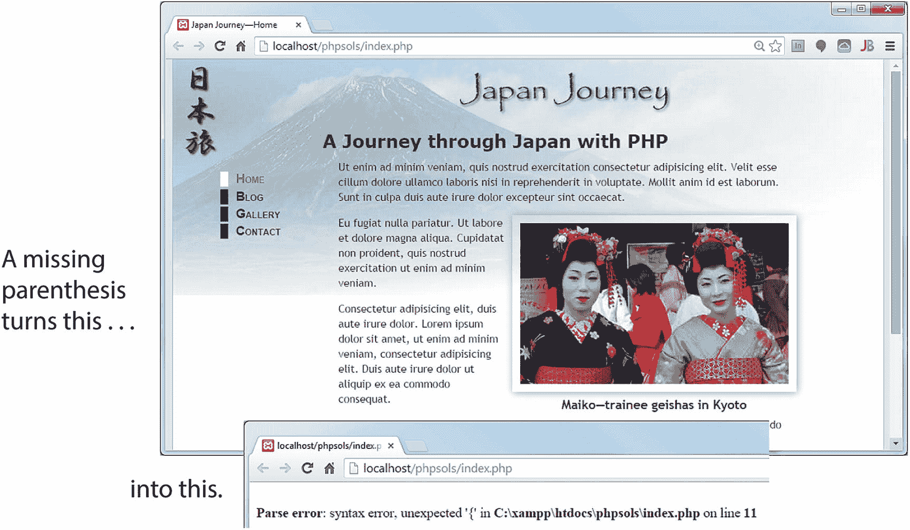

# PHP 使用和学习的难度如何？

PHP 并非高深莫测，但也不要期望在 5 分钟内成为专家。对新手来说，最大的冲击或许是 PHP 对错误的容忍度远低于浏览器对 HTML 的容忍度。如果你在 HTML 中省略了一个结束标签，大多数浏览器仍然会渲染页面。但如果你在 PHP 中省略了一个结束引号、分号或大括号，你会得到一个毫不妥协的错误消息，如图 1-2 所示。这不仅适用于 PHP，也影响所有编程语言，例如 JavaScript 和 `C#`。

图 1-2. 像 PHP 这样的服务器端语言对大多数编码错误是零容忍的

如果你是那种使用 Adobe Dreamweaver 这样的可视化设计工具，并且从不查看底层代码的 Web 设计师或开发者，那么是时候重新思考你的方法了。将 PHP 与结构不良的 HTML 混合很可能会导致问题。PHP 使用循环来执行重复性任务，例如显示数据库搜索结果。循环会重复执行同一段代码——通常是 PHP 和 HTML 的混合——直到所有结果都显示完毕。如果你将循环放在错误的位置，或者你的 HTML 结构糟糕，你的页面很可能会像纸牌屋一样坍塌。

如果你还没有养成这种习惯，那么使用万维网联盟（`W3C`）的标记验证服务（`http://validator.w3.org/unicorn`）检查你的页面是一个好主意。

#### 注意
`W3C` 是制定 HTML 和 CSS 等标准以确保 Web 长期发展的国际组织。它由万维网的发明者蒂姆·伯纳斯-李领导。要了解 `W3C` 的使命，请参阅 `www.w3.org/Consortium/mission`。

### 我能直接复制粘贴代码吗？

复制本书中的代码完全没问题，这正是代码存在的意义。我将本书设计为一系列实践项目，每个项目都会解释代码的作用和存在理由。即使你无法完全理解所有工作原理，这也能让你建立足够的信心，知道哪些代码可以按需修改，哪些部分最好保持原样。但要想充分利用本书，你需要开始动手尝试这些工具，然后摸索出自己的解决方案。

`PHP` 就像一个功能强大的工具箱。它拥有数千个内置函数，可以执行各种任务，例如将文本转换为大写、从大图中生成缩略图，或者连接数据库等。真正的强大之处在于以不同方式组合这些函数，并加入你自己的条件逻辑。

### PHP 有多安全？

`PHP` 就像你家中的电或厨房刀具：正确使用非常安全；不负责任地使用则可能造成巨大伤害。本书第一版的创作灵感之一，源于当时一系列利用邮件脚本漏洞将网站变成垃圾邮件中继的攻击事件。解决方法其实很简单（你将在第 6 章学到），但即便多年后，我仍看到有人使用同样的不安全技术，让网站暴露在攻击之下。

`PHP` 并不危险，也并非所有人使用它都需要成为安全专家。重要的是要理解 `PHP` 安全的基本原则：*在处理用户输入前始终进行检查*。你会发现这贯穿了本书的始终。大多数安全风险只需极少的努力就能消除。

保护自己的最佳方式，就是理解你所使用的代码。

## 编写 PHP 需要什么软件？

严格来说，编写 `PHP` 脚本不需要任何特殊软件。`PHP` 代码是纯文本，可以在任何文本编辑器中创建，比如 Windows 上的 `Notepad` 或 macOS 上的 `TextEdit`。话虽如此，如果你使用一款具有加速开发流程功能的程序，你的工作会轻松得多。市面上有许多选择——既有免费的，也有付费的。

### 选择 PHP 编辑器时需要注意什么

如果代码中存在错误，你的页面很可能无法加载到浏览器，你只会看到一条错误信息。你应该选择一款具备以下功能的脚本编辑器：

- **PHP 语法检查**：过去这只有昂贵的专用程序才具备，但现在许多免费程序也提供了此功能。语法检查器会在你输入时监控代码并高亮显示错误，从而节省大量时间和挫败感。

- **PHP 语法着色**：代码会根据其作用以不同颜色高亮显示。如果你的代码呈现了意外的颜色，这通常是个明确的出错信号。

- **PHP 代码提示**：`PHP` 有太多内置函数，即使是有经验的用户也难以记住所有用法。许多脚本编辑器会自动显示工具提示，提醒你某段特定代码的用法。

- **行号显示**：快速定位特定行能让故障排查简单得多。

- **"括号匹配"功能**：圆括号 `()`、方括号 `[]` 和花括号 `{}` 必须始终成对出现。很容易忘记关闭其中一对。所有优秀的脚本编辑器都能帮助找到匹配的括号。

你目前用于构建网页的程序可能已经具备了上述部分或全部功能。即使你不打算大量进行 `PHP` 开发，如果你的网页开发程序不支持语法检查，也应该考虑使用专用的脚本编辑器。以下专用的脚本编辑器拥有所有基本功能，如语法检查和代码提示。这个列表并非详尽无遗，而是基于个人经验推荐。

- **PhpStorm** (`www.jetbrains.com/phpstorm/`)：虽然这是一款专用的 `PHP` 编辑程序，但它对 `HTML`、`CSS` 和 `JavaScript` 也有出色的支持。它目前是我最喜爱的 `PHP` 开发程序。采用年度订阅制。如果你在订阅至少 12 个月后取消，你将获得一个旧版本的永久许可证。

- **Visual Studio Code** (`https://code.visualstudio.com/`)：微软出品的一款优秀代码编辑器，不仅可在 Windows 上运行，也支持 macOS 和 Linux。它是免费的，并内置了对 `PHP` 的支持。

- **Sublime Text** (`www.sublimetext.com/`)：如果你是 `Sublime Text` 的粉丝，它有用于 `PHP` 语法着色、语法检查和文档的插件。可免费试用，但持续使用应购买相对便宜的许可证。

- **Zend Studio** (`www.zend.com/en/products/studio/`)：如果你认真对待 `PHP` 开发，`Zend Studio` 是功能最全面的 `PHP` 集成开发环境（`IDE`）。它由 Zend 公司创建，该公司的核心成员正是 `PHP` 开发的主要贡献者。`Zend Studio` 可运行于 Windows、macOS 和 Linux。个人与商业用途有不同的定价。

- **PHP Development Tools** (`www.eclipse.org/pdt/`)：`PDT` 是 `Zend Studio` 的精简版，优点是免费。它运行在 `Eclipse` 上，这是一个支持多种计算机语言的开源 `IDE`。如果你曾使用过 `Eclipse` 处理其他语言，应该会发现它相对易用。`PDT` 可运行于 Windows、macOS 和 Linux，既可以作为 `Eclipse` 插件安装，也可以作为一键安装包（自动安装 `Eclipse` 和 `PDT` 插件）使用。

## 那么，让我们开始吧…

本章仅简要介绍了 `PHP` 能为你的网站添加哪些动态功能，以及你需要哪些软件来实现。使用 `PHP` 的第一步是搭建测试环境。下一章将介绍 Windows 和 macOS 所需的内容。

