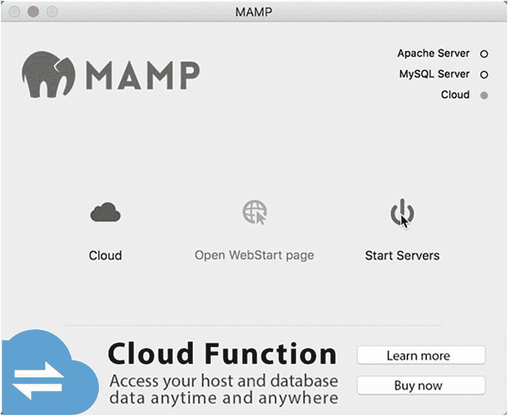
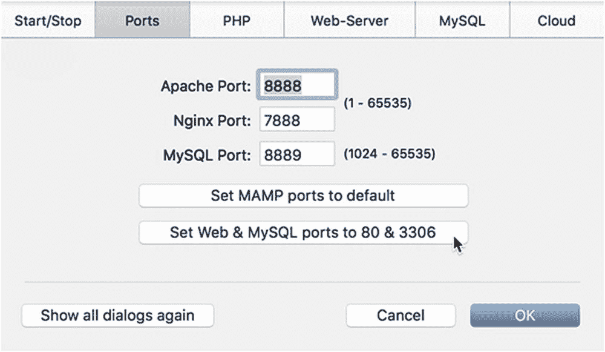

# 提示

如果您的本地计算机上已经有一个 PHP 7 测试环境，则无需重新安装。只需查看本章末尾标题为“检查您的 PHP 设置”的章节即可。

## 单个程序还是集成包？

多年来，我一直主张分别安装 PHP 测试环境的每个组件，而不是使用一次性安装 Apache、PHP、MySQL 和 phpMyAdmin 的软件包。我的建议是基于早期一些集成包的不可靠质量，它们安装容易但几乎无法卸载或升级。然而，目前可用的集成包非常出色，我现在毫不犹豫地推荐它们。

在我的计算机上，我使用 XAMPP 用于 Windows ([`www.apachefriends.org/index.html`](http://www.apachefriends.org/index.html)) 和 MAMP 用于 macOS ([`www.mamp.info/en/`](http://www.mamp.info/en/))。还有其他可用的软件包；选择哪个并不重要。

## Windows 系统上的设置

在继续之前，请确保您以管理员身份登录。

### 让 Windows 显示文件扩展名

默认情况下，大多数 Windows 计算机会隐藏常见的三或四个字符的文件扩展名，例如 `.doc` 或 `.html`，因此在对话框和 Windows 文件资源管理器中，您只会看到 `thisfile` 而不是 `thisfile.doc` 或 `thisfile.html`。

请按照以下说明在 Windows 10 和 8 中启用文件扩展名的显示：

1.  打开文件资源管理器。

2.  选择“视图”以展开文件资源管理器窗口顶部的功能区。

3.  选中“文件扩展名”复选框。

显示文件扩展名更安全——您可以识别出病毒编写者是否将 `.exe` 或 `.scr` 可执行文件附加到了一个看似无害的文档上。

### 选择 Web 服务器

大多数 PHP 安装都运行在 Apache Web 服务器上。两者都是开源的，并且能很好地协同工作。然而，Windows 有自己的 Web 服务器：Internet 信息服务 (IIS)，它也支持 PHP。微软已与 PHP 开发团队密切合作，将 PHP 在 IIS 上的性能提升到与 Apache 大致相同的水平。那么，您应该选择哪一个呢？

除非您需要 IIS 用于 ASP 或 ASP.NET，否则我建议您按照下一节所述，使用 XAMPP 或其他集成包安装 Apache。如果您需要使用 IIS，安装 PHP 最便捷的方法是使用 Microsoft Web 平台安装程序 (Web PI)，您可以从 [`www.microsoft.com/web/downloads/platform.aspx`](http://www.microsoft.com/web/downloads/platform.aspx) 下载。

### 在 Windows 上安装集成环境包

目前有三大主流集成环境包，可在 Windows 系统中一键安装 Apache、PHP、MySQL 或 MariaDB、phpMyAdmin 及其他多种工具：XAMPP（[`www.apachefriends.org/index.html`](http://www.apachefriends.org/index.html)）、WampServer（[`www.wampserver.com/en/`](http://www.wampserver.com/en/)）和 EasyPHP（[`www.easyphp.org`](http://www.easyphp.org)）。安装过程通常只需几分钟。安装完成后，可能需要根据本章后续内容调整一些设置。

由于印刷书籍的时效性，各版本会随时间变化，因此我不详述安装过程。每个集成环境包在其官方网站上都有安装说明。

## 在 macOS 上进行设置

macOS 系统预装了 Apache Web 服务器和 PHP，但默认并未启用。我建议不使用预装版本，而是安装 MAMP，它能一键安装 Apache、PHP、MySQL、phpMyAdmin 及其他多种工具。

为避免与预装的 Apache 和 PHP 发生冲突，MAMP 将所有应用程序安装在硬盘上的专用文件夹中。这样，如果你决定不再使用 MAMP，只需将 MAMP 文件夹拖入废纸篓即可轻松卸载所有内容。

### 安装 MAMP

开始前，请确保你以管理员权限登录到计算机。

1.  访问 [`www.mamp.info/en/downloads/`](http://www.mamp.info/en/downloads/) 并选择 MAMP & MAMP PRO 的下载链接。这将下载一个包含免费版和付费版 MAMP 的磁盘映像。

2.  下载完成后，启动磁盘映像。你将看到一份许可协议。必须点击“同意”才能继续装载磁盘映像。

3.  按照屏幕上的说明进行操作。

4.  确认 MAMP 已安装在你的 `Applications` 文件夹中。

#### 注意

MAMP 会自动将免费版和付费版分别安装到名为 `MAMP` 和 `MAMP PRO` 的独立文件夹中。付费版可以更方便地配置 PHP 和操作虚拟主机，但免费版完全够用，尤其适合初学者。如果你想删除 `MAMP PRO` 文件夹，请勿直接将其拖入废纸篓。请打开该文件夹，双击 `MAMP PRO` 卸载图标。付费版需要这两个文件夹才能运行。

### 测试与配置 MAMP

默认情况下，MAMP 会为 Apache 和 MySQL 使用非标准端口。除非你同时运行了多个 Apache 或 MySQL 实例，否则请按照以下步骤更改端口设置：

1.  双击 `Applications/MAMP` 中的 MAMP 图标。如果弹出提示面板，邀请你通过 MAMP Cloud Functions 在多台 Mac 上访问数据，请点击左上角的“关闭”按钮关闭面板。MAMP Cloud Functions 是一项付费服务，本书不需要使用。你可以点击“了解更多”按钮获取详细信息。这里还有一个复选框，可以防止每次启动 MAMP 时都显示该面板。

2.  在 MAMP 控制面板中点击“启动服务器”（见图 2-1）。Apache Server 和 MySQL Server 旁边应亮起绿色小灯，表示它们正在运行。你的默认浏览器也应启动并显示 MAMP 欢迎页面。

    

    图 2-1. 在 MAMP 控制面板中启动服务器

3.  如果浏览器没有自动启动，请在 MAMP 控制面板中点击“打开 WebStart 页面”。

4.  检查浏览器地址栏中的 URL。它以 `localhost:8888` 开头。其中的 `:8888` 表示 Apache 正在非标准端口 8888 上监听请求。

5.  最小化浏览器，在 MAMP 控制面板的任意位置单击，使其成为活动应用。

6.  转到屏幕顶部的 MAMP 主菜单，选择“偏好设置”（或使用键盘快捷键 `Cmd+,`）。

7.  在打开的窗口顶部选择“端口”。它显示 Apache 和 MySQL 分别运行在端口 8888 和 8889 上（见图 2-2）。

    

    图 2-2. 更改 Apache 和 MySQL 端口

8.  如图 2-2 所示，点击“将 Web 和 MySQL 端口设置为 80 和 3306”。数字将变为标准端口：Apache 为 80，MySQL 为 3306。

#### 注意

MAMP 现在支持将 Nginx 作为备选 Web 服务器。当我点击“将 Web 和 MySQL 端口设置为 80 和 3306”时，Apache Port 和 Nginx Port 都变成了 80，这会导致设置无法生效。如果发生这种情况，请手动将 Nginx Port 重置为 7888。

1.  点击“确定”，并在提示时输入你的 Mac 密码。MAMP 将重启两个服务器。