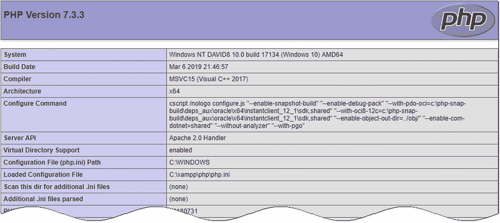

# 提示

请记得启动测试环境中的 Web 服务器来查看 PHP 页面。

## 检查你的 PHP 设置

安装 PHP 后，最好检查一下它的配置设置。除了核心功能外，PHP 还有大量可选扩展。本书所需的所有扩展，集成安装包和 Microsoft Web PI 都已安装。然而，一些基本的配置设置可能略有不同。为避免意外问题，请调整你的 PHP 配置，使其与以下页面推荐的设置保持一致。

### 使用 `phpinfo()` 显示服务器配置

PHP 有一个内置命令 `phpinfo()`，可以显示 PHP 在服务器上的配置详情。`phpinfo()` 产生的详细信息量可能会让人感觉信息过载，但对于确定为什么某些东西在本地计算机上工作完美，而在实际网站上却不行，它极其有价值。问题通常在于远程服务器禁用了某个功能或未安装某个可选扩展。

集成安装包使运行 `phpinfo()` 变得简单：

- **XAMPP**: 点击 XAMPP 欢迎屏幕顶部菜单中的 `phpinfo` 链接。

- **MAMP**: 点击 MAMP 欢迎页面顶部主菜单中的 `phpinfo`。

- **WampServer**: 打开 WampServer 菜单并点击 Localhost。`phpinfo()` 的链接位于“工具”下。

或者，创建一个简单的测试文件，并按照以下说明在浏览器中加载它：

1. 确保 Apache 或 IIS 在你的本地计算机上运行。

2. 在脚本编辑器中输入以下内容：

   ```
   <?php phpinfo();
   ```

   文件中不应有其他任何内容。

3. 将文件保存为 `phpinfo.php`，放置在服务器的文档根目录中（参见本章前面的“在哪里放置你的 PHP 文件（Windows 和 Mac）”）。

4. 在浏览器地址栏中输入 `http://localhost/phpinfo.php` 并按回车键。

5. 你应该会看到一个类似于图 2-3 的页面，显示 PHP 版本以及你的 PHP 配置的详细信息。

   

   图 2-3. 运行 `phpinfo()` 命令会显示 PHP 配置的完整详情

6. 记下“已加载的配置文件”项的值。这将告诉你 `php.ini` 的位置，`php.ini` 是需要编辑以更改大多数 PHP 设置的文本文件。

7. 向下滚动到标记为“核心”的部分，并将设置与表 2-1 中推荐的设置进行比较。记下任何差异，以便你可以按照本章后续所述的方法进行更改。

**表 2-1. 推荐的 PHP 配置设置**

| 指令 | 本地值 | 备注 |
| --- | --- | --- |
| `display_errors` | 开启 | 对调试脚本中的错误至关重要。如果设置为关闭，错误会导致完全空白的屏幕，让你对可能的原因毫无头绪。 |
| `error_reporting` | 32767 | 将错误报告级别设置为最高。 |
| `file_uploads` | 开启 | 允许你使用 PHP 将文件上传到网站。 |
| `log_errors` | 关闭 | 当 `display_errors` 开启时，你不需要用错误日志填满硬盘。 |

8. 配置页面的其余部分显示哪些 PHP 扩展已启用。虽然页面似乎会一直往下延伸，但所有扩展都按字母顺序列出。要学习本书，请确保已启用以下扩展：

   - **gd**: 使 PHP 能够生成和修改图像及字体。

   - **mysqli**: 连接 MySQL/MariaDB（注意“i”代表“improved”（改进版））。PHP 7 不支持旧的 `mysql` 扩展，该扩展不应再使用）。

   - **PDO**: 提供与数据库无关的支持（可选）。

   - **pdo_mysql**: 连接 MySQL/MariaDB 的替代方法（可选）。

   - **session**: 会话维护与用户关联的信息，用于用户认证等功能。

你还应该在远程服务器上运行 `phpinfo()` 来检查哪些功能已启用。如果列出的扩展不受支持，那么当你将文件上传到网站时，本书中的部分代码将无法正常工作。`PDO` 和 `pdo_mysql` 在共享主机上并不总是启用，但你可以改用 `mysqli`。`PDO` 的优势在于它与软件无关，因此你只需更改一、两行代码，就能使脚本适用于 MySQL 以外的数据库。而使用 `mysqli` 则让你必须使用 MySQL/MariaDB。

如果你设置中的任何核心设置与表 2-1 中的推荐值不同，你将需要按照下一节所述，编辑 PHP 配置文件 `php.ini`。

### 警告

`phpinfo()` 显示的输出会泄露大量信息，这些信息可能被恶意黑客用来攻击你的网站。检查完配置后，务必从远程服务器上删除该文件。不要为了日后方便而将其留在那里。对你来说方便的东西，对坏人来说甚至更方便。

### 编辑 `php.ini`

PHP 配置文件 `php.ini` 是一个非常长的文件，这常常会让编程新手感到不安，但完全不必担心。该文件以纯文本编写，其长度较长的一个原因是其中包含大量用于解释各种选项的注释。话虽如此，在编辑 `php.ini` 之前最好先备份一份，以防操作失误。

打开 `php.ini` 的方式取决于你的操作系统以及安装 PHP 的方式：

- 如果你在 Windows 上使用了集成安装包（如 XAMPP），请在 Windows 资源管理器中双击 `php.ini`。该文件会自动在记事本中打开。

- 如果你使用 Microsoft Web PI 安装了 PHP，`php.ini` 通常位于 Program Files 的子文件夹中。虽然你可以双击打开 `php.ini`，但将无法保存任何修改。此时，请右键单击记事本，选择“以管理员身份运行”。在记事本中，选择“文件”➤“打开”，并将选项设置为显示所有文件（`*.*`）。导航到 `php.ini` 所在的文件夹，选中该文件，然后点击“打开”。

- 在 macOS 上，请使用纯文本编辑器打开 `php.ini`。如果使用 TextEdit，请确保它以纯文本格式（而非富文本格式）保存文件。

以分号（`;`）开头的行是注释。你需要编辑的行不以分号开头。

使用文本编辑器的“查找”功能，定位到需要按照表 2-1 建议进行修改的指令。大多数指令前面都有一个或多个如何设置它们的示例。确保不要误编辑某个带注释的示例。

对于使用 `On` 或 `Off` 的指令，只需将值更改为建议值即可。例如，如果你需要开启错误信息的显示，请编辑如下行：

```
display_errors = Off
```

将其修改为：

```
display_errors = On
```

要设置错误报告级别，你需要使用 PHP 常量，这些常量以大写字母书写且**区分大小写**。该指令应如下所示：

```
error_reporting = E_ALL
```

编辑 `php.ini` 后，保存文件，然后重启 Apache 或 IIS 以使更改生效。如果 Web 服务器无法启动，请检查服务器的错误日志文件。该文件可在以下位置找到：

- **XAMPP**：在 XAMPP 控制面板中，点击 Apache 旁边的“日志”按钮，然后选择 Apache (error.log)。

- **MAMP**：在 `/Applications/MAMP/logs` 中，双击 `apache_error.log` 以在控制台应用中打开。

- **WampServer**：在 WampServer 菜单中，选择 Apache ➤ Apache 错误日志。

- **EasyPHP**：右键单击系统托盘中的 EasyPHP 图标，选择“日志文件”➤ Apache。

- **IIS**：日志文件的默认位置是 `C:\inetpub\logs`。

错误日志中的最新条目会提示你是什么原因阻止了服务器重启。利用该信息来修正你对 `php.ini` 所做的更改。如果这样仍不起作用，那就庆幸自己在编辑前备份了 `php.ini` 吧。使用一份干净的备份从头开始，并仔细检查你的编辑内容。

## 接下来做什么？

现在你已经拥有了一个可用的 PHP 测试环境，想必已经迫不及待想要开始工作了。我最不愿做的就是打击任何人的热情，但在将 PHP 用于正式网站之前，你应当对这门语言的基本规则有所了解。因此，在深入那些酷炫的功能之前，请阅读下一章，其中解释了如何编写 PHP 脚本。即使你已经接触过 PHP，也请不要跳过这一章——它真的非常重要。