# 告知服务器处理 PHP

PHP 是一种**服务器端语言**。Web 服务器（通常是 Apache）会处理你的 PHP 代码，并且只将结果（通常为 HTML）发送到浏览器。由于所有操作都在服务器端进行，你需要告诉服务器你的页面包含 PHP 代码。这涉及两个简单的步骤：

-   为每个页面指定一个 PHP 文件扩展名；默认是`.php`。只有在托管公司明确要求时，才使用其他扩展名。

-   使用 PHP 标签标识所有 PHP 代码。

起始标签是`<?php`，结束标签是`?>`。如果你将标签与周围代码放在同一行，起始标签前或结束标签后不需要有空格，但起始标签中的`php`后面必须有一个空格，如下所示：

```text
这是嵌入了 PHP 的 HTML。
```

当插入多行 PHP 代码时，为了清晰起见，最好将起始和结束标签分别放在单独的行上。

你可能会遇到`<?`作为起始标签的短格式替代版本。然而，并非所有服务器都启用了`<?`。请坚持使用`<?php`，这能保证正常工作。当一个文件只包含 PHP 代码时，强烈建议省略结束的 PHP 标签。这可以避免在处理包含文件时出现潜在问题（参见第 5 章）。

> **注意**
>
> 为了节省篇幅，本书中的大多数示例都省略了 PHP 标签。在你编写自己的脚本或将 PHP 嵌入网页时，必须始终使用它们。

## 在网页中嵌入 PHP

PHP 是一种**嵌入式语言**。这意味着你可以在普通网页中插入 PHP 代码块。当有人访问你的网站并请求一个 PHP 页面时，服务器会将其发送给 PHP 引擎，该引擎从上到下读取页面，寻找 PHP 标签。HTML 和 JavaScript 会原封不动地通过，但只要 PHP 引擎遇到`<?php`标签，它就会开始处理你的代码，并一直持续到遇到结束的`?>`标签（或者如果 PHP 代码之后没有内容，则持续到脚本末尾）。如果 PHP 产生了任何输出，它就会在该位置插入。

> **提示**
>
> 一个页面可以有多个 PHP 代码块，但它们不能互相嵌套。

图 3-1 显示了一个嵌入在普通网页中的 PHP 代码块，以及它在浏览器中以及经过 PHP 引擎处理后的页面源代码视图中的样子。该代码计算当前年份，检查它是否与一个固定年份（由图中左侧代码第 26 行的`$startYear`表示）不同，并在版权声明中显示适当的年份范围。从图右下角的页面源代码视图中可以看到，发送给浏览器的内容中没有任何 PHP 的痕迹。

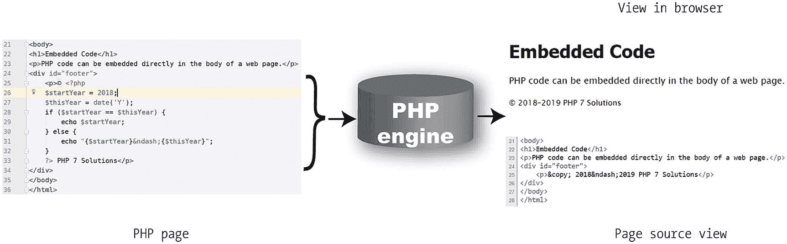

图 3-1. PHP 代码保留在服务器上；只有输出被发送到浏览器

> **提示**
>
> PHP 并不总是直接为浏览器生成输出。例如，它可能在发送电子邮件或向数据库插入信息之前，检查表单输入的内容。因此，某些代码块被放置在主要 HTML 代码的上方或下方，或者放在外部文件中。然而，产生直接输出的代码，则应放在你想要显示输出的位置。

## 将 PHP 存储在外部文件中

除了将 PHP 嵌入到 HTML 中，将常用代码存储在单独的文件中也是常见做法。当一个文件只包含 PHP 代码时，起始的`<?php`标签是必须的，但结束的`?>`标签是可选的。事实上，推荐的做法是省略结束的 PHP 标签。但是，如果外部文件在 PHP 代码之后包含了 HTML，那么你*必须*使用结束的`?>`标签。

## 使用变量表示变化的值

图 3-1 中的代码看起来可能是一种非常冗长的显示年份范围的方式。但从长远来看，PHP 解决方案可以节省你的时间。无需每年手动更新版权声明，PHP 代码会自动完成。你只需编写一次代码，之后就可以不管了。更重要的是，正如你将在第 5 章中看到的，如果你将代码存储在外部文件中，对该外部文件的任何更改都会反映在你网站的每个页面上。

这种自动显示年份的能力依赖于 PHP 的两个关键方面：**变量**和**函数**。顾名思义，函数用于执行操作；它们执行预设的任务，例如获取当前日期并将其转换为人类可读的格式。我稍后会介绍函数，所以让我们先来学习变量。图 3-1 中的脚本包含了两个变量：`$startYear`和`$thisYear`。

> **提示**
>
> **变量**只是你赋予某个可能变化或你事先不知道的事物的一个名称。PHP 中的变量总是以`$`（美元符号）开头。

我们在日常生活中一直在使用变量，却没有意识到。当你第一次见到某人时，你可能会问“你叫什么名字？”不管这个人叫汤姆、迪克还是哈丽特，“名字”这个词是恒定不变的。类似地，对于你的银行账户，资金进进出出（看起来大多是出去），但如图 3-2 所示，无论你是穷得叮当响还是富甲一方，可用的金额始终被称为余额。

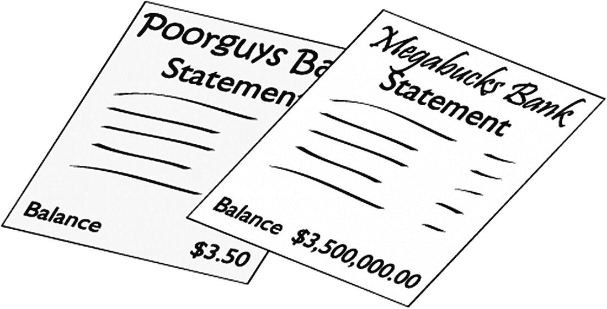

图 3-2. 银行对账单上的余额是变量的日常例子——名称保持不变，即使价值可能每天都在变化

所以，“名字”和“余额”是日常生活中的变量。只需在它们前面加上一个美元符号，你就得到了两个现成的 PHP 变量，如下所示：

```php
$name
$balance
```

很简单。

### 命名变量

只要你记住以下规则，你可以任意命名变量：

-   变量总是以美元符号（`$`）开头。

-   有效字符是字母、数字和下划线。

-   美元符号后的第一个字符必须是字母或下划线（`_`）。

-   除了下划线外，不允许有空格或标点符号。

-   变量名区分大小写：`$startYear`和`$startyear`是不同的。

在命名变量时，选择能表明其用途的名称。你目前看到的变量——`$startYear`、`$thisYear`、`$name`和`$balance`——都是很好的例子。组合多个单词时，将第二个或后续单词的首字母大写是一个好习惯（有时称为**驼峰命名法**）。或者，你可以使用下划线（`$start_year`、`$this_year`等）。

> **提示**
>
> 西欧语言中常用的带重音的字符在变量中是有效的。例如，`$prénom`和`$förnamn`是可以接受的。实际上，在 PHP 7 中，你还可以在变量名中使用其他字母表，如西里尔字母，以及非字母文字，如日语汉字；但在撰写本文时，这种用法尚未有文档记录，因此我建议坚持使用前面的规则。

不要试图通过使用非常短的变量名来节省时间。使用`$sy`、`$ty`、`$n`和`$b`而不是更具描述性的名称，会使代码难以理解——这也会使编写变得困难。更重要的是，它使得错误更难以发现。像往常一样，任何规则都有例外。按照惯例，`$i`、`$j`和`$k`经常用于记录循环运行的次数，而`$e`和`$t`用于错误检查。你将在本章后面看到这些示例。

> **注意**
>
> 虽然你在选择变量名方面有很大的自由度，但你不能使用`$this`，因为它在 PHP 面向对象编程中有特殊含义。同时建议避免使用[`https://secure.php.net/manual/en/reserved.php`](https://secure.php.net/manual/en/reserved.php)中列出的任何关键字。

## 为变量赋值

变量的值来源有多种，包括以下几种：

-   通过在线表单的用户输入

-   数据库

-   外部源，例如新闻源或 XML 文件

-   计算结果

-   直接包含在 PHP 代码中

无论值来自何处，总是使用等号（`=`）进行赋值，如下所示：

```php
$variable = value;
```

变量位于等号左侧，值位于右侧。因为它用于赋值，所以等号被称为**赋值运算符**。

> **注意**
>
> 从小对等号的熟悉，让我们很难摆脱认为它表示“等于”的思维习惯。然而，PHP 使用两个等号（`==`）来表示相等。这是导致初学者犯错的主要原因，有时甚至也会让经验丰富的开发者中招。`=`和`==`之间的区别将在本章后面更详细地介绍。

## 以分号结束命令

PHP 被编写为一系列命令或语句。通常，每个语句都告诉 PHP 引擎执行一个操作，并且后面必须跟一个分号，如下所示：

```php
echo "Hello, World!";
```

同所有规则一样，这里有一个例外：你可以省略代码块中最后一个语句后的分号。但是，**不要这样做**，除非是使用本章后面描述的短`echo`标签。与 JavaScript 不同，如果你省略分号，PHP 不会假设行尾应该有分号。这有一个很好的副作用：你可以将长语句分散到多行以便于阅读。与 HTML 一样，PHP 会忽略代码中的空白。相反，它依靠分号来指示一条命令的结束和另一条命令的开始。

> **提示**
>
> 缺少分号会使你的脚本彻底停止运行。

## 注释脚本

除非你将一段代码标记为注释，否则 PHP 会将所有内容视为要执行的语句。以下三个原因解释了为什么你可能想要这样做：

-   插入对脚本功能的提醒

-   插入一个占位符，用于稍后添加代码

-   暂时禁用一段代码

当一个脚本在你的脑海中还很新鲜时，插入任何不会被处理的内容似乎没有必要。然而，如果你需要在几个月后修改脚本，你会发现注释比单独阅读代码本身要容易得多。在团队协作时，注释也至关重要。它们有助于你的同事理解代码的意图。

在测试期间，阻止一行代码，甚至整个代码段运行通常很有用。PHP 会忽略任何标记为注释的内容，因此这是一种开启和关闭代码的有用方式。

有三种添加注释的方法：两种用于单行注释，一种用于跨越多行的注释。

### 单行注释

最常见的单行注释类型以两个正斜杠开头，如下所示：

```php
// 这是一个注释，PHP 引擎会忽略它
```

PHP 会忽略从双斜杠到行尾的所有内容，因此你也可以将注释放在代码旁（但只能在右侧）：

```php
$startYear = 2018; // 这是一个有效的注释
```

注释不是 PHP 语句，因此它们不以分号结尾。但不要忘记与注释在同一行的 PHP 语句末尾的分号。

另一种替代风格是使用井号（`#`），如下所示：

```php
# 这是另一种类型的注释，PHP 引擎会忽略它
$startYear = 2018; # 这也作为注释使用
```

这种注释风格通常用于指示较长脚本的各个部分，如下所示：

```php
##################
## 菜单部分 ##
##################
```

### 多行注释

要使注释跨越多行，请使用与层叠样式表（CSS）和 JavaScript 相同的风格。`/*` 和 `*/` 之间的任何内容都被视为注释，如下所示：

```php
/* 这是一个跨越
多行的注释。它使用了与 CSS 中相同的
开始和结束标记。 */
```

多行注释在测试或故障排除时特别有用，因为它们可用于禁用脚本的长段代码，而无需删除它们。

> **提示**  

> 良好的注释和精心选择的变量名使代码更易于理解和维护。

## 使用数组存储多个值

PHP 允许你将多个值存储在一个称为**数组**的特殊变量类型中。一个简单的理解方式是：数组就像一个购物清单。虽然每个项目可能不同，但你可以用同一个名字来统称它们。图 3-3 展示了这个概念：变量`$shoppingList`统称所有五个项目——酒、鱼、面包、葡萄和奶酪。

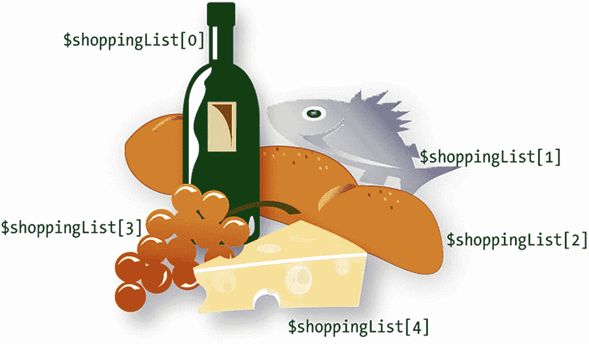

**图 3-3.** 数组是存储多个项目的变量，就像一个购物清单

单个项目——或**数组元素**——通过变量名后面紧跟着方括号中的数字来标识。PHP 会自动分配该数字，但重要的是要注意编号总是从 0 开始。因此，数组中的第一个项目，在我们的示例中是酒，被引用为`$shoppingList[0]`，而不是`$shoppingList[1]`。虽然总共有五个项目，但最后一个（奶酪）是`$shoppingList[4]`。这个数字被称为数组的**键**或**索引**，这种类型的数组被称为**索引数组**。

PHP 使用另一种类型的数组，其中键是一个单词（或字母和数字的任意组合）。例如，一个包含本书详细信息的数组可能如下所示：

```php
$book['title'] = 'PHP 7 Solutions: Dynamic Web Design Made Easy, Fourth Edition';
$book['author'] = 'David Powers';
$book['publisher'] = 'Apress';
```

这种类型的数组被称为**关联数组**。注意，数组键被括在引号中（单引号或双引号，都可以）。

数组是 PHP 中重要且有用的部分。你将大量使用它们，从第 5 章开始，你将把图像详情存储在一个数组中，以便在网页上显示随机图像。当您以一系列数组的形式获取搜索结果时，数组也会与数据库一起被广泛使用。

> **注意**  

> 你可以在第 4 章了解创建数组的各种方法。

## PHP 的内置超全局数组

PHP 有几个内置数组，它们会自动填充有用的信息。它们被称为**超全局数组**，通常以美元符号后跟一个下划线开头。唯一的例外是`$GLOBALS`，它包含对脚本**全局作用域**中所有变量的引用（有关作用域的说明，请参阅第 4 章的“变量作用域——黑盒函数”）。

你会经常看到两个超全局变量：`$_POST`和`$_GET`。它们分别包含通过超文本传输协议（HTTP）的`post`和`get`方法从表单传递的信息。这些超全局变量都是关联数组，并且`$_POST`和`$_GET`的键会自动从表单元素的名称或 URL 末尾查询字符串中的变量派生而来。

假设你的表单中有一个名为“`address`”的文本输入字段；当表单通过`post`方法提交时，PHP 会自动创建一个名为`$_POST['address']`的数组元素，如果使用`get`方法，则会生成`$_GET['address']`。如图 3-4 所示，`$_POST['address']`中包含访客在文本字段中输入的任何值，你可以将其显示在屏幕上、插入数据库、发送到电子邮箱，或者进行任何你需要的操作。

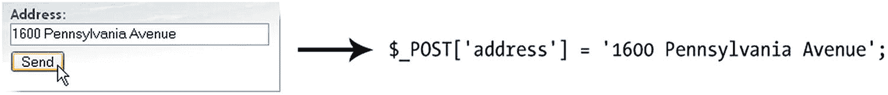

**图 3-4.** 你可以通过`$_POST`数组获取用户输入的值，该数组在使用`post`方法提交表单时会自动创建。

在第 6 章中，当你通过电子邮件将在线反馈表单的内容发送至收件箱时，将会用到`$_POST`数组。本书中你将使用的其他超全局数组包括：在第 5、14 和 15 章中用于从 Web 服务器获取信息的`$_SERVER`；在第 8 章中用于将文件上传到网站的`$_FILES`；以及在第 11 和 19 章中用于创建简单登录系统的`$_SESSION`。

**注意：** 别忘了 PHP 中的变量名是区分大小写的。所有超全局数组名称均需大写。例如，`$_Post`或`$_Get`将无法正常工作。

## 理解何时使用引号

如果仔细查看图 3-1 中的 PHP 代码块，你会发现第一个变量赋值时并未加引号。代码如下所示：

```
$startYear = 2018;
```

然而，在“使用数组存储多个值”部分的所有示例却都使用了引号，例如：

```
$book['title'] = 'PHP 7 Solutions: Dynamic Web Design Made Easy, Fourth Edition';
```

简单的规则如下：

* **数字**：无需引号

* **文本**：需要引号

一般来说，在文本或**字符串**（PHP 及其他计算机语言中对文本的称呼）周围使用单引号还是双引号并不重要。实际情况会复杂一些，如第 4 章所述，因为 PHP 引擎处理单引号和双引号的方式存在细微差别。

**注：**“字符串”一词借用于计算机和数学科学，意指简单对象的序列——此处指文本中的字符。

引号必须始终成对匹配，因此在使用单引号字符串时需小心其中包含撇号，或在使用双引号字符串时注意包含双引号的情况。检查以下代码行：

```
$book['description'] = 'This is David's latest book on PHP.';
```

乍看之下似乎没问题。然而，PHP 引擎的解析方式与人类肉眼不同，如图 3-5 所示。

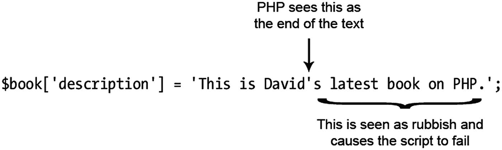

**图 3-5.** 单引号字符串中的撇号会混淆 PHP 引擎。

解决此问题有两种方法：

* 如果文本中包含撇号，请使用双引号。

* 在撇号前添加反斜杠（这称为**转义**）。

因此，以下两种写法都是可接受的：

```
$book['description'] = "This is David's latest book on PHP.";
$book['description'] = 'This is David\'s latest book on PHP.';
```

双引号字符串中的双引号也适用相同规则（只是规则相反）。以下代码会引起问题：

```
$play = "Shakespeare's "Macbeth"";
```

在此例中，撇号没问题，因为它不与双引号冲突，但 *Macbeth* 前面的双引号会导致字符串提前结束。要解决此问题，以下两种方式均可：

```
$play = 'Shakespeare\'s "Macbeth"';
$play = "Shakespeare's \"Macbeth\"";
```

在第一个示例中，整个字符串被包裹在单引号内。这解决了 *Macbeth* 周围双引号的问题，但需要对 *Shakespeare's* 中的撇号进行转义。在双引号字符串中，撇号不会有问题，但 *Macbeth* 周围的双引号都需要转义。因此，总结如下：

* 在双引号字符串中，单引号和撇号可以正常使用。

* 在单引号字符串中，双引号可以正常使用。

* 其他情况均需使用反斜杠进行转义。

**提示：** 大多数情况下使用单引号，仅在双引号具有特殊含义时才保留使用，详见第 4 章。

## 特殊情况：`true`、`false` 和 `null`

尽管文本应加引号，但三个关键字——`true`、`false` 和 `null` ——除非你想将它们作为字符串处理，否则绝不应加引号。前两个的含义正如你所预期；`null` 表示“不存在的值”。

**注：** `true` 和 `false` 被称为**布尔值**。它们以 19 世纪数学家乔治·布尔（George Boole）的名字命名，其逻辑运算体系构成了现代计算的基础。

正如下一节所述，PHP 根据某事物是否等于 `true` 或 `false` 来做决策。给 `false` 加上引号会产生令人惊讶的结果。考虑以下代码：

```
$OK = 'false';
```

这恰恰与你可能期望的相反：它使 `$OK` 变成了 `true`！为什么？因为 `false` 周围的引号将其变成了字符串，而 PHP 将字符串视为 `true`。（更详细的解释请参见第 4 章中的“根据 PHP 的真相”。）

关键字 `true`、`false` 和 `null` 是*不区分大小写*的。以下示例均有效：

```
$OK = TRUE;
$OK = tRuE;
$OK = true;
```

因此，总结来说，PHP 将 `true`、`false` 和 `null` 视为特殊情况。

* 不要给它们加引号。

* 它们不区分大小写。

## 做出决策

决策，决策，决策……生活中充满了决策。PHP 也是如此。决策使其能够根据情况改变输出结果。PHP 中的决策使用**条件语句**。最常见的是使用 `if`，其结构与自然语言非常接近。在现实生活中，你可能会面临以下决策（诚然在英国并不常见）：如果天气热，我就去海滩。

用 PHP 伪代码表示，同样的决策如下：

```
if (天气热) {
我去海滩;
}
```

被测试的条件放在圆括号内，结果操作放在花括号之间。这是基本的决策模式：

```
if (条件为真) {
// 如果条件为真，则执行的代码
}
```

**提示：** 条件语句是控制结构，后面不需要跟分号。花括号用于将应作为一个整体执行的多个独立语句组合在一起。

花括号内的代码*仅*在条件为 `true` 时执行。如果条件为 `false`，PHP 会忽略花括号之间的所有内容，并继续执行下一段代码。PHP 如何判断条件是 `true` 还是 `false`，将在下一节中描述。

有时，仅使用 `if` 语句就足够了，但通常你希望在条件不满足时执行一个默认操作。为此，可以使用 `else`，如下所示：

```
if (条件为真) {
// 如果条件为真，则执行的代码
} else {
// 如果条件为假，则执行的默认代码
}
```

如果你想要更多替代方案，可以像这样添加更多条件语句：

```
if (condition is true) {
// 条件为 true 时执行的代码
} else {
// 条件为 false 时运行的默认代码
}
if (second condition is true) {
// 第二个条件为 true 时执行的代码
} else {
// 第二个条件为 false 时运行的默认代码
}
```

在这种情况下，*两个*条件语句都会被运行。如果你只想执行一个代码块，请像这样使用 `elseif`：

```
if (condition is true) {
// 第一个条件为 true 时执行的代码
} elseif (second condition is true) {
// 第一个条件不成立，但第二个条件为 true 时执行的代码
} else {
// 两个条件均为 false 时的默认代码
}
```

你可以在一个条件语句中任意使用多个 `elseif` 子句。*只有第一个为 true 的条件会被执行；其余所有条件都会被忽略，即使它们也为 true。* 这意味着你需要按照希望的求值优先级顺序来构建条件语句。这是一个严格的“先到先得”层级结构。

> **注意**  

> 虽然 `elseif` 通常写作一个单词，但你也可以将 `else if` 作为两个分开的单词使用。

## 进行比较

条件语句只关心一件事：被测试的条件是否为 `true`。如果不是 `true`，那必定是 `false`。这里没有折中或模棱两可的余地。条件通常依赖于两个值的比较。这个是否比那个大？它们是否相等？诸如此类。

要测试是否相等，PHP 使用两个等号（`==`），如下所示：

```
if ($status == 'administrator') {
// 发送到管理页面
} else {
// 拒绝进入管理区域
}
```

> **警告**  

> 不要在首行使用单个等号（`$status = 'administrator'`）。这样做会让网站的**管理区域向所有人开放**。为什么？因为这会自动将 `$status` 的值设为 `administrator`；它并不会比较这两个值。要比较值，你必须使用两个等号。这是一个常见错误，但可能带来灾难性的后果。

大小比较使用数学符号：小于（`<`）和大于（`>`）。假设你正在检查文件的大小，以决定是否允许其上传到服务器。你可以这样设置最大为 50 KB（1 千字节 = 1024 字节）：

```
if ($bytes > 51200) {
// 显示错误消息并放弃上传
} else {
// 继续上传
}
```

> **注意**  

> 第 4 章将介绍如何同时测试多个条件。

## 使用缩进和空白提高清晰度

缩进代码有助于将语句保持为逻辑分组，使其更容易理解脚本的流程。PHP 会忽略代码内的空白，因此你可以采用任何你喜欢的风格。只要保持一致性，这样当你发现任何看起来不协调的地方时就能轻易察觉。

大多数人发现缩进四个或五个空格最能提高代码的可读性。风格上最大的差异可能在于花括号的位置。一种常见的做法是将开头的花括号放在与前一行代码相同的行上，而闭合的花括号放在代码块之后的新行上，如下所示：

```
if ($bytes > 51200) {
// 显示错误消息并放弃上传
} else {
// 继续上传
}
```

然而，其他人则偏好这种风格：

```
if ($bytes > 51200)
{
// 显示错误消息并放弃上传
}
else
{
// 继续上传
}
```

风格并不重要。重要的是你的代码要保持一致且易于阅读。

## 使用循环执行重复任务

**循环**是巨大的时间节省工具，因为它们能一遍又一遍地执行相同的任务，却只涉及很少的代码。它们经常与数组和数据库结果一起使用。你可以逐个遍历每个项目，寻找匹配项或执行特定任务。循环与条件语句结合使用时尤其强大，允许你一次性对大量数据有选择地执行操作。通过在实际场景中使用循环，能最好地理解它们。所有循环结构的详细信息及示例，请参见第 4 章。

## 使用函数执行预设任务

**函数**用来做事情……很多事情，其数量在 PHP 中令人难以置信。一个典型的 PHP 设置会提供数千个内置函数供你使用。你实际上只需要用到其中一小部分，但知道 PHP 是一门功能完备的语言，这让人安心。

你在本书中将用到的函数都是真正有用的，例如获取图像的宽度和高度、从现有图像创建缩略图、查询数据库、发送电子邮件等等。你可以在 PHP 代码中识别出函数，因为它们后面总是跟着一对括号。有时括号是空的，就像你在上一章的 `phpversion.php` 中用到的 `phpversion()` 那样。不过，通常情况下，括号内会包含变量、数字或字符串，例如图 3-1 中脚本的这行代码：

```
$thisYear = date('Y');
```

这段代码计算当前年份并将其存储在变量 `$thisYear` 中。它通过将字符串 `'Y'` 传递给内置 PHP 函数 `date()` 来工作。像这样在括号之间放置一个值被称为**向函数传递参数**。函数接收参数中的值并进行处理，以产生（或**返回**）结果。例如，如果你将字符串 `'M'` 而不是 `'Y'` 作为参数传递给 `date()`，它将返回当前月份的三个字母缩写（例如 Mar、Apr、May）。如下例所示，你通过将结果赋给一个命名恰当的变量来捕获函数的结果：

```
$thisMonth = date('M');
```

> **注意**  

> 第 16 章将深入介绍 PHP 如何处理日期和时间。

有些函数接受多个参数。在这种情况下，请在括号内使用逗号分隔参数，如下所示：

```
$mailSent = mail($to, $subject, $message);
```

不难想到，这会向第一个参数中存储的地址发送一封电子邮件，主题行是第二个参数存储的内容，消息是第三个参数存储的内容。你将在第 6 章了解这个函数的工作原理。

> **提示**
>
> 你经常会看到用“参数（parameter）”来代替“参数（argument）”。从技术上讲，`parameter` 指的是函数定义中使用的变量，而 `argument` 指的是传递给函数的实际值。在实际使用中，这两个术语往往可以互换使用。

好像所有内置函数还不够似的，PHP 还允许你构建自己的自定义函数，下一章将对此进行描述。即使你不喜欢创建自己的函数，在本书中你也会用到我自己制作的一些函数。它们的使用方式与内置函数相同。

## 显示 PHP 输出

除非你能在网页中显示结果，否则所有这些幕后的魔法就没有多大意义。在 PHP 中有两种方式可以实现这一点：使用 `echo` 或 `print`。两者之间有一些细微的差别，但这些差别非常微妙，你可以将 `echo` 和 `print` 视为相同的。我更喜欢 `echo`，原因很简单：它少一个字母要打。

你可以将 `echo` 与变量、数字和字符串一起使用；只需将其放在你想要显示的内容前面即可，如下所示：

```php
$name = 'David';
echo $name;   // 显示 David
echo 5;       // 显示 5
echo 'David'; // 显示 David
```

当对变量使用 `echo` 或 `print` 时，该变量必须仅包含单个值。你不能用它们来显示数组或数据库结果的内容。这正是循环大显身手的地方：在循环内部使用 `echo` 或 `print` 来逐个显示每个元素。在本书的后续内容中，你会看到大量实际应用的示例。

你可能会看到有些脚本在 `echo` 和 `print` 中使用括号，像这样：

```php
echo('David'); // 显示 David
```

括号并不影响结果。除非你纯粹是为了享受打字的乐趣，否则可以省略它们。

## 使用短 echo 标签

当你只想显示单个变量或表达式的值时，可以使用简短的 `echo` 标签，它由一个左尖括号、一个问号和一个等号组成，如下所示：

```php
My name is .
```

这会产生与以下代码相同的输出：

```php
My name is .
```

因为它是 `echo` 的简写形式，所以同一个 PHP 代码块中不能包含其他代码，但在将数据库结果嵌入网页时，它尤其有用。不言而喻，在使用这个快捷方式之前，变量的值必须在之前的 PHP 代码块中已经设置好。

**提示**
由于同一个 PHP 代码块中不能包含其他代码，因此在使用短 `echo` 标签时，常见的做法是在闭合的 PHP 标签前省略分号。

## 拼接字符串

尽管许多其他计算机语言使用加号（`+`）来拼接文本（字符串），但 PHP 使用句点、点号或英文句号（`.`），如下所示：

```php
$firstName = 'David';
$lastName = 'Powers';
echo $firstName.$lastName; // 显示 DavidPowers
```

如最后一行代码中的注释所示，像这样拼接两个字符串时，PHP 不会在它们之间留下任何空隙。不要误以为在句点后添加一个空格就能解决问题，那是行不通的。你可以在句点的任意一侧放置任意数量的空格，结果始终相同，因为 PHP 会忽略代码中的空白字符。实际上，为了可读性，建议在句点的两侧各留一个空格。

要在最终输出中显示一个空格，你必须在其中一个字符串中包含一个空格，或者将空格作为一个单独的字符串插入，如下所示：

```php
echo $firstName . ' ' . $lastName; // 显示 David Powers
```

**提示**
句点——或者更准确地说，它的正式名称是**连接运算符**——在其他代码中可能难以辨认。请确保你编辑器中的字体大小足够大，以便能够区分句点和逗号。

### 处理数字

PHP 可以进行大量的数字运算，从简单的加法到复杂的数学计算。下一章将包含你可以与 PHP 一起使用的算术运算符的详细信息。现阶段你需要记住的是，数字中除了小数点外，不能包含任何标点符号。如果你给 PHP 提供包含逗号（或其他任何字符）作为千位分隔符的数字，它将会报错。

## 理解 PHP 错误消息

错误消息是编程中不可避免的现实，因此你需要理解它们试图传达的信息。下图展示了一条典型的错误消息。

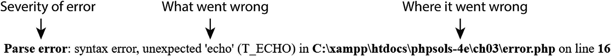

PHP 错误消息报告了 PHP 发现问题的行号。大多数新手——很自然地——会认为那里就是查找错误的地方。错了……大多数情况下，PHP 是在告诉你发生了意外情况。换句话说，错误位于*之前*的某处。前面的错误消息意味着 PHP 发现了一个不应该出现的 `echo` 命令。（错误消息总是用 `T_` 作为 PHP 元素的前缀，`T_` 代表 token。）不要纠结于 `echo` 命令可能有什么问题（很可能没有问题），而是开始向后查找，寻找任何缺失的东西，很可能是前一行缺少的分号或右引号。有时，消息会在脚本的最后一行报告错误。这通常意味着你在页面中更靠前的位置遗漏了一个右花括号。

以下是错误的主要类别，按重要性降序排列：

- **致命错误 (Fatal error)**：错误之前的所有 HTML 输出将被显示，但一旦遇到该错误——顾名思义——其他所有内容都会立即终止。致命错误通常由引用不存在的文件或函数引起。
- **解析错误 (Parse error)**：这表示你的代码语法中有错误，例如引号不匹配、缺少分号或右花括号。它会立即停止脚本，甚至不允许任何 HTML 输出被显示。
- **警告 (Warning)**：警告表明存在严重问题，例如缺少包含文件。（包含文件是第 5 章的主题。）然而，该错误通常不会严重到阻止脚本其余部分的执行。
- **已弃用 (Deprecated)**：这警告你某些特性计划从未来版本的 PHP 中移除。如果你看到此类错误消息，应认真考虑更新你的脚本，因为如果你的服务器升级，它可能会突然停止工作。
- **严格 (Strict)**：此类错误消息会警告你使用了不被视为良好实践的技术。
- **注意 (Notice)**：这通知你一些相对次要的问题，例如使用了未声明的变量。尽管此类错误不会阻止你的页面显示（并且你可以关闭通知的显示），但你应始终尝试消除它们。任何错误都是对输出的威胁。

### 我的页面为什么是空白的？

许多初学者在将 PHP 页面加载到浏览器中却完全看不到任何内容时，会感到困惑。没有错误消息，只有一个空白页面。当存在解析错误（即代码中的错误）并且 `php.ini` 中的 `display_errors` 指令被关闭时，就会发生这种情况。

如果你遵循了前一章的建议，那么在你的本地测试环境中 `display_errors` 应该已启用。然而，大多数托管公司会关闭 `display_errors`。这对安全有好处，但可能会使你在远程服务器上排查问题变得困难。除了解析错误，缺少包含文件也常常导致空白页面。

你可以通过将以下代码添加到页面顶部来为单个脚本开启错误显示：

```php
ini_set('display_errors', '1');
```

```
将此代码放在 PHP 开始标签后的第一行，或者如果 PHP 代码在页面较下方，则将其放在页面顶部一个单独的 PHP 代码块中。当你上传页面并刷新浏览器时，应该会看到 PHP 生成的任何错误消息。

如果在添加这行代码后仍然看到空白页面，则意味着你的语法中存在错误。在启用了 `display_errors` 的情况下在本地测试该页面，以找出导致问题的原因。

**注意**
更正错误后，请移除开启错误显示的代码。如果脚本在后续阶段的其他地方出现问题，你不希望暴露你在线网站上的潜在漏洞。

## PHP 快速检查清单

# 本文概述

本章包含大量信息，但希望它能让你对 PHP 的工作原理有一个大致的了解。以下是部分要点的提醒：

- 始终为 PHP 页面使用正确的文件扩展名，通常是`.php`。
- 将 PHP 代码括在正确的标签之间：`<?php`和`?>`。
- 避免使用短形式的开始标签：`<?`。使用`<?php`更可靠。
- 在仅包含 PHP 代码的文件中省略结束的 PHP 标签。
- PHP 变量以`$`开头，后跟字母或下划线字符。
- 选择有意义的变量名，并记住它们是区分大小写的。
- 使用注释来提醒你的脚本做了什么。
- 数字不需要引号，但字符串（文本）需要。
- 小数点（英文句号）是数字中允许的唯一标点符号。
- 你可以对字符串使用单引号或双引号，但外部引号必须匹配。
- 使用反斜杠来转义字符串内部同类型的引号。
- 要将相关项存储在一起，请使用数组。
- 使用条件语句（如`if`和`if . . . else`）进行决策。
- 循环简化了重复性任务。
- 函数执行预设任务。
- 使用`echo`或`print`显示 PHP 输出。
- 对于大多数错误消息，从指示的位置*向后*查找。
- 保持微笑——并记住 PHP 并不*难*。

下一章将详细介绍你可以在本书学习过程中参考的基本细节。

# 4. PHP：快速参考

前一章为初学者提供了 PHP 的鸟瞰视图，而本章则深入探讨细节。它不打算一次性读完。当你需要找出如何做某件特定事情时（例如构建数组或使用循环重复某个操作），可以随时查阅。以下各节并不试图涵盖 PHP 的每个方面，但它们将有助于扩展你对本书其余部分的理解。

## 本章涵盖内容

- 理解 PHP 中的数据类型
- 使用算术运算符进行计算
- 理解 PHP 如何处理字符串中的变量
- 创建索引数组和关联数组
- 理解 PHP 将什么视为真和假
- 使用比较来做出决策
- 在循环内重复执行相同的代码
- 使用函数模块化代码
- 使用生成器生成一系列值
- 理解类和对象
- 动态创建新变量

## 在现有网站中使用 PHP

PHP 代码通常仅在使用了`.php`文件扩展名的页面中被处理。尽管你可以在同一个网站中混用`.html`和`.php`页面，但最好仅使用`.php`，即使并非每个页面都包含动态特性。这让你能够灵活地向页面添加 PHP，而不会破坏现有链接或失去搜索引擎排名。

## PHP 中的数据类型

PHP 是一种所谓的**弱类型**语言。实际上，这意味着与某些其他计算机语言（例如 Java 或 C#）不同，PHP 并不关心你在变量中存储了什么类型的数据。

大多数情况下，这非常方便，尽管你需要注意用户输入。你可能期望用户在表单中输入一个数字，但除非你进行检查，否则如果遇到一个单词，PHP 不会拒绝它。仔细检查用户输入是后面几章的主要主题之一。

即使 PHP 是弱类型的，它也使用以下数据类型：

- **整数**：这是一个整数，例如 1、25、42 或 2006。整数不得包含任何逗号或其他标点符号，例如千位分隔符。
- **浮点数**：这是一个包含小数点的数字，例如 9.99、98.6 或 2.1。PHP 不支持使用逗号作为小数点，这在许多欧洲国家很常见。你必须使用句点。与整数一样，浮点数不得包含千位分隔符。（此类型也称为**float**或**double**。）

*注意*：以零开头的整数被视为八进制数。例如，`08` 会因为不是有效的八进制数而产生解析错误。另一方面，在浮点数中使用前导零是没有问题的，比如 `0.8`。

- **字符串**：字符串是任意长度的文本。它可以短至零个字符（空字符串），并且在 64 位构建的 PHP 7 中没有上限。实际上，其他因素（例如可用内存或通过表单传递值）会施加限制。
- **布尔值**：此类型只有两个值，`true` 或 `false`。然而，PHP 会将其他值隐式视为 true 或 false。请参阅本章后面的“PHP 中的真值判定”。
- **数组**：数组是一种能够存储多个值的变量，尽管它也可以不包含任何值（空数组）。数组可以保存任何数据类型，包括其他数组。数组的数组称为**多维数组**。
- **对象**：对象是一种能够存储和操作值的复杂数据类型。您将在第 7 章中了解更多关于对象的内容。
- **资源**：当 PHP 连接到外部数据源（例如文件或数据库）时，它会将对它的引用存储为资源。
- **空值**：这是一种特殊的数据类型，表示变量的值不存在。

*注意*：PHP 在线文档列出了另外两种类型，它们描述的是结构的行为，而不是数据的类型。**可迭代对象**是一种可以在循环中使用的结构（例如数组），通常用于在每次循环运行时提取或生成序列中的下一个值。**可调用对象**是一个由另一个函数调用的函数。

PHP 弱类型的一个重要副作用是：如果您将整数或浮点数用引号括起来，PHP 会自动将其从字符串转换为数字，从而允许您执行计算而无需任何特殊处理。这可能会产生意想不到的后果。当 PHP 看到加号（`+`）时，它会假定您想要进行加法运算，因此会尝试将字符串转换为整数或浮点数，如下例所示（代码位于 `ch04` 文件夹中的 `data_conversion_01.php`）：

```php
$fruit = '2 apples ';
$veg = '2 carrots';
echo $fruit + $veg;  // 显示 4
```

PHP 发现 `$fruit` 和 `$veg` 都以数字开头，因此它会提取数字并忽略其余部分。然而，如果字符串不是以数字开头，PHP 会将其转换为 0，如下例所示（代码位于 `data_conversion_02.php`）：

```php
$fruit = '2 apples ';
$veg = 'and 2 carrots';
echo $fruit + $veg;  // 显示 2
```

*注意*：自 PHP 7.1 起，前面两个例子会触发关于“非良好格式的数值”或“非数值”的错误消息。尽管自动转换仍然有效，但这些错误消息旨在阻止这类代码。单独用引号括起来的数字则没有问题。

## 检查变量的数据类型

在测试脚本时，检查变量的数据类型通常很有用。这有助于解释脚本产生意外结果的原因。要检查变量的数据类型和内容，只需将其传递给 `var_dump()` 函数，如下所示：

```php
var_dump($variable_to_test);
```

在本章的文件中使用 `data_tests.php` 可以查看 `var_dump()` 对不同类型数据生成的输出。只需更改最后一行括号内的变量名即可。

## 显式更改变量的数据类型

大多数情况下，PHP 会自动将变量的数据类型转换为适合当前上下文的类型。这被称为**类型转换**。然而，有时需要使用**转换运算符**显式更改数据类型。表 4-1 列出了 PHP 中最常用的转换运算符。

**表 4-1.** 常用的 PHP 转换运算符

| 类型转换运算符 | 替代写法 | 操作说明 |
| --- | --- | --- |
| `(array)` |   | 转换为数组 |
| `(bool)` | `(boolean)` | 转换为布尔型 |
| `(float)` | `(double)`, `(real)` | 转换为浮点数 |
| `(int)` | `(integer)` | 转换为整型 |
| `(string)` |   | 转换为字符串 |

要转换变量的数据类型，请在变量前方加上相应的类型转换运算符，示例如下：

```php
$input = 'coffee';
$drinks = (array) $input;
```

此操作将为 `$drinks` 分配一个包含字符串 `'coffee'` 作为唯一元素的数组。当某个函数期望接收数组而非字符串作为参数时，像这样将字符串强制转换为数组会非常有用。在此示例中，`$input` 的数据类型仍然是字符串。若要使转换永久生效，请将转换后的值重新赋值给原变量，示例如下：

```php
$input = (array) $input;
```

## 检查变量是否已被定义

在条件语句中，最常见的测试之一就是检查某个变量是否已被定义。只需将变量传递给 `isset()` 函数，示例如下：

```php
if (isset($name)) {
    // 如果 $name 已被定义，则执行相应操作
} else {
    // 执行其他操作，例如为 $name 赋予一个默认值
}
```

# 使用 PHP 进行计算

PHP 可以执行各种计算，从简单的算术运算到复杂的数学计算。本章仅介绍标准算术运算符。关于 PHP 支持的数学函数和常量的详细信息，请参阅 [`www.php.net/manual/en/book.math.php`](http://www.php.net/manual/en/book.math.php)。

> **注意**
> 常量代表一个不可更改的固定值。所有 PHP 预定义常量均为大写。与变量不同，常量前面没有美元符号。例如，π（圆周率）的常量是 `M_PI`。你可以在 [`www.php.net/manual/en/reserved.constants.php`](http://www.php.net/manual/en/reserved.constants.php) 找到完整的常量列表。

## 算术运算符

所有标准算术运算符的工作方式都符合你的预期，尽管其中一些符号与你上学时所学的略有不同。例如，星号（`*`）用作乘号，正斜杠（`/`）用于表示除法。表 4-2 展示了标准算术运算符的工作原理示例。为了演示其效果，`$x` 被设置为 20。

**表 4-2. PHP 中的算术运算符**

| 操作 | 运算符 | 示例 | 结果 |
| --- | --- | --- | --- |
| 加法 | `+` | `$x + 10` | `30` |
| 减法 | `-` | `$x - 10` | `10` |
| 乘法 | `*` | `$x * 10` | `200` |
| 除法 | `/` | `$x / 10` | `2` |
| 取模 | `%` | `$x % 3` | `2` |
| 递增（加 1） | `++` | `$x++` | `21` |
| 递减（减 1） | `--` | `$x--` | `19` |
| 指数运算 | `**` | `$x**3` | `8000` |

取模运算符在处理前会移除两数的小数部分，将其转换为整数，然后返回除法的余数，具体如下：

```
5 % 2.5    // 结果是 1，而不是 0（2.5 的小数部分被移除）
10 % 2     // 结果是 0
```

取模运算对于判断一个数字是奇数还是偶数非常有用。`$number % 2` 总是产生 0 或 1。如果结果为 0，表示没有余数，因此该数字是偶数。

## 使用递增和递减运算符

递增（`++`）和递减（`--`）运算符既可以放在变量之前，也可以放在变量之后。它们的位置对计算结果有重要影响。

当运算符放在变量之前时，在进行任何进一步计算之前，先执行加 1 或减 1 操作，如下例所示：

```
$x = 5;
$y = 6;
--$x * ++$y // 结果是 28 (4 * 7)
```

当运算符放在变量之后时，先执行主计算，然后再进行加 1 或减 1 操作，如下所示：

```
$x = 5;
$y = 6;
$x-- * $y++ // 结果是 30 (5 * 6)，但 $x 现在是 4，$y 现在是 7
```

## 确定计算顺序

PHP 中的计算遵循与标准算术相同的优先级规则。表 4-3 按优先级顺序列出了算术运算符，优先级最高的位于顶部。

**表 4-3. 算术运算符的优先级**

| 分组 | 运算符 | 规则 |
| --- | --- | --- |
| 括号 | `()` | 括号内的运算优先执行。如果这些表达式是嵌套的，则最内层的先求值。 |
| 乘方 | `**` |  |
| 递增/递减 | `++ --` |  |
| 乘法与除法 | `* / %` | 如果表达式包含两个或更多此类运算符，则按从左到右的顺序求值。 |
| 加法与减法 | `+ -` | 如果表达式包含两个或更多此类运算符，则按从左到右的顺序求值。 |

## 结合计算与赋值

PHP 提供了一种对变量执行计算并将结果重新赋值给变量的快捷方式，即使用**组合赋值运算符**。主要的运算符列于表 4-4 中。

**表 4-4. PHP 中使用的组合算术赋值运算符**

| 运算符 | 示例 | 等效于 |
| --- | --- | --- |
| `+=` | `$a += $b` | `$a = $a + $b` |
| `-=` | `$a -= $b` | `$a = $a - $b` |
| `*=` | `$a *= $b` | `$a = $a * $b` |
| `/=` | `$a /= $b` | `$a = $a / $b` |
| `%=` | `$a %= $b` | `$a = $a % $b` |
| `**=` | `$a **= $b` | `$a = $a ** $b` |

## 向已有字符串追加内容

同样便捷的简写形式允许你通过在现有字符串末尾添加新的内容，方法是组合使用一个点号和等号，如下所示：

```
$hamlet = 'To be';
$hamlet .= ' or not to be';
```

请注意，你需要在附加文本的开头创建一个空格，除非你希望两个字符串连接在一起时中间没有间隔。这种简写形式被称为**组合连接运算符**，在组合多个字符串时非常有用，例如在构建电子邮件内容或循环遍历数据库查询结果时。

> **提示**
> 在复制代码时，等号前面的点号很容易被忽略。当你在一系列语句的开头看到同一个变量重复出现时，这往往是一个明确的信号，表明你需要使用 `.=` 而不是单独的 `=`。

## 关于引号你所需了解的一切——以及更多内容

在任何计算机语言（不仅仅是 PHP）中处理引号都可能困难重重，因为计算机始终会将第一个匹配的引号视为字符串的结束标记。由于你的字符串可能包含撇号，仅靠单引号和双引号的组合是不够的。此外，PHP 对双引号内的变量和转义序列（某些前面带有反斜杠的字符）会进行特殊处理。在接下来的几页中，我将为你解开这个纠缠，并让你彻底理解这一切。

### PHP 如何处理字符串中的变量

选择使用双引号还是单引号可能看起来只是个人偏好问题，但 PHP 处理它们的方式有一个重要区别：

- 单引号之间的任何内容都被视为纯文本。
- 双引号则作为处理变量和特殊字符（即**转义序列**）的信号。

在以下示例中，`$name` 被赋予一个值，然后在单引号字符串中使用。因此 `$name` 会被当作普通文本（代码位于 `quotes_01.php` 中）：

```
$name = 'Dolly';
echo 'Hello, $name';  // Hello, $name
```

如果你将第二行中的单引号替换为双引号（参见 `quotes_02.php`），`$name` 会被处理，其值会显示在屏幕上：

```
$name = 'Dolly';
echo "Hello, $name";  // Hello, Dolly
```

> **注意**
> 在两个示例中，第一行的字符串都是单引号。导致变量被处理的原因是它位于双引号字符串中，而不是它最初是如何获得其值的。

### 在双引号内使用转义序列

双引号还有另一个重要作用：它们以特殊方式处理转义序列。所有转义序列都是通过在字符前放置反斜杠形成的。表 4-5 列出了 PHP 支持的主要转义序列。

**表 4-5. PHP 主要转义序列**

| 转义序列 | 双引号字符串中表示的字符 |
| --- | --- |
| `\"` | 双引号 |
| `\n` | 换行 |
| `\r` | 回车 |
| `\t` | 制表符 |
| `\\` | 反斜杠 |
| `\$` | 美元符号 |

**注意**：除 `\\` 外，表 4-5 中列出的转义序列仅在双引号字符串中有效。在单引号字符串中，它们被视为字面反斜杠后跟第二个字符。字符串末尾的反斜杠始终需要转义，否则它将被解释为转义后面的引号。

## 在字符串中嵌入关联数组元素

在双引号字符串中使用关联数组元素存在一个棘手的“陷阱”。下面这行代码尝试从名为 `$book` 的关联数组中嵌入几个元素：

```
echo "$book['title'] was written by $book['author'].";
```

这段代码看起来没问题。数组元素的键使用了单引号，因此没有引号不匹配的问题。然而，如果将 `quotes_03.php` 加载到浏览器中，会收到一条令人费解的错误消息。

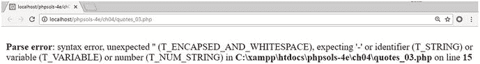

解决方案很简单。需要将关联数组变量用花括号括起来，如下所示（参见 `quotes_04.php`）：

```
echo "{$book['title']} was written by {$book['author']}.";
```

现在，值可以正确显示了，如以下截图所示。
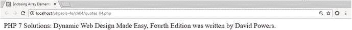

索引数组元素（例如`$shoppingList[2]`）不需要这种特殊处理，因为数组索引是数字，并且没有用引号括起来。

## 使用 heredoc 语法避免转义引号

使用反斜杠转义一两个引号并不麻烦，但我经常看到反斜杠似乎失控的代码示例。PHP **heredoc 语法**提供了一种相对简单的方法，可以在不特殊处理引号的情况下将文本赋值给变量。

**注意**：名称“heredoc”源自 here-document，这是在 Unix 和 Perl 编程中用于向命令传递大量文本的一种技术。

使用 heredoc 将字符串赋值给变量涉及以下步骤：

1.  输入赋值运算符，后跟`<<<`和一个标识符。标识符可以是字母、数字和下划线的任意组合，但不能以数字开头。稍后将使用相同的组合来标识 heredoc 的结束。
2.  在新的一行开始字符串。它可以包含单引号和双引号。任何变量都将以与双引号字符串相同的方式处理。
3.  在字符串末尾之后的新行放置标识符。为了确保 heredoc 在所有版本的 PHP 中都能工作，标识符*必须*位于行首；它*不能*缩进。此外，同一行上不能有除最后的分号之外的任何其他内容。

实际看到时，会更容易理解。以下简单示例位于本章文件的`heredoc.php`中：

```php
$fish = 'whiting';

$book['title'] = 'Alice in Wonderland';

$mockTurtle = <<< Gryphon

"Will you walk a little faster?" said a $fish to a snail.

"There's a porpoise close behind us, and he's treading on my tail."

(from {$book['title']})

Gryphon;

echo $mockTurtle;
```

在此示例中，`Gryphon`是标识符。字符串从下一行开始，并且*双引号被视为字符串的一部分*。所有内容都包含在内，直到在新行开头遇到标识符。

**注意**：尽管 heredoc 语法避免了转义引号的需要，但关联数组元素`$book['title']`仍然需要用花括号括起来，如前一节所述。或者，在双引号字符串或 heredoc 中使用它之前，先将其赋值给一个更简单的变量。

从以下截图可以看出，heredoc 显示了双引号，并处理`$fish`和`$book['title']`变量。
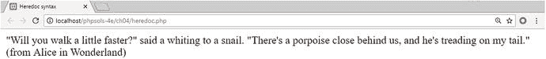

为了在不使用 heredoc 语法的情况下达到相同效果，需要添加双引号并像这样转义它们：

```php
$mockTurtle = "\"Will you walk a little faster?\" said a $fish to a snail.

\"There's a porpoise close behind us, and he's treading on my tail.\" (from

{$book['title']})";
```

当字符串很长或包含大量引号时，heredoc 语法特别有价值。如果希望将 XML 文档或大段 HTML 赋值给变量，它也非常有用。

**注意**：PHP 7.3 放宽了关于结束标识符的一些限制。它可以缩进到与 heredoc 文本正文相同的级别（但不能更远）。还可以省略最后的分号，并在结束标识符后添加更多代码。

## 创建数组

数组有两种类型：使用数字标识每个元素的索引数组和使用字符串的关联数组。可以通过直接为每个元素赋值来构建这两种类型。例如，`$book`关联数组可以这样定义：

```php
$book['title'] = 'PHP 7 Solutions: Dynamic Web Design Made Easy, Fourth Edition';

$book['author'] = 'David Powers';

$book['publisher'] = 'Apress';
```

要直接构建索引数组，请使用数字而不是字符串作为数组键。索引数组从 0 开始编号，因此要构建上一章图[3-3](https://doi.org/10.1007/978-1-4842-4338-1_3Fig#3)中描绘的`$shoppingList`数组，可以像这样声明它：

```php
$shoppingList[0] = 'wine';

$shoppingList[1] = 'fish';

$shoppingList[2] = 'bread';

$shoppingList[3] = 'grapes';

$shoppingList[4] = 'cheese';
```

虽然这两种都是创建数组的有效方法，但还有更简短的方法。

### 构建索引数组

快速的方法是使用简写语法，这与 JavaScript 中的数组字面量相同。通过将逗号分隔的值列表括在一对方括号中来创建数组，如下所示：

```php
$shoppingList = ['wine', 'fish', 'bread', 'grapes', 'cheese'];
```

**注意**：逗号必须放在引号外面，这与美式排版惯例不同。为了便于阅读，我在每个逗号后面插入了一个空格，但这不是必需的。

另一种方法是将逗号分隔的列表传递给`array()`，如下所示：

```php
$shoppingList = array('wine', 'fish', 'bread', 'grapes', 'cheese');
```

PHP 会自动从 0 开始为每个数组元素编号，因此两种方法都创建了与单独编号相同的数组。

要向数组末尾添加新元素，请使用一对空的方括号，如下所示：

```php
$shoppingList[] = 'coffee';
```

PHP 使用下一个可用的数字，因此这将成为`$shoppingList[5]`。

### 构建关联数组

关联数组使用`=>`运算符（等号后跟大于号）为每个数组键赋值。使用简写方括号语法，结构如下所示：

```php
$arrayName = ['key1' => 'element1', 'key2' => 'element2'];
```

使用`array()`可以达到相同的结果：

```php
$arrayName = array('key1' => 'element1', 'key2' => 'element2');
```

因此，这是构建`$book`数组的简写方式：

```php
$book = [

'title'     => 'PHP 7 Solutions: Dynamic Web Design Made Easy, Fourth Edition',

'author'    => 'David Powers',

'publisher' => 'Apress'

];
```

将左、右大括号放在单独的行上，或者像我这样对齐`=>`运算符并非必需，但这能让代码更易于阅读和维护。

**提示**
简写语法和`array()`都允许在最后一个数组元素后面加一个尾随逗号。这同样适用于索引数组和关联数组。

## 创建空数组

你可能想要创建一个空数组，原因有以下两个：

-   创建（或**初始化**）一个数组，以便在循环内部向其添加元素
-   清除现有数组中的所有元素

要创建一个空数组，只需使用一对空方括号：

```php
$shoppingList = [];
```

或者，使用不带参数的`array()`，像这样：

```php
$shoppingList = array();
```

`$shoppingList`数组现在不包含任何元素。如果你使用`$shoppingList[]`添加一个新元素，它将自动从 0 开始重新编号。

## 多维数组

数组元素可以存储任何数据类型，包括其他数组。你可以创建一个数组的数组——换句话说，就是一个多维数组——其中包含几本书的详细信息，就像这样（使用简写语法）：

```php
$books = [

[

'title'     => 'PHP 7 Solutions: Dynamic Web Design Made Easy, Fourth Edition',

'author'    => 'David Powers'

],

[

'title'     => 'Learn PHP 7',

'author'    => 'Steve Prettyman'

]

];
```

这个示例展示了嵌套在索引数组内的关联数组，但多维数组可以嵌套任何类型。要引用特定元素，请使用两个数组的键，例如：

```php
$books[1]['author']  // 值为 'Steve Prettyman'
```

处理多维数组并不像乍看起来那么困难。秘诀是使用循环来进入嵌套数组。然后，你就可以像处理普通数组一样处理它。这就是处理数据库搜索结果的方式，结果通常包含在一个多维数组中。

## 使用 `print_r()` 检查数组

像这样将数组传递给 `print_r()`，可以在测试期间检查其内容（参见 `inspect_array.php`）：

```php
print_r($books);
```

通常，切换到源代码视图查看详细信息会更有帮助，因为浏览器会忽略底层输出中的缩进。
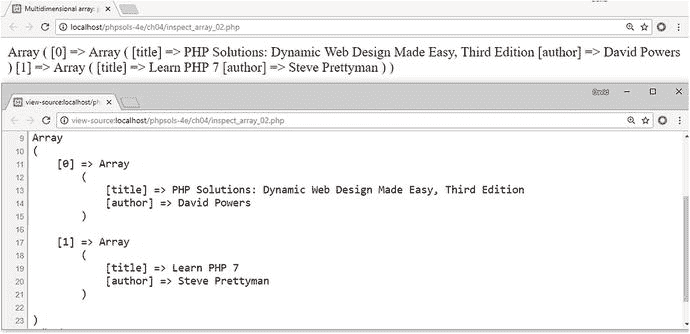

**提示**
始终使用 `print_r()` 来检查数组。`echo` 和 `print` 不起作用。要在网页中显示数组的内容，请使用 `foreach` 循环，如本章后面所述。

## PHP 眼中的真相

在 PHP 条件语句中进行决策，是基于 `true` 和 `false` 这两个互斥的布尔值。如果条件等于 `true`，则执行条件块内的代码。如果为 `false`，则忽略该代码。一个条件为 `true` 还是 `false`，通过以下方式之一确定：

-   变量显式设置为布尔值之一
-   PHP 隐式解释为 `true` 或 `false` 的值
-   两个非布尔值的比较

### 显式布尔值

如果变量被赋值为 `true` 或 `false`，并在条件语句中使用，则决策基于该值。关键字 `true` 和 `false` 不区分大小写，且不得用引号括起来，例如：

```php
$ok = false;

if ($ok) {

// 执行某些操作

}
```

条件语句内的代码不会被执行，因为 `$ok` 是 `false`。

### 隐式布尔值（“真值”和“假值”）

使用隐式布尔值提供了一种便捷的简写方式，尽管它的缺点是——至少对初学者来说——不够清晰。隐式布尔值——有时也称为“真值”和“假值”——依赖于 PHP 对其视为 `false` 的相对狭窄的定义，即：

-   不区分大小写的关键字 `false` 和 `null`
-   零作为整数（`0`）、浮点数（`0.0`）或字符串（`'0'` 或 `"0"`）
-   空字符串（单引号或双引号之间没有空格）
-   空数组
-   从空标签创建的 SimpleXML 对象

其他所有内容都是 `true`。

**提示**
这解释了为什么 PHP 将 `"false"`（带引号）解释为 `true`。它是一个字符串，而所有字符串——除了空字符串——都是 `true`。另请注意，`–1` 与其他任何非零数字一样被视为 `true`。

## 通过比较两个值进行决策

许多 `true/false` 决策是基于使用**比较运算符**对两个值进行比较。表 4-6 列出了 PHP 中使用的比较运算符。

**表 4-6. 用于决策的 PHP 比较运算符**

| 符号 | 名称 | 示例 | 结果 |
| --- | --- | --- | --- |
| `==` | 等于 | `$a == $b` | 如果 `$a` 和 `$b` 相等，返回 `true`；否则返回 `false` |
| `!=` | 不等于 | `$a != $b` | 如果 `$a` 和 `$b` 不同，返回 `true`；否则返回 `false` |
| `===` | 全等 | `$a === $b` | 确定 `$a` 和 `$b` 是否全等。它们不仅值必须相同，而且数据类型也必须相同（例如，都是整数） |
| `!==` | 不全等 | `$a !== $b` | 确定 `$a` 和 `$b` 是否不全等（依据与上一个运算符相同的标准） |
| `>` | 大于 | `$a > $b` | 如果 `$a` 大于 `$b`，返回 `true` |
| `>=` | 大于或等于 | `$a >= $b` | 如果 `$a` 大于或等于 `$b`，返回 `true` |
| `<` | 小于 | `$a < $b` | 如果 `$a` 小于 `$b`，返回 `true` |
| `<=` | 小于或等于 | `$a <= $b` | 如果 `$a` 小于或等于 `$b`，返回 `true` |
| `<=>` | 飞船 | `$a <=> $b` | 如果 `$a` 小于 `$b`，返回小于零的整数；如果 `$a` 大于 `$b`，返回大于零的整数；如果 `$a` 和 `$b` 相等，返回零 |

正如你将在第 9 章中看到的，飞船运算符对于自定义排序非常有用。它的名字来源于该运算符起源地 Perl 相关书籍的作者。他认为这比不断提及“小于-等于-或-大于运算符”要简单。

**警告**
单个等号不执行比较；它执行赋值。在比较两个值时，始终使用等于运算符（`==`）、全等运算符（`===`）或它们的否定形式（`!=` 和 `!==`）。

## 测试多个条件

通常，比较两个值是不够的。PHP 允许你使用**逻辑运算符**设置一系列条件，以指定是需要满足所有条件还是仅需满足部分条件。

PHP 中最重要的逻辑运算符列于表 4-7。逻辑非运算符适用于单个条件，而非一系列条件。

**表 4-7. PHP 中用于决策的主要逻辑运算符**

| 符号 | 名称 | 示例 | 结果 |
| --- | --- | --- | --- |
| `&&` | 与 | `$a && $b` | 如果 `$a` 和 `$b` 都为 `true`，则结果为 `true` |
| `||` | 或 | `$a || $b` | 如果 `$a` 或 `$b` 中有一个为 `true`，则结果为 `true`；否则为 `false` |
| `!` | 非 | `!$a` | 如果 `$a` *不*为 `true`，则结果为 `true` |

从技术上讲，可测试的条件数量没有限制。每个条件从左到右依次被考虑，一旦达到决定点，就不再执行进一步的测试。使用 `&&` 时，每个条件都必须满足，因此一旦一个条件结果为 `false`，测试就会停止。类似地，使用 `||` 时，只需满足一个条件，因此一旦一个条件结果为 `true`，测试就会停止。

```php
$a = 10;

$b = 25;

if ($a > 5 && $b > 20) // 返回 true

if ($a > 5 || $b > 30) // 返回 true，$b 从未被测试
```

始终设计测试以提供最快的结果。如果必须满足所有条件，请先评估最可能失败的那个。如果只需要满足一个条件，请先评估最可能成功的那一个。如果需要将一组条件视为一个整体，请将它们括在圆括号中，如下所示：

```php
if (($a > 5 && $a < 10) || ($a > 20 && $b < 40))
```

#### 注意

PHP 也可以使用 `AND` 代替 `&&`，以及 `OR` 代替 `||`。但是，`AND` 和 `OR` 的优先级要低得多，这可能导致意外结果。为了避免问题，建议坚持使用 `&&` 和 `||`。

## 使用 switch 语句进行决策链

`switch` 语句为决策提供了一种替代 `if ... else` 的方法。其基本结构如下所示：

```php
switch(被测试的变量) {

case 值 1:

    要执行的语句

    break;

case 值 2:

    要执行的语句

    break;

default:

    要执行的语句

}
```

`case` 关键字表示传递给 `switch()` 的变量可能匹配的值。每个备选值前面必须有 `case`，后面跟一个冒号。当匹配成功时，后续的每一行代码都会被执行，直到遇到 `break` 或 `return` 关键字，此时 `switch` 语句结束。一个简单的示例如下：

```php
switch($myVar) {

case 1:

    echo '$myVar 是 1';

    break;

case 'apple':

case 'orange':

    echo '$myVar 是一种水果';

    break;

default:

    echo '$myVar 既不是 1 也不是水果';

}
```

关于`switch`的主要注意事项如下：

*   `case`关键字后面的表达式通常是一个数字或一个字符串。你不能使用像数组或对象这样的复杂数据类型。
*   要在`case`中使用比较运算符，你必须重复被测试的表达式。例如，`case > 100:`不会工作，但`case $myVar > 100:`可以。在第[8](#332054_4_En_8_Chapter.xhtml)章的PHP解决方案8-4“用逗号连接数组”中有一个这种情况的实际示例。
*   除非你用`break`或`return`结束一个case，否则每个后续的case也会被执行。
*   你可以将几个`case`关键字实例组合在一起，以对它们全部应用相同的代码块。因此，在前面的示例中，如果`$myVar`是“apple”或“orange”，将执行下面那一行。
*   如果没有匹配项，则执行`default`关键字后面的任何语句。如果没有设置默认值，`switch`语句会静默退出并继续执行下一段代码。

## 使用三元运算符

三元运算符（`?:`）是一种表示条件语句的简写方法。它的名字来源于它通常使用三个操作数。基本语法如下所示：

```
条件 ? 值为真时的结果 : 值为假时的结果;
```

以下是一个使用示例：

```
$age = 17;
$fareType = $age >= 16 ? 'adult' : 'child';
```

第二行测试`$age`的值。如果它大于或等于16，则将`$fareType`设置为`adult`，否则将`$fareType`设置为`child`。使用`if ... else`的等效代码如下所示：

```
if ($age >= 16) {
    $fareType = 'adult';
} else {
    $fareType = 'child';
}
```

`if ... else`版本更易读，但三元运算符更紧凑。大多数初学者讨厌这种简写形式，但一旦你熟悉它，你就会意识到它有多么方便。

你可以省略问号和冒号之间的值。这会产生这样的效果：如果条件为真，则将条件的值赋给变量。前面的示例可以重写如下：

```
$age = 17;
$adult = $age >= 16 ?: false; // $adult 为 true
```

在这种情况下，问号前面的表达式是一个比较，所以它只能等于`true`或`false`。但是，如果问号前面的表达式是“真值”（隐式为真），则返回值本身。例如：

```
$age = 17;
$years = $age ?: 'unknown';  // $years 是 17
```

前面示例的问题是，如果用做条件的变量尚未定义，则会产生错误。更好的解决方案是使用下一节中描述的null合并运算符。

## 使用null合并运算符设置默认值

null合并运算符是在PHP 7.0中引入的，作为一种方便的方法，当另一个变量（例如包含来自在线表单的用户输入的变量）尚未定义时，为变量分配一个默认值。该运算符由两个问号（`??`）组成，用法如下：

```
$greeting = $_GET['name'] ?? 'guest';
```

这会尝试将`$greeting`的值设置为`$_GET['name']`中存储的任何值。但是，如果`$_GET['name']`尚未定义——换句话说，它是null——则使用`??`后面的值（`'guest'`）代替。null合并运算符可以像这样链式使用：

```
$greeting = $_GET['name'] ?? $nonexistent ?? $undefined ?? 'guest';
```

PHP依次测试每个值，并将第一个非null的值赋给该变量。

#### 注意
null合并运算符仅拒绝**null**值——换句话说，即不存在的变量或已明确设置为`null`的变量。在前面的示例中，如果提交表单时未在名为`name`的字段中输入值，则`$_GET['name']`会被设置为空字符串。虽然PHP将其视为`false`，但它不是`null`。因此，`$greeting`将被设置为空字符串。

## 使用循环重复执行代码

**循环**是一段重复执行的代码，直到满足某个条件为止。循环通常通过设置一个变量来计数迭代次数进行控制。通过每次递增变量，当变量达到预设数字时循环停止。循环也可以通过遍历数组中的每个项来控制。当没有更多项需要处理时，循环停止。循环中经常包含条件语句，因此尽管它们在结构上非常简单，但可用于创建以通常复杂方式处理数据的代码。

### 使用While和Do...While的循环

最简单的循环类型称为`while`循环。其基本结构如下所示：

```
while (条件为真) {
    执行某些操作
}
```

以下代码在浏览器中显示从1到100的每个数字（你可以在本章的文件中的`while.php`中测试它）。它首先将变量（`$i`）设置为1，然后将该变量用做计数器来控制循环，并在屏幕上显示当前数字。

```
$i = 1;  // 设置计数器
while ($i <= 100) {
    echo "$i<br>";
    $i++; // 计数器加 1
}
```

# 提示
在前一章中，我警告过不要使用名称晦涩的变量。但是，使用`$i`作为计数器是一种常见的约定。如果`$i`已被使用，通常的做法是使用`$j`或`$k`作为计数器。

`while`循环的一种变体使用关键字`do`，并遵循以下基本模式：

```
do {
    要执行的代码
} while (要测试的条件);
```

`do...while`循环与`while`循环之间的区别在于，`do`块中的代码至少执行一次，即使条件永不为真。以下代码（在`dowhile.php`中）会显示一次`$i`的值，即使它大于预期的最大值。

```
$i = 1000;
do {
    echo "$i";
    $i++; // 计数器加 1
} while ($i <= 100);
```

`while`和`do...while`循环的危险之处在于忘记设置一个使循环结束的条件，或设置了一个不可能的条件。这被称为**无限循环**，它要么冻结你的计算机，要么导致浏览器崩溃。

### 多功能的for循环

`for`循环不太容易产生无限循环，因为循环的所有条件都在第一行中声明。`for`循环使用以下基本模式：

```
for (初始化循环; 条件; 每次迭代后要执行的代码) {
    要执行的代码
}
```

以下代码的输出与之前的`while`循环相同，显示从1到100的每个数字（参见`forloop.php`）：

```
for ($i = 1; $i <= 100; $i++) {
    echo "$i <br>";
}
```

括号内的三个表达式控制循环的动作（注意它们用分号分隔，而不是逗号）：

- 第一个表达式在循环开始前执行。在此例中，它将计数器变量`$i`的初始值设为1。
- 第二个表达式设置决定循环应持续运行的条件。它可以是一个固定数字、一个变量或一个计算值的表达式。
- 第三个表达式在循环的每次迭代结束时执行。在此例中，它将`$i`增加1，但也可以使用更大的增量。例如，将`$i++`替换为`$i+=10`，则此示例将显示1、11、21、31等。

注意
`for`循环开头括号内的第一个和第三个表达式可以包含多个用逗号分隔的语句。例如，循环可能使用两个独立递增或递减的计数器。

## 使用`foreach`遍历数组和对象

PHP中的最后一种循环类型用于数组、对象和生成器（参见本章后面的“生成器——一种持续给予的特殊函数”）。它有两种形式，两者都使用临时变量来处理每个元素。如果只需要对元素的值进行操作，`foreach`循环采用以下形式：

```
foreach (variable_name as element) {
    do something with element
}
```

以下示例遍历`$shoppingList`数组并显示每个项目的名称（代码在`foreach_01.php`中）：

```
$shoppingList = ['wine', 'fish', 'bread', 'grapes', 'cheese'];
foreach ($shoppingList as $item) {
    echo $item . '<br>';
}
```

警告
`foreach`关键字是一个单词。在`for`和`each`之间插入空格是无效的。

尽管前面的示例使用了索引数组，但也可以将`foreach`循环的基本形式用于关联数组。

`foreach`循环的另一种形式允许访问每个元素的键和值。它采用这种略有不同的形式：

```
foreach (variable_name as key => value) {
```

## 中断循环

要在满足特定条件时提前结束循环，请在条件语句中插入`break`关键字。一旦脚本遇到`break`，就会退出循环。

要在满足特定条件时跳过循环中的代码，请使用`continue`关键字。它不是退出循环，而是立即返回到循环的顶部（忽略循环体中`continue`之后的代码）并处理下一个元素。例如，以下循环以一个条件开始，如果`$photo`没有值（`empty()`函数在变量不存在或为`false`时返回`true`），则跳过当前元素：

```php
foreach ($photos as $photo) {
    if (empty($photo)) continue;
    // 显示照片的代码
}
```

## 使用函数模块化代码

函数提供了一种运行频繁执行操作的便捷方式。除了大量内置函数外，PHP 还允许你创建自己的函数。其优点是你只需编写一次代码，而不必在每次需要的地方重新键入。这不仅加快了开发速度，而且使代码更易于阅读和维护。如果函数中的代码有问题，你只需在一个地方进行更新，而无需在整个站点中搜索。

在 PHP 中构建自己的函数很容易。只需将一段代码包裹在一对花括号中，并使用`function`关键字命名新函数。函数名称后面始终跟着一对括号。以下示例（尽管很简单）演示了自定义函数的基本结构（参见本章文件中的`functions_01.php`）：

```php
function sayHi() {
    echo 'Hi!';
}
```

只需在 PHP 代码块中放入`sayHi();`，屏幕上就会显示 Hi!。这类函数就像无人机一样：它总是执行相同的操作。要使函数能够根据情况做出响应，需要将值作为参数传递给它。

### 向函数传递值

假设你想调整`sayHi()`函数以显示某人的姓名。你可以通过在函数声明的括号中插入一个变量来实现（从技术上讲，这称为在**函数签名**中插入参数）。然后，在函数内部使用相同的变量来存储传递给函数的任何值。`functions_02.php`中的修订版本如下所示：

```php
function sayHi($name) {
    echo "Hi, $name!";
}
```

现在，你可以在页面中使用此函数来显示传递给`sayHi()`的任何变量或字面字符串的值。例如，如果你有一个在线表单，将某人的姓名保存在名为`$visitor`的变量中，并且 Mark 访问了你的网站，你可以通过在页面中放入`sayHi($visitor);`来给他个性化的问候，如下面的屏幕截图所示。
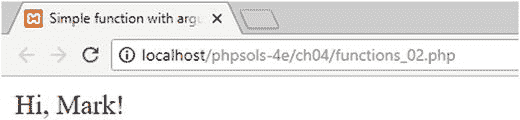

PHP 弱类型的一个缺点是，如果 Mark 不配合，他可能会在表单中输入 5 而不是他的名字，给你带来的可能不是你期望的那种击掌。
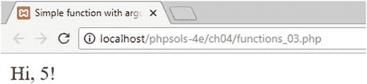

> **提示**
> 在任何关键情况下使用用户输入之前，务必检查用户输入。你将在后续学习中掌握如何做到这一点。

要向函数传递多个参数，请在函数签名中用逗号分隔变量（参数）。

### 设置参数的默认值

要为传递给函数的参数设置默认值，请在函数签名中为变量赋值，如下所示（参见`functions_04.php`）：

```php
function sayHi($name = 'bashful') {
    echo "Hi, $name!";
}
```

这使得参数是可选的，允许像这样调用函数：

```php
sayHi();
```

下面的屏幕截图显示了结果：
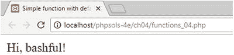

但是，你仍然可以向函数传递不同的值以替代默认值。

> **提示**
> 可选参数必须始终放在函数签名的末尾，位于必需参数之后。

### 变量作用域——函数作为黑盒

函数创建了一个独立的、类似于黑盒的环境。通常情况下，函数内部发生的事情对脚本的其余部分没有影响，除非它返回一个值，如下一节所述。函数内部的变量保持函数独有。以下示例应该能说明这一点（参见`functions_05.php`）：

```php
function doubleIt($number) {
    $number *= 2;
    echo 'Inside the function, $number is ' . $number . '';  // 数字已加倍
}

$number = 4;
doubleIt($number);
echo 'Outside the function $number is still ' . $number;   // 未加倍
```

前四行定义了一个名为 `doubleIt()` 的函数，它接收一个数字，将其加倍，并在屏幕上显示。脚本的其余部分将值 4 赋给 `$number`，然后将 `$number` 作为参数传递给 `doubleIt()`。该函数处理 `$number` 并显示 8。函数结束后，`echo` 在屏幕上显示 `$number`。此时，它的值是 4 而不是 8，如下面的截图所示：

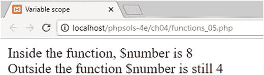

这表明主脚本中的 `$number` 与函数内部同名变量完全无关。这被称为变量的**作用域**。即使变量值在函数内部发生变化，除非该值通过引用传递给函数（如本章后文所述），否则外部同名的变量不会受到影响。

> **提示**
> 尽管不总是可行，但应避免在脚本其余部分使用与函数内部相同的变量名。这能使代码更易于理解和调试。

PHP 超全局变量（[`www.php.net/manual/en/language.variables.superglobals.php`](http://www.php.net/manual/en/language.variables.superglobals.php)），例如 `$_POST` 和 `$_GET`，不受变量作用域影响。它们始终可用，因此被称为超全局变量。

## 从函数返回值

让函数更改作为参数传递给它的变量值的方法不止一种，但最重要的方法是使用 `return` 关键字，并将结果赋给同一个变量或另一个变量。这可以通过修改 `doubleIt()` 函数来演示，如下所示（代码位于 `functions_06.php`）：

```php
function doubleIt($number) {
    return $number *= 2;
}

$num = 4;
$doubled = doubleIt($num);
echo '$num is: ' . $num . '';  // 保持不变
echo '$doubled is: ' . $doubled;   // 原始数字加倍
```

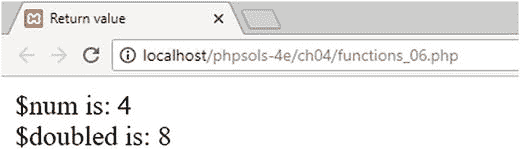

这次，我使用了不同的变量名以避免混淆。我还将 `doubleIt($num)` 的结果赋给了一个新变量。这样做的好处是，原始值和计算结果现在都可用。你并不总是需要保留原始值，但有时它非常有用。函数并不总是需要返回值。`return` 关键字可以单独使用以停止任何进一步的处理。

## 生成器——一种持续产出的特殊函数

当函数遇到 `return` 时，它会立即终止并返回一个值或什么都不返回。生成器是 PHP 5.5 引入的特殊函数，它们创建简单的迭代器，可以在循环内使用以生成一系列值。它们不使用 `return` 关键字，而是使用 `yield`。这使得生成器可以一次生成一个值，并跟踪序列中的下一个值，直到再次被调用或值耗尽为止。

生成器可以使用内部循环来生成它产出的值，也可以有一系列 `yield` 语句。`generator.php` 中的简单示例同时使用了这两种技术，如下所示：

```php
function counter($num) {
    $i = 1;
    while ($i < $num) {
        yield $i++;
    }
    yield $i;
    yield $i + 10;
    yield $i + 20;
}
```

`counter()` 生成器接受一个参数 `$num`。它将计数器 `$i` 初始化为 1，然后使用一个循环，该循环在 `$i` 小于 `$num` 时持续运行。循环产出 `$i` 并将其递增 1。循环结束后，一系列 `yield` 语句再产出三个值。

通过将生成器赋值给一个变量来初始化它后，你可以在 `foreach` 循环中使用它，如下所示：

```php
$numbers = counter(5);
foreach ($numbers as $number) {
    echo $number . ' ';
}
```

这将生成如下截图所示的一系列数字：

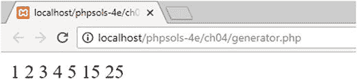

对于这个简单的例子，创建一个值数组并直接在循环中使用会更简单。生成器的主要优势在于，对于大量值，它们消耗的内存远少于数组。在第 9 章中，你将看到一个使用生成器处理文件内容的实际示例。

## 通过引用传递——改变参数的值

尽管函数通常不会改变作为参数传递给它们的变量的值，但有些情况下你确实想改变原始值，而不是捕获返回值。为此，在定义函数时，需要在要更改的参数前加上 `&` 符号，如下所示：

```php
function doubleIt(&$number) {
    $number *= 2;
}
```

请注意，这个版本的 `doubleIt()` 函数既没有 `echo` `$number` 的值，也没有返回计算结果。由于括号内的参数前面有 `&` 符号，因此作为参数传递给函数的变量的原始值将被更改。这被称为**通过引用传递**。

以下代码（位于 `functions_07.php`）演示了其效果：

```php
$num = 4;
echo '$num is: ' . $num . '';
doubleIt($num);
echo '$num is now: ' . $num;
```

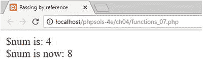

`&` 符号仅在函数定义中使用，在调用函数时不使用。一般来说，不建议使用函数来更改作为参数传递给它们的变量的原始值，因为如果该变量在脚本的其他地方被使用，可能会产生意外后果。然而，在某些情况下这样做非常有意义。例如，内置的数组排序函数使用通过引用传递来影响原始数组。

> **注意**
> 对象始终通过引用传递，即使函数定义中没有在参数前加 `&` 符号也是如此。这也适用于实现内置 PHP 类的迭代器和生成器。

## 接受可变数量参数的函数

PHP 5.6 引入了命名不太优雅的 **splat 运算符**，它允许你定义接受任意数量参数的函数。它由三个点（或句点）组成，位于函数签名中最后一个（或唯一一个）参数之前。splat 运算符将传递给函数的值转换为数组，然后可以在函数内部使用该数组。`functions_08.php` 中的代码包含以下简单示例：

```php
function addEm(...$nums) {
    return array_sum($nums);
}
$total = addEm(1, 2, 3, 4, 5);
echo '$total is ' . $total;
```

传递给函数的逗号分隔的数字被转换为数组，然后传递到内置的 `array_sum()` 函数中，该函数对数组中的所有值求和。以下截图显示了输出结果：

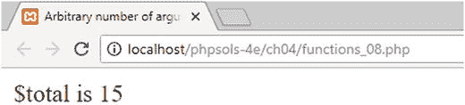