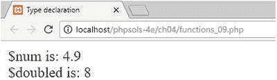
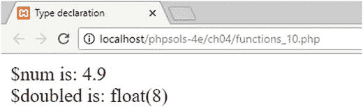

# 为类与函数可选指定数据类型

随着 PHP 的成熟，许多开发者希望对类与函数使用和返回的数据类型拥有更多控制权。这在社区内引发了激烈争论，因为 PHP 的弱类型特性是其成功的主要原因之一——无需担心数据类型使得该语言对初学者更容易学习。最终的折衷方案是引入可选的**类型声明**（在 PHP 5 中称为类型提示）。

要指定某个参数必须为特定类型，请在函数签名中该参数前加上表 [4-8] 中列出的类型之一。

**表 4-8. 类型声明**

| 类型 | 描述 | 最低 PHP 版本 |
| --- | --- | --- |
| 类/接口名称 | 必须是给定类或接口的实例 | 5.0 |
| `self` | 必须是当前类的实例 | 5.0 |
| `array` | 必须是数组 | 5.1 |
| `callable` | 必须是有效的可调用函数 | 5.4 |
| `bool` | 必须是布尔值 | 7.0 |
| `float` | 必须是浮点数 | 7.0 |
| `int` | 必须是整数 | 7.0 |
| `string` | 必须是字符串 | 7.0 |
| `iterable` | 必须是数组或实现 `Traversable` 接口 | 7.1 |
| `object` | 必须是对象 | 7.2 |

> **注意**
> **接口**定义了类必须实现哪些方法。

对于类、接口、数组、可调用函数和对象的类型声明，如果传入不同的类型会抛出错误，从而强制使用正确的数据类型。然而，`bool`、`float`、`int` 和 `string` 类型声明的行为有所不同。它们不会抛出错误，而是自动将参数转换为指定的数据类型。`functions_09.php` 中的代码通过添加类型声明，改编了本章前面的“从函数返回值”中的 `doubleIt()` 函数，如下所示：

```php
function doubleIt(int $number) {
    return $number *= 2;
}
```

以下截屏展示了向函数传递 4.9 时会发生什么：



数字在处理前被转换为整数，甚至不会四舍五入到最接近的整数，小数部分直接被截断。

> **提示**
> 你可以通过在脚本中启用严格模式来改变 `bool`、`float`、`int` 和 `string` 类型声明的行为。然而，严格模式的实现可能会令人困惑。我个人建议仅对类、接口和数组使用类型声明。你可以在 PHP 文档 [`www.php.net/manual/en/functions.arguments.php`](http://www.php.net/manual/en/functions.arguments.php) 中了解如何启用严格模式。

PHP 7 还引入了返回类型声明，用于指定函数返回的数据类型。可用类型与表 [4-8] 中列出的相同，并在 PHP 7.1 中增加了 `void`。返回类型声明由冒号和类型组成，位于函数签名的右括号和左花括号之间。`functions_10.php` 中的示例改编了 `doubleIt()` 函数，如下所示：

```php
function doubleIt(int $number) : float {
    return $number *= 2;
}
```

我特意选择这个不合逻辑的例子来演示：将 `float` 设为返回类型会静默地将函数返回的值转换为浮点数。但该声明不会覆盖参数的类型声明。向函数传递 4.9 作为参数仍会返回 8；但 `var_dump()` 显示 PHP 将其视为浮点数，如下截屏所示：



将 `bool`、`int` 和 `string` 用作返回类型声明也会执行静默数据类型转换，除非启用严格模式。其他返回类型声明在函数返回错误的数据类型时会抛出错误。

> **注意**
> 为保持代码的清晰性，本书中的代码仅在确实有益的情况下使用类型声明，例如检查传递给函数的数据类型是否正确。