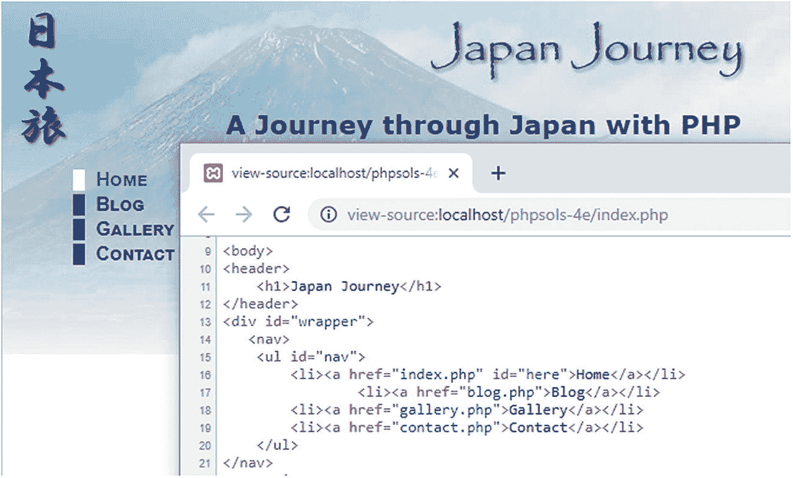
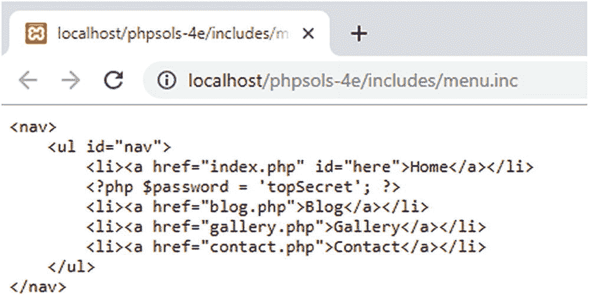
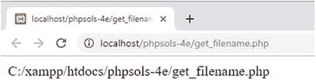
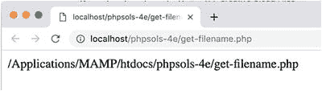
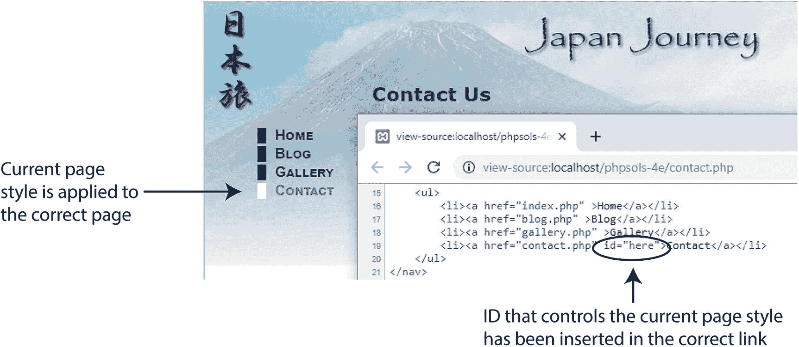
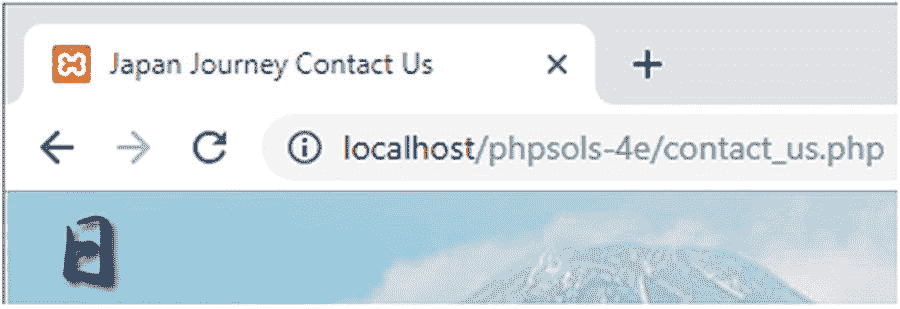

# PHP Include 文件与文件扩展名安全

## 页面布局与 Include 文件

`menu` 和 `footer` 出现在 Japan Journey 网站的每个页面上，因此它们非常适合作为 include 文件。清单 5-1 展示了页面主体的代码，其中 `menu` 和 `footer` 以粗体标出。

## 操作步骤

1.  从 `ch05` 文件夹复制 `index_01.php` 到 `phpsols-4e` 站点根目录，并重命名为 `index.php`。如果你使用像 Dreamweaver 这类会提示更新页面链接的程序，请不要更新链接。下载文件中的相对链接是正确的。通过在浏览器中加载 `index.php`，检查 CSS 和图片是否正常显示。页面应看起来与图 5-1 相同。

2.  从 `ch05` 文件夹复制 `blog.php`、`gallery.php` 和 `contact.php` 到你的站点根目录。这些页面暂时无法在浏览器中正确显示，因为必要的 include 文件尚未创建。不过这种情况很快就会改变。

3.  在 `index.php` 中，选中 `<nav>` 元素（如清单 5-1 中粗体所示），然后剪切（`Ctrl+X`/`Cmd+X`）到剪贴板。

4.  在站点根目录创建一个名为 `includes` 的新文件夹。然后在该文件夹中创建一个名为 `menu.php` 的文件。删除编辑程序自动插入的任何代码；文件必须完全空白。

5.  将剪贴板中的代码粘贴（`Ctrl+V`/`Cmd+V`）到 `menu.php` 中并保存文件。`menu.php` 的内容应如下所示：

    ```
    Home
        Journal
        Gallery
        Contact
    ```

    不用担心新文件没有 `DOCTYPE` 声明或任何 `<html>`、`<head>`、`<body>` 标签。其他包含该文件内容的页面会提供这些元素。

6.  打开 `index.php`，在 `nav` 无序列表留下的空白处插入以下代码：

    ```
    Japan Journey

    Home
    Journal
    Gallery
    Contact

    A journey through Japan with PHP
    One of the benefits of using PHP . . .

    Water basin at Ryoanji temple

    Ut enim ad minim veniam, quis nostrud . . .
    Eu fugiat nulla pariatur. Ut labore et dolore . . .
    Sed do eiusmod tempor incididunt ullamco . . .

    © 2006&ndash;2019 David Powers

    Listing 5-1.
    The static version of index.php
    ```

    这里使用了文档相对路径指向 `menu.php`。在路径开头使用 `./` 效率更高，因为它明确表示路径从当前文件夹开始。

> **提示**

> 我使用 `require` 命令是因为导航菜单至关重要。没有它，网站将无法导航。

7.  保存 `index.php` 并在浏览器中加载该页面。页面应与之前完全相同。虽然菜单和页面其余部分来自不同的文件，但 PHP 会在向浏览器发送任何输出之前将它们合并。

> **注意**

> 不要忘记 PHP 代码需要由 Web 服务器处理。如果你将文件存储在服务器文档根目录下名为 `phpsols-4e` 的子文件夹中，则应使用 URL `http://localhost/phpsols-4e/index.php` 访问 `index.php`。如需帮助查找服务器的文档根目录，请参阅第 2 章中的“在哪里放置你的 PHP 文件（Windows 和 Mac）”。

8.  对 `footer` 执行相同操作。剪切清单 5-1 中以粗体标出的行，粘贴到 `includes` 文件夹中名为 `footer.php` 的空白文件中。然后在 `<footer>` 留下的空白处插入包含新文件的命令：

    ```
    This time, I’ve used `include` rather than
    `require`. The
    `<footer>`
    is an important part of the page, but the site remains usable if the
    include file can’t be found.
    ```

> **警告**

> 如果某个 include 文件丢失（例如意外删除），你应该始终替换该文件或移除 include 命令。不要依赖 `include` 在找不到外部文件时仍尝试处理页面其余部分这一特性。一旦发现问题，务必立即修复。

9.  保存所有页面并在浏览器中重新加载 `index.php`。同样，页面应与原始页面完全相同。如果你导航到网站的其他页面，`menu` 和 `footer` 应出现在每个页面上。现在 include 文件中的代码服务于所有页面。

10. 为了证明菜单是从单个文件中提取的，请修改 `menu.php` 中“Journal”链接的文本，如下所示：

    ```
    Blog
    ```

11. 保存 `menu.php` 并重新加载网站。所有页面都会反映该更改。你可以对照 `ch05` 文件夹中的 `index_02.php`、`menu_01.php` 和 `footer_01.php` 来检查代码。

## 问题与解决方案

如图 5-2 所示，存在一个问题。指示当前页面的样式没有改变（它由 `<a>` 标签中的 `here` ID 控制）。


**图 5-2.** 当前页面指示器仍然指向首页

使用 PHP 条件逻辑可以轻松解决这个问题。在此之前，让我们先了解 Web 服务器和 PHP 引擎如何处理 include 文件。

## 为 Include 文件选择正确的文件扩展名

当 PHP 引擎遇到 include 命令时，它会暂停处理 PHP，在外部文件开头停止，并在文件结尾处恢复。这就是 include 文件只包含原始 HTML 的原因。如果你希望外部文件使用 PHP 代码，代码必须包含在 PHP 标签内。由于外部文件是作为包含它的 PHP 文件的一部分被处理的，因此 include 文件可以使用任何文件扩展名。

有些开发人员使用 `.inc` 作为文件扩展名，以明确表示该文件是要包含在另一个文件中的。然而，大多数服务器将 `.inc` 文件视为纯文本。如果文件包含敏感信息（如数据库的用户名和密码），这会带来安全风险。如果文件存储在网站根文件夹内，任何发现该文件名的人都可以直接在浏览器地址栏中输入 URL，浏览器就会乖乖地显示你的所有秘密信息！

另一方面，任何具有 `.php` 扩展名的文件都会在发送到浏览器之前自动发送到 PHP 引擎进行解析。只要你的秘密信息位于 PHP 代码块中，并且文件具有 `.php` 扩展名，它就不会暴露。这就是为什么有些开发人员使用 `.inc.php` 作为 PHP include 文件的双重扩展名。`.inc` 部分提醒你这是一个 include 文件，但服务器只关心末尾的 `.php`，这确保了所有 PHP 代码都能被正确解析。

很长时间以来，我一直遵循使用 `.inc.php` 作为 include 文件扩展名的约定。但由于我将所有 include 文件存储在一个名为 `includes` 的单独文件夹中，我认为双重扩展名是多余的。我现在只使用 `.php`。选择哪种命名约定取决于你，但单独使用 `.inc` 是最不安全的。

## PHP 解决方案 5-2：测试 include 文件的安全性

本方案演示了使用 `.inc` 和 `.php`（或 `.inc.php`）作为 include 文件扩展名之间的区别。使用上一节中的 `index.php` 和 `menu.php`。或者，使用 `ch05` 文件夹中的 `index_02.php` 和 `menu_01.php`。如果使用下载文件，请在使用前从文件名中去除 `_02` 和 `_01`。

1.  将 `menu.php` 重命名为 `menu.inc`，并相应修改 `index.php` 以包含它：

2.  在浏览器中加载 `index.php`。你应该看不到任何区别。

3.  修改 `menu.inc` 内部的代码，将密码存储在 PHP 变量中，如下所示：

    ```
    Home

    Blog
    Gallery
    Contact
    ```

4.  重新加载页面。如图 5-3 所示，密码仍然隐藏在源代码中。尽管包含文件没有 `.php` 文件扩展名，但其内容已与 `index.php` 合并，因此 PHP 代码已被处理。



图 5-3. PHP 代码没有输出，因此只有 HTML 被发送到浏览器

5.  现在在浏览器中直接加载 `menu.inc`。图 5-4 显示了结果。



图 5-4. 在浏览器中直接加载 `menu.inc` 会暴露 PHP 代码

服务器和浏览器都不知道如何处理 `.inc` 文件，因此整个内容会显示在屏幕上：原始 HTML、你的秘密密码，以及所有一切。

6.  将包含文件重命名为 `menu.inc.php`，并通过在之前步骤使用的 URL 末尾添加 `.php`，在浏览器中直接加载它。这次，你应该看到一个无序的链接列表。检查浏览器的源代码视图，PHP 代码不再暴露。

7.  将文件名改回 `menu.php`，并通过在浏览器中直接加载并再次查看源代码来测试包含文件。

8.  移除你在第 3 步添加到 `menu.php` 中的密码 PHP 代码，并将 `index.php` 中的包含命令恢复到原始设置，如下所示：

## PHP 方案 5-3：自动指示当前页面

让我们解决菜单不指示当前页面的问题。解决方案是通过 PHP 获取当前页面的文件名，然后使用条件语句在相应的 `<a>` 标签中插入一个 ID。

继续使用相同的文件。或者，使用 `ch05` 文件夹中的 `index_02.php`、`contact.php`、`gallery.php`、`blog.php`、`menu_01.php` 和 `footer_01.php`，确保从任何文件名中移除 `_01` 和 `_02`。

1.  打开 `menu.php`。当前代码如下所示：

```html
<body>
    <ul>
        <li><a href="index.php">首页</a></li>
        <li><a href="blog.php">博客</a></li>
        <li><a href="gallery.php">画廊</a></li>
        <li><a href="contact.php">联系</a></li>
    </ul>
</body>
```

指示当前页面的样式由第 2 行突出显示的 `id="here"` 控制。你需要 PHP 来插入 `id="here"`：如果当前页面是 `blog.php`，则插入到 `blog.php <a>` 标签中；如果是 `gallery.php`，则插入到 `gallery.php <a>` 标签中；如果是 `contact.php`，则插入到 `contact.php <a>` 标签中。

希望你现在已经得到了提示——你需要在每个 `<a>` 标签中使用一个 `if` 语句（参见第 3 章的“做出决策”）。第 2 行需要看起来像这样：

```html
<li><a href="blog.php">首页</a></li>
```

其他链接也应该以类似方式修改。但是 `$currentPage` 的值是如何得到的呢？你需要找出当前页面的文件名。

2.  暂时将 `menu.php` 放在一边，创建一个名为 `get_filename.php` 的新 PHP 页面。插入以下代码（或者使用 `ch05` 文件夹中的 `get_filename.php`）：

```php
<?php echo $_SERVER['SCRIPT_FILENAME']; ?>
```

3.  保存 `get_filename.php` 并在浏览器中查看。在 Windows 系统上，你应该看到类似以下截图的内容。（`ch05` 文件夹中的版本包含此步骤和下一步骤的代码，以及指示各自内容的文本。）



在 macOS 上，你应该看到类似这样的内容：



`$_SERVER['SCRIPT_FILENAME']` 来自 PHP 内置的超全局数组之一，它始终提供当前页面的绝对文件路径。你现在需要的是提取出文件名的方法。

4.  按如下所示修改上一步中的代码：

```php
<?php echo basename($_SERVER['SCRIPT_FILENAME']);
```

5.  保存 `get_filename.php`，然后点击浏览器中的“重新加载”按钮。现在你应该只看到文件名：`get_filename.php`。

PHP 内置函数 `basename()` 接收一个文件路径作为参数，并提取出文件名。那么，你就得到了当前页面的文件名查找方法。

6.  按如下所示修改 `menu.php` 中的代码（更改处以**粗体**突出显示）：

```
>Home
>Blog
>Gallery
>Contact
```

**提示**

我在 `here` 周围使用了双引号，因此将字符串 `'id="here"'` 包裹在单引号中。这样比 `"id=\"here\""` 更易读。

1.  保存 `menu.php`，并在浏览器中加载 `index.php`。菜单看起来应该和之前没有区别。使用菜单导航到其他页面。这次，如图 5-5 所示，当前页面旁边的边框应为白色，指示你在网站中的位置。如果你在浏览器中检查页面的源代码视图，会看到 `here` ID 已自动插入到正确的链接中。



**图 5-5.** 包含文件中的条件代码为每个页面生成不同的输出。

2.  如有必要，请将你的代码与 `ch05` 文件夹中的 `menu_02.php` 进行比较。

## PHP 解决方案 5-4：根据文件名自动生成页面标题

本解决方案使用 `basename()` 提取文件名，然后使用 PHP 字符串函数格式化名称，以便插入到 `<title>` 标签中。它仅适用于能反映页面内容的文件名，但这本身也是一个好的实践。

1.  创建一个名为 `title.php` 的新 PHP 文件，并保存在 `includes` 文件夹中。

2.  删除脚本编辑器插入的任何代码，并输入以下代码：

```php
<?php $title = basename($_SERVER['SCRIPT_FILENAME'], '.php');
```

**提示**

不要在末尾添加 PHP 结束标签。当同一文件中 PHP 代码之后没有其他内容时，结束标签是可选的。省略结束标签有助于避免包含文件中常见的“headers already sent”错误。你将在 PHP 解决方案 5-9 中了解更多关于此错误的信息。

PHP 解决方案 5-3 中使用的 `basename()` 函数接受一个可选的第二个参数：一个包含文件名扩展名（前面带句点）的字符串。添加第二个参数会从文件名中去除扩展名。因此，这段代码提取文件名，去除 `.php` 扩展名，并将结果赋值给一个名为 `$title` 的变量。

1.  打开 `contact.php`，并通过在 `DOCTYPE` 上方输入以下内容来包含 `title.php`：

**注意**

通常情况下，网页中的 `DOCTYPE` 声明之前不应有任何内容。但是，这不适用于 PHP 代码，只要它不向浏览器发送任何输出。`title.php` 中的代码仅将值赋给 `$title`，因此 `DOCTYPE` 声明仍然是浏览器看到的第一个输出。

1.  按如下所示修改 `<title>` 标签：

```
Japan Journey 
```

注意，在简写的 PHP 开放标签之前有一个空格。如果没有这个空格，`$title` 的值将会紧挨着“Journey”。

2.  保存两个页面，并在浏览器中加载 `contact.php`。不带 `.php` 扩展名的文件名已添加到浏览器标签中，如图 5-6 所示。


**图 5-6.** 一旦提取出文件名，你就可以动态生成页面标题。

3.  如果你希望从文件名派生的标题部分首字母大写呢？PHP 有一个名为 `ucfirst()` 的简洁小函数，它正好能做到这一点（`uc` 代表“大写”）。在第 2 步的代码中添加另一行，如下所示：

```php
<?php
$title = basename($_SERVER['SCRIPT_FILENAME'], '.php');
$title = ucfirst($title);
```

如果你是编程新手，这可能会让你感到困惑，所以让我们来看看这里发生了什么。PHP 标签之后的第一行代码获取文件名，去除末尾的 `.php`，并将其存储为 `$title`。下一行将 `$title` 的值传递给 `ucfirst()` 以将首字母大写，并将结果存回 `$title`。因此，如果文件名是 `contact.php`，`$title` 最初为 `contact`，但在下一行结束时，它变成了 `Contact`。

**提示**

你可以将两行代码合并为一行来缩短代码，如下所示：`$title = ucfirst(basename($_SERVER['SCRIPT_FILENAME'], '.php'));`。像这样嵌套函数时，PHP 会先处理最内层的函数，并将结果传递给外层函数。这使你的代码更短，但不太容易阅读。

1.  这种技术的一个缺点是文件名只能包含一个单词——至少应该如此。URL 中不允许有空格，这就是为什么一些网页设计软件或浏览器会用 `%20` 替换空格，这在 URL 中看起来丑陋且不专业。你可以通过使用下划线来解决这个问题。

将 `contact.php` 的文件名更改为 `contact_us.php`。

2.  按如下所示修改 `title.php` 中的代码：

```php
<?php
$title = basename($_SERVER['SCRIPT_FILENAME'], '.php');
$title = str_replace('_', ' ', $title);
$title = ucwords($title);
```

中间一行使用了一个名为 `str_replace()` 的函数来查找每个下划线并将其替换为空格。该函数接受三个参数：你想要替换的字符、替换字符以及你想要更改的字符串。

**提示**

你也可以使用 `str_replace()` 并通过将空字符串（一对中间没有任何内容的引号）作为第二个参数来移除字符。这会将第一个参数中的字符串替换为空，从而有效地将其移除。

最后一行代码没有使用 `ucfirst()`，而是使用了相关的函数 `ucwords()`，该函数使每个单词的首字母大写。

1.  保存 `title.php`，并在浏览器中加载重命名后的 `contact_us.php`。图 5-7 显示了结果。



**图 5-7.** 下划线已被移除，并且两个单词的首字母都已大写。

2.  将文件名改回 `contact.php`，并在浏览器中重新加载该文件。`title.php` 中的脚本仍然有效。没有下划线需要替换，因此 `str_replace()` 保持 `$title` 的值不变，并且 `ucwords()` 将首字母转换为大写，即使只有一个单词也是如此。

3.  对 `index.php`、`blog.php` 和 `gallery.php` 重复步骤 3 和 4。

4.  Japan Journey 网站的主页名为 `index.php`。如图 5-8 所示，将当前解决方案应用于此页面似乎不太合适。


**图 5-8.** 从 `index.php` 生成页面标题会产生不理想的结果。

有两种解决方案：要么不对此类页面应用此技术，要么使用条件语句（`if` 语句）来处理特殊情况。例如，要显示 Home 而不是 Index，请按如下所示修改 `title.php` 中的代码：

```php
<?php
$title = basename($_SERVER['SCRIPT_FILENAME'], '.php');
$title = str_replace('_', ' ', $title);
if ($title == 'index') {
    $title = 'home';
}
$title = ucwords($title);
```