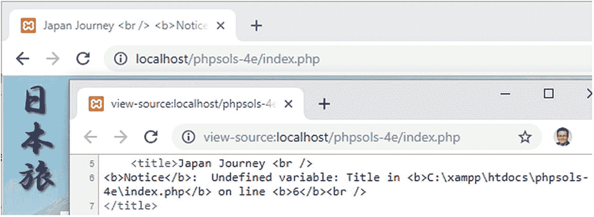

# PHP 解决方案 5-5：处理缺失的变量  

在许多场景中，预期值可能会缺失。例如，您可能拼错了变量名，表单可能没有提交值，或者包含文件缺失。因此，在尝试使用外部来源的值之前，检查其是否存在是一个好策略。在本解决方案中，您将使用两种不同的方法处理此问题。  

1.  继续使用与上一个解决方案相同的文件。或者，将`index_03.php`、`blog_02.php`、`gallery_02.php`和`contact_02.php`从`ch05`文件夹复制到您的站点根目录。同时确保`title.php`、`menu_02.php`和`footer_01.php`位于`includes`文件夹中。如果使用`ch05`文件夹中的文件，请从每个文件名中删除下划线和数字。  

2.  在`index.php`中，将`<title>`标签中变量的首字母大写，从`$title`改为`$Title`。PHP 变量是区分大小写的，因此这不再引用`title.php`生成的值。  

3.  保存文件，并在浏览器中加载`index.php`。右键单击查看源代码。如果您将`error_reporting`设置为第 2 章推荐的级别，您应该会看到如图 5-10 所示的结果。浏览器选项卡包含来自 PHP 错误通知的原始 HTML，关于未定义变量。  

  

**图 5-10.** 拼错变量会生成一个错误通知，显示在浏览器选项卡中  

4.  PHP 7 中的 null 合并运算符无缝处理了这种情况。像这样修改`<title>`标签中的 PHP 块：  

5.  保存并重新加载页面。浏览器选项卡现在应该如下所示：  

  

未定义的变量被忽略，null 合并运算符后面的值被显示而不生成错误通知。  

6.  删除引号之间的文本，留空字符串如下：  

7.  再次保存并重新加载页面。这次，浏览器选项卡只显示 HTML 中的文本。空字符串简单地抑制了错误通知。  

8.  通过将变量名首字母改为小写来更正变量名，并再次测试页面。现在它看起来与上一个 PHP 解决方案结束时相同（参见图 5-9）。  

9.  null 合并运算符适用于在变量不存在时设置默认值；但如果要修改变量，则不能使用它。在这种情况下，您需要使用`isset()`函数来测试变量是否存在。  

打开`blog.php`并按如下方式修改`<title>`标签：  

```
Japan Journey
```

请注意，HTML 文本与开始 PHP 标签之间的空格已被移除。此外，开始 PHP 标签不再是简写形式，因为 PHP 块包含一个条件语句；它不仅仅是显示一个值。  

`isset()`函数在变量存在时返回`true`。因此，如果`$title`已被定义，`echo`会显示一个包含长破折号（`&mdash;`是 HTML 字符实体）后跟`$title`值的双引号字符串。我将变量包裹在花括号中，因为实体和`$title`之间没有空格。这是可选的，但它使代码更易于阅读。  

## 提示  
`isset()`函数在值为空字符串时返回`true`。它检查变量是否已定义且不是`null`。使用`empty()`检查空字符串或零值。  

1.  保存`blog.php`并在浏览器中测试。浏览器选项卡应如下所示：  

  

由于`$title`有值，`isset()`返回`true`并显示前面带长破折号的值。  

2.  尝试使用未定义的变量，例如`$Title`。条件语句内的代码将被忽略而不会触发错误通知。  

3.  使用`isset()`或 null 合并运算符来保护`gallery.php`和`contact.php`免受`<title>`标签中使用未定义变量的影响。  

您可以将代码与`ch05`文件夹中的`index_04.php`、`blog_03.php`、`gallery_03.php`和`contact_03.php`进行对照检查。  

