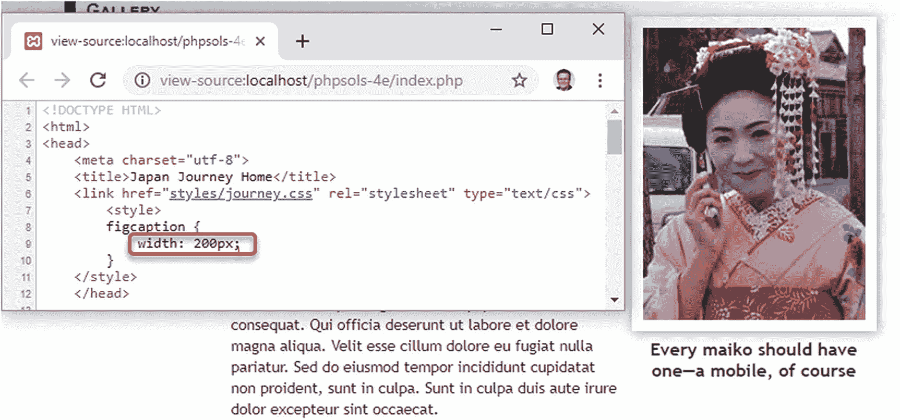
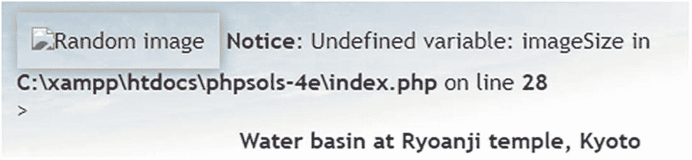
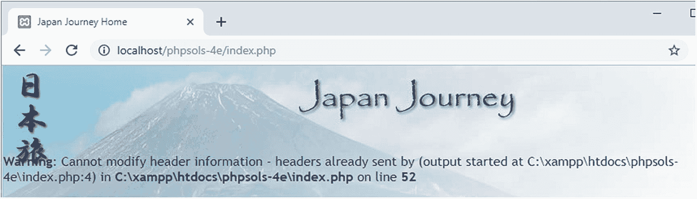
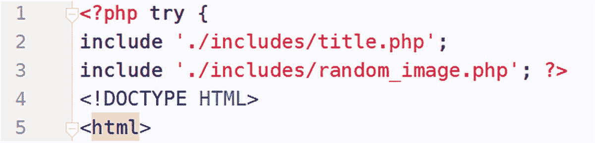

# PHP 解决方案 5-6：自动更新版权声明  

`footer.php`中的版权声明仅包含静态 HTML。本 PHP 解决方案展示了如何使用`date()`函数自动生成当前年份。该代码还指定了版权起始年份，并使用条件语句确定当前年份是否不同。如果是，则显示两个年份。  

继续使用 PHP 解决方案 5-5 中的文件。或者，使用`ch05`文件夹中的`index_04.php`和`footer_01.php`，并从文件名中删除数字。如果使用`ch05`文件夹中的文件，请确保在`includes`文件夹中有`title.php`和`menu.php`的副本。  

1.  打开`footer.php`。它包含以下 HTML：  


```
© 2006&ndash;2019 David Powers
```

使用包含文件的优势在于，只需修改这一个文件，就能更新整个网站的版权声明。不过，更高效的做法是让年份自动递增。

2. PHP 的 `date()` 函数可以很好地处理这个问题。像这样修改段落中的代码：

```
© 2006&ndash; David Powers
```

这会替换第二个日期，并用四位数字显示当前年份。请确保向 `date()` 传递大写的 `Y` 作为参数。

**注意**  
第 16 章中的表 [16-4](https://doi.org/10.1007/978-1-4842-4338-1_Table#16-4) 列出了最常用的字符，这些字符可以传递给 `date()` 函数以显示日期部分，例如月份、星期几等。

1. 保存 `footer.php` 并在浏览器中加载 `index.php`。页面底部的版权声明应该和之前一样——当然，除非你是在 2020 年或之后阅读本文，在这种情况下将会显示当前年份。

2. 和大多数版权声明一样，这个声明涵盖了一个年份范围，表示网站的首次上线时间。由于第一个日期是过去的年份，可以硬编码。但如果你正在创建一个新网站，则只需要当前年份。直到 1 月 1 日才需要显示年份范围。

要显示年份范围，需要知道起始年份和当前年份。如果两个年份相同，只显示当前年份；如果不同，则显示两者并用短破折号连接。这是一个简单的 `if...else` 场景。像这样修改 `footer.php` 中段落里的代码：

```
© David Powers
```

与 PHP 方案 5-5 一样，我在 `else` 子句中为变量使用了花括号，因为它们位于一个不含空格的**双引号字符串**中。

3. 保存 `footer.php` 并在浏览器中重新加载 `index.php`。版权声明应该和之前看起来一样。

4. 将传递给 `date()` 函数的参数改为小写的 `y`，如下所示：

```
$thisYear = date('y');
```

5. 保存 `footer.php` 并点击浏览器中的“重新加载”按钮。第二年将仅显示最后两位数字，如下图所示：


**提示**  
这应该提醒我们 PHP 中大小写敏感的重要性。大写的 `Y` 和小写的 `y` 与 `date()` 函数结合会产生不同的结果。忘记大小写敏感是 PHP 中最常见的错误原因之一。

1. 将传递给 `date()` 的参数改回大写的 `Y`。将 `$startYear` 的值设置为当前年份并重新加载页面。这一次，你应该只看到当前年份被显示出来。

现在你已经有了一个完全自动化的版权声明。完成的代码位于 `ch05` 文件夹的 `footer_02.php` 中。

## PHP 方案 5-7：显示随机图片

显示随机图片只需要一个可用图片列表，存储在索引数组中（请参阅第 4 章中的“创建数组”）。由于索引数组从 0 开始编号，你可以通过生成一个介于 0 和数组长度减 1 之间的随机数来选中其中一张图片。这一切只需几行代码即可完成……

继续使用相同的文件。或者，使用 `ch05` 文件夹中的 `index_04.php` 并将其重命名为 `index.php`。由于 `index_04.php` 使用了 `title.php`、`menu.php` 和 `footer.php`，请确保这三个文件都在你的 `includes` 文件夹中。图片已在 `images` 文件夹中。

1. 在 `includes` 文件夹中创建一个空白 PHP 页面，并将其命名为 `random_image.php`。插入以下代码（该代码也位于 `ch05` 文件夹的 `random_image_01.php` 中）：

```
<?php
$images = ['kinkakuji', 'maiko', 'maiko_phone', 'monk', 'fountains',
'ryoanji', 'menu', 'basin'];
$i = random_int(0, count($images)-1);
$selectedImage = "images/{$images[$i]}.jpg";
```

这是完整的脚本：一个包含图片名称（不含 `.jpg` 文件扩展名）的数组（无需重复共享信息——它们都是 JPEG 格式）、一个随机数生成器，以及一个为所选文件构建正确路径名的字符串。

要在一个范围内生成随机数，请将最小值和最大值作为参数传递给 `random_int()` 函数。由于数组中有八张图片，你需要一个介于 0 和 7 之间的数字。简单的方法是使用 `random_int(0, 7)`——简单，但效率低下。每次更改 `$images` 数组时，你都需要数一数它包含多少个元素，并更改传递给 `random_int()` 的最大数字。

使用 PHP 的 `count()` 函数为你完成这项工作要容易得多，该函数会计算数组中的元素数量。你需要一个比数组中元素数量少 1 的数字，因此传递给 `random_int()` 的第二个参数变为 `count($images)-1`，并将结果存储在 `$i` 中。

在最后一行中，随机数被用来为所选文件构建正确的路径名。变量 `$images[$i]` 被嵌入到一个**双引号字符串**中，且与周围字符之间没有空格分隔，因此它被括在花括号中。数组从 0 开始，所以如果随机数是 1，`$selectedImage` 就是 `images/maiko.jpg`。

如果你是 PHP 新手，可能会觉得理解这样的代码有困难：

```
$i = random_int(0, count($images)-1);
```

实际上，传递给 `random_int()` 的第二个参数是一个表达式，而不是一个数字。如果这样能让你更容易理解，可以将代码重写如下：

```
$numImages = count($images); // $numImages 是 8
$max = $numImages – 1;       // $max 是 7
$i = random_int(0, $max);    // $i = random_int(0, 7)
```

2. 打开 `index.php`，通过在与 `title.php` 相同的代码块中插入命令来包含 `random_image.php`，如下所示：

```
由于 `random_image.php` 不会向浏览器发送任何直接输出，将其放在 `DOCTYPE` 之上是安全的。
```

3. 向下滚动到 `index.php` 内部，找到在 figure 元素中显示图片的代码。它看起来像这样：

```

<figcaption>龙安寺水钵</figcaption>
```

4. 不再使用固定的 `images/basin.jpg` 作为图片，而是将其替换为 `$selectedImage`。所有图片都有不同的尺寸，因此删除 `width` 和 `height` 属性，并使用一个通用的 `alt` 属性。同时删除 `figcaption` 元素中的文本。步骤 3 中的代码现在应该看起来像这样：

```
" alt="随机图片" class="picBorder">
```

**注意**  
这个 PHP 块只显示一个值，因此你可以使用简短的 `echo` 标签 `<?=`。

1. 同时保存 `random_image.php` 和 `index.php`，然后在浏览器中加载 `index.php`。现在图片应该是随机选择的。点击浏览器中的“重新加载”按钮；你应该会看到各种不同的图片，如图 5-11 所示。


**图 5-11.** 将图片文件名存储在索引数组中使得显示随机图片变得容易

你可以对照 `ch05` 文件夹中的 `index_05.php` 和 `random_image_01.php` 来检查你的代码。这是一种简单而有效的显示随机图片的方式，但如果能够动态地为不同大小的图片设置宽度和高度，并且添加描述图片的标题，效果会更好。


### PHP 解决方案 5-8：为随机图像添加说明文字

此解决方案使用多维数组（即数组的数组）来存储每张图像的文件名和说明文字。如果你觉得从抽象角度理解多维数组概念有困难，可以把它想象成一个大盒子，里面有许多信封，每个信封里装着一张照片及其说明。盒子就是顶层数组，里面的信封就是子数组。

这些图像尺寸各不相同，但 PHP 恰好提供了一个名为 `getimagesize()` 的函数。猜猜它是做什么的。

此 PHP 解决方案基于前一个方案，因此请继续使用相同的文件。

1. 打开 `random_image.php` 并将代码修改如下：

```
'kinkakuji',
    'caption' => '京都金阁寺'],
    ['file'    => 'maiko',
    'caption' => '舞伎——京都的见习艺伎'],
    ['file'    => 'maiko_phone',
    'caption' => '每个舞伎都应该有一部——当然是手机'],
    ['file'    => 'monk',
    'caption' => '在京都化缘的僧侣'],
    ['file'    => 'fountains',
    'caption' => '东京市中心的喷泉'],
    ['file'    => 'ryoanji',
    'caption' => '京都龙安寺的秋叶'],
    ['file'    => 'menu',
    'caption' => '京都先斗町餐厅外的菜单'],
    ['file'    => 'basin',
    'caption' => '京都龙安寺的水钵']
    ];
    $i = random_int(0, count($images)-1);
    $selectedImage = "images/{$images[$i]['file']}.jpg";
    $caption = $images[$i]['caption'];
```

**注意**  
你需要注意代码的编写。每个子数组用一对方括号括起来，后面跟一个逗号，用于与下一个子数组分隔。如果像示例所示对齐数组键和值，你会发现构建和维护多维数组更容易。

虽然代码看起来复杂，但它只是一个包含八个元素的普通索引数组，每个元素都是一个包含 `'file'` 和 `'caption'` 定义的关联数组。多维数组的定义构成了一条单一语句，因此在第 19 行之前没有分号。该行的右括号与第 2 行的左括号匹配。

用于选择图像的变量也需要更改，因为 `$images[$i]` 不再包含字符串，而是包含一个数组。要获取正确的图像文件名，你需要使用 `$images[$i]['file']`。所选图像的说明文字包含在 `$images[$i]['caption']` 中，并存储在一个较短的变量中。

2. 现在你需要修改 `index.php` 中的代码来显示说明文字，如下所示：

```
" alt="随机图片" class="picBorder">
```

3. 保存 `index.php` 和 `random_image.php`，并在浏览器中加载 `index.php`。大多数图像看起来正常，但持有手机的见习艺伎图像的右侧有一个难看的空白区域，如图 5-12 所示。


**图 5-12.** 长说明文字超出了图像范围，并将其过度左移

4. 在 `random_image.php` 末尾添加以下代码：

```
if (file_exists($selectedImage) && is_readable($selectedImage)) {
    $imageSize = getimagesize($selectedImage);
}
```

`if` 语句使用了两个函数 `file_exists()` 和 `is_readable()`，以确保 `$selectedImage` 不仅存在，而且可访问（它可能已损坏或权限不正确）。这些函数返回布尔值（`true` 或 `false`），因此可以直接用作条件语句的一部分。

`if` 语句内的单行代码使用了 `getimagesize()` 函数，该函数返回一个包含图像信息的数组，并存储为 `$imageSize`。你将在第 10 章了解更多关于 `getimagesize()` 的内容。目前，你感兴趣的是以下两条信息：

- `$imageSize[0]`：图像的宽度（像素）
- `$imageSize[3]`：包含图像高度和宽度信息的字符串，格式化为 `` 标签的属性

5. 首先，让我们修复 `` 标签中的代码。按如下方式更改：

```
" alt="随机图片" class="picBorder" >
```

这将在 `` 标签内插入正确的 `width` 和 `height` 属性。

6. 尽管这设置了图像的尺寸，你仍然需要控制说明文字的宽度。你无法在外部样式表中使用 PHP，但没有什么可以阻止你在 `index.php` 的 `<head>` 中创建一个 `<style>` 块。在结束的 `</head>` 标签之前插入以下代码：

```
figcaption {
    width: px;
}
```

这段代码只有七行简短代码，但它是一个 PHP 和 HTML 的奇特混合体。让我们从第一行和最后一行开始。如果你去掉 PHP 标签并用注释替换 HTML `<style>` 块，得到的结果是：

```
if (isset($imageSize)) {
    // 如果 $imageSize 已设置，则执行某些操作
}
```

换句话说，如果变量 `$imageSize` 尚未设置（定义），PHP 引擎会忽略大括号之间的所有内容。大括号之间的代码大部分是 HTML 和 CSS，这无关紧要。如果 `$imageSize` 尚未设置，PHP 引擎会跳转到右大括号，并且中间的代码不会发送到浏览器。

**提示**  
许多经验不足的 PHP 程序员错误地认为，在条件语句中需要使用 `echo` 或 `print` 来生成 HTML 输出。只要开闭大括号匹配，你就可以像这样使用 PHP 来隐藏或显示 HTML 部分。这比总是使用 `echo` 要整洁得多，而且输入量也更少。

如果 `$imageSize` 已设置，则会创建 `<style>` 块，并使用 `$imageSize[0]` 为包含说明文字的段落设置正确的宽度。

7. 保存 `random_image.php` 和 `index.php`，然后在浏览器中重新加载 `index.php`。点击“重新加载”按钮，直到手持手机的见习艺伎图像出现。这次，它应该看起来像图 5-13。如果你查看浏览器的源代码，样式规则使用了正确的图像宽度。



**图 5-13.** 通过创建与图像尺寸直接相关的样式规则，消除了难看的空白区域

**注意**  
如果说明文字仍然突出，请确保 `<style>` 块中结束的 PHP 标签与 `px` 之间没有空格。CSS 不允许在值和度量单位之间存在空白。

8. `random_image.php` 中的代码以及你刚刚插入的代码，可以在所选图像找不到时防止错误，但显示图像的代码缺少类似的检查。临时更改其中一个图像的名称（无论是在 `random_image.php` 中还是在 `images` 文件夹中）。多次重新加载 `index.php`。最终，你应该会看到如图 5-14 所示的错误信息。这看起来非常不专业。



**图 5-14.** 包含文件中的错误可能会破坏页面的外观


2. `random_image.php` 底部的条件语句仅在所选图像既存在又可读时才设置 `$imageSize`，因此如果 `$imageSize` 已被设置，就表示一切就绪。请在 `index.php` 中显示图像的 `<figure>` 元素周围添加条件语句的起始和结束标记，如下所示：

```
.jpg"
     alt="随机图片" class="picBorder">
```

存在的图像会正常显示，但若文件缺失或损坏，你将避免任何令人尴尬的错误信息——这会让页面看起来更专业。别忘了恢复你在上一步中修改的图像名称。

你可以将代码与 `ch05` 文件夹中的 `index_06.php` 和 `random_image_02.php` 进行对照检查。

## 使用包含文件预防错误

许多托管公司会关闭针对通知类问题的错误报告，因此如果你只在远程服务器上进行测试，可能根本察觉不到图 5-14 所示的问题。然而，在将 PHP 页面部署到互联网之前，消除所有错误至关重要。仅仅因为你看不到错误信息，并不意味着你的页面没有问题。

使用 PHP 等服务器端技术的页面会处理大量未知因素，因此明智的做法是进行防御性编码，在使用值之前先进行检查。本节介绍了一些措施，你可以用来预防和排查包含文件相关的错误。

### 检查变量是否存在

从 PHP 解决方案 5-5 和 5-8 中可以得出的经验是：你应该始终使用空合并运算符来设置默认值，或者使用 `isset()` 来验证来自包含文件的变量是否存在，并将所有依赖该变量的代码包裹在条件语句中。你还可以将 `isset()` 与逻辑非运算符（参见第 4 章表 4-7）结合使用来分配默认值，如下所示：

```
if (!isset($someVariable)) {
    $someVariable = 默认值;
}
```

你可能会在很多脚本中看到这种设置默认值的结构，因为空合并运算符是从 2015 年 12 月发布的 PHP 7.0 才开始可用的。两者并没有好坏之分；但空合并运算符能让代码更简洁。

### 检查函数或类是否已定义

包含文件常用于定义自定义函数或类。尝试使用一个尚未定义的函数或类会触发致命错误。要检查函数是否已定义，请将函数名作为字符串传递给 `function_exists()`。在将函数名传递给 `function_exists()` 时，记得省略函数名末尾的括号。例如，检查一个名为 `doubleIt()` 的函数是否已定义，可以这样做：

```
if (function_exists('doubleIt')) {
    // 使用 doubleIt()
}
```

要检查类是否已定义，可以用同样的方式使用 `class_exists()`，将包含类名的字符串作为参数传递：

```
if (class_exists('MyClass')) {
    // 使用 MyClass
}
```

假设你想使用某个函数或类，一种更实用的方法是：如果该函数或类尚未定义，则使用条件语句来包含其定义文件。例如，如果 `doubleIt()` 的定义位于名为 `utilities.php` 的文件中：

```
if (!function_exists('doubleIt')) {
    require_once './includes/utilities.php';
}
```

## 在线上网站中抑制错误信息

假设你的包含文件在远程服务器上运行正常，那么前面几节概述的措施可能已经涵盖了所有你需要的错误检查。然而，如果你的远程服务器会显示错误信息，你应该采取措施将其抑制。以下技术会隐藏所有错误信息，而不仅仅是那些与包含文件相关的。

### 使用错误控制运算符

一种比较粗糙但有效的方法是使用 PHP 的错误控制运算符（`@`），它可以抑制与该行代码相关的错误信息。你可以将 `@` 放在行首，或者直接放在你认为可能产生错误的函数或命令前面，就像这样：

```
@ include './includes/random_image.php';
```

错误控制运算符的问题在于，它会隐藏错误而不是绕过错误。它只是一个字符，所以很容易忘记你已经使用了它。结果，你可能会浪费大量时间在脚本的错误部分寻找错误。如果你使用了错误控制运算符，在排查问题时，`@` 标记应该是你移除的第一个东西。另一个缺点是，你需要在每一个可能产生错误信息的行上都使用错误控制运算符，因为它只影响当前行。

### 在 PHP 配置中关闭 `display_errors`

在线上网站中抑制错误信息的一个更好的方法，是在 Web 服务器的配置中关闭 `display_errors` 指令。如果您的托管公司允许您控制其设置，最有效的方法是编辑 `php.ini`。找到 `display_errors` 指令，将 `On` 改为 `Off`。

如果你无法控制 `php.ini`，许多托管公司允许你使用名为 `.htaccess` 或 `.user.ini` 的文件更改有限的配置设置。选择哪种文件取决于 PHP 在服务器上的安装方式，因此请咨询你的托管公司以确定使用哪种。

如果你的服务器支持 `.htaccess` 文件，请在服务器根目录的 `.htaccess` 文件中添加以下命令：

```
php_flag display_errors Off
```

在 `.user.ini` 文件中，命令则简单地写为：

```
display_errors Off
```

`.htaccess` 和 `.user.ini` 都是纯文本文件。与 `php.ini` 类似，每个命令应单独占一行。如果远程服务器上不存在该文件，你可以直接在文本编辑器中创建它。确保你的编辑器不会自动在文件名末尾添加 `.txt`。然后，将该文件上传到你网站的服务器根目录。

> **提示：** 默认情况下，macOS 会隐藏以点开头的文件。在 macOS Sierra 及更高版本中，使用键盘快捷键 Cmd+Shift+. (点) 来切换隐藏文件的显示和隐藏。

### 在单个文件中关闭 `display_errors`

如果你无法控制服务器配置，可以通过在任何脚本的顶部添加以下行来防止显示错误信息：

```
ini_set('display_errors', 'Off');
```

## PHP 解决方案 5-9：当找不到包含文件时进行重定向

到目前为止建议的所有技术，都只是在找不到包含文件时抑制错误信息。如果缺少包含文件会导致页面没有意义，那么你应该在包含文件缺失时将用户重定向到一个错误页面。

一种实现方法是抛出异常，就像这样：

```
$file = './includes/menu.php';
if (file_exists($file) && is_readable($file)) {
    include $file;
} else {
    throw new Exception("$file 找不到");
}
```

当使用可能抛出异常的代码时，你需要将其包裹在 `try` 代码块中，并创建一个 `catch` 代码块来处理异常（参见第 4 章的“处理错误和异常”）。此 PHP 解决方案展示了如何做到这一点，即在找不到包含文件时，使用 `catch` 代码块将用户重定向到另一个页面。

如果你已经对网站进行了全面设计和测试，那么在大多数使用包含文件的页面上，此技术并不是必需的。然而，下面的 PHP 解决方案绝非无意义的练习。它演示了 PHP 的几个重要特性：如何抛出和捕获异常，以及如何重定向到另一个页面。正如你将从以下说明中看到的，重定向并非总是那么简单。这个 PHP 解决方案展示了如何克服最常见的问题。


接续使用 PHP 解决方案 5-8 中的 `index.php`，或者使用 `ch05` 文件夹中的 `index_06.php`。

1.  将 `error.php` 从 `ch05` 文件夹复制到站点根目录。如果编辑程序提示更新页面中的链接，请不要更新。这是一个包含通用错误消息和指向其他页面链接的静态页面。

2.  在编辑程序中打开 `index.php`。导航菜单是最不可或缺的包含文件，因此请像这样编辑 `index.php` 中的 `require` 命令：

```
    $file = './includes/menu.php';
    if (file_exists($file) && is_readable($file)) {
    require $file;
    } else {
    throw new Exception("$file can't be found");
    }
    ```

提示
将包含文件的路径存储在一个变量中，例如上述代码，可以避免重复输入四次，从而减少拼写错误的可能性。

3.  要将用户重定向到另一个页面，请使用 `header()` 函数。除非存在语法错误，否则 PHP 引擎通常从页面顶部开始处理，输出 HTML，直到遇到问题。这意味着当 PHP 引擎执行到此代码时，输出可能已经开始。为防止这种情况发生，请在生成任何输出之前启动 `try` 块。（这在许多设置上可能不起作用，但请耐心阅读，因为它演示了一个重要的观点。）

    滚动到页面顶部，并像这样编辑开头的 PHP 代码块：

```
    这将打开 `try` 块。

```

4.  滚动到页面底部，并在结束的 `</html>` 标签后添加以下代码：

```
    这将关闭 `try` 块并创建一个 `catch` 块来处理异常。`catch` 块中的代码使用 `header()` 将用户重定向到 `error.php`。`header()` 函数向浏览器发送一个 HTTP 头。它接受一个字符串作为参数，该字符串包含由冒号分隔的头及其值。在这种情况下，它使用 `Location` 头将浏览器重定向到冒号后 URL 指定的页面。必要时调整 URL 以匹配您自己的设置。

```

5.  保存 `index.php` 并在浏览器中测试页面。它应该正常显示。

6.  将您在步骤 2 中创建的变量 `$file` 的值更改为指向一个不存在的包含文件，例如 `men.php`。

7.  保存 `index.php` 并在浏览器中重新加载它。如果您在测试环境中使用 XAMPP 或最新版本的 MAMP，您很可能会被正确重定向到 `error.php`。但是，在某些设置上，您很可能会看到图 5-15 中的消息。



图 5-15。

如果输出已发送到浏览器，`header()` 函数将无法工作

图 5-15 中的错误消息可能比任何其他错误消息导致更多的开发者抓狂。（我也深受其害。）如前所述，如果输出已发送到浏览器，则不能使用 `header()` 函数。那么，发生了什么？

答案就在错误消息中，但并不明显。它说错误发生在第 52 行，这是调用 `header()` 函数的地方。您真正需要知道的是输出是在哪里生成的。该信息隐藏在这里：

```
    (output started at C:\xampp\htdocs\phpsols-4e\index.php:4)
    ```

冒号后面的数字 4 是行号。那么，`index.php` 的第 4 行是什么？从下面的屏幕截图中可以看到，第 4 行输出了 HTML DOCTYPE 声明。



由于到目前为止代码中没有错误，PHP 引擎已经输出了 HTML。一旦发生这种情况，`header()` 就无法重定向页面，除非输出存储在缓冲区（Web 服务器的内存）中。

注意
您在 XAMPP 和其他一些设置中没有收到此错误消息的原因是因为输出缓冲通常设置为 4096，这意味着在 HTTP 头发送到浏览器之前，4 KB 的输出存储在缓冲区中。虽然有用，但这会给您一种虚假的安全感，因为您的远程服务器上可能未启用输出缓冲。因此，即使您被正确重定向，也请继续阅读。

8.  像这样编辑 `index.php` 顶部的代码块：

```
    `ob_start()` 函数会开启输出缓冲，防止在调用 `header()` 函数之前将任何输出发送到浏览器。

```

9.  PHP 引擎会在脚本结束时自动刷新缓冲区，但最好显式地执行此操作。像这样编辑页面底部的 PHP 代码块：

```
    这里添加了两个不同的函数。重定向到另一个页面时，您不希望将 HTML 存储在缓冲区中。因此，在 `catch` 块内部，调用了 `ob_end_clean()`，它会关闭缓冲区并丢弃其内容。
    但是，如果没有抛出异常，您希望显示缓冲区的内容，因此在页面末尾的 `try` 和 `catch` 块之后调用了 `ob_end_flush()`。这会刷新缓冲区的内容并将其发送到浏览器。

```

10. 保存 `index.php` 并在浏览器中重新加载它。这次，无论您的服务器配置中是否启用了缓冲，您都应该被重定向到错误页面，如图 5-16 所示。


图 5-16。

缓冲输出使浏览器能够重定向到错误页面

11. 将 `$file` 的值更改回 `./includes/menu.php` 并保存 `index.php`。当您在错误页面上单击“主页”链接时，`index.php` 应正常显示。

您可以将您的代码与 `ch05` 文件夹中的 `index_07.php` 进行比较。

为什么我不能对 PHP 包含使用站点根目录相对链接？
嗯，您可以，也不能。为清楚起见，我首先解释相对于文档的链接和相对于站点根的链接之间的区别。

**文档相对链接**
大多数 Web 创作工具指定到其他文件（如样式表、图像和其他网页）的路径时，都是相对于当前文档的。如果目标页面在同一文件夹中，则仅使用文件名。如果目标页面比当前页面高一级，则文件名前加上 `../`。这被称为**文档相对路径**或链接。如果您有一个包含许多层级文件夹的站点，这种类型的链接可能难以理解——至少对人类来说是这样。

**相对于站点根的链接**
网页中使用的另一种链接类型始终以正斜杠开头，这是站点根的简写。**站点根相对路径**的优点是，无论当前页面在站点层次结构中的深度如何，开头的正斜杠都能保证浏览器从站点的顶层开始查找。尽管站点根相对链接更易于阅读，但 PHP 包含命令无法处理它们。您必须使用文档相对路径、绝对路径，或者在您的 `include_path` 指令中指定 `includes` 文件夹（请参阅本章后面的“调整您的 include_path”）。

注意
只有当开头的斜杠代表站点根时，PHP 包含命令才无法定位外部文件。Linux 和 macOS 上的绝对路径也以正斜杠开头。绝对路径是明确的，因此它们没有问题。


你可以通过将超全局变量 `$_SERVER['DOCUMENT_ROOT']` 拼接到路径开头，将站点根目录的相对路径转换为绝对路径，如下所示：

```
require $_SERVER['DOCUMENT_ROOT'] . '/includes/filename.php';
```

大多数服务器都支持 `$_SERVER['DOCUMENT_ROOT']`，但请检查远程服务器上 `phpinfo()` 显示的配置详情底部的 PHP 变量部分，以确认无误。

## 包含文件中的链接

这是容易让许多人混淆的一点。PHP 和浏览器对以正斜杠开头的路径解释方式不同。因此，虽然你不能使用相对于站点根目录的链接来包含文件，但包含文件*内部*的链接通常应相对于站点根目录。这是因为包含文件可能被引入站点层次结构的任何层级，因此当文件在不同层级被包含时，基于文档的相对链接就会失效。

> **注意：** `menu.php` 中的导航菜单使用的是基于文档的相对链接，而非相对于站点根目录的链接。这样设计是有意为之，因为除非你创建了虚拟主机，否则站点根目录是 `localhost`，而不是 `phpsols-4e`。这是在 Web 服务器文档根目录的子文件夹中测试站点的一个缺点。本书全程使用的日本之旅网站只有一个层级，因此基于文档的相对链接可以正常工作。在开发包含多级文件夹的站点时，建议在包含文件中使用相对于站点根目录的链接，并考虑设置一个虚拟主机进行测试（详见第 2 章）。

## 选择包含文件的存放位置

PHP 包含文件一个有用的特性是它们可以放在任何位置，只要包含 `include` 命令的页面知道它们在哪里即可。包含文件甚至不需要放在 Web 服务器的根目录下。这意味着你可以将包含密码等敏感信息的包含文件存放在浏览器无法访问的私有目录（文件夹）中，从而保护它们。

> **提示：** 如果你的托管服务商在服务器根目录之外提供了存储区域，你应认真考虑将部分（若非全部）包含文件存放在那里。

## 包含功能的安全考虑

包含文件是 PHP 一个非常强大的特性。强大之处也伴随着安全风险。只要外部文件可访问，PHP 就会将其包含进来，并将其中任何代码合并到主脚本中。从技术上讲，包含文件甚至可以位于不同的服务器上。但这被认为存在极大的安全隐患，以至于配置指令 `allow_url_include` 默认是禁用的。因此，除非你完全控制服务器配置，否则无法从其他服务器包含文件。与 `include_path` 不同，`allow_url_include` 指令只能由服务器管理员覆盖。即使你同时控制着两台服务器，也绝不应该从另一台服务器包含文件。攻击者有可能伪造地址并尝试在你的网站上执行恶意脚本。永远不要包含公众可以上传或覆盖的文件。

> **注意：** 本章剩余部分技术性较强，主要作为参考提供。你可以随意跳过。

## 调整你的 `include_path`

`include` 命令需要相对路径或绝对路径。如果两者都未指定，PHP 会自动在 PHP 配置中指定的 `include_path` 中查找。将包含文件放在 Web 服务器的 `include_path` 所指定的文件夹中的好处是，你无需费心去弄准相对或绝对路径。你只需要文件名即可。如果你使用大量包含文件，或者站点层级很深，这会非常有用。有三种方法可以更改 `include_path`：

*   **在 `php.ini` 中编辑值**：如果你的托管服务商允许你访问 `php.ini`，这是添加自定义包含文件夹的最佳方式。
*   **使用 `.htaccess` 或 `.user.ini`**：如果你的托管服务商允许通过 `.htaccess` 或 `.user.ini` 文件更改配置，这是一个不错的替代方案。
*   **使用 `set_include_path()`**：仅当前面选项不可用时才使用此方法，因为它仅影响当前文件的 `include_path`。

当你运行 `phpinfo()` 时，Web 服务器的 `include_path` 值会列在配置详情的 Core 部分。它通常以句点开头，表示当前文件夹，其后是要搜索的每个文件夹的绝对路径。在 Linux 和 macOS 上，每个路径之间用冒号分隔。在 Windows 上，分隔符是分号。在 Linux 或 Mac 服务器上，你现有的 `include_path` 指令可能如下所示：

```
.:/php/PEAR
```

在 Windows 服务器上，等价形式如下：

```
.;C:\php\PEAR
```

### 在 `php.ini` 或 `.user.ini` 中编辑 `include_path`

在 `php.ini` 中找到 `include_path` 指令。要添加一个名为 `includes` 的文件夹到你的站点中，请在现有值的末尾添加一个冒号或分号（取决于服务器操作系统），后跟 `includes` 文件夹的绝对路径。

在 Linux 或 Mac 服务器上，使用冒号，示例如下：

```
include_path=".:/php/PEAR:/home/mysite/includes"
```

在 Windows 服务器上，使用分号：

```
include_path=".;C:\php\PEAR;C:\sites\mysite\includes"
```

`.user.ini` 文件的命令相同。`.user.ini` 中的值会覆盖默认值，因此请确保从 `phpinfo()` 复制现有值，然后将新路径添加进去。

### 使用 `.htaccess` 更改 `include_path`

`.htaccess` 文件中的值会覆盖默认值，因此请从 `phpinfo()` 复制现有值，然后将新路径添加进去。在 Linux 或 Mac 服务器上，该值应类似于：

```
php_value include_path ".:/php/PEAR:/home/mysite/includes"
```

在 Windows 上命令相同，只是路径之间用分号分隔：

```
php_value include_path ".;C:\php\PEAR;C:\sites\mysite\includes"
```

> **注意：** 在 `.htaccess` 中，不要在 `include_path` 和路径名列表之间插入等号。

### 使用 `set_include_path()`

尽管 `set_include_path()` 仅影响当前页面，但你可以轻松创建一段代码片段并粘贴到你想要使用它的页面中。PHP 还支持以平台无关的方式轻松获取现有的 `include_path` 并将其与新的路径合并。

将新路径存储在一个变量中，然后将其与现有值组合，如下所示：

```
$includes_folder = '/home/mysite/includes';
set_include_path(get_include_path() . PATH_SEPARATOR . $includes_folder);
```

看起来好像传递了三个参数给 `set_include_path()`，但实际上只有一个；这三个元素通过连接运算符（句点）连接，而不是逗号。

*   `get_include_path()` 获取当前的 `include_path`。
*   `PATH_SEPARATOR` 是一个 PHP 常量，它会根据操作系统自动插入冒号或分号。
*   `$includes_folder` 添加新路径。

这种方法的问题在于，新 `includes` 文件夹的路径在你的远程服务器和本地测试服务器上可能不同。你可以通过条件语句来解决这个问题。超全局变量 `$_SERVER['HTTP_HOST']` 包含网站的域名。如果你的域名是 `www.example.com`，你可以像这样为每个服务器设置正确的路径：

```
if ($_SERVER['HTTP_HOST'] == 'www.example.com') {
$includes_folder = '/home/example/includes';
} else {
$includes_folder = 'C:/xampp/htdocs/phpsols-4e/includes';
}
set_include_path(get_include_path() . PATH_SEPARATOR . $includes_folder);
```

对于不使用大量包含文件的小型网站来说，使用 `set_include_path()` 可能并不划算。不过，在更复杂的项目中，你可能会发现它很有用。


