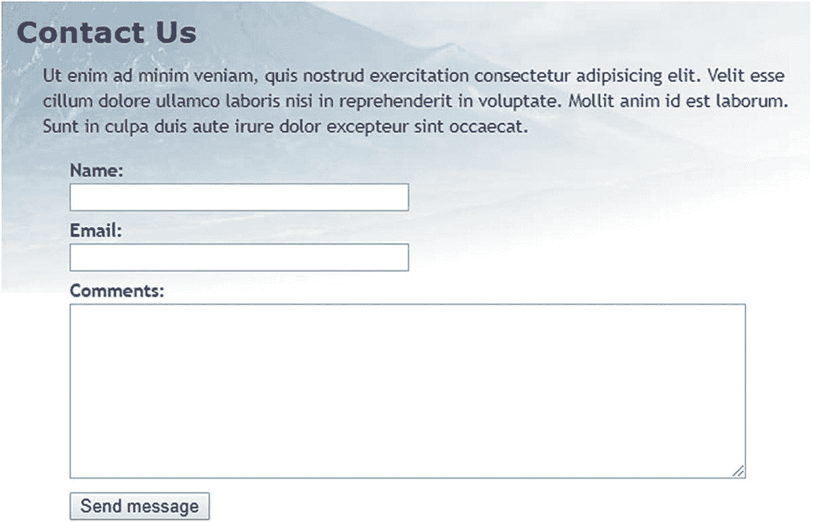
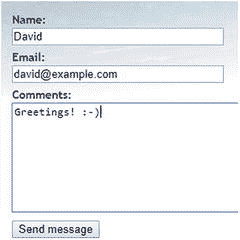
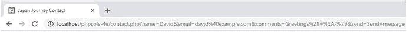
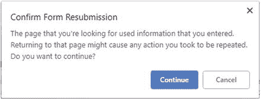
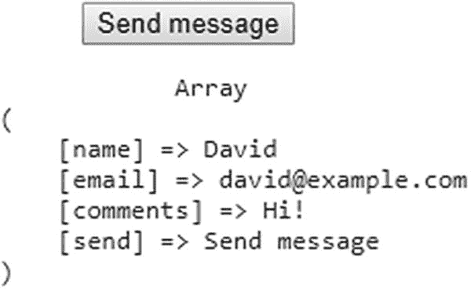
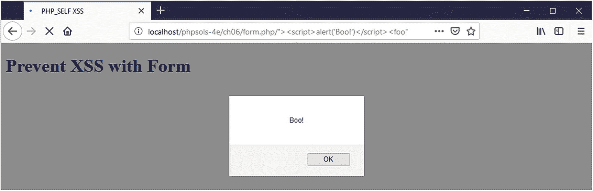
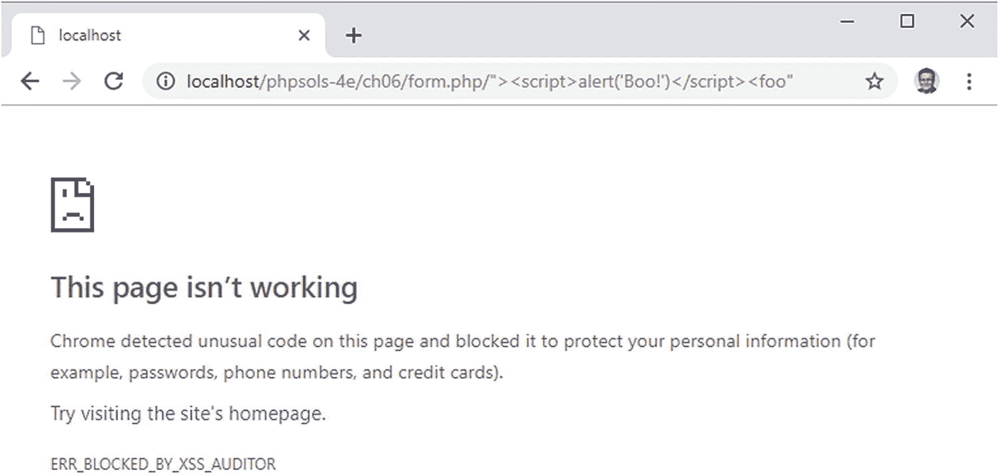
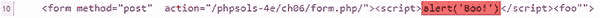
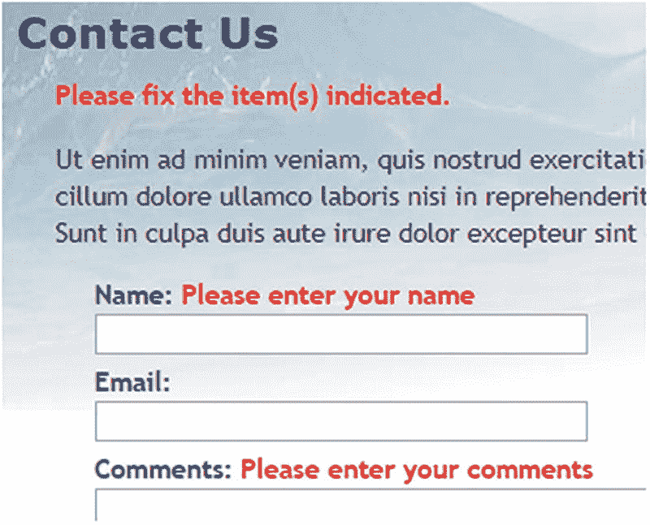

# 让表单活起来

表单是使用 PHP 的核心所在。你使用表单登录受限页面、注册新用户、在线商店下单、在数据库中输入和更新信息、发送反馈……用途不胜枚举。所有这些用途背后遵循相同的原理，因此本章所学知识在大多数 PHP 应用程序中都具有实用价值。为了演示如何处理表单信息，我将向你展示如何收集网站访问者的反馈并将其发送到你的邮箱。

遗憾的是，用户输入可能会使你的网站遭受恶意攻击。在接受表单提交的数据之前，检查数据非常重要。尽管 HTML5 表单元素在现代浏览器中会验证用户输入，但你仍然需要在服务器端检查数据。HTML5 验证有助于合法用户避免提交包含错误的表单，但恶意用户可以轻易绕过浏览器执行的检查。服务器端验证不是可选项，而是必不可少的。本章中的 PHP 解决方案将向你展示如何过滤或阻止任何可疑或危险的内容。没有任何在线应用程序能够完全免疫黑客攻击，但付出少量努力即可抵御除最顽固攻击者之外的所有威胁。同时，在表单不完整或发现错误时，保留用户输入并重新显示也是一个好做法。

这些解决方案构建了一个完整的邮件处理脚本，可用于不同的表单，因此务必按顺序阅读。

在本章中，你将了解以下内容：

- 理解用户输入如何从在线表单传输
- 在不丢失用户输入的情况下显示错误
- 验证用户输入
- 通过电子邮件发送用户输入

## PHP 如何从表单收集信息

虽然 HTML 包含了构建表单所需的所有标签，但它不提供提交表单时的任何处理方法。为此，你需要一个服务器端解决方案，例如 PHP。

Japan Journey 网站包含一个简单的反馈表单（见图 6-1）。其他元素——如单选按钮、复选框和下拉菜单——将在后续添加。



图 6-1. 处理反馈表单是 PHP 最流行的用途之一

首先，让我们看一下表单的 HTML 代码（位于 `ch06` 文件夹的 `contact_01.php` 文件中）：

```html
<form method="post" action="">
    <p>
        <label for="name">名称：</label>
        <input type="text" name="name" id="name">
    </p>
    <p>
        <label for="email">电子邮箱：</label>
        <input type="text" name="email" id="email">
    </p>
    <p>
        <label for="comments">留言：</label>
        <textarea name="comments" id="comments" cols="30" rows="10"></textarea>
    </p>
    <p>
        <input type="submit" name="send" id="send" value="发送消息">
    </p>
</form>
```

前两个 `<input>` 标签和 `<textarea>` 标签的 `name` 和 `id` 属性都设置为相同的值。重复设置的原因是为了可访问性。HTML 使用 `id` 属性将 `<label>` 元素与正确的 `<input>` 元素关联起来。然而，表单处理脚本依赖于 `name` 属性。因此，虽然 `id` 属性在提交按钮中是可选的，但对于你想要处理的每个表单元素，你*必须*使用 `name` 属性。

**注意：** 表单输入元素的 `name` 属性通常不应包含空格。如果要组合多个单词，请使用下划线连接（如果留空格，PHP 会自动处理）。由于本章后续开发的脚本会将 `name` 属性转换为 PHP 变量，因此不要使用连字符或任何在 PHP 变量名中无效的字符。

另外需要注意的两点是开始 `<form>` 标签中的 `method` 和 `action` 属性。`method` 属性决定表单如何发送数据。它可以设置为 `post` 或 `get`。`action` 属性告诉浏览器在点击提交按钮时将数据发送到哪里进行处理。如果该值为空（如此处所示），页面将尝试自行处理表单。然而，在 HTML5 中，空的 `action` 属性是无效的，因此需要修复。

**注意：** 我刻意避免使用任何新的 HTML5 表单特性，如 `type="email"` 和 `required` 属性。这样可以更容易地测试 PHP 服务器端验证脚本。测试完成后，你可以更新表单以使用 HTML5 验证功能。浏览器端的验证主要是为了方便用户，防止提交不完整的信息，因此它是可选的。服务器端验证则绝不可跳过。

### 理解 `post` 和 `get` 之间的区别

演示 `post` 和 `get` 方法之间区别的最佳方式是使用一个真实的表单。如果你完成了上一章，可以继续使用相同的文件。

否则，`ch06` 文件夹中包含了 Japan Journey 网站的完整文件集，其中已整合了第 5 章的所有代码。将 `contact_01.php` 复制到网站根目录并重命名为 `contact.php`。同时将 `ch06/includes` 文件夹中的 `footer.php`、`menu.php` 和 `title.php` 复制到网站根目录的 `includes` 文件夹中。

1. 找到 `contact.php` 中的开始 `<form>` 标签，将 `method` 属性的值从 `post` 改为 `get`，如下所示：

```html
<form method="get" action="">
```

2. 保存 `contact.php` 并在浏览器中加载该页面。在表单中输入你的姓名、电子邮箱地址和简短留言，然后点击发送消息。



3. 查看浏览器地址栏。你应该会看到表单的内容附加在 URL 末尾，如下所示：



如果分解这个 URL，它看起来是这样的：

```text
http://localhost/phpsols-4e/contact.php
?name=David
&email=david%40example.com
&comments=Greetings%21+%3A-%29
&send=Send+message
```

表单提交的数据已被附加到基本 URL 之后，形成以问号开头的**查询字符串**。每个字段和提交按钮的值由表单元素的 `name` 属性标识，后跟等号和已提交的数据。每个输入元素的数据之间用与号（`&`）分隔。URL 不能包含空格或某些字符（如感叹号或笑脸符号），因此浏览器将空格替换为 `+`，并将其他字符编码为十六进制值，这一过程称为 **URL 编码**（有关完整值列表，请参阅 [`www.degraeve.com/reference/urlencoding.php`](http://www.degraeve.com/reference/urlencoding.php) ）。

2.  返回到 `contact.php` 的代码中，将 `method` 改回 `post`，如下所示：

3.  保存 `contact.php` 并在浏览器中重新加载页面。输入另一条消息并点击发送消息。您的消息应该会消失，但不会发生其他任何事情。消息并未丢失，但您尚未进行任何处理。

4.  在 `contact.php` 中，在结束标签 `</form>` 正下方添加以下代码：

如果有任何 `post` 数据被发送，这将显示 `$_POST` 超全局数组的内容。如第 4 章所述，`print_r()` 函数允许您检查数组的内容；`<pre>` 标签仅用于使输出更易于阅读。

5.  保存页面并点击浏览器中的刷新按钮。您很可能会看到类似以下的警告。这告诉您数据将被重新发送，这正是您想要的。确认您希望再次发送信息。





**图 6-2.** `$_POST` 数组使用表单的 `name` 属性来标识每个数据元素

6.  第 6 步的代码现在应该会在表单下方显示您消息的内容，如图 6-2 所示。所有内容都已存储在 PHP 的超全局数组 `$_POST` 中，该数组包含使用 `post` 方法发送的数据。每个表单元素的 `name` 属性被用作数组键，从而可以轻松检索内容。

正如您所见，`get` 方法将数据附加到 URL 后进行发送，而 `post` 方法则通过 HTTP 标头发送数据，因此对用户不可见。某些浏览器将 URL 的最大长度限制为约 2,000 个字符，因此 `get` 方法仅适用于少量数据。`post` 方法可用于发送更大量的数据。默认情况下，PHP 允许最多 8 MB 的 `post` 数据，尽管托管公司可能会设置不同的限制。然而，这两种方法最重要的区别在于它们的预期用途。`get` 方法设计用于无论执行多少次请求都不会在服务器上产生变化的请求。因此，它主要用于数据库搜索；将搜索结果添加书签非常有用，因为所有搜索条件都包含在 URL 中。另一方面，`post` 方法设计用于会导致服务器发生变化的请求。因此，它用于在数据库中插入、更新或删除记录、上传文件或发送电子邮件。我们将在本书后面部分回到 `get` 方法的讨论。本章重点讲解 `post` 方法及其关联的超全局数组 `$_POST`。

## 使用 PHP 超全局变量获取表单数据

`$_POST` 超全局数组包含使用 `post` 方法发送的数据。毫不奇怪，使用 `get` 方法发送的数据位于 `$_GET` 数组中。要访问表单提交的值，只需在 `$_POST` 或 `$_GET` 后面的方括号内，用引号括起表单元素的 `name` 属性，具体取决于表单的 `method` 属性。因此，如果通过 `post` 方法发送，`email` 变为 `$_POST['email']`；如果通过 `get` 方法发送，则变为 `$_GET['email']`。就是这么简单。

您可能会遇到使用 `$_REQUEST` 的脚本，这避免了对 `$_POST` 或 `$_GET` 进行区分的需要。但这不太安全。您应该始终清楚用户信息的来源。`$_REQUEST` 还包含 cookie 的值，因此您无法知道正在处理的是通过 `post` 方法提交的值、通过 URL 传输的值，还是由 cookie 注入的值。始终使用 `$_POST` 或 `$_GET`。旧脚本可能会使用 `$HTTP_POST_VARS` 或 `$HTTP_GET_VARS`，它们与 `$_POST` 和 `$_GET` 含义相同。旧版本已被移除。请改用 `$_POST` 和 `$_GET`。

## 处理和验证用户输入

本章的最终目标是通过电子邮件将 `contact.php` 表单中的输入发送到您的收件箱。使用 PHP 的 `mail()` 函数相对简单。它至少需要三个参数：接收电子邮件的地址、包含主题行的字符串以及包含消息正文的字符串。您通过连接（拼接）输入字段的内容来构建消息正文，将其组合成一个字符串。

大多数互联网服务提供商（ISP）实施的安全措施使得在本地测试环境中测试 `mail()` 函数非常困难，甚至不可能。因此，PHP 解决方案 6-2 至 6-5 侧重于验证用户输入，确保必填字段已填写并显示错误消息，而不是直接跳到使用 `mail()`。实施这些措施可以使您的在线表单更加用户友好和安全。

使用 JavaScript 或 HTML5 表单元素和属性来检查用户输入称为**客户端验证**，因为它发生在用户的计算机（或客户端）上。这很有用，因为它几乎是即时的，可以在无需不必要的服务器往返的情况下向用户提示问题。然而，客户端验证很容易被绕过。恶意用户只需从自定义脚本提交数据，您的检查就会失效。因此，使用 PHP 验证用户输入也至关重要。

> **提示** 单独的客户端验证是不充分的。始终使用 PHP 进行服务器端验证来验证来自外部源的数据。

### 创建可复用的脚本

能够为多个网站复用同一个脚本（可能只需少量编辑）可以极大地节省时间。然而，将输入数据发送到单独的文件进行处理，使得在不丢失用户输入的情况下向用户提示错误变得困难。为了解决这个问题，本章采用的方法是使用所谓的**自处理表单**。

当表单提交时，页面会重新加载，并且一个条件语句会运行处理脚本。如果服务器端验证检测到错误，表单可以在保留用户输入的同时重新显示并附带错误消息。特定于表单的脚本部分将嵌入在 `DOCTYPE` 声明之上。通用、可复用的部分将放在一个单独的文件中，该文件可以包含在任何需要电子邮件处理脚本的页面中。

### PHP 解决方案 6-1：防止自处理表单中的跨站脚本攻击

将`action`属性留空或完全省略时，提交表单数据会重新加载页面。然而，空的`action`属性在 HTML5 中无效。PHP 有一个非常便捷的超全局变量（`$_SERVER['PHP_SELF']`），它包含当前文件的站点根目录相对路径。将其设置为`action`属性的值会自动为自处理表单插入正确的值——但单独使用它会使您的站点暴露于一种名为**跨站脚本攻击**（XSS）的恶意攻击中。本 PHP 解决方案说明了该风险，并展示了如何安全地使用`$_SERVER['PHP_SELF']`。

1.  在浏览器中加载`ch06`文件夹中的`bad_link.php`。它包含一个指向同一文件夹中`form.php`的链接；但底层 HTML 中的链接被故意篡改以模拟 XSS 攻击。

2.  点击该链接。根据您使用的浏览器，您可能会看到目标页面已被阻止（如图 6-3 所示），或显示图 6-4 中的 JavaScript 警告对话框。



图 6-4. 并非所有浏览器都能阻止 XSS 攻击



图 6-3. Google Chrome 会自动阻止可疑的 XSS 攻击

注意：本 PHP 解决方案练习文件中的链接假设它们位于本地主机服务器根目录下的`phpsols-4e/ch06`文件夹中。如有必要，请根据您的测试环境进行调整。

1.  如有必要，关闭 JavaScript 警告对话框，然后右键查看页面源代码。第 10 行应该类似于这样：



`bad_link.php`中的恶意链接在开头的`<form>`标签之后立即注入了一段 JavaScript 代码到页面中。在这个例子中，它是一个无害的 JavaScript 警告；但在真实的 XSS 攻击中，它可能试图窃取 cookie 或其他个人信息。这种攻击将是静默的，用户除非在浏览器地址栏中注意到脚本，否则不会意识到发生了什么。

这种情况发生是因为`form.php`使用`$_SERVER['PHP_SELF']`来生成`action`属性的值。恶意链接将页面位置插入到`action`属性中，关闭了开头的表单标签，然后注入了`<script>`标签，该标签在页面加载时立即执行。

2.  一种简单但有效的防御此类 XSS 攻击的方法是将`$_SERVER['PHP_SELF']`传递给`htmlentities()`函数，如下所示：

```php
<form action="<?= htmlentities($_SERVER['PHP_SELF']); ?>" method="post">
```

这会将`<script>`标签的尖括号转换为其 HTML 实体等价物，从而阻止脚本执行。虽然这种方法有效，但它会在浏览器地址栏中留下恶意 URL，可能导致用户质疑您网站的安全性。我认为更好的方法是在检测到 XSS 时将用户重定向到错误页面。

3.  在`form.php`中，在 DOCTYPE 声明之上创建一个 PHP 代码块，并使用当前文件的站点根目录相对路径定义一个变量，如下所示：

4.  现在将`$currentPage`的值与`$_SERVER['PHP_SELF']`进行比较。如果它们不相同，则使用`header()`函数将用户重定向到错误页面并立即退出脚本，如下所示：

```php
if ($currentPage !== $_SERVER['PHP_SELF']) {
    header('Location: http://localhost/phpsols-4e/ch06/missing.php');
    exit;
}
```

注意：传递给`header()`函数的位置必须是完整的 URL。如果使用文档相对链接，目标地址会附加到恶意链接之后，导致页面无法成功重定向。

1.  使用`$currentPage`作为开头表单标签中`action`属性的值：

```php
<form action="<?= $currentPage; ?>" method="post">
```

```
2.  保存`form.php`，返回到`bad_link.php`，然后再次点击链接。这次您应该会直接被带到`missing.php`。

3.  直接在浏览器中加载`form.php`。它应该能正常加载并按预期工作。

完成的版本位于`ch06`文件夹中的`form_end.php`。名为`bad_link_end.php`的文件链接到完成的版本，如果您只想测试脚本的话。

此技术涉及的代码比简单地将`$_SERVER['PHP_SELF']`传递给`htmlentities()`函数更多；但它的优势在于，如果用户点击了指向您表单的恶意链接，它能无缝地将用户引导至错误页面。显然，错误页面应该链接回您的主菜单。

## PHP 解决方案 6-2：确保必填字段不为空

当必填字段留空时，您不仅无法获得所需信息，而且用户可能永远收不到回复，尤其是在联系方式被省略的情况下。

继续使用本章前面“理解 post 和 get 之间的区别”中的文件。或者，使用`ch06`文件夹中的`contact_02.php`，并从文件名中移除`_02`。

1.  处理脚本使用两个数组：`$errors`和`$missing`，用于存储错误详情以及未填写的必填字段。这些数组将用于控制表单标签旁边错误消息的显示。页面首次加载时不应有任何错误，因此请在`contact.php`顶部的 PHP 代码块中将`$errors`和`$missing`初始化为空数组，如下所示：

2.  仅当表单已提交时，电子邮件处理脚本才应运行。使用条件语句检查超全局变量`$_SERVER['REQUEST_METHOD']`的值。如果它是`POST`（全部大写），则表示表单已使用`post`方法提交。将以下以粗体显示的代码添加到页面顶部的 PHP 代码块中。

提示：检查`$_SERVER['REQUEST_METHOD']`的值是否为`POST`是一个通用条件，可以用于任何表单，无论提交按钮的名称是什么。

1.  虽然您还不会实际发送电子邮件，但请定义两个变量来存储电子邮件的目标地址和主题行。以下代码放在上一步创建的条件语句内部：

```php
if ( $_SERVER['REQUEST_METHOD'] == 'POST') {

    // email processing script

    $to = 'david@example.com'; // use your own email address

    $subject = 'Feedback from Japan Journey';

}
```

2.  接下来，创建两个数组：一个列出表单中每个字段的`name`属性，另一个列出所有*必填*字段。为了演示，将`email`字段设为可选，因此只有`name`和`comments`字段是必填的。在条件语句块内部，紧跟在定义主题行的代码之后添加以下代码：

```php
$subject = 'Feedback from Japan Journey';

// list expected fields

$expected = ['name', 'email', 'comments'];

// set required fields

$required = ['name', 'comments'];

}
```

提示：为什么`$expected`数组是必需的？这是为了防止攻击者将其他变量注入到`$_POST`数组中，试图覆盖您的默认值。通过只处理您期望的变量，您的表单会安全得多。任何无关的值都会被忽略。

1.  接下来的代码段不特定于该表单，因此应将其放入一个外部文件中，以便在任何邮件处理脚本中引用。创建一个新的 PHP 文件，命名为`processmail.php`，存放在`includes`文件夹中。然后在`contact.php`中，紧接上一步输入的代码之后引入它，如下所示：

```php
$required = ['name', 'comments'];
require './includes/processmail.php';
}
```

2.  `processmail.php`中的代码首先检查`$_POST`变量中是否有必填字段留空。清除编辑器插入的任何默认代码，并将以下内容添加到`processmail.php`：

```php
foreach ($_POST as $key => $value) {
    // strip whitespace from $value if not an array
    if (!is_array($value)) {
        $value = trim($value);
    }
    if (!in_array($key, $expected)) {
        // ignore the value, it's not in $expected
        continue;
    }
    if (in_array($key, $required) && empty($value)) {
        // required value is missing
        $missing[] = $key;
        $$key = "";
        continue;
    }
    $$key = $value;
}
```

这个`foreach`循环通过去除文本字段的首尾空白，并将字段内容赋值给一个简化名称的变量来处理`$_POST`数组。因此，`$_POST['email']`变成了`$email`，依此类推。它还会检查必填字段是否留空，如果留空则将其添加到`$missing`数组中，并将相关变量设置为空字符串。

`$_POST`数组是一个关联数组，因此循环将当前元素的键和值分别赋值给`$key`和`$value`。循环开始使用`is_array()`函数和逻辑非运算符（`!`）检查当前值是否不是一个数组。如果不是，则使用`trim()`函数去除首尾空白，并将其重新赋值给`$value`。去除首尾空白可以防止有人通过多次按空格键来绕过必填字段的填写。

> **注意**

> 当前表单只有文本输入字段，但后续会扩展为包含`<select>`和复选框元素，这些元素会以数组形式提交数据。之所以需要检查当前元素的值是否为数组，是因为将数组传递给`trim()`函数会触发错误。

下一个条件语句检查当前键是否不在`$expected`数组中。如果不在，`continue`关键字会强制循环停止处理当前元素并跳转到下一个元素。因此，所有不在`$expected`数组中的项都会被忽略。

接下来，我们检查当前数组键是否在`$required`数组中，并且它是否没有值。如果条件为真，则该键被添加到`$missing`数组中，并动态创建一个基于该键名的变量，其值设置为空字符串。请注意，在下面这行代码中，`$$key`以两个美元符号开头：

```php
$$key = "";
```

这意味着它是一个可变变量（参见第[4]章中的“动态创建新变量”）。因此，如果`$key`的值是“name”，那么`$$key`就变成了`$name`。同样，`continue`会使循环进入下一个元素。

但是，如果一直执行到循环的最后一行，我们就知道正在处理一个需要被处理的元素，因此会基于该键名动态创建一个变量，并将当前值赋给它。

1.  保存`processmail.php`。稍后你还会向其中添加更多代码，但现在我们先转向`contact.php`的主体部分。表单起始标签中的`action`属性是空的。为本地测试目的，只需将其值设置为当前页面的名称：

2.  如果有任何字段缺失，你需要显示一条警告。在页面内容的顶部，`<h2>`标题和第一个段落之间添加一个条件语句，如下所示：

```php
if ($missing || $errors) {
    echo '<p class="warning">Please fix the item(s) indicated.</p>';
}
```

这会检查`$missing`和`$errors`，你在步骤 1 中将它们初始化为空数组。如第[4]章中的“PHP 中的真值判断”所述，空数组被视为`false`，因此当页面首次加载时，条件语句内部的段落不会显示。然而，如果表单提交时某个必填字段未被填写，其名称会被添加到`$missing`数组中。包含至少一个元素的数组被视为`true`。`||`表示“或”，因此如果某个必填字段留空或发现错误，这个警告段落将会显示。（`$errors`数组将在 PHP 解决方案 6-4 中发挥作用。）

3.  为了确保到目前为止一切正常，保存`contact.php`并在浏览器中正常加载它（不要点击刷新按钮）。警告消息不会显示。在不填写任何字段的情况下点击“发送消息”。现在你应该能看到关于缺失项目的消息，如下图所示。


```



**图 6-5.** 通过验证用户输入，你可以显示关于必填字段的警告。

1.  为了在每个缺失的必填字段旁边显示合适的消息，使用一个 PHP 条件语句在 `<label>` 标签内插入一个 `<span>`，如下所示：

    ```
    Name:

    Please enter your name

    ```

    该条件使用 `in_array()` 函数来检查 `$missing` 数组是否包含值 `name`。如果包含，则显示 `<span>`。`$missing` 在脚本顶部被定义为一个空数组，因此当页面首次加载时，该 span 不会显示。

2.  为 `email` 和 `comments` 字段插入类似的警告，如下所示：

    ```
    Email:

    Please enter your email address

    Comments:

    Please enter your comments

    ```

    PHP 代码是相同的，区别仅在于你在 `$missing` 数组中查找的值。该值与表单元素的 `name` 属性相同。

3.  保存 `contact.php` 并再次测试页面，首先在所有字段中不输入任何内容。表单标签应该如图 6-5 所示。

    尽管你为 `email` 字段的 `<label>` 添加了警告，但它没有显示，因为 `email` 尚未被添加到 `$required` 数组中。因此，`processmail.php` 中的代码不会将其添加到 `$missing` 数组中。

4.  将 `email` 添加到 `comments.php` 顶部代码块中的 `$required` 数组里，如下所示：

    ```
    $required = ['name', 'comments', 'email'];
    ```

5.  在不填写任何字段的情况下再次点击“发送消息”。这次，每个标签旁边都会显示警告消息。

6.  在“姓名”字段中键入你的名字。在“电子邮件”和“评论”字段中，仅多次按空格键，然后点击“发送消息”。“姓名”字段旁边的警告消息消失了，但另外两个警告消息仍然保留。`processmail.php` 中的代码会去除文本字段的空白，因此它会拒绝通过输入一系列空格来绕过必填字段的尝试。

如果遇到任何问题，请将你的代码与 `ch06` 文件夹中的 `contact_03.php` 和 `includes/processmail_01.php` 进行对比。

更改必填字段所需做的全部工作就是修改 `$required` 数组中的名称，并在表单内相应输入元素的 `<label>` 标签中添加合适的提示。这很容易完成，因为你总是使用表单输入元素的 `name` 属性。