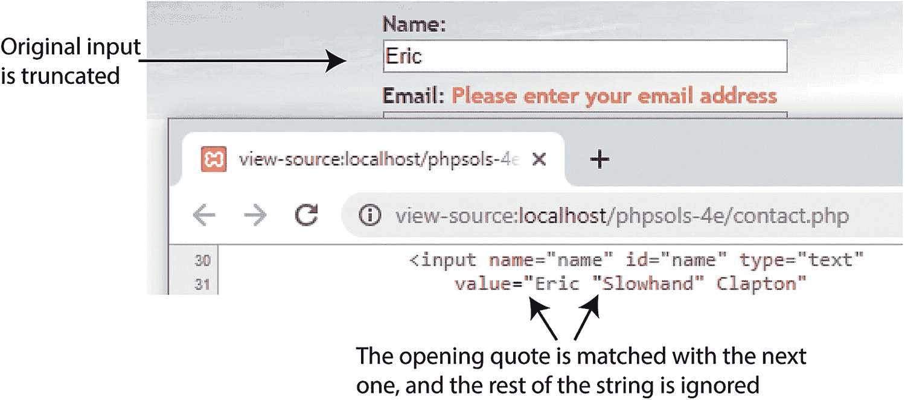
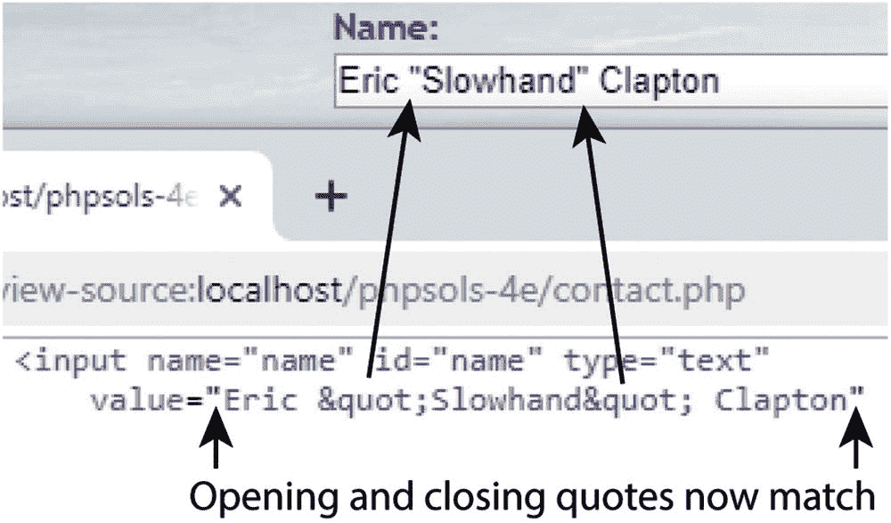

# 在表单未完成时保留用户输入

假设你花了 10 分钟填写一个表单，点击提交按钮后，却收到提示说某个必填字段缺失。如果不得不重新填写所有字段，那会让人非常恼火。由于每个字段的内容都保存在 `$_POST` 数组中，因此在发生错误时重新显示这些内容就变得容易了。

## PHP 方案 6-3：创建粘性表单字段

该 PHP 方案展示了如何使用条件语句从 `$_POST` 数组中提取用户输入，并在文本输入字段和文本区域中重新显示这些内容。

继续使用之前相同的文件进行操作。或者，你也可以使用 `ch06` 文件夹中的 `contact_03.php` 和 `includes/processmail_01.php`。

1. 页面首次加载时，你不希望输入字段中显示任何内容，但如果必填字段缺失或出现错误，你*确实*希望重新显示这些内容。关键在于：如果 `$missing` 或 `$errors` 数组包含任何值，则应重新显示每个字段的内容。你通过 `<input>` 标签的 `value` 属性为文本输入字段设置默认文本，因此需像这样修改 `name` 字段的 `<input>` 标签：

```
>
```

花括号内的这行代码包含引号和句点的组合，可能会让你感到困惑。首先要明白，整行只有一个分号——在末尾——因此 `echo` 命令应用于整行。正如第 3 章所解释的，句点被称为连接运算符，用于连接字符串和变量。你可以将这一行其余部分分解为三个部分，如下所示：

- `'value="' .`
- `htmlentities($name)`
- `. '"'`

第一部分输出 `value="` 作为文本，并使用连接运算符将其与下一部分连接，后者将 `$name` 传递给一个名为 `htmlentities()` 的函数。我稍后会解释为什么这样做是必要的。第三部分再次使用连接运算符连接最终输出，该输出仅包含一个双引号。因此，如果 `$missing` 或 `$errors` 包含任何值，并且 `$_POST['name']` 包含 `Joe`，那么 `<input>` 标签内最终会变成：

```
<input type="text" name="name" value="Joe" />
```

`$name` 变量包含原始用户输入，该输入通过 `$_POST` 数组传递。你在 PHP 方案 6-2 的 `processmail.php` 中创建的 `foreach` 循环处理 `$_POST` 数组，并将每个元素赋值给一个同名的变量。这使你能够简单地将 `$_POST['name']` 作为 `$name` 来访问。

那么，为什么我们需要 `htmlentities()` 函数呢？顾名思义，该函数将某些字符转换为其等效的 HTML 字符实体。这里我们关心的是双引号。假设埃里克·“慢手”·克莱普顿决定通过表单发送反馈。如果你单独使用 `$name`，图 6-6 显示了当必填字段被省略且你不使用 `htmlentities()` 时会发生的情况。



**图 6-6** 在重新显示表单字段之前，引号需要特殊处理

然而，将 `$_POST` 数组元素的内容传递给 `htmlentities()` 后，字符串中间的双引号会被转换为 `&quot;`。如图 6-7 所示，内容不再被截断。



**图 6-7** 在显示前将值传递给 `htmlentities()` 解决了问题

这样做的妙处在于，当表单重新提交时，字符实体 `&quot;` 会被转换回双引号。因此，在发送电子邮件之前无需进一步转换。

> **注意**  
> 如果 `htmlentities()` 导致文本乱码，你可以通过向该函数传递第二个和第三个可选参数，直接在脚本中设置编码。例如，要将编码设置为简体中文，请使用 `htmlentities($name, ENT_COMPAT, 'GB2312')`。有关详细信息，请参见 [`www.php.net/manual/en/function.htmlentities.php`](http://www.php.net/manual/en/function.htmlentities.php) 上的文档。

2. 以相同方式编辑 `email` 字段，使用 `$email` 代替 `$name`。

3. `comments` 文本区域需要稍微不同的处理方式，因为 `<textarea>` 标签没有 `value` 属性。你必须将 PHP 代码块放在文本区域的开闭标签之间，如下所示（新代码以粗体显示）：

```
<textarea name="comments" id="comments"><?php echo htmlentities($comments); ?></textarea>
```

将 PHP 开闭标签紧贴 `<textarea>` 标签放置非常重要。如果不这样做，文本区域内会出现多余的空白。

4. 保存 `contact.php` 并在浏览器中测试页面。如果省略了任何必填字段，表单将显示原始内容以及任何错误消息。

你可以使用 `ch06` 文件夹中的 `contact_04.php` 检查代码。

> **警告**  
> 使用此技术会阻止表单的“重置”按钮重置已被 PHP 脚本修改的任何字段，因为它显式地设置了每个字段的 `value` 属性。

## 过滤潜在攻击

一种称为**电子邮件头部注入**的特别恶意的攻击试图将在线表单转变为垃圾邮件中继。攻击者试图诱使你的脚本发送带有多个副本的 HTML 电子邮件。如果你在可传递给 `mail()` 函数的第四个参数的附加头部中包含了未过滤的用户输入，这种情况就有可能发生。通常的做法是将用户的电子邮件地址添加为 `Reply-to` 头部。如果你在提交的值中检测到空格、换行符、回车符或任何字符串 “Content-type:”、“Cc:” 或 “Bcc:”，则说明你正成为攻击目标，因此应阻止该消息。

### PHP 方案 6-4：阻止包含可疑内容的电子邮件地址

该 PHP 方案检查用户输入的电子邮件地址中是否存在可疑内容。如果检测到，则将一个布尔变量设置为 `true`。稍后这将用于阻止邮件发送。

继续使用之前相同的页面进行操作。或者，你也可以使用 `ch06` 文件夹中的 `contact_04.php` 和 `includes/processmail_01.php`。

1. 为了检测可疑短语，我们将使用搜索模式或**正则表达式**。在现有 `foreach` 循环之前，向 `processmail.php` 顶部添加以下代码：

```
// pattern to locate suspect phrases
$pattern = '/[\s\r\n]|Content-Type:|Bcc:|Cc:/i';
foreach ($_POST as $key => $value) {
```

分配给 `$pattern` 的字符串将用于执行不区分大小写的搜索，搜索目标为以下任意一项：空格、回车符、换行符、“Content-Type:”、“Bcc:” 或 “Cc:”。该字符串的编写格式称为 Perl 兼容正则表达式（PCRE）。搜索模式包含在一对正斜杠中，最后一个斜杠后的 `i` 使模式不区分大小写。

> **提示**  
> 正则表达式是用于匹配文本模式的极其强大的工具。诚然，它们并不容易学习；但如果你认真对待使用 PHP 和 JavaScript 等编程语言，这是一项基本技能。请参阅 Jörg Krause 所著的《正则表达式入门》（Apress，2017 年，ISBN 978-1-4842-2508-0）。该书主要面向 JavaScript 开发者，但 JavaScript 和 PHP 之间在实现上只有细微差别。基本语法是相同的。

2. 现在，你可以使用存储在 `$pattern` 中的 PCRE 来检测提交的电子邮件地址中是否存在任何可疑的用户输入。在第 1 步的 `$pattern` 变量之后立即添加以下代码：


```php
// 检查提交的电子邮件地址
$suspect = preg_match($pattern, $_POST['email']);
```

`preg_match()`函数将第一个参数传递的正则表达式与第二个参数中的值（本例中为电子邮件字段的值）进行比较。如果找到匹配项，则返回`true`。因此，如果发现任何可疑内容，`$suspect`将为`true`。但如果没有匹配项，则为`false`。

2. 如果在电子邮件地址中检测到可疑内容，则无需进一步处理`$_POST`数组。将处理`$_POST`变量的代码包装在如下条件语句中：

```php
if (!$suspect) {
    foreach ($_POST as $key => $value) {
        // 如果 $value 不是数组，则去除空格
        if (!is_array($value)) {
            $value = trim($value);
        }
        if (!in_array($key, $expected)) {
            // 忽略该值，它不在 $expected 中
            continue;
        }
        if (in_array($key, $required) && empty($value)) {
            // 缺少必需的值
            $missing[] = $key;
            $$key = "";
            continue;
        }
        $$key = $value;
    }
}
```

仅在`$suspect`不为`true`时处理`$_POST`数组中的变量。

不要忘记额外的花括号来关闭条件语句。

3. 编辑`contact.php`中`<h2>`标题后的 PHP 块，在表单上方添加一条新的警告消息，如下所示：

```html
<h2>联系我们</h2>
<p>抱歉，您的邮件无法发送。请稍后重试。</p>
<p>请修正标出的项目。</p>
```

这将设置一个新条件，该条件因被首先考虑而优先于原始警告消息。它检查`$_POST`数组是否包含任何元素（即表单已提交），以及`$suspect`是否为`true`。该警告故意采用中性语气。挑衅攻击者是毫无意义的。

4. 保存`contact.php`，并通过在电子邮件字段中键入任何可疑内容来测试表单。您应该会看到新的警告消息，但您的输入将不会被保留。

您可以将您的代码与`ch06`文件夹中的`contact_05.php`和`includes/processmail_02.php`进行核对。

## 发送电子邮件

在进一步操作之前，有必要解释一下 PHP`mail()`函数的工作原理，因为它将帮助您理解处理脚本的其余部分。

PHP`mail()`函数最多接受五个参数，所有参数均为字符串，如下所示：

* 收件人地址
* 主题行
* 消息正文
* 其他电子邮件头列表（可选）
* 附加参数（可选）

第一个参数中的电子邮件地址可以采用以下任一格式：

```text
'user@example.com'
'Some Guy <user@example.com>'
```

要发送到多个地址，请使用如下逗号分隔的字符串：

```text
'user@example.com, another@example.com, Some Guy <another@example.com>'
```

消息正文必须作为单个字符串呈现。这意味着您需要从`$_POST`数组中提取输入数据并格式化消息，添加标签以标识每个字段。默认情况下，`mail()`函数仅支持纯文本。换行必须同时使用回车符和换行符。还建议将行长度限制为不超过 78 个字符。尽管听起来很复杂，但您可以使用大约 20 行 PHP 代码自动构建消息正文，您将在 PHP 解决方案 6-6 中看到这一点。添加其他电子邮件头将在下一节中详细介绍。

许多托管公司现在要求提供第五个参数。它确保电子邮件由受信任的用户发送，并且通常由您自己的电子邮件地址前面加上`-f`（中间没有空格）组成，全部用引号括起来。请查看您托管公司的说明，以了解是否需要此参数以及它应采用的确切格式。

> **警告**
> 切勿将用户输入合并到`mail()`函数的第五个参数中，因为它可用于在 Web 服务器上执行任意脚本。

## 安全地使用额外的电子邮件头

您可以在[`www.faqs.org/rfcs/rfc2076`](http://www.faqs.org/rfcs/rfc2076)找到电子邮件头的完整列表，但一些最著名和最有用的头使您能够将电子邮件副本发送到其他地址（抄送和密送）或更改编码。除最后一个头外，每个新头都必须位于由回车符和换行符终止的单独行上。这意味着在双引号字符串中使用`\r`和`\n`转义序列。

> **提示**
> 格式化额外头的一种便捷方法是将每个头定义为单独的数组元素，然后使用`implode()`函数将它们与双引号中的`"\r\n"`连接在一起。

默认情况下，`mail()`使用 Latin1 (ISO-8859-1)编码，该编码不支持重音字符。如今的网页编辑器经常使用 Unicode (UTF-8)，它支持大多数书面语言，包括欧洲语言中常用的重音符号，以及非字母文字，如中文和日语。为确保电子邮件消息不会乱码，请使用`Content-Type`头将编码设置为 UTF-8，如下所示：

```php
$headers[] = "Content-Type: text/plain; charset=utf-8";
```

您还需要在网页`<head>`部分的`<meta>`标签中添加 UTF-8 作为`charset`属性，如下所示：

```html
<meta charset="utf-8">
```

假设您想要向其他部门发送副本，以及一份不希望其他人看到的副本。通过`mail()`发送的电子邮件通常被标识为来自`nobody@yourdomain`（或任何分配给 Web 服务器的用户名），因此添加一个更友好的“发件人”地址是个好主意。以下是构建这些额外头的方法，最后使用`implode()`连接它们：

```php
$headers[] = 'From: Japan Journey <nobody@example.com>';
$headers[] = 'Cc: sales@example.com, finance@example.com';
$headers[] = 'Bcc: secretplanning@example.com';
$headers = implode("\r\n", $headers);
```

`implode()`函数通过用作为第一个参数提供的字符串连接每个数组元素，将数组转换为字符串。因此，这将返回`$headers`数组作为一个字符串，每个数组元素之间带有回车符和换行符。

在构建了您想要使用的头集之后，将包含它们的变量作为第四个参数传递给`mail()`，如下所示（假设目标地址、主题和消息正文已经存储在变量中）：

```php
$mailSent = mail($to, $subject, $message, $headers);
```

像这样硬编码的额外头没有安全风险，但任何来自用户输入的内容在使用前都必须进行过滤。最大的危险来自要求用户提供电子邮件地址的文本字段。一种广泛使用的技术是将用户的电子邮件地址合并到`From`或`Reply-To`头中，这使得您可以通过单击电子邮件程序中的“回复”按钮直接回复传入的邮件。这非常方便，但攻击者经常试图在电子邮件输入字段中塞入大量虚假头。之前的 PHP 解决方案消除了攻击者最常使用的头，但在将电子邮件地址合并到额外头之前，我们需要进一步检查该电子邮件地址。

> **警告**
> 尽管电子邮件字段是攻击者的主要目标，但如果允许用户更改目标地址和主题行的值，它们都很容易受到攻击。用户输入应始终视为可疑。始终硬编码目标地址和主题行。或者，提供一个可接受值的下拉菜单，并将提交的值与相同值的数组进行核对。


