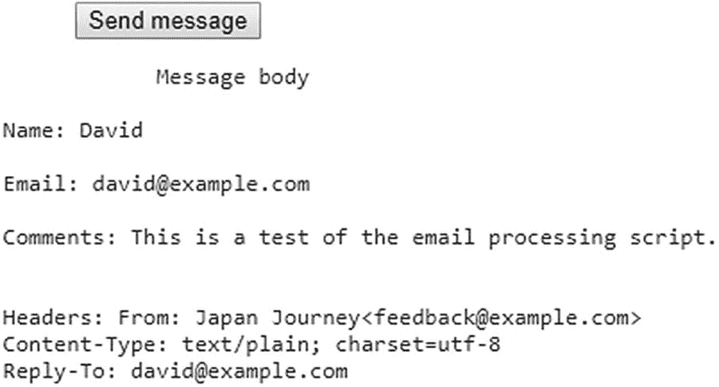
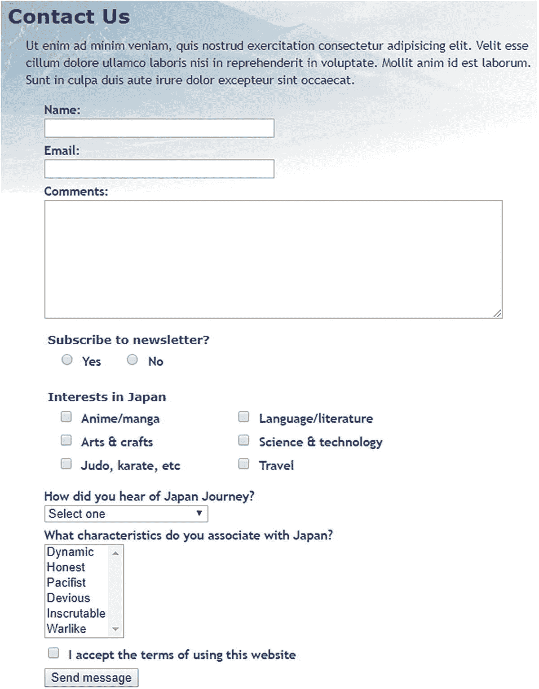

# PHP 方案 6-6：构建邮件正文并发送邮件

许多 PHP 教程展示了如何像这样手动构建邮件正文：

```php
$message = "Name: $name\r\n\r\n";
$message .= "Email: $email\r\n\r\n";
$message .= "Comments: $comments";
```

这为每个字段的输入添加了标签来标识来源，并在每项之间插入了两个回车换行符。对于字段数量较少的情况，这没问题，但随着字段增多，很快就会变得繁琐。只要你为表单字段赋予了有意义的 `name` 属性，就可以使用 `foreach` 循环自动构建邮件正文，这也是本 PHP 方案采用的方法。

继续使用之前相同的文件进行处理。或者，使用 `ch06` 文件夹中的 `contact_06.php` 和 `includes/processmail_03.php` 文件。

1. 在 `processmail.php` 脚本的底部添加以下代码：

```php
$mailSent = false;
```

这会初始化一个变量，用于在邮件发送成功后重定向到感谢页面。在你知道 `mail()` 函数成功执行之前，需要将其设置为 `false`。

2. 现在，立即在其后添加构建邮件正文的代码：

```php
// 仅当无可疑内容、无缺失必填字段且无错误时继续执行
if (!$suspect && !$missing && !$errors) {
    // 初始化 $message 变量
    $message = "";
    // 遍历 $expected 数组
    foreach($expected as $item) {
        // 将当前项的值赋给 $val
        if (isset($$item) && !empty($$item)) {
            $val = $$item;
        } else {
            // 如果没有值，则赋值为 'Not selected'
            $val = 'Not selected';
        }
        // 如果是数组，则展开为逗号分隔的字符串
        if (is_array($val)) {
            $val = implode(', ', $val);
        }
        // 将标签中的下划线替换为空格
        $item = str_replace('_', ' ', $item);
        // 将标签和值添加到邮件正文
        $message .= ucfirst($item).": $val\r\n\r\n";
    }
    // 限制每行长度为 70 个字符
    $message = wordwrap($message, 70);
    // 将邮件头格式化为单个字符串
    $headers = implode("\r\n", $headers);
    $mailSent = true;
}
```

这段代码首先检查 `$suspect`、`$missing` 和 `$errors` 是否都为 `false`。如果是，则通过遍历 `$expected` 数组来构建邮件正文，并将结果以一系列标签/值对的形式存储在 `$message` 中。

其工作原理的关键在于以下条件语句：

```php
if (isset($$item) && !empty($$item)) {
    $val = $$item;
}
```

这是使用可变变量的另一个例子（参见第 4 章的“动态创建新变量”）。每次循环运行时，`$item` 都包含 `$expected` 数组中当前元素的值。第一个元素是 `name`，因此 `$$item` 动态创建了一个名为 `$name` 的变量。实际上，这个条件语句等同于：

```php
if (isset($name) && !empty($name)) {
    $val = $name;
}
```

在下一轮循环中，`$$item` 创建了一个名为 `$email` 的变量，以此类推。

> **警告**
>
> 此脚本仅从 `$expected` 数组中的元素构建邮件正文。为了使其正常工作，你必须将所有表单字段的名称都列在 `$expected` 数组中。

如果某个字段未标记为必填且留空，其值将被设为“未选择”。该代码还会处理来自多选元素（例如复选框组和 `<select>` 列表）的值，这些值会以 `$_POST` 数组的子数组形式进行传输。`implode()` 函数会将这些子数组转换为逗号分隔的字符串。每个标签均源自 `$expected` 数组当前元素中输入字段的 `name` 属性。`str_replace()` 的第一个参数是下划线。如果在 `name` 属性中找到下划线，则将其替换为第二个参数——一个由单个空格组成的字符串。随后，`ucfirst()` 会将首字母转换为大写。请注意，`str_replace()` 的第三个参数是 `$item`（带单个美元符号），因此这次它是一个普通变量，而非可变变量。它包含来自 `$expected` 数组的当前值。将邮件正文合并为单个字符串后，`wordwrap()` 函数会将行长度限制为 70 个字符。邮件头通过 `implode()` 函数格式化为单个字符串，各邮件头之间以回车符和换行符分隔。

发送邮件的代码仍有待添加，但出于测试目的，`$mailSent` 已被设置为 `true`。

1. 保存 `processmail.php`。在 `contact.php` 底部找到以下代码块：

   将其更改为：

   这会检查表单是否已提交且邮件是否准备就绪。然后显示 `$message` 和 `$headers` 中的值。这两个值都传递给 `htmlentities()`，以确保它们在浏览器中正确显示。

2. 保存 `contact.php`，并通过输入姓名、电子邮件地址和简短评论来测试表单。点击“发送消息”后，你应在页面底部看到邮件正文和邮件头的显示内容，如图 6-8 所示。

   

   图 6-8. 验证邮件正文和邮件头格式是否正确

   假设邮件正文和邮件头在页面底部正确显示，你就可以添加发送邮件的代码了。如有必要，请对照 `ch06` 文件夹中的 `contact_07.php` 和 `includes/processmail_04.php` 检查代码。

3. 在 `processmail.php` 中，添加发送邮件的代码。找到以下行：

```php
$mailSent = true;
```

   将其更改为：

```php
$mailSent = mail($to, $subject, $message, $headers);
if (!$mailSent) {
    $errors['mailfail'] = true;
}
```

   这将目标地址、主题行、邮件正文和邮件头传递给 `mail()` 函数。如果成功将电子邮件交给 Web 服务器的邮件传输代理（MTA），该函数返回 `true`。如果失败，`$mailSent` 会被设为 `false`，条件语句会向 `$errors` 数组添加一个元素，以便在重新显示表单时保留用户的输入。

4. 在 `contact.php` 顶部的 PHP 代码块中，紧跟在包含 `processmail.php` 的命令之后，添加以下条件语句：

```php
require './includes/processmail.php';
if ($mailSent) {
    header('Location: http://www.example.com/thank_you.php');
    exit;
}
}
?>
```

   你需要在远程服务器上测试此操作，因此请将 `www.example.com` 替换为你自己的域名。这会检查 `$mailSent` 是否为 `true`。如果是，`header()` 函数会重定向到 `thank_you.php`，这是一个确认消息已发送的页面。下一行的 `exit` 命令确保页面重定向后脚本终止。

   `ch06` 文件夹中有一个 `thank_you.php` 副本。

5. 如果 `$mailSent` 为 `false`，则会重新显示 `contact.php`；你需要警告用户消息无法发送。编辑 `<h2>` 标题后的条件语句，如下所示：

```php
Contact Us
Sorry, your mail could not be sent. . . .
```

   原始条件和新增条件已用括号括起来，因此每对条件会被分别考虑。如果表单已提交并且发现了可疑短语，*或者*表单已提交且 `$errors['mailfail']` 已被设置，则会显示消息无法发送的警告。

6. 删除 `contact.php` 底部显示邮件正文和邮件头的代码块（包括 `<pre>` 标签）。

7. 在本地进行测试很可能会显示感谢页面，但邮件永远不会到达。这是因为大多数测试环境没有 MTA。即使你设置了一个，大多数邮件服务器也会拒绝来自无法识别来源的邮件。请将`contact.php`及所有相关文件（包括`processmail.php`和`thank_you.php`）上传到你的远程服务器，并在那里测试联系表单。不要忘记`processmail.php`需要放在名为`includes`的子文件夹中。

   你可以对照`ch06`文件夹中的`contact_08.php`和`includes/processmail_05.php`检查代码。

### 对 `mail()` 进行故障排除

需要理解的是，`mail()`并非一个电子邮件程序。PHP 的职责在将地址、主题、消息和邮件头传递给 MTA 后即告结束。它无法知晓电子邮件是否送达预期目的地。通常情况下，邮件会即时到达，但网络堵塞可能导致延迟数小时甚至一两天。

如果你从`contact.php`发送消息后被重定向到感谢页面，但收件箱中并未收到任何内容，请检查以下事项：

-   消息是否被垃圾邮件过滤器拦截？

-   是否检查了存储在`$to`中的目标地址？尝试使用一个备用电子邮件地址，看看是否有所区别。

-   是否在`From`邮件头中使用了真实地址？使用虚假或无效地址很可能会导致邮件被拒绝。请使用与你的 Web 服务器属于同一域的有效地址。

-   向你的托管服务商咨询，确认`mail()`的第五个参数是否为必需。如果是，它通常应为由`-f`后跟你的电子邮件地址组成的字符串。例如，`david@example.com`变为`'-fdavid@example.com'`。

如果仍然无法从`contact.php`收到消息，请创建一个包含以下脚本的文件：

```php
<?php
ini_set('display_errors', '1');
$mailSent = mail('you@example.com', 'PHP mail test', 'This is a test email');
if ($mailSent) {
    echo 'Mail sent';
} else {
    echo 'Failed';
}
```

将`you@example.com`替换为你自己的电子邮件地址。将该文件上传到你的网站，并在浏览器中加载页面。

如果你看到关于缺少`From`邮件头的错误消息，请向`mail()`函数添加一个作为第四个参数，如下所示：

```php
$mailSent = mail('you@example.com', 'PHP mail test', 'This is a test email',
'From: me@example.com');
```

通常，最好使用与第一个参数中的目标地址不同的地址。

如果你的托管服务商要求提供第五个参数，请按如下方式调整代码：

```php
$mailSent = mail('you@example.com', 'PHP mail test', 'This is a test email', null,
'-fme@example.com');
```

### 使用第五个参数

通常情况下，使用第五个参数可以替代提供 `From` 标头的需求，因此使用 `null`（不加引号）作为第四个参数表示它没有值。如果你看到“邮件已发送”但没有收到邮件，或者尝试所有五个参数后看到“失败”，请咨询你的托管公司寻求建议。如果你从该脚本收到了测试邮件，但未从 `contact.php` 收到，则说明代码中存在错误，或者你忘记上传 `processmail.php`。临时开启错误显示（如第 3 章“为什么我的页面是空白的？”中所述），以检查 `contact.php` 是否能找到 `processmail.php`。

> **提示**：我曾在一所英国大学任教，当时无法弄清为什么学生们的邮件无法送达，尽管他们的代码完美无缺。结果发现是 IT 部门禁用了 Sendmail（MTA）以防止服务器被用于发送垃圾邮件！

### 处理多项选择表单元素

`contact.php` 中的表单仅使用了文本输入字段和文本区域。要成功地处理表单，你还需要了解如何处理多项选择元素，即：

- 单选按钮

- 复选框

- 下拉选项菜单

- 多项选择列表

它们背后的原理与你一直在使用的文本输入字段相同：表单元素的 `name` 属性被用作 `$_POST` 数组中的键。然而，存在一些重要的区别：

- 复选框组和多项选择列表将选中的值存储为数组，因此对于这些类型的输入，你需要在 `name` 属性的末尾添加一对空的方括号。例如，对于一个名为 `interests` 的复选框组，每个 `<input>` 标签中的 `name` 属性应为 `name="interests[]"`。如果省略方括号，则只有最后选中的项会通过 `$_POST` 数组传输。

- 复选框组或多项选择列表中选中项的值会作为 `$_POST` 数组的子数组进行传输。PHP 解决方案 6-6 中的代码会自动将这些子数组转换为逗号分隔的字符串。然而，当将表单用于其他目的时，你需要从子数组中提取值。你将在后续章节中了解如何操作。

- 如果未选中任何值，单选按钮、复选框和多项选择列表*不会*包含在 `$_POST` 数组中。因此，在处理表单时，在尝试访问它们的值之前，务必使用 `isset()` 检查它们是否存在。

本章其余 PHP 解决方案展示了如何处理多项选择表单元素。我不会详细讲解每一步，而是只强调重点。在研读本章剩余内容时，请牢记以下几点：

- 处理这些元素依赖于 `processmail.php` 中的代码。

- 你必须将每个元素的 `name` 属性添加到 `$expected` 数组中，以便将其包含在邮件正文中。

- 若要使某个字段为必填项，请将其 `name` 属性添加到 `$required` 数组中。

- 如果非必填字段留空，`processmail.php` 中的代码会将其值设置为“未选择”。

图 6-9 显示了 `contact.php` 在原始设计基础上添加了每种输入类型后的效果。



*图 6-9. 包含多项选择表单元素示例的反馈表单*

> **提示**：HTML5 表单输入元素都使用 `name` 属性，并将值作为文本或 `$_POST` 数组的子数组发送，因此你应该能够相应地调整代码。

### PHP 解决方案 6-7：处理单选按钮组

单选按钮组允许你只选择一个值。虽然在 HTML 标记中设置默认值很常见，但并非必须。此 PHP 解决方案展示了如何处理这两种情况。

1. 处理单选按钮的简单方法是将其中的一个设置为默认值。由于始终有值被选中，单选按钮组总是会包含在 `$_POST` 数组中。

带有默认值的单选按钮组代码类似如下（`name` 属性和 PHP 代码以粗体突出显示）：

```html
    订阅新闻通讯？

>
    是
    >
    否
```

单选按钮组的所有成员共享同一个 `name` 属性。由于只能选择一个值，因此 `name` 属性*不*以一对空方括号结尾。

与“是”按钮相关的条件语句检查 `$_POST` 以查看表单是否已提交。如果已提交且 `$_POST['subscribe']` 的值为“是”，则将 `checked` 属性添加到 `<input>` 标签中。

在“否”按钮中，条件语句使用了 `||`（或）。第一个条件是 `!$_POST`，当表单未提交时为 `true`。如果为 `true`，则在页面首次加载时将 `checked` 属性添加为默认值。如果为 `false`，则表示表单已提交，因此会检查 `$_POST['subscribe']` 的值。

2. 当单选按钮没有默认值时，它不会包含在 `$_POST` 数组中，因此不会被 `processmail.php` 中构建 `$missing` 数组的循环检测到。为了确保单选按钮元素包含在 `$_POST` 数组中，你需要在表单提交后测试其是否存在。如果未包含，则需要将其值设置为空字符串，如下所示：

```php
    $required = ['name', 'comments', 'email', 'subscribe'];
    // 为可能不存在的变量设置默认值
    if (!isset($_POST['subscribe'])) {
    $_POST['subscribe'] = "";
    }
```

3. 如果单选按钮组是必填项但未选中，则在表单重新加载时需要显示错误消息。你还需要更改 `<input>` 标签中的条件语句以反映不同的行为。

以下列表显示了 `contact_09.php` 中的 `subscribe` 单选按钮组，所有 PHP 代码均以粗体突出显示：

```html
    订阅新闻通讯？

请做出选择

>
    是
    >
    否
```

控制 `<h2>` 标签中警告消息的条件语句使用了与文本输入字段相同的技术。如果单选按钮组是必填项且位于 `$missing` 数组中，则会显示该消息。

在两个单选按钮中，包围 `checked` 属性的条件语句是相同的。它会检查表单是否已提交，并且仅当 `$_POST['subscribe']` 中的值匹配时才显示 `checked` 属性。

### PHP 解决方案 6-8：处理复选框组

复选框可以单独使用，也可以成组使用。处理它们的方法略有不同。此 PHP 解决方案展示了如何处理名为 `interests` 的复选框组。PHP 解决方案 6-11 解释了如何处理单个复选框。

当作为一组使用时，组中的所有复选框共享相同的 `name` 属性，该属性需要以一对空的方括号结尾，以便 PHP 将选中的值作为数组传输。为了标识哪些复选框已被选中，每个复选框都需要一个唯一的 `value` 属性。

如果未选中任何项，则复选框组不会包含在 `$_POST` 数组中。表单提交后，你需要检查 `$_POST` 数组以查看它是否包含该复选框组的子数组。如果不包含，你需要为 `processmail.php` 中的脚本创建一个空子数组作为默认值。

1. 为节省空间，仅显示该组的前两个复选框。`name` 属性和 PHP 代码部分以粗体突出显示。

```
    在日本的兴趣

>
    动漫/漫画

>
    艺术与手工艺

. . .
```

每个复选框共享相同的 `name` 属性，该属性以空方括号结尾，因此数据被视为数组。如果省略方括号，`$_POST['interests']` 仅包含所选第一个复选框的值。此外，如果未选中任何复选框，`$_POST['interests']` 将不存在。你将在下一步中修复此问题。

**注意**：虽然多选时必须为 `name` 属性添加方括号，但所选值的子数组存储在 `$_POST['interests']` 中，而不是 `$_POST['interests[]']`。

每个复选框元素内的 PHP 代码与单选按钮组中的作用相同，将 `checked` 属性包裹在条件语句中。第一个条件检查表单是否已提交。第二个条件使用 `in_array()` 函数检查与该复选框关联的 `value` 是否存在于 `$_POST['interests']` 子数组中。如果存在，则表示该复选框已被选中。

1. 表单提交后，需要检查 `$_POST['interests']` 是否存在。如果未设置，必须创建一个空数组作为脚本其余部分处理的默认值。代码遵循与单选组相同的模式：

```
$required = ['name', 'comments', 'email', 'subscribe', 'interests'];
// 为可能不存在的变量设置默认值
if (!isset($_POST['subscribe'])) {
    $_POST['subscribe'] = "";
}
if (!isset($_POST['interests'])) {
    $_POST['interests'] = [];
}
```

2. 要设置所需复选框的最小数量，使用 `count()` 函数确认从表单传输的值数量。如果少于所需的最小数量，将该组添加到 `$errors` 数组中，如下所示：

```
if (!isset($_POST['interests'])) {
    $_POST['interests'] = [];
}
// 所需复选框的最小数量
$minCheckboxes = 2;
if (count($_POST['interests']) < $minCheckboxes) {
    $errors['interests'] = true;
}
```

`count()` 函数返回数组中的元素数量，因此如果选中的复选框少于两个，则会创建 `$errors['interests']`。你可能会疑惑为什么我使用变量而不是像这样直接使用数字：

```
if (count($_POST['interests']) < 2) {
```

这当然可行且输入更少，但 `$minCheckboxes` 可以在错误消息中重用。将数字存储在变量中意味着此条件和错误消息始终保持同步。

3. 表单主体中的错误消息如下所示：

```
对日本感兴趣
请至少选择
```

### PHP Solution 6-9: 使用下拉选项菜单

使用 `<select>` 标签创建的下拉选项菜单类似于单选按钮组，通常只允许用户从多个选项中选择一个。不同之处在于，下拉菜单中始终会选中一个项目（即使只是第一个邀请用户选择其他项目的项）。因此，`$_POST` 数组始终包含引用 `<select>` 菜单的元素，而单选按钮组除非预设了默认值，否则会被忽略。

1. 以下代码显示了 `contact_09.php` 中下拉菜单的前两个项目，PHP 代码以粗体突出显示。与所有多项选择元素一样，PHP 代码包裹了指示已选项的属性。虽然此属性在单选按钮和复选框中称为 `checked`，但在 `<select>` 菜单和列表中称为 `selected`。如果表单在缺少必填项的情况下提交，使用正确的属性来重新显示选择非常重要。当页面首次加载时，`$_POST` 数组不包含任何元素，因此可以通过测试 `!$_POST` 来选择第一个 `<option>`。一旦表单提交，`$_POST` 数组始终包含来自下拉菜单的元素，因此无需测试其是否存在。

```
您是如何了解到日本之旅的？
>选择一个
>Apress
...
```

2. 尽管下拉菜单中始终会选中一个选项，但你可能希望强制用户选择一个默认选项以外的选项。为此，将 `<select>` 菜单的 `name` 属性添加到 `$required` 数组中，然后将默认选项的 `value` 属性和 `$_POST` 数组元素设置为空字符串，如下所示：

```
>选择一个
```

`<option>` 标签中不需要 `value` 属性，但如果省略它，表单将使用开始和结束标签之间的文本作为选中值。因此，必须将 `value` 属性显式设置为空字符串。否则，“Select one”将作为选中值传输。

3. 如果未做选择时显示警告消息的代码遵循熟悉的模式：

```
您是如何了解到日本之旅的？
请做出选择
```

### PHP Solution 6-10: 处理多项选择列表

多项选择列表类似于复选框组：它们允许用户选择零个或多个项目，因此结果存储在数组中。如果未选择任何项目，则多项选择列表不会包含在 `$_POST` 数组中，因此你需要像复选框组一样添加一个空子数组。

1. 以下代码显示了 `contact_09.php` 中多项选择列表的前两个项目，`name` 属性和 PHP 代码以粗体突出显示。附加到 `name` 属性的方括号确保结果以数组形式存储。代码的工作方式与 PHP Solution 6-8 中的复选框组完全相同。

```
您认为日本具有哪些特征？
>充满活力
>诚实守信
...
```

2. 在处理消息的代码中，以与复选框数组相同的方式为多项选择列表设置默认值：

```
if (!isset($_POST['interests'])) {
    $_POST['interests'] = [];
}
if (!isset($_POST['characteristics'])) {
    $_POST['characteristics'] = [];
}
```

3. 要使多项选择列表成为必填项并设置最小选择数量，使用与 PHP Solution 6-8 中复选框组相同的技术。

### PHP Solution 6-11: 处理单个复选框

处理单个复选框的方式与复选框组略有不同。对于单个复选框，不要附加方括号到 `name` 属性，因为它不需要作为数组处理。此外，`value` 属性是可选的。如果未设置 `value` 属性，当复选框被选中时，它默认为 "On"。然而，如果复选框未被选中，则其名称不会包含在 `$_POST` 数组中，因此你需要测试其是否存在。

此 PHP 解决方案展示了如何添加一个用于确认接受网站条款的单个复选框。假设选中该复选框是必填项。

1. 以下代码显示了单个复选框，`name` 属性和 PHP 代码以粗体突出显示。

```
>
我接受使用本网站的条款
```

好的，作为一名高级文档工程师和翻译员，我将严格遵循您的注意事项和示例格式，将给定的英文文本翻译成中文。

请勾选复选框

```
仅当 `$_POST` 数组包含值且 `$errors['terms']` 尚未设置时，`<input>` 元素
    内的 PHP 代码块才会插入 `checked` 属性。这确保了页面首次加载时复选框
    未被选中。如果用户未确认接受条款就提交了表单，该复选框也将保持未选中
    状态。

如果 `$errors['terms']` 已被设置，第二个 PHP 代码块会在标签旁显示一
    条错误信息。
```

除了向 `$expected` 和 `$required` 数组添加条款外，你还需要为 `$_POST['terms']` 设置一个默认值；然后在表单提交时处理数据的代码中设置 `$errors['terms']`：

```
if (!isset($_POST['characteristics'])) {
    $_POST['characteristics'] = [];
}
if (!isset($_POST['terms'])) {
    $_POST['terms'] = "";
    $errors['terms'] = true;
}
```

仅当复选框为必填项时，你才需要创建`$errors['terms']`。对于可选的复选框，如果它未包含在`$_POST`数组中，只需将其值设置为空字符串即可。

## 章节回顾

构建`processmail.php`花费了大量工作，但此脚本的美妙之处在于它适用于任何表单。唯一需要更改的部分是`$expected`和`$required`数组，以及表单特有的细节，例如目标地址、邮件头，以及如果未选择任何值则不会包含在`$_POST`数组中的多选元素的默认值。

我避免讨论 HTML 邮件，因为`mail()`函数处理它的能力不足。位于[`www.php.net/manual/en/book.mail.php`](http://www.php.net/manual/en/book.mail.php)的 PHP 在线手册展示了一种通过添加额外邮件头来发送 HTML 邮件的方法。然而，普遍认为 HTML 邮件应始终包含一个纯文本版本，以供不接受 HTML 的邮件程序使用。如果你想发送 HTML 邮件或附件，可以尝试使用 PHPMailer（[`https://github.com/PHPMailer/PHPMailer/`](https://github.com/PHPMailer/PHPMailer/)）。

正如你将在后续章节中看到的，在线表单几乎是你用 PHP 所做一切的核心。它们是浏览器和 Web 服务器之间的网关。你将反复用到在本章中学到的技术。

## 使用 PHP 管理文件

PHP 提供了大量用于操作服务器文件系统的函数，但要为特定任务找到合适的函数并不总是那么容易。本章将拨开迷雾，向你展示这些函数的一些实际用途，例如读取和写入文本文件以在没有数据库的情况下存储少量信息。循环在检查文件系统内容方面发挥着重要作用，因此你还将探索一些旨在提高循环效率的标准 PHP 库（SPL）迭代器。

除了打开本地文件，PHP 还可以读取其他服务器上的公共文件，例如新闻源。新闻源通常格式化为 XML（可扩展标记语言）。过去，从 XML 文件中提取信息是一个繁琐的过程，但恰如其名的 SimpleXML 让这一切在 PHP 中变得简单。在本章中，你将学习如何创建一个列出文件夹中所有图像的下拉菜单，如何创建一个从文件夹中选择特定类型文件的函数，如何从另一台服务器拉取实时新闻源，以及如何提示访问者下载图像或 PDF 文件而不是在浏览器中打开它。额外福利是，你将学习如何更改从另一个网站检索到的日期的时区。

本章涵盖以下主题：

*   读取和写入文件

*   列出文件夹的内容

*   使用`SplFileInfo`类检查文件

*   使用 SPL 迭代器控制循环

*   使用 SimpleXML 从 XML 文件中提取信息

*   消费一个 RSS 源

*   创建下载链接

### 检查 PHP 能否打开文件

本章中的许多 PHP 解决方案都涉及打开文件进行读写，因此确保在本地测试环境和远程服务器上设置了正确的权限非常重要。只要拥有正确的权限并知道文件位置，PHP 就可以在任何地方读写文件。因此，出于安全考虑，你应该将要读写的文件存储在 Web 服务器根目录（通常称为`htdocs`、`public_html`或`www`）之外。这可以防止未经授权的人读取你的文件，或者更糟的是，更改其内容。

大多数托管公司使用 Linux 或 Unix 服务器，这些服务器对文件和目录的所有权有严格的规定。请检查 Web 服务器根目录之外存储文件的目录权限是否已设置为 644（这允许所有者读写该目录，其他所有用户只能读取）。如果你仍然收到权限拒绝的警告，请咨询你的托管公司。如果有人告诉你将任何设置提升到 7，请注意这将允许执行脚本，可能会被恶意攻击者利用。
```