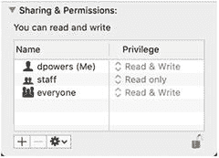

# 提示

如果您无法访问站点根目录之外的目录，我建议您更换一家托管公司。除了站点维护者之外，上传到站点的文件在包含到网页之前应始终进行检查。将它们存放在公众视野之外可以降低安全风险。

### 在 Windows 上为本地测试创建服务器根目录外的文件夹

对于以下练习，我建议您在 C 盘的根目录下创建一个名为 `private` 的文件夹。Windows 上没有权限问题，所以你只需要这样做。

### 在 MacOS 上为本地测试创建服务器根目录外的文件夹

Mac 用户可能需要多做一点准备工作，因为文件权限与 Linux 类似。在你的主文件夹中创建一个名为 `private` 的文件夹，并按照 PHP 解决方案 7-1 中的说明进行操作。

如果一切顺利，你不需要做任何额外的事情。但是，如果你收到 PHP “无法打开流”的警告，请像这样更改 `private` 文件夹的权限：

1.  在 Mac Finder 中选择 `private`，然后选择文件 ➤ 显示简介（Cmd+I）以打开其信息面板。
2.  在“共享与权限”中，点击右下角的挂锁图标以解锁设置，然后将“所有人”的设置从“只读”更改为“读与写”，如下面的屏幕截图所示。
    
3.  再次点击挂锁图标以保存新设置并关闭信息面板。你现在应该能够使用 `private` 文件夹继续本章其余部分的内容了。

### 影响文件访问的配置设置

托管公司可以通过 `php.ini` 对文件访问施加进一步的限制。要了解已施加了哪些限制，请在您的网站上运行 `phpinfo()` 并检查 Core 部分中的设置。表 7-1 列出了您需要检查的设置。除非您运行自己的服务器，否则通常无法控制这些设置。

**表 7-1.** 影响文件访问的 PHP 配置设置

| 指令 | 默认值 | 描述 |
| --- | --- | --- |
| `allow_url_fopen` | On | 允许 PHP 脚本打开互联网上的公共文件 |
| `allow_url_include` | Off | 控制包含远程文件的能力 |

