# 表 7-1 中的两个设置均控制通过 URL（相对于本地文件系统）对文件的访问。第一个设置 `allow_url_fopen` 允许你读取远程文件，但不能将其包含在脚本中。这通常是安全的，因此默认情况下它是启用的。另一方面，`allow_url_include` 允许你直接将远程文件包含在脚本中。这是一个重大的安全风险，因此 `allow_url_include` 的默认状态是禁用的。

> **提示**  
> 如果你的托管公司已禁用 `allow_url_fopen`，请请求启用它。否则，你将无法使用 PHP 解决方案 7-5。但不要搞混这两个名称：`allow_url_include` 在托管环境中应始终关闭。即使 `allow_url_fopen` 在你的网站上被禁用，你仍然可能能够使用客户端 URL 库（cURL）访问有用的外部数据源，例如新闻源和公共 XML 文档。更多信息请参见 [`www.php.net/manual/en/book.curl.php`](http://www.php.net/manual/en/book.curl.php)。

## 读写文件

读写文件的能力有着广泛的应用。例如，你可以打开另一个网站上的文件，将内容读入服务器内存，使用字符串和 XML 处理函数提取信息，然后将结果写入本地文件。你还可以查询自己服务器上的数据库，并将数据输出为文本或 CSV（逗号分隔值）文件。你甚至可以生成 Open Document Format 或 Microsoft Excel 电子表格格式的文件。但首先，让我们来看一下基本操作。

> **提示**  
> 如果你订阅了 LinkedIn Learning 或 [Lynda.​com](http://lynda.com)，你可以通过我的 *PHP: Exporting Data to Files* 课程学习如何将数据从数据库导出为各种格式，例如 Microsoft Excel 和 Word。

## 单次操作读取文件

PHP 有三个函数可以单次操作读取文本文件的内容：

* `readfile()` 打开一个文件并直接输出其内容。
* `file_get_contents()` 将文件的全部内容读入一个字符串，但不会直接生成输出。
* `file()` 将每一行读入一个数组。

### PHP 解决方案 7-1：获取文本文件的内容

此 PHP 解决方案演示了使用 `readfile()`、`file_get_contents()` 和 `file()` 访问文件内容的区别。

1. 将 `sonnet.txt` 复制到你的 `private` 文件夹。该文本文件包含莎士比亚的第 116 首十四行诗。

2. 在你的 phpsols `-4e` 站点根目录中创建一个名为 `filesystem` 的新文件夹，然后在新文件夹中创建一个名为 `get_contents.php` 的 PHP 文件。在 PHP 代码块中插入以下代码（`ch07` 文件夹中的 `get_contents_01.php` 显示了嵌入在网页中的代码，但你仅可使用 PHP 代码进行测试）：

   ```
   readfile('C:/private/sonnet.txt');
   ```

   如果你使用的是 Mac，请像这样修改路径名，替换为你自己的 Mac 用户名：

   ```
   readfile('/Users/username/private/sonnet.txt');
   ```

   如果你在 Linux 或远程服务器上测试，请相应修改路径名。

> **注意**  
> 为简洁起见，本章剩余示例仅显示 Windows 路径名。

3. 保存 `get_contents.php` 并在浏览器中查看。你应该会看到类似以下截图的内容。浏览器会忽略原始文本中的换行符，并将莎士比亚的十四行诗显示为一个实心文本块。

   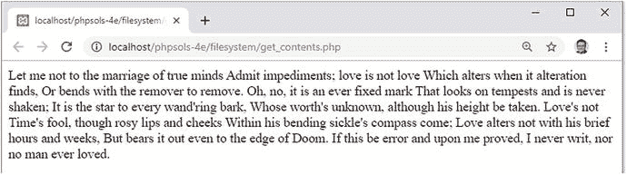

> **提示**  
> 如果你看到错误消息，请检查代码输入是否正确，以及在 Mac 或 Linux 上是否已设置正确的文件和文件夹权限。

4. PHP 有一个名为 `nl2br()` 的函数，它可以将换行符转换为 `<br/>` 标签（末尾的斜杠是为了与 XHTML 兼容，并且在 HTML5 中有效）。像这样更改 `get_contents.php` 中的代码（代码在 `get_contents_02.php` 中）：

   ```
   nl2br(readfile('C:/private/sonnet.txt'));
   ```

5. 保存 `get_contents.php` 并在浏览器中重新加载。输出仍然是一个实心文本块。当你像这样将一个函数作为参数传递给另一个函数时，内部函数的结果通常会传递给外部函数，从而在单个表达式中执行两个操作。因此，你可能会期望文件内容在显示到浏览器之前被传递给 `nl2br()`。然而，`readfile()` 会立即输出文件内容。当它执行完毕时，已经没有内容可供 `nl2br()` 插入 `<br/>` 标签了。文本已经输出到了浏览器中。

> **注意**  
> 当两个函数像这样嵌套时，内部函数先执行，外部函数处理其结果。但内部函数的返回值需要作为参数对外部函数有意义。`readfile()` 的返回值是从文件中读取的字节数。即使你在行首添加 `echo`，也只能在文本末尾看到 594 这个数字。在这种情况下，函数嵌套不起作用，但这通常是一个非常实用的技术，可以避免在将内部函数的结果传递给另一个函数处理之前将其存储在变量中。

6. 你需要使用 `file_get_contents()` 来将换行符转换为 `<br/>` 标签，而不是 `readfile()`。`readfile()` 只是输出文件内容，而 `file_get_contents()` 则将文件内容作为一个字符串返回。由你来决定如何处理它。像这样修改代码（或使用 `get_contents_03.php`）：

   ```
   echo nl2br(file_get_contents('C:/private/sonnet.txt'));
   ```

7. 在浏览器中重新加载页面。现在，十四行诗的每一行都单独成行。

   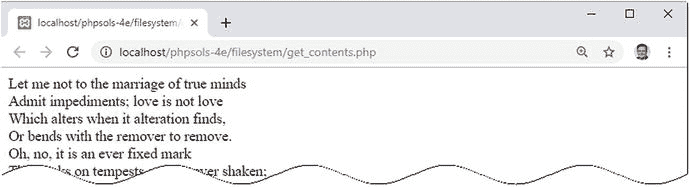

8. `file_get_contents()` 的优点在于，你可以将文件内容赋值给一个变量，并以某种方式处理它，然后再决定如何处理。像这样更改 `get_contents.php` 中的代码（或使用 `get_contents_04.php`）并将页面加载到浏览器中：

   ```
   $sonnet = file_get_contents('C:/private/sonnet.txt');
   // 将换行符替换为空格
   $words = str_replace("\r\n", ' ', $sonnet);
   // 拆分为单词数组
   $words = explode(' ', $words);
   // 提取前九个数组元素
   $first_line = array_slice($words, 0, 9);
   // 连接前九个元素并显示
   echo implode(' ', $first_line);
   ```

   这将 `sonnet.txt` 的内容存储在一个名为 `$sonnet` 的变量中，该变量被传递给 `str_replace()`，后者随后将回车符和换行符替换为一个空格，并将结果存储为 `$words`。

> **注意**  
> 有关 `"\r\n"` 的说明，请参见第 4 章的“在双引号内使用转义序列”。该文本文件是在 Windows 中创建的，因此换行符由回车符和换行符表示。在 macOS 和 Linux 上创建的文件仅使用换行符（`"\n"`）。


`$words`被传递给`explode()`函数。这个听起来很吓人的名称实际上是把一个字符串“炸开”并转换成数组，使用第一个参数来确定在哪里分割字符串。这里使用空格，因此文本文件的内容被分割成一个单词数组。

单词数组随后被传递给`array_slice()`函数，它从数组中提取从第二个参数指定位置开始的切片。第三个参数指定切片的长度。PHP 从 0 开始计数数组，因此这提取了前九个单词。

最后，`implode()`执行与`explode()`相反的操作，将数组元素连接起来，并在每个元素之间插入第一个参数。结果由`echo`显示，产生如下输出：

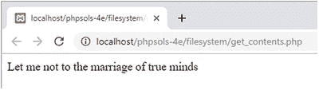

脚本现在不显示文件的全部内容，而只显示第一行。完整的字符串仍然存储在`$sonnet`中。

1.  然而，如果你想逐行处理每一行，使用`file()`会更简单，它会将文件的每一行读入一个数组。要显示`sonnet.txt`的第一行，前面的代码可以简化为这样（参见`get_contents_05.php`）：

    ```
    $sonnet = file('C:/private/sonnet.txt');
    echo $sonnet[0];
    ```

2.  实际上，如果你不需要完整的数组，可以通过一种称为数组解引用的技术直接访问单行，即在函数调用后的方括号中添加其索引号。以下代码显示该十四行诗的第 11 行（参见`get_contents_06.php`）：

    ```
    echo file('C:/private/sonnet.txt')[10];
    ```

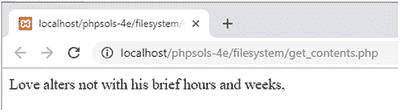

在我们刚刚探索的三个函数中，`readfile()`可能是最没用的。它只是读取文件的内容并直接将其转储到输出中。你无法操作文件内容或从中提取信息。然而，`readfile()`的一个实际用途是强制下载文件，正如你将在本章后面看到的那样。

另外两个函数`file_get_contents()`和`file()`更有用，因为你可以将内容捕获到一个变量中，以便进行重新格式化或提取信息。唯一的区别在于`file_get_contents()`将内容读入单个字符串，而`file()`生成一个数组，其中每个元素对应文件中的一行。

提示
`file()`函数会在每个数组元素的末尾保留换行符。如果要去除换行符，请将常量`FILE_IGNORE_NEW_LINES`作为第二个参数传递给该函数。你也可以使用`FILE_SKIP_EMPTY_LINES`作为第二个参数来跳过空行。要同时去除换行符并跳过空行，请用竖线分隔这两个常量，像这样：`FILE_IGNORE_NEW_LINES | FILE_SKIP_EMPTY_LINES`。

尽管我们只使用本地文本文件测试了`file_get_contents()`和`file()`，但它们也可以从其他域名的公共文件中检索内容。这使得它们在访问其他网页上的信息时非常有用，尽管提取信息通常需要对字符串函数以及文档对象模型（DOM）所描述的文档逻辑结构有扎实的理解（参见[`www.w3.org/TR/WD-DOM/introduction.html`](http://www.w3.org/TR/WD-DOM/introduction.html)）。`file_get_contents()`和`file()`的缺点是它们会将整个文件读入内存。对于非常大的文件，最好使用一次只处理文件一部分的函数。我们接下来将探讨这些函数。

## 打开和关闭文件以进行读/写操作

我们到目前为止研究的函数都是在一次调用中完成所有操作。然而，PHP 也有一组允许你打开文件、读取和/或写入文件，然后关闭文件的函数。该文件可以是本地文件系统中的文件，也可以是不同域名上的公共文件。

以下是用于此类操作的最重要的函数：

*   `fopen()`：打开一个文件
*   `fgets()`：读取文件内容，通常一次一行
*   `fgetcsv()`：从 CSV 文件中获取当前行并将其转换为数组
*   `fread()`：读取指定数量的文件内容
*   `fwrite()`：写入文件
*   `feof()`：确定是否已到达文件末尾
*   `rewind()`：将内部指针移回文件开头
*   `fseek()`：将内部指针移动到文件中的特定位置
*   `fclose()`：关闭一个文件

这些函数中的第一个`fopen()`提供了令人眼花缭乱的选择选项，用于指定文件打开后如何使用：`fopen()`有一种只读模式，四种只写模式，和五种读/写模式。之所以有这么多选项，是因为它们让你能够控制是覆盖现有内容还是追加新内容。其他时候，你可能希望 PHP 在文件不存在时创建它。每种模式都决定了在打开文件时内部指针的放置位置。它就像文字处理器中的光标：当调用`fread()`或`fwrite()`时，PHP 从指针当前所在的位置开始读取或写入。

表 7-2 引导你了解所有选项。

### 表 7-2. 与`fopen()`一起使用的读/写模式

| 类型 | 模式 | 描述 |
| :--- | :--- | :--- |
| **只读** | `r` | 内部指针初始放置在文件开头。 |
| **只写** | `w` | 写入前删除现有数据。如果文件不存在则创建。 |
| | `a` | 追加模式。新数据添加到末尾。如果文件不存在则创建。 |
| | `c` | 保留现有内容，但内部指针放置在文件开头。如果文件不存在则创建。 |
| | `x` | 仅在文件不存在时创建。如果已存在同名文件则失败。 |
| **读/写** | `r+` | 读/写操作可以按任意顺序进行，并从内部指针当时所在的位置开始。指针初始放置在文件开头。文件必须已存在才能使操作成功。 |
| | `w+` | 删除现有数据。写入后可以读回数据。如果文件不存在则创建。 |
| | `a+` | 打开文件准备在文件末尾添加新数据。移动内部指针后也允许读回数据。如果文件不存在则创建。 |
| | `c+` | 保留现有内容，内部指针放置在文件开头。如果文件不存在则创建。 |
| | `x+` | 创建一个新文件，但如果同名文件已存在则失败。写入后可以读回数据。 |

选择了错误的模式，你可能会删除有价值的数据。你还需要注意内部指针的位置。如果指针位于文件末尾，而你又尝试读取内容，最终将一无所获。另一方面，如果指针位于文件开头，并且你开始写入，你将覆盖等量的现有数据。本章后面的“移动内部指针”会更详细地解释这一点。

使用`fopen()`时，需要向其传递以下两个参数：

*   要打开文件的路径，如果文件在不同域名上则为 URL
*   包含表 7-2 中列出的一个模式的字符串


`fopen()` 函数返回一个指向已打开文件的引用，之后可以将其用于其他读取/写入函数。以下是如何以读取模式打开文本文件：

```
$file = fopen('C:/private/sonnet.txt', 'r');
```

此后，你可以将 `$file` 作为参数传递给其他函数，例如 `fgets()` 和 `fclose()`。通过一些实际演示，情况会变得更清晰。与其自己构建文件，使用 `ch07` 文件夹中的文件可能更容易。我将快速介绍每种模式。

注意：Mac 和 Linux 用户需要调整示例文件中 `private` 文件夹的路径，以匹配其设置。

## 使用 `fopen()` 读取文件

文件 `fopen_read.php` 包含以下代码：

```
// store the pathname of the file
$filename = 'C:/private/sonnet.txt';
// open the file in read-only mode
$file = fopen($filename, 'r');
// read the file and store its contents
$contents = fread($file, filesize($filename));
// close the file
fclose($file);
// display the contents with <br> tags
echo nl2br($contents);
```

如果将其加载到浏览器中，你应该会看到以下输出：
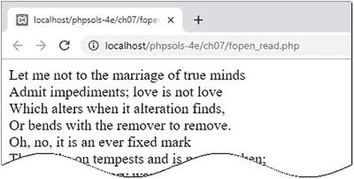

结果与在 `get_contents_03.php` 中使用 `file_get_contents()` 相同。与 `file_get_contents()` 不同，`fread()` 函数需要知道要读取文件的多少内容。你需要提供第二个参数，指定字节数。如果你只想要一个非常大的文件的前 100 个左右字符，这会很有用。但是，如果你想要整个文件，则需要将文件的路径名传递给 `filesize()` 以获取正确的数值。

使用 `fopen()` 读取文件内容的另一种方法是使用 `fgets()`，它一次检索一行。这意味着你需要结合 `feof()` 使用 `while` 循环来一直读到文件末尾。`fopen_readloop.php` 中的代码如下：

```
$filename = 'C:/private/sonnet.txt';
// open the file in read-only mode
$file = fopen($filename, 'r');
// create variable to store the contents
$contents = "";
// loop through each line until end of file
while (!feof($file)) {
// retrieve next line, and add to $contents
$contents .= fgets($file);
}
// close the file
fclose($file);
// display the contents
echo nl2br($contents);
```

`while` 循环使用 `fgets()` 逐一检索文件内容——`!feof($file)` 等同于说“直到 `$file` 的末尾”——并将其存储在 `$contents` 中。使用 `fgets()` 与使用 `file()` 函数非常相似，因为它也是一次处理一行。不同之处在于，一旦找到所需信息，你可以使用 `fgets()` 跳出循环。如果你处理一个非常大的文件，这是一个显著的优势。`file()` 函数会将整个文件加载到一个数组中，这会消耗内存。

## PHP 解决方案 7-2：从 CSV 文件中提取数据

文本文件可以用作平面文件数据库，其中每条记录存储在一行中，字段之间用逗号、制表符或其他分隔符分隔。这种类型的文件称为 **CSV 文件**。通常，CSV 代表逗号分隔值，但当使用制表符或其他分隔符时，它也可以表示字符分隔值。此 PHP 解决方案演示了如何使用 `fopen()` 和 `fgetcsv()` 将 CSV 文件中的值提取到多维关联数组中。

1.  将 `weather.csv` 从 `ch07` 文件夹复制到你的 `private` 文件夹。该文件包含以下逗号分隔值数据：

```
    city,temp
    London,11
    Paris,10
    Rome,12
    Berlin,8
    Athens,19
```

第一行由文件其余数据的标题组成。有五行为数据，每行包含一个城市名称和温度。

注意：当数据存储为逗号分隔值时，逗号后不应有空格。如果添加空格，则它被视为数据字段的第一个字符。CSV 文件中的每一行必须具有相同数量的项目。

2.  在 `filesystem` 文件夹中创建一个名为 `getcsv.php` 的文件，并使用 `fopen()` 以读取模式打开 `users.csv`：

```
    $file = fopen('C:/private/weather.csv', 'r');
```

3.  使用 `fgetcsv()` 将文件的第一行提取为数组，然后将其分配给一个名为 `$titles` 的变量：

```
    $titles = fgetcsv($file);
```

这将创建 `$titles` 作为一个包含第一行值（city 和 temp）的数组。

`fgetcsv()` 函数需要一个参数，即你已打开文件的引用。它还可以接受最多四个可选参数：
-   行的最大长度：默认值为 0，表示无限制。
-   字段之间的分隔符：默认为逗号。
-   包围字符：如果字段包含作为数据一部分的分隔符，则必须用引号括起来。双引号是默认值。
-   转义字符：默认为反斜杠。

我们使用的 CSV 文件不需要设置任何可选参数。

4.  在下一行，初始化一个空数组，用于存放将从 CSV 数据中提取的值：

```
    $cities = [];
```

5.  从一行提取值之后，`fgetcsv()` 会移动到下一行。要获取文件中的剩余数据，你需要创建一个循环。添加以下代码：

```
    while (!feof($file)) {
    $data = fgetcsv($file);
    if (empty($data)) {
        continue;
    }
    $cities[] = array_combine($titles, $data);
    }
```

循环内的代码将 CSV 文件的当前行作为数组分配给 `$data`，然后使用 `array_combine()` 函数生成一个关联数组，并将其添加到 `$cities` 数组中。此函数需要两个参数，这两个参数必须是具有相同数量元素的数组。这两个数组被合并，结果关联数组的键来自第一个参数，值来自第二个参数。

6.  关闭 CSV 文件：

```
    fclose($file);
```

7.  要检查结果，请使用 `print_r()`。用 `<pre>` 标签将其包围，以使输出更易于阅读：

```
    echo '<pre>';
    print_r($cities);
    echo '</pre>';
```

8.  保存 `getcsv.php` 并在浏览器中加载。你应该会看到如图 7-1 所示的结果。

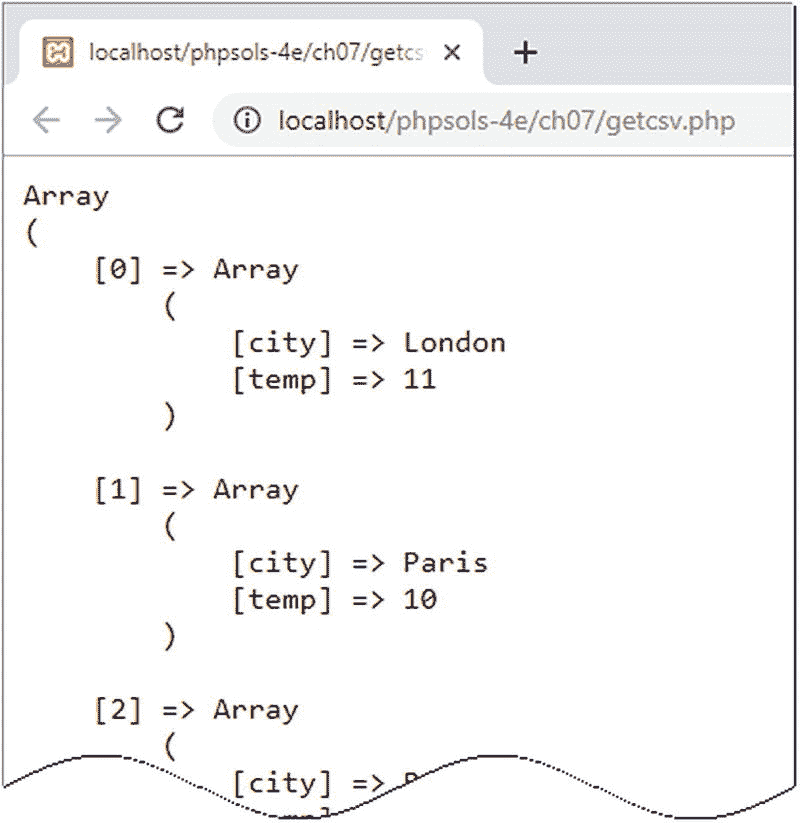

**图 7-1.** CSV 数据已被转换为多维关联数组

9.  这对于 `weather.csv` 来说效果很好，但脚本可以更健壮。如果 `fgetcsv()` 遇到空行，它会返回一个包含单个 `null` 元素的数组，当将其作为参数传递给 `array_combine()` 时，这会产生错误。通过添加以粗体突出显示的条件语句来修改 `while` 循环：

```
    while (!feof($file)) {
    $data = fgetcsv($file);
    if (empty($data)) {
        continue;
    }
    $cities[] = array_combine($titles, $data);
    }
```

条件语句使用 `empty()` 函数，如果变量不存在或等于 `false`，则返回 true。如果存在空行，`continue` 关键字会返回到循环顶部，而不执行下一行。

你可以对照 `ch07` 文件夹中的 `getcsv.php` 检查你的代码。

## 在 macOS 上创建的 CSV 文件

PHP 通常难以检测在 Mac 操作系统上创建的 CSV 文件中的行尾。如果 `fgetcsv()` 无法从 CSV 文件中正确提取数据，请在脚本顶部添加以下代码行：

```
ini_set('auto_detect_line_endings', true);
```


这对性能影响微乎其微，因此仅当 Mac 换行符导致 CSV 文件出现问题时才应使用。

## 使用 `fopen()` 替换内容

第一种只写模式 (`w`) 会删除文件中的任何现有内容，因此适用于需要频繁更新的文件。你可以通过 `fopen_write.php` 测试 `w` 模式，该文件在 `DOCTYPE` 声明上方包含以下 PHP 代码：

```
当页面中的表单提交时，此代码会将 `$_POST['contents']` 的值写入一个名为 `write.txt` 的文件中。`fwrite()` 函数接受两个参数：文件引用以及你想写入文件的内容。

注意
你可能会遇到 `fputs()` 而不是 `fwrite()`。这两个函数是相同的：`fputs()` 是 `fwrite()` 的同义词。

如果你在浏览器中加载 `fopen_write.php`，在文本区域中输入一些内容，然后点击“写入文件”，PHP 会创建 `write.txt` 并将你在文本区域中输入的内容插入其中。由于这只是一个演示，我省略了任何确保文件成功写入的检查。打开 `write.txt` 验证你的文本是否已插入。现在，在文本区域中输入不同的内容并再次提交表单。原始内容会从 `write.txt` 中被删除，并替换为新文本。被删除的文本将永久丢失。
```

## 使用 `fopen()` 追加内容

追加模式不仅会在文件末尾添加新内容，同时保留现有内容，还可以在文件不存在时创建一个新文件。`fopen_append.php` 中的代码如下所示：

```
// 以追加模式打开文件
$file = fopen('C:/private/append.txt', 'a');
// 写入内容后跟一个新行
fwrite($file, $_POST['contents'] . PHP_EOL);
// 关闭文件
fclose($file);
```

请注意，我在 `$_POST['contents']` 之后连接了 `PHP_EOL`。这是一个 PHP 常量，它使用适合操作系统的正确字符来表示新行。在 Windows 上，它会插入一个回车符和换行符，但在 Mac 和 Linux 上只插入一个换行符。如果你在浏览器中加载 `fopen_append.php`，输入一些文本并提交表单，它会在 private 文件夹中创建一个名为 `append.txt` 的文件并插入你的文本。输入其他内容并再次提交表单；新文本应添加到先前文本的末尾，如下面的截图所示。
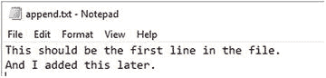
我们将在第 11 章中回到追加模式。

## 写入前锁定文件

将 `fopen()` 与 `c` 模式一起使用的目的是让你有机会在修改文件之前使用 `flock()` 锁定它。

`flock()` 函数接受两个参数：文件引用和一个指定锁定操作方式的常量。有三种操作类型：

*   `LOCK_SH` 获取用于读取的共享锁。
*   `LOCK_EX` 获取用于写入的独占锁。
*   `LOCK_UN` 释放锁。

要在写入之前锁定文件，请以 `c` 模式打开文件并立即调用 `flock()`，如下所示：

```
// 以 c 模式打开文件
$file = fopen('C:/private/lock.txt', 'c');
// 获取独占锁
flock($file, LOCK_EX);
```

这会打开文件（如果文件不存在则创建它），并将内部指针置于文件开头。这意味着你需要将指针移动到文件末尾或删除现有内容，然后才能开始使用 `fwrite()` 写入。

要移动指针到文件末尾，请使用 `fseek()` 函数，如下所示：

```
// 移动到文件末尾
fseek($file, 0, SEEK_END);
```

或者，通过调用 `ftruncate()` 删除现有内容：

```
// 删除现有内容
ftruncate($file, 0);
```

完成文件写入后，你必须在调用 `fclose()` 之前手动解锁文件：

```
// 关闭前解锁文件
flock($file, LOCK_UN);
fclose($file);
```


#### 注意

如果在关闭文件前忘记解锁，即使你自己能再次打开，该文件对其他用户和进程仍将保持锁定状态。

## 防止覆盖现有文件

与其他写入模式不同，`x` 模式不会打开现有文件，只会创建可供写入的新文件。如果同名文件已存在，`fopen()` 将返回 `false`，从而防止文件被覆盖。`fopen_exclusive.php` 中的处理代码如下：

```
// 仅当文件不存在时才创建可供写入的文件
// 错误控制运算符用于防止显示错误信息
if ($file = @ fopen('C:/private/once_only.txt', 'x')) {
    // 写入内容
    fwrite($file, $_POST['contents']);
    // 关闭文件
    fclose($file);
} else {
    $error = '文件已存在，无法被覆盖。';
}
```

尝试以 `x` 模式写入已有文件会生成一系列 PHP 错误信息。将写入和关闭操作包裹在条件语句中可以处理大部分错误，但 `fopen()` 仍会触发警告。在 `fopen()` 前添加错误控制运算符（`@`）可抑制该警告。

在浏览器中加载 `fopen_exclusive.php`，输入一些文本，然后点击“写入文件”。内容将被写入目标文件夹中的 `once_only.txt`。如果再次尝试，表单上方会显示存储在 `$error` 中的提示信息。

## 使用 `fopen()` 进行组合读写操作

在上述任一模式后添加加号（`+`），即可同时打开文件进行读取和写入。在文件关闭前，你可以按任意顺序执行任意数量的读取或写入操作。组合模式的区别如下：

- `r+`：文件必须已存在，不会自动创建新文件。内部指针置于开头，准备读取现有内容。
- `w+`：删除现有内容，因此首次打开文件时无内容可读。
- `a+`：文件打开时内部指针位于末尾，准备追加新内容，因此读取前需将指针移回。
- `c+`：文件打开时内部指针位于开头。
- `x+`：始终创建新文件，因此首次打开时无内容可读。

读取操作使用 `fread()` 或 `fgets()`，写入操作使用 `fwrite()`，用法与之前完全相同。关键在于理解内部指针的位置。

## 移动内部指针

读写操作始终从内部指针当前位置开始，因此通常期望读操作时指针位于文件开头，写操作时位于文件末尾。

要将指针移至开头，可按如下方式将文件引用传递给 `rewind()`：

```
rewind($file);
```

要将指针移至文件末尾，可使用 `fseek()`，示例如下：

```
fseek($file, 0, SEEK_END);
```

你还可以使用 `fseek()` 将内部指针移至指定位置，或相对于当前位置进行移动。详情请参阅 [`https://secure.php.net/manual/en/function.fseek.php`](https://secure.php.net/manual/en/function.fseek.php)。

## 小贴士

在追加模式（`a` 或 `a+`）下，无论指针当前位置如何，内容始终写入文件末尾。

## 探索文件系统

PHP 的文件系统函数还可以打开目录（文件夹）并检查其内容。从 Web 开发者的角度来看，文件系统函数的实际用途包括构建显示文件夹内容的下拉菜单，以及创建提示用户下载文件（如图像或 PDF 文档）的脚本。

## 使用 `scandir()` 检查文件夹

`scandir()` 函数返回一个数组，包含指定文件夹中的文件和子文件夹。只需将文件夹（目录）的路径作为字符串传递给 `scandir()`，并将结果存储到变量中，示例如下：

```
$files = scandir('../images');
```


你可以通过 `print_r()` 显示数组的内容来检查结果，如下面的截图所示（代码位于 `ch07` 文件夹的 `scandir.php` 文件中）：
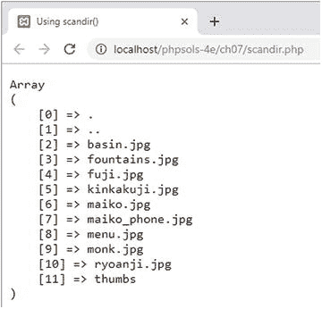

`scandir()` 返回的数组中并非只包含文件。前两个条目被称为点文件，分别代表当前文件夹和父文件夹。最后一个条目是一个名为 `thumbs` 的文件夹。该数组只包含每个条目的名称。如果你想要获取文件夹内容的更多信息，最好使用 `FilesystemIterator` 类。

## 使用 `FilesystemIterator` 检查文件夹内容

`FilesystemIterator` 类允许你遍历目录或文件夹的内容。它是标准 PHP 库（SPL）的一部分，而 SPL 是 PHP 的核心组成部分。SPL 的主要特性之一是一系列专门的迭代器，可以用极少的代码创建复杂的循环。

由于它是一个类，你可以使用 `new` 关键字实例化一个 `FilesystemIterator` 对象，并将你想要检查的文件夹路径传递给构造函数，如下所示：

```
$files = new FilesystemIterator('../images');
```

与 `scandir()` 不同，它不会返回一个文件名数组，因此你不能使用 `print_r()` 来显示其内容。相反，它会创建一个对象，让你可以访问文件夹内的所有内容。要显示文件名，可以使用 `foreach` 循环，如下所示（代码位于 `ch07` 文件夹的 `iterator_01.php` 文件中）：

```
$files = new FilesystemIterator('../images');
foreach ($files as $file) {
echo $file . '';
}
```

这将产生以下结果：
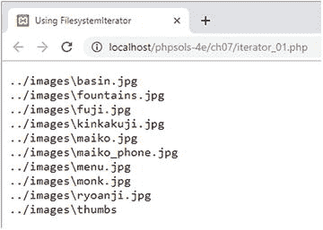

关于这个输出，可以观察到以下几点：

*   代表当前文件夹和父文件夹的点文件被省略了。
*   显示的值是文件的相对路径，而不仅仅是文件名。
*   由于截图是在 Windows 系统上进行的，相对路径中使用了反斜杠。

在大多数情况下，反斜杠并不重要，因为 PHP 在 Windows 路径中既接受正斜杠也接受反斜杠。但是，如果你希望从 `FilesystemIterator` 的输出中生成 URL，可以选择使用 Unix 风格的路径。设置该选项的一种方法是将一个常量作为第二个参数传递给 `FilesystemIterator()`，如下所示（参见 `iterator_02.php`）：

```
$files = new FilesystemIterator('../images', FilesystemIterator::UNIX_PATHS);
```

或者，你也可以在 `FilesystemIterator` 对象上调用 `setFlags()` 方法，如下所示（参见 `iterator_03.php`）：

```
$files = new FilesystemIterator('../images');
$files->setFlags(FilesystemIterator::UNIX_PATHS);
```

两种方法都会产生如下截图所示的输出。
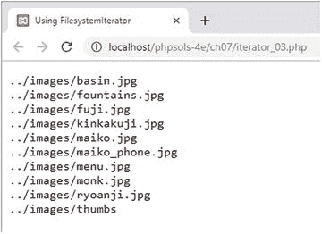
当然，这在 macOS 或 Linux 上不会有任何区别，但设置此选项能让你的代码更具可移植性。

**提示**
SPL 类使用的常量都是类常量。它们总是以类名和作用域解析操作符（两个冒号）作为前缀。像这样冗长的名称使得使用带有 PHP 代码提示和代码补全功能的编辑程序非常值得。

尽管能够显示文件夹内容的相对路径很有用，但使用 `FilesystemIterator` 类的真正价值在于，每次循环运行时，它都会为你提供一个 `SplFileInfo` 对象。`SplFileInfo` 类有近 30 个方法，可以用来提取关于文件和文件夹的有用信息。表 7-3 列出了一些最实用的 `SplFileInfo` 方法。

**表 7-3.** 通过 `SplFileInfo` 方法可访问的文件信息

| 方法 | 返回值 |
| --- | --- |
| `getFilename()` | 文件的名称 |
| `getPath()` | 当前对象的相对路径（不含文件名），如果当前对象是文件夹，则不含文件夹名 |
| `getPathName()` | 当前对象的相对路径，根据当前类型包含文件名或文件夹名 |
| `getRealPath()` | 当前对象的完整路径，如果适用则包含文件名 |
| `getSize()` | 文件或文件夹的大小（以字节为单位） |
| `isDir()` | 如果当前对象是文件夹（目录），则返回 True |
| `isFile()` | 如果当前对象是文件，则返回 True |
| `isReadable()` | 如果当前对象可读，则返回 True |
| `isWritable()` | 如果当前对象可写，则返回 True |

要访问子文件夹的内容，请使用 `RecursiveDirectoryIterator` 类。它会向下深入文件夹结构的每一层，但你需要将其与名字奇特的 `RecursiveIteratorIterator` 结合使用，如下所示（代码位于 `iterator_04.php`）：

```
$files = new RecursiveDirectoryIterator('../images');
$files->setFlags(RecursiveDirectoryIterator::SKIP_DOTS);
$files = new RecursiveIteratorIterator($files);
foreach ($files as $file) {
echo $file->getRealPath() . '';
}
```

**注意**
默认情况下，`RecursiveDirectoryIterator` 会包含代表当前文件夹和父文件夹的点文件。要排除它们，你需要将类的 `SKIP_DOTS` 常量作为第二个参数传递给构造函数，或者使用 `setFlags()` 方法。

如下面的截图所示，`RecursiveDirectoryIterator` 会检查所有子文件夹的内容，在一次操作中就揭示了 `thumbs` 文件夹的内容：
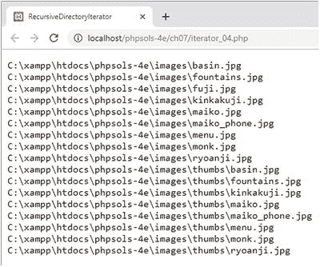

如果你只想查找特定类型的文件呢？接下来看另一个迭代器……

## 使用 `RegexIterator` 限制文件类型

`RegexIterator` 作为另一个迭代器的包装器，使用正则表达式作为搜索模式来过滤其内容。假设你想在 `ch07` 文件夹中查找文本文件和 CSV 文件。用于搜索 `.txt` 和 `.csv` 文件扩展名的正则表达式如下所示：

```
'/\.(?:txt|csv)$/i'
```

这个正则表达式以不区分大小写的方式匹配这两种文件扩展名。`iterator_05.php` 中的代码如下所示：

```
$files = new FilesystemIterator('.');
$files = new RegexIterator($files, '/\.(?:txt|csv)$/i');
foreach ($files as $file) {
echo $file->getFilename() . '';
}
```

传递给 `FilesystemIterator` 构造函数的点号表示检查当前文件夹。原始的 `$files` 对象作为第一个参数传递给 `RegexIterator` 构造函数，正则表达式作为第二个参数，过滤后的结果集重新赋值给 `$files`。在 `foreach` 循环内部，`getFilename()` 方法检索文件名。结果如下：
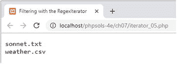
现在只列出了文本文件和 CSV 文件。所有的 PHP 文件都被忽略了。

我猜想，到了这个阶段，你可能在想这能否用于实际用途。让我们来构建一个文件夹中图片的下拉菜单。

## PHP 解决方案 7-3：构建文件下拉菜单

当处理数据库时，你经常需要某个特定文件夹中的图片或其他文件列表。例如，你可能想将一张照片与一个产品详情页面关联。虽然你可以将图片名称手动输入到文本字段中，但你需要确保图片确实存在，并且拼写正确。让 PHP 自动构建一个下拉菜单来完成这项繁重的工作。它始终保持最新，并且没有拼错名称的风险。

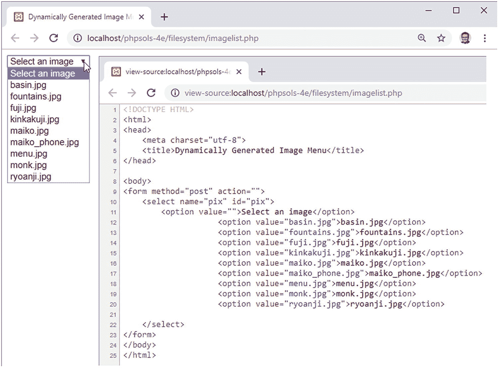

**图 7-2.** PHP 让在特定文件夹中创建图片下拉菜单变得轻而易举


1.  在 `filesystem` 文件夹中创建一个名为 `imagelist.php` 的 PHP 页面。或者，使用 `ch07` 文件夹中的 `imagelist_01.php`。

2.  在 `imagelist.php` 内创建一个表单，并插入一个仅包含一个 `<option>` 元素的 `<select>` 元素，如下所示（代码已在 `imagelist_01.php` 中）：

```
<select name="pix">
    <option value="">选择一个图片</option>
</select>
```

这个 `<option>` 是下拉菜单中唯一的静态元素。

3.  像这样修改表单中的 `<select>` 元素：

```
<select name="pix">
    <option value="">选择一个图片</option>
    <?php
    foreach ($files as $file) {
        ?>
        <option value="<?php echo $file->getFilename(); ?>"><?php echo $file->getFilename(); ?></option>
        <?php
    }
    ?>
</select>
```

确保 `images` 文件夹的路径与您网站的文件夹结构相符。作为 `RegexIterator` 构造函数的第二个参数的正则表达式，不区分大小写地匹配具有 `.jpg`、`.png`、`.gif` 和 `.webp` 扩展名的文件。

`foreach` 循环简单地获取当前图片的文件名，并将其插入到 `<option>` 元素中。

保存 `imagelist.php` 并在浏览器中加载它。您应该会看到一个下拉菜单，列出了 `images` 文件夹中的所有图片，如图 7-2 所示。

当集成到在线表单中时，所选图片的文件名会出现在 `$_POST` 数组中，并由 `<select>` 元素的 `name` 属性标识——在本例中是 `$_POST['pix']`。仅此而已！您可以将您的代码与 `ch07` 文件夹中的 `imagelist_02.php` 进行比较。

## PHP 解决方案 7-4：创建通用文件选择器

前面的 PHP 解决方案依赖于对正则表达式的理解。使其适用于其他文件扩展名并不困难，但您需要小心，不要意外删除一个关键字符。除非正则表达式是您的专长，否则更简单的方法可能是将代码封装到一个函数中，该函数可用于检查特定文件夹并创建特定类型文件名的数组。例如，您可能想要创建一个 PDF 文档文件名的数组，或者一个包含 PDF 和 Word 文档的数组。以下是操作方法。

1.  在 `filesystem` 文件夹中创建一个名为 `buildlist.php` 的新文件。该文件将仅包含 PHP 代码，因此请删除编辑程序插入的任何 HTML。

2.  将以下代码添加到该文件中：

```
function buildFileList($dir, $extensions) {
    if (!is_dir($dir) && !is_readable($dir)) {
        return false;
    } else {
        if (is_array($extensions)) {
            $extensions = implode('|', $extensions);
        }
    }
}
```

这定义了一个名为 `buildFileList()` 的函数，它接受两个参数：

*   `$dir`：要获取文件名列表的文件夹路径。
*   `$extensions`：可以是包含单个文件扩展名的字符串，也可以是文件扩展名的数组。为保持代码简洁，文件扩展名不应包含前导句点。

函数首先检查 `$dir` 是否是一个文件夹并且可读。如果不是，函数返回 `false`，并且不再执行任何代码。

如果 `$dir` 没问题，则执行 `else` 块。它也从一条条件语句开始，检查 `$extensions` 是否是一个数组。如果是，则将其传递给 `implode()`，它将数组元素连接起来，每个元素之间用竖线（`|`）分隔。竖线在正则表达式中用于表示可选值。假设将以下数组作为第二个参数传递给函数：

```
['jpg', 'png', 'gif']
```

条件语句将其转换为 `jpg|png|gif`。因此，这会查找 `jpg`、`png` 或 `gif`。但是，如果参数是一个字符串，则保持不变。

3.  您现在可以构建正则表达式搜索模式，并将两个参数传递给 `FilesystemIterator` 和 `RegexIterator`，如下所示：

```
function buildFileList($dir, $extensions) {
    if (!is_dir($dir) && !is_readable($dir)) {
        return false;
    } else {
        if (is_array($extensions)) {
            $extensions = implode('|', $extensions);
        }
        $pattern = "/\.(?:{$extensions})$/i";
        $folder = new FilesystemIterator($dir);
        $files = new RegexIterator($folder, $pattern);
    }
}
```

正则表达式模式使用双引号字符串构建，并将 `$extensions` 包裹在花括号中，以确保 PHP 引擎能够正确解释它。复制代码时要小心。它不太容易阅读。

4.  代码的最后一部分提取文件名以构建一个数组，该数组经过排序后被返回。完整的函数定义如下所示：

```
function buildFileList($dir, $extensions) {
    if (!is_dir($dir) && !is_readable($dir)) {
        return false;
    } else {
        if (is_array($extensions)) {
            $extensions = implode('|', $extensions);
        }
        $pattern = "/\.(?:{$extensions})$/i";
        $folder = new FilesystemIterator($dir);
        $files = new RegexIterator($folder, $pattern);
        $filenames = [];
        foreach ($files as $file) {
            $filenames[] = $file->getFilename();
        }
        natcasesort($filenames);
        return $filenames;
    }
}
```

这初始化了一个数组，并使用 `foreach` 循环通过 `getFilename()` 方法将文件名赋值给它。最后，该数组被传递给 `natcasesort()`，它以自然且不区分大小写的顺序进行排序。所谓“自然”是指，包含数字的字符串会以人类通常理解的方式进行排序。例如，计算机通常会将 `img12.jpg` 排在 `img2.jpg` 之前，因为 12 中的 1 被认为小于 2。使用 `natcasesort()` 会使 `img2.jpg` 排在 `img12.jpg` 之前。

5.  要使用此函数，请将文件夹路径和要查找的文件的扩展名作为参数。例如，您可以从一个文件夹中获取所有 Word 和 PDF 文档，如下所示：

```
$docs = buildFileList('folder_name', ['doc', 'docx', 'pdf']);
```

`buildFileList()` 函数的代码位于 `ch07` 文件夹的 `buildlist.php` 文件中。

## 访问远程文件

在本地计算机或自己的网站上读取、写入和检查文件是很有用的。但是 `allow_url_fopen` 也允许您访问互联网上任何地方公开可用的文档。您可以读取内容，将其保存到变量中，并使用 PHP 函数进行操作，然后将其整合到自己的页面中或将信息保存到数据库。

需要提醒一点：从远程来源提取材料以包含在自己的页面中时，存在安全风险。例如，远程页面可能包含嵌入在 `<script>` 标签或超链接中的恶意脚本。

即使远程页面从受信任的源（例如 [Amazon.​com](http://amazon.com) 数据库的产品详细信息、政府气象局的气象信息或报纸或广播公司的新闻推送）以已知格式提供数据，您也应该始终通过将其传递给 `htmlentities()`（请参阅 PHP 解决方案 6-3）来清理内容。除了将双引号转换为 `&quot;` 之外，`htmlentities()` 还将 `<` 转换为 `&lt;`，将 `>` 转换为 `&gt;`。这会以纯文本形式显示标签，而不是将它们视为 HTML。

如果您希望允许某些 HTML 标签，请改用 `strip_tags()` 函数。如果将字符串传递给 `strip_tags()`，它会返回一个去除了所有 HTML 标签和注释的字符串。它也会移除 PHP 标签。第二个可选参数是您希望保留的标签列表。例如，以下代码会去除除段落、一级标题和二级标题之外的所有标签：

```
$stripped = strip_tags($original, '<p><h1><h2>');
```


