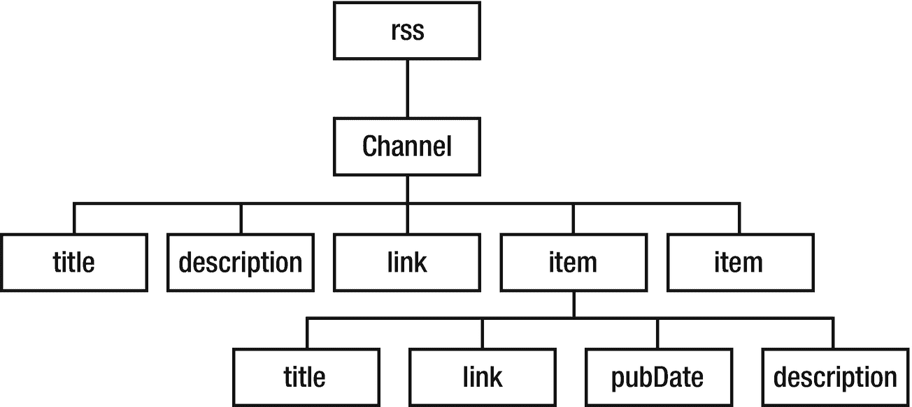
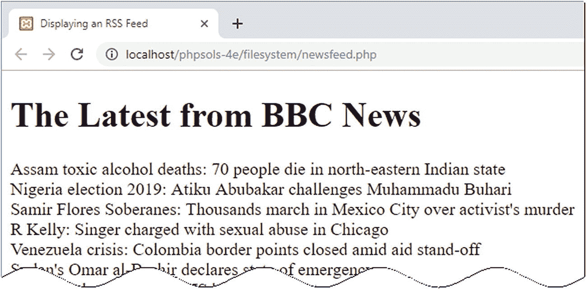
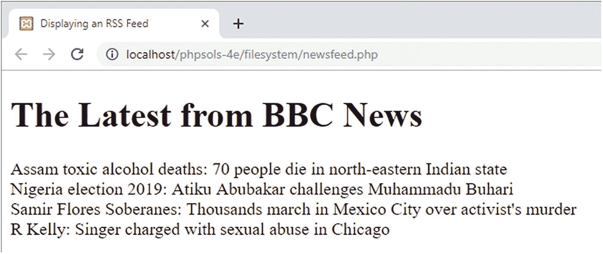
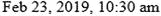
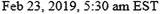
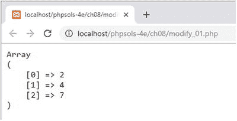
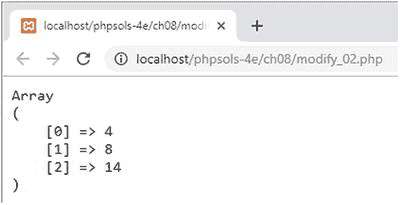
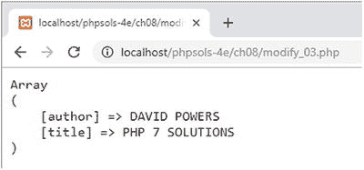
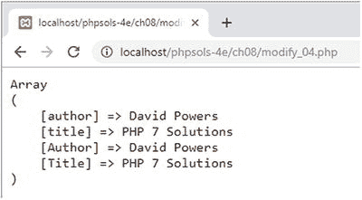
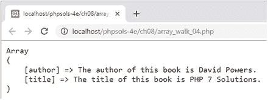

# 消费新闻与其他 RSS 源

你可能希望整合到网站中的一些最有用的远程信息源来自 RSS 源。`RSS`代表简易信息聚合（Really Simple Syndication），它是`XML`的一种方言。`XML`与`HTML`类似，都使用标签来标记内容。但`XML`标签并非用于定义段落、标题和图片，而是用于以可预测的层级结构组织数据。`XML`以纯文本形式编写，因此常被用于在可能运行不同操作系统的计算机之间共享信息。

图 7-3 展示了一个 RSS 2.0 源的典型结构。整个文档被包裹在一对`<rss>`标签内。这是根元素，类似于网页的`<html>`标签。文档的其余部分被包裹在一对`<channel>`标签内，其中始终包含以下三个描述 RSS 源的元素：`<title>`、`<description>`和`<link>`。



**图 7-3.** RSS 源的主要内容位于 item 元素中

除了这三个必需的元素外，`<channel>`还可以包含许多其他元素，但真正有趣的内容位于`<item>`元素中。对于新闻源而言，这里可以找到各个新闻条目。如果你查看博客的 RSS 源，`<item>`元素通常包含博客文章的摘要。

每个`<item>`元素可以包含多个子元素，但图 7-3 中展示的是最常见且通常最有趣的几个：

*   `<title>`：条目的标题

*   `<link>`：条目的 URL

*   `<pubDate>`：发布日期

*   `<description>`：条目的摘要

这种可预测的格式使得使用`SimpleXML`提取信息变得非常容易。

**注意：** 你可以在 [`www.rssboard.org/rss-specification`](http://www.rssboard.org/rss-specification) 找到完整的 RSS 规范。与大多数技术规范不同，它使用通俗语言编写，易于阅读。

## 使用 SimpleXML

只要你了解 XML 文档的结构，`SimpleXML`就会如其名所示：它让从 XML 中提取信息变得简单。第一步是将 XML 文档的 URL 传递给`simplexml_load_file()`。你也可以通过传递路径作为参数来加载本地 XML 文件。例如，以下代码从 BBC 获取世界新闻源：

```php
$feed = simplexml_load_file('http://feeds.bbci.co.uk/news/world/rss.xml');
```

这会创建一个`SimpleXMLElement`类的实例。现在，可以通过使用元素名称，将源中的所有元素作为`$feed`对象的属性进行访问。对于 RSS 源，`<item>`元素可以通过`$feed->channel->item`来访问。

要显示每个`<item>`的`<title>`，可以像这样创建一个`foreach`循环：

```php
foreach ($feed->channel->item as $item) {
echo $item->title . '';
}
```

如果你将此代码与图 7-3 进行比较，可以看到你通过使用`->`运算符链接元素名称来访问元素，直到达到目标。由于有多个`<item>`元素，你需要使用循环来进一步深入。或者，使用数组表示法，如下所示：

```php
$feed->channel->item[2]->title
```

这将获取第三个`<item>`元素的`<title>`。除非你只需要特定值，否则使用循环更简单。了解了这些背景知识后，让我们使用`SimpleXML`来显示新闻源的内容。

## PHP 解决方案 7-5：消费 RSS 新闻源

本 PHP 解决方案展示了如何使用`SimpleXML`从实时新闻源中提取信息，然后在网页中显示。它还展示了如何将`<pubDate>`元素格式化为更友好的格式，以及如何使用`LimitIterator`类限制显示的项目数量。

1. 在`filesystem`文件夹中创建一个名为`newsfeed.php`的新页面。此页面将包含 PHP 和 HTML 的混合内容。

2. 本 PHP 解决方案选择的新闻源是 BBC 世界新闻。使用大多数新闻源的条件是你需要注明来源。因此，在页面顶部添加格式为`<h1>`标题的“来自 BBC 新闻的最新消息”。

**注意：** 关于在你自己的网站上使用 BBC 新闻源的条款和条件，请参见 [`www.bbc.co.uk/news/10628494#mysite`](http://www.bbc.co.uk/news/10628494%2523mysite) 和 [`www.bbc.co.uk/usingthebbc/terms/can-i-share-things-from-the-bbc/`](http://www.bbc.co.uk/usingthebbc/terms/can-i-share-things-from-the-bbc/)。

3. 在标题下方创建一个 PHP 代码块，并添加以下代码来加载源：

```php
$url = 'http://feeds.bbci.co.uk/news/world/rss.xml';
$feed = simplexml_load_file($url);
```

4. 使用`foreach`循环访问`<item>`元素并显示每个元素的`<title>`：

```php
foreach ($feed->channel->item as $item) {
echo htmlentities($item->title) . '';
}
```

5. 保存`newsfeed.php`并在浏览器中加载该页面。你应该会看到一个类似图 7-4 的长列表新闻条目。



**图 7-4.** 新闻源包含大量条目

6. 普通的源通常包含 30 个或更多条目。对于新闻网站来说这没问题，但在你自己的网站上，你可能希望选择更短的内容。使用另一个 SPL 迭代器来选择一个特定的条目范围。像这样修改代码：

```php
$url = 'http://feeds.bbci.co.uk/news/world/rss.xml';
$feed = simplexml_load_file($url, 'SimpleXMLIterator');
$filtered = new LimitIterator($feed->channel->item, 0 , 4);
foreach ($filtered as $item) {
echo htmlentities($item->title) . '';
}
```

要将`SimpleXML`与 SPL 迭代器一起使用，你需要将`SimpleXMLIterator`类的名称作为第二个参数传递给`simplexml_load_file()`。然后，你可以将要影响的 SimpleXML 元素传递给迭代器构造函数。

在此例中，`$feed->channel->item`被传递给`LimitIterator`构造函数。`LimitIterator`接受三个参数：要限制的对象、起始点（从 0 开始计数）以及循环应运行的次数。此代码从第一个条目开始，并将条目数量限制为四个。

现在，`foreach`循环遍历`$filtered`结果。如果你再次测试页面，你将只看到四个标题，如图 7-5 所示。如果标题的选择与之前不同，请不要惊讶。BBC 新闻网站每分钟都在更新。



**图 7-5.** `LimitIterator`限制了显示的条目数量

7. 既然你已经限制了条目数量，修改`foreach`循环，将`<title>`元素包装成指向原始文章的链接，然后显示`<pubDate>`和`<description>`条目。循环代码如下：

```php
foreach ($filtered as $item) { ?>
link) ?>">
title)?>
pubDate) ?>
description) ?>
}
```

8. 保存页面并再次测试。链接会直接将你带到 BBC 网站上的相关新闻报道。新闻源现在可以工作了，但`<pubDate>`的格式遵循 RSS 规范中规定的格式，如以下截图所示：


7. 为了以更友好的方式格式化日期和时间，将`$item->pubDate`传递给`DateTime`类构造函数，然后使用`DateTime format()`方法进行显示。修改`foreach`循环中的代码如下：

```php
    pubDate);
    echo $date->format('M j, Y, g:ia'); ?>
```

这将日期重新格式化为：



有关神秘的 PHP 日期格式化字符串，请参阅第 16 章。

8. 看起来好多了，但时间仍然以 GMT（伦敦时间）显示。如果网站的大多数访客居住在美国东海岸，你可能希望显示当地时间。使用`DateTime`对象可以轻松实现。使用`setTimezone()`方法切换到纽约时间。你甚至可以根据夏令时是否生效，自动显示 EDT（东部夏令时）或 EST（东部标准时间）。修改代码如下：

```php
    pubDate);
    $date->setTimezone(new DateTimeZone('America/New_York'));
    $offset = $date->getOffset();
    $timezone = ($offset == -14400) ? ' EDT' : ' EST';
    echo $date->format('M j, Y, g:ia') . $timezone; ?>
```

要创建`DateTimeZone`对象，请将[`www.php.net/manual/en/timezones.php`](http://www.php.net/manual/en/timezones.php)列出的一个时区作为参数传递给它。这是唯一需要`DateTimeZone`对象的地方，因此它被直接创建为`setTimezone()`方法的参数。

虽然没有专门的方法来判断夏令时是否生效，但`getOffset()`方法会返回时间与协调世界时（UTC）相差的秒数。以下代码决定显示 EDT 还是 EST：

```php
    $timezone = ($offset == -14400) ? ' EDT' : ' EST';
```

这里使用`$offset`的值结合三元运算符。在夏季，纽约比 UTC 晚 4 小时（`-14400`秒）。因此，如果`$offset`等于`-14400`，条件为`true`，则将 EDT 赋值给`$timezone`。否则，使用 EST。

最后，将`$timezone`的值拼接到格式化时间之后。`$timezone`使用的字符串前面有一个空格，用于分隔时区和时间。加载页面时，时间会调整为美国东海岸时间，如下所示：



9. 现在页面只需要用 CSS 进行美化。图 7-6 展示了使用`styles`文件夹中`newsfeed.css`样式化后的完整新闻订阅。


**图 7-6.** 实时新闻订阅只需要十几行 PHP 代码

> **提示**
>
> 如果你订阅了 LinkedIn Learning 或 [Lynda.​com](http://lynda.com)，可以在我的课程《学习标准 PHP 库》和《学习 PHP SimpleXML》中了解更多关于 SPL 和 SimpleXML 的知识。

虽然我为这个 PHP 解决方案使用了 BBC 新闻订阅，但它应该适用于任何 RSS 2.0 订阅。例如，你可以在本地使用[`http://rss.cnn.com/rss/edition.rss`](http://rss.cnn.com/rss/edition.rss)进行测试。在公共网站中使用 CNN 新闻订阅需要获得 CNN 的许可。在将订阅集成到网站之前，请务必与版权所有者核实条款和条件。

---

## 创建下载链接

一个经常在在线论坛出现的问题是：“如何创建一个指向图像（或 PDF 文件）的链接，以提示用户下载它？”快速解决方案是将文件转换为压缩格式，例如 ZIP。这通常会导致更小的下载量，但缺点是没有经验的用户可能不知道如何解压文件，或者他们可能使用的是不包含解压工具的旧操作系统。使用 PHP 文件系统函数，可以轻松创建一个自动提示用户下载原始格式文件的链接。

### PHP 解决方案 7-6：提示用户下载图像

这个 PHP 解决方案发送必要的 HTTP 头，并使用`readfile()`以二进制流的形式输出文件内容，强制浏览器下载它。

1. 在`filesystem`文件夹中创建一个名为`download.php`的 PHP 文件。完整列表在下一步中给出。你也可以在`ch07`文件夹的`download.php`中找到它。

2. 删除脚本编辑器创建的任何默认代码，并插入以下代码：

```php
    <?php
    // define error page
    $error = 'http://localhost/phpsols-4e/error.php';
    // define the path to the download folder
    $filepath = 'C:/xampp/htdocs/phpsols-4e/images/';
    $getfile = NULL;
    // block any attempt to explore the filesystem
    if (isset($_GET['file']) && basename($_GET['file']) == $_GET['file']) {
    $getfile = $_GET['file'];
    } else {
    header("Location: $error");
    exit;
    }
    if ($getfile) {
    $path = $filepath . $getfile;
    // check that it exists and is readable
    if (file_exists($path) && is_readable($path)) {
    // send the appropriate headers
    header('Content-Type: application/octet-stream');
    header('Content-Length: '. filesize($path));
    header('Content-Disposition: attachment; filename=' . $getfile);
    header('Content-Transfer-Encoding: binary');
    // output the file content
    readfile($path);
    } else {
    header("Location: $error");
    }
    }
```

此脚本中唯一需要更改的两行已用粗体标出。第一行定义了`$error`，这是一个包含错误页面 URL 的变量。需要更改的第二行定义了存储下载文件的文件夹路径。

脚本的工作原理是从附加到 URL 的查询字符串中获取要下载的文件名，并将其保存为`$getfile`。由于查询字符串很容易被篡改，因此`$getfile`最初设置为`NULL`。如果不这样做，可能会让恶意用户访问服务器上的任何文件。

开头的条件语句使用`basename()`来确保攻击者无法从文件结构的其他部分请求文件（例如存储密码的文件）。如第 5 章所述，`basename()`提取路径中的文件名部分，因此如果`basename($_GET['file'])`与`$_GET['file']`不同，你就知道有人试图探测你的服务器。然后，你可以使用`header()`函数将用户重定向到错误页面，从而阻止脚本继续执行。

在检查请求的文件存在且可读之后，脚本发送适当的 HTTP 头，并使用`readfile()`将文件发送到输出缓冲区。如果找不到文件，则用户会被重定向到错误页面。

3. 通过创建另一个页面来测试脚本；添加几个指向`download.php`的链接。在每个链接的末尾添加一个查询字符串，格式为`file=`后跟要下载的文件名。你可以在`ch07`文件夹中找到名为`getdownloads.php`的页面，其中包含以下两个链接：

```php
    Download fountains image
    Download monk image
```

4. 点击其中一个链接。根据浏览器的设置，文件会下载到默认的下载文件夹，或者会弹出一个对话框询问您如何处理该文件。

我以图片文件为例演示了`download.php`，但它可以用于任何类型的文件，因为标头会将文件作为二进制流发送。

> **注意**
>
> 此脚本依赖`header()`向浏览器发送适当的 HTTP 标头。**务必确保**在 PHP 开始标签之前没有任何换行或空白。如果已删除所有空白但仍收到“标头已发送”的错误消息，您的编辑器可能在文件开头插入了不可见的控制字符。某些编辑程序会插入字节顺序标记（BOM），已知这会导致`header()`函数出现问题。请检查您的程序偏好设置，确保已取消选中插入 BOM 的选项。

## 章节回顾

文件系统函数并不难使用，但有许多细微之处可能将一个看似简单的任务变成复杂的问题。检查您是否拥有正确的权限非常重要。即使是在自己的网站中处理文件，PHP 也需要对您要读取或写入文件的任何文件夹具有访问权限。

SPL 的`FilesystemIterator`和`RecursiveDirectoryIterator`类使检查文件夹内容变得非常容易。与`SplFileInfo`方法和`RegexIterator`结合使用时，您可以快速找到文件夹或文件夹层次结构中特定类型的文件。

处理远程数据源时，需要检查`allow_url_fopen`是否未被禁用。远程数据源最常见的用途之一是从 RSS 新闻源或 XML 文档中提取信息，得益于 SimpleXML，这项任务只需几行代码即可完成。

在本书的后续章节中，我们将把本章中的一些 PHP 解决方案应用于实际操作，例如处理图像和构建简单的用户身份验证系统。

## 8. 处理数组

数组是 PHP 中最通用的数据类型之一。其重要性体现在有超过 80 个核心函数专门用于处理存储在数组中的数据。这些函数大致可分为：修改、排序、比较和提取数组信息。本章不试图涵盖所有函数，而是聚焦于一些更有趣、更实用的数组操作应用。

本章涵盖以下内容：

- 理解修改数组内容的多种方法
- 合并数组
- 将数组转换为语法字符串
- 查找数组的所有排列组合
- 排序数组
- 从多维数组自动生成嵌套的 HTML 列表
- 从 JSON 提取数据
- 将数组元素赋值给变量
- 使用展开运算符解包数组

### 修改数组元素

刚接触 PHP 的新手在尝试修改数组中的每个元素时，常常会感到困惑。例如，假设您想对数字数组中的每个元素执行计算。简单的方法看起来是使用循环，在循环内执行计算，并将结果重新赋值给当前元素，如下所示：

```php
$numbers = [2, 4, 7];
foreach ($numbers as $number) {
    $number *= 2;
}
```

这看起来应该能行，但实际上不能。`$numbers`数组中的值保持不变。这是因为 PHP 在循环内部操作的是数组的一个*副本*。循环结束时副本被丢弃，计算结果也随之消失。要修改原始数组，需要将每个元素的值通过引用传递到循环中。

#### PHP 解决方案 8-1：使用循环修改数组元素

此 PHP 解决方案展示了如何使用`foreach`循环修改数组中的每个元素。该技术对于索引数组和关联数组均适用。

1.  打开`ch08`文件夹中的`modify_01.php`，其中包含上一节的代码，并在`<pre>`标签对之间添加`print_r($numbers);`。

2.  在浏览器中加载该页面，验证`$numbers`数组中的值是否未改变，如下截图所示：



3.  通过在循环声明中的临时变量前添加`&`符号，将数组的每个元素按引用传递给循环：

```
foreach ($numbers as &$number) {
```

4.  循环结束时，临时变量仍然会包含最后一个数组元素的更新值。为避免后续意外修改该值，建议循环后使用`unset()`销毁临时变量：

```
foreach ($numbers as &$number) {
    $number *= 2;
}
unset($number);
```

5.  保存文件并在浏览器中加载以测试修改后的代码（位于`modify_02.php`）。数组中的每个数字都应加倍，如下截图所示：



6.  要修改关联数组的值，需要为键和值都声明临时变量；但只有值应按引用传递。以下代码位于`modify_03.php`：

```
$book = [
    'author' => 'David Powers',
    'title' => 'PHP 7 Solutions'
];
foreach ($book as $key => &$value) {
    $book[$key] = strtoupper($value);
}
unset($value);
```

输出结果如下：



7.  但假设你想修改数组的键。逻辑上的做法是在键前面加上`&`符号以按引用传递：

```
foreach ($book as &$key => $value) {
```

然而，如果尝试这样做，会触发致命错误。数组键不能按引用传递，只有数组值可以。

8.  要修改关联数组的每个键，只需像在循环外一样在循环内直接修改即可。以下代码位于`modify_04.php`：

```
foreach ($book as $key => $value) {
    $book[ucfirst($key)] = $value;
}
```

输出结果如下：



9.  如上截图所示，原始键与修改后的键会同时保留。如果只想保留修改后的键，需要在循环内使用`unset()`销毁原始键（代码位于`modify_05.php`）：

```
foreach ($book as $key => $value) {
    $book[ucfirst($key)] = $value;
    unset($book[$key]);
}
```

这样只保留每个键的修改版本。

> **提示**
>
> 如果想将数组键转换为大写或小写，简单的方法是使用`array_change_key_case()`函数，如下一个 PHP 解决方案所述。

### PHP 解决方案 8-2：使用`array_walk()`修改数组元素

修改数组元素的另一种方法是使用`array_walk()`函数，该函数将回调函数应用于数组的每个元素。回调可以是匿名函数，也可以是已定义函数的名称。默认情况下，`array_walk()`向回调传递两个参数：元素的值和键——**按此顺序**。还可以使用可选的第三个参数。本 PHP 解决方案将探讨`array_walk()`的各种使用方法。

1.  位于`ch08`文件夹中的`array_walk_01.php`的主要代码如下：

```
$numbers = [2, 4, 7];
array_walk($numbers, function (&$val) {
    return $val *= 2;
});
```

`array_walk()`的第一个参数是要应用回调函数的数组。第二个参数是回调，此处为匿名函数。与`foreach`循环一样，值需要按引用传递，因此回调函数的第一个参数前需加上`&`符号。

此示例修改索引数组，因此无需将数组键作为第二个参数传递给回调函数。

像这样使用`array_walk()`会产生与前一个 PHP 解决方案中`modify_02.php`相同的结果：`$numbers`数组中的每个值都会加倍。

2.  当对关联数组使用`array_walk()`时，如果只想修改值，则无需将数组键作为参数传递给回调函数。`array_walk_02.php`中的代码使用匿名函数将每个数组元素的值转换为大写字符串：

```
$book = [
    'author' => 'David Powers',
    'title' => 'PHP 7 Solutions'
];
array_walk($book, function (&$val) {
    return $val = strtoupper($val);
});
```

这会产生与前一个 PHP 解决方案中`modify_03.php`相同的输出。

3.  也可以将已定义函数的名称作为字符串传递给`array_walk()`（代码位于`array_walk_03.php`）：

```
array_walk($book, 'output');
function output (&$val) {
    return $val = strtoupper($val);
}
```

这会产生与上例相同的输出。如果函数定义位于同一文件中，那么它在调用`array_walk()`之前或之后定义都没有关系。但如果定义在外部文件中，则必须在调用`array_walk()`之前包含该文件。

4.  传递给`array_walk()`的回调函数最多可以接受三个参数。第二个参数必须是数组键，最后一个参数可以是任何你想要使用的其他值。使用第三个参数时，它也会作为第三个参数传递给`array_walk()`。以下`array_walk_04.php`中的示例演示了其用法：

```
array_walk($book, 'output', 'is');
function output (&$val, $key, $verb) {
    return $val = "The $key of this book $verb $val.";
}
```

输出结果如下：



5.  使用`array_walk()`无法修改数组键。如果只想将所有键改为大写或小写，请使用`array_change_key_case()`。默认情况下，它将键转换为小写。与`array_walk()`不同，它不会修改原始数组，而是返回一个包含修改后键的新数组，因此你需要将结果赋值给一个变量。在`array_change_key_case_01.php`中，数组键被赋予了首字母大写，以下代码将键转换为小写并将结果重新赋值给`$book`：

```
$book = [
    'Author' => 'David Powers',
    'Title' => 'PHP 7 Solutions'
];
$book = array_change_key_case($book);
```

6.  要将键转换为大写，将 PHP 常量`CASE_UPPER`作为第二个参数传递给`array_change_key_case()`（代码位于`array_change_key_case_02.php`）：

```
$book = array_change_key_case($book, CASE_UPPER);
```