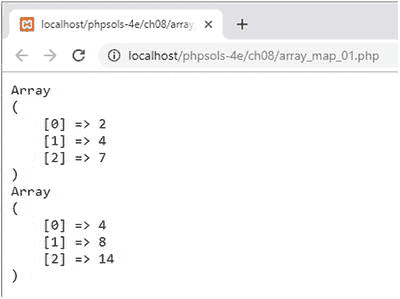
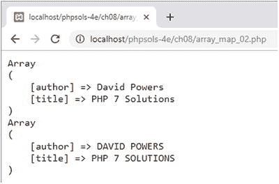
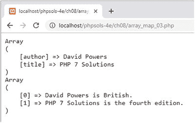
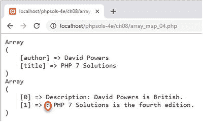

# PHP 解决方案 8-3：使用 `array_map()` 修改数组元素

通过引用将数组值传递给 `foreach` 循环或 `array_walk()` 会修改原始数组。这通常正是你想要的。然而，如果你想保留原始数组，可以考虑使用 `array_map()`。它会将回调函数应用于每个数组元素，并返回一个包含已修改元素的新数组。`array_map()` 的第一个参数是回调函数，可以是匿名函数或已定义函数的名称。第二个参数是要修改其元素的数组。

如果回调函数接受多个参数，则每个参数的值必须按照回调函数要求的相同顺序以数组形式传递给 `array_map()`。即使你想为后续参数每次都使用相同的值，也必须将其作为一个与正在修改的数组具有相同元素数量的数组传递给 `array_map()`。

对于关联数组，只有当回调函数接受单个参数时，`array_map()` 才会保留键名。如果向回调函数传递多个参数，`array_map()` 会返回一个索引数组。

1. `array_map_01.php` 中的代码展示了一个使用 `array_map()` 的简单示例，该示例通过匿名回调函数将数组中的数字翻倍。代码如下所示：

```php
$numbers = [2, 4, 7];
$doubled = array_map(function ($num) {
    return $num * 2;
}, $numbers);
echo '';
print_r($numbers);
print_r($doubled);
echo '';
```

如下面的截图所示，原始 `$numbers` 数组中的值保持不变。`$doubled` 数组包含回调函数返回的结果。



2. `array_map_02.php` 中的下一个示例使用一个已定义的函数来修改关联数组：

```php
$book = [
    'author' => 'David Powers',
    'title' => 'PHP 7 Solutions'
];
$modified = array_map('modify', $book);
function modify($val) {
    return strtoupper($val);
}
echo '';
print_r($book);
print_r($modified);
echo '';
```

如下面的截图所示，修改后的数组保留了数组的键名：



3. `array_map_03.php` 中的代码已被修改，以演示如何向回调函数传递多个参数：

```php
$descriptions = ['British', 'the fourth edition'];
$modified = array_map('modify', $book, $descriptions);
function modify($val, $description) {
    return "$val is $description.";
}
```

`modify()` 函数中添加了第二个参数 `$description`。作为参数传递给回调函数的值存储在一个名为 `$descriptions` 的数组中，该数组作为第三个参数传递给 `array_map()`。这将产生以下结果：



注意，修改后的数组中没有保留数组键名。向回调函数传递多个参数会生成一个索引数组。

4. 传递给 `array_map()` 的第三个及后续参数必须包含与正在修改的数组相同数量的元素。`array_map_04.php` 中的代码展示了如果某个参数包含的元素过少会发生什么。代码如下所示：

```php
$descriptions = ['British', 'the fourth edition'];
$label = ['Description'];
$modified = array_map('modify', $book, $descriptions, $label);
function modify($val, $description, $label) {
    return "$label: $val is $description.";
}
```

`$label` 数组中只有一个元素；但如下面的截图所示，这并不会导致相同的值被重复使用。



当作为参数传递给 `array_map()` 的数组元素数量少于第一个数组（即正在修改的那个数组）时，较短的数组会用空元素填充。因此，修改后数组中的第二个元素缺少了标签；但 PHP 不会触发错误。

