# 合并数组

PHP 提供了几种不同的方式来组合两个或多个数组的元素；但它们并不总是产生相同的结果。理解每种方法的工作原理可以避免错误和混淆。

## 使用数组联合运算符

合并数组最简单的方法是使用数组联合运算符，即加号（`+`）。然而，结果可能并非你所预期。`ch08` 文件夹中 `merge_01.php` 的代码演示了在索引数组上使用数组联合运算符时会发生什么：

```php
$first = ['PHP', 'JavaScript'];
$second = ['Java', 'R', 'Python'];
$languages = $first + $second;
echo '';
print_r($languages);
echo '';
```

运行此脚本会产生以下输出：

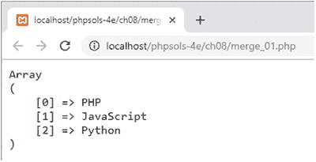

结果数组不是包含五个元素，而是仅包含三个。这是因为数组联合运算符不会将第二个数组连接到第一个数组的末尾。对于索引数组，它会忽略第二个数组中与第一个数组元素具有相同索引的元素。在此示例中，第二个数组中的 Java 和 R 与 PHP 和 JavaScript 具有相同的索引（0 和 1），因此它们被忽略。只有 Python 有一个在第一个数组中不存在的索引（2），所以它被添加到合并后的数组中。

数组联合运算符对关联数组的处理方式类似。`merge_02.php` 中的代码包含两个关联数组，如下所示：

```php
$first = ['PHP' => 'Rasmus Lerdorf', 'JavaScript' => 'Brendan Eich'];
$second = ['Java' => 'James Gosling', 'R' => 'Ross Ihaka', 'Python' => 'Guido van Rossum'];
$lead_developers = $first + $second;
```

两个数组都包含一组唯一的键名，因此结果数组包含每个元素及其关联的键名，如下面的截图所示：

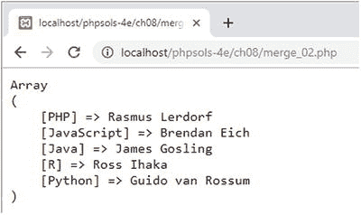

然而，当存在重复键名时，数组联合运算符会忽略第二个数组中的元素，如 `merge_03.php` 中的代码所示：

```php
$first = ['PHP' => 'Rasmus Lerdorf', 'JavaScript' => 'Brendan Eich', 'R' => 'Robert Gentleman'];
$second = ['Java' => 'James Gosling', 'R' => 'Ross Ihaka', 'Python' => 'Guido van Rossum'];
$lead_developers = $first + $second;
```

如下面的截图所示，只有 Robert Gentleman 被记为 R 语言的首席开发者。第二个数组中的 Ross Ihaka 因为共享了一个重复键名而被忽略。

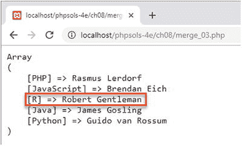

忽略重复索引或键名并不总是你想要的，因此 PHP 提供了一些旨在生成所有元素完全合并数组的函数。

## 使用 `array_merge()` 和 `array_merge_recursive()`

函数 `array_merge()` 和 `array_merge_recursive()` 连接两个或多个数组以创建一个新数组。它们之间的区别在于处理关联数组中重复值的方式。

对于索引数组，`array_merge()` 会自动重新编号每个元素的索引，并包含所有值，包括重复值。`merge_04.php` 中的以下代码演示了这一点：

```php
$first = ['PHP', 'JavaScript', 'R'];
$second = ['Java', 'R', 'Python', 'PHP'];
$languages = array_merge($first, $second);
```


如下所示，输入文本需要像这样：

如下所示，索引是连续编号的，重复的值（PHP 和 R）会保留在结果数组中：
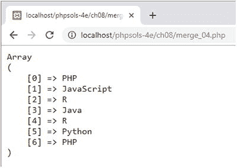

对于关联数组，`array_merge()`的行为取决于是否存在重复的数组键。当没有重复时，`array_merge()`拼接关联数组的方式与使用数组联合运算符完全相同。您可以通过运行`merge_05.php`中的代码来验证这一点。

然而，存在重复键时，只会保留最后一个重复值。这在`merge_06.php`的以下代码中得到了演示：

```
$first = ['PHP' => 'Rasmus Lerdorf', 'JavaScript' => 'Brendan Eich', 'R' => 'Robert Gentleman'];
$second = ['Java' => 'James Gosling', 'R' => 'Ross Ihaka', 'Python' => 'Guido van Rossum'];
$lead_developers = array_merge($first, $second);
```

如下所示，第二个数组中 R 的值（Ross Ihaka）会覆盖第一个数组中的值（Robert Gentleman）：
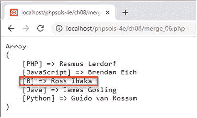

**注意**  
数组的合并顺序与数组联合运算符不同。数组联合运算符保留第一个重复值，而`array_merge()`保留最后一个重复值。

要保留重复键的值，需要使用`array_merge_recursive()`。`merge_07.php`中的代码合并了相同的数组，如下所示：

```
$lead_developers = array_merge_recursive($first, $second);
```

如下所示，重复键的值被合并到一个索引子数组中：
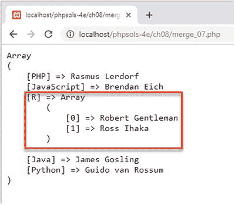
Robert Gentleman 的名字被存储在新数组中，即`$lead_developers['R'][0]`。

**注意**  
数组联合运算符、`array_merge()`和`array_merge_recursive()`可应用于两个以上的数组。关于重复键和值的规则相同。对于`array_merge()`，始终保留最后一个重复值。

## 将两个索引数组合并为关联数组

`array_combine()`函数将两个索引数组合并成一个关联数组，它使用第一个数组作为键，第二个数组作为值。两个数组必须具有相同数量的值，否则函数返回`false`并触发警告。

以下`array_combine.php`中的简单示例展示了其工作原理：

```
$colors = ['red', 'amber', 'green'];
$actions = ['stop', 'caution', 'go'];
$signals = array_combine($colors, $actions);
// $signals 为 ['red' => 'stop', 'amber' => 'caution', 'green' => 'go']
```

**提示**  
请参见 PHP 解决方案 7-2 “从 CSV 文件中提取数据”，了解`array_combine()`的实际应用。

## 比较数组

表 8-1 列出了可用于查找数组差异或交集的 PHP 核心函数。表中的所有函数都接受两个或更多数组作为参数。如果使用回调函数进行比较，则回调函数应作为传递给函数的最后一个参数。

**表 8-1.** 用于比较数组的 PHP 函数

| 函数 | 描述 |
| --- | --- |
| `array_diff()` | 将第一个数组与一个或多个其他数组进行比较。返回第一个数组中存在而其他数组中不存在的值数组。 |
| `array_diff_assoc()` | 类似于`array_diff()`，但在比较中同时使用数组键和值。 |
| `array_diff_key()` | 类似于`array_diff()`，但基于键而非值进行比较。 |
| `array_diff_uassoc()` | 与`array_diff_assoc()`相同，但使用用户提供的回调函数来比较键。 |
| `array_diff_ukey()` | 与`array_diff_key()`相同，但使用用户提供的回调函数来比较键。 |
| `array_intersect()` | 比较两个或多个数组。返回一个包含第一个数组中所有在其他数组中也存在的值的数组。键会被保留。 |
| `array_intersect_assoc()` | 类似于`array_intersect()`，但在比较中同时使用数组键和值。 |
| `array_intersect_key()` | 返回一个包含第一个数组中所有键在其他数组中也存在的条目。 |
| `array_intersect_uassoc()` | 与`array_intersect_assoc()`相同，但使用用户提供的回调函数来比较键。 |
| `array_intersect_ukey()` | 与`array_intersect_key()`相同，但使用用户提供的回调函数来比较键。 |

我不会详细介绍每个函数，但让我们通过比较以下两个数组，看看`array_diff_assoc()`和`array_diff_key()`返回的不同结果：

```
$first = [
'PHP' => 'Rasmus Lerdorf',
'JavaScript' => 'Brendan Eich',
'R' => 'Robert Gentleman'];
$second = [
'Java' => 'James Gosling',
'R' => 'Ross Ihaka',
'Python' => 'Guido van Rossum'];
$diff = array_diff_assoc($first, $second); // $diff 等同于 $first
```

`array_diff_assoc()`会同时检查键和值，返回存在于第一个数组但不存在于其他数组中的元素。在此示例中，尽管两个数组都包含键 R，但第一个数组中的所有三个元素都被返回，这是因为分配给 R 的值不同。

```
$diff = array_diff_key($first, $second);
// $diff 为 ['PHP' => 'Rasmus Lerdorf','JavaScript' => 'Brendan Eich']
```

然而，`array_diff_key()`只检查键，忽略值。结果，它返回第一个数组的前两个元素，但不返回第三个，因为 R 作为键存在于第二个数组中。分配给 R 的值不同这一事实无关紧要。

`ch08`文件夹包含了表 8-1 中其他函数的简单示例，并附有简要的说明注释。`*_uassoc()`和`*_ukey()`版本需要一个回调函数作为最后一个参数来比较每个元素的键。回调函数必须接受两个参数，如果第一个参数分别小于、等于或大于第二个参数，则返回一个小于、等于或大于零的整数。`ch08`文件夹中的示例使用了内置的 PHP `strcasecmp()`函数来执行不区分大小写的比较，如果两个字符串被认为相等，则返回`0`。

**提示**  
比较两个值最有效的方式是使用飞船运算符，这是 PHP 7 的新特性。您将在本章后面的 PHP 解决方案 8-5 “使用飞船运算符进行自定义排序”中看到一个示例。

## PHP 解决方案 8-4：用逗号连接数组

内置的 PHP `implode()`函数使用用户提供的字符串连接数组的所有元素。此 PHP 解决方案通过在最后一个元素前插入 “and” 来增强输出，并提供限制元素数量的选项，将多余的值替换为 “and one other” 或 “and others”。

1. 打开`ch08`文件夹中的`commas_01.php`。它包含一系列索引数组，每个数组包含 0 到 5 个来自 1960 年代和 1970 年代的录音艺术家的名字。最后一行使用`implode()`以逗号连接最后一个数组：

```
    $too_many = ['Dave Dee', 'Dozy', 'Beaky', 'Mick', 'Tich'];
    echo implode(', ', $too_many);
```

2. 在浏览器中加载该脚本。如下面的截图所示，输出看起来不自然，因为在最后一个名字前缺少 “and”：

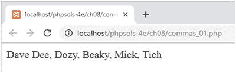

3. 删除最后一行，并像这样开始定义一个函数：

```
    function with_commas(array $array, $max = 4) { }
```


函数签名包含两个参数：`$array` 和 `$max`。`$array` 前有数组类型声明，因此如果向该函数传递其他类型的数据，将触发错误。`$max` 设置了要连接的最大元素数量，默认值为 `4`，因此它是一个可选参数。

在函数内部，我们可以使用 `switch` 语句，根据数组中元素的数量来决定如何处理输出：

```
switch (count($array)) {
case 0:
return '';
case 1:
return array_pop($array);
case 2:
return implode(' and ', $array);
default:
$last = array_pop($array);
return implode(', ', $array) . " and $last";
}
```

传递给 `switch` 语句的参数是 `count($array)`，也就是数组中元素的数量。

如果数组不包含任何元素，则返回空字符串。如果只有一个元素，则在返回结果前将该数组传递给 `array_pop()` 函数。之所以需要这样做，是因为函数应该返回一个可直接显示的字符串。如果直接返回 `$array`，它仍然是一个数组，无法使用 `echo` 或 `print` 来显示。`array_pop()` 函数移除数组中的最后一个元素并将其返回。

如果数组中有两个元素，`switch` 语句会将数组传递给 `implode()` 函数，并附带两侧各有一个空格的字符串 "and"，然后返回结果。

默认操作使用 `array_pop()` 函数移除数组中的最后一个元素。然后，将数组传递给 `implode()` 函数，第一个参数为一个逗号加一个空格。并且，在返回结果之前，将最后一个元素的值与用逗号分隔的字符串拼接，前面加上 "and"。

**提示**  
每个 `case` 后面不需要使用 `break` 语句，因为 `return` 关键字会立即停止任何进一步执行。

1. 保存脚本，并依次使用每个测试数组进行测试。例如：

```
echo with_commas($threesome);
```

2. 此操作将以符合语法规范的方式，用逗号连接数组元素：

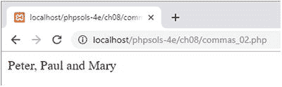

3. 让我们修复数组元素数量超过 `$max` 的情况，首先处理超过一个的情况。在 `default` 之前立即插入以下代码：

```
case $max + 1:
return implode(', ', array_slice($array, 0, $max)) . ' and one other';
```

此操作将 `array_slice($array, 0, $max)` 作为第二个参数传递给 `implode()`。`array_slice()` 函数接受三个参数：要从中提取元素的数组、要开始提取的元素的索引，以及要提取的元素数量。数组从零开始计数，因此这会从数组开头开始，提取 `$max` 个元素。然后，在返回结果之前，将字符串 "and one other" 拼接到结果后面。

4. 保存脚本并再次测试。如果使用 `$threesome` 进行测试，你将得到与上一屏幕截图相同的结果。`$fab_four` 的结果也和之前一样。现在使用 `$too_many` 进行测试，会产生以下结果：

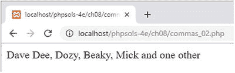

5. 超出 `$max` 的多个元素也以类似方式处理。但是，`case` 语句不能以比较运算符开头。它必须是一个完整的表达式。在第 7 步的代码之后立即插入以下代码：

```
case count($array) > $max + 1:
return implode(', ', array_slice($array, 0, $max)) . ' and others';
```

这里的重要之处在于，你需要再次将 `$array` 传递给 `count()` 函数以获取数组中的元素数量。你不能使用以下代码：

```
// 这会触发解析错误
case > $max + 1:
```

6. 保存脚本并再次运行。对于 `$too_many`，结果保持不变。但是，将 `with_commas()` 的第二个参数更改为一个较小的数字，如下所示：

```
echo with_commas($too_many, 3);
```

这将按如下方式更改输出：

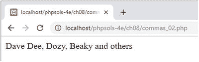

7. 你可以在 `ch08` 文件夹中的 `commas_02.php` 查看完成的代码。

## 排序数组

表 8-2 列出了许多用于排序数组的内置 PHP 函数。

**表 8-2. 数组排序函数**

| 函数 | 描述 |
| --- | --- |
| `sort()` | 按升序排序（从低到高） |
| `rsort()` | 按降序排序（从高到低） |
| `asort()` | 按值升序排序，保持键值对应关系 |
| `arsort()` | 按值降序排序，保持键值对应关系 |
| `ksort()` | 按键升序排序，保持键值对应关系 |
| `krsort()` | 按键降序排序，保持键值对应关系 |
| `natsort()` | 按“自然顺序”排序值，保持键值对应关系 |
| `natcasesort()` | 按不区分大小写的“自然顺序”排序值，保持键值对应关系 |
| `usort()` | 使用回调比较函数按值排序 |
| `uasort()` | 使用回调比较函数按值排序，保持键值对应关系 |
| `uksort()` | 使用回调比较函数按键排序，保持键值对应关系 |
| `array_multisort()` | 对多个或多维数组进行排序 |

表 8-2 中的所有函数都会影响原始数组，并且仅根据操作是否成功返回 `true` 或 `false`。前六个函数（一直到 `krsort()`）可以将表 8-3 中列出的 PHP 常量作为可选的第二个参数来修改排序顺序。

**表 8-3. 修改排序顺序的常量**

| 常量 | 描述 |
| --- | --- |
| `SORT_REGULAR` | 比较项时不更改其类型（默认） |
| `SORT_NUMERIC` | 将项作为数字进行比较 |
| `SORT_STRING` | 将项作为字符串进行比较 |
| `SORT_LOCALE_STRING` | 基于当前区域设置比较项 |
| `SORT_NATURAL` | 按“自然顺序”比较项 |
| `SORT_FLAG_CASE` | 可与 `SORT_STRING` 或 `SORT_NATURAL` 结合使用，使用竖线（`|`）进行不区分大小写的字符串排序 |

这两个按“自然顺序”排序值的函数和常量，会以人类的方式对包含数字的字符串进行排序。在 `ch08` 文件夹中的 `natsort.php` 里有一个示例，它使用 `sort()` 和 `natsort()` 对以下数组进行排序：

```
$images = ['image10.jpg', 'image9.jpg', 'image2.jpg'];
```

以下屏幕截图显示了不同的结果：  
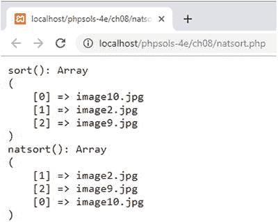  
使用 `sort()` 时，顺序不仅违反直觉，而且索引也被重新编号了。使用 `natsort()` 时，顺序对人类更友好，并且原始索引得以保留。

**提示**  
`natsort()` 和 `natcasesort()` 函数没有对应的逆序排序函数，但你可以将结果传递给内置的 `array_reverse()` 函数。这将返回一个元素顺序相反的新数组，而不进行排序。与表 8-2 中的函数不同，原始数组不会改变。关联数组键得以保留，但索引数组会被重新编号。为了防止索引数组被重新编号，请将布尔值 `true` 作为第二个（可选）参数传递。


在`usort()`、`uasort()` 和 `uksort()` 中使用的回调比较函数必须接受两个参数，并返回一个小于、等于或大于零的整数，具体取决于第一个参数是小于、等于还是大于第二个参数。PHP Solution 8-5 展示了如何使用 PHP 7 太空船操作符实现这一点。

## PHP Solution 8-5：使用太空船操作符进行自定义排序

表 8-2 中的前八个排序函数在处理大部分排序操作时表现出色。然而，它们无法涵盖所有场景。这时，自定义排序函数就派上了用场。本 PHP 解决方案展示了 PHP 7 太空船操作符如何简化自定义排序。

1.  打开 `ch08` 文件夹中的 `spaceship_01.php`。其中包含一个音乐播放列表的多维数组以及一个将其显示为无序列表的循环：

    ```php
    $playlist = [
        ['artist' => 'Jethro Tull', 'track' => 'Locomotive Breath'],
        ['artist' => 'Dire Straits', 'track' => 'Telegraph Road'],
        ['artist' => 'Mumford and Sons', 'track' => 'Broad-Shouldered Beasts'],
        ['artist' => 'Ed Sheeran', 'track' => 'Nancy Mulligan'],
        ['artist' => 'Dire Straits', 'track' => 'Sultans of Swing'],
        ['artist' => 'Jethro Tull', 'track' => 'Aqualung'],
        ['artist' => 'Mumford and Sons', 'track' => 'Thistles and Weeds'],
        ['artist' => 'Ed Sheeran', 'track' => 'Eraser']
    ];
    echo '';
    foreach ($playlist as $item) {
        echo "{$item['artist']}: {$item['track']}";
    }
    echo '';
    ```

2.  在循环之前插入一行，使用 `asort()` 对数组进行排序：

    ```php
    asort($playlist);
    ```

3.  保存文件，并将其加载到浏览器中。如图 8-1 所示，`asort()` 不仅按字母顺序对艺术家进行了排序；与每位艺术家关联的曲目也按字母顺序排列了。

    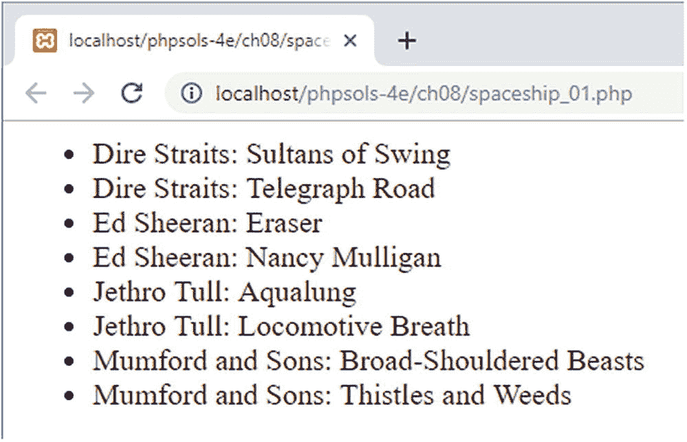

    **图 8-1.** `asort()` 函数轻松完成了多维关联数组值的排序工作。

4.  然而，假设你想按曲目名称的字母顺序对播放列表进行排序。为此，你需要一个自定义排序。将你在步骤 2 中插入的代码行替换为以下内容：

    ```php
    usort($playlist, function ($a, $b) {
        return $a['track'] <=> $b['track'];
    });
    ```

    这使用了 `usort()` 函数以及一个匿名回调函数。回调函数的两个参数（`$a` 和 `$b`）代表你想要比较的两个数组元素。在函数体内，当前曲目元素的值使用 PHP 7 太空船操作符进行比较，该操作符返回一个小于、等于或大于零的整数，具体取决于左操作数是小于、等于还是大于右操作数。回调函数返回比较结果。

5.  为了使自定义排序的结果更清晰，调换每个列表项中显示的艺术家和曲目的顺序：

    ```php
    echo "{$item['track']}: {$item['artist']}";
    ```

6.  保存文件并在浏览器中重新加载。曲目现在按字母顺序列出（见图 8-2）。

    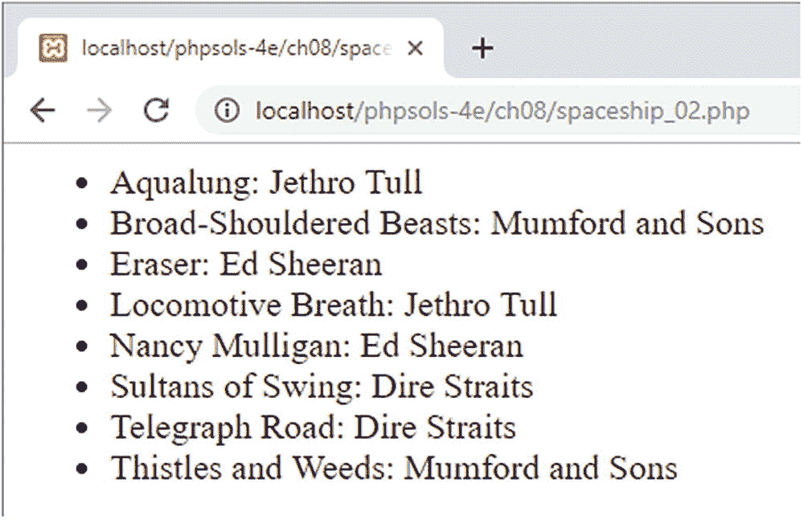

    **图 8-2.** 播放列表现已按曲目名称的字母顺序排序。

7.  要反转自定义排序的顺序，交换太空船操作符两侧操作数的顺序：

    ```php
    usort($playlist, function ($a, $b) {
        return $b['track'] <=> $a['track'];
    });
    ```

8.  你可以将代码与 `ch08` 文件夹中的 `spaceship_02.php` 进行核对。

## 使用 `array_multisort()` 进行复杂排序

`array_multisort()` 函数有两个用途，即：

*   排序多个需要保持同步的数组
*   按一个或多个维度对多维数组进行排序

`multisort_01.php` 中的代码包含一个在重新排序时需要保持同步的数组示例。`$states` 数组按字母顺序列出各州，而 `$population` 数组包含以相同顺序列出的每个州的人口数据：

```php
$states = ['Arizona', 'California', 'Colorado', 'Florida', 'Maryland', 'New York', 'Vermont'];
$population = [7171646, 39557045, 5695564, 21299325, 6042718, 19542209, 626299];
```

然后，一个循环显示每个州的名称及其人口：

```php
echo '';
for ($i = 0, $len = count($states); $i < $len; $i++) {
    echo "<li>$states[$i]: $population[$i]</li>";
}
echo '';
```

图 8-3 显示了输出结果。

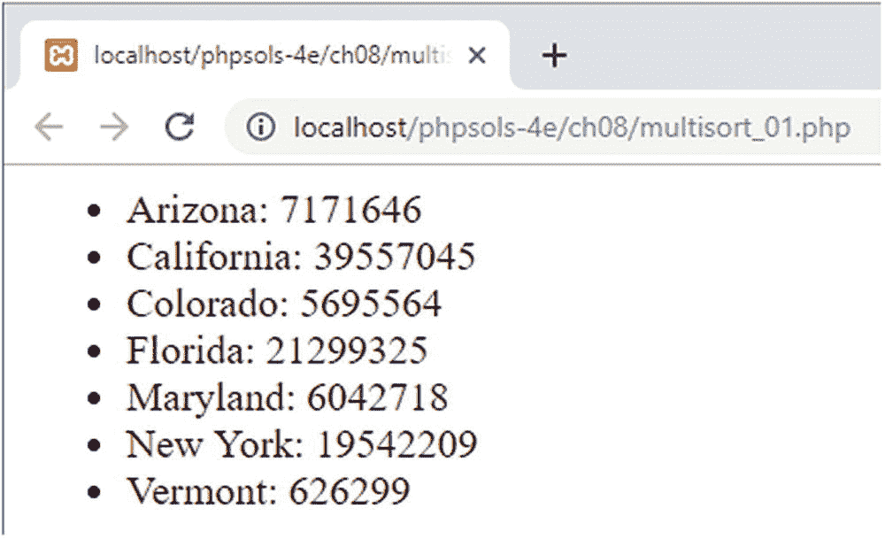

**图 8-3.** 尽管州和人口数据在不同的数组中，但它们的顺序是正确的。

然而，如果你想要按升序或降序对人口数据重新排序，则两个数组需要保持同步。

`multisort_02.php` 中的代码展示了如何使用 `array_multisort()` 实现这一点：

```php
array_multisort($population, SORT_ASC, $states);
```

`array_multisort()` 的第一个参数是你要首先排序的数组。其后可以跟两个可选参数：使用常量 `SORT_ASC` 或 `SORT_DESC` 分别指定升序和降序的排序方向，以及使用表 8-3 中列出的常量之一指定排序类型。其余参数是你要与第一个数组同步排序的其他数组。每个后续数组后面也可以跟上用于排序方向和类型的可选参数。

在此示例中，`$population` 数组按升序排序，`$states` 数组与之同步重新排序。如图 8-4 所示，人口数据与州名称之间的正确关系得以保持。

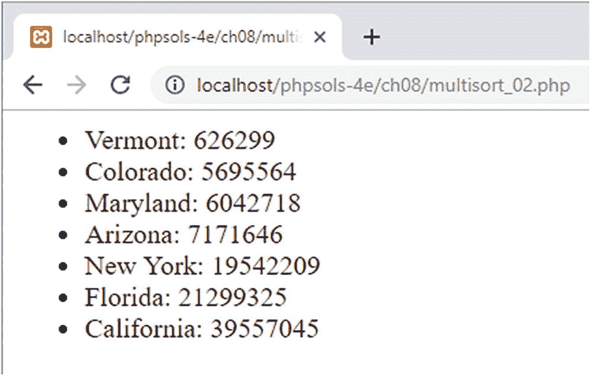

**图 8-4.** 人口数字现在按升序排列，并与之保持了正确的州名称。

下一个 PHP 解决方案展示了一个使用 `array_multisort()` 按多个维度对多维数组进行重新排序的示例。

## PHP Solution 8-6：使用 `array_multisort()` 排序多维数组

在前一个 PHP 解决方案中，我们使用了太空船操作符通过比较分配给单个键的值来自定义排序多维数组。在本解决方案中，我们将使用 `array_multisort()` 来执行更复杂的排序操作。

1.  `multisort_03.php` 中的代码包含了来自 PHP Solution 8-5 的 `$playlist` 多维数组的更新版本。每个子数组中都添加了一个评级（rating）键，如下所示：

    ```php
    $playlist = [
        ['artist' => 'Jethro Tull', 'track' => 'Locomotive Breath', 'rating' => 8],
        ['artist' => 'Dire Straits', 'track' => 'Telegraph Road', 'rating' => 7],
        ['artist' => 'Mumford and Sons', 'track' => 'Broad-Shouldered Beasts', 'rating' => 9],
        ['artist' => 'Ed Sheeran', 'track' => 'Nancy Mulligan', 'rating' => 10],
        ['artist' => 'Dire Straits', 'track' => 'Sultans of Swing', 'rating' => 9],
        ['artist' => 'Jethro Tull', 'track' => 'Aqualung', 'rating' => 10],
        ['artist' => 'Mumford and Sons', 'track' => 'Thistles and Weeds', 'rating' => 6],
        ['artist' => 'Ed Sheeran', 'track' => 'Eraser', 'rating' => 8]
    ];
    ```

2.  正如之前的解决方案所展示的，使用 `usort()` 和太空船操作符按曲目名称的字母顺序对数组排序很容易。我们也可以按评级对数组排序；但同时按评级和曲目排序则需要不同的方法。


