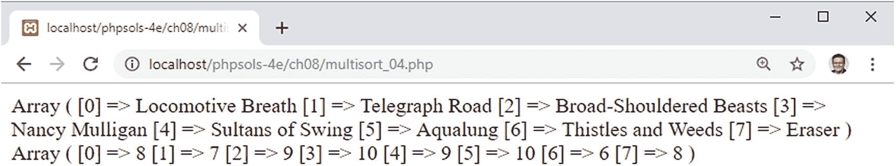
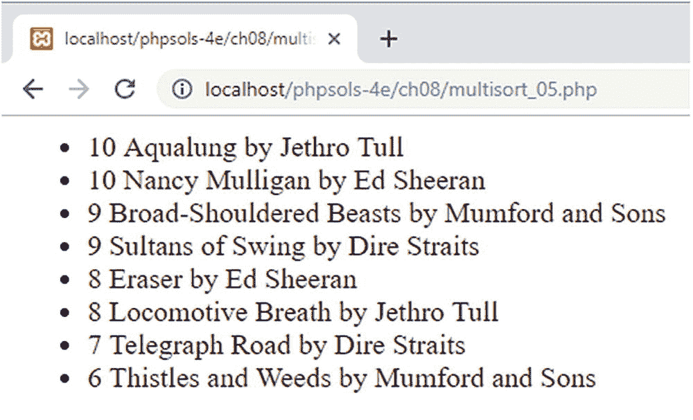

# 按多条件排序多维数组

按多条件排序多维数组的第一步是将待排序的值提取到独立的数组中。使用`array_column()`函数可以轻松实现，该函数接受两个参数：顶层数组和要从每个子数组中提取的键。在`$playlist`数组（位于`multisort_04.php`中）之后添加以下代码：

```php
$tracks = array_column($playlist, 'track');
$ratings = array_column($playlist, 'rating');
print_r($tracks);
print_r($ratings);
```

3. 保存文件并在浏览器中测试。如图 8-5 所示，多维数组中的值已被提取到两个索引数组中。



**图 8-5.** 排序所需的值已被提取到独立的索引数组中

4. 我们不再需要检查`$tracks`和`$ratings`数组的内容，因此注释掉或删除两处`print_r()`调用。

5. 现在，我们可以使用`array_multisort()`对多维数组进行排序。传递给该函数的参数顺序决定了最终排序的优先级。我希望播放列表先按评分降序排列，然后按曲目名称字母顺序排列。因此，第一个参数需要是`$ratings`数组，后跟排序方向；然后是`$tracks`数组，后跟排序方向；最后是`$playlist`，即多维数组。

在脚本底部添加以下代码：

```php
array_multisort($ratings, SORT_DESC, $tracks, SORT_ASC, $playlist);
```

6. 多维数组现在已从最高评分到最低评分重新排序，评分相同的曲目按字母顺序排列。我们可以通过如下方式遍历`$playlist`数组来验证（代码位于`multisort_05.php`中）：

```php
echo '<ul>';
foreach ($playlist as $item) {
    echo "<li>{$item['rating']} {$item['track']} by {$item['artist']}</li>";
}
echo '</ul>';
```

图 8-6 证明了它已生效。



**图 8-6.** 多维数组已按多条件排序

> **注意：** 在上述 PHP 解决方案中，`array_column()`与关联子数组一起使用，因此第二个参数是一个包含要提取值的键的字符串。该函数也能够从索引子数组中提取值。只需将要提取值的索引作为第二个参数传递即可。你将在下一章的 PHP 解决方案 9-6“调整类以处理多文件上传”中看到一个实际示例。