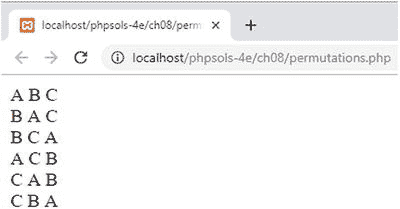

# PHP 解决方案 8-7：查找数组的所有排列

此 PHP 解决方案改编自 Python。它在递归生成器（参见第 4 章的“生成器——一种特殊的持续产出函数”）内部使用`array_slice()`和`array_merge()`函数，将数组拆开并以不同顺序重新合并元素。它是递归的，因为生成器重复调用自身，直到处理完所有元素。

1. 生成器的定义如下所示（代码位于`ch08`文件夹的`permutations.php`中）：

```php
function permutations(array $elements) {
    $len = count($elements);
    if ($len <= 1) {
        yield $elements;
    } else {
        foreach(permutations(array_slice($elements, 1)) as $permutation) {
            foreach(range(0, $len - 1) as $i) {
                yield array_merge(
                    array_slice($permutation, 0, $i),
                    [$elements[0]],
                    array_slice($permutation, $i)
                );
            }
        }
    }
}
```

第 7 行开始的`foreach`循环使用`array_slice()`函数递归调用生成器，提取除第一个元素之外的所有元素。在 PHP 解决方案 8-4“以逗号连接数组”中使用`array_slice()`时，我们传递了三个参数：数组、起始元素的索引以及要提取的元素数量。在这里，仅使用了前两个参数。当省略`array_slice()`的最后一个参数时，它会返回从起始点到数组末尾的所有元素。因此，如果字母`ABC`作为数组传递给它，`array_slice($elements, 1)`将返回`BC`，这在循环内部被称为`$permutation`。

嵌套的`foreach`循环使用`range()`函数创建一个从 0 到`$elements`数组长度减 1 的数字数组。每次循环运行时，生成器都会使用`array_merge()`和`array_slice()`的组合产生一个重新排序的数组。第一次循环运行时，计数器`$i`为`0`，因此`array_slice($permutation, 0, 0)`从`BC`中提取不到任何内容。`$elements[0]`为`A`，而`array_slice($permutation, 0)`为`BC`。结果，原始数组`ABC`被产出。

下次循环运行时，`$i`为`1`，因此从`$permutation`中提取`B`，`$elements[0]`仍然是`A`，而`array_slice($permutation, 1)`为`C`，产出的结果为`BAC`，以此类推。

2. 要使用`permutations()`生成器，将一个索引数组作为参数传递，并将生成器赋值给一个变量，如下所示：

```php
$perms = permutations(['A', 'B', 'C']);
```

3. 然后，你可以使用`foreach`循环与生成器一起获取数组的所有排列（代码位于`permutations.php`中）：

```php
foreach ($perms as $perm) {
    echo implode(' ', $perm) . '<br>';
}
```

这将显示 ABC 的所有排列，如下面的截图所示：

