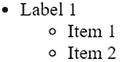

# 处理数组数据

在本节中，我们将研究两个用于处理存储在数组中的数据的 PHP 解决方案：从多维关联数组自动构建 HTML 嵌套列表，以及从 JSON 源中提取数据。

## PHP 解决方案 8-8：自动构建嵌套列表

此 PHP 解决方案重新探讨了标准 PHP 库（SPL）中的`RecursiveIteratorIterator`，我们在第 7 章的“使用 FilesystemIterator 检查文件夹内容”中使用了它来深入文件系统。像`RecursiveIteratorIterator`这样的类的一个有用特性是，你可以通过扩展它们来根据自己的需求进行调整。当你扩展一个类时，**子类**——通常被称为**子类**——会继承其父类的所有公共和受保护的方法和属性。你可以添加新的方法和属性，或通过覆盖来改变父类方法的工作方式。`RecursiveIteratorIterator`暴露了几个公共方法，这些方法可以被覆盖，以便在遍历多维关联数组时在数组键和值之间注入 HTML 标签。

> **注意：** 类可以将方法和属性声明为公共、受保护或私有。公共意味着可以在类定义外部访问它们。受保护意味着只能在该类或其子类内部访问。私有意味着只能在该类定义内部访问，而不能在子类中访问。

在构建 PHP 脚本之前，让我们检查一下 HTML 中嵌套列表的结构。下图展示了一个简单的嵌套列表：



HTML 代码如下所示：

```
<ul>
  <li>标签 1
    <ul>
      <li>项目 1</li>
      <li>项目 2</li>
    </ul>
  </li>
</ul>
```


