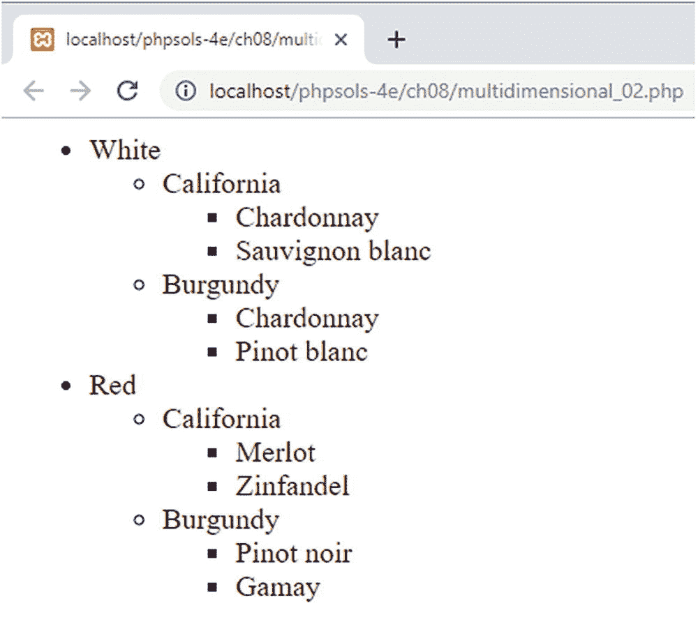
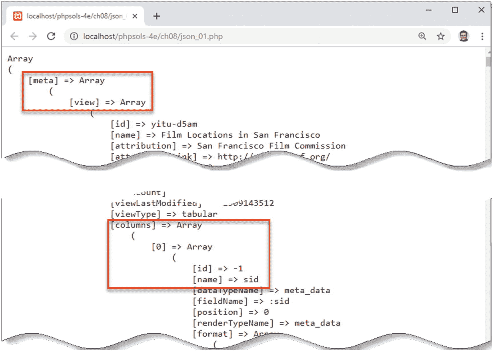
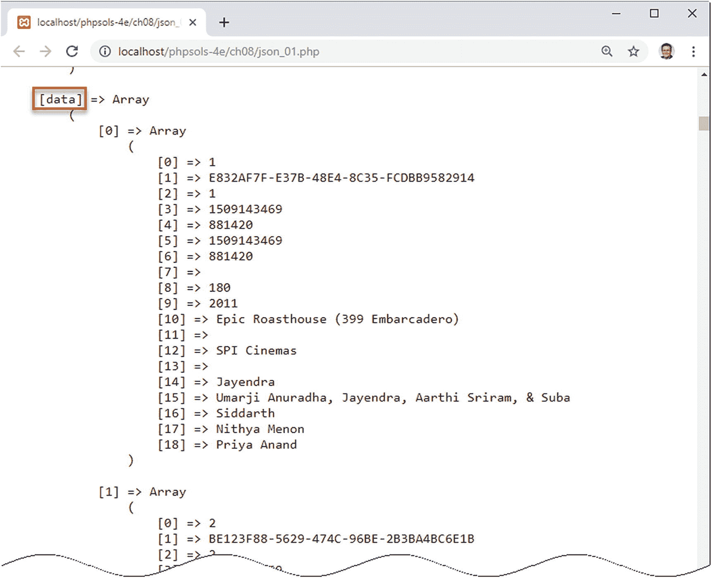
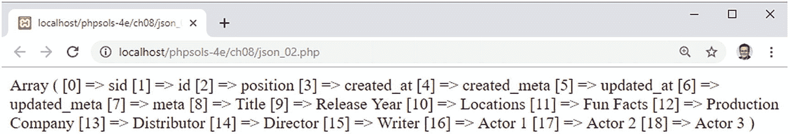
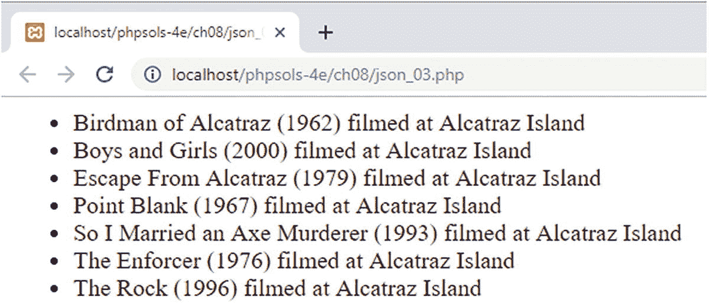

# Markdown 文档排版结果

需要注意的关键点是，缩进列表是嵌套在顶层列表项内部的。标签 1 的闭合 `</li>` 标签位于嵌套列表的闭合 `</ul>` 标签之后。手工编写 HTML 嵌套列表容易出错，因为很难追踪列表项的起始和结束位置。在使用 PHP 自动化处理嵌套列表时，我们必须牢记这种结构。

1. 在 `ch08` 文件夹中创建一个名为 `ListBuilder.php` 的文件。如果你只想研究完成的代码，它位于 `ListBuilder_end.php` 中，并附有注释。

2. 定义一个名为 `ListBuilder` 的类，使其继承 `RecursiveIteratorIterator`，并为待处理的数组和输出的 HTML 创建两个受保护的属性：

```php
class ListBuilder extends RecursiveIteratorIterator
{
protected $array;
protected $output = '';
}
```

`$output` 属性被初始化为一个空字符串。

3. 大多数类都有一个构造方法，用于初始化类并接受任意参数。`ListBuilder` 类需要一个数组作为参数，并对其进行预处理。将以下代码添加到类定义中（所有 `ListBuilder` 的代码需放在步骤 2 中代码的闭合花括号之前）：

```php
public function __construct(array $array) {
$this->array = new RecursiveArrayIterator($array);
// 调用 RecursiveIteratorIterator 的父构造方法
parent::__construct($this->array, parent::SELF_FIRST);
}
```

所有类的构造方法名称相同，并且以双下划线开头。该构造方法接受一个参数：将被转换为嵌套无序列表的数组。

要使用 SPL 迭代器处理数组，必须先将数组转换为迭代器，因此构造方法中的第一行创建了一个新的 `RecursiveArrayIterator` 实例，并将其赋值给 `ListBuilder` 的 `$array` 属性。

由于我们重写了 `RecursiveIteratorIterator` 的构造方法，需要调用父构造方法并将 `$array` 属性作为第一个参数传递给它。将 `parent::SELF_FIRST` 作为第二个参数调用，可以访问正在处理的数组的键和值。如果没有第二个参数，我们将无法访问这些键。

> **提示：** 你将在第 [9](https://example.org/9) 章和第 [10](https://example.org/10) 章中了解更多关于类和类扩展的内容。



**图 8-7.** `ListBuilder` 继承自 `RecursiveIteratorIterator`，用于自动化地从多维关联数组构建嵌套列表

4. HTML 无序列表以开闭 `<ul>` 标签开始和结束。`RecursiveIteratorIterator` 提供了在循环开始和结束时自动调用的公共方法，因此我们可以重写这些方法，使用组合连接运算符将必要的标签添加到 `$output` 属性中，如下所示：

```php
public function beginIteration() {
$this->output .= '';
}
public function endIteration() {
$this->output .= '';
}
```

5. 在每个子数组的开始和结束时，也会自动调用两个公共方法。我们可以利用这两个方法插入嵌套列表的起始 `<ul>` 标签，以及关闭嵌套列表及其父列表项：

```php
public function beginChildren() {
$this->output .= '';
}
public function endChildren() {
$this->output .= '';
}
```

6. 要处理每个数组元素，我们可以重写自动调用的 `nextElement()` 公共方法……是的，你猜对了。这部分稍微复杂一些，因为我们需要检查当前元素是否包含子数组。如果包含，需要添加一个起始 `<li>` 标签和子数组的键。否则，需要在 `<li>` 标签之间添加当前值，如下所示：

```php
public function nextElement() {
// 检查是否存在子数组
if (parent::callHasChildren()) {
// 显示子数组的键
$this->output .= '' . self::key();
} else {
// 显示当前数组元素
$this->output .= '' . self::current() . '';
}
}
```

这段代码大部分不言自明。条件语句调用了父类的——换句话说，就是 `RecursiveIteratorIterator` 的——`callHasChildren()` 方法。如果当前元素包含子元素（即子数组），则返回 `true`。如果包含，则将起始 `<li>` 标签连接到 `$output` 属性，后面跟上 `self::key()`。这会调用 `ListBuilder` 的 `key()` 方法（该方法继承自 `RecursiveIteratorIterator`），以获取当前键的值。这里没有闭合的 `</li>` 标签，因为要等到子数组处理完成后才会添加。

`else` 子句在当前元素没有子元素时执行。它调用了 `current()` 方法获取当前元素的值，该值被包裹在一对 `<li>` 标签之间。

7. 要显示嵌套列表，我们需要遍历数组并返回 `$output` 属性。我们可以使用魔术方法 `__toString()`。像这样定义它：

```php
public function __toString() {
// 生成列表
$this->run();
return $this->output;
}
```

8. 要完成 `ListBuilder` 类的定义，像这样定义 `run()` 方法：

```php
protected function run() {
self::beginIteration();
while (self::valid()) {
self::next();
}
self::endIteration();
}
```

这段代码简单地调用了从 `RecursiveIteratorIterator` 继承的四个方法。它们首先调用 `beginIteration`，然后通过 `while` 循环遍历数组，最后结束迭代。

9. 要测试 `ListBuilder`，打开 `ch08` 文件夹中的 `multidimensional_01.php` 文件。其中包含一个名为 `$wines` 的多维关联数组。引入 `ListBuilder` 的定义，然后通过添加以下代码生成并显示输出（完成的代码位于 `multidimensional_02.php` 中）：

```php
require './ListBuilder.php';
echo new ListBuilder($wines);
```

图 8-7 显示了结果。

## PHP 解决方案 8-9：从 JSON 提取数据

在上一章中，我们使用 `SimpleXML` 解析了 RSS 新闻源。RSS 和其他形式的 XML 在分发数据时的缺点是，包裹数据的标签使数据变得冗长。JavaScript 对象表示法（JSON）因其简洁性而越来越多地用于在线数据分发。简洁的格式使 JSON 下载速度更快，且占用更少的带宽，但其缺点是不易阅读。

本 PHP 解决方案从旧金山开放数据（[`https://datasf.org/opendata/`](https://datasf.org/opendata/)）访问一个 JSON 源，将其转换为数组，构建一个数据的多维关联数组，然后进行过滤以提取所需信息。听起来工作量很大，但实际上涉及的代码相对较少。

1. 本 PHP 解决方案的 JSON 数据源位于 `ch08/data` 文件夹中的 `film_locations.json` 文件中。或者，你也可以从 [`https://data.sfgov.org/api/views/yitu-d5am/rows.json?accessType=DOWNLOAD`](https://data.sfgov.org/api/views/yitu-d5am/rows.json%3FaccessType%3DDOWNLOAD) 获取最新版本。如果你访问的是在线版本，请将其保存为本地硬盘上的 `.json` 文件，以避免反复访问远程源。

## 2. 此数据源包含由旧金山电影委员会编制的市内电影取景地信息。处理 JSON 的挑战之一在于定位所需信息，因为缺乏通用的命名规范。尽管此数据源已按行缩进格式化，但 JSON 通常为保持紧凑而省略空白。将其转换为多维关联数组可简化识别过程。请在 `ch08` 文件夹中创建一个名为 `json.php` 的 PHP 文件，并添加以下代码（该代码位于 `json_01.php` 中）：

```php
$json = file_get_contents('./data/film_locations.json');
$data = json_decode($json, true);
echo '<pre>';
print_r($data);
echo '</pre>';
```

此代码使用 `file_get_contents()` 从数据文件中获取原始 JSON，将其转换为多维关联数组，然后显示出来。向 `json_decode()` 传入 `true` 作为第二个参数，会将 JSON 对象转换为 PHP 关联数组。

## 3. 保存文件并在浏览器中运行该脚本。`$data` 数组非常庞大，包含超过 1,600 部电影的详细信息。用 `<pre>` 标签包裹 `print_r()` 可以轻松检查其结构，从而定位重要数据所在位置。如图 8-8 所示，顶层数组名为 `meta`，其内嵌套了一个名为 `view` 的子数组，而 `view` 中又包含了一个名为 `columns` 的子数组。



`columns` 子数组包含一个索引数组；其第一个元素内部又是一个包含名为 `name` 键的数组。当您继续向下滚动，找到名为 `data` 的数组时（见图 8-9），其意义便会清晰明了。



这里存储了所有关键信息。它包含一个拥有超过 1,600 个元素的索引子数组，其中每个元素又包含另一个具有 19 个元素的索引数组。数据并非重复列名数千次，而是映射到图 8-8 中标识的名称数组。要提取所需信息，需要为 `data` 数组中的每部电影构建一个关联数组。

## 1. 我们可以使用 PHP 解决方案 8-6“使用 `array_multisort()` 对多维数组排序”中遇到的 `array_column()` 函数来获取列名。然而，`name` 元素深藏在步骤 2 中存储为 `$data` 的顶层数组中。图 8-8 中的缩进有助于找到正确的子数组作为第一个参数传入。请向脚本中添加以下代码（该代码位于 `json_02.php` 中）：

```php
$col_names = array_column($data['meta']['view']['columns'], 'name');
```

## 2. 使用 `print_r()` 检查是否已提取正确的值，如图 8-10 所示。



## 3. 现在已获得列名，我们可以遍历 `data` 子数组，使用 `array_combine()` 将每个元素转换为关联数组。请向脚本中添加以下代码：

```php
$locations = [];
foreach ($data['data'] as $datum) {
    $locations[] = array_combine($col_names, $datum);
}
```

这段代码将 `$locations` 初始化为空数组，然后遍历 `data` 子数组，将 `$col_names` 和当前值数组传递给 `array_combine()`。这使得相应的列名被分配为每个值的键。`data` 的缩进级别（见图 8-9）表明 `data` 子数组与 `meta` 处于同一层级（见图 8-8）。

## 4. `$locations` 现在包含一个关联数组的数组，每个关联数组都包含 JSON 数据源中列出的超过 1,600 个电影取景地的详细信息。要定位特定信息，我们可以使用 `array_filter()` 函数，该函数接受一个数组和一个回调函数作为参数，并返回过滤后的新数组。

回调函数接受一个参数，即当前被过滤器检查的元素。这意味着过滤条件需要在回调函数中硬编码。为了使回调函数更具适应性，我将使用一个能够从全局作用域继承变量的匿名函数。按如下方式定义搜索词和回调函数：

```php
$search = 'Alcatraz';
$getLocation = function ($location) use ($search) {
    return (stripos($location['Locations'], $search) !== false);
};
```

匿名函数被赋值给一个变量。它接受一个参数，但通过 `use` 关键字访问 `$search` 变量。在函数内部，`stripos()` 函数对当前数组的 `Locations` 元素执行不区分大小写的搜索。由于 `stripos()` 返回搜索词被发现的位置，如果搜索词位于开头（位置 `0`），结果会是假阴性，因此我们需要确保返回值不是布尔值 `false`。

## 5. 现在我们可以过滤 `$locations` 数组并显示结果，如下所示（完整代码位于 `json_03.php` 中）：

```php
$filtered = array_filter($locations, $getLocation);
echo '<pre>';
foreach ($filtered as $item) {
    echo "{$item['Title']} ({$item['Release Year']}) filmed at {$item['Locations']}";
}
echo '</pre>';
```

## 6. 保存脚本并在浏览器中测试。您应该会看到如图 8-11 所示的结果。



## 7. 将 `$search` 的值更改为旧金山的其他地点名称，例如 Presidio 或 Embarcadero，以查看在那里拍摄的电影名称。