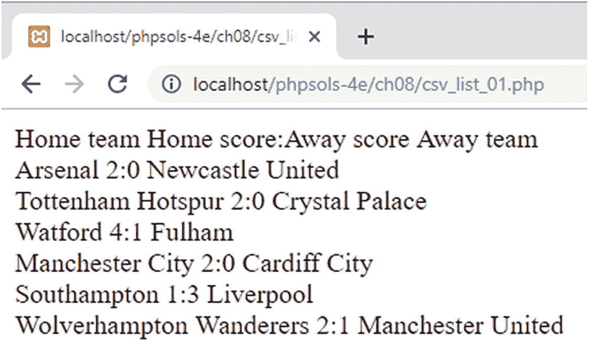
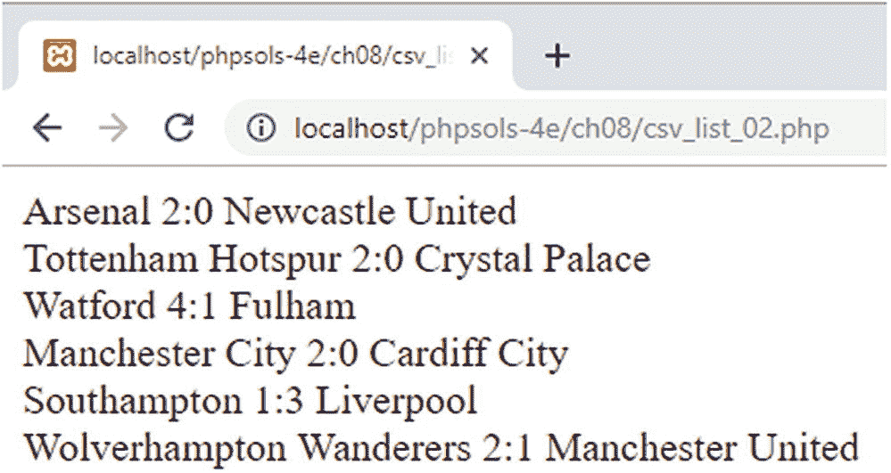

# 自动将数组元素赋值给变量

毫无疑问，关联数组非常有用，但它们的缺点是在输入和嵌入双引号字符串时比较繁琐。因此，通常会将关联数组元素赋值给简单变量，如下所示：

```php
$name = $_POST['name'];
$email = $_POST['email'];
$message = $_POST['message'];
```

然而，有一些方法可以简化此过程，如下所述。

## 使用 `extract()` 函数

`extract()` 函数最基本的形式是根据关联数组的键名，自动将数组的值赋给变量。换句话说，您可以通过简单地执行以下操作，达到与上述三行代码相同的结果：

```php
extract($_POST);
```

### 注意

使用 `extract()` 处理来自用户输入（例如 `$_POST` 或 `$_GET` 数组）的未过滤数据，被认为是一项重大的安全风险。恶意攻击者可能会尝试注入变量，覆盖您已经定义的值。

在最简单的使用形式下，`extract()` 函数是一种粗放的工具。除非你确切知道关联数组中的键，否则会有覆盖现有变量的风险。为克服这一问题，该函数可以接受两个可选参数：一个是八个 PHP 常量之一，用于决定在命名冲突时如何处理；另一个是可用于为变量名添加前缀的字符串。你可以在在线文档 [`www.php.net/manual/en/function.extract.php`](http://www.php.net/manual/en/function.extract.php) 中找到这些选项的详细信息。

尽管可选参数优化了 `extract()` 的行为，但使用它们却降低了函数本身提供的便利性。`extract()` 还有另一个缺点：它无法处理包含变量名中非法字符的键。例如，以下是一个完全有效的关联数组：

```php
$author = ['first name' => 'David', 'last name' => 'Powers'];
```

尽管键包含空格，`$author['first name']` 和 `$author['last name']` 仍然是有效的。然而，将 `$author` 数组传递给 `extract()` 将导致不会创建任何变量。这些局限性大大降低了 `extract()` 的价值。

## 使用 `list()`

虽然括号让 `list()` 看起来像一个函数，但从技术上讲，它并不是；它是一个 PHP 语言结构，用于在单次操作中将一个变量列表赋值给一个值的数组。它自 PHP 4 起就已存在，但在 PHP 7.1 及更高版本中得到了显著增强。

在 PHP 7.1 之前，`list()` 仅适用于索引数组。你按值在数组中出现的顺序列出要赋值的变量名。以下 `list_01.php` 中的示例展示了其工作原理：

```php
$person = ['David', 'Powers', 'London'];
list($first_name, $last_name, $city) = $person;
// 输出 "David Powers lives in London."
echo "$first_name $last_name lives in $city.";
```

在 PHP 7.1 及更高版本中，`list()` 也可以用于关联数组。其语法与创建字面关联数组的语法类似。使用双箭头运算符将关联数组键赋值给一个变量。由于每个数组键标识其关联的值，它们不必按数组中的顺序列出，也不必使用所有键，如下面 `list_02.php` 中的示例所示：

```php
$person = [
'first name' => 'David',
'last name' => 'Powers',
'city' => 'London',
'country' => 'the UK'];
list('country' => $country,
'last name' => $surname,
'first name' => $name) = $person;
// 输出 "David Powers lives in the UK."
echo "$name $surname lives in $country.";
```

### 对 `list()` 使用数组简写语法

PHP 7.1 的另一个增强是可以在 `list()` 中使用数组简写语法。前两个示例中的变量赋值可以简化为如下形式（完整代码在 `list_03.php` 和 `list_04.php` 中）：

```php
[$first_name, $last_name, $city] = $person;
['country' => $country, 'last name' => $surname, 'first name' => $name] = $person;
```

## PHP 解决方案 8-10：使用生成器处理 CSV 文件

本 PHP 解决方案改编了 PHP 解决方案 7-2“从 CSV 文件中提取数据”中的脚本，以使用生成器处理 CSV 文件，并使用 `list()` 数组简写将每行生成的数组中的值赋值给变量。

1.  打开 `ch08` 文件夹中的 `csv_processor.php`。它包含一个名为 `csv_processor()` 的生成器的定义如下：

```php
// 将 CSV 文件的每一行作为数组生成的生成器
function csv_processor($csv_file) {
if (@!$file = fopen($csv_file, 'r')) {
echo "无法打开 $csv_file。";
return;
}
while (($data = fgetcsv($file)) !== false) {
yield $data;
}
fclose($file);
}
```

该生成器接受一个参数，即 CSV 文件的名称。它使用第 7 章中描述的文件操作函数以读取模式打开文件。如果文件无法打开，错误控制运算符（`@`）会抑制任何 PHP 错误消息，显示自定义消息并返回，从而阻止进一步处理文件的尝试。

假设文件成功打开，`while` 循环将每次向 `fgetcsv()` 函数传递一行，该函数将数据作为数组返回，并由生成器生成。当循环结束时，文件被关闭。

这是一个方便的工具函数，可用于处理任何 CSV 文件。

2.  在 `ch08` 文件夹中创建一个名为 `csv_list.php` 的文件，并包含 `csv_processor.php`：

```php
require_once './csv_processor.php';
```

3.  在 `ch08/data` 文件夹中，`scores.csv` 包含以下以逗号分隔值存储的数据：

```
Home team,Home score,Away team,Away score
Arsenal,2,Newcastle United,0
Tottenham Hotspur,2,Crystal Palace,0
Watford,4,Fulham,1
Manchester City,2,Cardiff City,0
Southampton,1,Liverpool,3
Wolverhampton Wanderers,2,Manchester United,1
```

4.  通过创建 `csv_processor()` 生成器的实例来加载 CSV 文件中的数据，如下所示：

```php
$scores = csv_processor('./data/scores.csv');
```

5.  使用生成器最简单的方式是使用 `foreach` 循环。每次循环运行时，生成器将 CSV 文件的当前行作为索引数组生成。使用 `list()` 数组简写将数组值赋值给变量，然后使用 `echo` 显示它们，如下所示：

```php
foreach ($scores as $score) {
[$home, $hscore, $away, $ascore] = $score;
echo "$home $hscore:$ascore $away";
}
```

6.  保存文件并通过在浏览器中加载来运行脚本。或者，使用 `ch08` 文件夹中的 `csv_list_01.php`。如图 8-12 所示，输出包含 CSV 文件中的列标题行。



**图 8-12.** 生成器处理 CSV 文件的每一行，包括列标题。

7. 使用 `foreach` 循环的问题在于它会处理 CSV 文件中的每一行。我们可以在每次循环运行时递增一个计数器，并使用 `continue` 关键字跳过第一行。然而，生成器有内置方法，允许我们在要生成的值之间移动并检索当前值。按如下方式编辑步骤 5 中的代码（更改以粗体突出显示）：

```
$scores->next();
while ($scores->valid()) {
    [$home, $hscore, $away, $ascore] = $scores->current();
    echo "$home $hscore:$ascore $away";
    $scores->next();
}
```

修改后的代码使用 `while` 循环代替了 `foreach` 循环，该循环调用生成器的 `valid()` 方法。只要生成器至少还有一个值要生成，该方法就返回 `true`。因此，这具有遍历正在处理的 CSV 文件中每一行的效果。

要跳过第一行，在循环开始前调用 `next()` 方法。顾名思义，这会将生成器移动到下一个可用的值。在循环内部，`current()` 方法返回当前值，而 `next()` 方法移动到下一个值，为循环的下一次运行做准备。

8. 保存文件并再次运行脚本（代码在 `csv_list_02.php` 中）。这次只显示比分，如图 8-13 所示。



**图 8-13.** 在遍历其余值之前，第一行已被跳过。