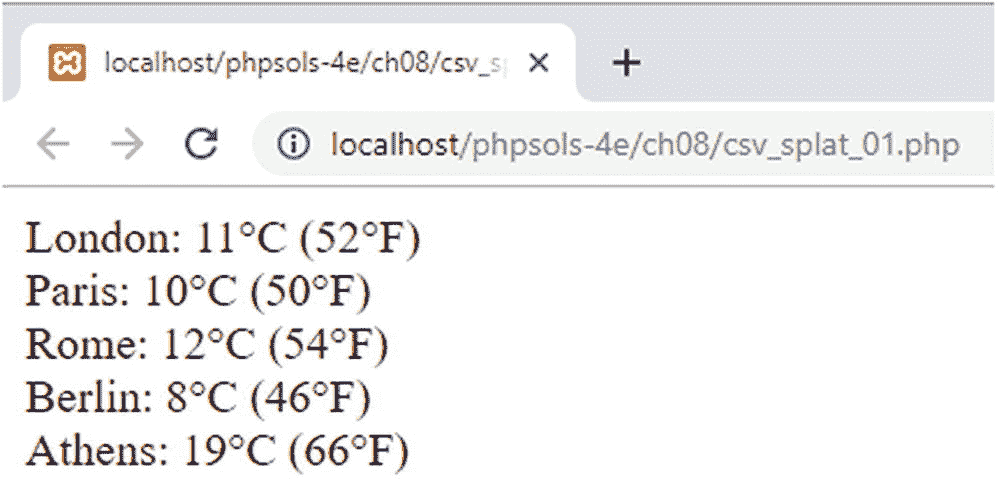

# 使用展开运算符从数组中解包参数

第 4 章简要介绍的展开运算符（`...`）有两个作用，即：

- 在函数定义中使用时，它将多个参数转换为可在函数内部使用的数组。
- 在调用函数时，它会解包参数数组，并将其应用于函数的参数。

第 4 章的示例演示了展开运算符的第一种用法。以下函数定义允许向函数传递任意数量的参数，并在函数内部将其作为数组处理：

```
function addEm(...$nums) {
    return array_sum($nums);
}
```

展开运算符的第二种用法则相反。它不是将任意数量的参数转换为数组，而是将数组的元素视为单独传递给函数。以下 PHP 解决方案展示了一个简单示例，说明这如何具有实际价值。

## PHP 解决方案 8-11：使用展开运算符处理 CSV 文件

`fgetcsv()` 函数将 CSV 文件中的数据作为索引数组返回。此 PHP 解决方案展示了如何使用展开运算符将数组直接传递给需要多个参数的函数，而无需分离各个元素。它还使用了上一 PHP 解决方案中描述的 `csv_processor()` 生成器。



**图 8-14.** 每个数据数组都通过展开运算符直接传递给函数进行处理

1.  在 `ch08` 文件夹中创建一个名为 `csv_splat.php` 的文件，并包含 `csv_processor.php`：

    ```
    require_once './csv_processor.php';
    ```

2.  在 `ch08/data` 文件夹中，`weather.csv` 包含以下数据：

    ```
    City,temp
    London,11
    Paris,10
    Rome,12
    Berlin,8
    Athens,19
    ```

    温度以摄氏度为单位。为了那些认为水在 32° 而非 0° 结冰的人着想，我们需要以用户友好的方式处理这些数据。

3.  在 `csv_splat.php` 中，添加以下函数定义（代码位于 `csv_splat_01.php`）：

    ```
    function display_temp($city, $temp) {
        $tempF = round($temp/5*9+32);
        return "$city: $temp&deg;C ($tempF&deg;F)";
    }
    ```

    该函数接受两个参数：城市名称和温度。温度使用标准公式（除以 5，乘以 9，再加 32）转换为华氏度，并四舍五入到最接近的整数。

    然后，函数返回一个字符串，包含城市名称和以摄氏度表示的温度，后跟括号中的华氏等效温度。

4.  包含数据的 CSV 文件以一行列标题开头，因此我们需要使用与上一个解决方案相同的技术跳过第一行。将数据加载到 `csv_processor()` 生成器中，并按如下方式跳过第一行：

    ```
    $cities = csv_processor('./data/weather.csv');
    $cities->next();
    ```

5.  使用 `while` 循环和 `display_temp()` 函数以及展开运算符处理剩余的数据行，如下所示：

    ```
    while ($cities->valid()) {
        echo display_temp(...$cities->current()) . '';
        $cities->next();
    }
    ```

    与上一个解决方案一样，生成器的 `current()` 方法将当前数据行作为数组返回。但这次，不是将每个数组元素赋给变量，而是展开运算符解包数组，并按数组中的相同顺序将值作为参数进行赋值。

    如果你觉得这段代码难以理解，可以先将 `current()` 方法的返回值赋给一个变量，如下所示：

    ```
    $data = $cities->current();
    echo display_temp(...$data) . '';
    ```

    在传递给函数的数组参数前加上展开运算符效果与以下代码完全相同（代码位于 `csv_splat_02.php`）：

    ```
    [$city, $temp] = $cities->current();
    echo display_temp($city, $temp) . '';
    ```

    图 8-14 显示了使用这两种技术的结果。

使用展开运算符解包参数数组具有简洁的优点，但较短的代码并不总是可读性最好的，当结果不符合预期时可能会增加调试难度。就个人而言，我认为将数组元素赋给变量，然后显式地将它们作为参数传递是一种更安全的方法。但即使你不使用某种特定技术，理解其工作原理仍然很有用，以防你需要处理他人的代码。

## 章节回顾

处理数组是 PHP 中最常见的任务之一，尤其是在处理数据库时。几乎所有数据库查询的结果都以关联数组的形式返回，因此理解如何处理它们非常重要。在本章中，我们研究了修改数组、合并数组、排序和提取数据。在循环中使用数组时需记住的要点是，PHP 始终处理数组的副本，除非你通过引用将值传递到循环中。相比之下，排序函数则作用于原始数组。

你可以在 PHP 在线文档 [`www.php.net/manual/en/ref.array.php`](http://www.php.net/manual/en/ref.array.php) 中找到所有数组相关函数的完整详细信息。本章展示了大约一半函数的实际示例，帮助你稳扎稳打，成为 PHP 数组处理方面的专家。

