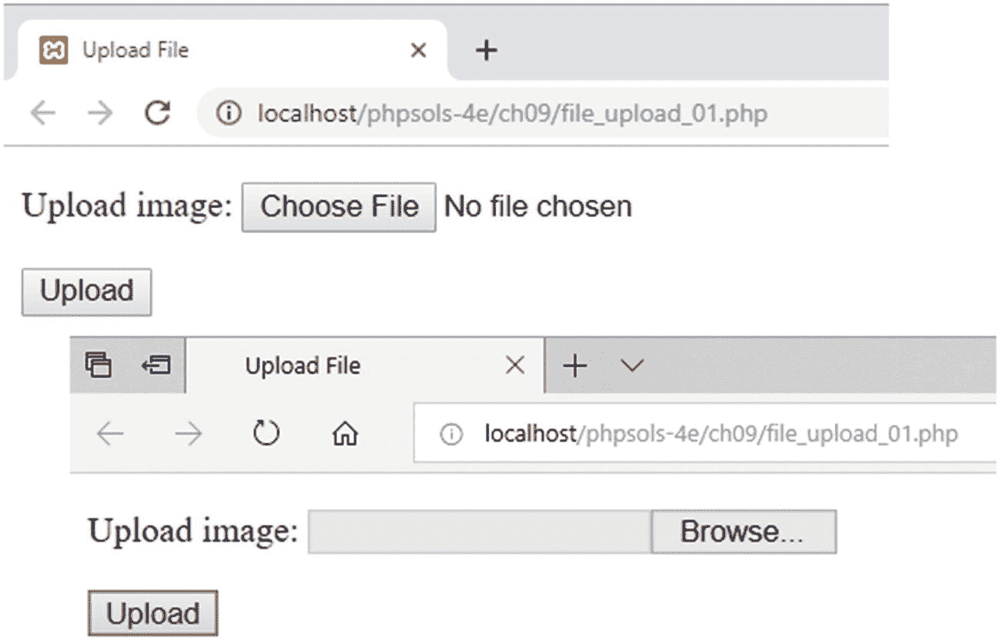
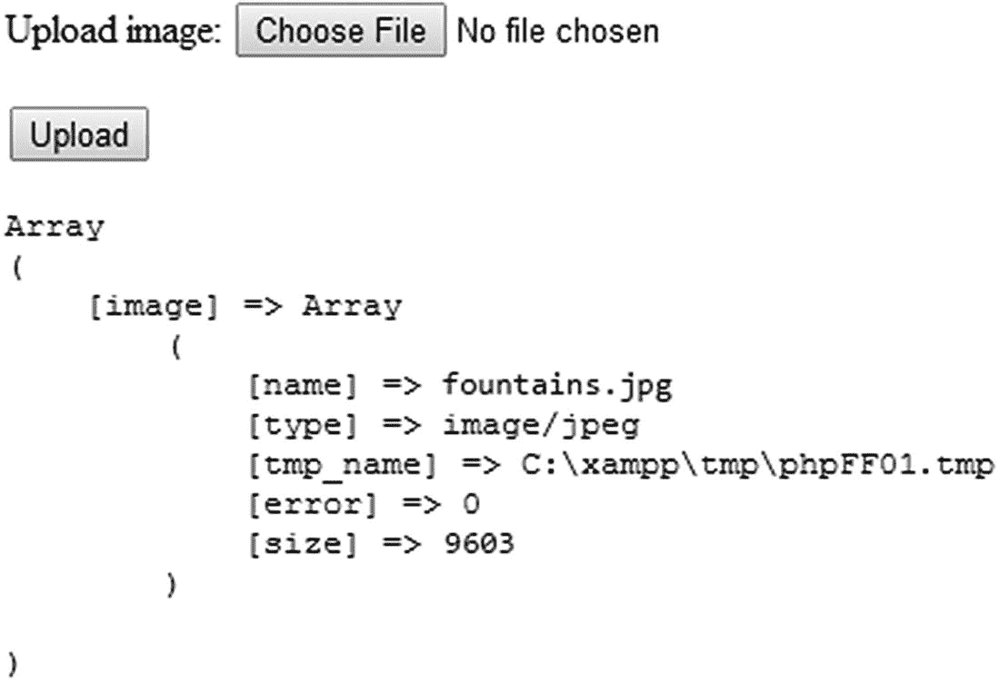
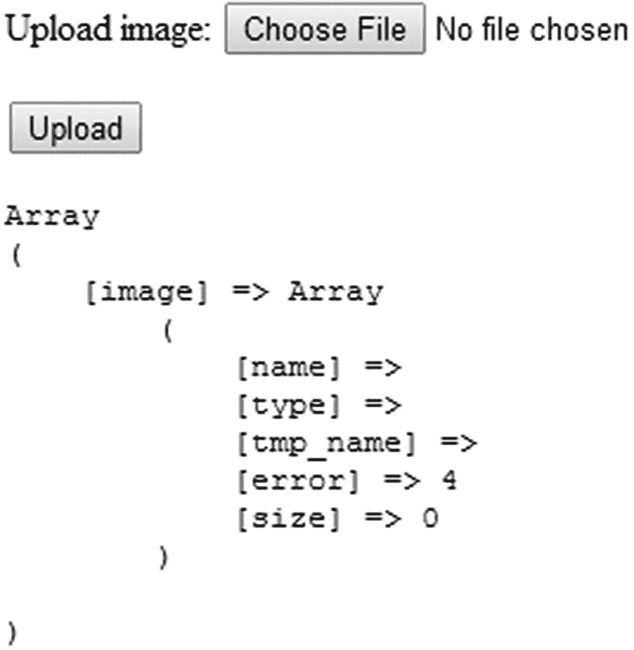

# PHP 如何处理文件上传

“上传”一词指将文件从一台计算机移动到另一台计算机，但对于 PHP 而言，实际上只是将文件从一个位置移动到另一个位置。这意味着你可以在本地计算机上测试本章的所有脚本，无需将文件上传到远程服务器。

PHP 默认支持文件上传，但托管公司可能会限制上传大小或完全禁用上传功能。在开始之前，最好先检查远程服务器的设置。

## 检查服务器是否支持上传

你所需的所有信息都显示在主 PHP 配置页面上，你可以按照第 2 章所述，在远程服务器上运行 `phpinfo()` 来查看此页面。向下滚动，直到在 Core 部分找到 `file_uploads`。

如果 Local Value 为 `On`，一切就绪，但你还应该检查表 9-1 中列出的其他配置设置。

**表 9-1.** 影响文件上传的 PHP 配置设置

| 指令 | 默认值 | 描述 |
| --- | --- | --- |
| `max_execution_time` | 30 | PHP 脚本可以运行的最大秒数。如果脚本运行时间更长，PHP 会生成致命错误。 |
| `max_file_uploads` | 20 | 可以同时上传的最大文件数。多余的文件会被静默忽略。 |
| `max_input_time` | 60 | PHP 脚本解析 `$_POST` 和 `$_GET` 数组以及文件上传所允许的最大秒数。非常大的上传可能会超时。 |
| `post_max_size` | 8M | 所有 `$_POST` 数据的最大允许大小，*包括*文件上传。虽然默认是 8M（8 兆字节），但托管公司可能施加更小的限制。 |
| `upload_tmp_dir` |  | PHP 存储上传文件的位置，直到你的脚本将其移动到永久位置。如果 `php.ini` 中没有定义值，PHP 会使用系统默认的临时目录（`C:\Windows\Temp` 或 Mac/Linux 上的 `/tmp`）。 |
| `upload_max_filesize` | 2M | 单个上传文件的最大允许大小。默认是 2M（兆字节），但托管公司可能施加更小的限制。整数值表示字节数。K 表示千字节，M 表示兆字节，G 表示千兆字节。 |

PHP 7 可以处理大于 2 GB 的单个文件上传，但实际限制由表 9-1 中的设置决定。`post_max_size` 的默认值 8 MB 包含 `$_POST` 数组的内容，因此在典型服务器上可以同时上传的文件总大小小于 8 MB，且单个文件不能大于 2 MB。服务器管理员可以更改这些默认值，因此检查托管公司设置的限值很重要。如果超出这些限值，原本完美的脚本也会失败。

如果 `file_uploads` 的 Local Value 为 `Off`，则表示上传功能已被禁用。除了询问托管公司是否提供已启用文件上传的套餐外，你对此无能为力。唯一的替代方案是更换主机或使用其他解决方案，例如通过 FTP 上传文件。

**提示**  
使用 `phpinfo()` 检查远程服务器设置后，请删除该脚本或将其放入受密码保护的目录中。

## 在表单中添加文件上传字段

向 HTML 表单添加文件上传字段很容易。只需在开头的 `<form>` 标签中添加 `enctype="multipart/form-data"`，并将 `<input>` 元素的 `type` 属性设置为 `file`。以下代码是上传表单的简单示例（位于 `ch09` 文件夹中的 `file_upload_01.php`）：

```
<form action="" method="post" enctype="multipart/form-data">
  <p>
    <input type="file" name="image">
  </p>
  <p>
    <input type="submit" name="upload" value="Upload">
  </p>
</form>
```

虽然这是标准的 HTML，但它在网页中的呈现方式取决于浏览器（参见图 9-1）。许多浏览器会显示“选择文件”或“浏览”按钮，右侧带有一条状态消息或所选文件的名称。Microsoft Edge 会显示一个只读文本输入字段，右侧有一个“浏览”按钮。Edge 在点击字段内部时会立即启动文件选择面板。这些差异不会影响上传表单的操作，但在设计布局时需要考虑到。



**图 9-1.** 文件输入字段的外观取决于浏览器

## 理解 $_FILES 数组

让许多人困惑的是，他们的文件在上传后似乎消失了。这是因为你不能像对待文本输入那样，在 `$_POST` 数组中引用上传的文件。PHP 在一个名为 `$_FILES`（这个命名很合理）的独立超全局数组中传输上传文件的详细信息。此外，文件会上传到临时文件夹，除非你明确将其移动到所需位置，否则会被删除。这使你在接受上传之前可以对文件进行安全检查。

### 检查 $_FILES 数组

理解 `$_FILES` 数组工作原理的最佳方式是实际查看它的运作。你可以在计算机上的本地测试环境中测试所有内容，其工作方式与将文件上传到远程服务器相同。

1. 在 `phpsols-4e` 站点根目录中创建一个名为 `uploads` 的文件夹。在 `uploads` 文件夹中创建一个名为 `file_upload.php` 的文件，并插入上一节的代码。或者，复制 `ch09` 文件夹中的 `file_upload_01.php` 并将文件重命名为 `file_upload.php`。

2. 在结束的 `</form>` 标签后立即插入以下代码（该代码也存在于 `file_upload_02.php` 中）：

    ```
    <?php
    if (isset($_POST['upload'])) {
        echo '<pre>';
        print_r($_FILES);
        echo '</pre>';
    }
    ?>
    ```

    这段代码使用 `isset()` 检查 `$_POST` 数组中是否包含 `upload`（提交按钮的 `name` 属性）。如果包含，则表示表单已提交，因此你可以使用 `print_r()` 检查 `$_FILES` 数组。`<pre>` 标签使输出更易于阅读。

3. 保存 `file_upload.php` 并在浏览器中加载。

4. 单击“浏览”（或“选择文件”）按钮并选择一个本地文件。单击“打开”（在 Mac 上为“选择”）关闭选择对话框，然后单击“上传”。你应该会看到类似图 9-2 的内容。



**图 9-2.** $_FILES 数组包含上传文件的详细信息

`$_FILES` 是一个多维数组——一个由数组组成的数组。顶层包含一个单一元素，其键（或索引）来自文件输入字段的 `name` 属性，在本例中为 `image`。

顶层 `image` 数组包含一个由五个元素组成的子数组，分别是：

* `name`：上传文件的原始名称
* `type`：上传文件的 MIME 类型
* `tmp_name`：上传文件的位置
* `error`：表示上传状态的整数
* `size`：上传文件的大小（以字节为单位）

不要浪费时间查找 `tmp_name` 指示的临时文件：它不会在那里。如果不立即保存，PHP 会将其丢弃。

**注意**  
MIME 类型是浏览器用来确定文件格式及其处理方式的标准。更多信息，请参见 [`https://developer.mozilla.org/en-US/docs/Web/HTTP/Basics_of_HTTP/MIME_types`](https://developer.mozilla.org/en-US/docs/Web/HTTP/Basics_of_HTTP/MIME_types)。



**图 9-3.** 未上传文件时，$_FILES 数组仍然存在


