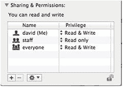

# 2. 建立上传目录

出于安全考虑，通过在线表单上传的文件不应通过浏览器公开访问。换句话说，它们不应位于站点根目录（通常是 `htdocs`、`public_html` 或 `www`）内。在你的远程服务器上，在站点根目录之外创建一个用于上传的目录，并将权限设置为 644（所有者可读写，其他人只读）。

## 2.1. 为 Windows 本地测试创建上传文件夹

对于后续练习，建议你在 C 盘根目录下创建一个名为 `upload_test` 的文件夹。Windows 上没有权限问题，因此你只需完成这一步即可。

## 2.2. 为 macOS 本地测试创建上传文件夹

Mac 用户可能需要做更多准备工作，因为文件权限与 Linux 类似。在你的主目录中创建一个名为 `upload_test` 的文件夹，并按照 PHP 解决方案 9-1 中的说明进行操作。

如果一切顺利，你无需进行额外操作。但如果你收到 PHP“无法打开流”（`failed to open stream`）的警告，请按以下方式更改 `upload_test` 文件夹的权限：

1.  在 Mac 访达中选择 `upload_test`，然后选择“文件”➤“显示简介”（`Cmd+I`）以打开其信息面板。

2.  在“共享与权限”中，点击右下角的挂锁图标以解锁设置，然后将“Everyone”的权限从“只读”更改为“读与写”，如下方截图所示。

3.  再次点击挂锁图标以保存新设置，并关闭信息面板。现在你应该能够使用 `upload_test` 文件夹继续完成本章剩余内容。