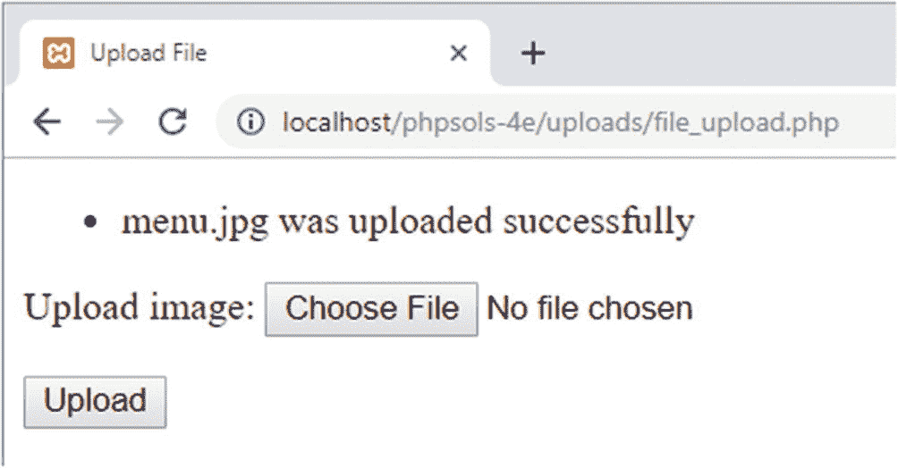
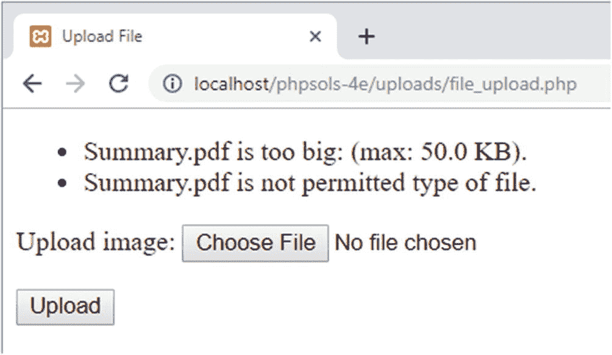
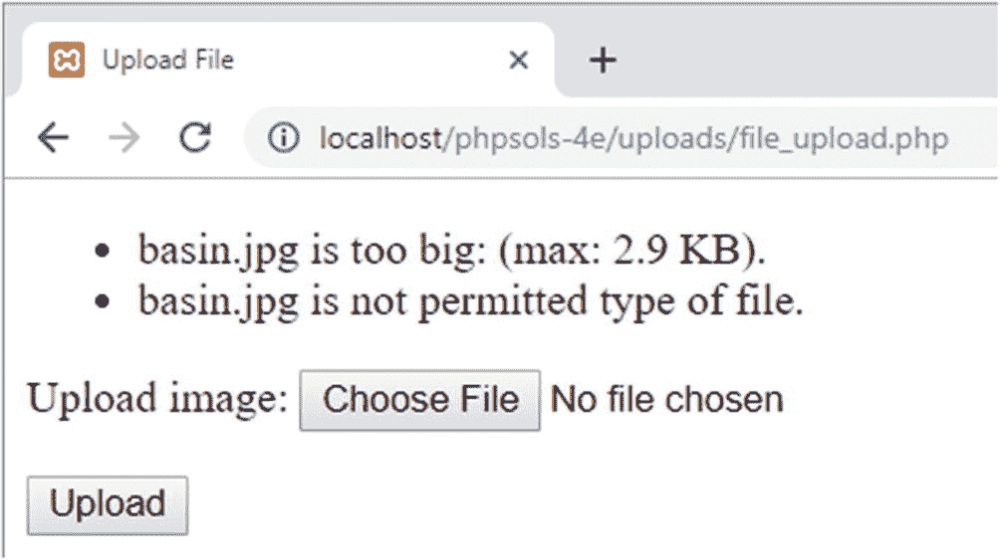
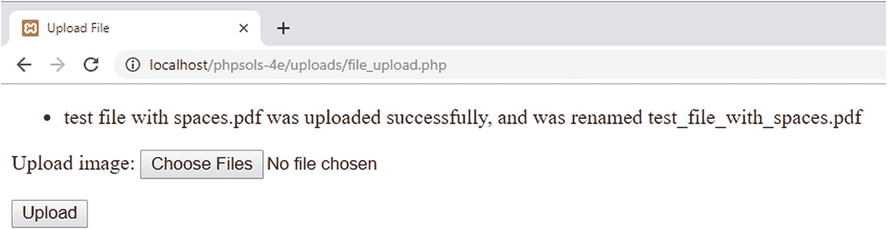
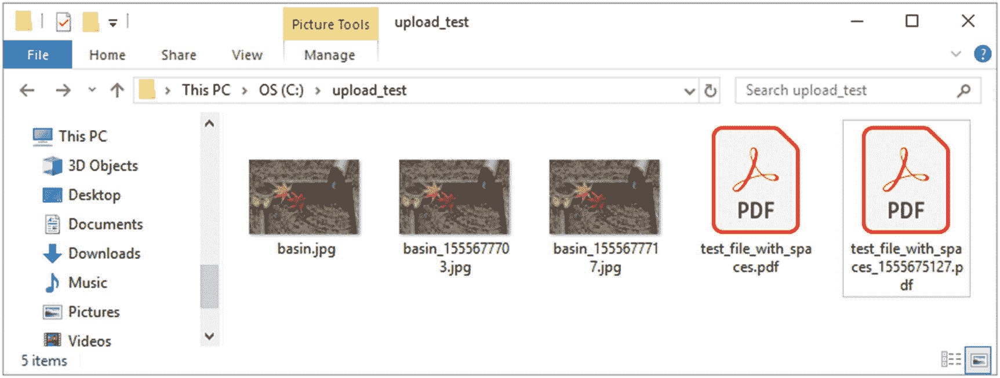

# 提示

类内部函数（方法）定义的顺序无关紧要，只要它们位于包裹该类的花括号内即可。不过，我个人倾向于将所有 `public` 方法放在顶部，而 `protected` 方法放在底部。

1.  如果文件通过了一系列测试，`upload()` 方法中的条件语句会将文件传递给另一个名为 `moveFile()` 的内部方法，该方法本质上是 PHP 方案 9-1 中使用的 `move_uploaded_file()` 函数的包装器。代码如下：

```php
protected function moveFile($file) {
    $success = move_uploaded_file($file['tmp_name'],
    $this->destination . $file['name']);
    if ($success) {
        $result = $file['name'] . ' was uploaded successfully';
        $this->messages[] = $result;
    } else {
        $this->messages[] = 'Could not upload ' . $file['name'];
    }
}
```

如果上传成功，`move_uploaded_file()` 返回 `true`。否则，返回 `false`。通过将返回值存储在 `$success` 中，相应的消息会被存入 `$messages` 数组。如果 `$success` 为 `true`，消息首先赋值给 `$result`；而失败时，则直接赋值给 `$messages` 数组。这是因为，如果文件需要重命名，后续会向成功消息中添加更多信息。

2.  由于 `$messages` 是一个受保护的属性，你需要创建一个公共方法来获取数组的内容。

```php
public function getMessages() {
    return $this->messages;
}
```

这简单返回了 `$messages` 数组的内容。既然它只是做这个，为什么不一开始就将该数组设为公共呢？公共属性可以在类定义之外被访问和修改。保护 `$messages` 确保了数组内容不会被更改，因此你知道消息是由该类生成的。对于这样的消息，这似乎不算什么大事，但当你开始处理更复杂的脚本或在团队中工作时，这一点就变得非常重要。

3.  保存 `Upload.php` 并切换到 `file_upload.php`。

4.  在 `file_upload.php` 的顶部，在 PHP 开始标签后立即添加以下代码行来导入 `Upload` 类：

```php
use PhpSolutions\File\Upload;
```

#### 注意

你必须在脚本的顶层导入命名空间类，即使类定义在之后加载。将 `use` 放在条件语句中会产生解析错误。

1.  在条件语句内部，删除调用 `move_uploaded_file()` 函数的代码，然后使用 `require_once` 包含 `Upload` 类定义：

```php
if (isset($_POST['upload'])) {
    // define the path to the upload folder
    $destination = 'C:/upload_test/';
    require_once '../PhpSolutions/File/Upload.php';
}
```

2.  现在，我们可以创建一个 `Upload` 类的实例，但因为它可能抛出异常，最好创建一个 `try/catch` 块（参见第 4 章的“处理错误和异常”）。在上一步插入的代码之后立即添加以下代码：

```php
try {
    $loader = new Upload($destination);
    $loader->upload('image');
    $result = $loader->getMessages();
} catch (Throwable $t) {
    echo $t->getMessage();
}
```

这通过将 `upload_test` 文件夹的路径传递给它，创建了一个名为 `$loader` 的 `Upload` 类实例。然后它调用 `$loader` 对象的 `upload()` 方法，并将文件输入字段的名称传递给它。接着，它调用 `getMessages()` 方法，并将结果存储在 `$result` 中。

`catch` 块将捕获内部错误和异常，因此类型声明是 `Throwable` 而不是 `Exception`。无需在 `Throwable` 前加反斜杠，因为 `file_upload.php` 中的脚本不在命名空间中。只有类定义在命名空间中。

#### 注意

`Upload` 类有一个 `getMessages()` 方法，而异常使用 `getMessage()`。多出来的那个“s”很重要。



**图 9-4.** `Upload` 类报告上传成功

1.  在表单上方添加以下 PHP 代码块，以显示 `$loader` 对象返回的任何消息：

```php
<?php
if (isset($result)) {
    echo '<ul>';
    foreach ($result as $message) {
        echo "<li>$message</li>";
    }
    echo '</ul>';
}
?>
```

这是一个简单的 `foreach` 循环，将 `$result` 的内容显示为无序列表。页面首次加载时，`$result` 未设置，因此这段代码仅在表单提交后运行。

2.  保存 `file_upload.php` 并在浏览器中测试它。只要你选择一个小于 50 KB 的图像，你应该会看到文件上传成功的确认信息，如图 9-4 所示。

你可以将代码与 `ch09` 文件夹中的 `file_upload_05.php` 和 `PhpSolutions/File/Upload_01.php` 进行比较。该类的功能与 PHP 方案 9-1 完全相同：它上传一个文件，但需要更多的代码来实现。然而，你已经为即将对上传文件执行一系列安全检查的类奠定了基础。这段代码你只需编写一次。当你使用该类时，无需再编写此代码。

如果你以前没有接触过对象和类，有些概念可能看起来有些奇怪。可以把 `$loader` 对象简单地看作是访问你在 `Upload` 类中定义的函数（方法）的一种方式。你经常创建不同的对象来存储不同的值，例如在使用 `DateTime` 对象时。在这种情况下，单个对象就足以处理文件上传了。

## 检查上传错误

目前，`Upload` 类不加区分地上传任何类型的文件。即使是 50 KB 的限制也可以绕过，因为唯一的检查是在浏览器中进行的。在将文件交给 `moveFile()` 方法之前，`checkFile()` 方法需要运行一系列测试。其中最重要的一项就是检查 `$_FILES` 数组报告的错误级别。表 9-2 显示了完整的错误级别列表。

**表 9-2.** `$_FILES` 数组中不同错误级别的含义

| 错误级别 | 含义 |
|---|---|
| 0 | 上传成功 |
| 1 | 文件超过 `php.ini` 中指定的最大上传大小（默认 2 MB） |
| 2 | 文件超过 `MAX_FILE_SIZE` 指定的大小（参见 PHP 方案 9-1） |
| 3 | 文件仅部分上传 |
| 4 | 表单已提交但未指定文件 |
| 6 | 没有临时文件夹 |
| 7 | 无法将文件写入磁盘 |
| 8 | 上传被未指定的 PHP 扩展停止 |

*错误级别 5 目前未定义。*

## PHP 方案 9-3：测试错误级别、文件大小和 MIME 类型

此 PHP 方案更新了 `checkFile()` 方法，以调用一系列内部（受保护）方法来验证文件是否可以接受。如果文件因任何原因失败，则会显示一条错误消息说明原因。继续使用 `Upload.php`。或者，使用 `ch09/PhpSolutions/File` 文件夹中的 `Upload_01.php`，将其移动到 `phpsols-4e` 站点顶层目录的 `PhpSolutions/File` 中，并将其重命名为 `Upload.php`。（始终从部分完成的文件中删除下划线和数字。）

1.  `checkFile()` 方法需要运行三个测试：测试错误级别、文件大小以及文件的 MIME 类型。如下所示更新方法定义：

```php
protected function checkFile($file) {
    $accept = $this->getErrorLevel($file);
    $accept = $this->checkSize($file);
    $accept = $this->checkType($file);
    return $accept;
}
```

传递给 `checkFile()` 方法的参数是 `$_FILES` 数组中的顶级元素。我们正在使用的表单中的上传字段名为 `image`，因此 `$file` 相当于 `$_FILES['image']`。

最初，`checkFile()` 只是简单地返回 `true`。现在，它运行一系列内部方法（稍后你将定义这些方法），并将返回值赋给一个名为 `$accept` 的变量。每个方法都会返回 `true` 或 `false`，然后由 `checkFile()` 返回这个值。这使得生成包含文件所有问题的详细错误信息成为可能，从而避免了那种令人烦恼的情况：文件因一个原因被拒绝，而第一个问题解决后又因另一个不同原因被拒绝。

`getErrorLevel()` 方法使用 `switch` 语句来检查表 9-2 中列出的错误级别。如果错误级别为 0，表示文件上传成功，因此它会立即返回 `true`。否则，它会向 `$messages` 数组添加一条合适的消息并返回 `false`。代码如下：

```php
protected function getErrorLevel($file) {
    switch($file['error']) {
        case 0:
            return true;
        case 1:
        case 2:
            $this->messages[] = $file['name'] . ' 文件过大：（最大：' .
                $this->getMaxSize() . '）。';
            break;
        case 3:
            $this->messages[] = $file['name'] . ' 仅部分上传。';
            break;
        case 4:
            $this->messages[] = '未提交文件。';
            break;
        default:
            $this->messages[] = '抱歉，上传 ' .
                $file['name'] . ' 时出现问题。';
    }
    return false;
}
```

对于错误级别 1 和 2 的消息部分，由一个名为 `getMaxSize()` 的方法生成，该方法将 `$max` 的值从字节转换为千字节。稍后你将定义 `getMaxSize()`。

只有前四个错误级别有描述性消息。`default` 关键字捕获其他错误级别（包括未来可能添加的任何级别），并添加一个通用原因。

`checkSize()` 方法如下所示：

```php
protected function checkSize($file) {
    if ($file['error'] == 1 || $file['error'] == 2 ) {
        return false;
    } elseif ($file['size'] == 0) {
        $this->messages[] = $file['name'] . ' 是一个空文件。';
        return false;
    } elseif ($file['size'] > $this->max) {
        $this->messages[] = $file['name'] . ' 超过了文件的最大大小（' .
            $this->getMaxSize() . '）。';
        return false;
    }
    return true;
}
```

条件语句首先检查错误级别。如果错误级别为 1 或 2，则表示文件过大，因此该方法直接返回 `false`。相应的错误消息已由 `getErrorLevel()` 方法设置。

下一个条件检查报告的大小是否为零。虽然这种情况发生在文件过大或未选择文件时，但这些情况已被 `getErrorLevel()` 方法覆盖。因此，这里假设文件是空的。

接下来，将报告的大小与存储在 `$max` 属性中的值进行比较。尽管过大的文件应该触发错误级别 2，但你还是需要进行比较，以防用户设法绕过了 `MAX_FILE_SIZE`。错误消息同样使用 `getMaxSize()` 来显示最大大小。

如果大小符合要求，该方法返回 `true`。

第三个测试检查 MIME 类型。将以下代码添加到类定义中：

```php
protected function checkType($file) {
    if (!in_array($file['type'], $this->permitted)) {
        $this->messages[] = $file['name'] . ' 不是允许的文件类型。';
        return false;
    }
    return true;
}
```

条件语句使用 `in_array()` 函数与逻辑非运算符，将 `$_FILES` 数组报告的类型与存储在 `$permitted` 属性中的数组进行比较。如果该类型不在数组中，则将拒绝原因添加到 `$messages` 数组中，并且该方法返回 `false`。否则，返回 `true`。

`getErrorLevel()` 和 `checkSize()` 方法所使用的 `getMaxSize()` 方法，将存储在 `$max` 中的原始字节数转换为更友好的格式。将以下定义添加到类文件中：

```php
public function getMaxSize() {
    return number_format($this->max/1024, 1) . ' KB';
}
```

这使用了 `number_format()` 函数，该函数通常接受两个参数：要格式化的值和希望数字保留的小数位数。第一个参数是 `$this->max/1024`，它将 `$max` 除以 1024（一 KB 的字节数）。第二个参数是 1，因此数字被格式化为保留一位小数。末尾的 `. ' KB'` 将“KB”连接到格式化后的数字。

`getMaxSize()` 方法被声明为 `public`，以便你可以在使用 `Upload` 类的脚本的其他部分显示该值。

保存 `Upload.php`，并用 `file_upload.php` 再次测试。对于小于 50 KB 的图片，其行为与之前相同。但如果你尝试上传一个既过大又具有错误 MIME 类型的文件，你将得到类似于图 9-5 的结果。



**图 9-5.** 该类现在会报告无效大小和 MIME 类型的错误

你可以对照 `ch09/PhpSolutions/File` 文件夹中的 `Upload_02.php` 检查你的代码。

## 更改受保护的属性

`$permitted` 属性只允许上传图片，而 `$max` 属性将文件限制为不超过 50 KB，但这些限制可能过于严格。无需每次有不同需求时都深入类定义文件进行修改，你可以向 `upload()` 方法添加可选参数，以便动态更改受保护的属性。

### PHP 解决方案 9-4：允许上传不同类型和大小

本 PHP 解决方案向你展示如何允许上传其他类型的文件，并更改允许的最大大小。

继续使用上一个 PHP 解决方案中的 `Upload.php`。或者，使用 `ch09/PhpSolutions/File` 文件夹中的 `Upload_02.php`。



**图 9-6.** 大小限制生效，但检查 MIME 类型时出现错误

为了使 `Upload` 类更加灵活，向 `upload()` 方法签名中添加两个可选参数，如下所示：

```php
public function upload($fieldname, $size = null, array $mime = null) {
```

这两个参数默认都设置为 `null`，因此只有当调用 `upload()` 方法时为它们赋值时，才会改变可接受的文件大小和 MIME 类型。我决定按此顺序放置它们，因为我认为更改可接受大小的需求可能比添加额外 MIME 类型更常见。

`$mime` 参数之前有一个 `array` 类型声明，因此即使只添加一种 MIME 类型，它也需要是一个单元素数组，而不是字符串。

2. 编辑 `upload()` 方法，添加两个条件语句，以便在用到第二和第三参数时更新 `$max` 和 `$permitted` 属性。新代码需要放在 `checkFile()` 方法调用之前，因为需要在执行之前 PHP 解决方案中定义的检查之前，更新 `$max` 和 `$permitted` 的值。更新后的方法定义如下：

```php
public function upload($fieldname, $size = null, array $mime = null) {
    $uploaded = $_FILES[$fieldname];
    if (!is_null($size) && $size > 0) {
        $this->max = (int) $size;
    }
    if (!is_null($mime)) {
        $this->permitted = array_merge($this->permitted, $mime);
    }
    if ($this->checkFile($uploaded)) {
        $this->moveFile($uploaded);
    }
}
```

第一个条件语句检查 `$size` 是否为 `null` 并且大于 0。如果条件为 `true`，则 `(int)` 类型转换运算符（参见第 4 章表 4-1）将 `$size` 转换为整数并赋值给 `$max` 属性。

第二个条件语句检查 `$mime` 是否为 `null`。如果不是，则 `array_merge()` 函数会将新的 MIME 类型追加到 `$permitted` 属性中已有的值后面。我假设应保留默认的图像类型。但是，如果你想阻止上传图像，可以像这样直接将 `$mime` 赋值给 `$permitted` 属性：

```php
if (!is_null($mime)) {
    $this->permitted = $mime;
}
```

3. 保存 `Upload.php` 并再次测试 `file_upload.php`。它应该会像之前一样继续上传小于 50 KB 的图像。

4. 修改 `file_upload.php`，将最大允许大小更改为 3000 字节，如下所示（代码位于处理上传的条件语句之前）：

```php
$max = 3000;
```

5. 你还需要在 `try` 块中将 `$max` 作为第二个参数传递给 `upload()` 方法，如下所示：

```php
$loader = new Upload($destination);
$loader->upload('image', $max);
$result = $loader->getMessages();
```

6. 通过更改 `$max` 的值并将其作为第二个参数传递给 `upload()`，你会影响到表单隐藏字段中的 `MAX_FILE_SIZE` 以及类内部存储的最大值。

7. 保存 `file_upload.php` 并再次测试。选择一个之前未用过的图像，或删除 `upload_test` 文件夹的内容。第一次尝试时，你可能只看到文件太大的消息。检查 `upload_test` 文件夹以确认文件未被传输。

再试一次。这次，你应该会看到类似于图 9-6 的结果。

这是怎么回事？第一次可能没有看到关于允许文件类型的消息，原因是隐藏字段中 `MAX_FILE_SIZE` 的值在浏览器中重新加载表单之前不会被刷新。第二次出现错误消息是因为更新后的 `MAX_FILE_SIZE` 阻止了文件上传。结果，`$_FILES` 数组的 `type` 元素为空。你需要调整 `checkFile()` 方法来解决这个问题。

1. 在 `Upload.php` 中，修改 `checkFile()` 定义如下：

```php
protected function checkFile($file) {
    $accept = $this->getErrorLevel($file);
    $accept = $this->checkSize($file);
    if (!empty($file['type'])) {
        $accept = $this->checkType($file);
    }
    return $accept;
}
```

如果文件大于表单隐藏字段中 `MAX_FILE_SIZE` 指定的限制，则不会上传任何内容，因此 `$_FILES` 数组的 `type` 元素为空。高亮显示的代码添加了一个新条件，仅当 `$file['type']` 不为空时才调用 `checkType()` 方法。

2. 保存类定义并再次测试 `file_upload.php`。这次你应该只会看到文件太大的消息。

正如经常发生的那样，解决一个问题会引出另一个问题。用一个不在允许 MIME 类型数组中的大文件再次测试。该类不再警告文件类型错误。虽然我们可以检查文件扩展名，但无法保证扩展名与 MIME 类型匹配，因此我们只能接受类型未被检查的事实。

3. 将 `file_upload.php` 顶部的 `$max` 值重置为 `51200`。现在你应该能够上传最大 50 KB 大小的图像。如果第一次失败，那是因为 `MAX_FILE_SIZE` 在表单中尚未刷新。

4. 使用第三个参数测试 `upload()` 方法，指定不同的 MIME 类型，例如 PDF 文件，如下所示：

```php
$loader = new Upload($destination);
$loader->upload('image', $max, ['application/pdf']);
$result = $loader->getMessages();
```

目前，`Upload` 类一次只能处理单个文件，因此将新的 MIME 类型指定为数组可能看起来没有必要。然而，到本章结束时，该类将能够处理多个文件上传。

5. 尝试上传一个 PDF 文件。只要它小于 50 KB，就应该能被上传。如有必要，将 `$max` 的值更改为一个适当大的数字。

**提示**

使用计算来设置 `$max` 的值。例如，`$max = 600 * 1024; // 600 KB`。

你可以对照 `ch09/PhpSolutions/File` 文件夹中的 `Upload_03.php` 来检查你的类定义。`ch09` 文件夹中的 `file_upload_06.php` 提供了一个更新版本的上传表单。

到现在，我希望你已经理解了从专用于完成单一任务的函数（方法）构建 PHP 类的思路。修复关于图像不是允许类型的错误消息之所以变得更容易，是因为该消息只能来自 `checkType()` 方法。方法定义中使用的大部分代码都依赖于 PHP 内置函数。一旦你学会哪些函数最适合当前任务，构建一个类——或任何其他 PHP 脚本——就会变得容易得多。

**PHP 解决方案 9-5：重命名重复文件**

默认情况下，如果上传的文件与上传文件夹中已有的文件名相同，PHP 会覆盖现有文件。此 PHP 解决方案通过添加选项，在文件名冲突时，在文件扩展名前插入一个数字来改进 `Upload` 类。它还会将文件名中的空格替换为下划线，因为空格有时会导致问题。

继续使用之前 PHP 解决方案中的 `Upload.php` 进行操作。或者，使用 `ch09/PhpSolutions/File` 文件夹中的 `Upload_03.php`。

1. 在 `Upload.php` 类定义顶部已有的属性中添加一个新的受保护属性：

```php
protected $newName;
```

这将用于在文件名被更改时存储文件的新名称。

2. 在 `upload()` 方法签名中添加第四个可选参数，以控制重复文件是否被覆盖，如下所示：

```php
public function upload($fieldname, $size = null, array $mime = null,
    $renameDuplicates = true) {
```

这将重命名重复文件设置为默认行为。

3. 我们需要在文件名通过 `checkFile()` 方法运行的其他测试之后检查它。将以下高亮显示的行添加到 `upload()` 方法中：

```php
public function upload($fieldname, $size = null, array $mime = null,
    $renameDuplicates = true) {
    $uploaded = $_FILES[$fieldname];
    if (!is_null($size) && $size > 0) {
        $this->max = (int) $size;
    }
    if (!is_null($mime)) {
        $this->permitted = array_merge($this->permitted, $mime);
    }
    if ($this->checkFile($uploaded)) {
        $this->checkName($uploaded, $renameDuplicates);
        $this->moveFile($uploaded);
    }
}
```

如果文件未通过前述任何测试，则无需检查文件名。因此，加粗显示的代码仅在 `checkFile()` 返回 `true` 时，才调用新方法 `checkName()`。

4. 将 `checkName()` 定义为受保护的方法。代码的第一部分如下所示：

```php
protected function checkName($file, $renameDuplicates) {
    $this->newName = null;
    $nospaces = str_replace(' ', '_', $file['name']);
    if ($nospaces != $file['name']) {
        $this->newName = $nospaces;
    }
}
```

该方法首先将 `$newName` 属性设置为 `null`（换句话说，即没有值）。该类最终将能够处理多个文件上传。因此，每次都需要重置该属性。

然后，`str_replace()` 函数将文件名中的空格替换为下划线，并将结果赋给 `$nospaces`。`str_replace()` 函数在《PHP 解决方案 5-4》中已有描述。

将 `$nospaces` 的值与 `$file['name']` 进行比较。如果两者不相同，则将 `$nospaces` 赋值为 `$newName` 属性的值。

这样就处理了文件名中的空格。在处理重复文件名之前，我们先修复将上传文件移动到目标位置的代码。

5. 如果文件名已更改，`moveFile()` 方法在保存文件时需要使用修改后的名称。像这样更新 `moveFile()` 方法的开头部分：

```php
protected function moveFile($file) {
    $filename = $this->newName ?? $file['name'];
    $success = move_uploaded_file($file['tmp_name'],
        $this->destination . $filename);
    if ($success) {
```

新的第一行使用空合并运算符（参见第 4 章“使用空合并运算符设置默认值”）为 `$filename` 赋值。如果 `$newName` 属性已由 `checkName()` 方法设置，则使用新名称。否则，将包含 `$_FILES` 数组中原始值的 `$file['name']` 赋给 `$filename`。

在第二行中，`$filename` 替换了连接到 `$destination` 属性的值。因此，如果名称已更改，则使用新名称存储文件。但如果没有进行任何更改，则使用原始名称。

6. 让用户知道文件名是否已更改是个好主意。对 `moveFile()` 中在文件成功上传时创建消息的条件语句进行如下更改：

```php
if ($success) {
    $result = $file['name'] . ' was uploaded successfully';
    if (!is_null($this->newName)) {
        $result .= ', and was renamed ' . $this->newName;
    }
    $this->messages[] = $result;
}
```

如果 `$newName` 属性不为 `null`，则说明文件已被重命名，并且会使用组合连接运算符（`.=`）将该信息添加到存储在 `$result` 中的消息里。

7. 保存 `Upload.php` 并测试上传文件名中带有空格的文件。空格应被替换为下划线，如图 9-7 所示。



**图 9-7.** 空格已被替换为下划线

8. 接下来，将重命名重复文件的代码添加到 `checkName()` 方法中。在方法结束的花括号之前插入以下代码：

```php
if ($renameDuplicates) {
    $name = $this->newName ?? $file['name'];
    if (file_exists($this->destination . $name)) {
        // 重命名文件
        $basename = pathinfo($name, PATHINFO_FILENAME);
        $extension = pathinfo($name, PATHINFO_EXTENSION);
        $this->newName = $basename . '_' . time() . ".$extension";
    }
}
```

条件语句检查 `$renameDuplicates` 是 `true` 还是 `false`。花括号内的代码仅在它为 `true` 时执行。

条件块内的第一行代码使用空合并运算符设置 `$name` 的值。这与 `moveFile()` 方法中使用的技术相同。如果 `$newName` 属性有值，则将该值赋给 `$name`。否则，使用原始名称。

然后，我们可以通过将 `$name` 连接到 `$destination` 属性上以获取完整路径，并将其传递给 `file_exists()` 函数，来检查是否已存在同名文件。如果上传目录中已存在同名的文件，此函数返回 `true`。

如果已存在同名文件，接下来的两行使用 `pathinfo()` 将该文件名分别拆分为基本名称和扩展名，所用常量分别为 `PATHINFO_FILENAME` 和 `PATHINFO_EXTENSION`。现在，我们已经将基本名称和扩展名分别存储在单独的变量中，通过在基本名称和扩展名之间插入一个数字来构建新名称就变得很容易了。理想情况下，这些数字应从 1 开始递增。然而，在一个繁忙的网站上，这样做会消耗大量资源，并且无法保证避免两个用户同时上传同名文件时出现的竞争条件。我选择了一种更简单的解决方案，即在基本名称和扩展名之间插入一个下划线，后跟当前的 Unix 时间戳。`time()` 函数返回以自 1970 年 1 月 1 日午夜 UTC（协调世界时）以来经过的秒数表示的当前时间。

9. 保存 `Upload.php` 并在 `file_upload.php` 中测试修订后的类。首先，将 `false` 作为第四个参数传递给 `upload()` 方法，如下所示：

```php
$loader->upload('image', $max, ['application/pdf'], false);
```

10. 多次上传同一文件。您应该会收到上传成功的消息，但当您检查 `upload_test` 文件夹的内容时，应该只有一份该文件的副本。每次上传都会覆盖之前的文件。

11. 从对 `upload()` 的调用中移除最后一个参数：

```php
$loader->upload('image', $max, ['application/pdf']);
```

12. 保存 `file_upload.php` 并重复测试，多次上传同一文件。每次上传该文件时，您应该都会看到一条消息，提示该文件已被重命名。

13. 通过检查 `upload_test` 文件夹的内容来查看结果。您应该会看到类似于图 9-8 的内容。



**图 9-8.** 该类可去除文件名中的空格并防止文件被覆盖

如有必要，您可以对照 `ch09/PhpSolutions/File` 文件夹中的 `Upload_04.php` 检查您的代码。

**提示**

虽然 `upload()` 方法的最后三个参数是可选的，但如果您只想更改第四个参数，则不能省略第二个和第三个参数。在这种情况下，第二个和第三个参数的默认值为 `null`，因此在设置第四个参数之前，您需要向它们中的每一个传递 `null` 或一个明确的值。选择可选参数的顺序是一种设计决策。将最不可能更改的参数放在最后。