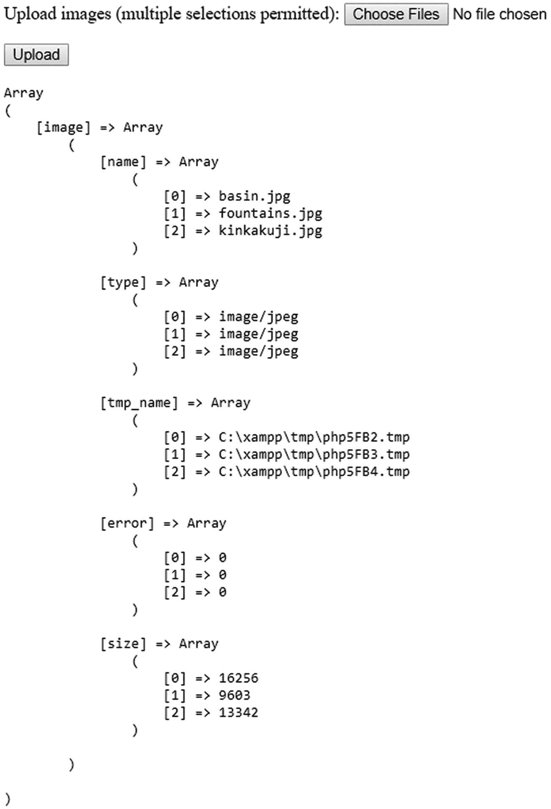
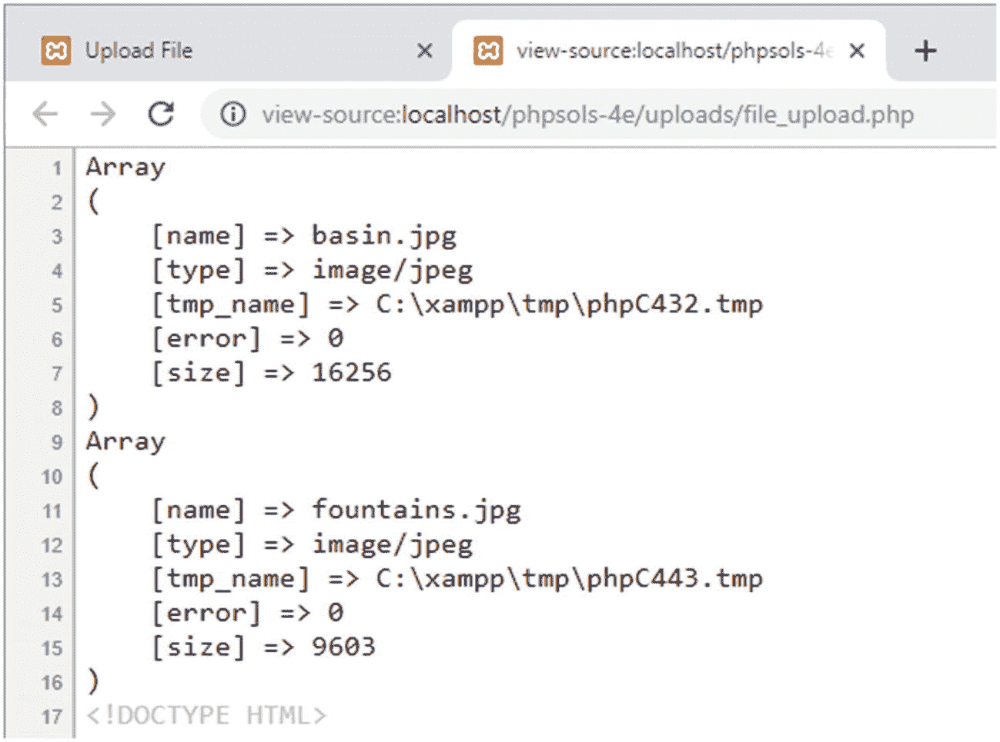
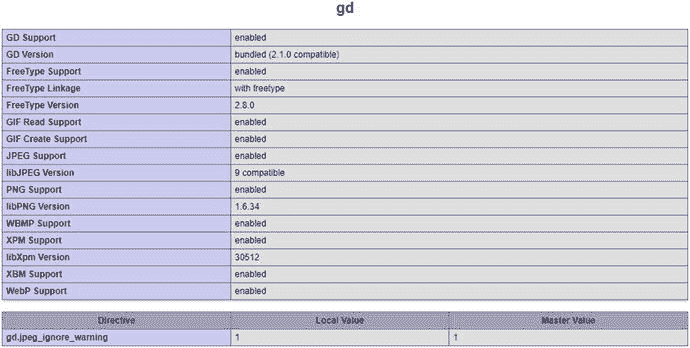
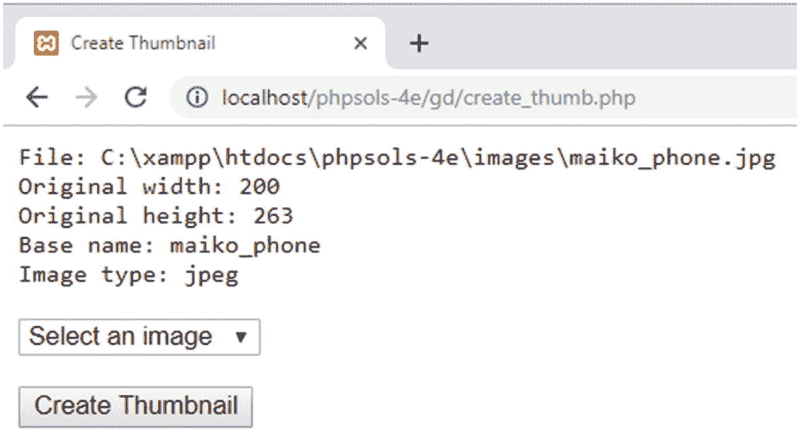

# 上传多个文件

现在你已经有了一个灵活的文件上传类，但它一次只能处理一个文件。在文件字段的`<input>`标签中添加`multiple`属性，即可在符合 HTML5 标准的浏览器中选择多个文件。如果为表单添加额外的文件字段，旧版浏览器也支持多文件上传。构建`Upload`类的最后阶段，就是对其进行调整以处理多文件上传。要理解代码的工作原理，你需要了解当表单支持多文件上传时，`$_FILES`数组会发生什么变化。

## `$_FILES`数组如何处理多文件上传

由于`$_FILES`是一个多维数组，它能够处理多文件上传。除了在`<input>`标签中添加`multiple`属性外，还需要在`name`属性后添加一对空方括号，如下所示：

```
<input type="file" name="image[]" multiple>
```

正如你在第 6 章所学到的，在`name`属性中添加方括号会将多个值以数组形式提交。你可以通过使用`ch09`文件夹中的`multi_upload_01.php`或`multi_upload_02.php`来检查这对`$_FILES`数组的影响。图 9-9 显示了在支持`multiple`属性的现代桌面浏览器中选择三个文件的结果。



**图 9-9.** `$_FILES`数组可以在单次操作中上传多个文件

虽然这种结构不如将每个文件的详细信息存储在独立的子数组中那么方便，但数字键可以跟踪每个文件的详细信息。例如，`$_FILES['image']['name'][2]`直接对应于`$_FILES['image']['tmp_name'][2]`，依此类推。

所有现代桌面浏览器都支持`multiple`属性，iOS 上的 Safari（自 6.1 版本起）也支持。Internet Explorer 9 或更早版本不支持此属性，Android 和其他一些移动浏览器也不支持。不支持`multiple`属性的浏览器会使用相同的结构上传单个文件，因此文件名存储为`$_FILES['image']['name'][0]`。

> **提示**  
> 如果你需要在旧版浏览器上支持多文件上传，请省略`multiple`属性，并根据要同时上传的文件数量创建独立的文件输入字段。为每个`<input>`标签赋予相同的`name`属性，并在其后加上方括号。`$_FILES`数组的最终结构与图 9-9 相同。

## PHP 解决方案 9-6：调整类以处理多文件上传

这个 PHP 解决方案展示了如何调整`Upload`类的`upload()`方法，以处理多文件上传。当`$_FILES`数组的结构如图 9-9 所示时，类会自动检测，并使用循环来处理上传的任意数量的文件。

当你从仅处理单次上传的表单上传文件时，`$_FILES`数组将文件名作为字符串存储在`$_FILES['image']['name']`中。但是，当你从支持多文件上传的表单上传时，`$_FILES['image']['name']`是一个数组。即使只上传了一个文件，其名称也会存储为`$_FILES['image']['name'][0]`。因此，通过检测`name`元素是否为数组，你可以决定如何处理`$_FILES`数组。如果`name`元素是一个数组，你需要将每个文件的详细信息提取到单独的数组中，然后使用循环处理每个文件。

考虑到这一点，请继续使用你现有的类文件。或者，使用`ch09/PhpSolutions/File`文件夹中的`Upload_04.php`。

1.  修改`upload()`方法，添加一个条件语句来检查`$uploaded`的`name`元素是否为数组：

    ```
    public function upload($fieldname, $size = null, array $mime = null,
    $renameDuplicates = true) {
    $uploaded = $_FILES[$fieldname];
    if (!is_null($size) && $size > 0) {
    $this->max = (int) $size;
    }
    if (!is_null($mime)) {
    $this->permitted = array_merge($this->permitted, $mime);
    }
    if (is_array($uploaded['name'])) {
    // 处理多文件上传
    } else {
    if ($this->checkFile($uploaded)) {
    $this->checkName($uploaded, $renameDuplicates);
    $this->moveFile($uploaded);
    }
    }
    }
    ```

    如果`$uploaded['name']`是一个数组，则需要特殊处理。原有的`checkFile()`调用现在放在`else`块内。

2.  为了处理多文件上传，关键挑战在于将单个文件相关的五个值（`name`、`type`等）收集起来，然后再将它们传递给`checkFile()`、`checkName()`和`moveFile()`方法。

    如果你参考图 9-9，`$uploaded`数组中的每个元素都是一个索引数组。因此，第一个文件的名称位于 name 子数组的索引 0 处，其类型位于 type 子数组的索引 0 处，以此类推。我们可以使用循环来提取索引 0 处的每个值，并将这些值与相关的键组合起来。

    首先，我们需要找出上传了多少个文件。这很容易通过将 name 子数组传递给`count()`函数来实现。在多文件上传注释后添加以下代码，如下所示：

    ```
    // 处理多文件上传
    $numFiles = count($uploaded['name']);
    ```

3.  接下来，通过添加以下代码提取子数组的键：

    ```
    $keys = array_keys($uploaded);
    ```

    这将创建一个由`name`、`type`、`tmp_file`等组成的数组。

4.  现在我们可以创建一个循环来构建每个文件详细信息的数组。在你刚插入的代码之后添加以下代码：

    ```
    for ($i = 0; $i < $numFiles; $i++) {
    $values = array_column($uploaded, $i);
    $currentfile = array_combine($keys, $values);
    print_r($currentfile);
    }
    ```

    该循环重新组织`$_FILES`数组的内容，使得每个文件的详细信息如同单独上传时一样可用。换句话说，与其将所有的 name、type 和其他元素分组在一起，`$currentfile`包含单个文件详细信息的关联数组，可以使用我们在`Upload`类中已经定义的方法进行处理。

    只需两行代码即可实现这一点。那么，让我们检查一下发生了什么。`array_column()`函数从多维数组中提取所有具有相同键或索引（作为第二个参数传递）的子数组中的元素。在这种情况下，第二个参数是计数器`$i`。当循环首次运行时，`$i`为 0。因此，它会提取`$uploaded`（即`$_FILES['image']`）每个子数组中索引 0 处的值。每个子数组有不同的键（`name`、`type`等）这一事实无关紧要；`array_column()`仅搜索每个子数组内部匹配的键或索引。实际上，它获取的是已上传的第一个文件的详细信息。

    然后，`array_combine()`函数构建一个数组，将每个值分配给其相关的键。因此，name 子数组中索引 0 处的值变为`$currentfile['name']`，type 子数组中索引 0 处的值变为`$currentfile['type']`，以此类推。

    下次循环运行时，`$i`递增，从而构建第二个文件详细信息的数组。循环持续运行，直到所有文件的详细信息都被处理完毕。由于这在概念上可能难以理解，我添加了`print_r()`来检查结果。

5.  保存`Upload.php`。要测试它，请更新`file_upload.php`，在文件字段的`name`属性末尾添加一对方括号，并插入`multiple`属性，如下所示：

    ```
    <input type="file" name="image[]" multiple>
    ```


- 你不需要在`DOCTYPE`声明之上的 PHP 代码做任何修改。
- 无论单文件还是多文件上传，代码都是相同的。

> **注意**：IE 10 之前的 Internet Explorer 只会上传选择的最后一个文件。

1. 保存`file_upload.php`并在浏览器中重新加载。通过选择多个文件进行测试。点击上传时，每个文件的详细信息应显示在单独的数组中。右键查看浏览器的源代码，你应看到类似图 9-10 的内容。



**图 9-10.** 每个上传文件的详细信息现在都位于单独的数组中

2. 既然我们有了每个文件的详细信息数组，就可以像之前一样处理它们。简单的方法是将以下代码块从`else`块中复制，粘贴到`for`循环中替换对`print_r()`的调用（将所有`$uploaded`实例改为`$currentfile`）：

```
if ($this->checkFile($uploaded)) {
    $this->checkName($uploaded, $renameDuplicates);
    $this->moveFile($uploaded);
}
```

这只有四行代码，重复似乎不是什么大问题。然而，将来你可能需要编辑代码，也许是为了增加更多检查。那时你就需要对两个代码块做同样的修改——这正是代码错误开始蔓延的地方。现在这是一个独立的例程，应该放在专用的内部方法中。

不要复制这段代码，而是将其剪切到剪贴板。

3. 在`Upload`类定义内部创建一个新的`protected`方法，并粘贴你刚刚剪切的代码。新方法如下所示：

```
protected function processUpload($uploaded, $renameDuplicates) {
    if ($this->checkFile($uploaded)) {
        $this->checkName($uploaded, $renameDuplicates);
        $this->moveFile($uploaded);
    }
}
```

4. 在`for`循环和`else`块中调用这个新方法。更新后的完整`upload()`方法现在如下所示：

```
public function upload($fieldname, $size = null, array $mime = null,
$renameDuplicates = true) {
    $uploaded = $_FILES[$fieldname];
    if (!is_null($size) && $size > 0) {
        $this->max = (int)$size;
    }
    if (!is_null($mime)) {
        $this->permitted = array_merge($this->permitted, $mime);
    }
    if (is_array($uploaded['name'])) {
        // 处理多文件上传
        $numFiles = count($uploaded['name']);
        $keys = array_keys($uploaded);
        for ($i = 0; $i < $numFiles; $i++) {
            $currentfile = [];
            foreach ($keys as $key) {
                $currentfile[$key] = $uploaded[$key][$i];
            }
            $this->processUpload($currentfile, $renameDuplicates);
        }
    } else {
        $this->processUpload($uploaded, $renameDuplicates);
    }
}
```

5. 保存`Upload.php`并尝试上传多个文件。你应该能看到与每个文件相关的消息。符合你标准的文件会被上传，过大或类型错误的文件会被拒绝。该类同样适用于单文件上传。

你可以将代码与`ch09/PhpSolutions/File`文件夹中的`Upload_05.php`进行对照。

## 使用 Upload 类

`Upload`类使用起来很简单——只需按照本章前面“导入命名空间类”中的描述导入命名空间。在脚本中包含类定义，并通过将文件路径作为参数传递给`upload_test`文件夹来创建`Upload`对象，如下所示：

```
$destination = 'C:/upload_test/';
$loader = new Upload($destination);
```

> **提示**：上传文件夹路径末尾的斜杠是可选的。

默认情况下，该类只允许上传图片，但这可以覆盖。该类有以下公共方法：

- `upload($fieldname, $size = null, array $mime = null, $renameDuplicates = true)`：将文件保存到目标文件夹。文件名中的空格会被下划线替换。默认情况下，与现有文件同名的文件会通过在文件扩展名前插入数字来重命名。该方法接受以下参数：
    - `$fieldname`（必需）：上传表单中文件输入字段的名称。
    - `$size`（可选）：一个整数，用于更改默认的最大文件大小（单位：字节，默认值 51200，相当于 50 KB）。
    - `$permitted`（可选）：一个 MIME 类型数组，用于允许上传图像以外的文件。
    - `$renameDuplicates`（可选）：将其设置为`false`会覆盖上传文件夹中同名的文件。

- `getMessages()`：返回一个报告上传状态的数组。

## 文件上传的注意事项

PHP 解决方案 9-1 中的基本脚本表明，通过 Web 表单上传文件对于 PHP 来说相当简单。失败的主要原因是没有为上传目录或文件夹设置正确的权限，以及忘记在脚本结束前将上传的文件移动到目标位置。基本脚本的问题在于它允许上传几乎任何内容。这就是本章投入大量精力构建更健壮解决方案的原因。即使`Upload`类执行了额外的检查，你也应该仔细考虑安全性。

允许他人将文件上传到你的服务器会给你带来风险。实际上，你在允许访问者自由地向服务器的硬盘写入数据。你不会允许陌生人在你自己的电脑上这样做，因此你应该以同样的警惕性来保护上传目录的访问权限。

理想情况下，上传应限于已注册的受信任用户，因此上传表单应位于网站中密码保护的部分。注册可以让你阻止滥用信任的人。此外，上传文件夹不需要位于网站根目录内，因此尽可能将其放在私有目录中。上传的图像可能包含隐藏脚本，因此不应将它们放在具有执行权限的文件夹中。请记住，PHP 无法检查内容是否合法或得体，因此立即公开显示会带来超出单纯技术层面的风险。你还应该牢记以下安全要点：

- 在 Web 表单和服务器端都设置上传文件的最大大小。
- 通过检查`$_FILES`数组中的 MIME 类型来限制上传文件的类型。
- 将文件名中的空格替换为下划线或连字符。
- 定期检查你的上传文件夹。确保其中没有不应存在的内容，并定期进行清理。即使你限制了文件上传大小，也可能在不知不觉中耗尽分配的磁盘空间。

## 章节回顾

本章向你介绍了如何创建一个 PHP 类。如果你是 PHP 或编程新手，可能会觉得有些难度。不要灰心。`Upload`类包含超过 150 行代码，其中一些代码很复杂，尽管我希望描述已经解释了代码在每个阶段的作用。即使你不理解所有代码，`Upload`类也能为你节省大量时间。它实现了文件上传所必需的主要安全措施，而使用它只需要十行左右的代码：

```
use PhpSolutions\File\Upload;
if (isset($_POST['upload'])) {
    require_once 'PhpSolutions/File/Upload.php'; // 使用正确的路径
    try {
        $loader = new Upload('C:/upload_test/');  // 将目标文件夹作为参数
        $loader->upload('image');
        $result = $loader->getMessages();
    } catch (Throwable $t) {
        echo $t->getMessage();
    }
}
```


好的，作为一名高级文档工程师和翻译员，我将严格遵循您提供的注意事项和示例，将给定的英文文本翻译成中文。

---


如果觉得这一章很难理解，可以先跳过，等积累了更多经验再回过头来看，到时候你会发现代码更容易理解。

下一章将学习如何使用 PHP 的图像处理函数，从较大的图片生成缩略图。还会扩展本章的 `Upload` 类，将上传和调整图片大小合并为一步操作。

## 10. 生成缩略图

PHP 拥有一系列功能强大的图像处理函数。你在第 5 章已经见过其中之一——`getimagesize()`。除了提供图片尺寸的有用信息外，PHP 还可以调整图片大小或旋转图片。它还能在不影响原图的情况下动态添加文字，甚至能即时创建图片。

为了让你领略 PHP 图像处理的能力，我将展示如何生成上传图片的较小副本。大多数情况下，你会使用专用图形处理程序（如 Adobe Photoshop）来生成缩略图，因为这样可以更好地控制质量。但是，如果你希望允许注册用户上传图片，同时确保它们不超过最大尺寸，那么使用 PHP 自动生成缩略图就非常有用了。你可以只保存调整大小后的副本，也可以同时保存原图和副本。

在上一章中，你构建了一个处理文件上传的 PHP 类。本章将创建两个类：一个用于生成缩略图，另一个用于将上传和调整图片大小合并为一步操作。第二个类并非从零开始构建，而是基于第 9 章的 `Upload` 类。使用类的一大优势在于它们是**可扩展的**——基于另一个类的类可以继承其父类的功能。构建用于上传图片和生成缩略图的类需要大量代码。但是，一旦定义了这些类，使用它们只需要几行脚本。如果你赶时间，或者编写大量代码让你冷汗直冒，可以直接使用现成的类。稍后再回来学习代码的工作原理。它使用了大量在其它场景下也很有用的基础 PHP 函数。

本章将学习以下内容：

*   缩放图片
*   保存缩放后的图片
*   自动调整大小并重命名上传的图片
*   通过扩展现有类来创建子类

### 检查服务器能力

在 PHP 中处理图像依赖于 GD 扩展。第 2 章推荐的集成 PHP 包默认支持 GD，但你需要确保远程 Web 服务器上也已启用 GD 扩展。与之前章节一样，在你的网站上运行 `phpinfo()` 来检查服务器配置。向下滚动，直到找到如下截图中所示的区域（它应该位于页面大约一半的位置）：



如果找不到这个区域，说明 GD 扩展未启用，你将无法在你的网站上使用本章的任何脚本。请请求启用它，或者更换一个主机。

别忘了删除运行 `phpinfo()` 的文件，除非它位于受密码保护的目录中。

### 动态处理图像

GD 扩展允许你完全从零开始生成图像，或者处理现有图像。无论哪种方式，底层过程始终遵循四个基本步骤：

1.  在服务器内存中为正在处理的图像创建一个资源。
2.  处理图像。
3.  显示和/或保存图像。
4.  从服务器内存中移除图像资源。

这个过程意味着你始终只操作内存中的图像，而不是原始图像。除非在脚本终止前将图像保存到磁盘，否则任何更改都将被丢弃。处理图像通常需要大量内存，因此一旦不再需要图像资源，就必须立即销毁它。如果脚本运行缓慢或崩溃，很可能表明原始图像过大。

### 制作较小的图片副本

本章的目标是向你展示如何在上传时自动调整图片大小。这涉及扩展第 9 章的 `Upload` 类。但是，为了更容易理解如何使用 PHP 的图像处理函数，我建议先从处理服务器上已有的图片开始，然后创建一个单独的类来生成缩略图。

#### 准备工作

起点是以下简单的表单，它使用 PHP 解决方案 7-3 创建了 `images` 文件夹中照片的下拉菜单。你可以在 `ch10` 文件夹的 `create_thumb_01.php` 中找到代码。将其复制到 `phpsols-4e` 站点根目录下名为 `gd` 的新文件夹中，并重命名为 `create_thumb.php`。

页面的主体部分中的表单如下所示：

```
<form action="<?= $_SERVER['PHP_SELF'] ?>" method="get">
    <select name="img" id="img">
        <?php
        $files = new FilesystemIterator('../images');
        foreach ($files as $file) {
            $filename = $file->getFilename();
            ?>
            <option value="<?= $file->getRealPath() ?>"><?= $filename ?></option>
        <?php } ?>
    </select>
    <input type="submit" value="Select">
</form>
```

加载到浏览器后，下拉菜单应显示 `images` 文件夹中照片的名称。这使得测试时可以快速选择图片。每个图片的完整路径通过调用 `SplFileInfo::getRealPath()` 方法插入到 `<option>` 标签的 `value` 属性中。

在你于第 9 章创建的 `upload_test` 文件夹内，创建一个名为 `thumbs` 的新文件夹，确保它具有 PHP 写入所需的权限。如果需要，请回顾上一章的“建立上传目录”部分。

#### 构建 Thumbnail 类

为了生成缩略图，该类需要执行以下步骤：

1.  获取原始图片的尺寸。
2.  获取图片的 MIME 类型。
3.  计算缩放比例。
4.  为原始图片创建正确 MIME 类型的图像资源。
5.  为缩略图创建一个图像资源。
6.  创建调整大小后的副本。
7.  使用正确的 MIME 类型将调整大小后的副本保存到目标文件夹。
8.  销毁图像资源以释放内存。

除了生成缩略图外，该类会自动在文件名扩展名之前插入 `_thb`，但构造函数方法的一个可选参数允许你更改这个值。另一个可选参数设置缩略图的最大尺寸。为了简化计算，最大尺寸仅控制缩略图两个尺寸中较大的那个。

为了避免命名冲突，`Thumbnail` 类将使用命名空间。由于它是专门用于图像的，我们将在 `PhpSolutions` 文件夹中创建一个名为 `Image` 的新文件夹，并使用 `PhpSolutions\Image` 作为命名空间。

有很多事情要做，所以我会把代码分成几个部分。它们都是同一个类定义的一部分，但以这种方式呈现脚本应该更容易理解，特别是如果你想在其它上下文中使用部分代码的话。

#### PHP 解决方案 10-1：获取图片详情

这个 PHP 解决方案描述了如何获取原始图片的尺寸和 MIME 类型。

1.  在 `PhpSolutions` 文件夹中创建一个名为 `Image` 的新文件夹。然后在该文件夹内创建一个名为 `Thumbnail.php` 的页面。该文件将只包含 PHP 代码，因此请去除编辑程序插入的任何 HTML 代码。

2.  在新文件顶部声明命名空间：

```
namespace PhpSolutions\Image;
```

3.  该类需要跟踪相当多的属性。像这样列出它们来开始类的定义：


```php
class Thumbnail {
    protected $original;
    protected $originalwidth;
    protected $originalheight;
    protected $basename;
    protected $maxSize = 120;
    protected $imageType;
    protected $destination;
    protected $suffix = '_thb';
    protected $messages = [];
}
```

与 `Upload` 类一样，所有属性都被声明为 protected，这意味着它们不会在类定义之外被意外更改。这些属性名称都具有描述性，因此不需过多解释。`$maxSize` 属性的默认值为 120（像素），用于确定缩略图较长边的最大尺寸。

4.  构造方法接受一个参数，即图像的路径。请在其他 protected 属性列表之后、闭右花括号之内添加构造方法的定义：

```php
public function __construct($image) {
    if (is_file($image) && is_readable($image)) {
        $details = getimagesize($image);
    } else {
        throw new \Exception("Cannot open $image.");
    }
    if (!is_array($details)) {
        throw new \Exception("$image doesn't appear to be an image.");
    } else {
        if ($details[0] == 0) {
            throw new \Exception("Cannot determine size of $image.");
        }
        // 检查 MIME 类型
        if (!$this->checkType($details['mime'])) {
            throw new \Exception('Cannot process that type of file.');
        }
        $this->original = $image;
        $this->originalwidth = $details[0];
        $this->originalheight = $details[1];
        $this->basename = pathinfo($image, PATHINFO_FILENAME);
    }
}
```

构造方法首先执行一个条件语句，检查 `$image` 是否为文件且可读。如果是，则将文件传入 `getimagesize()`，并将结果存入 `$details`；否则抛出异常。与上一章类似，`Exception` 前加反斜杠表示我们要使用核心 `Exception` 类，而非针对此命名空间自定义的异常类。

当你将图像传入 `getimagesize()` 时，它会返回一个包含以下元素的数组：

*   `0`：宽度（以像素为单位）
*   `1`：高度
*   `2`：表示图像类型的整数值
*   `3`：包含正确的宽度和高度属性的字符串，可直接用于 `` 标签
*   `mime`：图像的 MIME 类型
*   `channels`：`3` 表示 RGB 图像，`4` 表示 CMYK 图像
*   `bits`：每种颜色占用的位数

如果传入 `getimagesize()` 的参数不是图像，则返回 `false`。因此，若 `$details` 不是数组，则抛出异常，报告该文件似乎不是图像。但如果 `$details` 是数组，则意味着我们处理的很可能是一张图像。然而 `else` 块在继续处理之前还会进行两项额外检查。

如果 `$details` 数组中第一个元素的值为 0，说明图像有问题，因此抛出异常，报告无法确定图像尺寸。下一个检查会将报告的 MIME 类型传递给一个名为 `checkType()` 的内部方法（该方法将在下一步中定义）。如果 `checkType()` 返回 `false`，则抛出另一个异常。

这一系列异常处理机制确保，如果图像存在问题，不会进行任何后续处理。假设脚本顺利通过所有检查，则图像的路径会被存储在 `$original` 属性中，而其宽度和高度分别存储在 `$originalWidth` 和 `$originalHeight` 属性中。

通过 `pathinfo()` 函数并传入 `PATHINFO_FILENAME` 常量来提取不含扩展名的文件名，这与 PHP 解决方案 9-5 中的做法相同。提取到的文件名存储在 `$basename` 属性中，后续将用于结合后缀名构建缩略图的名称。

5.  `checkType()` 方法将 MIME 类型与一个可接受的图像类型数组进行比对。如果找到匹配项，则将类型存储在 `$imageType` 属性中并返回 `true`；否则返回 `false`。该方法在内部使用，因此需要声明为 protected。请将以下代码添加到类的定义中：

```php
protected function checkType($mime) {
    $mimetypes = ['image/jpeg', 'image/png', 'image/gif', 'image/webp'];
    if (in_array($mime, $mimetypes)) {
        // 提取 '/' 之后的字符
        $this->imageType = substr($mime, strpos($mime, '/')+1);
        return true;
    }
    return false;
}
```

浏览器普遍支持的图像类型只有 JPEG、PNG 和 GIF；但我将 WebP 也包含在内，因为目前它已被广泛支持。所有图像 MIME 类型都以 `image/` 开头。为了方便后续使用，`substr()` 函数会提取斜杠之后的字符，并将其存储在 `$imageType` 属性中。当 `substr()` 使用两个参数时，它会从第二个参数指定的位置（从 0 开始计数）开始，并返回字符串的剩余部分。我没有使用固定数字作为第二个参数，而是使用 `strpos()` 函数来查找斜杠的位置并加 1。这样做使代码更具通用性，因为某些专有图像格式以 `application/` 而非 `image/` 开头。`strpos()` 的第一个参数是要搜索的整个字符串，第二个参数是要搜索的子字符串。

6.  在构建类时进行代码测试是个好习惯。尽早发现错误比在长脚本中排查问题容易得多。为了测试代码，请在类定义中创建一个名为 `test()` 的新公共方法。

方法在类定义中的出现顺序无关紧要，但常见的做法是将所有公共方法集中在构造方法之后，并将 protected 方法放在文件底部。这有助于代码维护。

请在构造方法和 `checkType()` 定义之间插入以下定义：

```php
public function test() {
    $details = <<<END
文件: $this->original
原始宽度: $this->originalwidth
原始高度: $this->originalheight
基本名称: $this->basename
图像类型: $this->imageType
END;
    // 移除以消息形式输出前面一行时的缩进） {
    print_r($this->messages);
}
```

该方法使用 `echo` 配合 heredoc 语法（参见第 4 章“使用 heredoc 语法避免引号转义”）以及 `print_r()` 来显示属性的值。虽然输出中没有引号，但结合 `<pre>` 标签使用 heredoc 语法能让代码和输出更易读。

> **注意**  
如果您使用的 PHP 版本低于 7.3，则结束分隔符（`END`）不得缩进。在 PHP 7.3 及更高版本中，可以缩进，但缩进量不能超过代码其余部分。



1.  要测试当前的类定义，请保存 `Thumbnail.php`，并将以下代码添加到 `create_thumb.php` 中 `DOCTYPE` 声明之前的 PHP 代码块中（该代码可在 `ch10` 文件夹的 `create_thumb_02.php` 中找到）：

```php
use PhpSolutions\Image\Thumbnail;
if (isset($_POST['create'])) {
    require_once('../PhpSolutions/Image/Thumbnail.php');
    try {
        $thumb = new Thumbnail($_POST['pix']);
        $thumb->test();
    } catch (Throwable $t) {
        echo $t->getMessage();
    }
}
```

这段代码从 `PhpSolutions\Image` 命名空间导入 `Thumbnail` 类，然后添加了表单提交时要执行的代码。


`name`属性在`create_thumb.php`的提交按钮中是`create`，因此这段代码仅在表单提交后执行。它包含`Thumbnail`类定义，创建该类的一个实例（将表单中选择的值作为参数传递），并调用`test()`方法。

`catch`块使用`Throwable`作为类型声明，因此它将处理内部 PHP 错误以及`Thumbnail`类抛出的异常。

2. 保存`create_thumb.php`并在浏览器中加载。选择一张图片并单击"创建缩略图"。输出结果类似于图 10-1。

如有必要，请将代码与`ch10/PhpSolutions/Images`文件夹中的`Thumbnail_01.php`进行核对。

**注意**  
`$_POST['pix']`的值被直接传递给`test()`方法，因为它直接来自我们自己的表单。在生产环境中，您应始终检查从表单接收的值。例如，使用`basename()`提取纯文件名并指定允许的目录。

虽然某些属性具有默认值，但您需要提供选项来更改缩略图的最大大小以及应用于文件名基础的尾缀。您还需要告知类在哪里创建缩略图。

**PHP 解决方案 10-2：更改默认值**

当更改类设置的默认值时，您有多种方法可以选择。一种方法是创建需要在对象实例化后调用的公共方法。另一种方法是将值作为参数传递给构造方法。无论采用哪种方法，检查提交的值是否有效都很重要。继续使用同一个类定义。或者，使用`ch10/PhpSolutions/Image`文件夹中的`Thumbnail_01.php`。

1. 首先，更新构造方法，为缩略图的目标文件夹、缩略图的最大大小以及要添加到文件名的尾缀添加参数。构造方法将这些值的设置委托给也需要定义的受保护方法。更新后的代码如下所示：

```php
public function __construct($image, $destination, $maxSize = 120, $suffix = '_thb') {
    if (is_file($image) && is_readable($image)) {
        $details = getimagesize($image);
    } else {
        throw new \Exception("Cannot open $image.");
    }
    // if getimagesize() returns an array, it looks like an image
    if (!is_array($details)) {
        throw new \Exception("$image doesn't appear to be an image.");
    } else {
        if ($details[0] == 0) {
            throw new \Exception("Cannot determine size of $image.");
        }
        // check the MIME type
        if (!$this->checkType($details['mime'])) {
            throw new \Exception('Cannot process that type of file.');
        }
        $this->original = $image;
        $this->originalwidth = $details[0];
        $this->originalheight = $details[1];
        $this->basename = pathinfo($image, PATHINFO_FILENAME);
        $this->setDestination($destination);
        $this->setMaxSize($maxSize);
        $this->setSuffix($suffix);
    }
}
```

2. 接下来，创建用于设置缩略图目标文件夹的方法。在`checkType()`方法定义之后，将以下代码添加到`Thumbnail.php`中：

```php
protected function setDestination($destination) {
    if (is_dir($destination) && is_writable($destination)) {
        $this->destination = rtrim($destination, '/\\') . DIRECTORY_SEPARATOR;
    } else {
        throw new \Exception("Cannot write to $destination.");
    }
}
```

该方法首先检查`$destination`是否为文件夹（目录）且可写。如果不是，则抛出异常。否则，执行其余代码。

在将提交的值赋值给`$destination`属性之前，我们需要确保它以单个尾部斜杠结尾。这是通过将提交的值传递给`rtrim()`函数来实现的，该函数通常用于去除字符串末尾的空白字符。但是，如果传递一个字符串作为第二个参数，它也会去除这些字符。因此，这会从字符串末尾去除正斜杠和反斜杠——需要使用两个反斜杠，因为 PHP 使用反斜杠来转义单引号和双引号（参见第[4]章中的“在双引号内使用转义序列”）。然后将 PHP 常量`DIRECTORY_SEPARATOR`连接到`$destination`的末尾。`DIRECTORY_SEPARATOR`常量会根据操作系统自动选择正确的斜杠类型。

**提示**  
PHP 在路径中同等对待正斜杠或反斜杠。即使这导致添加了相反类型的斜杠，对 PHP 而言路径仍然有效。但是，在为 PHP 脚本之外的使用构建路径时（例如创建 URL 或将路径交给外部程序执行），您不能依赖此行为。

1. 更改缩略图最大大小的方法只需检查该值是否为数字。将以下代码添加到类定义中：

```php
protected function setMaxSize($size) {
    if (is_numeric($size)) {
        $this->maxSize = abs($size);
    }
}
```

`is_numeric()`函数检查提交的值是否为数字或数字字符串。如果是，则将其赋值给`$maxSize`属性。作为预防措施，将该值传递给`abs()`函数，该函数将数字转换为其绝对值。换句话说，负数会被转换为正数。

如果提交的值不是数字，则不执行任何操作。默认值保持不变。

2. 更改文件名尾缀的函数需要确保该值不包含任何特殊字符。代码如下所示：

```php
protected function setSuffix($suffix) {
    if (preg_match('/^\w+$/', $suffix)) {
        if (strpos($suffix, '_') !== 0) {
            $this->suffix = '_' . $suffix;
        } else {
            $this->suffix = $suffix;
        }
    }
}
```

这里使用了`preg_match()`，它以正则表达式作为第一个参数，并在作为第二个参数传递的值中搜索匹配项。正则表达式需要包裹在一对匹配的分隔符中——此处使用的是通常的正斜杠。去掉分隔符后，正则表达式如下：

```
^\w+$
```

在此上下文中，脱字符（`^`）告诉正则表达式从字符串开头开始匹配。`\w`是一个正则表达式标记，匹配任何字母数字字符或下划线。`+`表示匹配前面的标记或字符一次或多次，`$`表示匹配字符串结尾。换句话说，该正则表达式匹配仅包含字母数字字符和下划线的字符串。如果字符串包含空格或特殊字符，则不会匹配。

如果匹配失败，默认的`$suffix`属性保持不变。否则，执行以下条件语句：

```php
if (strpos($suffix, '_') !== 0) {
```


