# 如果 `$suffix` 的第一个字符*不是*下划线，则条件为 `true`。这里使用 `strpos()` 函数查找第一个下划线的位置。如果第一个字符是下划线，`strpos()` 返回的值是 0。然而，如果 `$suffix` 不包含下划线，`strpos()` 会返回 `false`。如第 4 章所述，PHP 将 `0` 视为 `false`，因此条件需要使用“不全等”运算符（两个等号）。所以，如果后缀不是以下划线开头，就添加一个下划线。否则，保留原始值。

**注意事项**  
不要混淆 `strpos()` 和 `strrpos()`。前者查找第一个匹配字符的位置。后者则是反向搜索字符串。

1. 更新 `test()` 方法，显示你刚为其创建了 setter 方法的属性值。修改后的代码如下：

```
public function test() {
    $details = <<<END
    文件：$this->original
    原始宽度：$this->originalwidth
    原始高度：$this->originalheight
    基本名称：$this->basename
    图片类型：$this->imageType
    目标路径：$this->destination
    最大尺寸：$this->maxSize
    后缀：$this->suffix
END;
    // 移除消息中上一行的缩进) {
    print_r($this->messages);
    }
}
```

2. 通过在 `create_thumb.php` 中设置新参数来测试更新后的类，如下所示：

```
$thumb = new Thumbnail($_POST['pix'], 'C:/upload_test/thumbs', 100, 'small');
$thumb->test();
```

将 `upload_test/thumbs` 的路径调整为与你自己的设置匹配。

3. 保存两个页面，并从 `create_thumb.php` 的列表中选择一张图片。你应该会看到与图 10-2 相似的结果。

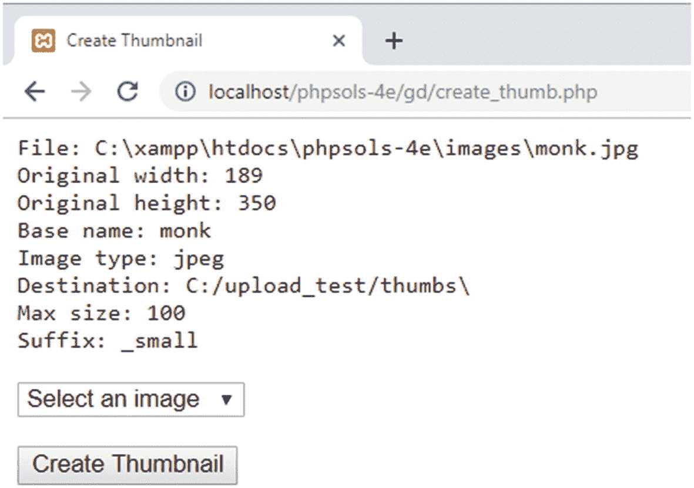

图 10-2. 验证默认值已更改

4. 进行多次测试，包括从传递给 `setDestination()` 的值中省略尾部斜杠，或选择一个不存在的文件夹。同时为最大尺寸和后缀传递无效值。无效的目标文件夹会抛出异常，但其他情况会静默失败，对于最大尺寸使用默认值，对于后缀使用 `_thb`。

如有必要，将你的代码与 `ch10/PhpSolutions/Image` 中的 `Thumbnail_02.php` 以及 `ch10` 文件夹中的 `create_thumb_03.php` 进行对比。

你可能不同意我对传递无效参数时静默失败的决策。不过，到现在为止，你应该已经具备了足够的条件语句经验，可以根据自己的需求调整代码。例如，如果你希望 `setMaxSize()` 方法抛出异常而不是静默失败，可以检查该值是否大于零并添加一个 `else` 块来处理错误。下面是修改 `setMaxSize()` 方法的方式：

```
protected function setMaxSize($size) {
    if (is_numeric($size) && $size > 0) {
        $this->maxSize = $size;
    } else {
        throw new \Exception('传递给 setMaxSize() 的值必须为正数。');
    }
}
```

## PHP 解决方案 10-3：计算缩略图的尺寸

这个 PHP 解决方案向 `Thumbnail` 类添加了一个受保护的方法，用于计算缩略图的尺寸。`$maxSize` 属性中设置的值决定了宽度或高度，具体取决于哪一边更大。为了避免缩略图失真，你需要计算较短边的缩放比例。该比例通过将最大缩略图尺寸除以原始图片的较大边来计算。

例如，金阁寺的原始图片（`kinkakuji.jpg`）尺寸为 270 × 346 像素。如果最大尺寸设置为 120，将 120 除以 346 会得到 0.3468 的缩放比例。将原始图片的宽度乘以这个比例，可将缩略图的宽度固定为 94 像素（向上取整到最接近的整数），从而保持正确的比例。图 10-3 展示了缩放比例的工作原理。

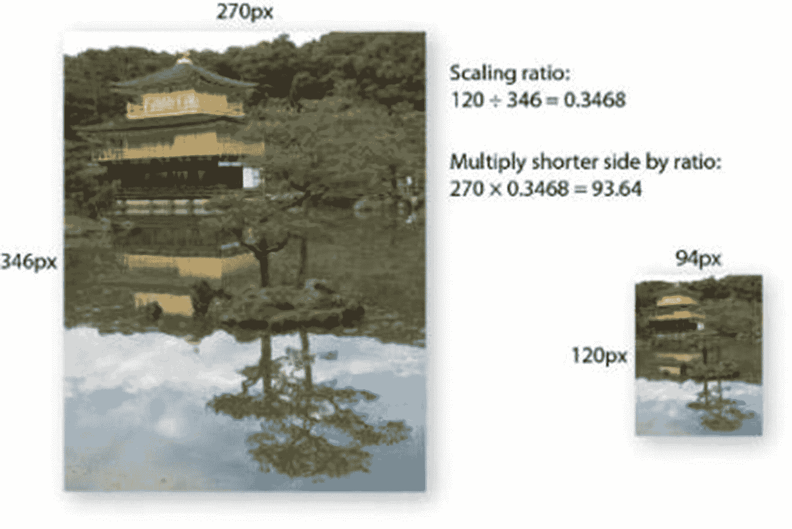

图 10-3. 计算缩略图的缩放比例

继续使用你现有的类定义。或者使用 `ch10/PhpSolutions/Image` 文件夹中的 `Thumbnail_02.php`。

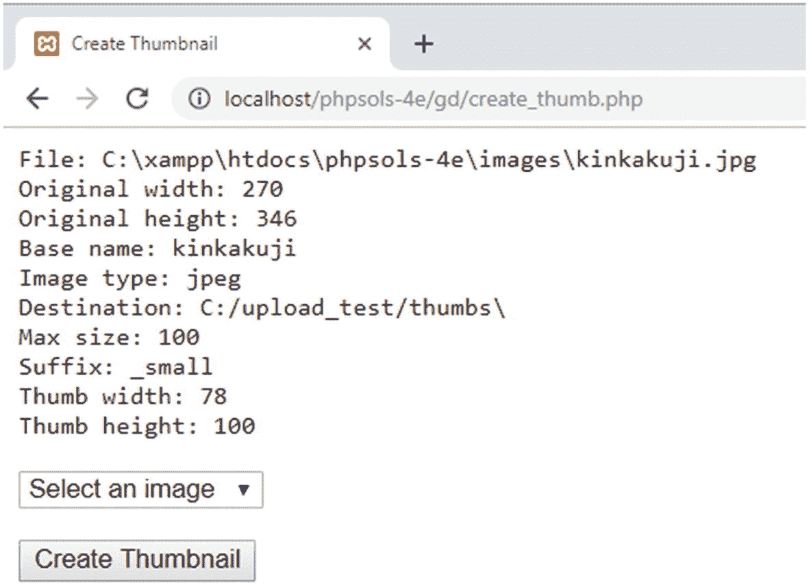

图 10-4. 该类现在生成了创建缩略图所需的所有值

1. 计算缩略图尺寸不需要任何额外的用户输入，因此可以由一个受保护的方法来处理。向类定义中添加以下代码。

```
protected function calculateRatio($width, $height, $maxSize) {
    if ($width <= $maxSize && $height <= $maxSize) {
        return 1;
    } elseif ($width > $height) {
        return $maxSize/$width;
    } else {
        return $maxSize/$height;
    }
}
```

原始图片的尺寸和最大尺寸作为 `Thumbnail` 对象的属性存储，因此，你可以在方法内部通过 `$this->originalwidth`、`$this->originalheight` 和 `$this->maxSize` 来引用它们，而无需将它们作为参数传递。然而，像这样使用参数（一种称为依赖注入的技术）会使代码更具通用性，以便在其他地方使用。

条件语句首先检查原始图片的宽度和高度是否都小于或等于最大尺寸。如果是，则图片无需调整大小，因此该方法返回缩放比例 1。

`elseif` 块检查宽度是否大于高度。如果是，则使用宽度来计算缩放比例。如果高度更大或两边相等，则调用 `else` 块。在这两种情况下，都使用高度来计算缩放比例。

2. 要测试新方法，按如下方式修改 `test()` 方法：

```
public function test() {
    $ratio = $this->calculateRatio($this->originalwidth, $this->originalheight, $this->maxSize);
    $thumbwidth = round($this->originalwidth * $ratio);
    $thumbheight = round($this->originalheight * $ratio);
    $details = <<<END
    文件：$this->original
    原始宽度：$this->originalwidth
    原始高度：$this->originalheight
    基本名称：$this->basename
    图片类型：$this->imageType
    目标路径：$this->destination
    最大尺寸：$this->maxSize
    后缀：$this->suffix
    缩略图宽度：$thumbwidth
    缩略图高度：$thumbheight
END;
    // 移除消息中上一行的缩进) {
    print_r($this->messages);
    }
}
```

这会调用新方法，并将 `$originalwidth`、`$originalheight` 和 `$maxSize` 属性作为参数传递。然后使用计算出的缩放比例来计算缩略图的宽度和高度。计算结果会传递给 `round()` 函数，以转换为最接近的整数。这些计算将来需要移出 `test()` 方法，但首先检查我们是否得到了预期的结果很重要。

3. 通过在 `create_thumb.php` 中选择一张图片并点击 `创建缩略图` 来测试更新后的类。你应该会看到屏幕上显示的值，如图 10-4 所示。

如有必要，将你的代码与 `ch10` 文件夹中的 `Thumbnail_03.php` 进行对比。

## 使用 GD 函数创建图片的缩放副本


当你收集完所有必要信息后，就可以从一张较大的图片生成缩略图了。这涉及到为原始图片和缩略图分别创建图像资源。对于原始图片，你需要使用一个与图片 MIME 类型相匹配的函数。以下每个函数都接受一个参数——文件的路径：

- `imagecreatefromjpeg()`
- `imagecreatefrompng()`
- `imagecreatefromgif()`
- `imagecreatefromwebp()`

因为缩略图还不存在，你需要使用另一个不同的函数 `imagecreatetruecolor()`，它接受两个参数——宽度和高度（以像素为单位）。

还有另一个函数用于创建图片的调整大小后的副本：`imagecopyresampled()`。该函数至少需要十个参数——而且全部是必需的。这些参数分为五对，如下所示：

- 两个图像资源的引用——先复制对象，后原始对象
- 复制图像左上角位置的 `x` 和 `y` 坐标
- 原始图像左上角的 `x` 和 `y` 坐标
- 复制图像的宽度和高度
- 要从原始图像中复制的区域的宽度和高度

图 10-5 展示了如何使用最后四对参数来提取特定区域，该图使用了以下传递给 `imagecopyresampled()` 的参数：

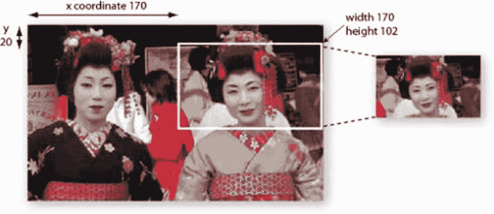

图 10-5. `imagecopyresampled()` 函数允许你复制图片的一部分

```
imagecopyresampled($thumb, $source, 0, 0, 170, 20, $thbwidth,$thbheight, 170, 102);
```

要复制的区域的 `x` 和 `y` 坐标是从图片左上角开始以像素为单位测量的。`x` 和 `y` 轴从左上角 0 开始，向右和向下递增。通过将要复制的区域的宽度和高度分别设置为 170 和 102，PHP 会提取出白色边框所包围的区域。现在你明白网站是如何实现裁剪上传图片的功能了吧。它们使用 JavaScript 或其他技术动态计算坐标。对于 `Thumbnail` 类，你将使用整张原始图片来生成缩略图。

使用 `imagecopyresampled()` 创建副本后，你需要保存它，再次使用一个特定于 MIME 类型的函数，即：

- `imagejpeg()`
- `imagepng()`
- `imagegif()`
- `imagewebp()`

每个函数的前两个参数是图像资源和你想保存的路径。`imagejpeg()`、`imagepng()` 和 `imagewebp()` 函数接受一个可选的第三个参数来设置图像质量。对于 `imagejpeg()` 和 `imagewebp()`，你通过指定一个 0（最差）到 100（最佳）范围内的数字来设置质量。如果省略该参数，`imagejpeg()` 的默认值是 75，`imagewebp()` 的默认值是 80。对于 `imagepng()`，范围是 0 到 9。令人困惑的是，0 产生最佳质量（无压缩）。

最后，保存好缩略图后，你需要通过将它们传递给 `imagedestroy()` 来销毁图像资源。尽管其名称具有破坏性，但该函数对原始图片或缩略图没有任何影响。它只是通过销毁处理过程中所需的图像资源来释放服务器内存。

## PHP 解决方案 10-4：生成缩略图

本 PHP 解决方案通过创建图像资源、复制缩略图并将其保存在目标文件夹中，完善了 `Thumbnail` 类。

继续使用你现有的类定义。或者，使用 `ch10/PhpSolutions/Image` 文件夹中的 `Thumbnail_03.php`。

1.  既然我们已经验证了该类正在计算正确的值来生成缩略图，我们就可以重命名 `test()` 方法并删除显示结果的代码。将方法名更改为 `create()`，并删除除了前三行之外的所有内容。你应该得到以下内容：

    ```
    public function create() {
    $ratio = $this->calculateRatio($this->originalwidth, $this->originalheight,
    $this->maxSize);
    $thumbwidth = round($this->originalwidth * $ratio);
    $thumbheight = round($this->originalheight * $ratio);
    }
    ```

2.  原始图片的图像资源必须特定于其 MIME 类型，因此创建一个内部方法来选择正确的类型。将以下代码添加到类定义中：

    ```
    protected function createImageResource() {
    switch ($this->imageType) {
    case 'jpeg':
    return imagecreatefromjpeg($this->original);
    case 'png':
    return imagecreatefrompng($this->original);
    case 'gif':
    return imagecreatefromgif($this->original);
    case 'webp':
    return imagecreatefromwebp($this->original);
    }
    }
    ```

    你在 PHP 解决方案 10-1 中创建的 `checkType()` 方法将 MIME 类型存储为 `jpeg`、`png`、`gif` 或 `webp`。因此，`switch` 语句会检查 MIME 类型，将其匹配到相应的函数，并将原始图片作为参数传递。然后该方法返回生成的图像资源。

3.  `create()` 方法需要两个图像资源：一个用于原始图片，另一个用于缩略图。像这样更新 `create()` 方法：

    ```
    public function create() {
    $ratio = $this->calculateRatio($this->originalwidth, $this->originalheight,
    $this->maxSize);
    $thumbwidth = round($this->originalwidth * $ratio);
    $thumbheight = round($this->originalheight * $ratio);
    $resource = $this->createImageResource();
    $thumb = imagecreatetruecolor($thumbwidth, $thumbheight);
    }
    ```

    这会调用你在第 2 步中创建的 `createImageResource()` 方法，然后为缩略图创建一个图像资源，将缩略图的宽度和高度传递给 `imagecreatetruecolor()`。

4.  创建缩略图的下一步涉及将两个图像资源传递给 `imagecopyresampled()`，并设置坐标和尺寸。将以下代码行添加到 `create()` 方法中：

    ```
    imagecopyresampled($thumb, $resource, 0, 0, 0, 0, $thumbwidth, $thumbheight,
    $this->originalwidth, $this->originalheight);
    ```

    前两个参数是你刚刚为缩略图和原始图片创建的图像资源。接下来的四个参数将副本和原始图像的 `x` 和 `y` 坐标都设置为左上角。然后是计算出的缩略图的宽度和高度，最后是原始图像的宽度和高度。将参数 3-6 设置为左上角，并将两组尺寸都设置为完整值，这样会将整张原始图片复制到整个缩略图中。换句话说，它创建了原始图片的一个更小的副本。

    你不需要将 `imagecopyresampled()` 的结果赋值给一个变量。缩放后的图像现在存储在 `$thumb` 中，但你仍然需要保存它。

5.  像这样完成 `createThumbnail()` 的定义：


```php
public function create() {
    $ratio = $this->calculateRatio($this->originalwidth, $this->originalheight,
    $this->maxSize);
    $thumbwidth = round($this->originalwidth * $ratio);
    $thumbheight = round($this->originalheight * $ratio);
    $resource = $this->createImageResource();
    $thumb = imagecreatetruecolor($thumbwidth, $thumbheight);
    imagecopyresampled($thumb, $resource, 0, 0, 0, 0, $thumbwidth, $thumbheight,
    $this->originalwidth, $this->originalheight);
    $newname = $this->basename . $this->suffix;
    switch ($this->imageType) {
    case 'jpeg':
    $newname .= '.jpg';
    $success = imagejpeg($thumb, $this->destination . $newname);
    break;
    case 'png':
    $newname .= '.png';
    $success = imagepng($thumb, $this->destination . $newname);
    break;
    case 'gif':
    $newname .= '.gif';
    $success = imagegif($thumb, $this->destination . $newname);
    break;
    case 'webp':
    $newname .= '.webp';
    $success = imagewebp($thumb, $this->destination . $newname);
    break;
    }
    if ($success) {
    $this->messages[] = "$newname 创建成功。";
    } else {
    $this->messages[] = "无法为 " .
    basename($this->original) . " 创建缩略图";
    }
    imagedestroy($resource);
    imagedestroy($thumb);
}
```

新代码的第一行将后缀拼接到已去除文件扩展名的文件名上。因此，如果原始文件名为 `menu.jpg` 且使用了默认的 `_thb` 后缀，`$newname` 将变为 `menu_thb`。

`switch` 语句检查图像的 MIME 类型并追加相应的文件扩展名。以 `menu.jpg` 为例，`$newname` 最终变为 `menu_thb.jpg`。随后，缩放后的图像被传递给相应的保存函数，并使用目标文件夹和 `$newname` 作为保存路径。此处省略了 JPEG、PNG 和 WebP 图像的可选质量参数，默认质量对于缩略图而言已足够。

保存操作的结果存储在 `$success` 中。根据结果，`$success` 的值为 `true` 或 `false`，并会向 `$messages` 属性添加相应的消息。该消息使用 `basename()` 函数而非 `$basename` 属性创建，因为该属性中的文件扩展名已被去除，而 `basename()` 函数会保留扩展名。

最后，`imagedestroy()` 通过销毁用于创建缩略图的资源来释放服务器内存。

6. 到目前为止，你一直使用 `test()` 方法来显示错误信息。现在创建一个公共方法来获取这些消息：

```php
public function getMessages() {
    return $this->messages;
}
```

7. 保存 `Thumbnail.php`。在 `create_thumb.php` 中，将对 `test()` 方法的调用替换为对 `create()` 的调用。同时调用 `getMessages()` 并将结果赋值给一个变量，如下所示：

```php
$thumb->create();
$messages = $thumb->getMessages();
```

8. 在 `<body>` 开始标签之后添加一个 PHP 代码块，用于显示所有消息：

```php
';
    foreach ($messages as $message) {
        echo "$message";
    }
    echo '';
}
?>
```

你在之前的章节中已经见过这段代码，因此无需额外解释。

9. 保存 `create_thumb.php`，在浏览器中加载，并通过从列表中选择图像并点击“创建缩略图”进行测试。如果一切顺利，你应该会看到一条报告缩略图已创建的消息，并且可以在 `upload_test` 的 `thumbs` 子文件夹中确认其存在，如图 10-6 所示。

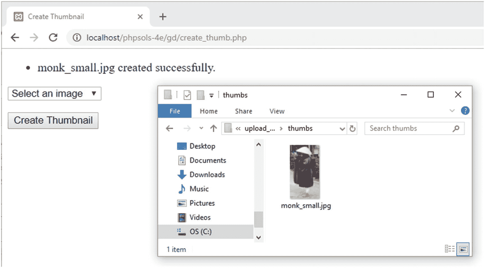

**图 10-6.** 缩略图已成功创建于目标文件夹中

10. 如果缩略图未能创建，`Thumbnail` 类生成的错误消息应能帮助你定位问题根源。此外，请仔细对照 `ch10/PhpSolutions/Image` 文件夹中的 `Thumbnail_04.php` 检查你的代码。如果之前的 PHP 解决方案中的测试均能通过，那么错误很可能出现在 `create()`、`createImageResource()` 或 `createThumbnail()` 方法的定义中。另一个需要检查的地方自然是你的 PHP 配置。该类依赖于 GD 扩展的启用。虽然 GD 被广泛支持，但并非默认总是开启。

## 上传时自动调整图像大小

既然你已经拥有了一个能从大图创建缩略图的类，那么将第 9 章的 `Upload` 类改编为能从上传的图像生成缩略图就相对简单了——事实上，不仅能处理单张图像，还能处理多张图像。

与其修改 `Upload` 类中的代码，更高效的做法是扩展该类并创建一个子类。这样，你既可以选择使用原始类来执行任意类型文件的上传，也可以选择使用子类在上传时创建缩略图。子类还需要提供在创建缩略图后保存或丢弃原始大图的选项。

在深入代码之前，我们先快速了解一下如何创建一个子类。

### 扩展类

在 PHP 解决方案 8-8“自动构建嵌套列表”中，我们已经看到了一个扩展内置类 `RecursiveIteratorIterator` 的例子。扩展类的优点在于，新的**子类**（或**子类**）会继承其父类的所有特性，包括属性和方法，但可以修改（或**覆盖**）其中一些特性，并增加自己的新特性。这简化了创建执行更专门化任务的类的过程。

你在第 9 章创建的 `Upload` 类执行基本的文件上传。在本章中，你将扩展它，创建一个名为 `ThumbnailUpload` 的子类，该类使用父类的基本上传功能，但增加了创建缩略图的专门特性。该子类将创建在 `PhpSolutions/Image` 文件夹中，因此将使用 `PhpSolutions\Image` 作为其命名空间。

像所有子类一样，子类经常需要借用父类的功能。这在你在子类中覆盖某个方法但又需要同时使用原始版本时经常发生。要引用父类版本，可以在其前面加上 `parent` 关键字后跟两个冒号，如下所示：

```
parent::originalMethod();
```

你将在 PHP 解决方案 10-5 中看到它的工作原理，因为子类定义了自己的构造函数以添加额外参数，但也需要使用父类的构造函数。

让我们创建一个能够同时上传图像并生成缩略图的类。

### PHP 解决方案 10-5：创建 ThumbnailUpload 类

本 PHP 解决方案扩展了第 9 章的 `Upload` 类，并配合本章的 `Thumbnail` 类使用，以实现上传和调整图像大小。它演示了如何创建子类并覆盖父类方法。要创建该子类，你需要第 9 章的 `Upload.php` 和本章的 `Thumbnail.php`。这些文件的副本分别位于 `ch09/PhpSolutions/File` 和 `ch10/PhpSolutions/Image` 文件夹中。

1. 在 `PhpSolutions/Image` 文件夹中创建一个名为 `ThumbnailUpload.php` 的新文件。该文件仅包含 PHP 代码，因此请删除脚本编辑器插入的任何 HTML，并添加以下代码：

```php
<?php
namespace PhpSolutions\Image;
use PhpSolutions\File\Upload;
require_once __DIR__ . '/../File/Upload.php';
require_once 'Thumbnail.php';
class ThumbnailUpload extends Upload {
}
```


此代码声明了 `PhpSolutions\Image` 命名空间，并在导入 `Upload` 和 `Thumbnail` 类的定义之前，先从 `PhpSolutions\File` 命名空间导入了 `Upload` 类。

**注意**  
在包含文件中使用时，`__DIR__` 返回的是被包含文件所在的目录（不带尾部斜杠）。通过在与 `Upload.php` 的相对路径开头添加斜杠，PHP 就能构建出完整路径，从而回退一级并在 `PhpSolutions/File` 文件夹中找到该文件。`Thumbnail.php` 与 `ThumbnailUpload.php` 位于同一文件夹，因此仅通过文件名即可包含。详见第 5 章“嵌套包含文件”。

随后，`ThumbnailUpload` 类声明其继承 `Upload`。尽管 `Upload` 位于不同命名空间，但由于已将其导入，因此可直接使用 `Upload` 来引用。后续所有代码均需插入到类定义的一对花括号之间。

1.  子类需要四个属性：缩略图的目标保存文件夹、一个决定是否删除原始图片的布尔值、缩略图的最大尺寸，以及要添加到缩略图名称的后缀。最后两个属性在你不想使用 `Thumbnail` 中定义的默认值时是必需的。请在花括号内添加以下属性定义：

    ```
    protected $thumbDestination;
    protected $deleteOriginal;
    protected $maxSize = 120;
    protected $suffix = '_thb';
    ```

2.  当继承一个类时，只有在需要修改构造函数工作方式的情况下，才需要定义构造函数方法。`ThumbnailUpload` 类接受一个额外参数，用于决定是否删除原始图片，这让你可以选择仅保留缩略图，或同时保留两个版本的图片。在本地测试时，`Thumbnail` 对象可以直接访问自己硬盘上的原始图片。然而，生成缩略图是服务器端操作，因此如果不先将原始图片上传到服务器，该操作在网站上无法工作。

    构造函数还需要调用父类构造函数来定义上传文件夹的路径。请在类中添加以下定义：

    ```
    public function __construct($path, $deleteOriginal = false) {
    parent::__construct($path);
    $this->thumbDestination = $path;
    $this->deleteOriginal = $deleteOriginal;
    }
    ```

    构造函数接受两个参数：上传文件夹的路径，以及一个决定是否删除原始图片的布尔变量。第二个参数在构造函数签名中被设置为 `false`，使其成为可选参数。

    **注意**  
    在定义函数或类方法时，传递给函数（方法）的参数（严格来说称为形参）被称为其**签名**。

    构造函数内部的第一行代码将 `$path` 传递给父类构造函数，以设置文件上传的目标文件夹。第二行代码将 `$path` 也赋值给 `$thumbDestination` 属性，使两个图片共享同一个默认文件夹。

    最后一行将第二个参数的值赋给 `$deleteOriginal` 属性。由于第二个参数是可选的，它会被自动设置为 `false`，因此除非你显式将其设置为 `true`，否则两个图片均会被保留。

3.  创建设置缩略图选项的方法，如下所示：

    ```
    public function setThumbOptions($path, $maxSize = null, $suffix = null) {
    if (is_dir($path) && is_writable($path)) {
    $this->thumbDestination = rtrim($path, '/\\') . DIRECTORY_SEPARATOR;
    } else {
    throw new \Exception("$path 必须是一个有效且可写的目录。");
    }
    if (!is_null($maxSize)) {
    $this->maxSize = $maxSize;
    }
    if (!is_null($suffix)) {
    $this->suffix = $suffix;
    }
    }
    ```

    此方法仅将路径作为必需参数。另外两个参数 `$maxSize` 和 `$suffix` 被设置为 `null`，因此它们是可选的。该方法会检查作为第一个参数传入的值是否是一个文件夹（目录）并且可写，然后将该值赋给 `$thumbDestination` 属性。如果作为参数传入的值无效，该类会抛出一个异常。`Exception` 前面加了一个反斜杠，表示你正在使用核心的 `Exception` 类，而不是此命名空间特有的类。

    其余两个值若不为 `null`，则会被分别赋给 `$maxSize` 和 `$suffix` 属性。

    **提示**  
    我原本可以为构造函数增加额外的参数，而不是创建一个专门设置缩略图选项的方法。然而，我选择这样做是为了简化构造函数，特别是在你想将缩略图和原始图片保存在同一文件夹时。如果你想使用缩略图的默认设置，则无需调用 `setThumbOptions()` 方法。另外，如果缩略图目标目录存在问题，我也本可以静默地使用原始上传文件夹，而不是抛出异常。但我认为目标目录的问题过于严重，不容忽视。诸如此类的决策是编写任何脚本（不仅仅是设计类时）不可或缺的一部分。

4.  接下来，使用以下代码创建一个受保护的方法来生成缩略图：

    ```
    protected function createThumbnail($image) {
    $thumb = new Thumbnail($image, $this->thumbDestination, $this->maxSize,
    $this->suffix);
    $thumb->create();
    $messages = $thumb->getMessages();
    $this->messages = array_merge($this->messages, $messages);
    }
    ```

    此方法接受一个参数（图片路径），并创建一个 `Thumbnail` 对象。代码与 `create_thumb.php` 类似，因此无需解释。传递给 `Thumbnail` 构造函数的最后三个参数作为 `ThumbnailUpload` 类的属性存储，因此即使未调用 `setThumbOptions()` 方法，这些属性也是可用的。

    最后一行使用 `array_merge()` 将 `Thumbnail` 对象生成的任何消息与 `ThumbnailUpload` 类的 `$messages` 属性合并。尽管你在步骤 2 中定义的属性不包含 `$messages` 属性，但子类会自动从其父类继承该属性。

5.  在父类中，`moveFile()` 方法将上传的文件保存到目标位置。缩略图需要从原始图片生成，因此你需要重写父类的 `moveFile()` 方法，并使用它来调用你刚刚定义的 `createThumbnail()` 方法。从 `Upload.php` 复制 `moveFile()` 方法，并通过添加粗体高亮显示的代码来修改它。

    ```
    protected function moveFile($file) {
    $filename = $this->newName ?? $file['name'];
    $success = move_uploaded_file($file['tmp_name'],
    $this->destination . $filename);
    if ($success) {
    // 仅当原始图片未被删除时才添加消息
    if (!$this->deleteOriginal) {
    $result = $file['name'] . ' 上传成功';
    if (!is_null($this->newName)) {
    $result .= '，并已重命名为 ' . $this->newName;
    }
    $this->messages[] = $result;
    }
    // 根据上传的图片创建缩略图
    $this->createThumbnail($this->destination . $filename);
    // 如果需要，删除上传的原始图片
    if ($this->deleteOriginal) {
    unlink($this->destination . $filename);
    }
    } else {
    $this->messages[] = '无法上传 ' . $file['name'];
    }
    }
    ```


若原始图片已成功上传，新增代码会添加一个条件语句，仅当`$deleteOriginal`为`false`时才生成消息。随后，代码调用`createThumbnail()`方法，并将上传的图片作为参数传递给它。最后，若`$deleteOriginal`已设为`true`，代码便使用`unlink()`删除上传的原始图片，仅保留缩略图。

3.  保存`ThumbnailUpload.php`。要进行测试，请将`ch10`文件夹中的`create_thumb_upload_01.php`复制到`gd`文件夹，并将其另存为`create_thumb_upload.php`。该文件包含一个简单的表单，内含一个文件字段和一个用于显示消息的 PHP 代码块。请在`DOCTYPE`声明上方添加以下 PHP 代码块：

```
setThumbOptions('C:/upload_test/thumbs/');
$loader->upload('image');
$messages = $loader->getMessages();
} catch (Exception $e) {
echo $e->getMessage();
}
}
?>
```

如有必要，请调整构造函数和`setThumbDestination()`方法中的路径。

4.  保存`create_thumb_upload.php`并在浏览器中加载它。点击浏览或选择文件按钮，并选择多张图片。当您点击上传按钮时，应该会看到提示上传成功及缩略图创建成功的消息。检查目标文件夹，如图 10-7 所示。

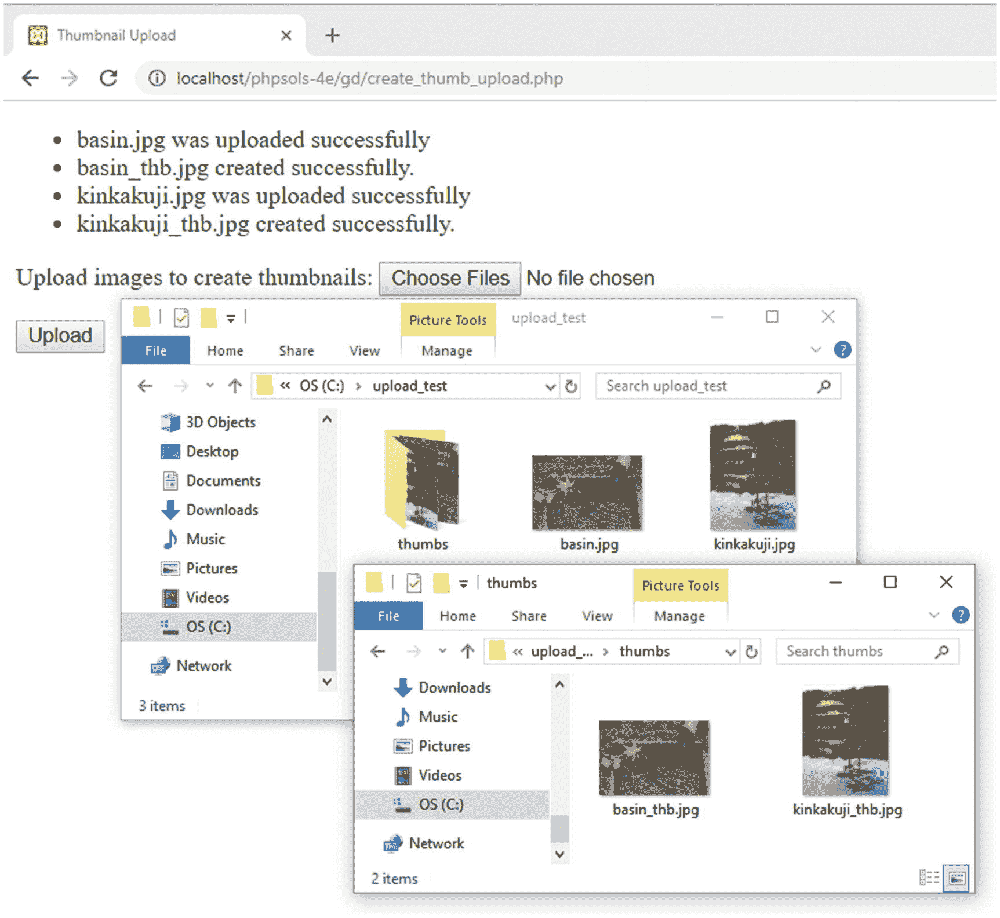

**图 10-7.** 缩略图与原始图片同时生成。

5.  通过再次上传相同的图片来测试`ThumbnailUpload`类。这次，原始图片和缩略图应按第 9 章的方式，通过在文件扩展名前添加一个数字来重命名。

6.  尝试不同的测试，例如更改插入到缩略图名称中的后缀，或者在创建缩略图后删除原始图片。如果遇到问题，请对照`ch10/PhpSolutions/Image`文件夹中的`ThumbnailUpload.php`检查您的代码。

**提示** 在不支持表单字段`multiple`属性的旧版浏览器中，该类会上传单张图片并从中创建缩略图。为了支持旧版浏览器进行多文件上传，请在表单中创建多个文件字段，并为它们赋予相同的`name`属性，后跟一对空方括号，如下所示：`name="image[]"`。

## 使用 ThumbnailUpload 类

`ThumbnailUpload`类易于使用。由于它使用了命名空间，请像这样在文件的顶层导入该类：

```
use PhpSolutions\Image\ThumbnailUpload;
```

然后包含类定义，并将上传文件夹的路径传递给类构造函数：

```
$loader = new ThumbnailUpload('C:/upload_test/');
```

如果希望在创建缩略图后删除原始图片，请将`true`作为第二个参数传递给构造函数，如下所示：

```
$loader = new ThumbnailUpload('C:/upload_test/', true);
```

该类具有以下公共方法：

*   `setThumbOptions()`：此方法用于设置保存缩略图片的文件夹路径。如果您不调用此方法，缩略图将存储在与原始图片相同的文件夹中。它还需要两个可选参数来设置缩略图的最大尺寸（以像素为单位，默认值为 120）以及更改插入到缩略图名称中的后缀（默认为`_thb`）。
*   `upload()`：此方法上传原始图片并生成缩略图。它需要一个必需参数：文件上传元素的名称。默认情况下，与现有文件同名的图片会被重命名。要覆盖现有图片，请将`false`作为可选的第二个参数传递给此方法。

该类还继承了父类`Upload`的以下方法：

*   `getMessages()`：获取由上传和缩略图生成过程产生的消息。
*   `getMaxSize()`：获取单张图片的最大上传大小。默认值为 50 KB。

由于`ThumbnailUpload`类依赖于`Upload`和`Thumbnail`类，当您在线上网站使用此类时，需要将这三个类定义文件全部上传到远程 Web 服务器。

## 本章回顾

这又是一个紧张密集的章节，它不仅仅展示了如何从大图中生成缩略图，还向您介绍了如何扩展现有类以及覆写继承的方法。设计和扩展类起初可能会让人感到困惑，但如果您专注于每个方法的功能，就会觉得它不那么令人生畏。类设计的一个关键原则是将大型任务分解成小的、可管理的单元。理想情况下，一个方法应执行单一任务，例如为原始图片创建图像资源。

使用类的真正优势在于，一旦定义好它们，就能节省大量时间和精力。与其每次想要为网站添加文件或缩略图上传功能时都输入数十行代码，调用类只需几行简单的代码。此外，不要认为本章的代码只能用于创建和上传缩略图片。类文件中的许多子程序都可以经过调整，用于其他场景。

在下一章中，您将全面学习 PHP 会话（session），它能够保存与特定用户相关的信息，并在保护网页密码方面发挥重要作用。

## 11. 具有记忆功能的页面：简单的登录和多页表单

万维网是一个绝妙的幻象。当您访问一个设计良好的网站时，您会感受到强烈的连续性，就像翻阅一本书籍或杂志的书页。所有元素都天衣无缝地融合成一个连贯的整体。但现实情况却大相径庭。一个网页的每个部分都由 Web 服务器独立存储和处理。除了需要知道将相关文件发送到哪里之外，服务器对您是谁毫无兴趣。每次 PHP 脚本运行时，变量仅存在于服务器的内存中，并且通常在脚本执行完毕后就被丢弃。即使是`$_POST`和`$_GET`数组中的变量，其生命周期也十分短暂。它们的值仅会被传递给下一个脚本一次，然后就从内存中移除，除非您对其进行处理，例如将信息存储在隐藏的表单字段中。即便如此，它也仅在表单被提交时才能持久存在。

为了解决这些问题，PHP 使用了**会话**。在简要描述会话的工作原理后，我将向您展示如何使用会话变量创建一个简单的、基于文件的登录系统，并在页面之间传递信息，而无需使用隐藏的表单字段。

在本章中，您将学习以下内容：

*   理解什么是会话以及如何创建它们
*   创建一个基于文件的登录系统
*   使用自定义类检查密码强度
*   为会话设置时间限制
*   使用会话在多页之间跟踪信息

### 什么是会话以及它们如何工作

会话通过在 Web 服务器上以及作为 Cookie 存储在访问者的计算机上存储一个随机标识符（即会话 ID）来确保连续性。Web 服务器使用这个 Cookie 来识别它正在与同一个人（或者更准确地说，与同一台计算机）进行通信。图 11-1 到 11-3 显示了我在本地测试环境中创建的一个简单会话的详细信息。

如图 11-1 所示，存储在浏览器中的 Cookie 名为`PHPSESSID`，其内容是一串杂乱的字母和数字。这个随机字符串就是会话的 ID。

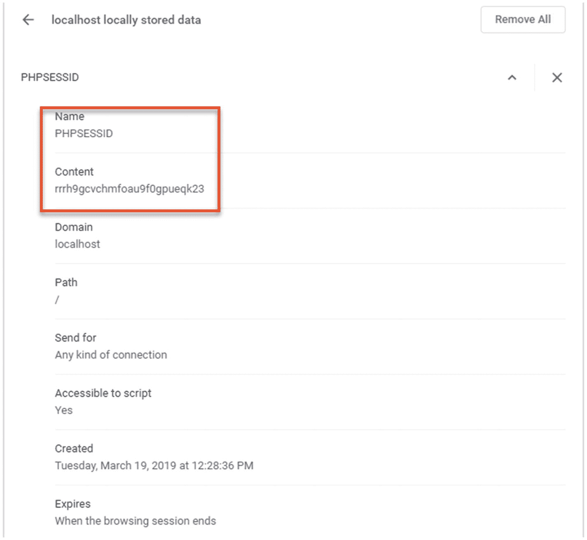


### 图 11-1  
PHP 会话在浏览器中存储一个包含唯一标识符的 Cookie  

在 Web 服务器上会创建一个匹配的文件，其文件名包含相同的一串字母和数字，如图 11-2 所示。  

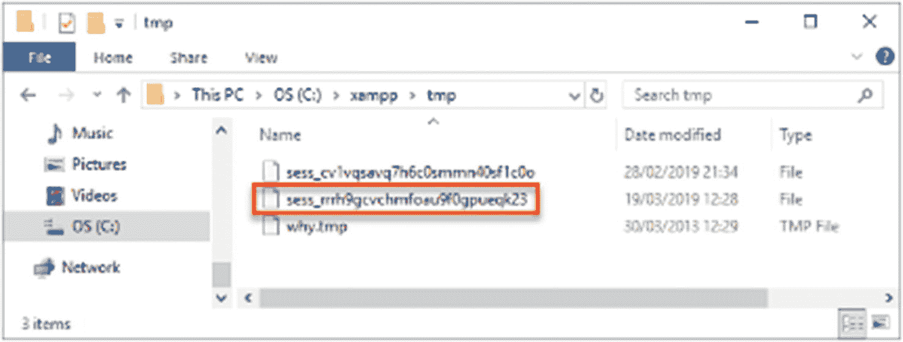  

### 图 11-2  
Cookie 中的内容用于标识存储在 Web 服务器上的会话数据  

当会话启动时，服务器会将信息存储在会话变量中，只要会话保持活动状态（通常直到浏览器关闭），其他页面就可以访问这些变量。由于会话 ID 对每个访问者都是唯一的，因此存储在会话变量中的信息不会被其他人看到。这意味着会话非常适合用于用户身份验证，尽管它也可以用于任何需要在页面间传递时为同一用户保存信息的场景，例如多页表单或购物车。  

存储在用户计算机上的唯一信息是包含会话 ID 的 Cookie，而该 ID 本身毫无意义。这意味着仅通过检查此 Cookie 的内容无法泄露隐私信息。  

会话变量及其值存储在 Web 服务器上。图 11-3 显示了一个简单会话文件的内容。可以看出，它是纯文本格式，内容并不难解读。图中显示的会话包含一个变量：`name`。变量名后面紧跟着一个竖线，然后是字母“s”、冒号、数字、另一个冒号，以及用引号括起来的变量值。其中“s”代表字符串，数字表示该字符串包含的字符数。因此，这个会话变量包含我的名字，作为一个长度为 5 个字符的字符串。  

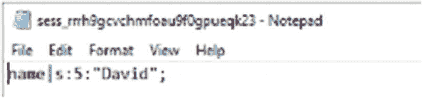  

### 图 11-3  
会话的详细信息以纯文本形式存储在服务器上  

这种设置具有若干含义。包含会话 ID 的 Cookie 通常会保持活动状态，直到浏览器关闭。因此，如果多人共用同一台计算机，除非他们在交给下一个人使用前总是关闭浏览器（这是你无法控制的），否则他们都可以访问彼此的会话。因此，提供一个注销机制来删除 Cookie 和会话变量以保持网站安全非常重要。你还可以创建一个超时机制，在用户一段时间不活动后自动防止任何人重新获得访问权限。  

将会话变量以纯文本形式存储在 Web 服务器上本身并不值得担忧。只要服务器配置正确，会话文件就无法通过浏览器访问。PHP 也会定期删除不活动的文件（理论上，生命周期为 1440 秒——即 24 分钟——但这并不可靠）。然而，显而易见的是，如果攻击者成功入侵服务器或劫持会话，信息就可能被泄露。因此，尽管会话通常足够安全，可用于保护网站部分的密码访问或处理多页表单，但绝不应将会话变量用于存储敏感信息，例如密码或信用卡详细信息。正如你将在本章后面的“使用会话限制访问”中看到的，虽然密码被用于访问受保护的站点，但密码本身是存储在单独位置（最好经过哈希处理）的，而不是作为会话变量存储。  

**注意**  
哈希是一种单向过程，它将纯文本打乱以生成唯一的消息摘要。它经常与加密混淆，加密允许对加密文本进行解密。当哈希正确执行时，无法逆转该过程来揭示原始密码。  

会话默认受支持，因此你不需要任何特殊配置。但是，如果用户浏览器中禁用了 Cookie，则会话将无法工作。可以将 PHP 配置为通过查询字符串发送会话 ID，但这被认为存在安全风险。  

## 创建 PHP 会话  

只需在要在会话中使用的每个 PHP 页面中放入以下命令：  

```  
session_start();  
```  

每个页面应仅调用此命令一次，并且必须在 PHP 脚本生成任何输出之前调用，因此最理想的位置是在 PHP 开始标签之后立即调用。如果在调用 `session_start()` 之前生成了任何输出，则该命令会失败，并且该页面的会话将不会被激活。（稍后会详细解释“Headers already sent”错误。）  

## 创建和销毁会话变量  

通过向 `$_SESSION` 超全局数组添加变量来创建会话变量，方式与分配普通变量相同。假设你想存储访问者的姓名并显示问候语。如果姓名通过登录表单以 `$_POST['name']` 的形式提交，你可以这样赋值：  

```  
$_SESSION['name'] = $_POST['name'];  
```  

现在可以在任何以 `session_start()` 开头的页面中使用 `$_SESSION['name']`。由于会话变量存储在服务器上，一旦脚本或应用程序不再需要它们，就应立即将其清除。像这样取消设置会话变量：  

```  
unset($_SESSION['name']);  
```  

要取消设置*所有*会话变量——例如，当你要注销某个用户时——可以将 `$_SESSION` 超全局数组设置为空数组，如下所示：  

```  
$_SESSION = [];  
```  

**警告**  
不要尝试使用 `unset($_SESSION)`。虽然它确实有效，但效果有点过于强大。它不仅会清除当前会话，还会阻止将来存储任何会话变量。  

## 销毁会话  

单独取消设置所有会话变量可以有效防止任何信息被重用，但你还应像这样使会话 Cookie 失效：  

```  
if (isset($_COOKIE[session_name()])) {  
    setcookie(session_name(), ", time()-86400, '/');  
}  
```  

这使用了 `session_name()` 函数动态获取会话名称，并将会话 Cookie 重置为空字符串，并设置为在 24 小时前过期（86400 是一天中的秒数）。最后一个参数（`'/'`）将 Cookie 应用于整个域名。  

最后，使用以下命令关闭会话：  

```  
session_destroy();  
```  

这个函数命名得并不恰当。它只是关闭会话。它不会销毁任何会话变量，也不会取消设置会话 Cookie。使会话 Cookie 失效并关闭会话以避免未经授权的人员访问网站的受限部分或会话期间交换的任何信息，这一点非常重要。然而，访问者可能会忘记注销，因此并非总能保证会话会正确关闭，这就是为什么不在会话变量中存储敏感信息如此重要的原因。  

**注意**  
PHP 7 不支持旧脚本中常见的 `session_register()` 或 `session_unregister()`。  

## 重新生成会话 ID  

当用户状态发生变化时（例如登录后），作为安全措施，建议重新生成会话 ID。这会更改标识会话的随机字母和数字字符串，但保留存储在会话变量中的所有信息。在 *Pro PHP Security, 2nd Edition* (Apress, 2010, ISBN 978-1-4302-3318-3) 一书中，Chris Snyder 和 Michael Southwell 解释说：“生成新会话 ID 的目标是消除这样一种可能性（无论多么微小）：了解低级安全会话的攻击者可能能够执行高级安全任务。”  

要重新生成会话 ID，只需调用 `session_regenerate_id()` 并将用户重定向到另一个页面或重新加载同一页面。  

## “Headers already sent”错误


## 使用会话限制访问

虽然使用 PHP 会话非常容易，但有一个问题会让初学者抓耳挠腮。你可能看不到代码按预期工作，而是看到以下信息：

```
Warning: Cannot add header information - headers already sent
```

我之前在介绍 `header()` 函数时多次提到过这个问题。它同样会影响 `session_start()` 和 `setcookie()`。对于 `session_start()`，解决方案很简单：确保将其紧跟在 PHP 起始标签之后（或紧随其后），并检查起始标签前没有空格。

有时即使 PHP 标签前没有空格，问题也会出现。这通常是由编辑软件在脚本开头插入字节顺序标记（BOM）引起的。如果发生这种情况，请打开脚本编辑器的偏好设置，并禁用 PHP 页面中的 BOM 使用。

然而，在使用 `setcookie()` 销毁会话 cookie 时，很可能需要在调用该函数之前向浏览器发送输出。在这种情况下，PHP 允许你使用 `ob_start()` 将输出保存在缓冲区中。然后，在 `setcookie()` 完成其工作后，使用 `ob_end_flush()` 刷新缓冲区。你将在 PHP 解决方案 11-2 中看到如何执行此操作。

## 使用会话限制访问

在考虑限制网站访问时，脑海中可能首先浮现的词是“用户名”和“密码”。尽管这两者通常是进入网站的钥匙，但它们都不是会话的必要条件。你可以将任何值存储为会话变量，并使用它来决定是否授予对页面的访问权限。例如，你可以创建一个名为 `$_SESSION['status']` 的变量，并根据其值允许访问者访问网站的不同部分，或者如果该变量未设置，则完全拒绝访问。

一个小小的演示应该能让一切清晰明了，并让你了解会话在实际中是如何工作的。

## PHP 解决方案 11-1：一个简单的会话示例

这应该只需要几分钟就能构建完成，但你也可以在 `ch11` 文件夹中的 `session_01.php`、`session_02.php` 和 `session_03.php` 中找到完整的代码。

1.  在 `phpsols-4e` 站点根目录中创建一个名为 `sessions` 的新文件夹，并在其中创建一个名为 `session_01.php` 的页面。插入一个包含名为 `name` 的文本字段和一个 `提交` 按钮的表单。将 `method` 设置为 `post`，`action` 设置为 `session_02.php`。表单应如下所示：

```
<form method="post" action="session_02.php">
  输入您的姓名：<input type="text" name="name" />
  <input type="submit" name="submit" value="提交" />
</form>
```

2.  在另一个名为 `session_02.php` 的页面中，在 `DOCTYPE` 声明上方插入以下代码：

```
<?php
session_start();
if (isset($_POST['name'])) {
  $_SESSION['name'] = $_POST['name'];
}
?>
```

内联注释解释了正在发生的事情。会话启动，只要 `$_POST['name']` 不为空，其值就会被赋给 `$_SESSION['name']`。

3.  在 `session_02.php` 的 `<body>` 标签之间插入以下代码：

```
<?php
if (isset($_SESSION['name'])) {
  echo '您好，' . htmlentities($_SESSION['name']) . '。<a href="session_03.php">下一页</a>';
} else {
  // 如果未设置，则返回登录页面
  echo '您是谁？请<a href="session_01.php">登录</a>';
}
?>
```

如果设置了 `$_SESSION['name']`，则会显示一条欢迎消息以及一个指向 `session_03.php` 的链接。否则，页面会告诉访问者无法识别试图访问的用户，并提供一个返回第一页的链接。

#### 注意

输入以下代码行时要小心：
```
echo '您好，' . htmlentities($_SESSION['name']) . '。<a href="session_03.php">下一页</a>';
```
前两个句点（围绕 `htmlentities($_SESSION['name'])`）是 PHP 的字符串连接运算符。第三个句点（紧跟在单引号之后）是一个普通的句点，将作为字符串的一部分显示。

1.  创建 `session_03.php`。在 `DOCTYPE` 上方输入以下代码以启动会话：

```
<?php
session_start();
?>
```

2.  在 `session_03.php` 的 `<body>` 标签之间插入以下代码：

```
<?php
if (isset($_SESSION['name'])) {
  echo '您好 ' . htmlentities($_SESSION['name']) . '。下次再见。';
  // 取消设置会话变量
  unset($_SESSION['name']);
  // 使会话 cookie 失效
  if (isset($_COOKIE[session_name()])) {
    setcookie(session_name(), '', time()-86400, '/');
  }
  // 结束会话
  session_destroy();
  echo '<a href="session_02.php">返回页面 2</a>';
} else {
  // 如果无法识别则显示
  echo "抱歉，我不认识您。";
  echo '<a href="session_01.php">请登录</a>';
}
?>
```

如果设置了 `$_SESSION['name']`，页面会显示它，然后取消设置它并使当前会话 cookie 失效。通过将 `session_destroy()` 放在第一个代码块的末尾，该会话及其相关变量将不再可用。

3.  在浏览器中加载 `session_01.php`，在文本字段中键入您的姓名，然后单击“提交”。

4.  您应该会看到类似以下截图的内容。在此阶段，这里发生的情况与普通表单没有明显区别。

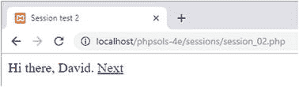

5.  当您单击“下一页”时，会话的威力开始显现。即使 `$_POST` 数组不再可用，页面也会记住您的姓名。在大多数情况下，您可能会看到类似于以下截图的内容。

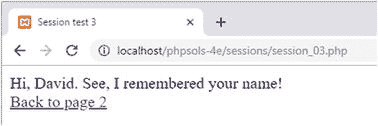

然而，在某些服务器上，您可能会收到以下警告消息，提示无法修改头信息，因为头信息已发送。

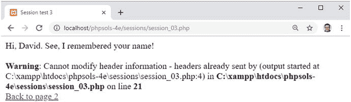

#### 注意

如第 5 章所述，如果服务器配置为缓冲前 4 KB 的输出，则不会产生关于头信息的警告。但是，并非所有服务器都会缓冲输出，因此解决此问题很重要。

1.  单击指向页面 2 的链接（如果您收到错误消息，它就在消息下方）。会话已被销毁，所以这次 `session_02.php` 不知道您是谁。

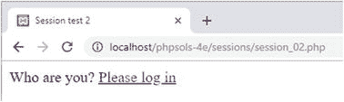

2.  在浏览器地址栏中键入 `session_03.php` 的地址并加载它。它同样不记得会话，并显示相应的消息。

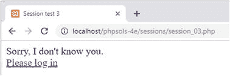

即使您在步骤 8 中没有收到警告消息，当您将依赖会话的页面部署到其他服务器时，也需要防止这种情况发生。错误消息不仅看起来糟糕，而且意味着 `setcookie()` 无法使会话 cookie 失效。尽管 `session_start()` 紧跟在 `session_03.php` 中 PHP 起始标签之后，但警告消息是由 `DOCTYPE` 声明、`<head>` 以及 `setcookie()` 之前输出的其他 HTML 触发的。

## PHP 解决方案 11-2：使用 `ob_start()` 缓冲输出

虽然你可以将 `setcookie()` 放在 `DOCTYPE` 声明上方的 PHP 代码块中，但你还需要将 `$_SESSION['name']` 的值赋给一个普通变量，因为在会话销毁后它就不再存在了。与其将整个脚本拆开，不如使用 `ob_start()` 来缓冲输出。

继续使用上一节中的 `session_03.php`。

1.  像这样修改 `DOCTYPE` 声明上方的 PHP 代码块：

```
<?php
session_start();
ob_start();
?>
```

这会开启输出缓冲，并防止输出被发送到浏览器，直到脚本结束或你使用 `ob_end_flush()` 专门刷新输出。

2.  在使会话 cookie 失效后立即刷新输出，如下所示：

```
<?php
if (isset($_SESSION['name'])) {
  echo '您好 ' . htmlentities($_SESSION['name']) . '。下次再见。';
  unset($_SESSION['name']);
  if (isset($_COOKIE[session_name()])) {
    setcookie(session_name(), '', time()-86400, '/');
  }
  ob_end_flush();
  session_destroy();
  echo '<a href="session_02.php">返回页面 2</a>';
} else {
  echo "抱歉，我不认识您。";
  echo '<a href="session_01.php">请登录</a>';
}
?>
```


```
    // 使会话 cookie 失效
    if (isset($_COOKIE[session_name()])) {
        setcookie(session_name(), "", time()-86400, '/');
    }
    ob_end_flush();
    ```

3.  保存`session_03.php`并再次测试该序列。这次应该不会出现警告。更重要的是，会话 cookie 不再有效。（更新后的代码位于`session_04.php`中。）

## 使用基于文件的身份验证

正如您刚才所见，会话变量和条件语句的组合让您能够根据是否设置了某个会话变量，向访问者呈现完全不同的页面。您只需要添加一个密码检查系统，就拥有了一个基本的用户身份验证系统。

在深入探讨代码之前，让我们先考虑一下安全密码这个重要问题。

### 使密码安全

密码绝不应存储在可公开访问的位置。换句话说，如果您使用基于文件的身份验证系统，该文件必须位于 Web 服务器的文档根目录之外。此外，密码不应以纯文本形式保存。为了更高的安全性，建议对密码进行哈希处理。多年来，建议使用`MD5`或`SHA-1`算法将密码哈希为 32 位或 40 位的十六进制数字。它们最初的优势之一——速度，却变成了一个主要弱点。自动脚本可以在暴力攻击中每秒处理大量计算，以确定原始值——这与其说是猜测，不如说是尝试每一种可能的组合。

目前的建议是使用两个函数：`password_hash()`和`password_verify()`，它们提供了更强大的密码哈希和验证系统。要哈希一个密码，只需将其传递给`password_hash()`函数，如下所示：

```
$hashed = password_hash($password, PASSWORD_DEFAULT);
```

`password_hash()`的第二个参数是一个常量，它将加密方法交给 PHP 处理，让您能够随时跟上被认为是最安全的加密方法。

> **注意**：`password_hash()`函数为高级用户提供了其他选项。详情请参见[`www.php.net/manual/en/function.password-hash.php`](http://www.php.net/manual/en/function.password-hash.php)。还有一个关于安全密码哈希的常见问题解答页面，位于[`www.php.net/manual/en/faq.passwords.php`](http://www.php.net/manual/en/faq.passwords.php)。

使用`password_hash()`会以一种无法逆转的方式打乱纯文本密码。这意味着即使您的密码文件泄露，也没人能找出密码是什么。这也意味着您无法将密码转换回其原始值。从某方面来说，这并不重要：当用户登录时，`password_verify()`会根据哈希版本检查提交的值。缺点在于，如果用户忘记密码，您无法发送密码提醒；必须创建一个新密码。尽管如此，良好的安全性要求对密码进行哈希处理。

哈希处理无法防范密码最常见的问题：那些容易猜测或使用常见单词的密码。许多注册系统现在通过要求混合使用字母数字字符和符号来强制使用更强的密码。

因此，首要任务是创建一个用户注册表单，用于检查以下内容：

*   密码和用户名包含最少字符数
*   密码符合最低强度标准，例如包含数字、大写和小写字符以及符号的混合
*   密码与确认字段中的第二次输入匹配
*   用户名未被使用

### PHP 解决方案 11-3：创建密码强度检查器

本 PHP 解决方案展示如何创建一个类，用于检查密码是否满足特定要求，例如空格的使用、最少字符数以及不同类型字符的组合。默认情况下，该类仅检查密码是否只包含单个空格、开头或结尾没有空格，以及包含最少字符数。可选方法允许您设置更严格的条件，例如使用大小写字符、数字和非字母数字符号的组合。

本 PHP 解决方案从构建用户注册表单开始，该表单也将在 PHP 解决方案 11-4 中使用。

1.  在`sessions`文件夹中创建一个名为`register.php`的页面，并插入一个包含三个文本输入字段和一个提交按钮的表单。按下图所示布局表单并命名输入元素。如果想节省时间，请使用`ch11`文件夹中的`register_01.php`。

    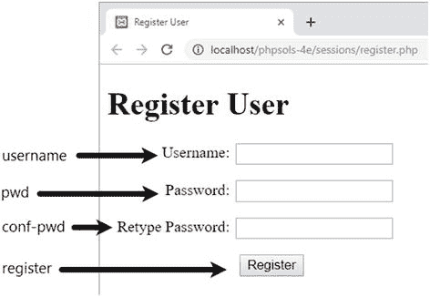

2.  一如既往，您希望仅在表单已提交时才运行处理脚本，因此所有内容都需要包含在一个条件语句中，该语句检查提交按钮的`name`属性是否在`$_POST`数组中。然后，您需要检查输入是否满足您的最低要求。在`DOCTYPE`声明上方的 PHP 代码块中插入以下代码：

    ```
    if (isset($_POST['register'])) {
        $username = trim($_POST['username']);
        $password = trim($_POST['pwd']);
        $retyped = trim($_POST['conf_pwd']);
        require_once '../PhpSolutions/Authenticate/CheckPassword.php';
    }
    ```

    条件语句内部的代码将三个文本字段的输入传递给`trim()`以去除开头和结尾的空白，并将结果赋值给简单变量。接下来，它包含将包含密码检查类的文件，您将在下一步中定义该类。

3.  在`PhpSolutions`文件夹中创建一个名为`Authenticate`的新文件夹。然后在新文件夹中创建一个名为`CheckPassword.php`的文件。该文件将只包含 PHP 脚本，因此请删除所有 HTML 并添加以下代码：

    ```
    <?php
    namespace PhpSolutions\Authenticate;

    class CheckPassword {
        protected $password;
        protected $minChars;
        protected $mixedCase = false;
        protected $minNums = 0;
        protected $minSymbols = 0;
        protected $errors = [];

        public function __construct($password, $minChars = 8) {
            $this->password = $password;
            $this->minChars = $minChars;
        }

        public function check() {
            if (preg_match('/\s{2,}/', $this->password)) {
                $this->errors[] = '密码只能包含单个空格。';
            }
            if (preg_match('/^\s+|\s+$/', $this->password)) {
                $this->errors[] = '密码不能以空格开头或结尾。';
            }
            if (strlen($this->password) < $this->minChars) {
                $this->errors[] = "密码长度至少需要 $this->minChars 个字符。";
            }
            return $this->errors ? false : true;
        }

        public function getErrors() {
            return $this->errors;
        }
    }
    ```

    这定义了基本的`CheckPassword`类，该类最初仅检查密码是否包含多个空格、是否以空格开头或结尾，以及是否满足所需的最少字符数。您稍后将添加其他特性。

    文件首先声明`PhpSolutions\Authenticate`作为其命名空间，然后定义具有六个受保护属性的`CheckPassword`类。前两个用于密码和最少字符数。`$mixedCase`、`$minNums`和`$minSymbols`属性将用于增加密码强度，但初始设置为`false`或 0。`$errors`属性将用于在密码未通过任何检查时存储错误消息数组。

    构造函数方法接受两个参数：密码和最少字符数，并将它们分配给相关属性。默认情况下，最少字符数设置为 8，使其成为可选参数。


`check()` 方法包含三个条件语句。第一个使用 `preg_match()` 和正则表达式，搜索密码中两个或更多连续空白字符。第二个条件语句使用另一个正则表达式检查密码开头或结尾的空格，而第三个条件语句使用 `strlen()`，该函数返回字符串长度，并将结果与 `$minChars` 进行比较。

如果密码未通过任何这些测试，`$errors` 属性至少包含一个元素，PHP 将其视为 `true`。`check()` 方法中的最后一行使用 `$errors` 属性作为三元运算符的条件。如果发现任何错误，`check()` 方法返回 `false`，表示密码验证失败。否则返回 `true`。（如果需要复习三元运算符的工作原理，请参阅第 4 章的“使用三元运算符”部分。）

`getErrors()` 公有方法只是返回错误消息的数组。

3. 保存 `CheckPassword.php` 并切换到 `register.php`。
4. 在 `register.php` 中，在 PHP 开始标签之后立即添加以下行以导入 `CheckPassword` 类：

```
use PhpSolutions\Authenticate\CheckPassword;
```

**注意**：你必须在脚本的顶层导入带命名空间的类。尝试在条件语句中导入该类会产生解析错误。

1. 在表单提交后执行代码的条件语句内部，创建一个 `CheckPassword` 对象，将 `$password` 作为参数传递。然后调用 `check()` 方法并按如下方式处理结果：

```
require_once '../PhpSolutions/Authenticate/CheckPassword.php';
$checkPwd = new CheckPassword($password);
if ($checkPwd->check()) {
    $result = ['Password OK'];
} else {
    $result = $checkPwd->getErrors();
}
```

`CheckPassword` 构造函数的第二个参数是可选的，因此省略它会将最小字符数设置为默认值 8。`check()` 方法的结果被用作条件语句的条件。如果返回 `true`，则将报告密码正确的单元素数组赋值给 `$result`。否则，使用 `getErrors()` 方法从 `$checkPwd` 对象检索错误数组。

**注意**：测试完成后，单元素数组将被注册用户的脚本替换。你需要使用数组，因为下一步使用 `foreach` 循环来显示结果。

1. 在页面正文中表单正上方添加以下 PHP 代码块：

```
<?php if (isset($result)) { ?>
    <ul>
    <?php foreach ($result as $item) { ?>
        <li><?= $item ?></li>
    <?php } ?>
    </ul>
<?php } ?>
```

这会在表单提交后以无序列表的形式显示密码测试结果。

2. 保存 `register.php` 并在浏览器中加载它。单击“注册”按钮而不填写任何字段来测试 `CheckPassword` 类。你应该会看到一条消息，告知密码至少需要 8 个字符。

3. 尝试使用包含 8 个字符的密码。你应该会看到 `Password OK`。

4. 尝试使用至少 8 个字符但中间插入空格的密码。你应该会看到 `Password OK`。

5. 在中间放入两个连续的空格。你会被警告只允许单个空格。

6. 尝试少于 8 个字符且中间有多个连续空格的密码。你会看到以下警告：

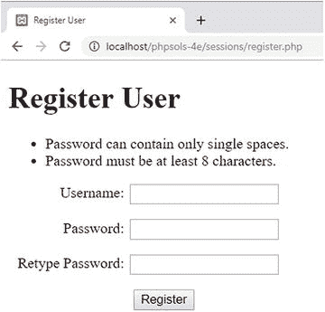

1. 更改 `register.php` 中的代码，将可选的第二个参数传递给 `CheckPassword` 构造函数，将最小字符数设置为 10：


1.  `$checkPwd = new CheckPassword($password, 10);`

2.  保存并再次测试页面。如果遇到任何问题，请将你的代码与`ch11`文件夹中的`register_02.php`以及`ch11/PhpSolutions/Authenticate`文件夹中的`CheckPassword_01.php`进行对比。

3.  假设你的代码可以正常工作，请在`CheckPassword.php`的类定义中添加用于设置密码强度的公有方法。从技术上讲，将这些方法放在类定义的哪个位置并无差别（只要它们位于花括号内），但我更倾向于按照方法的使用顺序来放置公有方法。你需要在调用`check()`方法之前设置好各项选项，因此请将以下代码插入到构造函数和`check()`方法定义之间：

```
public function requireMixedCase() {
    $this->mixedCase = true;
}
public function requireNumbers($num = 1) {
    if (is_numeric($num) && $num > 0) {
        $this->minNums = (int) $num;
    }
}
public function requireSymbols($num = 1) {
    if (is_numeric($num) && $num > 0) {
        $this->minSymbols = (int) $num;
    }
}
```

这段代码非常直观。`requireMixedCase()`方法不接受任何参数，并将`$mixedCase`属性重置为`true`。另外两个方法接受一个参数，检查该参数是否大于 0 的数值，并将其赋值给相应的属性。`(int)`类型转换运算符确保它是一个整数（详细说明请参见第 4 章的“显式更改变量的数据类型”）。`$num`的值设置了密码必须包含的数字或非字母数字符号的最小数量。默认情况下，该值设置为 1，使这个参数变为可选。

4.  需要更新`check()`方法，以对这些强度标准执行必要的检查。请按如下方式修改代码：

```
public function check() {
    if (preg_match('/\s{2,}/', $this->password)) {
        $this->errors[] = '密码只能包含单个空格。';
    }
    if (preg_match('/^\s+|\s+$/', $this->password)) {
        $this->errors[] = '密码不能以空格开头或结尾。';
    }
    if (strlen($this->password) < $this->minChars) {
        $this->errors[] = "密码长度至少需要 $this->minChars 个字符。";
    }
    if ($this->mixedCase) {
        $pattern = '/(?=.*\p{Ll})(?=.*\p{Lu})/u';
        if (!preg_match($pattern, $this->password)) {
            $this->errors[] = '密码应包含大写和小写字符。';
        }
    }
    if ($this->minNums) {
        $pattern = '/\d/';
        $found = preg_match_all($pattern, $this->password, $matches);
        if ($found < $this->minNums) {
            $this->errors[] = "密码应至少包含 $this->minNums 个数字。";
        }
    }
    if ($this->minSymbols) {
        $pattern = '/[\p{S}\p{P}]/u';
        $found = preg_match_all($pattern, $this->password, $matches);
        if ($found < $this->minSymbols) {
            $this->errors[] = "密码应至少包含 $this->minSymbols 个非字母数字字符。";
        }
    }
    return $this->errors ? false : true;
}
```

这三个新的条件语句，每一个都仅在`check()`方法之前调用了对应的公有方法时才会执行。每个语句都将一个正则表达式存储为`$pattern`，然后使用`preg_match()`或`preg_match_all()`来测试密码。

如果将`$mixedCase`属性设置为`true`，正则表达式和密码会被传递给`preg_match()`，以在密码的任何位置查找至少一个小写字母和至少一个大写字母。该正则表达式使用了 Unicode 类别元字符来匹配小写和大写字母，因此允许的字符不限于未重音的 A–Z 字母。结尾定界符后的小写`u`是一个修饰符，它使模式字符串和主题字符串被视为 UTF-8 编码。

`$minNums`和`$minSymbols`属性默认为 0。如果它们被重置为正数，则正则表达式和密码会被传递给 `preg_match_all()` 函数，以查找正则表达式匹配的次数。该函数需要三个参数：正则表达式、要搜索的字符串以及一个用于存储匹配结果的变量；它返回找到的匹配数量。在这种情况下，你只关心匹配的数量。存储匹配结果的变量会被丢弃。

最后一个条件语句中的`$pattern`使用了 Unicode 类别元字符来匹配数学符号、货币符号、标点符号以及其他符号，同时使用了 UTF-8 修饰符。

5.  保存`CheckPassword.php`，并通过在`register.php`中调用新方法来测试更新后的类。例如，以下代码要求密码至少包含十个字符，至少一个大写字母和一个小写字母，两个数字以及一个非字母数字符号：

```
$checkPwd = new CheckPassword($password, 10);
$checkPwd->requireMixedCase();
$checkPwd->requireNumbers(2);
$checkPwd->requireSymbols();
if ($checkPwd->check()) {
```

调用这些新方法的顺序无关紧要，只要它们在构造函数之后、在调用`check()`方法之前即可。使用不同的组合来强制实施不同的密码强度。

如有必要，请对照`ch11`文件夹中的`register_03.php`以及`ch11/PhpSolutions/Authenticate`文件夹中的`CheckPassword_02.php`检查你的代码。

在开发本章代码时，我最初将密码检查器设计为一个函数。函数内部的代码基本相同，但我决定将其转换为一个类，以使其更灵活且更易于使用。这个函数的问题在于它需要大量参数来设置不同的选项，而且很难记住参数顺序。此外，处理结果也很困难。如果没有错误，函数返回`true`；但如果发现任何错误，它会返回错误消息数组。由于 PHP 将包含元素的数组隐式视为`true`，这意味着必须使用恒等运算符（三个等号——参见表 4-6）来检查结果是否为布尔值`true`。将代码转换为类消除了这些问题。用于设置选项的公有方法具有直观的名称，并且可以按任意顺序设置——也可以完全不设置。并且结果始终是布尔值`true`或`false`，因为有一个单独的方法来检索错误消息数组。虽然这涉及编写更多代码，但这些改进使其物有所值。

## PHP 方案 11-4：创建基于文件的用户注册系统

此 PHP 方案创建了一个简单的用户注册系统，该系统使用`password_hash()`函数对密码进行哈希处理。它使用 PHP 方案 11-3 中的`CheckPassword`类来强制满足最低强度要求。进一步的检查确保用户名包含最少数量的字符，并且用户在第二个字段中正确重新输入了密码。用户凭据存储在一个纯文本文件中，该文件必须位于 Web 服务器的文档根目录之外。本说明假设你已经设置了一个 PHP 具有写入权限的`private`文件夹，如第 7 章所述。并假设你熟悉该章节中“使用 fopen()追加内容”部分。

继续使用之前 PHP 方案中的文件进行操作。或者，使用`ch11`文件夹中的 `register_03.php` 以及 `ch11/PhpSolutions/Authenticate` 文件夹中的 `CheckPassword_02.php`。

1.  在`includes`文件夹中创建一个名为`register_user_csv.php`的文件，并删除脚本编辑器可能插入的任何 HTML 代码。


2.  使用命名空间类时，`import`语句必须与使用该类位于同一文件中，即使它是包含文件。从`register.php`顶部删除以下行，并将其粘贴到`register_user_csv.php`中。

```
use PhpSolutions\Authenticate\CheckPassword;
```

3.  从`register.php`中删除以下代码，并将其粘贴到`register_user_csv.php`中的`import`语句之后（密码强度设置不同也没关系）：

```
require_once '../PhpSolutions/Authenticate/CheckPassword.php';
$checkPwd = new CheckPassword($password, 10);
$checkPwd->requireMixedCase();
$checkPwd->requireNumbers(2);
$checkPwd->requireSymbols();
if ($checkPwd->check()) {
$result = ['Password OK'];
} else {
$result = $checkPwd->getErrors();
}
```

4.  在`register.php`中`DOCTYPE`声明上方剩余脚本的末尾，创建一个变量，用于存储将存储用户凭据的文本文件的位置；包含`register_user_csv.php`。`register.php`顶部 PHP 块中的代码现在应如下所示：

```
if (isset($_POST['register'])) {
$username = trim($_POST['username']);
$password = trim($_POST['pwd']);
$retyped = trim($_POST['conf_pwd']);
$userfile = 'C:/private/hashed.csv';
require_once '../includes/register_user_csv.php';
}
```

用户凭据的 CSV 文件尚不存在。当第一个用户注册时，它将自动创建。必要时，修改指向`private`文件夹的路径，以匹配您自己的设置。

5.  在`register_user_csv.php`中，粘贴您在第 3 步中从`register.php`删除的代码，并修改包含类定义的命令，如下所示：

```
require_once __DIR__ . '/../PhpSolutions/Authenticate/CheckPassword.php';
```

您需要调整相对路径，因为`register_user_csv.php`也是一个包含文件（请参阅第 5 章中的“嵌套包含文件”）。

6.  紧接在`include`命令之后插入以粗体突出显示的代码：

```
require_once __DIR__ . '/../PhpSolutions/Authenticate/CheckPassword.php';
$usernameMinChars = 6;
$errors = [];
if (strlen($username) < $usernameMinChars) {
$errors[] = "Username must be at least $usernameMinChars characters.";
}
if (!preg_match('/^[-_\p{L}\d]+$/ui', $username)) {
$errors[] = 'Only alphanumeric characters, hyphens, and underscores are permitted in username.';
}
$checkPwd = new CheckPassword($password, 10);
```

新代码的前两行指定了用户名的**最小字符数**，并初始化了一个用于存储错误消息的空数组。新代码的其余部分检查用户名的长度，并测试它是否包含除字母、数字、连字符和下划线以外的任何字符。检查用户名的正则表达式接受所有 UTF-8 字母，包括带重音符号的字符。虽然这允许使用非常广泛的字符，但它可以防止用户注册可能用于注入恶意代码的名称。

7.  像这样修改`register_user_csv.php`底部的代码：

```
if (!$checkPwd->check()) {
$errors = array_merge($errors, $checkPwd->getErrors());
}
if ($password != $retyped) {
$errors[] = "Your passwords don't match.";
}
if ($errors) {
$result = $errors;
} else {
$result = ['All OK'];
}
```

这为测试将`CheckPassword`对象的`check()`方法返回值的条件添加了逻辑非运算符。如果密码验证失败，则使用`array_merge()`将`$checkPwd->getErrors()`的结果与现有的`$errors`数组合并。

下一个条件语句将`$password`与`$retyped`进行比较，如果它们不匹配，则向`$errors`数组添加一条错误消息。

如果发现任何错误，最后一个条件语句将`$errors`数组赋值给`$result`。否则，将一个单元素数组赋值给`$result`，报告一切正常。同样，这仅用于测试目的。一旦检查了代码，注册用户的脚本将替换最终的条件语句。

8.  保存`register_user_csv.php`和`register.php`，然后再次测试表单。将所有字段留空，然后单击“Register”。您应该会看到以下错误消息：

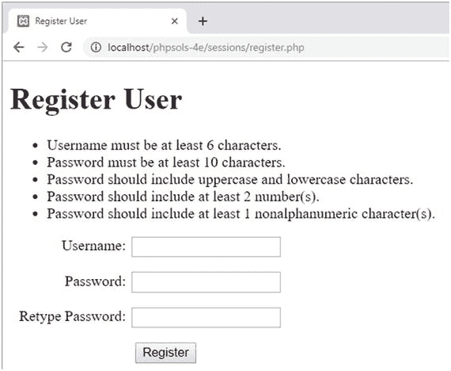

尝试各种测试以确保您的验证代码正常工作。

如果遇到问题，请将您的代码与`ch11`文件夹中的`register_user_csv_01.php`和`register_04.php`进行比较。

假设您的代码正常，您就可以创建脚本的注册部分了。让我们暂停一下，思考主脚本需要做什么。首先，您需要对密码进行哈希处理。然后，在将详细信息写入 CSV 文件之前，您必须检查用户名是否唯一。这带来了一个关于使用哪种`fopen()`模式的问题。

**注意**  各种`fopen()`模式在 7 章中有所描述。

理想情况下，您希望内部指针位于文件的开头，以便可以循环遍历现有记录。`r+`模式可以做到这一点，但除非文件已存在，否则操作会失败。不能使用`w+`，因为它会删除现有内容。也不能使用`x+`，因为如果同名的文件已存在，它会失败。

这样就只剩下`a+`和`c+`作为具有您所需灵活性的唯一选项：两者都能在必要时创建文件，并允许您读取和写入。它们的区别在于打开文件时内部指针的位置：`a+`将其放在末尾，而`c+`将其放在开头。这使得`c+`对于检查现有记录更有用，但`a+`具有始终将新内容附加到文件末尾的优势。这避免了意外覆盖现有值的危险。我们将以`a+`模式打开 CSV 文件。

第一次运行脚本时，文件是空的（您可以通过`filesize()`函数返回`0`来判断），因此您可以继续使用`fputcsv()`写入详细信息。这是`fgetcsv()`的对应函数，在第 7 章中对`fgetcsv()`进行了描述。`fgetcsv()`一次从 CSV 文件中提取一行数据，而`fputcsv()`则创建一个 CSV 记录。它有两个必需参数：文件引用和要作为 CSV 记录插入的值数组。它还接受可选参数来设置分隔符和封闭字符（请参阅[`www.php.net/manual/en/function.fputcsv.php`](http://www.php.net/manual/en/function.fputcsv.php)上的在线文档）。

如果`filesize()`没有返回`0`，则需要重置内部指针并循环遍历记录，以检查用户名是否已注册。如果找到匹配项，则跳出循环并准备错误消息。如果在循环结束时没有找到匹配项，则说明这是一个需要添加到文件中的新用户名。既然您了解了脚本的流程，就可以将其插入到`register_user_csv.php`中。

9.  删除`register_user_text.inc.php`底部的以下代码：

```
if ($errors) {
$result = $errors;
} else {
$result = ['All OK'];
}
```

10. 将其替换为以下代码：


