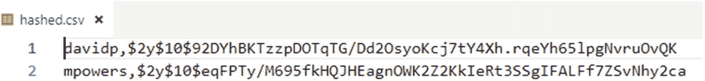
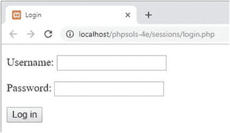
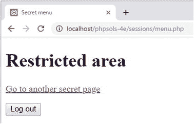
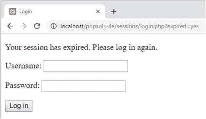

# PHP 用户注册与密码验证

## 代码分析与注释

以下代码展示了用户注册流程中的密码哈希和文件操作：

```php
if (!$errors) {
    // 使用默认算法对密码进行哈希处理
    $password = password_hash($password, PASSWORD_DEFAULT);
    // 以追加模式打开文件
    $file = fopen($userfile, 'a+');
    // 如果文件大小为 0，则尚未注册任何用户名
    // 因此直接将用户名和密码作为 CSV 写入文件
    if (filesize($userfile) === 0) {
        fputcsv($file, [$username, $password]);
        $result = "$username 已注册。";
    } else {
        // 如果文件大小大于 0，则先检查用户名
        // 将内部指针移动到文件开头
        rewind($file);
        // 逐行循环读取文件
        while (($data = fgetcsv($file)) !== false) {
            if ($data[0] == $username) {
                $result = "$username 已被占用 - 请选择其他用户名。";
                break;
            }
        }
        // 如果$result 未设置，则用户名可用
        if (!isset($result)) {
            // 插入新的 CSV 记录
            fputcsv($file, [$username, $password]);
            $result = "$username 已注册。";
        }
        // 关闭文件
        fclose($file);
    }
}
```

前面的说明和内联注释应该能帮助你理解这个脚本。

11. 注册脚本将结果存储在`$result`或`$errors`数组中。修改`register.php`主体中的代码，以显示结果或错误消息，如下所示：

```php
echo '<ul>';
if (!empty($errors)) {
    foreach ($errors as $item) {
        echo "<li>$item</li>";
    }
} else {
    echo "<li>$result</li>";
}
echo '</ul>';
```

这段代码会遍历`$errors`数组（如果它不为空）。否则，它会将`$result`（字符串）显示为单个项目符号项。

12. 保存`register_user_csv.php`和`register.php`，然后测试注册系统。尝试多次注册同一个用户名。你应该会看到一条消息，提示该用户名已被占用，并要求你选择另一个用户名。

13. 打开`hashed.csv`。你应该会看到明文形式的用户名，但密码应该是经过哈希处理的。即使为两个不同的用户选择相同的密码，哈希后的版本也不同，因为`password_hash()`在加密密码之前会添加一个称为**盐**的随机值。图[11-4]显示了两个都使用密码`Codeslave&Ch11`注册的用户。



**图 11-4.** 使用盐会对相同的密码产生完全不同的加密结果

如有必要，请对照`ch11`文件夹中的`register_user_csv_02.php`和`register_05.php`检查你的代码。

**提示** `register_user_csv.php`中的大部分代码都是通用的。要将其用于任何注册表单，你只需在包含它之前定义`$username`、`$password`、`$retyped`和`$userfile`，并使用`$errors`和`$result`捕获结果。你可能需要对外部文件进行的唯一更改是设置用户名的最小字符数以及设置密码强度的参数。这些设置定义在文件的顶部，因此易于访问和调整。

## 使用`password_verify()`验证哈希密码

`password_verify()`函数的功能正如你所期望的那样：它验证使用`password_hash()`加密的密码。它只接受两个参数：提交的密码和加密后的版本。如果提交的密码正确，函数返回`true`。否则，返回`false`。

### PHP 解决方案 11-5：构建登录页面

此 PHP 解决方案演示了如何通过`post`方法提交用户名和密码，然后检查提交的值是否与存储在外部文本文件中的值匹配。如果找到匹配项，脚本会设置一个会话变量，然后将用户重定向到另一个页面。

1. 在`sessions`文件夹中创建一个名为`login.php`的文件，然后插入一个包含用户名和密码文本输入字段以及一个名为`login`的提交按钮的表单，如下所示（或者，使用`ch11`文件夹中的`login_01.php`）：

```html
<form method="post" action="">
    <p>
        <label for="username">用户名：</label>
        <input type="text" name="username" id="username">
    </p>
    <p>
        <label for="pwd">密码：</label>
        <input type="password" name="pwd" id="pwd">
    </p>
    <p>
        <input type="submit" name="login" value="登录">
    </p>
</form>
```

这是一个简单的表单，没什么特别的：



2. 在`DOCTYPE`声明上方的 PHP 块中添加以下代码：

```php
<?php
$error = '';
if (isset($_POST['login'])) {
    session_start();
    $username = $_POST['username'];
    $password = $_POST['pwd'];
    // 用户名和密码文件的位置
    $userlist = 'C:/private/hashed.csv';
    // 登录成功后重定向的位置
    $redirect = 'http://localhost/phpsols-4e/sessions/menu.php';
    require_once '../includes/authenticate.php';
}
?>
```

这段代码初始化一个名为`$error`的变量，其值为空字符串。如果登录失败，将使用它来显示错误消息，告知用户失败原因。

然后，条件语句检查`$_POST`数组中是否包含名为`login`的元素。如果包含，则表示表单已提交，花括号内的代码会启动一个 PHP 会话，并将通过`$_POST`数组传递的值存储在`$username`和`$password`中。接着，它创建`$userlist`（定义包含已注册用户名和密码的文件位置）和`$redirect`（用户成功登录后将被发送到的页面的 URL）。

最后，条件语句内的代码包含`authenticate.php`，你将在下一步创建它。

**注意** 将`$userlist`的值调整为你自己系统中的位置。

3. 在`includes`文件夹中创建一个名为`authenticate.php`的文件。它只包含 PHP 代码，因此请删除脚本编辑器插入的任何 HTML，并插入以下代码：

```php
<?php
if (!is_readable($userlist)) {
    $error = '登录功能不可用。请稍后再试。';
} else {
    $file = fopen($userlist, 'r');
    while (!feof($file)) {
        $data = fgetcsv($file);
        // 如果第一个元素为空，则忽略
        if (empty($data[0])) {
            continue;
        }
        // 如果用户名和密码匹配，则创建会话变量，
        // 重新生成会话 ID，并跳出循环
        if ($data[0] == $username && password_verify($password, $data[1])) {
            $_SESSION['authenticated'] = 'Jethro Tull';
            session_regenerate_id();
            break;
        }
    }
    fclose($file);
}
?>
```

这段代码改编自 PHP 解决方案 7-2 中`getcsv.php`使用的代码。条件语句检查文件不存在或无法读取的情况。如果`$userlist`有问题，则立即创建错误消息。

否则，`else`块中的主要代码通过以读取模式打开文件并使用`fgetcsv()`函数返回每行数据的数组来提取 CSV 文件的内容。包含用户名和哈希密码的 CSV 文件没有列标题，因此`while`循环检查每行中的数据。

如果`$data[0]`为空，则可能表示当前行是空行，因此跳过它。

每行的第一个数组元素（`$data[0]`）包含存储的用户名。它与提交的值`$username`进行比较。

通过登录表单提交的密码存储在`$password`中，哈希版本存储在`$data[1]`中。两者都作为参数传递给`password_verify()`，如果匹配则返回`true`。


如果 `username` 和 `password` 都匹配，脚本会创建一个名为 `$_SESSION['authenticated']` 的变量，并将其赋值为 20 世纪 70 年代一支伟大民谣摇滚乐队的名字。这两件事（除了杰思罗·塔尔的音乐）并没有什么神奇之处；变量名和其值都是我随意选择的。唯一重要的是创建了一个会话变量。一旦找到匹配项，会话 ID 就会被重新生成，并且 `break` 会退出循环。

3. 如果登录成功，`header()` 函数需要将用户重定向到存储在 `$redirect` 中的 URL，然后退出脚本。否则，需要生成一条错误消息，告知用户登录失败。完整的脚本如下所示：

```
<?php
if (!file_exists($userlist) || !is_readable($userlist)) {
$error = '登录功能不可用。请稍后再试。';
} else {
$file = fopen($userlist, 'r');
while (!feof($file)) {
$data = fgetcsv($file);
// 如果第一个元素为空则忽略
if (empty($data[0])) {
continue;
}
// 如果用户名和密码匹配，创建会话变量，
// 重新生成会话 ID，并跳出循环
if ($data[0] == $username && password_verify($password, $data[1])) {
$_SESSION['authenticated'] = 'Jethro Tull';
session_regenerate_id();
break;
}
}
fclose($file);
// 如果会话变量已设置，则进行重定向
if (isset($_SESSION['authenticated'])) {
header("Location: $redirect");
exit;
} else {
$error = '用户名或密码无效。';
}
}
?>
```

4. 在 `login.php` 中，紧跟在开始的 `<body>` 标签之后添加以下简短的代码块，以显示任何错误消息：

```
<?php
if (isset($error)) {
echo "<p>$error</p>";
}
?>
```

完成的代码位于 `ch11` 文件夹中的 `authenticate.php` 和 `login_02.php` 文件中。在测试 `login.php` 之前，你需要创建 `menu.php` 并通过会话限制访问。

### PHP 解决方案 11-6：使用会话限制页面访问

此 PHP 解决方案演示了如何通过检查是否存在一个指示用户凭据已通过身份验证的会话变量来限制对页面的访问。如果该变量尚未设置，`header()` 函数会将用户重定向到登录页面。

1. 在 `sessions` 文件夹中创建两个页面，分别命名为 `menu.php` 和 `secretpage.php`。只要它们能相互链接，内容无关紧要。或者，使用 `ch11` 文件夹中的 `menu_01.php` 和 `secretpage_01.php`。

2. 通过在 `DOCTYPE` 声明之前插入以下代码来保护对每个页面的访问：

```
<?php
session_start();
if (!isset($_SESSION['authenticated'])) {
header('Location: login.php');
exit;
}
?>
```

启动会话后，脚本会检查 `$_SESSION['authenticated']` 是否已设置。如果未设置，它会将用户重定向到 `login.php` 并退出。就这么简单！脚本不需要知道 `$_SESSION['authenticated']` 的值，不过你也可以通过修改第 4 行来加倍确保安全，如下所示：

```
if (!isset($_SESSION['authenticated']) || $_SESSION['authenticated'] != 'Jethro Tull') {
```

如果 `$_SESSION['authenticated']` 的值错误，此修改还会拒绝访问者。

3. 保存 `menu.php` 和 `secretpage.php`，然后尝试在浏览器中加载它们中的任何一个。你应该总是被重定向到 `login.php`。

4. 在 `login.php` 中输入一个你在 `hashed.csv` 中注册的有效用户名和密码（该值区分大小写），然后点击 `Log in`。你应该会立即被重定向到 `menu.php`，并且指向 `secretpage.php` 的链接也应该有效。

你可以在 `ch11` 文件夹中将你的代码与 `menu_02.php` 和 `secretpage_02.php` 进行对照检查。

要保护你网站上的任何页面，只需在 `DOCTYPE` 声明之上添加第二步中的八行代码即可。

### PHP 解决方案 11-7：创建可重用的退出按钮

除了登录网站，用户还应该能够退出登录。此 PHP 解决方案展示了如何创建一个可以插入到任何页面中的退出按钮。

继续使用上一节中的文件。

1. 通过插入以下表单，在 `menu.php` 的 `<body>` 中创建一个退出按钮：

```
<form method="post" action="">
<input type="submit" name="logout" value="退出登录">
</form>
```

该页面应类似于以下截图：



2. 现在你需要添加点击退出按钮时运行的脚本。像这样修改 `DOCTYPE` 声明上方的代码（该代码在 `menu_02.php` 中）：

```
<?php
session_start();
if (isset($_POST['logout'])) {
$_SESSION = array();
if (ini_get("session.use_cookies")) {
$params = session_get_cookie_params();
setcookie(session_name(), '', time() - 42000,
$params["path"], $params["domain"],
$params["secure"], $params["httponly"]
);
}
session_destroy();
header('Location: login.php');
exit;
}
if (!isset($_SESSION['authenticated'])) {
header('Location: login.php');
exit;
}
?>
```

这与本章前面“销毁会话”中的代码相同。唯一的区别是它被包裹在一个条件语句中，以便仅在点击退出按钮时运行，并且它使用 `header()` 将用户重定向到 `login.php`。

3. 保存 `menu.php` 并通过点击退出登录进行测试。你应该会被重定向到 `login.php`。任何试图返回到 `menu.php` 或 `secretpage.php` 的操作都将把你带回到 `login.php`。

4. 你可以将相同的代码放在每个受限页面中，但 PHP 的重点在于节省工作，而不是增加工作量。将其变成一个包含文件是有意义的。在 `includes` 文件夹中创建一个名为 `logout.php` 的新文件。将步骤 1 和 2 中的新代码剪切并粘贴到新文件中，如下所示（它位于 `ch11` 文件夹的 `logout.php` 中）：

因为该表单将被包含在不同的页面中，所以你无法将 `action` 属性设置为特定页面。但是，省略它只会导致当前页面被重新加载，因此退出脚本将在每个包含 `logout.php` 的页面中可用。

5. 在你剪切表单代码的 `menu.php` 中的同一位置，包含新文件，如下所示：

```
<?php include('includes/logout.php'); ?>
```

像这样从外部文件包含代码意味着在对 `setcookie()` 和 `header()` 的调用之前会有输出发送到浏览器。因此，你需要对输出进行缓冲，如 PHP 解决方案 11-2 所示。

6. 在 `menu.php` 顶部的 `session_start()` 调用之后立即添加 `ob_start();`。无需使用 `ob_end_flush()` 或 `ob_end_clean()`。如果你尚未显式地执行此操作，PHP 会在脚本结束时自动刷新缓冲区。

7. 保存 `menu.php` 并测试页面。它的外观和功能应与之前完全相同。

8. 对 `secretpage.php` 重复步骤 5 和 6。现在你有了一个简单、可重用的退出按钮，可以将其合并到任何受限页面中。

你可以在 `ch11` 文件夹中将你的代码与 `menu_04.php`、`secretpage_03.php` 和 `logout.php` 进行对照检查。

### 保持哈希算法的最新状态

PHP 解决方案 11-3 到 11-7 构建了一个简单而有效的用户身份验证系统，该系统不需要数据库后端。然而，它确实有其局限性。最重要的是，包含用户名和密码的 CSV 文件必须位于服务器根目录之外。此外，一旦记录数量增多，查询数据库通常比逐行循环处理 CSV 文件快得多。第 19 章涵盖了使用数据库进行用户身份验证。

使用 `password_hash()` 和 `password_verify()` 的主要优势在于，它们被设计为能够跟上密码学技术的改进。使用 `PASSWORD_DEFAULT` 作为 `password_hash()` 的第二个参数，而不是指定特定的哈希算法，可以确保新注册始终使用当时被认为是最安全的方法。即使默认算法发生更改，现有的密码仍然可以通过 `password_verify()` 函数进行验证，因为哈希密码包含了标识其哈希方式的信息。


还有一个名为 `password_needs_rehash()` 的函数，用于检查哈希后的密码是否需要更新为当前标准。它设计用于用户登录网站时调用。以下代码假设提交的密码存储在 `$password` 中，加密后的密码存储在 `$encrypted` 中，并且你正在使用 PHP 默认的加密方法：

```
if (password_verify($password, $hashed) {
if (password_needs_rehash($hashed, PASSWORD_DEFAULT)) {
$hashed = password_hash($password, PASSWORD_DEFAULT);
// 存储更新后的 $hashed 版本
}
}
```

关于每次用户登录时都执行此检查是否过度，存在争议。PHP 的策略是仅在完整版本发布时（例如 7.4.0 或 8.0.0）更改默认加密方式。唯一的例外是在当前默认加密方式中发现严重安全漏洞的紧急情况下。如果你紧跟 PHP 的发展动态，你可以创建一个脚本，在默认加密方式更改时，通过一次操作更新所有存储的密码。然而，在大多数服务器上，每次有人登录时使用 `password_needs_rehash()` 的速度快得几乎无法察觉，并且将其添加到登录例程中以保持网站安全可能是值得的。

## 设置会话时限

默认情况下，PHP 将用户计算机上的会话 cookie 的生存期设置为 0，这会使会话保持活动状态，直到用户注销或关闭浏览器。你可以通过调用 `ini_set()` 函数更早地让会话超时，该函数允许你动态更改一些 PHP 配置指令。会话启动后，立即将指令 `session.cookie_lifetime` 作为第一个参数，并将一个包含你希望 cookie 保持活动状态的秒数的字符串作为第二个参数传递。例如，你可以将会话 cookie 的生存期限制为 10 分钟，如下所示：

```
session_start();
ini_set('session.cookie_lifetime', '600');
```

虽然这很有效，但它有两个缺点。首先，过期时间是相对于服务器时间设置的，而不是用户计算机的时间。如果用户计算机的时钟不正确，则 cookie 可能立即过期，或者其持久时间可能比你预期的长得多。另一个问题是用户可能会在没有解释的情况下被自动注销。下一个 PHP 解决方案提供了一种更友好的方法。

### PHP 方案 11-8：在不活动一段时间后结束会话

此 PHP 方案展示了如果在指定时间内用户没有执行任何触发页面加载的操作，如何结束会话。当会话首次启动时（通常在用户登录时），当前时间存储在一个会话变量中。每次用户加载页面时，都会将会话变量与当前时间进行比较。如果差值超过预定限制，则会话及其变量将被销毁。否则，将该变量更新为当前时间。

这些说明假设你已经设置了 PHP 方案 11-3 至 11-7 中的登录系统。

1.  你需要在用户凭据通过身份验证之后、但在脚本将用户重定向到网站的受限部分之前存储当前时间。在 `authenticate.php` 中找到以下代码段（大约在第 14-18 行），并插入如下以粗体突出显示的新代码：

    ```
    if ($data[0] == $username && password_verify($password, $data[1])) {
    $_SESSION['authenticated'] = 'Jethro Tull';
    $_SESSION['start'] = time();
    session_regenerate_id();
    break;
    }
    ```

    `time()` 函数返回当前时间戳。通过存储在 `$_SESSION['start']` 中，它对于每个以 `session_start()` 开头的页面都可用。

2.  当会话超时时，只是将用户毫不客气地丢回登录屏幕并不友好，因此解释发生了什么是个好主意。在 `login.php` 中，将以下以粗体突出显示的代码添加到 `<body>` 开始标签之后的 PHP 代码块中（大约在第 22-27 行）：

    ```
    $error";
    } elseif (isset($_GET['expired'])) { ?>
    您的会话已过期。请重新登录。

    ```

    如果 URL 的查询字符串中包含名为 `expired` 的参数，则会显示此消息。

3.  打开 `menu.php`，剪切 `DOCTYPE` 声明上方 PHP 代码块中的代码，并将其粘贴到一个新的空白文件中。

4.  将文件保存为 `includes` 文件夹中的 `session_timeout.php`，然后如下编辑代码：

    ```
     $_SESSION['start'] + $timelimit) {
    // 如果时间限制已过，销毁会话并重定向
    $_SESSION = [];
    // 使会话 cookie 失效
    if (isset($_COOKIE[session_name()])) {
    setcookie(session_name(), ", time()-86400, '/');
    }
    // 结束会话并使用查询字符串重定向
    session_destroy();
    header("Location: {$redirect}?expired=yes");
    exit;
    } else {
    // 如果运行到这里，说明一切正常，因此更新开始时间
    $_SESSION['start'] = time();
    }
    ```

    行内注释解释了正在发生的事情，并且你应该能认出 PHP 方案 11-5 中的大部分 `elseif` 子句。PHP 以秒为单位测量时间，为了纯粹演示效果，我将 `$timelimit`（在第 5 行）设置得非常短，仅为 15 秒。要设置更合理的限制，例如 15 分钟，请稍后像这样更改：

    ```
    $timelimit = 15 * 60; // 15 分钟
    ```

    当然，你可以将 `$timelimit` 设置为 `900`，但既然 PHP 可以替你完成这项艰巨的工作，何必费心呢？

    如果 `$_SESSION['start']` 加上 `$timelimit` 的总和小于当前时间（存储为 `$now`），你将结束会话并将用户重定向到登录页面。执行重定向的行会在 URL 末尾添加一个查询字符串，如下所示：

    ```
    http://localhost/phpsols-4e/sessions/login.php?expired=yes
    ```

    步骤 2 中的代码不关心 `expired` 的值；添加 `yes` 作为值只是为了让它在浏览器地址栏中看起来更友好。

    如果脚本执行到了最后的 `else`，这意味着 `$_SESSION['authenticated']` 已设置且时间限制尚未达到，因此 `$_SESSION['start']` 更新为当前时间，并且页面正常显示。

5.  在 `menu.php` 的 `DOCTYPE` 声明上方包含 `session_timeout.php`。该包含命令应是 PHP 代码块中唯一的代码：

6.  以相同方式替换 `secretpage.php` 中 `DOCTYPE` 声明上方的代码。

7.  保存你编辑的所有页面，并将 `menu.php` 或 `secretpage.php` 加载到浏览器中。如果页面显示，请单击“注销”。然后重新登录，并在 `menu.php` 和 `secretpage.php` 之间来回导航。确认链接正常工作后，等待 15 秒或更长时间，然后尝试导航回另一个页面。你应该会自动注销并看到以下屏幕：



如有必要，请对照 `ch11` 文件夹中的 `authenticate_02.php`、`login_04.php`、`session_timeout.php`、`menu_05.php` 和 `secretpage_04.php` 检查你的代码。

## 通过多页表单传递信息

通过 `$_POST` 和 `$_GET` 数组传递的变量只存在一瞬间。一旦它们被传递到页面，就会消失，除非你以某种方式保存它们的值。保存从一个表单传递到另一个表单的信息的常用方法是从 `$_POST` 数组中提取其值并将其存储在 HTML 的隐藏字段中，如下所示：

```
">
```


