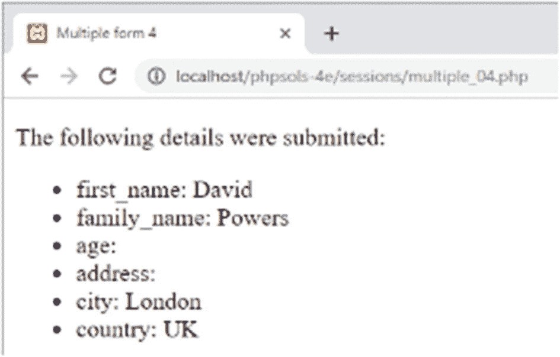

# PHP 解决方案 11-9：使用会话实现多页表单

顾名思义，隐藏字段是表单代码的一部分，但屏幕上不会显示任何内容。隐藏字段适合存储一两个项目，但假设你有一个分布在四页上的调查问卷。如果每页有 10 个项目，则总共需要 60 个隐藏字段（第二页 10 个，第三页 20 个，第四页 30 个）。**会话变量**可以省去所有这些编码工作。它们还可以确保访问者始终从多页表单的正确页面开始。

在本 PHP 解决方案中，你将构建一个用于多页表单的脚本，该脚本从 `$_POST` 数组中收集数据并将其分配给会话变量。如果有人试图直接访问表单的其他页面，该脚本会自动将用户重定向到表单的第一页。

1. 将 `ch11` 文件夹中的 `multiple_01.php`、`multiple_02.php`、`multiple_03.php` 和 `multiple_04.php` 复制到 `sessions` 文件夹。前三页包含简单的表单，用于询问用户的姓名、年龄和地址。每个 `<form>` 标签的 `action` 属性都设置为当前页面，因此表单是自处理的，但它们尚不包含任何处理脚本。最后一页将最终显示前三页的数据。

2. 在 `multiple_01.php` 的 `DOCTYPE` 声明上方的一个 PHP 代码块中添加以下代码：

```
if (isset($_POST['next'])) {
    session_start();
    // 设置一个变量来控制对其他页面的访问
    $_SESSION['formStarted'] = true;
    // 设置必填字段
    $required = 'first_name';
    $firstPage = 'multiple_01.php';
    $nextPage = 'multiple_02.php';
    $submit = 'next';
    require_once '../includes/multiform.php';
}
```

提交按钮的 `name` 属性是 `next`，因此仅当表单已提交时，此代码块中的代码才会运行。它会启动一个会话并创建一个会话变量，该变量将用于控制对其他表单页面的访问。

接下来是四个变量，它们将由处理多页表单的脚本使用：

- `$required`：这是一个数组，包含当前页面中必填字段的 `name` 属性。如果只有一个必填字段，则可以使用字符串而不是数组。如果没有必填字段，则可以省略。
- `$firstPage`：表单第一页的文件名。
- `$nextPage`：表单中下一页的文件名。
- `$submit`：当前页面中提交按钮的名称。

最后，代码包含了处理多页表单的脚本。

3. 在 `includes` 文件夹中创建一个名为 `multiform.php` 的文件。删除所有 HTML 标记并插入以下代码：

```
<?php
if (!isset($_SESSION)) {
    session_start();
}
$filename = basename($_SERVER['SCRIPT_FILENAME']);
$current = 'http://' . $_SERVER['HTTP_HOST'] . $_SERVER['PHP_SELF'];
```

多页表单的每一页都需要调用 `session_start()`，但在同一页上调用两次会导致错误，因此条件语句首先检查 `$_SESSION` 超全局变量是否可访问。如果不可访问，它会为当前页面启动会话。

条件语句之后，`$_SERVER['SCRIPT_FILENAME']` 被传递给 `basename()` 函数以提取当前页面的文件名。这与您在 PHP 解决方案 5-3 中使用的技术相同。

`$_SERVER['SCRIPT_FILENAME']` 包含父文件的路径，因此当此脚本被包含在 `multiple_01.php` 中时，`$filename` 的值将是 `multiple_01.php`，*而不会是* `multiform.php`。

下一行通过字符串 `http://` 以及 `$_SERVER['HTTP_HOST']`（包含当前域名）和 `$_SERVER['PHP_SELF']`（包含当前文件除域名外的路径）的值来构建当前页面的 URL。如果您在本地测试，当多页表单的第一页加载时，`$current` 将是 `http://localhost/phpsols-4e/sessions/multiple_01.php`。

4. 现在你已经有了当前文件的名称及其 URL，你可以使用 `str_replace()` 来创建第一页和下一页的 URL，如下所示：

```
$redirectFirst = str_replace($filename, $firstPage, $current);
$redirectNext = str_replace($filename, $nextPage, $current);
```

第一个参数是要替换的字符串，第二个参数是替换字符串，第三个参数是目标字符串。在第 2 步中，你将 `$firstPage` 设置为 `multiple_01.php`，将 `$nextPage` 设置为 `multiple_02.php`。因此，`$redirectFirst` 变成 `http://localhost/phpsols-4e/sessions/multiple_01.php`，而 `$redirectNext` 是 `http://localhost/phpsols-4e/sessions/multiple_02.php`。

5. 为防止用户不从头开始就访问多页表单，请添加一个条件语句来检查 `$filename` 的值。如果它不是第一页，并且 `$_SESSION['formStarted']` 尚未创建，则 `header()` 函数会重定向到第一页，如下所示：

```
if ($filename != $firstPage && !isset($_SESSION['formStarted'])) {
    header("Location: $redirectFirst");
    exit;
}
```

6. 脚本的其余部分会遍历 `$_POST` 数组，检查是否有必填字段为空，并将它们添加到 `$missing` 数组中。如果没有缺失项，`header()` 函数会将用户重定向到多页表单的下一页。`multiform.php` 的完整脚本如下所示：

```
     $value) {
    // 跳过提交按钮
    if ($key == $submit) continue;
    // 如果不是数组，则去除空白
    if (!is_array($value)) {
        $value = trim($value);
    }
    // 如果为空且是必填字段，则添加到 $missing 数组
    if (in_array($key, $required) && empty($value)) {
        $missing[] = $key;
        continue;
    }
    // 否则，分配给与 $key 同名的会话变量
    $_SESSION[$key] = $value;
}
// 如果没有必填字段缺失，则重定向到下一页
if (!$missing) {
    header("Location: $redirectNext");
    exit;
}
```

这段代码与第 6 章中用于处理反馈表单的代码非常相似，因此内联注释应该足以说明其工作原理。包裹新代码的条件语句使用 `$_POST[$submit]` 来检查表单是否已提交。我使用了变量而不是硬编码提交按钮的名称，以使代码更加灵活。虽然此脚本仅在表单提交后被包含在第一页中，但它直接被包含在其他页面中，因此有必要在此处添加条件语句。

提交按钮的名称和值始终包含在 `$_POST` 数组中，因此 `foreach` 循环使用 `continue` 关键字，以便在键与提交按钮的名称相同时跳过该项。这可以避免将不需要的值添加到 `$_SESSION` 数组中。有关 `continue` 的描述，请参见第 4 章的“跳出循环”。

7. 在 `multiple_02.php` 的 `DOCTYPE` 声明上方的一个 PHP 代码块中添加以下代码：

```
$firstPage = 'multiple_01.php';
$nextPage = 'multiple_03.php';
$submit = 'next';
require_once '../includes/multiform.php';
```


这段代码设置了 `$firstPage`、`$nextPage` 和 `$submit` 的值，并包含了你刚刚创建的处理脚本。此页面上的表单只包含一个可选字段，因此不需要 `$required` 变量。如果处理脚本在主页面中未设置该变量，它会自动创建一个空数组。

8.  在 `multiple_03.php` 中，在 `DOCTYPE` 声明上方的 PHP 代码块中添加以下内容：

```
// 设置必填字段
$required = ['city', 'country'];
$firstPage = 'multiple_01.php';
$nextPage = 'multiple_04.php';
$submit = 'next';
require_once '../includes/multiform.php';
```

这里有两个必填字段，因此它们的 `name` 属性被列为一个数组并赋值给 `$required`。其他代码与上一页中的相同。

9.  在 `multiple_01.php`、`multiple_02.php` 和 `multiple_03.php` 的 `<form>` 标签上方添加以下代码：

```
<?php
if ($missing) {
    echo '请修复以下必填字段：<ul>';
    foreach ($missing as $item) {
        echo "<li>$item</li>";
    }
    echo '</ul>';
}
?>
```

这会显示一个尚未填写的必填字段列表。

10. 在 `multiple_04.php` 中，在 `DOCTYPE` 声明上方的 PHP 代码块中添加以下代码，以便在用户不是从第一页进入表单时将其重定向回第一页：

```
<?php
session_start();
if (!isset($_SESSION['formStarted'])) {
    header('Location: http://localhost/phpsols-4e/sessions/multiple_01.php');
    exit;
}
?>
```

11. 在页面正文中，将以下代码添加到无序列表中以显示结果：

```
<?php
$expected = ['city', 'country', 'first_name', 'last_name', 'age'];
foreach ($expected as $key) {
    echo "<li>$key: " . htmlentities($_SESSION[$key]) . '</li>';
    // 删除会话变量
    unset($_SESSION[$key]);
}
?>
```

这段代码将表单字段的 `name` 属性列为一个数组，并将该数组赋值给 `$expected`。这是一种安全措施，用于确保你不会处理可能被恶意用户注入到 `$_POST` 数组中的虚假值。

然后，该代码取消设置 `$_SESSION['formStarted']`，并遍历 `$expected` 数组，使用每个值访问 `$_SESSION` 数组中的相关元素，并在无序列表中显示它。随后删除会话变量。逐个删除会话变量可以保留其他与会话相关的信息。

12. 保存所有页面，然后尝试在浏览器中加载表单的中间页面之一或最后一页。你应被重定向到第一页。在不填写任何字段的情况下点击“下一步”。系统将提示你填写 `first_name` 字段。填写必填字段并在每个页面点击“下一步”。最终页面上应显示结果，如图 11-5 所示。



图 11-5. 会话变量保留了来自多个页面的输入

你可以在 `ch11` 文件夹中将你的代码与 `multiple_01_done.php`、`multiple_02_done.php`、`multiple_03_done.php`、`multiple_04_done.php` 和 `multiform.php` 进行比对。

这只是一个多页面表单的简单演示。在实际应用中，当必填字段留空时，你需要保留用户输入。`multiform.php` 中的脚本可用于任何多页面表单，只需在表单提交后的第一页创建 `$_SESSION['formStarted']`，并在每个页面使用 `$required`、`$firstPage`、`$nextPage` 和 `$submit`。使用 `$missing` 数组来处理未填写的必填字段。

## 章节回顾

如果你在开始阅读本书时对 PHP 知之甚少或一无所知，那么你已不再属于新手行列，而是正在以许多有用的方式利用 PHP 的强大功能。希望到现在为止，你已经开始意识到相同或相似的技术会反复出现。你不应只是复制代码，而应开始识别那些可以按需调整的技术，然后自行实践。

本书的其余部分将继续扩展你的知识，但引入了一个新因素：MySQL 关系数据库（以及它的替代品 MariaDB），这将把你的 PHP 技能提升到一个更高的水平。下一章将介绍 MySQL，并向你展示如何为后续章节进行设置。

## 12. 数据库入门

动态网站与数据库相结合后，将呈现出全新的面貌。从数据库提取内容可以让你以静态网站无法实现（即使不是不可能）的方式呈现内容。脑海中浮现的例子包括 [Amazon.com](http://amazon.com) 等在线商店、BBC（[www.bbcnews.com](http://www.bbcnews.com)）等新闻网站，以及 Google 和 Bing 等大型搜索引擎。数据库技术使这些网站能够呈现成千上万，甚至数百万个独特的页面。即使你的目标远没有那么宏大，数据库也可以相对轻松地增加你网站的丰富内容。

PHP 支持所有主流数据库，包括 Microsoft SQL Server、Oracle 和 PostgreSQL，但它最常与开源 MySQL 数据库结合使用。根据 DB-Engines 排名，截至 2019 年初，MySQL 已成为第二广泛使用的数据库，这一地位已保持多年。然而，围绕 MySQL 的未来存在争议，谷歌和维基百科已转而使用 MariaDB（排名第 15 位）。一些主要的 Linux 发行版也已用 MariaDB 取代了 MySQL。本章首先简要讨论这两个数据库之间竞争的影响。

在本章中，你将学习以下内容：

* 了解数据库如何存储信息
* 选择与数据库交互的图形界面
* 创建用户帐户
* 使用适当的数据类型定义数据库表
* 备份数据并将其传输到另一台服务器


