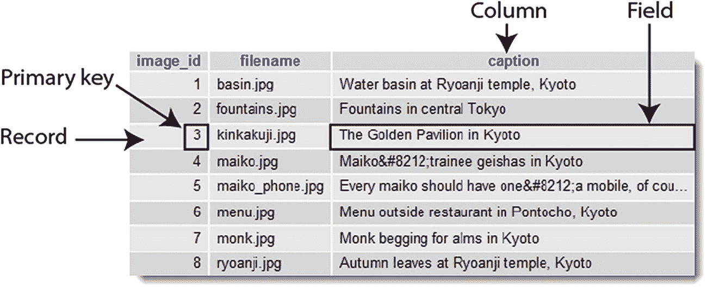
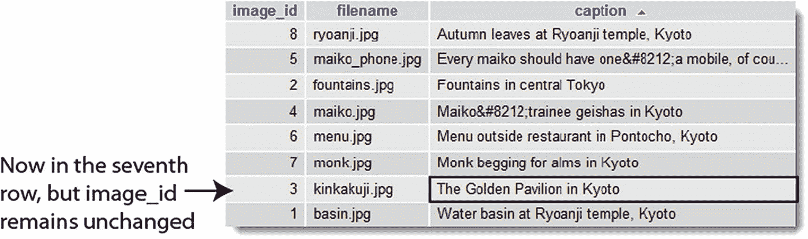
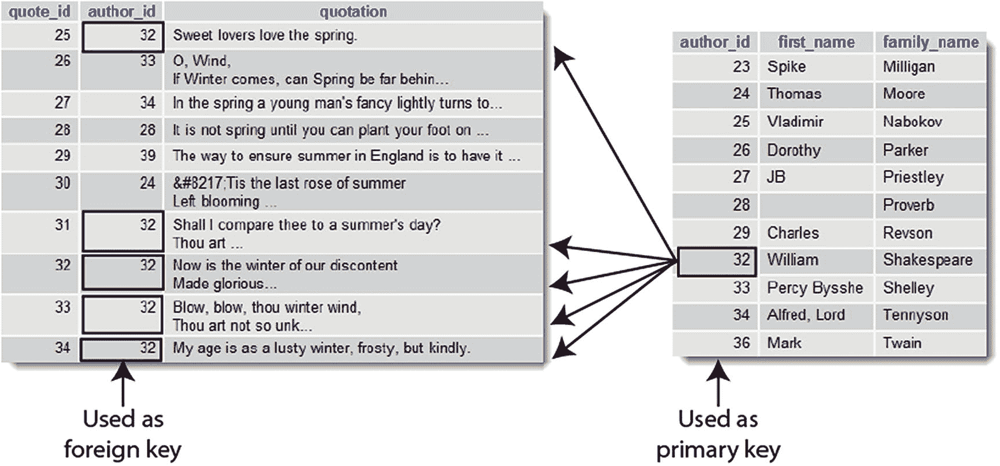

# MySQL 还是 MariaDB？

MySQL 最初由瑞典的 MySQL AB 公司开发，是一款免费的开源数据库。它迅速在个人开发者中流行起来，并被维基百科和 BBC 新闻等大型企业采用。然而，MySQL AB 于 2008 年被 Sun Microsystems 收购，而 Sun 又在两年后被主要商业数据库供应商 Oracle 收购。许多人认为这威胁到了 MySQL 作为免费开源数据库的持续生存。Oracle 公开表示：“MySQL 是 Oracle 完整、开放、集成战略中不可或缺的一部分。”但这并未打动 MySQL 的原始创建者之一 Michael “Monty” Widenius，他指责 Oracle 移除了 MySQL 的功能，并且在修复安全问题时反应迟缓。

由于 MySQL 代码是开源的，Widenius 将其分支出来创建了 MariaDB，并描述其为“MySQL 的增强型即插即用替代品”。此后，MariaDB 开始实现自身的新功能。尽管存在分歧，这两个数据库系统实际上几乎可以互换使用。MariaDB 的可执行文件与 MySQL 同名（macOS 和 Linux 上为 `mysqld`，Windows 上为 `mysqld.exe`）。主权限表也名为 `mysql`，默认存储引擎自称为 InnoDB，尽管它实际上是 InnoDB 的一个分支，名为 Percona XtraDB。

就本书中的代码而言，使用 MariaDB 还是 MySQL 应该没有区别。MariaDB 能理解所有 MySQL 特定的 PHP 代码。它也得到了我将在此后章节中使用的 phpMyAdmin 图形界面的支持。

> **注**：为避免重复，除非特别提及 MariaDB，否则所有对 MySQL 的引用均同样适用于 MariaDB。

## 数据库如何存储信息

关系型数据库（如 MySQL）中的所有数据都存储在表中，这与电子表格非常相似，信息按行和列组织。图 12-1 显示了本章稍后你将创建的数据库表，该表显示在 phpMyAdmin 中。

*图 12-1. 数据库表像电子表格一样以行和列存储信息*

每个**列**都有一个名称（`image_id`、`filename` 和 `caption`），指明其存储的内容。行没有标签，但第一列（`image_id`）包含一个称为**主键**的唯一值，用于标识与该行关联的数据。每一行包含一个独立的**记录**，记录相关数据。行与列交汇处，即数据存储的位置，称为**字段**。例如，图 12-1 中第三个记录的 `caption` 字段包含值“京都金阁寺”，该记录的主键是 3。

> **注**：“字段”和“列”这两个术语经常互换使用，尤其是在旧版 phpMyAdmin 中。字段为一个记录保存一条信息，而列则包含所有记录的相同字段。

## 主键如何工作

尽管图 12-1 显示 `image_id` 是从 1 到 8 的连续序列，但它们并非行号。图 12-2 显示了相同的表，但标题按字母顺序排序。图 12-1 中高亮显示的字段已移至第七行，但它仍然具有相同的 `image_id` 和 `filename`。

*图 12-2. 即使表以不同顺序排序，主键仍能标识行*

尽管主键很少显示，但它标识了记录及其存储的所有数据。一旦知道记录的主键，你就可以更新它、删除它，或者用它来在单独的页面中显示数据。不要担心如何找到主键。使用**结构化查询语言**（SQL），即与所有主流数据库通信的标准方式，可以轻松完成。重要的是要记住为每条记录分配一个主键。

> **提示**：有些人将 SQL 发音为“sequel”。其他人则逐个字母念作“ess-queue-ell”。MySQL 的官方发音是“My-ess-queue-ell”。

- 主键不必是数字，但*它必须是唯一的*。

- 产品编号是很好的主键。它们可能由数字、字母和其他字符组成，但始终是唯一的。社保号和员工 ID 号也是唯一的，但可能导致个人数据泄露，因为在检索或更新数据时，主键会附加到查询字符串中。

- MySQL 可以自动为你生成主键。

- 一旦分配了主键，它就不应重复，且永远不应更改。

由于主键必须唯一，MySQL 在删除记录时通常不会重用该编号。虽然这会留下序列中的间隙，但这并不重要。主键的目的是标识记录。任何试图填补间隙的行为都会严重危及数据库的完整性。

> **提示**：有些人希望移除序列中的间隙，以便跟踪表中的记录数。但正如你将在下一章中发现的，这并非必要。

## 用主键和外键链接表

与电子表格不同，大多数数据库将数据存储在几个较小的表中，而不是一个巨大的表中。这可以防止重复和不一致。假设你正在构建一个你最爱语录的数据库。与其每次输入作者姓名，不如将作者姓名放在一个单独的表中，并在每条语录中存储作者主键的引用，这样效率更高。如图 12-3 所示，左侧表中由 `author_id 32` 标识的每条记录都是威廉·莎士比亚的语录。

*图 12-3. 外键用于链接存储在独立表中的信息*

由于姓名只存储在一个地方，这保证了它始终拼写正确。而且，如果你确实犯了拼写错误，只需一次更正就能确保更改反映在整个数据库中。

将一个表中的主键存储在另一个表中，被称为创建**外键**。使用外键链接不同表中的信息是关系型数据库最强大的特性之一。这在早期阶段也可能难以掌握，因此我们将在第 17 章和第 18 章之前只使用单表，届时会详细讨论外键。与此同时，请牢记以下几点：

- 当用作表的主键时，该值在列内必须唯一。因此，图 12-3 右侧表中的每个 `author_id` 仅使用一次。

- 当用作外键时，可以多次引用同一个值。因此，`32` 在左侧表的 `author_id` 列中出现多次。