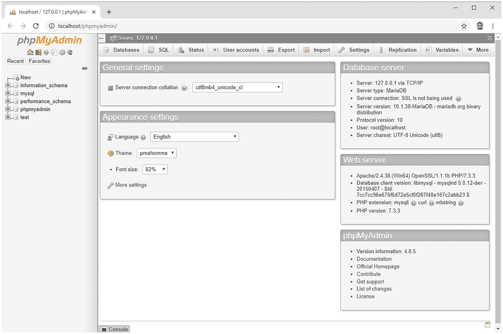

# 使用图形界面

与 MySQL 数据库交互的传统方式是通过命令提示符窗口或终端。但使用第三方图形界面（如 phpMyAdmin，一个基于浏览器的 MySQL 前端）要容易得多（见图 12-4）。

*图 12-4. phpMyAdmin 是一个免费的 MySQL 图形界面，可在浏览器中运行*

由于 phpMyAdmin (<http://www.phpmyadmin.net>) 随 XAMPP、MAMP 以及大多数其他免费的一体化软件包自动安装，因此本书选择了它作为用户界面。它易于使用，并具备设置和管理 MySQL 数据库所需的所有基本功能。它适用于 Windows、Mac OS X 和 Linux。许多托管公司都将其作为 MySQL 的标准界面提供。

如果你经常使用数据库，最终可能会想探索其他图形界面。其中一个值得关注的是 Navicat (<http://www.navicat.com/en/>)，这是一款付费产品，适用于 Windows、macOS 和 Linux。Navicat Cloud 服务还允许你通过 iPhone 或 iPad 管理数据库。Navicat 在网络开发者中尤其受欢迎，因为它能够将数据库从远程服务器计划备份到你的本地计算机。Navicat for MySQL 同时支持 MySQL 和 MariaDB。

## 启动 phpMyAdmin

如果你在 Windows 上运行 XAMPP，有三种方法可以启动 phpMyAdmin：

- 在浏览器地址栏中输入 `http://localhost/phpMyAdmin/`。
- 点击 XAMPP 控制面板中的 MySQL `Admin` 按钮。
- 在 XAMPP 管理页面（`http://localhost/xampp/`）的 `Tools` 下点击 `phpMyAdmin` 链接。

如果你在 macOS 上安装了 MAMP，请点击 MAMP 启动页面顶部菜单中的 `Tools` ➤ `phpMyAdmin`（点击 MAMP 控制小部件中的 `Open start page`）。

如果你手动安装了 phpMyAdmin，或者使用的是其他一体化软件包，请按照该软件包的说明操作，或者在浏览器地址栏中输入相应的地址（通常是 `http://localhost/phpmyadmin/`）。

