# 使用 phpMyAdmin 创建新数据库

在 phpMyAdmin 中创建新数据库非常简单。

#### 注意

`phpMyAdmin` 的发布周期较为频繁，用户界面时常会出现细微变化，偶尔也会有较大改动。以下说明及配套截图基于 `phpMyAdmin 4.8.5` 版本。虽然您所使用的版本可能与之存在差异，但基本操作流程应大致相同。

1. 启动 `phpMyAdmin`，在主窗口顶部选择 `数据库` 选项卡。

2. 在 `创建数据库` 下方的第一个字段中输入新数据库的名称（`phpsols`）。字段右侧的下拉菜单用于设置数据库的**排序规则**。排序规则决定了数据的排序方式。如下方截图所示，我安装环境中的默认设置为 `latin1_swedish_ci`。这反映了 MySQL 的瑞典血统。英语使用相同的排序顺序。其中的 `ci` 表示排序不区分大小写。如果您使用的语言并非英语、瑞典语或芬兰语，请从下拉菜单中选择 `utf8mb4_unicode_ci`。此选项几乎支持所有人类语言，并能避免多字节字符引发的问题。然后点击 `创建`。

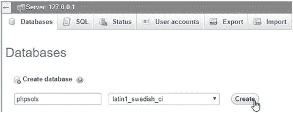

3. 屏幕上会短暂闪现在线确认数据库已创建成功的提示，随后出现的页面会引导您创建数据表：

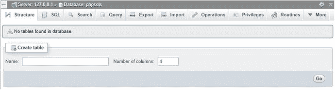

4. 在新数据库中创建数据表之前，建议先为其创建用户帐户。请保持 `phpMyAdmin` 处于打开状态，因为您将在下一节中继续使用它。

## 创建特定于数据库的用户帐户

新安装的 MySQL 通常只有一个注册用户——名为 “root” 的超级用户帐户，它拥有对一切内容的完全控制权。（XAMPP 还会创建一个名为 “pma” 的用户帐户，`phpMyAdmin` 会使用它来启用本书未涉及的高级功能。）root 用户*绝不应*用于除顶级管理（例如创建和删除数据库、创建用户帐户、导出和导入数据）之外的任何其他操作。每个独立的数据库都应至少拥有一个——最好是两个——权限有限的专用用户帐户。

当您将数据库部署上线时，应授予用户所需的最少权限，并且不要给予更多。有四个重要的权限——均以对应的 SQL 命令命名：

* `SELECT`：从数据库表中检索记录

* `INSERT`：向数据库中插入记录

* `UPDATE`：更改现有记录

* `DELETE`：删除记录（但不删除数据表或数据库，后者对应的命令是 `DROP`）

大多数情况下，访问者只需检索信息，因此 `psread` 用户帐户将仅拥有 `SELECT` 权限，属于只读帐户。然而，对于用户注册或站点管理，您则需要全部四个权限。这些权限将授予 `pswrite` 帐户。

## 授予用户权限

1. 在 `phpMyAdmin` 中，点击屏幕左上角的小房子图标返回主屏幕。然后点击 `用户帐户` 选项卡（在旧版 `phpMyAdmin` 中，它被称为 `用户`）。

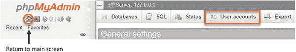

2. 在 `用户帐户概览` 页面上，点击页面中部的 `添加用户帐户` 链接。

3. 在打开的页面中，于 `用户名` 字段中输入 `pswrite`（或您想要创建的用户帐户名称）。从 `主机名` 下拉菜单中选择 `本地`。这会在旁边的字段中自动填入 `localhost`。选择此选项允许 `pswrite` 用户仅从同一台计算机连接到 MySQL。然后在 `密码` 字段中输入密码，并在 `重新输入` 字段中再次输入以确认。

**注意** 在本书的示例文件中，我使用了 `0Ch@Nom1$u` 作为密码。MySQL 密码是区分大小写的。

3. 在 `Login Information` 表格下方，是标有 `Database for user account`（用户账户数据库）和 `Global privileges`（全局权限）的区域。忽略这两部分。向下滚动到页面底部，点击 `Go` 按钮。

4. 页面将确认用户已创建，并提供编辑用户权限的选项。点击 `Edit privileges` 上方的 `Database` 按钮：


5. 在 `Database-specific privileges`（数据库特定权限）下，从列表中选择 `phpsols`（如有必要，激活标有 `Add privileges on the following database(s)` 的下拉菜单），然后点击 `Go`。

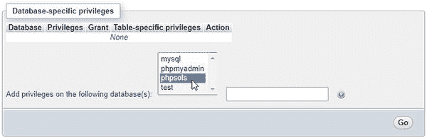

注意 MySQL 有三个默认数据库：`information_schema`（一个只读的虚拟数据库，包含同一服务器上所有其他数据库的详细信息）；`mysql`（包含所有用户账户和权限的详细信息）；以及 `test`（空的）。除非你确定自己在做什么，否则不应直接编辑 `mysql` 数据库。

6. 下一个屏幕允许你仅为此用户设置对 `phpsols` 数据库的权限。你需要让 `pswrite` 拥有之前列出的全部四个权限，因此请勾选 `SELECT`、`INSERT`、`UPDATE` 和 `DELETE` 旁边的复选框。

如果将鼠标悬停在每个选项上，phpMyAdmin 会显示一个工具提示，描述该选项的用途，如图所示。选择这四个权限后，点击 `Go`。

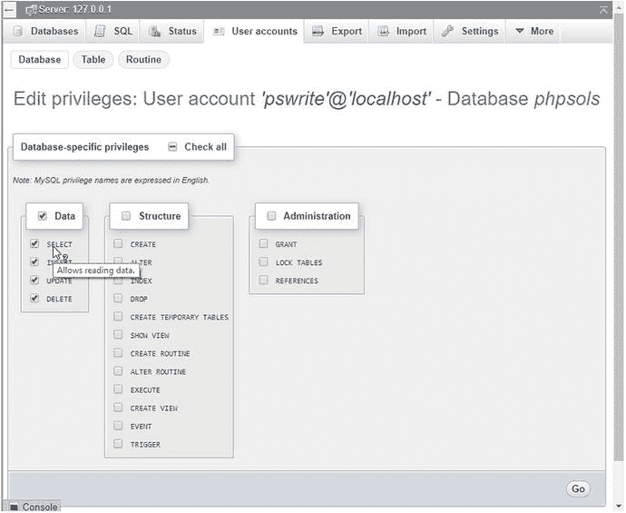

警告 phpMyAdmin 的许多屏幕中有多个 `Go` 按钮。请始终点击包含你要设置的选项所在部分的底部或旁边的按钮。

7. phpMyAdmin 会确认 `pswrite` 用户账户的权限已更新；页面再次显示 `Database-specific privileges` 表格，以便你进行任何修改。点击页面顶部的 `User accounts` 标签，返回 `User accounts overview`（用户账户概览）。

8. 点击 `Add user account`（添加用户账户），重复步骤 3 到 8，创建第二个名为 `psread` 的用户账户。此用户的权限将受到更多限制，因此在执行步骤 7 时，只需勾选 `SELECT` 选项。在示例文件中，`psread` 使用的密码是 `K1yoMizu^dera`。

## 创建数据库表

现在你已有一个数据库和专用的用户账户，可以开始创建表了。让我们首先创建一个存储图片详细信息的表，如图 12-1 本章开头所示。在开始输入数据之前，你需要定义表结构。这包括确定以下内容：

*   表的名称

*   它将包含多少列

*   每列的名称

*   每列将存储什么类型的数据

*   列是否必须在每个字段中都包含数据

*   哪一列包含表的主键

如果查看图 12-1，你会看到该表包含三列：`image_id`（主键）、`filename` 和 `caption`。由于它包含图片细节，因此“images”是一个适合用作表名的好名字。存储文件名而不存储说明没什么意义，因此每列都必须包含数据。太好了！除了数据类型，所有决策都已做出。我将在过程中解释数据类型。

### 定义 Images 表

以下说明展示了如何在 phpMyAdmin 中定义表。如果你更愿意使用 Navicat 或其他 MySQL 用户界面，请使用表 12-1 中的设置。

**表 12-1.** `images` 表的设置

## 使用 phpMyAdmin 创建表

| 字段 | 类型 | 长度/值 | 属性 | 空值 | 索引 | A_I |
| --- | --- | --- | --- | --- | --- | --- |
| `image_id` | `INT` | | `UNSIGNED` | 未选中 | `PRIMARY` | 已选中 |
| `filename` | `VARCHAR` | `25` | | 未选中 | | |
| `caption` | `VARCHAR` | `120` | | 未选中 | | |

1. 启动 phpMyAdmin（如果尚未打开），从屏幕左侧的数据库列表中选择 `phpsols`。这将打开 `Structure` 选项卡，并报告数据库中未找到任何表。

2.  在 `Create table` 部分，在 `Name` 字段中输入新表的名称（`images`），并在 `Number of columns` 字段中输入 `3`。然后点击 `Go` 按钮。

3.  下一个屏幕用于定义表。这里有很多选项，但并非所有都需要填写。表 12-1 列出了 `images` 表的设置。

    第一列 `image_id` 被定义为 `INT` 类型，代表整数。其属性设置为 `UNSIGNED`，这意味着只允许正数。当你从索引下拉菜单中选择 `PRIMARY` 时，phpMyAdmin 会打开一个模式面板，你可以在其中指定高级选项。接受默认设置，然后点击 `Go` 关闭面板。接着，选中 `A_I`（`AUTO_INCREMENT`）复选框。这告诉 MySQL，每当插入新记录时，自动在该列插入下一个可用数字（从 1 开始）。

    下一列 `filename` 被定义为 `VARCHAR` 类型，长度为 `25`。这意味着它最多接受 25 个字符的文本。

    最后一列 `caption` 也是 `VARCHAR` 类型，长度为 `120`，因此它最多接受 120 个字符的文本。

    所有列的 `Null` 复选框均未选中，因此它们必须始终包含内容。不过，这个“内容”可以是一个空字符串。我将在本章后面的“在 MySQL 中选择正确的数据类型”部分更详细地描述列类型。

    以下截图显示了在 phpMyAdmin 中设置完这些选项后的状态（`A_I` 右侧的列已被省略，因为它们无需填写）：

    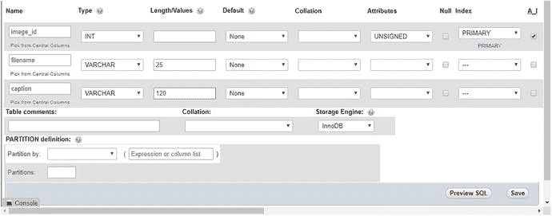

    屏幕底部有一个 `Storage Engine`（存储引擎）选项。这决定了数据库文件内部存储的格式。自 MySQL 5.5 以来，InnoDB 一直是默认引擎。在此之前，MyISAM 是默认引擎。我将在第 17 章中解释这些存储引擎之间的差异。在此之前，请使用 InnoDB。从一个存储引擎转换到另一个非常简单。

    完成后，点击屏幕底部的 `Save` 按钮。

**提示**

如果你点击的是 `Go` 而不是 `Save`，phpMyAdmin 会添加一个额外的列供你定义。如果发生这种情况，只需点击 `Save`。只要你不向字段中输入值，phpMyAdmin 就会忽略这个额外的列。

1.  下一个屏幕列出 `images` 表，并显示一系列你可以对该表执行的操作。在 `Action` 下，点击 `Structure`，或者点击屏幕顶部的 `Structure` 选项卡。这会显示你刚刚创建的表的详细信息。

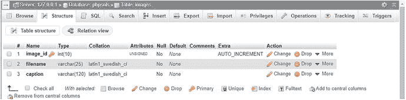

`image_id` 右侧的**金色钥匙**图标表示它是该表的主键。要编辑任何设置，请点击相应行的 `Change`。这会打开之前的屏幕并允许你更改值。

**提示**

如果你完全搞砸了并想重新开始，请点击屏幕顶部的 `Operations` 选项卡。然后，在 `Delete data or table` 部分，点击 `Delete the table (DROP)` 并确认你想要删除该表。（在 SQL 中，*delete* 仅指记录。而删除列、表或数据库则用 *drop*。）

## 向表中插入记录

既然你已经有了表，就需要向其中放入一些数据。最终，你需要使用 HTML 表单、PHP 和 SQL 来构建自己的内容管理系统，但使用 phpMyAdmin 是快速简便的方法。

### 使用 phpMyAdmin 手动插入记录

以下说明演示了如何通过 phpMyAdmin 界面将记录添加到 `images` 表。

1.  如果 phpMyAdmin 仍在显示上一节末尾的 `images` 表结构，请跳到步骤 2。否则，启动 phpMyAdmin 并从左侧列表中选择 `phpsols` 数据库。然后，点击 `images` 右侧的 `Structure`，如下截图所示：

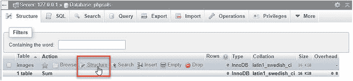

**提示**

主框架顶部的面包屑导航提供了页面头部各选项卡的上下文。前面截图中左上角的 `Structure` 选项卡是指 `phpsols` 数据库的结构。要访问单个表的结构，请点击该表名称旁边的 `Structure` 链接。

1.  点击页面顶部中央的 `Insert` 选项卡。这将显示以下屏幕，供你插入多达两条记录：

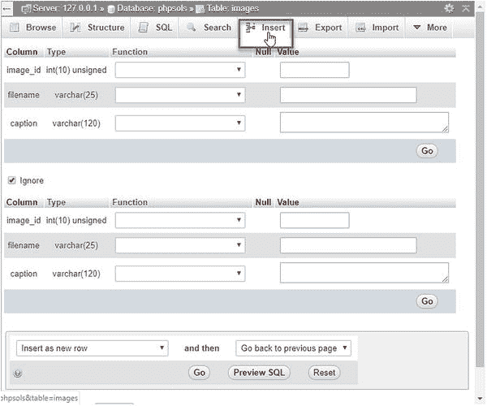

1.  表单显示了每个列的名称和详细信息。你可以忽略 `Function` 字段。MySQL 拥有大量函数，你可以将它们应用于存储在表中的值。你将在接下来的章节中了解更多有关它们的信息。`Value` 字段是你输入要插入到表中的数据的地方。

    由于你已经将 `image_id` 定义为 `AUTO_INCREMENT`，MySQL 会自动插入下一个可用数字。因此，你*必须*将 `image_id` 的 `Value` 字段留空。按如下方式填写接下来的两个 `Value` 字段：

    *   `filename`：`basin.jpg`

    *   `caption`：`京都龙安寺水盆`

2.  在第二个表单中，将 `image_id` 的 `Value` 字段留空，并按如下方式填写接下来的两个字段：

    *   `filename`：`fountains.jpg`

    *   `caption`：`东京市中心喷泉`

    通常，当你向第二个表单添加值时，`Ignore` 复选框会自动取消选中，但如果需要，请手动取消选中。

1.  点击第二个表单底部的 `Go` 按钮。用于插入记录的 SQL 语句将显示在页面顶部。我将在剩余章节中解释基本的 SQL 命令，但研究 phpMyAdmin 显示的 SQL 是学习如何构建自己的查询的好方法。SQL 在很大程度上基于人类语言，因此并不难学。

2.  点击页面左上角的 `Browse` 选项卡。你现在应该看到 `images` 表中的前两条条目，如下所示：


如你所见，MySQL 已在 `image_id` 字段中插入 `1` 和 `2`。你可以继续输入其余六张图像的详细信息，但让我们用一个包含所有必要数据的 SQL 文件来加快速度。

### 从 SQL 文件加载图像记录

由于 `images` 表的主键已设置为 `AUTO_INCREMENT`，因此需要删除该表及其所有数据。SQL 文件会自动执行此操作，并从头开始构建表。以下说明假定 phpMyAdmin 已打开到上一节第 6 步的页面。

1.  如果你不介意覆盖`images`表中的数据，请跳到步骤 2。但是，如果你已输入不想丢失的数据，请将数据复制到另一个表中。点击页面顶部的`Operations`选项卡（根据屏幕大小，`Operations`可能隐藏在最右侧的`More`中），在`Copy table to (database.table)`部分的空白字段中输入新表的名称，然后点击`Go`。以下截图显示了将`phpsols`数据库中的`images`表的结构和数据复制到`images_backup`的设置。

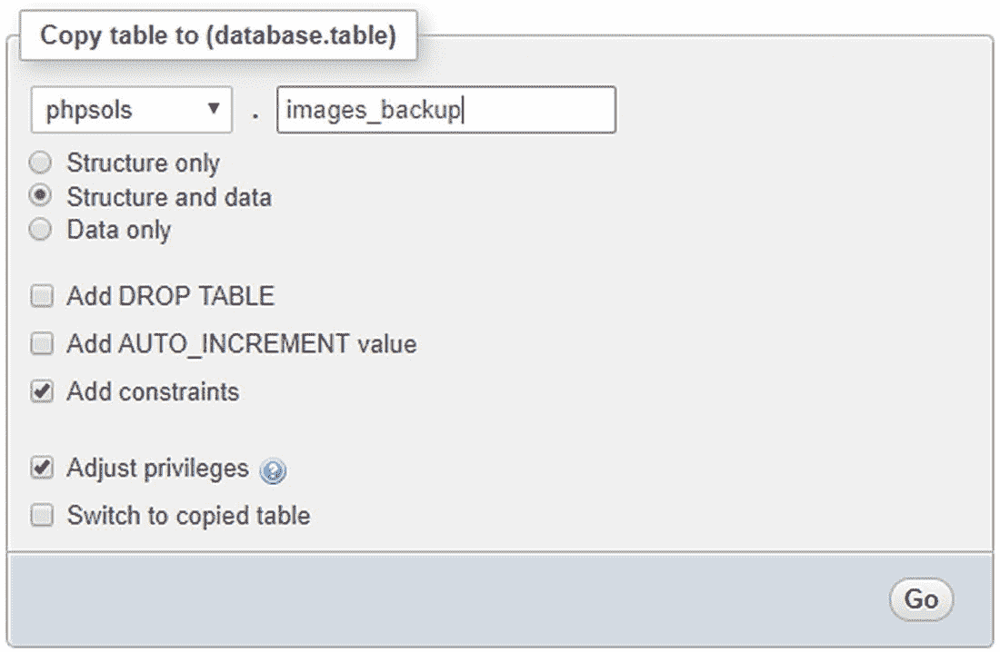

点击`Go`后，您会看到已复制表的确认信息。页面顶部的面包屑导航指示`phpMyAdmin`仍停留在`images`表中，因此即使屏幕上显示的是另一个页面，您也可以继续执行步骤 2。

2.  点击页面顶部的`Import`选项卡。在下一个屏幕中，点击`File to import`中的`Browse`（或`Choose File`）按钮，然后导航至`ch12`文件夹中的`images.sql`。将所有选项保留为默认设置，并点击页面底部的`Go`。

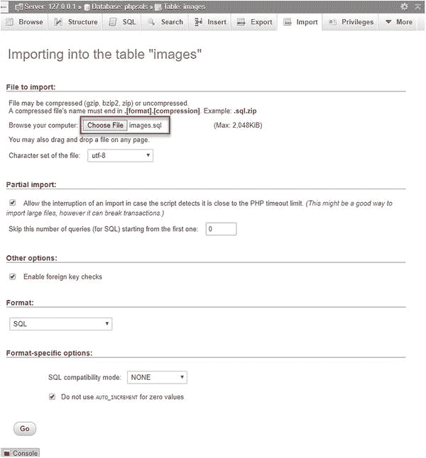

3.  `phpMyAdmin`会删除原始表，创建一个新版本，并插入所有记录。当看到文件已导入的确认信息后，点击页面左上角的`Browse`按钮。现在您应该能看到与本章开头图 12-1 中相同的数据。

如果使用文本编辑器打开`images.sql`，您会看到它包含创建`images`表并填充数据的 SQL 命令。该表的构建方式如下：

```
DROP TABLE IF EXISTS `images`;
CREATE TABLE `images` (
`image_id` int(10) unsigned NOT NULL,
`filename` varchar(25) NOT NULL,
`caption` varchar(120) NOT NULL
) ENGINE=InnoDB  DEFAULT CHARSET=latin1;
```

设置主键和自增（`auto_increment`）的命令位于文件末尾。

像这样从 SQL 文件导入数据，就是将数据从本地测试环境传输到网站所在远程服务器的方式。假设您的托管公司提供了`phpMyAdmin`来管理远程数据库，那么要传输数据，您只需启动远程服务器上的`phpMyAdmin`，点击`Import`选项卡，选择本地计算机上的 SQL 文件，然后点击`Go`即可。下一节将描述如何创建 SQL 文件。

## 创建用于备份和数据传输的 SQL 文件

`MySQL`不会将数据库存储为可以简单上传到网站的单个文件。即使您找到了正确的文件，除非`MySQL`服务器已关闭，否则很可能会损坏它们。无论如何，大多数托管公司都不允许您上传原始文件，因为这也意味着要关闭他们的服务器，给每个人带来极大的不便。

不过，将数据库从一个服务器迁移到另一个服务器是很容易的。它只需要创建数据的备份**转储**（`dump`），然后使用`phpMyAdmin`或任何其他数据库管理程序将其加载到另一个数据库中。转储文件是一个文本文件，包含填充单个表甚至整个数据库所需的所有 SQL 命令。`phpMyAdmin`可以创建整个`MySQL`服务器、单个数据库、选定表或单个表的备份。

> **提示**
>
> 在您准备好将数据传输到另一个服务器或创建备份之前，不需要阅读如何创建转储文件的详细信息。

为简单起见，以下说明仅展示如何备份单个数据库。

1.  在`phpMyAdmin`中，从左侧列表中选择`phpsols`数据库。如果已选择了该数据库，请点击屏幕顶部的`Database: phpsols`面包屑链接，如下所示：


2.  从屏幕顶部的选项卡中选择`Export`。

3.  有两种导出方式：`Quick`（快速）和`Custom`（自定义）。`Quick`方式只有一个用于导出文件格式的选项。默认为`SQL`，因此您只需点击`Go`，`phpMyAdmin`就会创建 SQL 转储文件并将其保存到浏览器的默认`Downloads`文件夹中。该文件与数据库同名，因此对于`phpsols`数据库，文件名为`phpsols.sql`。

4.  `Quick`方式适用于导出少量数据，但通常您需要对导出选项有更多控制；请选择`Custom`单选按钮。这里有很多选项，让我们逐个部分地看看。

5.  `Format`部分默认选择`SQL`，但也提供了一系列其他格式，包括`CSV`、`JSON`和`XML`。

6.  `Table(s)`部分列出了数据库中的所有表。默认情况下，所有表都被选中，但您可以通过取消选中不需要的选项复选框来选择要导出的表。在下面的截图中，只选择了`images`表的结构和数据，因此不会导出`images_backup`。

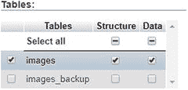

> **提示**
>
> 备份单个表而不是整个数据库通常是个好主意，因为大多数`PHP`服务器被配置为将上传限制在 2 MB。如下一步所述，压缩转储文件也有助于解决大小限制问题。

7.  `Output`部分有几个有用的选项。

选中标记为`Rename exported databases/tables/columns`的复选框会启动一个模态面板，您可以在其中指定新名称。

`Use LOCK TABLES statement`复选框会添加命令，以防止在转 dump 文件用于导入数据和/或结构时，其他人插入、更新或删除记录。

还有一些单选按钮，让您可以选择将 SQL 转储保存到文件（这是默认选项）或将输出显示为文本。如果您想在创建文件之前检查生成的 SQL，将输出显示为文本会很有用。

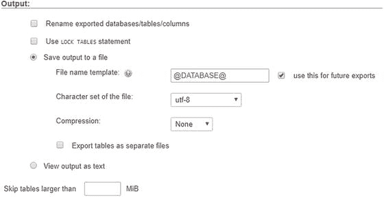

`File name template`包含位于`@`标记之间的值。这将根据服务器、数据库或表自动生成文件名。一个非常酷的功能是，您可以使用`PHP strftime()`格式化字符（参见[`https://secure.php.net/manual/en/function.strftime.php`](https://secure.php.net/manual/en/function.strftime.php)）来增强模板。例如，您可以就在文件扩展名之前自动将当前日期添加到文件名中，如下所示：

```
@DATABASE@_%Y-%m-%d
```

`Character set of the file`的默认值是`utf-8`。仅当您的数据以特定区域格式存储时，才需要更改此项。

默认情况下，转储文件不会被压缩，但下拉菜单提供了使用`zip`、`gzip`或`bzip`压缩的选项。这可以大大减小转储文件的大小，从而加快数据传输速度。导入压缩文件时，`phpMyAdmin`会自动检测压缩类型并解压。

最后一个选项允许您跳过大于指定 MB 数的文件。

好的，作为高级文档工程师和翻译员，我将严格遵守您提供的注意事项，将给定的英文文本（已内嵌在您提供的内容中）翻译成中文。

2. 在`Format-specific options`中，选项取决于步骤 5 中选择的格式。对于 SQL，你可以选择在转储文件中显示注释，并将导出内容包含在事务中。使用事务的价值在于，如果因错误导致导入中断，数据库会回滚到之前的状态。

其他选项包括禁用外键检查、将视图导出为表以及导出元数据。最后，还可以选择最大化与不同数据库系统或旧版 MySQL 的兼容性。通常，该值应设置为默认值：`NONE`。

3. `Object creation options`部分允许你微调用于创建数据库和表的 SQL。以下截图显示了默认设置。

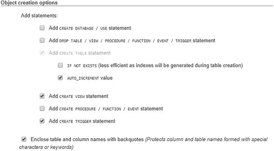

创建备份时，通常建议选中`Add DROP TABLE / VIEW / PROCEDURE / FUNCTION / EVENT / TRIGGER statement`复选框，因为备份通常用于替换已损坏的现有数据。

最后一个复选框默认选中，它会将表和列名用反引号（backticks）括起来，以避免名称中包含无效字符或使用保留字时出现问题。建议始终保留此项选中状态。

4. `Data creation options`部分控制数据如何插入到表中。大多数情况下，默认设置即可。不过，你可能对修改前四个选项感兴趣，如下截图所示。

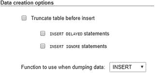

第一个复选框允许你在插入数据前清空表。如果你想替换现有数据（例如数据已损坏），这会很有用。

另外两个复选框会影响`INSERT`命令的执行方式。`INSERT DELAYED`不适用于默认的`InnoDB`表。此外，从 MySQL 5.6.6 开始已弃用它，因此最好避免使用。

`INSERT IGNORE`会跳过错误，例如主键重复。就个人而言，我认为最好能收到错误警报，因此不推荐使用它。

标记为`Function to use when dumping data`的下拉菜单允许你选择`INSERT`、`UPDATE`或`REPLACE`。默认使用`INSERT`插入新记录。如果选择`UPDATE`，则仅更新现有记录。`REPLACE`会在必要时更新，并在记录不存在时插入新记录。

5. 完成所有选择后，点击页面底部的`Go`。现在，你拥有一个备份，可用于将数据库内容迁移到另一台服务器。

> **提示**
>
> 默认情况下，由 phpMyAdmin 创建的文件仅包含用于创建和填充数据库表的 SQL 命令。除非你选择自定义选项，否则它不包含创建数据库的命令。这意味着你可以将表导入任何数据库，而不必与本地测试环境中的数据库同名。

选择 MySQL 中的正确数据类型


当为`image_id`列选择`Type`时，你可能会感到有些震惊。phpMyAdmin 列出了所有可用数据类型——在 MySQL 8 和 MariaDB 10 中有超过 40 种。为了避免不必要的细节让你困惑，我将仅解释最常用的数据类型。你可以在 MySQL 文档中找到所有数据类型的完整详情，网址为：[`https://dev.mysql.com/doc/refman/8.0/en/data-types.html`](https://dev.mysql.com/doc/refman/8.0/en/data-types.html)。

## 存储文本

主要文本数据类型之间的区别归结为单个字段中可存储的最大字符数、对尾随空格的处理，以及是否可以设置默认值。

*   `CHAR`：定长字符串。你必须在`Length/Values`字段中指定所需长度。最大允许值为 255。在内部，字符串会用空格右填充到指定长度，但在检索值时尾随空格会被去除。你可以定义默认值。

*   `VARCHAR`：可变长字符串。你必须指定计划使用的最大字符数（在 phpMyAdmin 中，在`Length/Values`字段中输入该数字）。最大字符数为 65,535。如果存储的字符串带有尾随空格，检索时会保留这些空格。接受默认值。

*   `TEXT`：存储最多 65,535 个字符的文本（大约比本章篇幅长 50%）。不能定义默认值。

`TEXT`很方便，因为你不需要指定最大大小（实际上，你也不能指定）。尽管`VARCHAR`和`TEXT`的最大大小都是 65,535 个字符，但有效大小会更少，因为一行中所有列可存储的最大数据量是 65,535 字节。

**提示**

保持简单：对于短文本项使用`VARCHAR`，对于较长文本项使用`TEXT`。`VARCHAR`和`TEXT`列仅占用存储输入值所需的磁盘空间。`CHAR`列始终分配声明长度所需的全部空间，即使为空也是如此。

## 存储数字

最常用的数字列类型如下：

*   `INT`：介于-2,147,483,648 和 2,147,483,647 之间的任何整数（整数）。如果列声明为`UNSIGNED`，则范围是 0 到 4,294,967,295。

*   `FLOAT`：浮点数。你可以选择指定两个以逗号分隔的数字来限制范围。第一个数字指定最大位数，第二个数字指定小数点后应有多少位。由于 PHP 会在计算后格式化数字，我建议使用不带可选参数的`FLOAT`。

*   `DECIMAL`：带小数的数字；小数点后包含固定位数。定义表时，你需要指定最大位数以及小数点后应有多少位。在 phpMyAdmin 中，在`Length/Values`字段中输入以逗号分隔的数字。例如，`6,2`允许-9999.99 到 9999.99 范围内的数字。如果不指定大小，当值存储在此类型列中时，小数部分会被截断。

`FLOAT`和`DECIMAL`的区别在于精度。浮点数被视为近似值，容易受到舍入误差的影响（详细说明请参阅[`https://dev.mysql.com/doc/refman/8.0/en/problems-with-float.html`](https://dev.mysql.com/doc/refman/8.0/en/problems-with-float.html)）。请使用`DECIMAL`存储货币。

**注意**

不要使用逗号或空格作为千位分隔符。除数字外，数字中仅允许使用负号（-）和小数点（.）。

## 存储日期和时间

MySQL 仅以一种格式存储日期：`YYYY-MM-DD`。这是 ISO（国际标准化组织）批准的标准，避免了不同国家惯例中固有的歧义。我将在第 16 章中回到日期主题。最重要的日期和时间列类型如下：

*   `DATE`：以`YYYY-MM-DD`格式存储的日期。范围是`1000-01-01`到`9999-12-31`。

*   `DATETIME`：组合的日期和时间，以`YYYY-MM-DD HH:MM:SS`格式显示。

*   `TIMESTAMP`：时间戳（通常由计算机自动生成）。合法值范围从 1970 年初到 2038 年 1 月中旬。

### 警告

**警告**：MySQL 的时间戳采用与 `DATETIME` 相同的格式，这意味着它们与基于 1970 年 1 月 1 日以来秒数的 Unix 和 PHP 时间戳不兼容。切勿混用。

## 存储预定义列表

MySQL 允许存储两种可被视为数据库版单选按钮和复选框状态的预定义列表：

- `ENUM`：此列类型从预定义列表中存储单个选项，例如“是、否、不知道”或“100–110 V、220–240 V”。预定义列表最多可存储的项目数量令人难以置信——高达 65,535 个——这称得上是一个庞大的单选按钮组！

- `SET`：此列类型从预定义列表中存储零个或多个选项。该列表最多可容纳 64 个选项。

尽管 `ENUM` 相当有用，但 `SET` 往往不那么有用，这主要是因为其违反了每个字段只存储一条信息的原则。`SET` 适用的场景包括记录汽车的可选附加配置或调查问卷中的多选答案。

## 存储二进制数据

存储图像等二进制数据并非好主意。它会使数据库变得臃肿，而且无法直接从数据库中显示图像。不过，以下列类型是为二进制数据设计的：

- `TINYBLOB`：最大 255 字节

- `BLOB`：最大 64 KB

- `MEDIUMBLOB`：最大 16 MB

- `LONGBLOB`：最大 4 GB

尽管名字如此奇特，但发现 `BLOB` 代表**二进制大对象**（**binary large object**）时，难免会感到有些失望。

## 章节回顾

本章大部分内容致力于理论，阐述了良好数据库设计的基本原则。你需要仔细规划数据库结构，将重复信息移至单独的表中，而不是像电子表格那样将所有信息都塞进一个巨大的表里。只要为表中的每条记录赋予一个唯一标识符（即主键），你就能跟踪信息，并通过外键将其与其他表中的相关记录关联起来。外键的概念起初可能难以理解，但在阅读完本书后，你就能豁然开朗。

你还学习了如何创建具有有限权限的 MySQL 用户账户，以及如何定义表并使用 SQL 文件导入和导出数据。下一章中，你将使用 PHP 连接到 `phpsols` 数据库，以显示 `images` 表中存储的数据。
